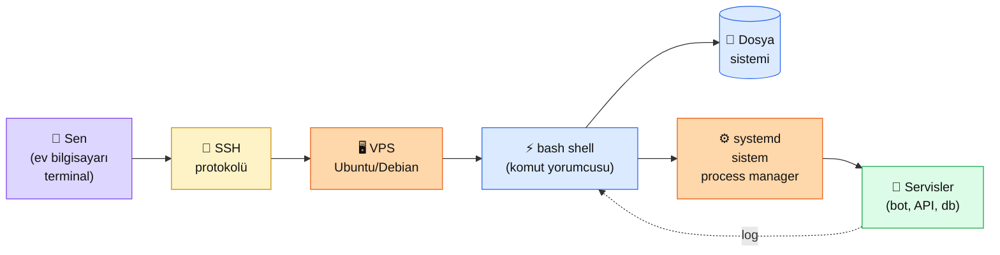

# 0.1 VPS ve Linux Komutları

<div class="ma-meta" markdown>
<div class="ma-meta-row" markdown>
<strong>Kim için:</strong>
<span class="ma-persona ma-persona-baslangic">🟢 başlangıç</span>
<span class="ma-persona ma-persona-is">🔵 iş</span>
<span class="ma-persona ma-persona-kisisel">🟣 kişisel</span>
</div>
<div class="ma-meta-row"><strong>📋 Önkoşul:</strong> Yok — sıfırdan başlıyorsun. Bilgisayarında bir terminal uygulaması olması yeter (Mac/Linux'ta hazır; Windows için [Windows Terminal](https://aka.ms/terminal) indirmen gerek)</div>
<div class="ma-meta-row"><strong>🎯 Çıktı:</strong> Bir VPS'e **SSH ile bağlanırsın**; **15 temel Linux komutunu** kendi cümlelerinle anlatabilirsin; bir dosya oluşturur, içine yazı yazar, kaydeder, görüntülersin; `systemctl status` ile canlı bir servisin durumunu sorgulayabilirsin.</div>
</div>

!!! tip "Yabancı kelime mi gördün?"
    Bu sayfadaki **italik-altı çizili** ifadelerin (SSH, shell, systemd gibi) üstüne mouse'unu getir — kısa tanım çıkar. Mobilde dokun.

## Neden bu sayfa?

AI servisi = **7/24 çalışması gereken** bir program. Senin ev bilgisayarın kapandığında bot da ölür. Çözüm: bir **VPS** (Virtual Private Server) — internette bir yerde duran, hep açık bir Linux makinesi. Hetzner, DigitalOcean, AWS, Oracle — sağlayıcı fark etmez, hepsinde benzer.

İkincisi: VPS'te arayüz **yok** — tıklama yok, klavye var. "Siyah ekrana komut yazmak" ilk başta ürkütücü gelir ama 15-20 komut öğrenince rahatlıkla yönetirsin. Bu sayfa o 15 komutu **"neyi niye yaparım"** açıklamasıyla veriyor — ezber değil, refleks kurma amaçlı.

Üçüncüsü: Claude Code ve Anthropic'in agent SDK'ları **VPS'te yaşar** — development bilgisayarında değil. Bölüm 6'da agent yazarken sen Claude Code'u SSH ile VPS'te çalıştıracaksın. Bu temel olmadan ileri bölümler **havada kalır.**

## VPS ve Linux kısaca — üç paragraf, matematiksiz

**VPS = kiraladığın "uzaktaki bilgisayar".** Ayda $5-20 civarında başlar. İnternete bağlı, her zaman açık, kendi IP'si var (senin: `89.167.90.113` gibi bir rakam). Sen kendi bilgisayarından **SSH** (Secure Shell) protokolüyle bağlanırsın — bir komut yazarsın, VPS çalıştırır, cevabı sana gösterir. Sanki o uzaktaki bilgisayarın klavyesinin başına oturmuşsun gibi.

**Shell = komut çalıştırdığın aracı.** Linux VPS'lerde default `bash` veya `zsh` shell. Komut yazarsın, Enter basarsın, çalışır. Yanlış komut = hata mesajı (ama çoğu durumda **geri alınamaz** — `rm` komutu çöp kutusu göstermez, direkt siler). Bu yüzden emin olmadığın komutu önce çalışmayan bir test klasöründe dene.

**systemd = "servislerin yöneticisi".** Senin botun sürekli çalışsın istiyorsan, VPS açılınca bot otomatik başlasın istiyorsun, çökerse otomatik restart olsun istiyorsun. Bu işleri systemd yapıyor. 2026 Linux dağıtımlarının **hepsinde** default — Debian, Ubuntu, CentOS, Arch, hepsi. Komutları: `systemctl start|stop|restart|status|enable`.

## Bu sayfanın ekosistemi — kim kime ne veriyor

<div class="ma-ekosistem" markdown>
<div class="ma-ekosistem-header">🗺️ Ekosistem — senden VPS'e, komuttan servise</div>



<table class="ma-aktorler" markdown>

| Düğüm | Nerede | Ne iş yapıyor |
|---|---|---|
| 👤 **Sen** | Ev bilgisayarı / dizüstü / tablet | Terminal aç, SSH komutu yaz, VPS'e bağlan |
| 🔐 **SSH** | Port 22 (default) | Şifreli tünel kur, klavye girişlerini VPS'e ilet |
| 🖥️ **VPS** | Hetzner/DO/AWS data center | Her zaman açık Linux makinesi, Ubuntu 24.04 LTS gibi |
| ⚡ **bash shell** | VPS'te seni karşılar | Komut satırı — senin yazdığın her satırı çalıştırır |
| 📁 **Dosya sistemi** | `/home`, `/etc`, `/var` gibi klasörler | Her şey dosya — config, log, uygulama, kod hepsi |
| ⚙️ **systemd** | init system (PID 1) | Servisleri başlatır, durdurur, izler, log'lar |
| 🚀 **Servisler** | `nginx`, `postgres`, `clawdbot-mcp` vb. | AI botların, API'ler, veritabanları — 7/24 çalışır |

</table>
</div>

## Uygulama — iki yol

### Yol A — Hetzner VPS al + SSH bağlan (15 dakika, ~$5/ay)

1. [hetzner.com/cloud](https://www.hetzner.com/cloud) → hesap aç (kart lazım)
2. "New project" → "Create server" → **CX22** (€4.51/ay) veya **CPX11** (~€4.99/ay) seç
3. OS: **Ubuntu 24.04 LTS**, lokasyon: **Helsinki** (veya Nuremberg — AB içi, KVKK dostu)
4. **SSH Key** bölümü: Yeni anahtar ekle:

   Yerel bilgisayarında terminal aç:

   ```bash
   # Mac/Linux
   ssh-keygen -t ed25519 -C "benim-laptop"
   # Enter x 3 (default dosya, passphrase opsiyonel)
   cat ~/.ssh/id_ed25519.pub   # ← bu çıktıyı Hetzner'e yapıştır
   
   # Windows (PowerShell)
   ssh-keygen -t ed25519 -C "benim-laptop"
   type $env:USERPROFILE\.ssh\id_ed25519.pub
   ```

5. Server oluştuktan sonra, bir **IP adresi** görürsün (örn: `95.217.x.x`)
6. SSH ile bağlan:

   ```bash
   ssh root@95.217.x.x
   # "yes" yaz (ilk bağlantıda), Enter
   ```

7. Prompt değişir: `root@ubuntu-8gb:~#` — **içerideisin.** Senin bilgisayarın gibi komut yazabilirsin.

**Burada olan nedir (diyagram referansı):** Diyagramın **sol yarısı** tamamlandı. `👤 Sen` → `🔐 SSH` → `🖥️ VPS` → `⚡ bash shell` zinciri kuruldu. Şimdi Yol B'de **sağ yarıya** (dosya sistemi + systemd) geçelim.

### Yol B — 15 temel Linux komutu (el pratiği)

VPS'te SSH ile bağlıyken sırayla dene:

```bash
# --- 1. Nerede olduğunu öğren ---
pwd                           # /root

# --- 2. Klasör içeriği ---
ls                            # basit liste
ls -la                        # detaylı (boyut, tarih, izin)

# --- 3. Klasör değiştir ---
cd /tmp                       # /tmp'e git
cd ~                          # kendi home'a dön (~)
cd ..                         # bir üst klasör

# --- 4. Yeni klasör + dosya ---
mkdir denemeler               # yeni klasör
cd denemeler
touch notlarim.txt            # boş dosya oluştur

# --- 5. Dosyaya yazı yaz (2 yol) ---
echo "Merhaba Kemal" > notlarim.txt    # > içeriği SİLER, yeniden yazar
echo "ikinci satır" >> notlarim.txt    # >> SONUNA ekler

# --- 6. Dosyayı oku ---
cat notlarim.txt              # tüm içerik
head -5 notlarim.txt          # ilk 5 satır
tail -5 notlarim.txt          # son 5 satır
tail -f logfile.log           # canlı takip (Ctrl+C ile çık)

# --- 7. Dosyayı editle ---
nano notlarim.txt             # basit editör (Ctrl+O kaydet, Ctrl+X çık)
# alternatif: vim notlarim.txt (daha güçlü ama öğrenme eğrisi dik)

# --- 8. Dosyada arama ---
grep "Merhaba" notlarim.txt   # içinde "Merhaba" geçen satırlar
grep -r "TODO" /root/proje/   # bir klasörde recursive arama

# --- 9. Sil/Kopyala/Taşı ---
cp notlarim.txt yedek.txt     # kopyala
mv yedek.txt arsiv.txt        # taşı/yeniden adlandır
rm arsiv.txt                  # SİL (geri alınmaz!)
rm -rf denemeler              # klasörü + içini SİL (DİKKAT!)

# --- 10. Çalışan programları gör ---
ps aux                        # tüm process'ler
ps aux | grep python          # sadece python olanlar

# --- 11. Program durdur ---
kill <PID>                    # nazik kapat
kill -9 <PID>                 # zorla öldür

# --- 12. İzinler ---
chmod +x script.sh            # çalıştırılabilir yap
chmod 644 notlarim.txt        # okuma+yazma (sahibe), sadece okuma diğerlerine

# --- 13. SCP — dosya transfer (yerelden VPS'e) ---
# YEREL bilgisayarında (VPS'te değil!):
scp /yerel/yol/dosya.txt root@95.217.x.x:/root/
# tersi: VPS'ten yerele
scp root@95.217.x.x:/root/dosya.txt ./

# --- 14. systemd — servis yönetimi ---
systemctl status nginx        # nginx çalışıyor mu?
systemctl start nginx         # başlat
systemctl stop nginx          # durdur
systemctl restart nginx       # restart
systemctl enable nginx        # boot'ta otomatik başlat
journalctl -u nginx -n 50     # son 50 log satırı

# --- 15. İnternet erişim kontrol ---
curl https://api.anthropic.com # cevap döner mi?
curl -I https://wiki.oluk.org  # sadece HTTP header
ping 8.8.8.8                  # ping (Ctrl+C ile dur)
```

**Burada olan nedir (diyagram referansı):** Bu 15 komut **diyagramdaki tüm kutulara** dokunuyor — `⚡ bash shell` üzerinden `📁 Dosya sistemi` (ls/cd/mkdir/cat/rm/cp/mv/chmod), `⚙️ systemd` (systemctl/journalctl), `🚀 Servisler` (ps/kill/curl). 15 komut = **VPS yönetiminin %80'i.**

### Sık yapılan hatalar ve çözümleri

| Hata | Sebep | Çözüm |
|---|---|---|
| `Permission denied (publickey)` | SSH key yanlış | `~/.ssh/id_ed25519.pub`'u Hetzner panelden tekrar ekle |
| `bash: komut: command not found` | Paket kurulu değil | `apt install paket-adı` veya `sudo apt install ...` |
| `rm -rf /` komutunu çalıştırdın | Tüm sistem silindi 💀 | Yeniden VPS kur — bu geri alınamaz |
| Terminal'den çıkınca bot durdu | Terminal process'leri kapatıyor | `systemd` servisi veya `pm2`/`tmux`/`nohup` kullan |
| `Disk full` | `/var/log` şişmiş | `journalctl --vacuum-time=7d` + `docker system prune` |

<div class="ma-anthropic-oz" markdown>
<div class="ma-anthropic-oz-header">📖 Anthropic bu konuyu nasıl anlatıyor — öz</div>

Anthropic Linux/VPS konusunu **doğrudan öğretmez** (OS-bağımsız bir AI firması) ama ekosistemi Linux üzerinde yaşar:

**1. Claude Code SSH ile VPS'te çalışır.** [docs.claude.com/en/docs/claude-code/overview](https://docs.claude.com/en/docs/claude-code/overview) — Claude Code'u VPS'te kurarsan, herhangi bir yerden SSH ile bağlanıp AI destekli kod yazabilirsin. Bu sayfadaki SSH bağlantı disiplini Bölüm 6 agent'larının önkoşulu.

**2. Anthropic API'ye Linux curl ile "hello world".** Anthropic API dokümanının ilk örneği curl: `curl https://api.anthropic.com/v1/messages -H "x-api-key: $API_KEY" ...`. Bu komutu VPS'te çalıştırabilmek için önce VPS'in ne olduğunu bilmek lazım.

**3. Anthropic Cookbook deploy örnekleri Linux-odaklı.** [github.com/anthropics/anthropic-cookbook](https://github.com/anthropics/anthropic-cookbook) repo'sunda `third_party/` klasöründe AWS Lambda, Modal, Vercel gibi deploy örnekleri var — hepsinin temeli Linux ve shell komutları.

??? info "Teknik detay — isteyene (parameter adları, mekanikler, edge case'ler)"

    **SSH key ed25519 vs RSA.** Modern Linux'larda `ed25519` önerilir — daha güçlü, daha küçük, daha hızlı. RSA eski ama hâlâ çalışır. Key boyutu: `ed25519` 256 bit yeter; `RSA` en az 4096 olmalı.

    **root user vs non-root.** Production'da `root` olarak girmek güvenlik riski. Disiplin: ilk VPS kurulumunda yeni user aç (`adduser kemal`), sudo ver (`usermod -aG sudo kemal`), SSH'ı root için kapat (`/etc/ssh/sshd_config` → `PermitRootLogin no`), sonra bu user ile bağlan.

    **systemd unit dosyası.** `/etc/systemd/system/clawdbot.service` — text dosyası, servisi tanımlar. `Description=`, `ExecStart=`, `Restart=always`, `User=kemal` gibi alanlar. Değiştirdikten sonra `systemctl daemon-reload` + `systemctl restart clawdbot`.

    **Port yönetimi.** Sistem portları 0-1023 (root gerek), user portları 1024+ (free). AI botlar genelde 8000-8999 aralığında. `ss -tulpn` ile aktif portlar, `ufw allow 8766` ile firewall izin.

    **Log rotasyon.** systemd-journal default sınırsız büyür. `journalctl --disk-usage` ile kontrol et, `/etc/systemd/journald.conf` → `SystemMaxUse=1G` ile sınırla, `systemctl restart systemd-journald`.

    **Process manager: systemd vs pm2 vs supervisord.** systemd = Linux-native, boot-time, en güvenilir. pm2 = Node.js tabanlı, Python/Node için iyi, cluster mode. supervisord = Python tabanlı, eski ama stabil. Başlangıçta: systemd yeter.

    **Disk monitoring.** `df -h` disk doluluk; `du -sh /path` klasör boyutu; `ncdu /path` interaktif görünüm (önce `apt install ncdu`). Disk %90+ dolarsa servis kasar.

<div class="ma-anthropic-oz-kaynak" markdown>
**Kaynak:** [docs.claude.com — Claude Code overview](https://docs.claude.com/en/docs/claude-code/overview) (EN, ~10 dk). VPS + Linux + Claude Code'un birlikte kullanımı burada. Genel Linux öğrenimi için: [The Missing Semester](https://missing.csail.mit.edu) — MIT'nin ücretsiz 11 dersi, 2.sınıf öğrencilerine verilen shell/git/terminal pratik kursu. Pekiştirme için en iyi kaynak.
</div>
</div>

<div class="ma-cikti-kaniti" markdown>
### 📦 Bu sayfayı bitirdiğini nasıl kanıtlarsın

#### 1. 📝 Refleksiyon yazısı — 5 dakika

> "VPS aldım ([sağlayıcı adı]), [ay] kira [X] dolar. SSH ile bağlandım, 15 komuttan [kaç]'ını el yordamıyla çalıştırdım. `systemctl status [servis]` ile ne gördüm: [çıktının özeti]. En çok zorlandığım komut: [hangisi]. Kendi bot'um için [şu] disiplini uygulayacağım."

Kaydet: `muhendisal-notlarim/bolum-0/01-vps-linux/refleksiyon.txt`

#### 2. 📸 Ekran görüntüsü — 3 dakika

**Neyin görüntüsü:** VPS terminalde 15 komutun en az **5'inin** çalıştığı bir oturum. `pwd`, `ls -la`, `cat /etc/os-release`, `systemctl status ssh`, `curl -I https://api.anthropic.com` kombinasyonu yeterli.

| OS | Kısayol |
|---|---|
| Windows | `Win + Shift + S` (terminal penceresi) |
| Mac | `Cmd + Shift + 4` |
| Linux | `Shift + PrtScr` |

Kaydet: `muhendisal-notlarim/bolum-0/01-vps-linux/ssh-oturum.png`

#### 3. 💻 Kendi "Merhaba" dosyası + Gist — 10 dakika

VPS'te `~/muhendisal-test/` klasörü kur. İçinde `hello.py` oluştur (`print("Merhaba VPS")` yazılı). `python3 hello.py` çalıştır. Çıktıyı al, `output.txt`'ye yaz. İki dosyanın içeriğini [gist.github.com](https://gist.github.com)'a yükle (public).

Kaydet: `muhendisal-notlarim/bolum-0/01-vps-linux/ilk-vps-gist.txt`

</div>

<div class="ma-neden-sonuc" markdown>
<div class="ma-neden-sonuc-header">🔗 Birlikte okuma — neden ne oldu</div>

- **A → B:** AI servisi = 7/24 çalışan program; ev bilgisayarı 7/24 açık değil → VPS lazım.
- **B → C:** VPS ucuz ve her yerde aynı (Linux + SSH) — sağlayıcı değişse bile disiplin transfer edilir.
- **C → D:** Linux'ta arayüz yok, shell var — 15 komut **%80 iş gücünü** verir, kalan %20 duruma özel.
- **D → E:** systemd servis yönetimi, bir programı "her zaman çalışır tut, çöktüğünde restart" et — AI botun için doğal çözüm.
- **E → F:** Claude Code + Anthropic agent SDK'ları VPS'te yaşar — bu sayfa olmadan Bölüm 6'ya geçemeyiz.

<div class="ma-neden-sonuc-sonuc" markdown>
**Sonuç:** "VPS karmaşık" yanılsaması ilk 2 saatte kırılır. Bu sayfa sana 15 komut verdi ve Claude Code'un nerede yaşadığını gösterdi. Bundan sonraki sayfalar (0.2 Python venv, 0.3 Ollama, 0.4 FastAPI, 0.5 İlk AI servisi) **bu VPS temeli** üzerine kuruluyor.
</div>
</div>

<div class="ma-sonraki" markdown>
<div class="ma-sonraki-header">➡️ Sonraki adım</div>

**[0.2 Python ve Sanal Ortam →](02-python-venv.md)** — VPS hazır. Şimdi Python 3.11+ kurup, izole çalışma ortamı (**venv**) açıp, Anthropic SDK'yı kuralım.

← [Bölüm 0 girişi](index.md) &nbsp;|&nbsp; [Ana sayfa](../index.md)

**Pekiştirme:** [missing.csail.mit.edu](https://missing.csail.mit.edu) — MIT'nin "The Missing Semester" dersi. Ders 1 (Course overview + the shell) ve Ders 4 (Data Wrangling) — iki saatte seni shell ustası yapar. VPS'te pratik yaparken kaynak olarak aç.
</div>
