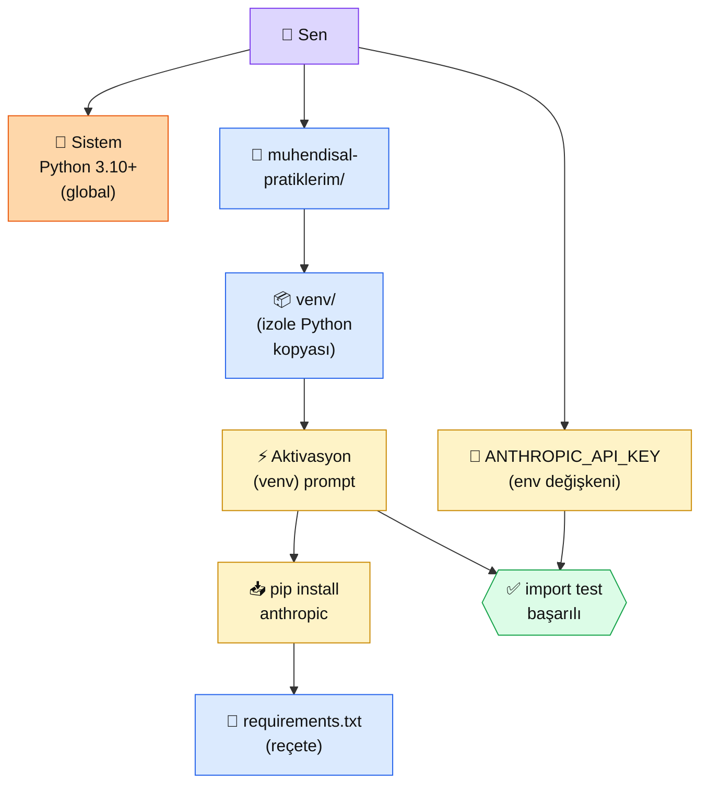

# 0.2 Python ve Sanal Ortam

<div class="ma-meta" markdown>
<div class="ma-meta-row" markdown>
<strong>Kim için:</strong>
<span class="ma-persona ma-persona-baslangic">🟢 başlangıç</span>
<span class="ma-persona ma-persona-is">🔵 iş</span>
<span class="ma-persona ma-persona-kisisel">🟣 kişisel</span>
</div>
<div class="ma-meta-row"><strong>📋 Önkoşul:</strong> 0.1 bitmiş — terminal komutlarına aşinasın; bilgisayarında **Python 3.10+** kurulu (yoksa [python.org](https://www.python.org/downloads/) üzerinden indir, "Add Python to PATH" kutusunu işaretle)</div>
<div class="ma-meta-row"><strong>🎯 Çıktı:</strong> Kendi `muhendisal-pratiklerim/` klasörünü kurarsın, **virtual environment** aktive edersin, Anthropic Python SDK kurarsın, `ANTHROPIC_API_KEY` ortam değişkenini ayarlarsın, **import test** başarıyla geçer.</div>
</div>

!!! tip "Yabancı kelime mi gördün?"
    Bu sayfadaki **italik-altı çizili** ifadelerin (venv, virtualenv, dependency, requirements gibi) üstüne mouse'unu getir — kısa tanım çıkar. Mobilde dokun.

## Neden bu sayfa?

Python yüklü ama "doğrudan" kullanırsan başına bela alırsın: bir projede `requests==2.20`, başka projede `requests==2.31` lazımsa ve **global** kurarsan biri diğerini bozar. Çözüm: **her projeye özel izole bir Python ortamı** = virtual environment (kısaca **venv**).

İkincisi: Anthropic SDK + diğer paketleri (FastAPI, anthropic, jinja2, qdrant-client...) sırayla kuracaksın. Hangi sürümü kurduğunu, **3 ay sonra** veya **başka bir bilgisayarda** tekrar nasıl kuracağını bilmek için `requirements.txt` lazım. Bu sayfa o disiplini kuruyor.

Üçüncüsü: 2025-2026'da `uv` denen **10 kat daha hızlı** yeni bir paket yöneticisi yaygınlaştı (pip yerine). Geleneksel `pip + venv` ile başlayacaksın (her yerde çalışır), `uv`'yi opsiyonel olarak tanıtacağım — çünkü 6 ay sonra muhtemelen ana akım olacak.

## Virtual environment kısaca — üç paragraf, matematiksiz

**Virtual environment = projenin kendi izole "Python kopyası".** Sistem Python'unu bozmadan, her projede farklı paket sürümleri kullanabilmek için. Komut: `python -m venv venv` — `venv` adında bir klasör oluşur, içinde minik bir Python kopyası ve paket klasörü. Bu klasörü `git`'e koyma (`.gitignore`'a ekle), büyük ve geçici.

**Aktivasyon = "şu anki terminal o venv'i kullansın" demek.** Aktivasyon olmadan `pip install` global'e yazar — istemediğin şey. Aktivasyondan sonra terminal prompt'unun başında `(venv)` görürsün, bu emin olma yolu.

**`requirements.txt` = projenin paket reçetesi.** `pip freeze > requirements.txt` ile mevcut paketleri liste; `pip install -r requirements.txt` ile başka makinada aynısını kur. Repo'nuza koyduğun **tek dosya** ile tüm bağımlılıkları paylaşıyorsun — kollabarasyonun temel disiplini.

## Bu sayfanın ekosistemi — kim kime ne veriyor

<div class="ma-ekosistem" markdown>
<div class="ma-ekosistem-header">🗺️ Ekosistem — sistem Python'undan izole proje ortamına</div>



<table class="ma-aktorler" markdown>

| Düğüm | Nerede | Ne iş yapıyor |
|---|---|---|
| 👤 **Sen** | Terminal | Komutları yürütüyorsun, klasörleri kuruyorsun |
| 🐍 **Sistem Python** | OS genelinde | Bütün ana Python — bunu venv olmadan kirletme |
| 📁 **Proje klasörü** | `~/muhendisal-pratiklerim/` | Tüm öğrenme pratiklerinin evi |
| 📦 **venv klasörü** | Proje içinde `venv/` | İzole Python + pip + paket klasörü; .gitignore'a ekle |
| ⚡ **Aktivasyon** | Shell durumu | `source venv/bin/activate` (Mac/Linux) veya `venv\Scripts\activate` (Win) |
| 📥 **pip install** | Aktif venv içinde | Paketleri venv'e kurar (global'e değil) |
| 📄 **requirements.txt** | Proje root | Reçete dosyası, git'e konur |
| 🔑 **ANTHROPIC_API_KEY** | Shell env değişkeni | SDK otomatik okur; .env dosyasına da yazılabilir |
| ✅ **Test** | `python -c "import anthropic; print(anthropic.__version__)"` | Her şey çalışıyor doğrulaması |

</table>
</div>

## Uygulama — iki yol

### Yol A — Klasik pip + venv (her yerde çalışır)

**Mac/Linux için tam akış:**

```bash
# 1. Proje klasörünü kur
mkdir -p ~/muhendisal-pratiklerim
cd ~/muhendisal-pratiklerim

# 2. venv oluştur (proje içinde)
python3 -m venv venv

# 3. Aktive et
source venv/bin/activate
# Prompt'un başında (venv) görmelisin

# 4. pip'i güncel tut
pip install --upgrade pip

# 5. Anthropic SDK'yı kur
pip install anthropic

# 6. Reçete dosyasını çıkar
pip freeze > requirements.txt
cat requirements.txt
# anthropic==0.40.0 gibi sürümleri görmelisin

# 7. API anahtarını set et (oturum boyunca)
export ANTHROPIC_API_KEY="sk-ant-api03-..."  # Anthropic Console'dan al

# 8. Import testi
python -c "import anthropic; print('SDK sürüm:', anthropic.__version__)"
```

**Beklenen çıktı:**

```
SDK sürüm: 0.40.0
```

**Windows için fark sadece aktivasyon:**

```powershell
# Adım 3 yerine:
venv\Scripts\activate

# Adım 7 yerine (PowerShell):
$env:ANTHROPIC_API_KEY = "sk-ant-api03-..."
```

**Burada olan nedir (diyagram referansı):** Sistem Python'una hiç dokunmadın. `venv/` klasörü içinde **proje-özel** Python + paketler. `(venv)` görüyorsan terminal o izole ortamı kullanıyor. Aynı bilgisayarda 5 farklı projen olabilir, hepsinin venv'i ayrı, çakışmaz.

### Yol B — Modern uv (10x hızlı, 2025-2026 trend)

[uv](https://github.com/astral-sh/uv) Astral şirketinin ürünü; pip + venv + virtualenv + pip-tools'u tek araçta birleştiriyor, **Rust ile yazılmış**, çok hızlı.

```bash
# 1. uv kur (tek seferlik)
# Mac/Linux:
curl -LsSf https://astral.sh/uv/install.sh | sh
# Windows PowerShell:
# powershell -c "irm https://astral.sh/uv/install.ps1 | iex"

# 2. Proje klasörünü kur
mkdir -p ~/muhendisal-pratiklerim
cd ~/muhendisal-pratiklerim

# 3. uv ile proje başlat
uv init

# 4. Anthropic SDK ekle (venv otomatik oluşur)
uv add anthropic

# 5. API anahtarı (Yol A ile aynı)
export ANTHROPIC_API_KEY="sk-ant-api03-..."

# 6. Test
uv run python -c "import anthropic; print('SDK sürüm:', anthropic.__version__)"
```

**Burada olan nedir (diyagram referansı):** Aynı pipeline, daha az komut. `uv` `requirements.txt` yerine `pyproject.toml` + `uv.lock` kullanır — daha kararlı, deterministik. `uv add anthropic` 5-10 saniye, pip'in 30-60 saniyesinden çok hızlı.

**Hangisini seçmeli?** Eğer 6 ay+ AI Engineering yapacaksan **uv** öğren — gelecek bu. Eğer "şimdilik bir öğrenelim" diyorsan **pip + venv** rahat kullan — her tutorial'da, her ekipte yaygın.

### .env dosyası ile API anahtarı yönetimi

API anahtarını her açılışta `export` etmek sıkıcı. `python-dotenv` paketi ile **proje klasöründe .env dosyası**:

```bash
# venv aktif iken
pip install python-dotenv

# .env dosyası oluştur (DİKKAT: .gitignore'a EKLE)
echo 'ANTHROPIC_API_KEY=sk-ant-api03-...' > .env
echo '.env' >> .gitignore
echo 'venv/' >> .gitignore
```

Python'da yükleme:

```python
from dotenv import load_dotenv
load_dotenv()  # .env'yi otomatik okur

# Artık os.environ['ANTHROPIC_API_KEY'] kullanılabilir
# Anthropic SDK da kendi otomatik bulur
import anthropic
client = anthropic.Anthropic()  # API anahtarı .env'den okundu
```

**KRİTİK:** `.env` dosyasını **ASLA git'e koymayın.** API anahtarı sızdı = parayı kaybedersin. Anthropic Console'da anahtar oluştururken **kullanım limiti koy** (örn: aylık $20) — sızdırma durumunda zarar limitlenir.

<div class="ma-anthropic-oz" markdown>
<div class="ma-anthropic-oz-header">📖 Anthropic bu konuyu nasıl anlatıyor — öz</div>

Anthropic resmi getting started dokümantasyonu **pip + venv** ile başlatıyor — uv'yi henüz default önermiyor.

**1. SDK kurulum tek satır.** `pip install anthropic` — Anthropic Python SDK 2024'te v1.0'a çıktı, kararlı. Type hints var, async destekli, tüm API endpoint'lerini kapsıyor.

**2. API anahtarı `ANTHROPIC_API_KEY` env değişkeniyle.** SDK varsayılan olarak bu değişkeni okur — kodda `Anthropic(api_key=...)` belirtmen gerekmez. Bu disiplin **API anahtarını koddan çıkarır**, güvenliği artırır.

**3. Sürüm uyumluluğu.** Python 3.8+ desteklenir, 3.10+ önerilir (type hints daha iyi). SDK semver kurallarına uyar — `0.x` dönemi geçti, breaking change için major bump yapılır.

??? info "Teknik detay — isteyene (parameter adları, mekanikler, edge case'ler)"

    **SDK'nin alternatifleri.** Anthropic resmi: Python (`anthropic`), TypeScript/JavaScript (`@anthropic-ai/sdk`), Java, Go, Ruby. Topluluk SDK'ları: PHP, Rust, .NET. Resmi olanlar API ile birlikte güncellenir, topluluk olanlar gecikmeli.

    **Async destek.** `from anthropic import AsyncAnthropic` ile asyncio ile uyumlu kullanım. FastAPI gibi async framework'lerde gerekli. Bölüm 0.4'te detay.

    **Streaming desteği.** `client.messages.stream(...)` ile token-by-token cevap akışı. Chatbot UI için kritik (kullanıcı bekleme algısı düşer). Bölüm 6'da detay.

    **Rate limit handling.** SDK 429 (rate limit) hatasında otomatik retry **yapar** (exponential backoff). `client = Anthropic(max_retries=3)` ile özelleştir.

    **Proxy / custom HTTP client.** Şirket içi proxy arkasındaysan: `client = Anthropic(http_client=httpx.Client(proxies="..."))` ile geç.

    **Type hints kullanımı.** `cevap: anthropic.types.Message = client.messages.create(...)` — IDE autocomplete + mypy desteği.

    **Anthropic Bedrock + Vertex AI.** AWS Bedrock'tan Claude kullanmak için: `from anthropic import AnthropicBedrock`. Google Vertex için: `AnthropicVertex`. Aynı API, farklı backend.

<div class="ma-anthropic-oz-kaynak" markdown>
**Kaynak:** [docs.claude.com — Get started with the API](https://docs.claude.com/en/docs/get-started) (EN, ~10 dk). Resmi quickstart + örnek kodlar. SDK GitHub: [github.com/anthropics/anthropic-sdk-python](https://github.com/anthropics/anthropic-sdk-python) — değişiklik loglarını ay başında bir gözle gez.
</div>
</div>

<div class="ma-cikti-kaniti" markdown>
### 📦 Bu sayfayı bitirdiğini nasıl kanıtlarsın

#### 1. 📝 Refleksiyon yazısı — 5 dakika

> "Python ortamımı kurdum. [pip + venv / uv] seçtim çünkü [...]. `(venv)` prompt'u terminalimde [göründü / görünmedi]. `import anthropic` testi [başarılı / hatalı]. SDK sürümüm [N.NN.N]. Bundan sonraki sayfalarda bu ortamı kullanacağım."

Kaydet: `muhendisal-notlarim/bolum-0/02-python-venv/refleksiyon.txt`

#### 2. 📸 Ekran görüntüsü — 3 dakika

**Neyin görüntüsü:** Terminal — `(venv)` prompt'u + `python -c "import anthropic; print(anthropic.__version__)"` çıktısı görünür.

| OS | Kısayol |
|---|---|
| Windows | `Win + Shift + S` |
| Mac | `Cmd + Shift + 4` |
| Linux | `Shift + PrtScr` |

Kaydet: `muhendisal-notlarim/bolum-0/02-python-venv/venv-test.png`

#### 3. 💻 GitHub repo + .gitignore disiplini — 10 dakika

`muhendisal-pratiklerim/` klasörünü git ile başlat: `git init`. Doğru `.gitignore` dosyası yaz (en az 3 satır: `venv/`, `.env`, `__pycache__/`). `requirements.txt`'i commit'le. GitHub'da public repo olarak yayınla.

Repo linkini kaydet: `muhendisal-notlarim/bolum-0/02-python-venv/repo-link.txt`

</div>

<div class="ma-neden-sonuc" markdown>
<div class="ma-neden-sonuc-header">🔗 Birlikte okuma — neden ne oldu</div>

- **A → B:** Sistem Python'u "ortak depo" — birden fazla projenin paket versiyonları çakışırsa kaos.
- **B → C:** Virtual environment = her projeye özel mini Python = izolasyon = çakışma yok.
- **C → D:** `requirements.txt` reçete = "bu projeyi kuran herkes aynı paketleri alsın" disiplini.
- **D → E:** `ANTHROPIC_API_KEY` env değişkeni → kodda hard-code yok = güvenlik + esneklik.
- **E → F:** `.gitignore` ile sırlar (.env) ve büyük geçici dosyalar (venv/) git'e gitmez = repo temiz.

<div class="ma-neden-sonuc-sonuc" markdown>
**Sonuç:** "Kodum çalışıyor ama sürüm karışıklığı var" en yaygın yeni geliştirici tuzağı. Bu sayfadan sonra her projede ilk komut `python -m venv venv && source venv/bin/activate` refleksin oluyor. Geri dönmüyorsun.
</div>
</div>

<div class="ma-sonraki" markdown>
<div class="ma-sonraki-header">➡️ Sonraki adım</div>

**[0.3 Ollama ile Yerel LLM →](03-ollama.md)** — Anthropic API token harcamadan deneme yapmak için yerel **Llama 3.2** veya **Qwen 2.5** kur. Geliştirme sırasında ücretsiz, prod'da Claude.

← [0.1 VPS ve Linux Komutları](01-vps-linux.md) &nbsp;|&nbsp; [Bölüm 0 girişi](index.md) &nbsp;|&nbsp; [Ana sayfa](../index.md)

**Pekiştirme:** `pip list` komutuyla venv'inde kurulu paketleri listele. Sonra `pip install jinja2 python-dotenv` ekle, `pip freeze > requirements.txt` ile reçeteyi güncelle. Bu refleks 10 saniye, kazanç çok büyük.
</div>
