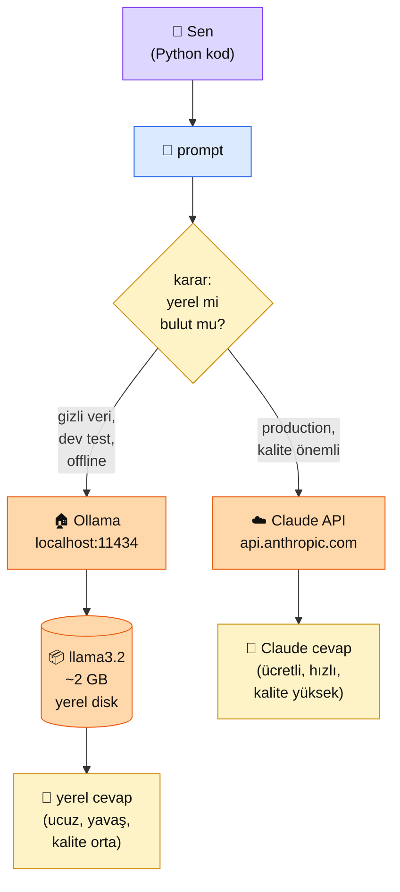

# 0.3 Ollama ile Yerel LLM

<div class="ma-meta" markdown>
<div class="ma-meta-row" markdown>
<strong>Kim için:</strong>
<span class="ma-persona ma-persona-baslangic">🟢 başlangıç</span>
<span class="ma-persona ma-persona-is">🔵 iş</span>
<span class="ma-persona ma-persona-kisisel">🟣 kişisel</span>
</div>
<div class="ma-meta-row"><strong>⏱️ Süre:</strong> ~30 dakika (kurulum + model indirme 3-5 dk ayrıca + Python çağrısı)</div>
<div class="ma-meta-row"><strong>📋 Önkoşul:</strong> 0.2 bitmiş — venv aktive etme refleksi var; bilgisayarında veya VPS'te en az **8 GB RAM** (yerel LLM bellek ister)</div>
<div class="ma-meta-row"><strong>🎯 Çıktı:</strong> Ollama'yı kurarsın, bir modeli (llama3.2, qwen, phi) indirirsin, CLI ile Türkçe "merhaba" çağrısı yaparsın, Python'dan Ollama'nın HTTP API'sine bağlanırsın; **yerel vs bulut (Claude)** kararını maliyet + gizlilik + hız kriterleri üzerinden yapabilirsin.</div>
</div>

!!! tip "Yabancı kelime mi gördün?"
    Bu sayfadaki **kalın** teknik terimler (quantization, inference, GGUF gibi) ilk geçişte hemen yanında veya altında Türkçe açıklanır.

## Neden bu sayfa?

Her AI çağrısı Claude'a gitsin mi? **Hayır.** Bazı durumlar **yerel** çalışmalı: (1) kullanıcı verisi gizli (hukuk, sağlık) ve bulutta işlenemez, (2) development aşamasında saniyede 10 test çağrısı yapıyorsun (Claude'a gitse ayda $100 fatura), (3) internet yok / kesinti var ama bot çalışmaya devam etmeli. Bu senaryolarda **Ollama**.

İkincisi: **Ollama = yerel LLM'lerin Docker'ı.** 2023'te çıktı, 2024-2026'da ana akım oldu. Komutu tek satır: `ollama run llama3.2`. Arka planda model indirir, yerel GPU/CPU'yla çalıştırır, OpenAI-uyumlu HTTP API sunar. Önceden 10 saat süren karmaşık kurulum, şimdi 5 dakika.

Üçüncüsü: Yerel LLM'leri bilmek **Claude'un güçlü yanlarını anlamak** için kritik. Yerel Llama 3.2 (3B) Türkçe'de nasıl cevap veriyor görüp, aynı soruyu Claude'a sorduğunda **"ah işte bu fark"** diyeceksin. Bu mukayeseli bakış AI Engineer olmanın temeli — "tek modele iman etmek" yanılsamasından seni kurtarır.

## Ollama kısaca — üç paragraf, matematiksiz

**Yerel LLM = modelin ağırlıklarının (parameters) senin bilgisayarında olması.** Claude'un ağırlıkları Anthropic sunucularında, sen API üzerinden çağırırsın. Llama 3.2 (3B ~2 GB disk, 8B ~5 GB disk) ağırlıkları Meta tarafından **açık** yayınlandı — sen indirebilirsin. Ollama bunu tek komuta indiriyor + çalıştırıyor.

**Quantization = modeli ufaltma tekniği.** Orijinal Llama 3.2 (8B) 16 GB disk + 16 GB RAM ister. **Quantize edilmiş** (4-bit) sürümü ~5 GB'a düşer, 8 GB RAM'de çalışır. Kalite yaklaşık %3-5 düşer, hız yaklaşık %40 artar (modele ve donanıma göre değişir). Ollama default 4-bit quantize modelleri indirir — pratik için ideal. Production kalitesi isterseniz 8-bit veya full precision.

**Inference = modelin cevap üretme aşaması.** Training (eğitim) farklı — aylar süren, milyonlarca dolarlık süreç. Sen sadece inference yapıyorsun: hazır modeli çalıştırıp cevap alıyorsun. CPU'da yavaş (10 saniyede 1 cümle), GPU'da hızlı (0.5 saniye). Mac M1/M2/M3/M4 GPU gibi çalışır (Metal backend). Hetzner CX serisi CPU-only, CCX serisi GPU'lu paketler var.

## Bu sayfanın ekosistemi — kim kime ne veriyor

<div class="ma-ekosistem" markdown>
<div class="ma-ekosistem-header">🗺️ Ekosistem — yerel Ollama vs bulut Claude</div>



<table class="ma-aktorler" markdown>

| Düğüm | Nerede | Ne iş yapıyor |
|---|---|---|
| 👤 **Sen** | Python / terminal | Prompt'u hazırlar, hedefe karar verir |
| 📝 **Prompt** | Mesaj string | Aynı prompt — yerel ve buluta gönderilebilir |
| ❓ **Karar** | Senin projen | Gizlilik + maliyet + kalite üçgeninde seçim |
| 🏠 **Ollama** | `localhost:11434` HTTP server | Yerel model çalıştırır, OpenAI-uyumlu API sunar |
| 📦 **Model ağırlıkları** | `~/.ollama/models` ~2-5 GB disk | Llama/Qwen/Phi gibi açık modeller |
| ☁️ **Claude API** | api.anthropic.com | Anthropic'in kendi serverları, ücretli |
| 💬 **Yerel cevap** | Terminal / Python response | Ucuz, offline, kalite 7/10 civarı |
| 💬 **Claude cevap** | API response | Ücretli, online, kalite 9.5/10 civarı |

</table>
</div>

## Uygulama — iki yol

### Yol A — Ollama kurulum + CLI deneme

Platform-bağımsız kurulum:

```bash
# --- Mac/Linux tek satır ---
curl -fsSL https://ollama.com/install.sh | sh

# --- Windows için ---
# https://ollama.com/download adresinden .exe indir, yükle
```

Kurulum sonrası doğrula:

```bash
ollama --version
# ollama version is 0.21.x

# İlk modeli çek (~2 GB indirme, 3-5 dakika)
ollama pull llama3.2:3b

# Kısaca çalıştır — interaktif sohbet
ollama run llama3.2:3b
```

İnteraktif prompt'ta dene:

```
>>> Merhaba, sen kimsin?
Merhaba! Ben Llama 3.2, açık kaynak bir yapay zeka modeli...

>>> Türkçe bir şiir yaz, 4 satır.
[Llama Türkçe şiir yazmaya çalışır; kalite %60-70, Claude'a göre düşük]

>>> /bye
```

Başka faydalı komutlar:

```bash
ollama list                  # indirdiğin modeller
ollama rm llama3.2:3b        # modeli sil
ollama pull qwen2.5:3b       # alternatif (Türkçe daha iyi olabilir)
ollama pull phi3.5:3.8b      # küçük + hızlı
```

**Model karşılaştırma (3-4 GB sınıfı):**

| Model | Boyut | Türkçe | Hız | Genel güç | Ne için |
|---|---|---|---|---|---|
| **llama3.2:3b** | 2 GB | 6/10 | hızlı | 6/10 | Genel amaç, başlangıç |
| **qwen2.5:3b** | 2 GB | 7/10 | hızlı | 7/10 | Türkçe + kod daha iyi |
| **phi3.5:3.8b** | 2.3 GB | 5/10 | çok hızlı | 6/10 | Minimum donanım, İngilizce |
| **llama3.1:8b** | 4.7 GB | 7/10 | orta | 7.5/10 | 16 GB RAM varsa tercih |

!!! warning "VPS'te kuruyorsan güvenlik uyarısı"
    Ollama default olarak tüm ağa açık (`localhost:11434` değil, tüm interface). VPS'te kurarsan: `ufw deny 11434` veya nginx reverse proxy + auth koy. Aksi halde herkese açık bir LLM sunucusu kurmuş olursun. Prompt injection da Ollama modellerinde Claude'a göre daha kolaydır.

**Burada olan nedir (diyagram referansı):** Diyagramın `🏠 Ollama → 📦 Model → 💬 yerel cevap` yolu tamamlandı. İndirme bir defa, sonrası offline — internet bile gerekmiyor.

### Yol B — Python'dan Ollama HTTP API çağrısı

Ollama çalışırken arka planda `localhost:11434` üzerinde HTTP server açar. Python ile:

```python
import requests

# Ollama OpenAI-uyumlu /chat/completions endpoint'i var (Ollama 0.2+)
response = requests.post(
    "http://localhost:11434/api/chat",
    json={
        "model": "llama3.2:3b",
        "messages": [
            {"role": "user", "content": "Türkiye'de tatil için 1 şehir öner, 2 cümlelik."}
        ],
        "stream": False,
    },
)
data = response.json()
print(data["message"]["content"])
```

Daha rahat SDK isteyenler için:

```bash
pip install ollama
```

```python
import ollama

response = ollama.chat(
    model="llama3.2:3b",
    messages=[{"role": "user", "content": "Türkiye'de tatil için 1 şehir öner"}],
)
print(response["message"]["content"])
```

**Hybrid desen — development'ta yerel, production'da Claude:**

```python
import os
import ollama
import anthropic

USE_LOCAL = os.getenv("USE_LOCAL", "false").lower() == "true"
claude = anthropic.Anthropic()

def chat(prompt: str) -> str:
    if USE_LOCAL:
        # Dev'de: hızlı + ücretsiz iterasyon
        r = ollama.chat(
            model="llama3.2:3b",
            messages=[{"role": "user", "content": prompt}],
        )
        return r["message"]["content"]
    else:
        # Prod'da: kaliteli cevap
        r = claude.messages.create(
            model="claude-sonnet-4-6",
            max_tokens=500,
            messages=[{"role": "user", "content": prompt}],
        )
        return r.content[0].text


# Test
if __name__ == "__main__":
    cevap = chat("Merhaba, kimsin?")
    print(f"[{'LOCAL' if USE_LOCAL else 'CLOUD'}] {cevap}")
```

Çalıştır:

```bash
USE_LOCAL=true python test.py   # ücretsiz, yerel
USE_LOCAL=false python test.py   # Claude, ücretli
```

**Burada olan nedir (diyagram referansı):** Bu hybrid kod `❓ karar` düğümünü **env variable** üzerinden yapıyor. Aynı kod iki farklı patikayı destekliyor — Bölüm 2.1'deki Claude çağrısının bir üst seviye soyutlamasına ulaştık.

### Ne zaman yerel, ne zaman bulut?

| Senaryo | Seçim | Gerekçe |
|---|---|---|
| Development testleri (günde 100+ çağrı) | **Ollama** | Fatura 0, iterasyon hızlı |
| KVKK'ya tabi sağlık/hukuk verisi | **Ollama** | Veri bulut dışına çıkamaz |
| Üretimde müşteri-facing chatbot | **Claude** | Kalite müşteri deneyimini belirler |
| İnternetin olmadığı ortam (gemi, fabrika) | **Ollama** | Offline çalışır |
| Maliyet çok hassas + kalite esnek | **Ollama** | Bedava |
| Karmaşık akıl yürütme (hukuki yorum, matematik) | **Claude** | Llama/Qwen yetersiz kalır |
| Türkçe metin üretimi (kaliteli) | **Claude veya Qwen2.5** | Llama Türkçe'de orta; Qwen iyi |
| Multimodal (görsel + ses) | **Claude (+ Whisper)** | Llama vision sınırlı |

<div class="ma-anthropic-oz" markdown>
<div class="ma-anthropic-oz-header">📖 Anthropic bu konuyu nasıl anlatıyor — öz</div>

Anthropic yerel LLM sağlamaz (cloud-only şirket) — ama bu konuda **net ve dürüst** bir duruşu var:

**1. Anthropic'in yerel LLM'i YOK.** Claude'un ağırlıkları public değil, yüklenemez, indirilemez. Bu kasıtlı bir tercih — Anthropic model güvenliğini önemsiyor ve ağırlıkların elden çıkmasını istemiyor. Yerel LLM'ler Anthropic'in ekosisteminde değil.

**2. Amazon Bedrock "Custom Import" sınırlı bir köprü.** Llama gibi açık modelleri AWS Bedrock'a import edip Anthropic API benzeri bir arayüzle çağırabilirsin — ama bu **Claude değil**, senin açık modelin. Anthropic'in bu konuda net açıklaması: "istersen kendi açık modelini import et, ama Claude cloud'da kalır".

**3. Hybrid desen Anthropic önerisi.** Anthropic resmi blog yazılarında "development'ta ucuz modelle test et, production'da Claude" yaklaşımını açıkça destekler. Sebebi: Anthropic iteration'ı engelleyen faktör olmak istemiyor; senin hızlı geliştirmen ve **sonunda kaliteli modele** geçmen onların işine geliyor.

??? info "Teknik detay — isteyene (parameter adları, mekanikler, edge case'ler)"

    **Ollama OpenAI uyumluluğu.** `/v1/chat/completions` endpoint'i OpenAI SDK ile çalışır — `OPENAI_BASE_URL=http://localhost:11434/v1` set edersen mevcut OpenAI kodun Ollama'ya yönelir. Ama Anthropic SDK ile doğrudan çalışmaz; ya requests ile ham HTTP ya da `ollama` paketi ya da bir adapter yaz.

    **GPU gereksinimleri.** CPU-only: 3B model 2-5 saniye/response. NVIDIA GPU (CUDA): 0.3-1 saniye. Apple Silicon (Metal): 0.5-2 saniye. GPU olmadan 7B+ modelleri denemek pratik değil. Llama.cpp alternatifi daha düşük seviye, Ollama'nın gerisinde.

    **Kontekst uzunluğu.** Llama 3.2 default 8K token; ekstra parametre ile 128K'ya çıkarılabilir (`ollama run llama3.2 -p "..." --num_ctx 16384`). Claude Sonnet 4.x 200K, Claude Opus (1M context) — context window açısından Claude çok öndedir.

    **Fine-tuning Ollama'da.** `ollama create` ile kendi modelini system promptla customize edebilirsin — ama bu fine-tune değil, prompt-wrap. Gerçek fine-tune için Hugging Face + LoRA + Unsloth gerek (Bölüm 5).

    **Model lisansları.** Llama 3.x: Meta Custom License (700M+ kullanıcı üstünde paralı). Qwen: Apache 2.0 (serbest). Phi: MIT (serbest). Mistral: Apache 2.0. Ticari kullanım için **lisansa mutlaka bak.**

<div class="ma-anthropic-oz-kaynak" markdown>
**Kaynak:** [ollama.com](https://ollama.com) resmi docs (EN, ~15 dk) — kurulum + CLI + API + model kataloğu. Anthropic tarafında ilgili doküman: [platform.claude.com/docs — Amazon Bedrock integration](https://platform.claude.com/docs/en/docs/about-claude/cross-platform/amazon-bedrock). Hybrid model seçimi için: [anthropic.com/news](https://www.anthropic.com/news) → "Claude for Haiku" duyuruları (Haiku = Ollama'ya alternatif bulut-ucuz seçenek).
</div>
</div>

<div class="ma-cikti-kaniti" markdown>
### 📦 Bu sayfayı bitirdiğini nasıl kanıtlarsın

#### 1. 📝 Refleksiyon yazısı — 5 dakika

> "Ollama kurdum. [Model adı] çektim (disk [X] GB). CLI'da Türkçe soru sordum — cevap kalitesi [puan/10]. Aynı soruyu Claude'a sordum — kalite [puan/10]. Hız farkı: [yerel X sn, Claude Y sn]. Kendi projem için [yerel / Claude / hybrid] kullanacağım çünkü..."

Kaydet: `muhendisal-notlarim/bolum-0/03-ollama/refleksiyon.txt`

#### 2. 📸 Ekran görüntüsü — 3 dakika

**Neyin görüntüsü:** `ollama run llama3.2:3b` oturumu — Türkçe bir soru sordun, Llama cevap verdi.

| OS | Kısayol |
|---|---|
| Windows | `Win + Shift + S` |
| Mac | `Cmd + Shift + 4` |
| Linux | `Shift + PrtScr` |

Kaydet: `muhendisal-notlarim/bolum-0/03-ollama/ollama-chat.png`

#### 3. 💻 Hybrid script + Gist — 10 dakika

Yol B'deki hybrid fonksiyonu kendi projene uyarla. En az **3 farklı prompt** için hem Ollama hem Claude cevabını yan yana yazdır, kalite farkını 1-10 puanla yorumla. [gist.github.com](https://gist.github.com)'a yükle.

Kaydet: `muhendisal-notlarim/bolum-0/03-ollama/hybrid-gist.txt`

</div>

<div class="ma-neden-sonuc" markdown>
<div class="ma-neden-sonuc-header">🔗 Birlikte okuma — neden ne oldu</div>

<ol class="ma-neden-sonuc-zincir" markdown>
<li>**Her AI çağrısı buluta gitmek zorunda değil.** Development testleri, gizli veri ve offline senaryolar için yerel LLM gerekli. Bu yüzden **Ollama'yı bilmek zorundasın.**</li>
<li>**Ollama yerel LLM'lerin Docker'ı oldu.** Tek komutla Mac/Linux/Windows'ta çalışıyor, OpenAI-uyumlu API sunuyor. Bu yüzden **kurulum 5 dakika, eskiden 10 saatti.**</li>
<li>**Quantization ile 8 GB RAM yeterli.** 3B modeller laptop'ta çalışıyor, donanım engeli ortadan kalktı. Bu yüzden **pahalı GPU olmadan da local LLM mümkün.**</li>
<li>**Türkçe kalitesinde Qwen > Llama > Phi; multimodal ve uzun bağlamda Claude hep önde.** Bu yüzden **araç seçimi göreve göre değişiyor.**</li>
<li>**Hybrid desen en pratik yaklaşım.** Env değişkeniyle yerel/bulut switch = development hızı + production kalitesi. Bu yüzden **aynı kod iki farklı modeli destekliyor.**</li>
</ol>

<div class="ma-neden-sonuc-sonuc" markdown>
**Sonuç:** AI Engineer **tek modele iman etmez.** Yerel Ollama + bulut Claude iki ayrı alet — hangi işe hangisi uygun bilmek asıl ustalık. Sonraki iki sayfa (0.4 FastAPI + 0.5 İlk AI servisi) bu alet takımını **bir servise** dönüştürecek.
</div>
</div>

<div class="ma-sonraki" markdown>
<div class="ma-sonraki-header">➡️ Sonraki adım</div>

**[0.4 FastAPI İskeleti →](04-fastapi.md)** — Python'da hazırladığın kodu HTTP endpoint'ine dönüştür. `POST /chat` → JSON in, JSON out. Ollama + Claude'u arkaya alan bir web servisi.

← [0.2 Python ve Sanal Ortam](02-python-venv.md) &nbsp;|&nbsp; [Bölüm 0 girişi](index.md) &nbsp;|&nbsp; [Ana sayfa](../index.md)

**Pekiştirme:** Aynı 5 promptu hem Llama 3.2 hem Qwen 2.5 hem Claude Sonnet 4.x'e ver, 3'lü karşılaştırma tablosu yap. Hangi modelin hangi tarzda güçlü olduğunu **kendi verinle** ölçeceksin — kitaptaki tablo bilgi, senin tablon refleks.
</div>
