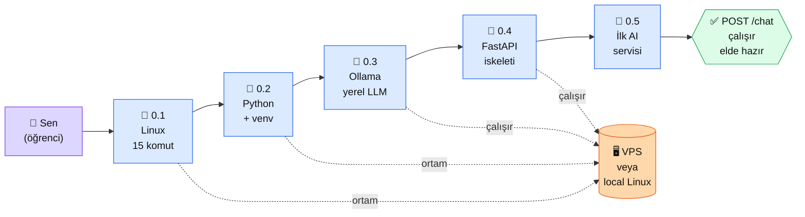

# Bölüm 0 — Temel Hazırlık

**Persona:** Python ve Linux'u hiç görmemiş, ama komut satırına korkmayan geliştirici · **Süre:** ~2 saat (5 sayfa × ortalama 25 dk) · **Önkoşul:** Bir bilgisayar + temel internet · bir VPS (Hetzner/DigitalOcean/AWS) veya local Linux/WSL kabul · **Çıktı:** Kendi sunucunda çalışan **yerel AI servisi** — HTTP POST atınca Ollama ile cevap dönen FastAPI uygulaması

## Neden bu bölüm?

AI platformu kurarken ilk engel **AI değil, altyapı.** `pip install anthropic` demeden önce Python'un nereden gelip nereye kurulduğunu, neyin neyin üstünde çalıştığını bilmezsek sonraki 10 bölümdeki pratiklerin hiçbiri yürümez. Bu bölüm bu temeli atar.

İkinci sebep: "Anthropic API'si çalışmıyor" diyen kişinin %70'inin sorunu API'de değildir — `venv` aktif değildir, port çakışmıştır, `systemd` servisi ölmüştür. Bu bölüm biter bitmez bu üç konuda "elime bakmadan" çalışabiliyor olacaksın. AI'yi anlamak için **AI'nin üstünde oturduğu zemini** anlamak gerek.

Üçüncü sebep motivasyonel: Bölüm 0 bitince elinde **konuşan bir AI servisi** var. Bedava, kendi makinende, aylık fatura yok. Anthropic API'sine geçmeden önce "AI nedir, nasıl çağırılır" sorusuna lokal bir cevabın olmuş oluyor.

## Bölüm 0 kısaca — ne öğreniyorsun

5 sayfada 5 ayrı katman kuruluyor ve en sonda hepsini birleştiriyorsun:

**0.1 — Linux komutları.** VPS'te ne olup bittiğini görebilmek için 15 komut yetiyor (`ls`, `cd`, `cat`, `grep`, `tail`, `ps`, `systemctl`, `sudo`, ve birkaç tane daha). Bu sayfa o komutları **senaryo içinde** öğretir: "şu dosya nerede?", "bu servis neden çalışmıyor?" Her komut bir soruya cevap.

**0.2 — Python ve venv.** Python üç kere kurulur (sistem, venv, proje). Neden? Çünkü sistem Python'una paket atarsan 6 ay sonra Ubuntu güncellemesi her şeyi kırar. `venv` her projeye kendi kutusunu verir. `requirements.txt` o kutuyu başka makinede tekrar üretir.

**0.3 — Ollama ile yerel LLM.** Anthropic API'si ücretli. Ama deneme yaparken, prompt denerken, fikir test ederken her çağrının parası üzülür. Ollama bedava, offline, kendi makinende çalışır. `llama3.2` ve `qwen2.5` iki model indiriyoruz; ikisi de bir Claude'dan zayıf ama **sıfır dolar**, sıfır gecikme, sıfır internet.

**0.4 — FastAPI iskeleti.** "Dış dünya" (tarayıcı, başka bir servis, senin chatbot'un) LLM'e nasıl soru soracak? Bir HTTP arayüzü lazım. FastAPI Python'da 15 satırla bir `POST /chat` açar. OpenAPI dokümantasyonunu kendisi üretir. Sonraki bölümlerin hepsinde iskelet bu.

**0.5 — Birleştir.** Ollama (0.3) + FastAPI (0.4) iki tarafa gelir, ortada senin yazdığın 30 satırlık kod oturur. Sonuçta `curl -X POST .../chat -d '{"mesaj":"selam"}'` atıyorsun, Ollama cevap veriyor, FastAPI döndürüyor. Bu **uçtan uca bir AI servisinin** minimum iskeletidir. Sonraki 10 bölümde bunun üzerine ekosistem kuruluyor.

## Bu bölümün yol haritası

### Aktör tablosu

| Düğüm | Nerede | Ne iş yapıyor |
|---|---|---|
| 👤 **Sen** | Kendi bilgisayarının başında | Terminalden komut yolluyorsun, Mermaid'leri okuyorsun, sayfa sonlarında kendini test ediyorsun |
| 📄 **0.1 Linux** | Bu platform (okuma) | 15 komut + senaryo → VPS'i "görünür" hale getirir |
| 📄 **0.2 Python** | Bu platform (okuma) + VPS (uygulama) | `python3 -m venv`, `pip`, `requirements.txt` — izole ortam disiplini |
| 📄 **0.3 Ollama** | VPS (11434 portunda arka plan) | Yerel LLM sunucusu. `ollama pull llama3.2` → indir, `ollama run` → konuş |
| 📄 **0.4 FastAPI** | VPS (9000 portunda arka plan) | Python web çerçevesi. 15 satırla HTTP endpoint'i açar |
| 🏁 **0.5 İlk servis** | Uygulama sayfası | 0.3 + 0.4 birleşimi. `curl POST /chat` atınca Ollama cevabı dönüyor |
| 🖥 **VPS / local Linux** | Hetzner/DO/AWS veya WSL | 7/24 çalışan sunucu. Ollama + FastAPI burada oturur, kapatmazsan ölmez |
| ✅ **Çıktı (OUT)** | `http://$VPS_IP:9000/chat` | Canlı endpoint. Sonraki bölümlerde Anthropic API'yi de buraya koyacaksın |

**Not — VPS yoksa:** Tüm bölüm WSL (Windows), macOS terminal, veya Linux laptop üzerinde çalışır. "VPS" kelimesini gördüğün her yerde "benim Linux'um" diye oku. Anthropic API bölümü (Bölüm 2+) için de aynı geçerli — sunucu şart değil.

## Bu bölüm bittiğinde elinde ne olacak

- **Canlı AI servisi:** `http://$VPS_IP:9000/chat` — POST `{"mesaj":"selam"}` → JSON cevap
- **İki yerel LLM indirilmiş:** `llama3.2` (3B, hızlı) + `qwen2.5` (7B, Türkçe iyi) — offline çalışıyor, sıfır dolar fatura
- **Temiz Python ortamı:** `/muhendisal-platform/playground/venv` — sonraki bölümlerin pratikleri buraya kurulur
- **15 komutluk Linux refleksi:** Servis çökse nereye bakacağını, log'u nasıl okuyacağını biliyorsun
- **`systemd` veya PM2 ile arka plan çalışan** iki süreç (Ollama + FastAPI) — kapatıp yeniden başlatmayı biliyorsun

Bu beş şey, 2. bölümde Anthropic API'ye geçeceğin zaman "altın zemin" olacak. Anthropic çağrısında bir hata çıktığında altyapı yüzünden mi, API yüzünden mi, kod yüzünden mi — bunu ayırt etmeyi bu bölüm kazandırıyor.

📖 Anthropic bu ön-hazırlıkta ne bekler — öz

Anthropic dokümanı Bölüm 0 düzeyinde bir "kurulum dersi" yazmaz; "Python ve HTTP'yi biliyorsun" varsayar. Ama Quickstart rehberi iki somut önkoşul sayar, bölümümüz bu ikisini **pratikle** karşılıyor:

**1. Python 3.7+ ve paket yönetimi.** Anthropic SDK `pip install anthropic` ile kurulur. Ama hangi Python'a? Sistem Python'una kurmak uzun vadede kırılır; `venv` içinde kurmak izolasyon sağlar. 0.2'de bunu pratik kuruyoruz — Anthropic'in "isolated environment önerilir" satırının arkasında duran disiplin.

**2. Bir HTTP isteği atabilme.** SDK aslında `requests` veya `httpx` üstüne sarmalayıcı. İlk prensibi anlamak için 0.4'te kendi FastAPI servisimizi yazıyor, 0.5'te HTTP POST'u **alıcı** olarak deneyimliyoruz. Sonra Bölüm 2'de Anthropic'e aynı iskeletle POST atacağız — tanıdık gelecek.

**3. API anahtarını nerede tutacağın.** Anthropic, anahtarı kod içine koymamayı, `ANTHROPIC_API_KEY` environment değişkeni kullanmayı ısrarla vurgular. 0.2'de `venv` + `.env` + `python-dotenv` zincirini öğrendiğin için Bölüm 2'ye geçtiğinde bu alışkanlık otomatik devreye girer.

**Kaynak:** [Anthropic API — Quickstart / Getting Started](https://docs.claude.com/en/docs/get-started) (resmi dokümantasyon, İngilizce, 10 dk okuma). Bölüm 0 bittikten **sonra** aç — oradaki her satırın altyapısı bu bölümde kurulmuş olur, okuma akıcı olur.

## Kural dışı yerler (Tip A bölüm girişi notu)

Bu sayfa iskelette "Uygulama" bölümü içermiyor — Tip A (bölüm girişi) kuralıdır. Uygulama 5 alt sayfada. "Çıktı Kanıtı" da yok — onun yerine yukarıdaki **bölüm sonu çıktısı** var (beş maddelik liste); her alt sayfa kendi mini kanıtını içerir.

---

**Bir sonraki adım →** [0.1 VPS ve Linux Komutları](01-vps-linux.md) — 20 dk, 15 komutta yetkin ol

← [Ana Sayfa](../index.md)

