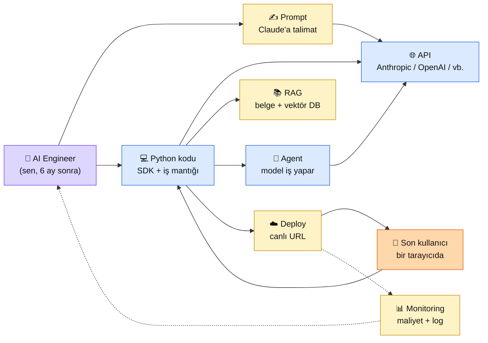

# 1.1 AI Engineer Nedir — ve Sen Bu Platform İçin Uygun musun?

<strong>Kim için:</strong>
🟢 başlangıç
🔵 iş
🟣 kişisel

<strong>⏱️ Süre:</strong> ~20 dakika

<strong>📋 Önkoşul:</strong> Yok. Kod bilmesen de, İngilizcen yetersizse de bu sayfa seninle konuşur. Bir bilgisayar + internet yeter.

<strong>🎯 Çıktı:</strong> "AI Engineer" teriminin 2026'da ne demek olduğunu kendi cümlelerinle anlatabiliyorsun; sen bu yoldan ilerlemek istiyor musun, buna net cevap verebiliyorsun; kod/İngilizce eksiğinle bu platformu bitirebilir misin sorusuna rakamlı yanıtın var.

!!! tip "Yabancı kelime mi gördün?"
    Bu sayfadaki **italik-altı çizili** ifadelerin (AI Engineer, LLM, API, prompt, agent, RAG gibi) üstüne mouse'unu getir — kısa tanım çıkar. Mobilde dokun. Bilmediğin her terim platform boyunca bu şekilde açıklanır. Bu sayfada İngilizce terim gördüğünde **yanında mutlaka Türkçe açıklaması var** — terimin kendisi ezberlenecek, "ama onu da öğrenemem" korkusu yok.

## Neden bu sayfa?

Bu platform "AI Engineer" olma yolculuğu vaat ediyor. Sen okumaya başlamadan önce en dürüst soruyu cevaplayalım: **bu terim tam olarak ne demek, sen bu yola girecek doğru kişi misin, bitirmene ne engeller var?** Üç soru. Hiçbirinin cevabı belirsiz kalmasın.

İkincisi: "AI Engineer" LinkedIn'de, iş ilanlarında, YouTube videolarında birbiriyle çelişen anlamlarda kullanılıyor. Birisi "AI Engineer" derken **PhD'li matematik ağırlıklı araştırmacı** kastediyor; başka biri **prompt yazan web geliştiricisi** kastediyor. İkisi aynı iş değil. Bu sayfada sana **2026'da iş ilanlarında en sık aranan AI Engineer tanımını** veriyoruz, platform bu tanıma göre tasarlandı.

Üçüncüsü: Pedagojik dürüstlük. Bu platformun hedef kitlesi geniş — "komut satırını ilk kez görecek yetişkin"den "backend mühendisi, AI tarafına kaymak istiyor"a kadar. **Sen bu yelpazenin neresindesin?** Sayfa sonunda kendi yerini somut olarak göreceksin, platformu nasıl okuyacağın netleşecek.

## AI Engineer nedir — üç paragraf, 2026 tanımı

**AI Engineer:** Önceden eğitilmiş yapay zekâ modellerini (Claude, GPT, Gemini, Llama gibi) gerçek bir ürüne — bir web sitesine, bir chatbot'a, bir otomasyon sistemine — entegre eden yazılımcı. "Modelin içini eğiten" değil, **dışında çalışan ama modelin dilini bilen** kişi. Terimi 2023 sonunda ChatGPT API'si yaygınlaşınca ortaya çıktı; 2026'da iş ilanlarında en çok talep edilen yazılım rollerinden biri.

Günlük iş dört katmandan oluşur. **(1) Prompt yazmak** — modele ne soracağını, nasıl cevap vermesini istediğini doğru çerçeveleyerek yazmak. **(2) API entegrasyonu** — modelin çağrıldığı kodu yazmak (genellikle Python), hataları yakalamak, maliyeti izlemek. **(3) RAG ve agent kurmak** — modele dışarıdan belge okutmak, işlem yaptırmak, başka sistemlere bağlamak. **(4) Deploy etmek** — kurduğun sistemi bir sunucuya yerleştirmek, canlı URL çıkarmak, her şeyi çalışır tutmak. Bu platformun 11 bölümü tam bu dörtlüyü sırasıyla öğretir.

AI Engineer'ın **olmadığı** şeyler: yeni model eğiten araştırmacı (o ML Research Engineer), GPU farmı işleten altyapı mühendisi (ML Infrastructure), veri temizleyen analist (Data Engineer / ML Engineer). Bu roller PhD, çok özel matematik, veya pahalı donanım gerektirebilir. AI Engineer'ın ihtiyacı **bir laptop + internet + aylık 20 dolar bütçedir.** Platform başarı kriteri de tam bu — elinde yalnız bu üçü olan biri bitirince AI Engineer pozisyonuna başvurabilsin.

## Bu sayfanın ekosistemi — kim kime bağlı

🗺️ Ekosistem — AI Engineer'ın günlük orbiti

<table class="ma-aktorler" markdown>

| Parça | Ne iş yapıyor | Platformda nerede |
|---|---|---|
| ✍️ **Prompt** | Claude'a "şu işi şöyle yap" diye yazmak | Bölüm 2 (prompt temelleri) |
| 🌐 **API** | Claude ile senin kodun arasındaki köprü | Bölüm 2 (ilk çağrı) |
| 💻 **Python kodu** | Her şeyi birleştiren yapıştırıcı | Bölüm 0 + 2 + 9 |
| 📚 **RAG** | Claude'a kendi belgelerini okutmak | Bölüm 3 + 4 |
| 🤖 **Agent** | Claude'un bir iş yapması (mail atması, dosya işlemesi) | Bölüm 6 |
| ☁️ **Deploy** | Sistemin internetten erişilir olması | Bölüm 9 |
| 📊 **Monitoring** | Maliyet + hata takibi | Bölüm 8 + 9 |
| 👥 **Son kullanıcı** | Sisteminden faydalanan kişi | Portföy projelerin |

</table>

## SSS — korkma, rakamı görünce geçer

### "Kod bilmiyorum. Bu platform benim için mi?"

**Evet, ama gerçekçi bir taahhütle.** Bu platform Python + Linux komutlarını sıfırdan anlatır (Bölüm 0, 5 sayfa, ~2 saat). Ama kod "refleksi" kazanmak 2 saatte olmaz — tahminimiz **8-12 hafta, günde 45-60 dakika**. Bu süreçte Claude senin kod tutorunmuş gibi çalışır: kod yazarken takıldığın her satırı ona soruyorsun, açıklıyor. **Kod öğrenme süren 3 ayda değil 3 günde iş ilanına başvurursun diyorsak yalan söyleriz.** 3 gün diyen videoları kapat. Bu platform yalan söylemez.

**Gerçekçi teminat:** 6 ay boyunca haftada 4-5 saat verirsen (günde 40-45 dk × 6 gün), Bölüm 10'a geldiğinde GitHub'da 2-3 canlı portföy projeniz, LinkedIn'inizde somut anlatılabilir bir hikâyeniz, ve AI Engineer pozisyonlarına başvururken cevapsız kalmayacak bir CV'niz olur.

### "İngilizcem yetersiz. Anthropic docs tamamen İngilizce, ben nasıl anlayacağım?"

**Üç katmanlı yardım var.** (1) Bu platformun tüm sayfaları Türkçe — Bölüm 0'dan 10'a her konu ana dilinde. (2) Her İngilizce teknik terim Türkçe açıklamasıyla birlikte verilir ("tool calling" = "araç çağırma", "fine-tuning" = "ince ayar"). (3) Anthropic docs'u okuman gerektiğinde Claude tam da bunu yapmak için var: sayfayı yapıştırırsın, "Türkçe özetle" dersin, anlarsın.

**Altın ipucu:** Claude'un kendisi Türkçe konuşuyor. Kendi öğrendiğini test ederken "Sonnet 4.6 bana 'RAG'i Türkçe anlat' dedim — anlattı" kadar basit. Sen ilerleme aracıyla öğreniyorsun.

### "Yaşım geç mi? 35+/40+/50+ hayır değil mi?"

**Hayır.** AI Engineer 2023 sonrası ortaya çıkan bir rol. 2026'da bu alandaki herkes ya 3 yıl önce başladı ya da şimdi başlıyor. Yaş farkı **yok**. Ne var: **sürekli öğrenme alışkanlığı**. Kimya mühendisiyseniz, muhasebeciyseniz, öğretmenseniz — alan bilginiz AI Engineer olarak size **avantajdır**, dezavantaj değil. İş ilanlarında "domain expertise" (alan uzmanlığı) açıkça değerlidir.

### "Matematikte zayıfım. AI matematiği ile mi ilgili?"

**AI Engineer rolü matematikle DOĞRUDAN ilgili değildir.** ML Engineer veya Research Engineer matematik yoğunluklu (lineer cebir, olasılık, optimizasyon). AI Engineer **modeli kullanır, icat etmez.** Okulda gördüğün dört işlem + yüzdeler + basit grafik okuma yeter. Platformda matematik gerektiğinde (çok nadir) Türkçe sezgiyle anlatılır, formül ezberletilmez.

### "Günde kaç saat ayırırsam ne kadar sürer?"

| Günlük | Haftalık | 11 bölüm tahmini süre |
|---|---|---|
| 30 dk | 3.5 saat | 10-12 ay |
| 45 dk | 5 saat | 6-8 ay |
| 60 dk | 7 saat | 4-6 ay |
| 90 dk | 10 saat | 3-4 ay |
| 2 saat + hafta sonu | 15 saat+ | 2-3 ay |

**Tavsiye:** Günde 45 dakika, hafta 6 gün, pazar dinlen. Bu tempoda hem öğrenilir hem tükenmezsin. "3 günde AI Engineer" pazarlayan kurslar yalan.

## AI Engineer vs ML Engineer — tek paragraf özet

**ML Engineer** model **eğitir**: veri toplar, temizler, algoritma seçer, GPU'da eğitir, değerlendirme yapar, hatalı model çıkmışsa tekrar eğitir. Araç seti: PyTorch, TensorFlow, NumPy, pandas, CUDA, Weights & Biases. Matematik yoğun. **AI Engineer** önceden eğitilmiş modeli **kullanır**: Claude/GPT/Gemini API'sini çağırır, prompt yazar, RAG kurar, agent yapar, canlıya alır. Araç seti: Python SDK, FastAPI, Qdrant, Docker, GitHub Actions. Matematik hafif, **mühendislik ağır**.

**Özet tablo:**

| Boyut | ML Engineer | AI Engineer |
|---|---|---|
| Ana iş | Model eğitmek | Model entegre etmek |
| Matematik | Yoğun | Hafif |
| Donanım | GPU gerekir | Laptop yeter |
| Başlangıç maliyeti | ~$500+ (cloud GPU) | ~$20/ay (API) |
| Eğitim süresi (sıfırdan iş) | 2-3 yıl | 6-12 ay |
| 2026 iş ilanı sayısı (LinkedIn global) | ~35K | ~80K |
| Maaş aralığı (tecrübe orta) | Daha yüksek (~%20) | Rekabetçi |

1.2 sayfasında bu ayrımı somut örneklerle açacağız — bir müşteri chatbot'u iki rol arasında nasıl bölünür, hangi adım kime düşer. Ama "hangisi bana göre" sorusunun kaba cevabı: **matematik seviyorsan ML, yapı kurmayı seviyorsan AI.**

## 2026'da AI Engineer piyasası — gerçekçi rakamlar

**İş ilanı trendi:** LinkedIn'de "AI Engineer" aramalarında ilan sayısı 2023'ten 2026'ya ~8× arttı. 2026 Q1 itibarıyla global ~80.000 açık AI Engineer ilanı, Türkiye'de ~2.500. Remote (uzaktan) çalışma oranı AI Engineer rollerinde **%60+** — yerel işveren kısıtı en düşük yazılım rollerinden biri. Bu bir avantaj: İstanbul'da yaşarken Berlin/Amsterdam/Londra'daki bir ilana başvurabiliyorsun.

**Aranılan 5 yetkinlik (iş ilanı taramasından):**

1. Python (SDK + REST API entegrasyonu) — ilanların **%95**'i bekler
2. LLM prompt engineering (en az bir büyük model provider deneyimi) — **%88**
3. RAG / vector database (Qdrant, Pinecone, Weaviate, pgvector) — **%62**
4. Deployment (Docker + cloud/VPS) — **%58**
5. Git + CI/CD — **%72**

Bu platform beş maddenin hepsini öğretir. Bonus olarak Anthropic'in **MCP** (Model Context Protocol) protokolünü içerir — 2026'da iş ilanlarında hızla tırmanan bir yetkinlik, yakında zorunlu hale gelecek.

**Portföyünde olması gereken 3 kanıt:**

1. **Bir canlı URL** — tarayıcıda açılabilen, AI-destekli bir web uygulaması (Bölüm 9.4 RAG Chatbot)
2. **Bir agent / otomasyon projesi** — bir iş yapan AI sistemi (Bölüm 9.5 Agent)
3. **Bir GitHub repo** — temiz kod, test, README, ekran görüntüsü (Bölüm 9.7)

Bu üçü elinde olmadan görüşmeye gitmek zor. Bu platform "başlangıçta yoktu, sonda üçü de var" sözü verir.

## Günlük iş — tipik bir AI Engineer sabahı

Saat 09:00. Laptop açık. Kahve yanında. Sırayla şunlar olabilir:

1. **Slack mesajına bak (10 dk):** "Geçen hafta RAG chatbot'un verdiği cevaplar bazen yanlış kaynak gösteriyor." — Bir Jira ticket'ı açılmış.
2. **Log incele (20 dk):** Son 100 başarısız cevabı filtrele, Anthropic Console'da token kullanımına bak. Sorunu bul: chunk'lar çok büyük, retrieval 5 yerine 3 dönüyor.
3. **Düzeltmeyi kodla (45 dk):** `rag.py`'de chunk boyutunu 800→600 tokena indir, top_k'yı 3→5'e çıkar. Testleri çalıştır.
4. **PR aç, review bekle (arada):** GitHub'a push, CI yeşil, ekip üyesinden review.
5. **Deploy (20 dk):** Merge sonrası GitHub Actions otomatik deploy. Canlıda 5 test sorusu dene, cevaplar artık doğru.
6. **Dokümante et (15 dk):** Notion'a/Confluence'a "Chunk boyutu neden 600" notu.

Toplam yarım iş günü. Bu ritim sana "rahat" geliyorsa AI Engineer yolculuğun iş tarafı iyi gidecek. Teknik detayları platform öğretir.

## CTO tuzakları — yola çıkmadan bil

| # | Tuzak | Sonuç | Doğru yol |
|---|---|---|---|
| 1 | "3 günde AI Engineer" kurslarına kapılmak | 3 hafta sonra kaybolmuş hissetmek | Günde 45 dk × 6 ay minimum |
| 2 | Önce tüm Python'u öğrenmek, sonra AI'ya geçmek | Hiç geçememek | Bölüm 0 → Bölüm 2 minimum Python + hemen AI |
| 3 | Kursu bitirip portföy yapmamak | Görüşmede elde bir şey yok | **Her bölümde 1 proje** disiplini |
| 4 | Sadece OpenAI/ChatGPT ile çalışmak | İş ilanlarının yarısı Claude'u da ister | Anthropic-first pedagoji (bu platform) |
| 5 | "Önce derin matematik" takıntısı | AI Engineer için gereksiz | Matematik sonra gelir, mühendislik önce |
| 6 | LinkedIn'de içerik üretmemek | Görünmez kalmak | Haftada 1 proje/öğrenme postu |
| 7 | GitHub'da aktivite yok | Başvurularda "hayalet" gibi | Günlük küçük commit, public repo |
| 8 | Fiyat/maliyet izlememek | Ay sonu $300 fatura şoku | Console'da aylık budget alert |

## Anthropic ekosistemi — neden Claude-first

<strong>🤖 Anthropic-öz: bu platform neden OpenAI değil Claude merkezli?</strong>

Üç neden:

1. **MCP (Model Context Protocol)** — 2024 Kasım'da Anthropic çıkardı, 2025-2026'da endüstri standardı haline geldi. Claude ekosistemi bu protokolü merkeze aldı; öğrenen öğrenci 2026 iş piyasasında bir adım önde başlıyor.
2. **Uzun bağlam + dürüstlük refleksi** — Claude 200K token bağlam kabul eder (yaklaşık 500 sayfa). "Emin değilim" demekte görece iyidir. RAG ve agent projelerinde halüsinasyon riski daha düşük — öğrenci için daha güvenli öğrenme ortamı.
3. **Öğrenme araçları** — [Anthropic Academy](https://www.anthropic.com/learn) ücretsiz, 18+ kurs (AI Fluency, Prompt Engineering, Tool Use, MCP). Bu platform her bölümde ilgili Academy kursuna köprü verir; **iki öğrenme kaynağı tek yolda birleşir**.

Platform OpenAI'yi dışlamaz — Bölüm 1.3'te ekosistem karşılaştırmasını detaylı yapar. Ama **ana dil Claude**, yardımcı dil diğerleri.

## Çıktı kanıtları — 3 kanıt

📏 Çıktı — 3 kanıt

**1. Tanımı kendi cümlenle yaz:**

Defterine veya bir not dosyasına (max 3 cümle) yaz: "AI Engineer bir ____ dir. Günlük işi ____ ve ____ yapmaktır. Ben bu rolü ____ çünkü istiyorum."

Boşlukları doldur. Bu tanım **sana** ait, platformun değil. Başkasına anlatırken bu cümleleri kullanacaksın.

**2. Kendi seviyeni konumlandır:**

| Seviye | Açıklama | Sen neredesin? |
|---|---|---|
| A | Kod/terminal hiç görmedim | Bölüm 0 + bolca zaman |
| B | Biraz Python biliyorum | Bölüm 0 hızlı geç, Bölüm 2'ye odaklan |
| C | Python iyi, backend de biliyorum | Bölüm 0'ı atla, Bölüm 2'den başla |
| D | Başka LLM API'siyle çalıştım | Bölüm 2'yi taraklı oku, Bölüm 4'e geç |

**3. Zaman taahhüdü yaz:**

Kendine (başka kimseye değil) yaz: "Önümüzdeki 6 ay boyunca haftada ____ saat (günde ~____ dk) bu platforma ayıracağım. Bitince ____ projesini GitHub'da canlı göreceğim." Bu cümleyi 4. ay sonunda tekrar okumak için takvime hatırlatma koy.

Kanıt dosyası: `muhendisal-notlarim/bolum-1/01-konumum.md` — üç madde bu dosyada.

## Görev — 30 dakika, hemen yap

🎯 Görev — ilk 30 dakikanı yatır

1. Yukarıdaki "Çıktı kanıtları" bölümünün üç maddesini bir dosyaya yaz (kağıda da olur, dosyaya geçer sonra).
2. [linkedin.com/jobs](https://www.linkedin.com/jobs/) aç, "AI Engineer Türkiye" ara. İlk 10 ilanı gözden geçir. Ortak aranılan 5 yetkinliği kendi notunda listele.
3. [Anthropic Console](https://console.anthropic.com/) hesap aç (ücretsiz). **Henüz** ödeme ekleme — sadece hesap. Dashboard'u gör.
4. Bölüm 0'ın [index sayfasını](../bolum-0/index.md) aç, üstteki "Neden bu bölüm" paragrafını oku. Hazır hissediyorsan Bölüm 0'a başla.

**Başarı kriteri:** 30 dakika sonra elinde (a) tanımın, (b) 5 yetkinlik listen, (c) Console hesabın var. Hiçbir kod yazmadın — doğru. Zemin hazırlık.

Kanıt: dosya + ekran görüntüsü (Console dashboard).

## Bu yoldan gitmek istiyor muyum? — net cevap

Üç soruya evet diyorsan bu platform için uygunsun:

1. **"Hobbye dönüştürebileceğim bir uğraş ister miyim?"** AI Engineer öğrenmek gerçek emek ister — haftada 5 saat, 6 ay.
2. **"Kod yazarken takıldığımda sabrım var mı?"** Hatayla karşılaşınca "bu benim için değil" diyip kapatmak en büyük tuzak. Tutor (Claude) yanında, ama sabır sende.
3. **"Gelecek 1 yıl içinde iş değiştirme/yan gelir hedefim var mı?"** Hedefsiz çalışmak tükettirir. Hedef küçük olabilir — "yarı-zamanlı remote iş" bile yeter — ama olsun.

Üçüne de evet dediysen [1.2 AI Engineer vs ML Engineer](02-ai-vs-ml-engineer.md) sayfasına geç. İki-üç hafta sonra "hangi yoldan gideceğim" netleşsin diye [1.4 Hangi Yolu Seçmeli](04-yol-secimi.md) sayfasına atlamak da mantıklı — orası sana **6 haftalık somut plan** çıkarır.

🔗 Birlikte okuma — neden ne oldu

<ol class="ma-neden-sonuc-zincir" markdown>
<li>**AI Engineer 2023 sonrası ortaya çıktı.** Model eğitmez; önceden eğitilmiş modeli entegre eder. Bu yüzden **6-12 ayda ulaşılabilir bir rol.**</li>
<li>**Günlük iş 4 katmandan oluşur.** Prompt + API + RAG/agent + deploy — bu platform sırayla öğretir. Bu yüzden **her bölüm bir katmanı verir.**</li>
<li>**ML Engineer'dan farkı nettir.** ML eğitir, AI kullanır; matematik hafif, mühendislik ağır. Bu yüzden **bu platform matematik öğretmez, entegrasyon öğretir.**</li>
<li>**İş ilanlarının %95'i Python + LLM prompt bekler.** RAG/deploy/Git hızla yükseliyor. Bu yüzden **platform bu beş yetkinliği sırayla verir.**</li>
<li>**Portföyde 3 kanıt gerek.** Canlı URL + agent/otomasyon + temiz GitHub repo. Bu yüzden **her bölümde 1 proje disiplini şart.**</li>
<li>**6 ay günde 45 dk = gerçekçi hedef.** "3 günde" yalan, "3 yılda" gereksiz. Bu yüzden **tempo düşürülse de süreklilik kesilmez.**</li>
<li>**Claude-first seçimi nedeni:** MCP + uzun bağlam + Türkçe + Academy + ürün refleksi. Bu yüzden **platform Anthropic-öncelikli pedagoji ile yürür.**</li>
</ol>

**Sonuç:** "AI Engineer nedir" sorusunun cevabı artık belirsiz değil. Sen bu platformu okuyarak — kod ve İngilizce sıfır bile olsa — 6 ay boyunca disiplinle ilerlersen, Bölüm 10'da somut portföy elinde. **Yolun başındasın, haritan var.**

➡️ Sonraki adım

**[1.2 AI Engineer vs ML Engineer →](02-ai-vs-ml-engineer.md)** — İki rolün somut örneklerle ayrımı; sen hangisine daha yakın olduğunu net görürsün.

← [Bölüm 1 girişi](index.md) &nbsp;|&nbsp; [Ana sayfa](../index.md) &nbsp;|&nbsp; [Bölüm 0'a dön](../bolum-0/index.md)

**Pekiştirme:** [Anthropic Academy — AI Fluency (ücretsiz kurs)](https://www.anthropic.com/learn) + [Anthropic News blog](https://www.anthropic.com/news) + LinkedIn'de "AI Engineer" iş ilanlarından 5 tanesini tarayarak başla. Bu üç kaynağın kesişiminde rolün net resmi oluşur.

