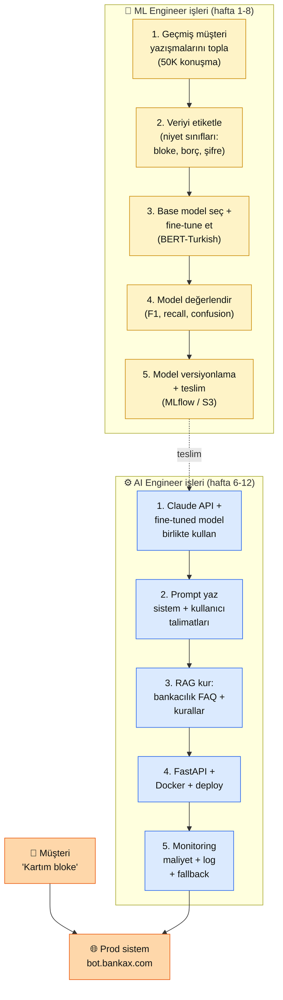

# 1.2 AI Engineer vs ML Engineer — İki Rol, Bir İş Arasında

<div class="ma-meta" markdown>
<div class="ma-meta-row" markdown>
<strong>Kim için:</strong>
<span class="ma-persona ma-persona-baslangic">🟢 başlangıç</span>
<span class="ma-persona ma-persona-is">🔵 iş</span>
<span class="ma-persona ma-persona-kisisel">🟣 kişisel</span>
</div>
<div class="ma-meta-row"><strong>⏱️ Süre:</strong> ~30 dakika</div>
<div class="ma-meta-row"><strong>📋 Önkoşul:</strong> 1.1 okundu (AI Engineer tanımı netleşti). Kod tecrübesi zorunlu değil — ayrımı anlamak için gerek yok.</div>
<div class="ma-meta-row"><strong>🎯 Çıktı:</strong> Bir müşteri destek chatbot'u senaryosunda ML Engineer ve AI Engineer'ın hangi adımı yaptığını saat saat anlatabiliyorsun; iki rolün araç setleri, beceri ağırlığı, kariyer yolu ve maaş bandı arasındaki farkı kendi cümlelerinle ayırabiliyorsun; sen ikisinden hangisine daha yakınsın net.</div>
</div>

!!! tip "Yabancı kelime mi gördün?"
    **Model** = eğitilmiş yapay zekâ beyni (parametre dosyası). **Training** (eğitim) = modele örnek göstererek öğretmek; haftalarca GPU işi. **Inference** (çıkarım) = eğitilmiş modele soru sorup cevap almak; milisaniye işi. **Fine-tuning** (ince ayar) = var olan modeli özel veriyle yeniden eğitmek. **Dataset** (veri seti) = eğitim için toplanan etiketli/etiketsiz örnekler. **GPU** = grafik işlemci; AI hesaplamaları için 50× hızlı ama pahalı donanım.

## Neden bu sayfa?

1.1'de iki rolü tek paragrafla ayırdık. Ama iş ilanına başvururken, LinkedIn bio'nu yazarken, "hangi yola gideyim" kararı verirken kafa karışıklığı devam ediyor olabilir. Bu sayfa **somut bir senaryo** üzerinden iki rolün ne yaptığını dakika dakika gösterir: bir şirketin müşteri destek chatbot'u kurulurken **ML Engineer hangi 5 işi yapar, AI Engineer hangi 5 işi yapar?**

İkincisi: İki rol çakışır görünebilir ama kariyer yolları farklıdır. ML Engineer olmak için **Yüksek lisans / doktora** gerekir mi, AI Engineer olmak için **bootcamp** yeter mi? Gerçek cevap bu sayfada — ikisi de kadar kesin değil, ama eğilim var.

Üçüncüsü: Sen bu platformu okuyorsun. Platform **AI Engineer** yolunu öğretir, bu net. Ama ML'e sempati duyuyorsan, "Bölüm 5'te (RAG vs Fine-tuning) benim işim ML'ye yakın olacak mı?" sorusunun cevabı önemli. Sayfa sonunda "bu platformda bana yarayacak parçalar" hakkında sezgin olur.

## Tek cümleyle ayrım

**ML Engineer model üretir. AI Engineer modeli ürüne çevirir.**

Bu cümleyi ezberle. Geri kalan her şey bu cümlenin açılımıdır.

## Somut senaryo — "Müşteri destek chatbot'u" projesi

Diyelim ki **BankaX** müşteri destek maliyetini düşürmek için bir chatbot istedi. Amaç: müşteri "kartım bloke oldu" yazınca, sistem önce basit sorulara kendi cevap versin, karmaşıksa insan temsilcisine yönlendirsin. İki mühendislik rolü bu projede paralel çalışır.

<div class="ma-ekosistem" markdown>
<div class="ma-ekosistem-header">🗺️ BankaX chatbot projesi — iki rol, paralel akış</div>



**İki rol farklı haftalarda çalışır.** ML Engineer ilk 8 hafta veri + model ile, AI Engineer 6-12. haftalarda ürünleştirme ile meşgul. 6-8. haftalar kesişim — ML teslim eder, AI almaya başlar.

</div>

## 10 iş — 5 ML, 5 AI, dakika dakika

### ML Engineer — bu 5 iş senin değil

1. **Veri toplama + temizleme (2 hafta):** 50.000 geçmiş müşteri konuşmasını anonimleştir (kişi bilgisini çıkar), CSV (virgülle ayrılmış tablo) olarak kaydet, eksik alanları temizle. Araçlar: Python + pandas + SQL + Apache Beam (büyük veri akışı kütüphanesi). Alan uzmanlığı: veri mühendisliği + gizlilik (KVKK).

2. **Etiketleme + niyet sınıfı tasarımı (1.5 hafta):** Her konuşma için "müşterinin asıl isteği ne?" etiketi. 12 sınıf: `bloke`, `borç`, `şifre`, `hesap`, `yatırım`, vs. Karışık örneklerde ekip etiketler, anlaşamazlarsa kıdemli karar verir. Araç: Label Studio / Prodigy (etiketleme yazılımları).

3. **Temel model seçim + fine-tune / ince ayar (2-3 hafta):** Hazır Türkçe **BERT** (Google'ın 2018'de çıkardığı dil modeli ailesi; `dbmdz/bert-base-turkish-uncased` Türkçe sürümü) üzerine 40.000 konuşma ile ince ayar yap. GPU gerekir (2026'da 4× A100 ≈ saatlik $6-12, tam eğitim ~8 saat ≈ $50-100). Araç: PyTorch + Hugging Face Transformers.

4. **Değerlendirme + hata analizi (1 hafta):** Test setinde (10.000 konuşma) model nasıl gitti? Sınıf bazında **F1 skoru** (doğruluk + kapsama dengesinin tek sayı özeti) ne? Hangi 3 sınıf birbirine karışıyor? Karışıklık matrisini (confusion matrix) incele, gerekirse veri ekle + yeniden eğit. Araç: scikit-learn + matplotlib.

5. **Model sürümleme + teslim (0.5 hafta):** Model dosyası (`bertx.pt`, 420 MB) **S3**'e (Amazon'un dosya depolama servisi) yüklenir, MLflow'da (model takip aracı) sürümlenir, "v1.2.0 — F1 0.87" notu düşülür. Çalıştırma hızı için **ONNX**'e (model değişim formatı, çıkarım 3 kat hızlanır) çevrilir. Teslim belgesi AI Engineer'a. Araç: MLflow + ONNX Runtime.

**Süre toplam:** ~8 hafta, 1-2 ML Engineer.
**Donanım maliyeti:** ~$150-300 (GPU kiralaması).
**Araç seti:** Python + pandas + PyTorch + HF + MLflow + S3.

### AI Engineer — bu 5 iş senin

1. **Hibrit akış tasarımı (0.5 hafta):** "Önce fine-tuned niyet sınıflandırıcı çalışsın. Niyet `bloke` ise Claude devre dışı — hazır cevap dön. Niyet karışık veya `serbest_metin` ise Claude'a yönlendir." Karar ağacı yaz. Maliyeti düşürmek için bu ayrım kritik — her soruya Claude çağırmak aylık $500 oluyor.

2. **Prompt yazımı + sistem talimatı (1 hafta):** Claude için system prompt. Banka ton, yasal sorumluluk disklaymer, "ödeme yap" gibi eylem önerisini **yapma** komutu. Kullanıcı mesajına yönerge: "Bu konuşma bir banka müşterisiyle; amacın bilgi vermek, işlem yapmak değil." Prompt versiyonla; A/B test hazırlığı.

3. **RAG kur — BankaX kural dokümantasyonu (1.5 hafta):** Bankanın 140 sayfalık iç kuralları (faiz oranı değişimi, hesap açma kuralı, kart blokesi prosedürü). PDF'i ayrıştır (parse) → 800 token'lık parçalara böl (chunk) → Voyage AI ile vektöre çevir (embedding) → Qdrant'a (vektör veritabanı) kaydet. Claude'a soru geldiğinde önce ilgili 5 parçayı getir, bağlam (context) olarak ver. (Tüm bu zinciri Bölüm 4'te ayrıntıyla göreceksin; şimdi sadece "büyük belgeyi parçalayıp soru soracaksın" diye düşün.)

4. **FastAPI + Docker + yayına alma (1 hafta):** Uç noktalar (endpoints): `/chat` (ana), `/niyet` (ML modeli çağırır), `/kaynaklar` (RAG hata ayıklama). Docker Compose ile: uygulama + Qdrant + ML çıkarım kabı (container). Bölüm 9.3'teki otomatik yayım hattıyla GitHub'a gönder → ana dal → canlı. HTTPS + istek sınırı (rate limit) + kimlik doğrulama belirteci (auth token) BankaX kimliğiyle.

5. **İzleme + maliyet + yedek plan (sürekli):** Her çağrının token sayısını günlüğe yaz, aylık bütçe uyarısı ($400), Claude API 500 hatası verirse yedek plan (şablon cevap). PagerDuty (kriz sırasında telefonu çaldıran çağrı sistemi) entegrasyonu. Grafana panosu (Grafana = açık kaynak izleme aracı): çağrı sayısı, ortalama gecikme, dil dağılımı, günlük maliyet.

**Süre toplam:** ~5-6 hafta, 1 AI Engineer.
**Donanım maliyeti:** ~$10/ay (VPS) + ~$200/ay (Claude + Voyage, 100K müşteri trafiği).
**Araç seti:** Python + Claude SDK + FastAPI + Qdrant + Docker + GitHub Actions + Caddy.

## Karşılaştırma tablosu — 12 boyut

| Boyut | ML Engineer | AI Engineer |
|---|---|---|
| **Ana fiil** | Eğitmek | Entegre etmek |
| **Çalışma birimi** | Model versiyonu | Sistem özelliği |
| **Zaman birimi** | Haftalar | Günler |
| **Donanım** | GPU (kiralama $50-200/iş) | Laptop + VPS ($5/ay) |
| **Matematik** | Yoğun (lineer cebir, olasılık) | Hafif (yüzde, oran) |
| **Dil** | Python + CUDA | Python + YAML + Docker |
| **Kütüphane** | PyTorch, HF, sklearn, pandas | Claude SDK, FastAPI, Qdrant |
| **Başarı ölçüsü** | F1 skoru, recall (kapsama), MRR (sıralama metriği) | Canlı %99.9 ayakta kalma süresi, aylık fatura |
| **Öğrenme kaynağı** | Andrew Ng, Fast.ai, akademik makaleler | Anthropic Docs, Cookbook, Academy |
| **Eğitim süresi (0→iş)** | 2-3 yıl | 6-12 ay |
| **Formal eğitim** | BS + MS tavsiye, PhD rekabetçi | Diploma zorunsuz, portföy kilit |
| **Ev ortamı** | Cloud GPU gerekebilir | Laptop + internet yeter |

## Sen hangi role daha yakınsın? — karar ağacı

```
1. Matematiksel modelleri derinlemesine anlamak mı, yoksa
   çalışan bir ürün çıkarmak mı seni daha çok motive eder?
   → Model derinliği → ML Engineer yolu
   → Ürün çıkarmak → AI Engineer yolu (bu platform)

2. "Günde 6 saat veri temizleyip modelin F1'i 0.87'den 0.89'a
   çıkmasını izlemek" senin için:
   → Tatmin edici → ML Engineer
   → Sıkıcı → AI Engineer

3. "Canlı sistem 3 saat nasıl ayakta kalır, uyumadım"
   cümlesi senin için:
   → Kabus → ML Engineer (ofis saatleri çalışır)
   → Meydan okuma → AI Engineer (on-call rotasyonu normaldir)

4. Şu an (İngilizce) paper okumak:
   → Zevkli → ML Engineer
   → Dayanılmaz → AI Engineer (dokümantasyon yeter)

5. Bütçen:
   → Aylık $50-200 öğrenme için ayırabilirim → ML OK
   → Aylık $10-20 yeter → AI Engineer (ideal)
```

**4+ cevap AI Engineer'a doğruysa bu platform tam sana göre.**
**4+ cevap ML Engineer'a doğruysa** platform yine işe yarar (prompt + entegrasyon biliyor olmak ML rolünde de değerli) **ama yoğunluğunu Bölüm 2 + 4 + 6'da tut**; deploy sayfalarını hafif geç.

## Kariyer geçiş senaryoları — 4 yaygın yol

### Senaryo 1: Backend geliştirici → AI Engineer (en kolay)

- **Başlangıç:** 3+ yıl Python/Node backend tecrübesi, REST API yazabiliyor.
- **Eksik:** Prompt, RAG, vector DB, LLM ekosistemi.
- **Platform rotası:** Bölüm 2 → Bölüm 4 → Bölüm 6 → Bölüm 9. Bölüm 0 atla, Bölüm 8 hızlı geç.
- **Süre:** 3-4 ay, haftada 5-8 saat.
- **Geçiş kolaylığı:** ⭐⭐⭐⭐⭐ (arka planın zaten %70).

### Senaryo 2: Frontend/fullstack → AI Engineer (orta)

- **Başlangıç:** React/Vue, biraz Python biliyor.
- **Eksik:** Python derinliği, backend refleksi, prompt.
- **Platform rotası:** Bölüm 0 (Python + FastAPI) → Bölüm 2 → Bölüm 4 → Bölüm 9.
- **Süre:** 5-6 ay.
- **Geçiş kolaylığı:** ⭐⭐⭐⭐ (Python köprü kurmak gerek).

### Senaryo 3: Data Analyst / Data Engineer → AI Engineer (orta)

- **Başlangıç:** SQL + pandas iyi, Python orta, ML bilgisi yüzeysel.
- **Eksik:** Backend + deploy + API.
- **Platform rotası:** Bölüm 0 (FastAPI'ye odak) → Bölüm 2 → Bölüm 4 (RAG data avantajla) → Bölüm 9.
- **Süre:** 4-5 ay.
- **Geçiş kolaylığı:** ⭐⭐⭐⭐ (veri tarafı güçlü, ürün tarafı zayıf).

### Senaryo 4: Sıfırdan (alan dışı) → AI Engineer (zor ama mümkün)

- **Başlangıç:** Avukat / öğretmen / kimyacı / muhasebeci. Kod hiç yok.
- **Eksik:** Her şey teknik tarafta.
- **Platform rotası:** Bölüm 0 (yavaş) → Bölüm 1 (kesin) → Bölüm 2 (sindirerek) → Bölüm 4 → Bölüm 9.
- **Süre:** 8-14 ay (günde 45-60 dk).
- **Geçiş kolaylığı:** ⭐⭐⭐ (tempo düşür ama **alan bilgin büyük avantaj**).
- **Önemli:** İlk iş olarak "AI Engineer + avukat" ikilisi sen için bire-bir uygun — legal tech startup'ları özellikle alan uzmanı + AI becerisi olan insan arıyor.

### ML Engineer'dan AI Engineer'a geçiş (tersi)

ML Engineer'sen ve AI Engineer rolüne geçmek istiyorsan: **Bölüm 2 + 6 + 9** yeter. Prompt disiplini + agent/MCP + yayına alma refleksi. 2-3 ay içinde geçebilirsin, hatta ikisini beraber yapabilirsin: **MLOps Engineer** (Machine Learning Operations — model üretim hattı uzmanı) rolü bu iki yolun ortak kesişimidir.

## 2026 maaş bantları — gerçekçi rakamlar

!!! warning "Maaş rakamları yaklaşık"
    Aşağıdaki rakamlar 2026 ilk çeyrek LinkedIn / Glassdoor / levels.fyi taramasından. Şehir, deneyim, şirket büyüklüğüne göre ±%30-50 değişir. Türkiye rakamları TL bazlı, enflasyon riskli. Uzaktan (remote) çalışmada yabancı şirket → 2-3× zarf. Kendini değerlendirmek için **kendi bölgendeki ilanları tara** — bu tablo sadece yön verir.

### Türkiye (TL/ay, net)

| Seviye | ML Engineer | AI Engineer | Not |
|---|---|---|---|
| Junior (0-2 yıl) | 55-80K | 50-75K | AI biraz düşük çünkü alan yeni |
| Mid (2-5 yıl) | 90-140K | 90-130K | Neredeyse eşit |
| Senior (5+ yıl) | 150-250K | 140-220K | ML yüksek ama AI hızlı yakalıyor |
| Staff/Principal | 250K+ | 220K+ | Azınlık |

### Remote / yurtdışı (USD/ay, brüt, fullstack remote)

| Seviye | ML Engineer | AI Engineer | Not |
|---|---|---|---|
| Junior | $3-5K | $3-5K | Avrupa şirketleri |
| Mid | $6-10K | $6-10K | ABD startup remote |
| Senior | $12-20K | $12-18K | FAANG benzeri |

**AI Engineer'ın yükselişi:** 2023'te AI Engineer maaş bandı ML'den açık ara aşağıdaydı. 2026'ya gelindiğinde neredeyse eşitlendi, hatta üst seviyelerde AI Engineer daha yüksek pozisyonlar da çıkıyor (Applied AI Lead gibi). Sebep: LLM'i kuran kaynak ML tarafında **bol** (hazır modeller), LLM'i kullanıma açan insan **az**. Arz-talep lehine.

## İki rol arasındaki gri alan — MLOps

**MLOps Engineer**: ML Engineer'ın teslim ettiği modeli AI Engineer'ın sistemine taşıyan, versiyonlama + serving + monitoring yapan rol. İki rolün kesişim noktası.

- **Sorumluluk:** Model sunucusu (TorchServe, BentoML, Triton), model versiyonlama (MLflow), A/B test altyapısı, GPU kümesi yönetimi.
- **Tecrübe profili:** Backend + DevOps + biraz ML + biraz Kubernetes.
- **Kariyer yolu:** Backend → MLOps (12-18 ay). AI Engineer'sen MLOps'a geçmek zor değil; 6 ayda yakalar.
- **Maaş:** Genelde AI Engineer ve ML Engineer'ın üstünde (DevOps zarfı + AI talebi).

Bu platform MLOps'u **kapsamaz** (scope dışı). Ama Bölüm 9 deploy sayfaları (9.1 Docker + 9.2 Cloud + 9.3 CI/CD) MLOps'un %40'ıdır. Bölüm 9 bitince MLOps yoluna geçmek için Kubernetes + MLflow eklemek 3-4 ay.

## CTO tuzakları — iki rol arasında kaybolmamak

| # | Tuzak | Sonuç | Doğru |
|---|---|---|---|
| 1 | Her iki rolü aynı anda öğrenmek | Hiçbirinde derin olmayan profil | Önce birini seç, 6-12 ay sonra ikincisi |
| 2 | "AI Engineer ML'den az değerli" miti | Yanlış pozisyon hedefi | 2026 rakamları neredeyse eşit |
| 3 | LinkedIn bio'ya "AI/ML Engineer" yazmak | Hiçbir iş ilanı sana uymaz | Net seç: "AI Engineer" veya "ML Engineer" |
| 4 | Matematik korkusu ML'den kaçış | Mantıklı tercih, ama sebebini söyleme | AI Engineer tercihi motivasyon üzerinden, korku üzerinden değil |
| 5 | Matematik sevgisi AI'dan ayrılma | Yanlış — AI rollerinde de matematik zorlanabilir | Bölüm 5 RAG vs FT'te matematik hafif gelir; dene |
| 6 | Kalıcı karar zannı | Bir rolü seçince geri dönüşü yok sanma | 2 yılda iki role de bakabilirsin, esneklik yüksek |
| 7 | "Hangi rol daha çok bulur" sorusu | Yüzeysel arama, doğru rol değil | "Hangi rol beni sıkmaz" sorusu daha değerli |
| 8 | Birinin diğerini küçümsemesi | LinkedIn kavgası, öğrenme kaybı | İki rol farklı, ikisi de değerli, sen biri seç |

## Anthropic ekosistemi — iki rol için farklı kaynaklar

<details class="ma-anthropic-oz" markdown>
<summary><strong>🤖 Anthropic-öz: Anthropic'in her iki role bakışı</strong></summary>

- **Anthropic'te ML Engineer** → "Research Engineer" veya "Applied Scientist" unvanı. Claude'un kendisini geliştiren takım. PhD düzeyi matematik + sistem beklentisi. Sıfır → bu rol ~5-7 yıl.
- **Anthropic'te AI Engineer** → "Technical Staff" veya "Applied AI Engineer" unvanı. Claude'u API/Platform olarak sunan + müşteriye entegre eden takım. Bu rol → aktif işe alımda, bu platformun hedeflediği profil.
- **Öğrenme araçları:**
    - AI Engineer için: [Anthropic Academy](https://www.anthropic.com/learn) — "Building with Claude on the API", "Tool Use", "MCP" kursları
    - ML Engineer için: [Anthropic Research](https://www.anthropic.com/research) — teknik makaleler, model mimarisi yayınları; Academy'de **az**
- **Üretim ortamı için Claude:** her iki rol de Claude'u farklı amaçla kullanır — ML rolünde model karşılaştırma/değerlendirme için, AI rolünde doğrudan ürün omurgası için. Bu platform ikincisinden yürür.

</details>

## Çıktı kanıtları — 3 kanıt

<div class="ma-cikti-kaniti" markdown>
<div class="ma-cikti-kaniti-header">📏 Çıktı — 3 kanıt</div>

**1. BankaX senaryosunu birine anlat:**

Bir arkadaşına (veya boş sandalyeye) 3 dakikada **ML ve AI Engineer'ın BankaX chatbotunda hangi 5 işi yaptığını** anlat. Sayfa açık kalmasın — kafadan. Takıldığın adım zayıf nokta, oraya tekrar dön.

**2. Karar ağacı cevapları:**

Yukarıdaki 5 soruya kendi cevabını yaz (dosyana). Hangi role daha yakınsın? Hangi soruda tereddüt ettin? Tereddütlü noktalar 1.4'teki persona seçimini etkiler.

**3. Kendi kariyer senaryon:**

4 senaryodan hangisi sen? Platformda hangi bölümlere odaklanmalısın — kendi yolunu 1-2 cümle çiz. (1.4'te detaya inilir.)

**Kanıt dosyası:** `muhendisal-notlarim/bolum-1/02-karar.md`.

</div>

## Görev — 20 dakika, kendi yerini net gör

<div class="ma-gorev" markdown>
<div class="ma-gorev-header">🎯 Görev — rolü seç, bildik dille yaz</div>

1. LinkedIn'de aç: iki ayrı arama yap — "ML Engineer Türkiye" + "AI Engineer Türkiye". İlk 10 ilanın istenen yetkinliklerini karşılaştır. Hangi liste sana daha **yapılabilir** geliyor?

2. Yukarıdaki 5-soru karar ağacını cevapla. Ağırlık hangi tarafta?

3. `muhendisal-notlarim/bolum-1/02-karar.md` dosyasına yaz:
   - **Kararım:** AI Engineer / ML Engineer / Henüz emin değilim
   - **Gerekçe:** 2 cümle
   - **Gelecek 3 ayda:** Hangi bölümlere önceleyeceğim (1.4'te detay)

4. (İsteğe bağlı) Karar "emin değilim"se → 1.3 (Ekosistem 2026) sonrası kararı tekrar ver. İki sayfa daha okuyunca netleşecek.

**Başarı kriteri:** 20 dakika sonra elde 1 cümlelik kariyer yönü (pozisyon adı + gelecek 3 ay odak bölümü) var.

</div>

<div class="ma-neden-sonuc" markdown>
<div class="ma-neden-sonuc-header">🔗 Birlikte okuma — neden ne oldu</div>

<ol class="ma-neden-sonuc-zincir" markdown>
<li>**Tek cümlelik ayrım: ML model üretir, AI modeli ürüne çevirir.** Her şey bu cümleden çıkar. Bu yüzden **role özgü araç ve beceri seti ayrışır.**</li>
<li>**BankaX senaryosu iki rolü somutlaştırır.** 5+5 iş dakika dakika gösterildi. Bu yüzden **soyut tanım yerine gerçek iş akışı görünür.**</li>
<li>**12 boyutlu tablo karar kolaylaştırır.** Dil, donanım, matematik, maaş, formal eğitim. Bu yüzden **kendi konumunu tabloda bulabiliyorsun.**</li>
<li>**Karar ağacı motivasyon tabanlıdır.** Korku değil, zevk ve ritim tercihine yaslanır. Bu yüzden **yanlış role giren kişi tükenir, doğru role giren ilerler.**</li>
<li>**4 kariyer geçiş senaryosu her profile yol haritası verir.** Backend, frontend, data, sıfırdan. Bu yüzden **hangi geçmişten gelirsen gel, platforma giriş noktası net.**</li>
<li>**2026 maaş bantları neredeyse eşit.** AI Engineer yükselişte; MCP + agent talebi büyüyor. Bu yüzden **maaş farkı karar kriteri olmaktan çıktı.**</li>
<li>**MLOps iki rolün kesişimidir.** Bu platform Bölüm 9 ile o tarafa köprü atar. Bu yüzden **AI Engineer bitince MLOps'a geçiş 3-4 ay.**</li>
</ol>

<div class="ma-neden-sonuc-sonuc" markdown>
**Sonuç:** "AI Engineer" ile "ML Engineer" birbirini tamamlayan iki rol. Sen birini seçtin mi — en azından şimdi — platformun geri kalanı daha anlamlı ilerler. **Bir sonraki:** 2026 ekosistem haritası — hangi modeller, hangi provider'lar, hangi lisanslar.
</div>
</div>

<div class="ma-sonraki" markdown>
<div class="ma-sonraki-header">➡️ Sonraki adım</div>

**[1.3 AI Ekosistemi 2026 →](03-ekosistem.md)** — Hangi model kimindir, fiyat/performans nasıl, Türkiye'den neye erişebiliyorsun.

← [1.1 AI Engineer Nedir](01-ai-engineer-nedir.md) &nbsp;|&nbsp; [Bölüm 1 girişi](index.md) &nbsp;|&nbsp; [Ana sayfa](../index.md)

**Pekiştirme:** Andrew Ng'in [AI for Everyone](https://www.coursera.org/learn/ai-for-everyone) kursu (ücretsiz, İngilizce, Türkçe altyazı var) iki rol arasındaki farkı yöneticilere anlatır; teknik değil kavramsal. Bir cumartesi akşamı 2 saat — perspektif kazandırır.
</div>
