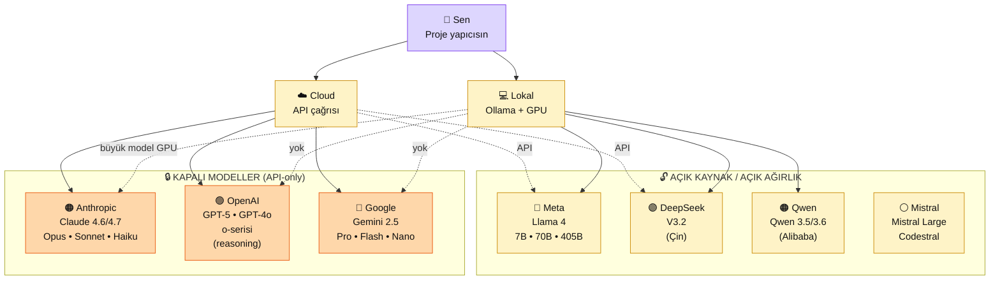

# 1.3 AI Ekosistemi 2026 — Harita, Fiyat, Lisans, Türkiye

<strong>Kim için:</strong>
🟢 başlangıç
🔵 iş
🟣 kişisel

<strong>⏱️ Süre:</strong> ~35 dakika

<strong>📋 Önkoşul:</strong> 1.1 + 1.2 okundu önerilir (AI Engineer tanımı + ML ayrımı). Teknik tecrübe zorunsuz.

<strong>🎯 Çıktı:</strong> 2026'da hangi şirketin hangi modeli sunduğunu biliyorsun; açık kaynak vs kapalı model ayrımını yapabiliyorsun; kendi projen için hangi modeli seçeceğine yön veren 5 kriteri kullanabiliyorsun; Türkiye'den ödeme/erişim/KVKK açısından ne işlediğini somut olarak biliyorsun.

!!! tip "Yabancı kelime mi gördün?"
    **Provider** (sağlayıcı) = modeli sunan şirket (Anthropic, OpenAI, Google). **Kapalı model** (closed-source) = ağırlıkları indirilemez, sadece API ile erişilir. **Açık model** (open-weight) = ağırlıkları indirip kendi makinende çalıştırabilirsin. **Context window** (bağlam penceresi) = modelin bir seferde "akıl"da tutabildiği token sayısı. **Throughput** (işlem hızı) = saniyede kaç token üretilir. **Inference** (çıkarım) = modelin çalıştırılması, eğitim değil.

## Neden bu sayfa?

İlk AI projeni kurmaya başlarken en temel soru: **"Hangi modeli kullanayım?"** Popüler cevap "ChatGPT" — ama ChatGPT bir provider'ın (OpenAI) bir ürünü; 2026'da 6-8 ciddi alternatifi var. Seçim farkı ayda $50 tasarruf veya $500 fatura arasındaki fark olabilir; veri mahremiyeti gerektiren bir projede yasal fark olabilir; Türkiye'den ödeme zorluğunda erişim farkı olabilir.

İkincisi: 2026 itibarıyla **açık kaynak modeller** (Llama, Qwen, DeepSeek) kapalı modellerle rekabet edecek seviyeye geldi. Bir müşteri projende "verim bulutta dolaşmasın" diyorsa **Ollama + Llama 4** kombinasyonu geçerli cevap. Bu sayfa o ayrımı net gösterir.

Üçüncüsü: Bu platform **Anthropic Claude-first** pedagojide yürüyor. Neden? Sayfanın sonunda (ve [1.1 Anthropic-öz bloğunda](01-ai-engineer-nedir.md#anthropic-ekosistemi-neden-claude-first)) detayı var. Ama sen "neden diğeri değil" sorusuna eleştirel cevap almalısın — o da burada.

## 5 büyük provider — tek ekranda harita

🗺️ 2026 AI ekosistemi — provider × model × erişim

**İki büyük yol:**

- **Cloud API:** provider'a HTTP çağrı at, cevap al. Donanım derdi yok. Aylık kullanım ölçüsünde fatura.
- **Lokal (Ollama):** Açık kaynak modeli kendi makinene indir, çalıştır. Sıfır fatura (donanım hariç), ama büyük modellerde GPU şart.

**Kapalı modeller sadece Cloud.** Anthropic/OpenAI/Google modellerini indirip yerelde çalıştıramazsın — ağırlık dosyalarını dağıtmıyorlar.

## Provider detay — kim ne sunuyor

### 🟠 Anthropic (Claude ailesi) — bu platformun ana dili

**Şirket:** Ex-OpenAI kurucuları, 2021'de kuruldu. Odak: **güvenlik + dürüstlük + uzun bağlam**.

**Modeller (2026 Nisan):**

| Model | Güç | Hız | Bağlam | Fiyat (input/output per 1M token, yaklaşık) |
|---|---|---|---|---|
| **Opus 4.7** | Zirve (en yeni) | Orta | 200K+ | ~$15 / ~$75 |
| **Opus 4.6** | Çok yüksek | Orta | 200K | ~$15 / ~$75 |
| **Sonnet 4.6** | Yüksek (dengeli) | Hızlı | 200K | ~$3 / ~$15 |
| **Sonnet 4.6** | Yüksek | Hızlı | 200K | ~$3 / ~$15 |
| **Haiku 4.5** | Orta | Çok hızlı | 200K | ~$1 / ~$5 |

**Güçlü yönler:**
- En uzun dürüstlük refleksi ("emin değilim" der)
- 200K token bağlam (≈500 sayfa) — RAG + uzun belge işlemede üstün
- **MCP (Model Context Protocol)** — kendi çıkardığı protokol, endüstri standardı oldu
- [Claude Code](https://platform.claude.com/docs/en/docs/claude-code/overview) CLI + [Artifacts](https://www.anthropic.com/news/artifacts) özellikleri
- Türkçe performansı çok iyi (bu platform o yüzden Türkçe)

**Zayıf yönler:**
- Görsel üretim yok (DALL-E, Imagen gibi)
- Ses-metin yok (Whisper karşılığı yok)
- Hemen her sorunu "emin değilim" diye eğip bazen aşırı temkinli

**Ne zaman Claude?** — Uzun belge + RAG + agent + üretim refleksi. Platform bu yolun tam ortasında.

!!! tip "Güncel fiyatlar ve 6-ay revizyonu"
    Tablodaki rakamlar **2026 Nisan** yaklaşımlarıdır; kesin rakam için [anthropic.com/pricing](https://www.anthropic.com/pricing) sayfasını aç. Fiyatlar 6 ayda 2-3 kez değişebilir.

    **Bu sayfa okuyan için kural:** Okuduğun tarih 2026 Ekim'den sonraysa tablodaki rakamları **doğrulamadan kullanma**. Tüm pricing/versiyon tabloları bu sayfada 6 ayda bir revize edilir; en güncel kaynak provider'ların kendi sayfasıdır. Aynı kural bu platformdaki tüm fiyat/sürüm tablolarında geçerlidir.

### 🟢 OpenAI (GPT ailesi) — pazarın liderleri

**Şirket:** 2015, ChatGPT ile viralleşti. Pazarın en büyük payı (2026'da ~%55 API kullanım).

**Modeller (2026 güncel):**

| Model | Güç | Hız | Bağlam | Not |
|---|---|---|---|---|
| **GPT-5** | Zirve | Orta | 400K | En yeni nesil, Opus 4.7 rakibi |
| **GPT-4o** | Yüksek | Hızlı | 128K | Multimodal — ses + görsel destek |
| **o3 / o3-mini** | Yüksek (reasoning) | Yavaş | 200K | "Düşünen" seri — matematik/kod için |
| **gpt-4o-mini** | Orta | Çok hızlı | 128K | Haiku rakibi |

**Güçlü yönler:**
- **Multimodal** — ses + görsel + video anlama + görsel üretim (DALL-E, Sora)
- Geniş ekosistem (ChatGPT, plugin'ler, tool entegrasyonu)
- En büyük topluluk → en çok tutorial/örnek
- **OpenAI-uyumlu API** endüstri standardı (Ollama, DeepSeek, Mistral hepsi taklit eder)

**Zayıf yönler:**
- Hallucination (halüsinasyon) görece yüksek — "uydurma" kaçar
- Fiyatlandırma karmaşık (farklı model farklı fiyat, hızlı değişir)
- Veri kullanımı politikaları dalgalı (2023'ten beri 3 kez revize)

**Ne zaman GPT?** — Multimodal zorunlu (ses/görsel işleme), mevcut ekip zaten biliyor, veya OpenAI-uyumlu API şart.

### 🔵 Google (Gemini ailesi) — devreye yeni giren güç

**Şirket:** Google DeepMind + Brain birleşimi. 2024'te Gemini 1.0, 2026'da Gemini 2.5 serisi.

**Modeller:**

| Model | Güç | Hız | Bağlam | Not |
|---|---|---|---|---|
| **Gemini 2.5 Pro** | Zirve | Orta | **2M** | **Devasa bağlam** — 6 saatlik video |
| **Gemini 2.5 Flash** | Yüksek | Çok hızlı | 1M | Sonnet rakibi |
| **Gemini 2.5 Nano** | Orta | Cihaz-içi | Küçük | Android'de lokal çalışır |

**Güçlü yönler:**
- **2M token bağlam** — tüm kitap, uzun video, büyük codebase tek seferde
- Google ekosistem entegrasyonu (Drive, Docs, YouTube)
- Multimodal native (tasarımdan, sonradan eklenen değil)
- Ücretsiz tier cömert (AI Studio'da $0 başla)

**Zayıf yönler:**
- Türkçe performansı Claude/GPT'den bir adım geride
- API dokümantasyonu dağınık (SDK'lar parçalı)
- Üretim deneyimi yeni; kurumsal güven Claude/GPT altında

**Ne zaman Gemini?** — Devasa bağlam gerektiğinde (>200K token), Google Workspace entegrasyonu, video analizi.

### 🔵 Meta (Llama ailesi) — açık kaynak liderliği

**Şirket:** Meta AI Research. 2023'te Llama 1 ile açık kaynak devrimi başladı.

**Modeller (Llama 4, 2026):**

| Model | Parametre | Donanım | Kullanım |
|---|---|---|---|
| **Llama 4 8B** | 8 milyar | Laptop (16GB RAM) | Hobby, hızlı deneme |
| **Llama 4 70B** | 70 milyar | 2× A100 GPU ($50/saat) | Orta seviye üretim |
| **Llama 4 405B** | 405 milyar | 8× H100 ($200/saat) | Kurumsal, Claude rakibi |

**Güçlü yönler:**
- **Ağırlıklar açık** — ticari kullanım serbest (MAU < 700M, bu platform için tamamen)
- Veri gizliliği: veri hiç dışarı çıkmaz, kendi makinende
- Maliyet: donanım masrafı bir kez, sonra sıfır fatura
- Fine-tuning serbest — kendi veri setinle özelleştir
- Lokal çalışınca **offline** kullanım mümkün

**Zayıf yönler:**
- Büyük modeller pahalı donanım gerektirir (tek GPU yetmez)
- Performans hâlâ kapalı modellerin bir adım gerisinde (%10-15)
- Türkçe performansı orta; fine-tuning olmadan temiz değil
- Kurulum derdi (Ollama yardım eder ama hâlâ iş var)

**Ne zaman Llama?** — Veri gizliliği zorunlu (sağlık, finans, hukuk), API faturası gereksiz, offline kullanım, fine-tuning planı.

### 🟣 DeepSeek + 🟠 Qwen + ⚪ Mistral — diğer açık modeller

**DeepSeek (V3.2):** Çin menşeli. **Çok güçlü + çok ucuz**; 405B parametre, Claude Sonnet benzeri performans, API fiyatı ~10× ucuz. Ticari kullanıma açık. **Uyarı:** Veri çıkış noktası Çin sunucuları olabilir; KVKK hassas projelerde dikkat. Çözüm: Ollama ile lokal çalıştır.

**Qwen 3.5/3.6 (Alibaba):** Çin menşeli, özellikle kod + matematik güçlü. Ollama'da popüler. Llama rakibi.

**Mistral (Fransa):** Avrupa açık kaynak alternatifi, GDPR dostu. Codestral kod için ayrı model. Küçük modelleri (7B) çok iyi.

## Açık kaynak vs kapalı — 3 paragraf karar

**Açık kaynak kazandığı alanlar:**
- Veri gizliliği (finans, sağlık, hukuk)
- Uzun vade maliyet (yüksek hacim → API faturası → lokal model)
- Offline/lokal (internet yok, veri edge'de)
- Fine-tuning (özel alanda eğitim gerekli)
- Eğitim-araştırma (model iç yapısını görmek)

**Kapalı kazandığı alanlar:**
- Hızlı prototip (bir satır `pip install anthropic`, 30 saniyede ilk çağrı)
- En son teknoloji (GPT-5, Claude Opus, Gemini 2.5 — açık benchmark'larda hâlâ önde)
- Donanım yok (laptop + internet yeter)
- Üretim desteği (SLA, uptime taahhüdü, enterprise kontrat)
- Özel yetenekler (multimodal native, görsel üretim, ses sentezi)

**Hibrit yaklaşım** — **çoğu ciddi proje ikisini birlikte kullanır:** ucuz/sık sorular için açık (lokal), kritik/karmaşık sorular için kapalı (API). Bu platform Bölüm 0'da lokali, Bölüm 2+'dan itibaren API'yi öğretir; Bölüm 5'te (RAG vs Fine-tuning) ikisini birleştirir.

## Karar matrisi — bu proje için hangi model?

**5 kriter sırayla:**

<table class="ma-aktorler" markdown>

| # | Kriter | Açık (lokal) seç | Kapalı (API) seç | Karma |
|---|---|---|---|---|
| 1 | **Veri gizliliği** | KVKK/hassas → zorunlu | Veri paylaşılabilir | Kritik sorgular lokal |
| 2 | **Bütçe** | Aylık >$1000 → lokal | <$50/ay → API | $50-1000 → karma |
| 3 | **Kalite** | Orta yeterli | En üst gerek | Sıradan API, kritik Opus |
| 4 | **Hız** | <5 saniye OK | Milisaniye gerek | Streaming API |
| 5 | **Donanım** | GPU var (kendi veya cloud) | Yok | Küçük model lokal |

</table>

**Örnek karar akışı:**

- "CV analiz chatbot, ayda 100 kullanıcı, kişisel proje." → **Claude Haiku 4.5** ($1-5/ay fatura, hızlı, 200K bağlam).
- "Sağlık kayıtları asistanı, hasta verisi KVKK kapsamında." → **Llama 4 70B lokal** (veri hiç dışarı çıkmaz).
- "Hukuki doküman özeti, 300 sayfa PDF." → **Gemini 2.5 Pro** (2M bağlam tam fitness).
- "Video dersini transcribe + özet." → **GPT-4o** (ses + video multimodal).
- "Maliyet hassas agent sistemi, 10K çağrı/gün." → **DeepSeek V3.2 + Claude** karma (DeepSeek ucuz + Claude kritik kararlarda).

## Fiyat karşılaştırma — 1000 çağrılık proje

Varsayım: Ortalama çağrı 500 input + 300 output token. 1000 çağrı/ay. Yaklaşık fatura:

| Model | Aylık fiyat | Not |
|---|---|---|
| Llama 4 70B (kendi GPU'n) | $0 | Donanım yoksa yok |
| DeepSeek V3.2 API | ~$0.50 | En ucuz cloud |
| Haiku 4.5 | ~$2.00 | Hız + kalite dengesi |
| GPT-4o-mini | ~$2.50 | Claude Haiku rakibi |
| Gemini 2.5 Flash | ~$3.00 | Multimodal + büyük bağlam |
| Sonnet 4.5/4.6 | ~$6.00 | Platform default seçimi |
| GPT-5 | ~$10-15 | Premium |
| Opus 4.6/4.7 | ~$30-40 | Kritik karar için |

**Not:** 1K çağrı düşük hacim. Gerçek üretim genelde 10K-100K/ay — rakamları 10-100 ile çarp.

## Türkiye perspektifi — ödeme, erişim, KVKK

### Ödeme seçenekleri (2026 Nisan)

| Provider | Türkiye kredi kartı | Kripto | Alternatif |
|---|---|---|---|
| Anthropic | ✅ Çoğu banka | ❌ | - |
| OpenAI | ✅ Çoğu banka | ❌ | - |
| Google | ✅ Çoğu banka | ❌ | - |
| DeepSeek | ⚠️ Sınırlı | ✅ USDT | TR bankalarında bazen red |
| Meta (Llama açık) | N/A | N/A | Kendi donanımın |

**Altın ipucu:** Ödeme reddi alırsan (Anthropic Console "card declined") → bir başka bankanın sanal kartı dene (çoğu reddeden karta-özgü), veya Wise/Revolut sanal kart. Türkiye'den yapılan AI-API ödemelerinin %80+'ı bu yolla geçer.

### Gecikme (latency)

Türkiye'den API çağrıları:
- **Avrupa bölgesinden sunan provider:** ~60-100 ms (iyi)
- **ABD bölgesinden sunan:** ~150-200 ms (idare eder)
- **Asya-Pasifik:** ~250-400 ms (yavaş; kullanıcı hisseder)

Anthropic, OpenAI, Google **bölge seçimi yaptırmaz** — kendileri yönlendirir, sen göremezsin. Pratikte Avrupa'dan servis alıyorsun.

### KVKK uyumu

**Tehlikeli alan:** Türkiye KVKK'sı AB GDPR benzeri — kişisel veriyi yurtdışı sunucuya göndermek **uygun aydınlatma + rıza** gerektirir. B2B projelerinde çok önemli. Kısa kural:

- **Anonim veri (kişi kimliği çıkarılamaz):** Cloud API serbest.
- **Kişisel veri (ad, email, telefon, TC):** Ya açık rıza alacaksın (belge) ya da **lokal model** zorunlu.
- **Hassas veri (sağlık, hukuk, finans):** Neredeyse her zaman **lokal model** — Llama 4 70B + kendi VPS'inde.

Platformun Bölüm 8 (Güvenlik + Production) bu konuyu detayla açar.

## Model seçimi — kendi ilk projen için

🎯 Görev — 5 kriterle kendi projen için model seç

Kendi projen var mı? (1.4'te yazacaksın veya daha çiğ halde) Aşağıdaki formülü doldur:

1. **Proje:** Tek cümlede ne yapacak? _______________________
2. **Veri:** İşleyeceği veri kişisel/hassas mı? Evet / Hayır / Kısmen
3. **Hacim:** Aylık tahmini çağrı sayısı? ______
4. **Bütçe:** Aylık kaç TL/USD harcayabilirsin? ______
5. **Donanım:** Kendi GPU'n var mı? Evet / Hayır

Bu 5 cevaba göre tablo:

- Evet veri hassas + lokal donanım → **Llama 4 70B (Ollama)**
- Evet veri hassas + donanım yok → **Proje revize et veya GPU kirala**
- Hacim <1K/ay + veri normal → **Claude Haiku veya Sonnet**
- Hacim 1K-10K + multimodal gerek → **GPT-4o veya Gemini Flash**
- Hacim >10K + maliyet hassas → **DeepSeek V3.2**
- Kritik karar + uzun doküman → **Claude Sonnet/Opus**

Kanıt: `muhendisal-notlarim/bolum-1/03-model-karar.md` — 5 cevap + seçtiğin model + gerekçesi.

## CTO tuzakları — model seçerken yanlışa gitme

| # | Tuzak | Sonuç | Doğru |
|---|---|---|---|
| 1 | "En güçlü model = en iyi" | Ayda $500 fatura, gereksiz | Haiku/Flash başla, gerekirse yükselt |
| 2 | Tek provider'a kilit | API değişince tüm sistem bozulur | Soyutlama katmanı (abstract client) |
| 3 | Fiyat cetvelini unutmak | Q1'de $10, Q3'te $80 fatura | Aylık Anthropic Console budget alert |
| 4 | Multimodal gerekmeden GPT-4o | Claude-Haiku'nun 5× ücretini öde | İhtiyacı net tespit |
| 5 | DeepSeek'i KVKK olmadan kullanmak | Veri Çin sunucusunda, yasal risk | Ya lokal çalıştır ya veri anonimize |
| 6 | Llama'yı laptop'ta 70B çalıştırmak | RAM yetmez, makine donar | Küçük model (8B) başla, cloud GPU sonra |
| 7 | Hiç açık kaynak denememek | Veri gizliliği proje çıkınca hazırlıksız | Bölüm 0.3 Ollama deneyimini atlama |
| 8 | "Claude Türkçe kötü" miti | 2024 efsanesi, Sonnet 4.6 Türkçe iyi | Kendin test et, "Türkçe özetle" yaz |

## Anthropic-first — platformun gerekçesi, net

<strong>🤖 Anthropic-öz: 5 tercih gerekçesi</strong>

Platform neden Claude'u ana dil olarak seçti — eleştirel cevap:

1. **MCP (Model Context Protocol) endüstri standardı oldu.** 2024 Kasım'da Anthropic çıkardı, 2025-2026'da OpenAI, Google, IDE üreticileri (Cursor, VS Code, JetBrains) MCP'yi destekledi. Bölüm 6'da MCP server yazmak 2026 AI Engineer refleksinin kalbi — bu protokolü doğduğu yerden öğrenmek pedagojik olarak anlamlı.

2. **Uzun bağlam + dürüstlük.** Claude 200K bağlam + "emin değilim" refleksi birlikte RAG + agent projelerinde halüsinasyon riskini düşürür. Öğrenci için daha güvenli öğrenme: "Claude cevapladı ama yanlış" vakası görece az.

3. **Türkçe performansı sağlam.** Platform Türkçe. Öğrencinin denediği her örnek Türkçe çalışıyor olmalı — Claude'un Türkçe tutarlılığı (2026 Sonnet 4.5/4.6) bu ihtiyacı karşılıyor.

4. **Anthropic Academy ücretsiz + kaliteli.** 18+ kurs, hepsi ücretsiz, İngilizce (ama platform Türkçe özetler + alıştırma verir). Diğer provider'ların öğrenme kaynakları ya ücretli ya dağınık.

5. **Ürün düşüncesi.** Anthropic'in kendi ürünleri (Claude Code, Artifacts, Computer Use, Claude in Excel) öğrenciye "AI Engineer rol modeli" sunar. Claude'u kullanan kişi Anthropic'in nasıl düşündüğünü günlük olarak görür.

Reddedilen tercih — "Neden OpenAI değil?":

- OpenAI'nin avantajları (multimodal, pazar payı, topluluk büyüklüğü) gerçek ve platformda **ikinci dil olarak** yeri var (Bölüm 5'te LLM karşılaştırmada, Bölüm 10'da kariyer'de).
- Ama öğrenme refleksi olarak **kaynak tutarlılığı** ve **protokol merkezi** Claude'u öne çıkardı.
- Öğrenci Bölüm 10'a geldiğinde Claude + GPT + Gemini arasında rahat dolaşabilen AI Engineer profili çıkar; kilit yok.

Bu platform "GPT öğrenme YASAK" demez. "İlk dilin Claude olsun, sonra diğerleri kolay" der.

## Çıktı kanıtları — 3 kanıt

📏 Çıktı — 3 kanıt

**1. 5 provider'ı farklı biriyle anlat:**

Not defterine (veya birine sözlü) anlat: "Anthropic ne? OpenAI ne? Google ne? Meta ne? DeepSeek ne?" Her biri 2-3 cümle. Kolayca akıyor mu?

**2. Kendi seçimini yaz:**

`muhendisal-notlarim/bolum-1/03-model-karar.md` → kendi ilk proje için hangi modeli seçtin + 3 gerekçe.

**3. İlk hesapları aç:**

- Anthropic Console → hesap + ödeme koyma (ödeme sonra Bölüm 2'de)
- OpenAI API → hesap aç (sadece hesap)
- Google AI Studio → hesap aç (ücretsiz tier tanı)

Her üçünün dashboard ekran görüntüsü kanıt dosyana.

## Bölüm 1 kapanışa yaklaşıyor

Bu sayfa Bölüm 1'in son **kavram yoğun** sayfası. Sonraki sayfa ([1.4 Yol Seçimi](04-yol-secimi.md)) kararı **eyleme** çeviriyor — persona seç, 6 haftalık plan yaz, takvime koy.

Buraya kadar aldıklarında:
- AI Engineer'ın **ne yaptığı** (1.1)
- ML Engineer'dan **farkı** (1.2)
- Ekosistemdeki **yerini bulma** (1.3, bu sayfa)

Sonraki: **kendi yolun, kendi planın.**

🔗 Birlikte okuma — neden ne oldu

<ol class="ma-neden-sonuc-zincir" markdown>
<li>**2026'da 5 büyük provider + 3+ açık kaynak var.** Tek cevap "ChatGPT" değil. Bu yüzden **model seçimi projeye özel bir karar.**</li>
<li>**Kapalı vs Açık ayrımı başlangıç kararı.** Anthropic/OpenAI/Google API-only; Llama/Qwen kendi makinende. Bu yüzden **gizlilik veya bütçe kısıtı seçimi doğrudan şekillendirir.**</li>
<li>**5 kriterli karar matrisi proje odaklı.** Gizlilik, bütçe, kalite, hız, donanım. Bu yüzden **her proje için hangi modelin uygun olduğu sistematik oturur.**</li>
<li>**1000 çağrılık maliyet $0 ile $40 arasında değişir.** Aynı iş için model seçimi finansal. Bu yüzden **bütçe hesabı projenin başında yapılır.**</li>
<li>**Türkiye perspektifi seçimi şekillendirir.** Ödeme yöntemi, gecikme, KVKK. Bu yüzden **Türkiye'den geliştiren için bölgesel kısıtlar karar faktörü.**</li>
<li>**Anthropic-first 5 gerekçeyle meşru.** MCP + uzun bağlam + Türkçe + Academy + ürün refleksi. Bu yüzden **bu platform Claude-öncelikli pedagoji ile yürür.**</li>
<li>**Sonraki adım kişisel model seçimi.** Bu sayfanın matrisi + 1.4'ün persona planı birleşince somut yol çıkar. Bu yüzden **1.4'ü bitirmeden Bölüm 2'ye geçme.**</li>
</ol>

**Sonuç:** AI ekosistemi net görünür oldu; hangi provider ne sunuyor, senin projen hangisine oturur biliyorsun. 1.4'te bu bilgi plan haline dönüşecek.

➡️ Sonraki adım

**[1.4 Hangi Yolu Seçmeli →](04-yol-secimi.md)** — 3 persona × 6 haftalık somut plan. Kendi yolunu yaz.

← [1.2 AI Engineer vs ML Engineer](02-ai-vs-ml-engineer.md) &nbsp;|&nbsp; [Bölüm 1 girişi](index.md) &nbsp;|&nbsp; [Ana sayfa](../index.md)

**Pekiştirme:** [LMSYS Chatbot Arena](https://lmarena.ai/) — modelleri kör (model adı görünmez) karşılaştırma platformu; aynı prompt'u 2 modele sorar, hangisi daha iyi cevapladı seçersin. 2026'da modelleri hızlı test etmenin en objektif yolu. Hafta sonu 30 dakika dene, Claude/GPT/Gemini farklarını elinle hisset.

