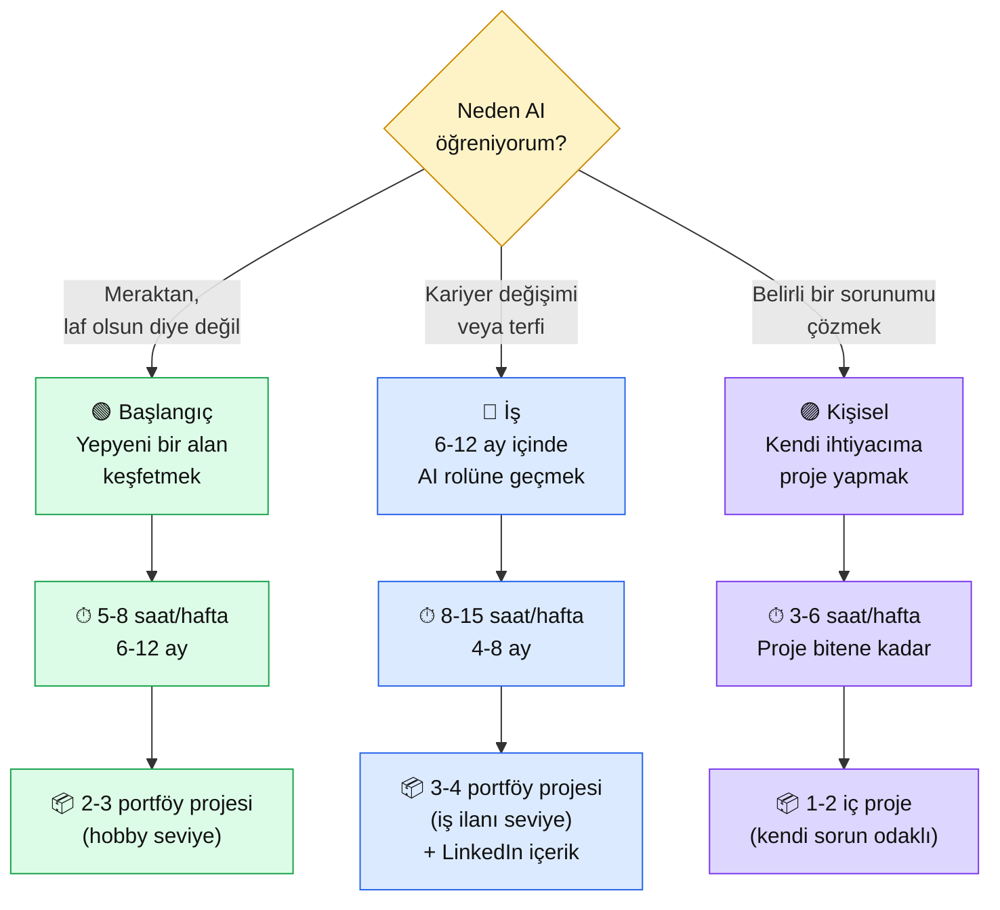

# 1.4 Hangi Yolu Seçmeli — 3 Persona × 6 Haftalık Somut Plan

<strong>Kim için:</strong>
🟢 başlangıç
🔵 iş
🟣 kişisel

<strong>📋 Önkoşul:</strong> 1.1 okundu (AI Engineer tanımı içselleştirildi). 1.2 + 1.3 önerilir ama zorunlu değil.

<strong>🎯 Çıktı:</strong> Sen üç personadan (🟢 başlangıç / 🔵 iş / 🟣 kişisel) hangisi olduğuna net karar vermişsin; önündeki 6 haftalık plan yazılı; haftalık çıkış kriterleri ve portföy projesi somut.

!!! tip "Yabancı kelime mi gördün?"
    **Persona** (persona) = öğrenci tipi, hedef okuyucu modeli. **Portföy** (portfolio) = GitHub + canlı URL + README'lerden oluşan iş başvuru kanıt paketi. **Checklist** = her hafta bitmesi gereken somut madde listesi.

## Neden bu sayfa?

Platform 11 bölüm, 67 sayfa, ~200 saatlik içerik. "Baştan sona oku" şeklinde yürünürse de **6-8 ay** sürer, doğru. Ama herkesin hedefi farklı: biri **iş bulmak** ister, biri **kendi projesini yapmak**, biri sadece **merakını gidermek**. Üç hedef farklı yol ister. Bu sayfa üç yolu açıkça yazar — sen kendini bulursun, planını koyarsın.

İkincisi: Hedefsiz çalışmak tüketir. 3. haftada "neden bunu yapıyorum?" diye duraksayan öğrenci 4. haftada kapatır. **Yazılı plan = panzehir.** Aşağıda sana bu sayfayı bitirmeden önce doldurman için bir şablon vereceğiz; planı görebilir halde tutacaksın.

Üçüncüsü: Personalar arasında geçiş mümkün. "🟢 başlangıç"tan "🔵 iş"e geçiş doğaldır — başlangıçta meraklıydın, 3 ay sonra ciddileştin. Bu sayfa bugünkü kendini seçmen için; 3 ay sonra tekrar okuyacaksın.

## Üç persona — hangisi sen?

🗺️ 3 Persona — motivasyon + zaman + hedef

<table class="ma-aktorler" markdown>

| Persona | Motivasyon | Haftalık zaman | Toplam süre | Portföy |
|---|---|---|---|---|
| 🟢 **Başlangıç** | Yeni alan keşfi, merak | 5-8 saat | 6-12 ay | 2-3 hobby proje |
| 🔵 **İş** | Kariyer değişimi / terfi | 8-15 saat | 4-8 ay | 3-4 ciddi proje + LinkedIn |
| 🟣 **Kişisel** | Kendi sorununu çözmek | 3-6 saat | Proje odaklı | 1-2 kişisel araç |

</table>

## 🟢 Başlangıç persona — "yeni alan keşfetmek"

### Sen kimsin

Kod hiç yazmadın veya çok az yazdın. AI/ChatGPT/Claude'u duydun, ilgini çekti. "Bu dünyayı **anlamak** istiyorum, bir ay sonra iş başvuracak değilim ama adım atmak istiyorum." Belki kimyacısın, belki öğretmensin, belki emeklisin, belki lise mezunusun 30 yaşındasın. Alan tecrüben AI dışında — ve bu bir avantaj, çünkü alan-uzman + AI = aranan insan.

### 6 haftalık plan (12 haftaya yayılabilir — günde 45 dk × 5 gün varsayımı)

<table class="ma-aktorler" markdown>

| Hafta | Bölüm | Sayfa sayısı | Çıkış kriteri (hafta sonunda elde ne var) |
|---|---|---|---|
| 1 | Bölüm 0 kurulum | 5 sayfa (0.1-0.5) | Yerel AI servisi: `curl /chat` ile mesaj alıp cevap dönen FastAPI |
| 2 | Bölüm 1 + Bölüm 2 (yarısı) | 4 + 4 sayfa | İlk Claude API çağrısı; tanımın + 3 farklı prompt tekniği |
| 3 | Bölüm 2 kalan + mini proje | 4 sayfa + proje | Kendi "soru-cevap" chatbot'un çalışıyor, Python kodu GitHub'da |
| 4 | Bölüm 3 + Bölüm 4 (ilk yarı) | 6 + 4 sayfa | Embedding'in ne olduğunu anlatabiliyorsun; ilk vector DB kurulumu |
| 5 | Bölüm 4 kalan + RAG projesi | 5 sayfa + proje | **Portföy 1:** PDF yükle → soru sor chatbot'u (kendi makinende çalışıyor) |
| 6 | Bölüm 9 (9.1 + 9.2 + 9.4) | 3 sayfa | **Portföy 1 canlı URL:** arkadaşına link atıp "bak bu benim projem" diyebiliyorsun |

</table>

**6 hafta sonunda:** 1 canlı portföy projesi, GitHub'da temiz repo, LinkedIn'de "ilk AI projemi deploy ettim" postu. **Bu seviyede AI Engineer iş başvurusu erken** — ama "ben bu işi yapabiliyorum"a somut kanıt. Sonraki 6 hafta Bölüm 5 + 6 + 8 + kalan proje → persona-2'ye (iş) geçmek için zemin.

### Kod sıfır öğrenci için özel notlar

- **Python korkusu gerçek.** Bölüm 0.2'de `venv` ilk kez görülünce kafa karışır. Çözüm: Claude'a sor. "Claude, venv nedir, neden kullanıyoruz, kısa Türkçe anlat" — 3 dakikada anlarsın.
- **İlk hata seni yıldırmasın.** 2. haftada "ModuleNotFoundError" alacaksın. Normal. Hata mesajını Claude'a yapıştır + "Türkçe açıkla, adım adım çöz" — Claude tutorun, doktorun, kodlayıcın.
- **Haftalık 5 saat rakamı kutsal değil.** Bazı haftalar 3 saat yaparsan zararı yok; peş peşe 3 haftada sıfır yaptıysan problem. Konsistans > yoğunluk.
- **İlk portföy projesi "etkileyici" olmak zorunda değil.** "CV'nin PDF'ini yükle, soru sor" chatbot yeter. Önemli olan çalışması + GitHub'da kodun olması.

### 6. hafta sonrası — nereye

- **Sonraki 6 hafta (7-12):** Bölüm 5 + 6 (Agent, MCP) + Bölüm 8 (Güvenlik) + ikinci portföy projesi (Agent bazlı). Bu noktada **persona 🔵 iş**'e geçmeye hazırsın — LinkedIn'de aktif ol, junior AI Engineer pozisyonlarına başvur.
- **İlk 3 ay bittiğinde:** Kendine sor "bu işi gerçekten seviyor muyum?" Cevap evet → iş persona'sına geç. Hayır → sorun yok, kendi hobby projen için devam.

## 🔵 İş persona — "6-12 ay içinde AI rolüne geçmek"

### Sen kimsin

Zaten bir iş hayatında (yazılım, mühendislik, muhasebe, ne olursa). AI alanına geçmek ya da mevcut rolünde AI'yi entegre etmek istiyorsun. Hedef **somut**: 6-12 ay içinde iş görüşmesi, 1 yıl içinde yeni pozisyon veya terfi. Haftalık 8-15 saat yatırım yapabiliyorsun (iş sonrası + hafta sonu).

### 6 haftalık yoğun plan (4 aya yayılabilir — günde 1.5-2 saat × 6 gün varsayımı)

<table class="ma-aktorler" markdown>

| Hafta | Bölüm | Çıkış kriteri |
|---|---|---|
| 1 | Bölüm 0 + Bölüm 2 (yarısı) | Yerel AI + Claude API + 5 prompt tekniği uygulanmış |
| 2 | Bölüm 2 kalan + Bölüm 3 | Token disiplini + embedding + ilk vector DB |
| 3 | Bölüm 4 (RAG tam) | **Portföy 1 taslağı:** RAG sistemi lokal çalışıyor |
| 4 | Bölüm 6 (Agent + MCP) | MCP server yazmış + basit agent kurmuş |
| 5 | Bölüm 9 (Deploy) | **Portföy 1 canlı URL** + **Portföy 2 taslağı** (agent) |
| 6 | Bölüm 8 + Bölüm 10 | **Portföy 2 canlı** + CV güncelleme + LinkedIn profili revize |

</table>

**6 hafta sonunda:** 2 canlı portföy projesi, LinkedIn'de 5+ içerik (hafta 1 post), aktif iş başvuruları. **8. haftadan itibaren görüşme davetleri bekle** — erken olabilir, normal de olur.

### İş ilanı refleksi — haftalık zorunlu

- **Pazartesi sabahı:** LinkedIn'de "AI Engineer" aramak, ilk 10 ilanı tarak. Hangi yetkinlik tekrarlanıyor? Bu hafta hangisine yatırım yapabilirsin?
- **Pazar akşamı:** Geçen hafta neyi bitirdin? GitHub commit grafik yeşil mi? LinkedIn'de bir şey paylaştın mı?
- **Ayda 1 kere:** 3-5 ilana başvur. Geri dönüş gelmezse gelmedi, cevap vermiyor yorgunluk yaratır — başvuru ritmini bozma.

### Portföy 3 projesi (zorunlu)

İş persona'sının elinde görüşme sonuna kadar **3 canlı proje** olmalı:

1. **RAG Chatbot** (Bölüm 9.4) — "PDF yükle, soru sor, kaynak göstersin"
2. **Agent/Otomasyon** (Bölüm 9.5) — "her sabah 6'da RSS tara, özet mail at" veya benzer
3. **Özel proje** — senin alanınla kesişen bir şey. Avukat mısın? "Hukuki metin analizcisi". Öğretmen misin? "Sınıf soru bankası üreticisi". **Alan x AI = seni ayırt eden.**

### LinkedIn strateji — 6 haftada görünür ol

- **Hafta 1:** Profil yeniden yaz — "AI Engineer (transition)" etiketi, about kısmı güncelle.
- **Hafta 2:** İlk öğrenme postu — "Bu hafta Claude API'siyle ilk Python çağrımı yaptım — işte kodu [GitHub link]."
- **Hafta 3:** İkinci post — "RAG nedir, 3 cümlede" (kendi öğrenmenin özeti).
- **Hafta 4:** Portföy 1 duyuru — "İlk projem canlıda [link]. Nasıl kurduğumu blog yazdım."
- **Hafta 5:** MCP deneyimi paylaşımı — "Anthropic MCP ile şunu denedim..."
- **Hafta 6:** Portföy 2 + iş arama açılışı — "3 portföy projem hazır, junior AI Engineer pozisyonlarına başvuruyorum. [Şirket adı]'da öneri/yönlendirme arayan var mı?"

Her post **altın kural**: 3-5 cümle özet + kod/link, fotoğraf > fotoğrafsız, spesifik proje > genel laf.

## 🟣 Kişisel persona — "kendi sorunumu çözmek"

### Sen kimsin

İş değiştirmek gibi bir derdin yok. Hali hazırda bir işin var, muhtemelen iyi bir işin. Ama **aklında belirli bir sorun var** — evin dağınıklığını yönetmek için bir sistem, İngilizce kelime ezberleme aracı, kendi notlarını aranabilir yapan bir sistem, anne-babanın ilaç takibi. AI "bu sorunu çözebilir mi?" diye düşündürdü.

### Proje odaklı plan — hafta sayısı projeye bağlı

Bu persona 6 haftalık zorunlu plana sahip değil. Projeye göre şekilleniyor. Ama üç adım:

**Adım 1 — İhtiyacını yaz (1 hafta):**

Kendine bir dosya aç: `kendi-projem.md`. Yaz:

- **Sorun:** Ne çözmek istiyorum? (bir paragraf, somut)
- **Kullanıcı:** Sadece ben mi? Eşim/çocuğum/ailem de kullanacak mı?
- **Başarı:** Bu sistem çalışırsa hayatımda ne değişir? Ölçülebilir?
- **Zaman:** Kaç hafta sonra çalışıyor olmalı?
- **Karmaşıklık:** Web arayüzü gerekli mi, yoksa terminal/mail yeter mi?

**Adım 2 — Platform haritasına yansıt (1 hafta):**

İhtiyacın aşağıdaki eşleştirmelerden hangisine yakın?

| İhtiyacın | İlgili bölümler | Öncelik |
|---|---|---|
| "Belgelerimden Claude'a sor" | Bölüm 0 + 2 + 3 + 4 | RAG chatbot yolu |
| "Claude bir iş yapsın (cron)" | Bölüm 0 + 2 + 6 + 9 | Agent yolu |
| "Claude benim API'ma erişsin" | Bölüm 0 + 2 + 6 (MCP) | MCP server yolu |
| "Claude'la sohbet, ama akıllı" | Bölüm 0 + 2 + 5 | Sistem prompt + memory |

Senin yolun 4 kolondan biri (veya karması). Bu **3 haftalık minimum** öğrenme.

**Adım 3 — Yap, kullan, gözle (2-6 hafta):**

Sistemi kur (1-2 hafta), kendi kullan (1-2 hafta — **en önemli aşama**, bu aşamada tüm tasarım hataları ortaya çıkar), revize et (1-2 hafta). Toplam: **proje bitirmeye 4-10 hafta**.

### 🟣 ipucu: "küçük tut"

Kişisel projede en büyük hata **aşırı hedef.** "Evdeki tüm cihazları AI ile kontrol edeceğim" = hiçbir zaman bitmez. "Mutfaktaki AC'yi Claude'a 'odam sıcak' dediğimde çalıştır" = 2 haftada biter, 1 yıl kullanırsın. **Küçük + bitmiş > büyük + yarım.**

## 30 dakikalık plan hazırlama atölyesi

Şu an, bu sayfayı okuduğun yerde, aşağıdaki şablonu doldur. 30 dakika yeter.

🎯 Görev — kendi planını yaz

**1. Persona seç (5 dk):**

"Bu anda hangi persona bana en yakın?" Üç cümlelik cevap:
- Persona: 🟢 / 🔵 / 🟣 (birini işaretle)
- Motivasyon: bir cümle
- 3 ay sonra kendimi nerede görmek istiyorum: bir cümle

**2. Haftalık taahhüt (5 dk):**

- Günlük zaman: ___ dakika
- Haftalık gün sayısı: ___ gün
- Haftalık toplam: ___ saat
- Hangi günler (takvimden işaretle): Pzt ___ Sal ___ Çar ___ Per ___ Cum ___ Cmt ___ Paz ___

**3. 6 haftalık milestone (10 dk):**

Yukarıdaki persona tablosundan kopyala, kendi takvim tarihleriyle:

| Hafta | Tarih aralığı | Bölüm | Çıkış kriteri |
|---|---|---|---|
| 1 | __ Nis - __ Nis | ... | ... |
| 2 | ... | ... | ... |
| 3 | ... | ... | ... |
| 4 | ... | ... | ... |
| 5 | ... | ... | ... |
| 6 | ... | ... | ... |

**4. Portföy hedefleri (5 dk):**

- 1. proje: ______ (6. hafta sonu canlı)
- 2. proje: ______ (12. hafta sonu canlı) — iş persona'sı için
- 3. proje: ______ (18. hafta sonu canlı) — iş persona'sı için

**5. Engel ön-analizi (5 dk):**

- En büyük engelim ne olabilir? (zaman / kod korkusu / ingilizce / motivasyon kaybı / ...)
- Bu engel çıkarsa ne yapacağım? (bir cümle strateji)

**Kaydet:** `muhendisal-notlarim/plan.md` → her hafta pazar akşamı tekrar oku, ilerlemeni işaretle.

## Haftalık ritüel — yatırımını koruyan üç şey

**Pazartesi sabahı (10 dk):**
- Geçen haftanın planı ne kadar tuttu? 3 üstünden kaç puan?
- Bu hafta hedef nedir?
- LinkedIn "AI Engineer" arama, 3 yeni ilan bak (sadece 🔵 iş persona için)

**Her gün (ilk 5 dk):**
- Bugün ne öğreneceğim? (1 satır)
- Dün nerede durduğumdan devam mı yoksa yeni bölüm mü?

**Pazar akşamı (20 dk):**
- Bu hafta neyi bitirdim? (git log okuma)
- Hangi sayfa benim için zor geldi? Neyi daha iyi anlamalıyım?
- Gelecek hafta hangi konuda Claude'a sorular hazırlayacağım?

**Ayda 1 kere (1 saat):**
- Plan revize — tempo doğru mu, yavaşlatayım mı hızlandırayım mı?
- Portföy durumu — hangi proje hangi aşamada?
- LinkedIn profil kontrol (🔵 persona) — güncel mi?

## CTO tuzakları — yolda karşına çıkacak

| # | Tuzak | Ne zaman olur | Çıkış |
|---|---|---|---|
| 1 | "Başka herkes daha hızlı" hissi | 3-4. hafta | Platform seninle yarışmıyor; tempo senin |
| 2 | Hedef değiştirme | 2-3 ay | Persona değişimi OK, ama 1 hafta düşün, sonra karar |
| 3 | Perfektionizm — "kodu mükemmel olmadan push etmem" | Bölüm 2-3 | Çirkin ama çalışan > güzel ama yarım |
| 4 | Kur-bırak (projeyi kurar, kullanmaz) | Portföy 1'den sonra | Kendi projenin ilk kullanıcısı olmak zorunlu |
| 5 | Claude-bağımlılık (düşünmeden her şeyi Claude'a sorma) | 5-6. hafta | Önce 10 dk kendin dene, sonra Claude'a sor |
| 6 | LinkedIn pasifliği (🔵) | 8-12. hafta | Haftada 1 içerik, kalite-odaklı |
| 7 | Burnout | 10-16. hafta | Hafta sonu tam dinlen, hobby dışı aktivite |
| 8 | Karşılaştırma (YouTube'da 20 yaşında AI startup kurmuş) | Sürekli | Onları değil, kendi 1 hafta önceki halini karşılaştır |

## Anthropic ekosistemi — persona köprüsü

<strong>🤖 Anthropic-öz: her persona için Academy kursları</strong>

Anthropic Academy'de ücretsiz kurslar var. Persona'na göre öncelik:

**🟢 Başlangıç için:**
- AI Fluency (4 hafta, 2 saat/hafta) — genel AI okuryazarlığı
- Prompt Engineering Interactive Tutorial — 9 ders, uygulama tabanlı

**🔵 İş için:**
- AI Fluency + Prompt Engineering (temel)
- Building with Claude on the API (SDK derinliği)
- Tool Use (Advanced) — MCP öncesi temel
- Claude in Excel / Claude Code — sektörel uygulamalar

**🟣 Kişisel için:**
- Prompt Engineering (yeterli)
- İhtiyacına göre spesifik kurs (RAG için, Claude Code için, vb.)

**Kaynak:** [anthropic.com/learn](https://www.anthropic.com/learn). Kurslar İngilizce — platformumuzdaki ilgili sayfa Türkçe özetini sana getirir, iki yol birbirini tamamlar.

## Çıktı kanıtları — 3 kanıt

📏 Çıktı — 3 kanıt

**1. Persona + haftalık taahhüt yazılı:**

`muhendisal-notlarim/plan.md` dosyası mevcut, içinde persona (🟢/🔵/🟣) + haftalık saat + 6 haftalık milestone tablosu var.

**2. Takvim girişi:**

Google Calendar / Takvim uygulamasında haftanın 5-6 günü "MühendisAl — 45 dk" bloku var. Her gün başında hatırlatma.

**3. Pazar ritüeli hatırlatması:**

Pazar akşamı 20:00'a "Haftalık ilerleme — 20 dk gözden geçirme" hatırlatması. Bu ritüel sonraki 6 haftanın motoru.

**Kanıt klasörü:** `muhendisal-notlarim/bolum-1/` — plan.md + ekran görüntüsü (takvim).

## Bitiş mesajı — bu Bölüm 1 kapanıyor

Buraya kadar geldin. Artık biliyorsun:

- **AI Engineer ne demek** (1.1)
- **ML Engineer'dan farkı** (1.2)
- **2026 ekosistem haritası** (1.3)
- **Kendi 6 haftalık planın** (bu sayfa)

Bölüm 1 teoriydi. Bölüm 2'den itibaren **elin klavyede**. İlk Claude API çağrın seni bekliyor, prompt yazmanın 5 tekniğini öğreneceksin, ilk basit chatbot'unu kuracaksın.

Eğer Bölüm 0'ı henüz geçmediysen şimdi [Bölüm 0'a](../bolum-0/index.md) geç — Python + Linux + yerel LLM kurulumu 5 sayfa, bir hafta iş. Sonra Bölüm 2'ye devamlı.

🔗 Birlikte okuma — neden ne oldu

- **A → B:** 3 persona (🟢/🔵/🟣) farklı motivasyon + zaman + hedef demektir; genel plan yerine kişisel plan gerek.
- **B → C:** 🟢 için 6 hafta = 1 canlı portföy; 🔵 için 6 hafta yoğun = 2 canlı portföy + LinkedIn; 🣣 için proje-odaklı zaman.
- **C → D:** İş persona'sı için **LinkedIn haftalık ritüel** zorunlu — sessiz kalan aday görünmez.
- **D → E:** Her persona için haftalık + aylık ritüel (pazartesi hedefle, pazar gözden geçir, ayda plan revize).
- **E → F:** 8 klasik tuzak (perfektionizm, kur-bırak, burnout, karşılaştırma) önceden tanı → kaçınma yolu net.
- **F → G:** Anthropic Academy persona'ya göre kurslar; platform + Academy iki yol birleşir.

**Sonuç:** Artık yazılı bir planın var. Persona seçildi, saatler ayrıldı, 6 haftalık hedef somut, portföy projeleri belirli. **Yola çıkıyoruz. Bölüm 0 hazırlık, Bölüm 2 ilk API çağrısı, Bölüm 9 canlı URL, Bölüm 10 iş başvuruları.**

➡️ Sonraki adım

**[Bölüm 0 — Temel Hazırlık →](../bolum-0/index.md)** — Eğer kurulum henüz bitmediyse. Python + Linux + Ollama + FastAPI, 5 sayfa, 1 hafta.

**veya**

**[Bölüm 2 — LLM ve Prompt Engineering →](../bolum-2/index.md)** — Bölüm 0 bitmişse doğrudan buraya. İlk Claude API çağrın bu bölümde.

← [1.3 Ekosistem 2026](03-ekosistem.md) &nbsp;|&nbsp; [Bölüm 1 girişi](index.md) &nbsp;|&nbsp; [Ana sayfa](../index.md)

**Pekiştirme:** [Anthropic Academy](https://www.anthropic.com/learn) kurs listesini bir kez tarayıp persona'na uygun 2-3 kursu hesabına kaydet + LinkedIn'de "AI Engineer Türkiye" ilanlarından 5-10 tanesini "save" et. Plan yazılırken bu ikisi referans olur.

