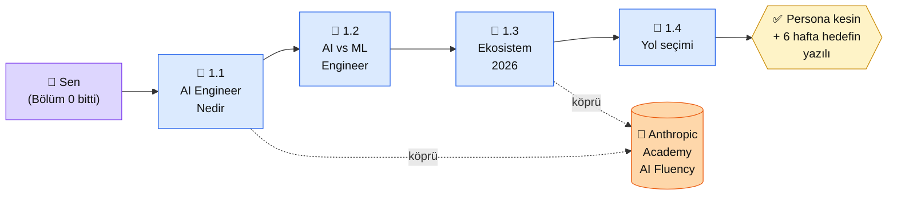

# Bölüm 1 — Giriş ve Temeller

**Persona:** Bölüm 0'ı bitirmiş (Python + yerel LLM ayakta), AI dünyasına girmek istiyor ama "AI Engineer", "ML Engineer", "GPT-4o vs Claude vs Gemini" gibi terimler kafasında dağınık · **Süre:** ~2 saat (4 sayfa × 30 dk) · **Önkoşul:** Bölüm 0 tamamlanmış · **Çıktı:** AI ekosisteminin 2026 haritasını zihinde oturtmuş, AI Engineer vs ML Engineer ayrımını yapabiliyor, persona yolunu kesin seçmiş

## Neden bu bölüm?

Bölüm 2'de "ilk Claude API çağrın"ı yapacaksın. Ama **doğru modeli seçmek, doğru servise karşılamak** için önce 2026 ekosisteminin nasıl göründüğünü bilmen gerek. Yoksa tanıdık bir isme (ChatGPT) atlamak çok cazip geliyor, ama proje gereksinimin ona hiç uymuyor olabilir.

İkincisi: "AI Engineer" terimi her yerde geçiyor ama farklı yerlerde farklı şey kastediliyor. LinkedIn'de "AI Engineer" çoğu zaman "Prompt mühendisi + entegrasyon yazan kişi"; akademide "ML Engineer'ın bir kolu"; startup dünyasında "PhD'siz ama Python bilen tech kurucu". Bu bölüm bu karışıklığı çözer — sen hangisine yakın, hangisine gitmek istiyorsun netleşir.

Üçüncüsü: Persona seçimini ana sayfada yapmış ama net değilsen, bu bölüm sonunda kesinleşir. 1.4'te "Hangi yolu seçmeli?" sayfası üç persona için somut hedef örnekleri gösterir.

## Bölüm 1 kısaca — ne öğreniyorsun

**1.1 — AI Engineer Nedir.** Terim ne zaman ortaya çıktı (2023 sonu, ChatGPT API'siyle), hangi işleri kapsıyor, hangilerini kapsamıyor. "Makine öğrenmesi araştırmacısı" değil — zaten eğitilmiş modelleri **entegre edip ürüne çeviren** kişi. Prompt yazmak, API'yi sarmalamak, vektör DB kurmak, deploy etmek — bu bölümün günlük işi.

**1.2 — AI Engineer vs ML Engineer.** En çok karıştırılan iki rol. ML Engineer model **eğitir** (data pipeline + training + evaluation). AI Engineer önceden eğitilmiş modeli **kullanır** (API + prompt + RAG + deploy). Sayfa somut örneklerle ayrımı yapar: bir müşteri destek chatbot'u her iki rol arasında nasıl bölünür, platform olarak senin hangi kısımda konumlanacaksın.

**1.3 — AI Ekosistemi 2026.** Kimler hangi modeli sunuyor (Anthropic Claude, OpenAI GPT, Google Gemini, Meta Llama, DeepSeek, Qwen); açık kaynak vs kapalı model ayrımı; fiyat/performans/lisans karşılaştırması. Bu sayfa karar-destek tablosu içerir — "bu proje için hangi modeli seçmeliyim?" sorusuna cevabın başlangıç noktası.

**1.4 — Hangi Yolu Seçmeli.** 3 persona (🟢 başlangıç / 🔵 iş / 🟣 kişisel) için somut proje örnekleri + her yolun Bölüm 2-9 arası hangi konulara yoğunlaşacağının haritası. Bu sayfa biter bitmez kendi 6 haftalık hedefin yazılı oluyor.

## Bu bölümün yol haritası

### Aktör tablosu

| Düğüm | Nerede | Ne iş yapıyor |
|---|---|---|
| 👤 **Sen** | Bölüm 0 sonrası — yerel LLM çalışıyor | Okuma odaklı bölüm: 4 sayfa oku, 3 persona üzerinde kendini test et |
| 📄 **1.1 AI Engineer Nedir** | Platform (okuma) | Terimin tanımı + ne yapar/ne yapmaz listesi + gerçek iş ilanı örnekleri |
| 📄 **1.2 AI vs ML** | Platform (okuma) | Ayrım tablosu + ortak proje üzerinde iki rolün iş dağılımı |
| 📄 **1.3 Ekosistem 2026** | Platform (okuma) | Model sağlayıcı haritası + fiyat/performans/lisans karşılaştırma tablosu |
| 🏁 **1.4 Yol seçimi** | Platform (karar) | 3 persona × somut proje örneği + 6 haftalık yol haritası şablonu |
| 📖 **Anthropic Academy** | [anthropic.skilljar.com](https://anthropic.skilljar.com/) | "AI Fluency: Framework & Foundations" + "AI Capabilities and Limitations" — bölüm sonrasında EN kaynakla derinleşmek istersen |
| ✅ **Çıktı (OUT)** | Kendi not defteri / README | 1 paragraf: "Ben 🟢/🔵/🟣 persona'sıyım, 6 hafta sonunda X projesini çıkaracağım" |

## Bu bölüm bittiğinde elinde ne olacak

- **Zihin haritası:** AI Engineer nedir, ML Engineer'dan nerede ayrılır, data/AI/ML ekipleri nasıl birbirine bakar
- **Model karar kasi:** Bir proje geldiğinde "Claude mı, GPT mi, Gemini mi, açık kaynak Llama/Qwen mi?" sorusuna cevap verebileceğin çerçeve
- **Persona netliği:** 🟢/🔵/🟣'den hangisinin sen olduğu kesin (ana sayfada seçtiysen bile 1.4'te doğrulanıyor veya değişiyor)
- **6 haftalık hedef cümlesi:** "Ben 6 hafta sonunda X aracı yapmış olacağım" — yazılı, saklanıyor, sonraki bölümlerde referans olacak
- **Anthropic Academy ilk tanışma:** "AI Fluency" kursunu duydun, belki 1.3'ten sonra açıp göz attın — ileride sertifikan olsun isteyen bir rota açıldı

Bu çıktı 2. bölüme geçmeden önce önemlidir: Bölüm 2'de ilk API çağrını atarken "niye Claude?" sorusunun cevabını burada oturtmuş olacaksın.

📖 Anthropic bu bölümde ne der — öz

Bölüm 1 bir **oryantasyon bölümü**; Anthropic'in 2 ücretsiz kursu bu oryantasyonu EN ile derinleştirir. Zorunlu değil — bölümü burada bitirip Bölüm 2'ye geçebilirsin — ama vaktin varsa aşağıdaki iki kurs güzel tamamlayıcı:

**1. AI Fluency: Framework & Foundations (Academy, ~45 dk, sertifikalı).** "AI nedir, nasıl düşünülür, hangi sorular sorulur" seviyesinde temel kazandırır. 1.1 ve 1.2'de anlattığımız ayrımları Anthropic'in kendi çerçevesiyle (4D: Delegation, Description, Discernment, Diligence) görmen için faydalı. Proje odaklı değil, zihinsel temel.

**2. AI Capabilities and Limitations (Academy, ~30 dk, sertifikalı).** LLM'lerin ne yapabildiği, ne yapamadığı, nerede hata eğilimi olduğu. 1.3 "Ekosistem 2026" sayfasında hangi modelin ne iş için olduğunu gördükten sonra, bu kursu açarsan "Claude neden halüsinasyon yapar?" gibi soruların cevabını Anthropic'in kendi ağzından duyuyorsun.

**3. "AI Engineer" terimi Anthropic'te yok.** Anthropic dokümanları "developer" veya "builder" der. 1.1'de kullandığımız "AI Engineer" terimi piyasa standardıdır (LinkedIn, O'Reilly kitapları); Anthropic'in kendi çerçevesiyle bire bir eşleşmez. Bu kasıtlı — piyasa ile konuşabilmen için piyasa terimini, Anthropic ile konuşurken Anthropic terimini kullanacaksın.

**Kaynak:** [Anthropic Academy — AI Fluency: Framework & Foundations](https://anthropic.skilljar.com/) (EN, ~45 dk, ücretsiz + sertifika). Bölüm 1 bitiminde aç — 1.4'teki persona kararını verdikten sonra bu kursu seyretmek, kararını Anthropic'in çerçevesiyle doğrulamana yarar.

## Kural dışı notlar (Tip A bölüm girişi)

Bu sayfa "Uygulama" bölümü içermiyor — Bölüm 1 **okuma-karar** bölümü. 4 alt sayfa da okuma ağırlıklı; tek "somut çıktı" 1.4 sonunda yazacağın 1 paragraflık persona + hedef cümlesi. "Çıktı Kanıtı" dev bloğu yok — onun yerine yukarıdaki **bölüm sonu çıktısı** listesi.

---

**Bir sonraki adım →** [1.1 AI Engineer Nedir](01-ai-engineer-nedir.md) (20 dk, terimin netleşmesi)

← [Bölüm 0 — Temel Hazırlık](../bolum-0/index.md) &nbsp;|&nbsp; [Ana Sayfa](../index.md)

