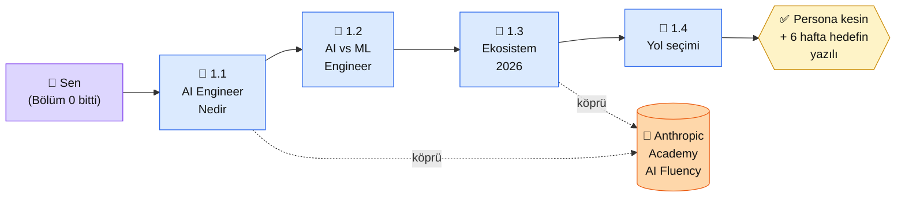

# Bölüm 1 — Giriş ve Temeller

👤 <strong>Kim için:</strong> Bölüm 0'ı bitirdin (Python + yerel LLM ayakta). AI dünyasına girmek istiyorsun ama "AI Engineer", "ML Engineer", "GPT-5 ile Claude ile Gemini" gibi terimler kafanda dağınık

⏱️ <strong>Süre:</strong> ~2 saat (4 sayfa × 30 dk)

📋 <strong>Önkoşul:</strong> Bölüm 0 tamamlanmış

🎯 <strong>Çıktı:</strong> AI ekosisteminin 2026 haritasını zihinde oturtmuş, AI Engineer ile ML Engineer ayrımını yapabiliyor, persona yolunu kesin seçmiş olursun

## Neden bu bölüm?

Bölüm 2'de "ilk Claude API çağrın"ı yapacaksın. Ama **doğru modeli seçmek, doğru servisi tercih etmek** için önce 2026 ekosisteminin nasıl göründüğünü bilmen gerek. Yoksa tanıdık bir isme (ChatGPT) atlamak çok cazip geliyor, ama proje gereksinimin ona hiç uymuyor olabilir.

İkincisi: "AI Engineer" terimi her yerde geçiyor ama farklı yerlerde farklı şey kastediliyor. LinkedIn'de "AI Engineer" çoğu zaman "Prompt mühendisi + entegrasyon yazan kişi" demek; akademide "ML Engineer'ın bir kolu"; girişim (startup) dünyasında "doktora yapmamış ama Python bilen teknik kurucu". Bu bölüm bu karışıklığı çözer — sen hangisine yakınsın, hangisine gitmek istiyorsun, netleşir.

Üçüncüsü: Persona seçimini ana sayfada yapmış ama net değilsen, bu bölüm sonunda kesinleşir. 1.4'te "Hangi yolu seçmeli?" sayfası üç persona için somut hedef örnekleri gösterir.

## Bölüm 1 kısaca — ne öğreniyorsun

**1.1 — AI Engineer Nedir.** Terim ne zaman ortaya çıktı (2023 sonu, ChatGPT API'siyle), hangi işleri kapsıyor, hangilerini kapsamıyor. "Makine öğrenmesi araştırmacısı" değil — zaten eğitilmiş modelleri **entegre edip ürüne çeviren** kişi. Prompt yazmak, API'yi kendi koduna sarmak, vektör veritabanı kurmak, yayına almak — bu rolün günlük işi.

**1.2 — AI Engineer ile ML Engineer.** En çok karıştırılan iki rol. ML Engineer model **eğitir** (veri akışı + eğitim + değerlendirme). AI Engineer önceden eğitilmiş modeli **kullanır** (API + prompt + RAG + yayına alma). Sayfa somut örneklerle ayrımı yapar: bir müşteri destek chatbot'u iki rol arasında nasıl bölünür, sen öğrenci olarak hangi kısımda konumlanacaksın.

**1.3 — AI Ekosistemi 2026.** Kimler hangi modeli sunuyor (Anthropic Claude — bu platformun ana dili; OpenAI GPT-5/5.5; Google Gemini; Meta Llama 4; Çin'den DeepSeek + Qwen; Fransa'dan Mistral); açık kaynak ile kapalı model ayrımı; fiyat/performans/lisans karşılaştırması. Bu sayfa karar-destek tablosu içerir — "bu proje için hangi modeli seçmeliyim?" sorusunun cevap iskeleti.

**1.4 — Hangi Yolu Seçmeli.** 3 persona (🟢 başlangıç / 🔵 iş / 🟣 kişisel) için somut proje örnekleri + her yolun Bölüm 2-9 arası hangi konulara yoğunlaşacağının haritası. Bu sayfa biter bitmez kendi 6 haftalık hedef cümlen yazılı olur.

## Bu bölümün yol haritası

### Aktör tablosu

| Düğüm | Nerede | Ne iş yapıyor |
|---|---|---|
| 👤 **Sen** | Bölüm 0 sonrası — yerel LLM çalışıyor | Okuma odaklı bölüm: 4 sayfa oku, 3 persona üzerinde kendini test et |
| 📄 **1.1 AI Engineer Nedir** | Platform (okuma) | Terimin tanımı + ne yapar/ne yapmaz listesi + gerçek iş ilanı örnekleri |
| 📄 **1.2 AI vs ML** | Platform (okuma) | Ayrım tablosu + ortak proje üzerinde iki rolün iş dağılımı |
| 📄 **1.3 Ekosistem 2026** | Platform (okuma) | Model sağlayıcı haritası + fiyat/performans/lisans karşılaştırma tablosu |
| 🏁 **1.4 Yol seçimi** | Platform (karar) | 3 persona × somut proje örneği + 6 haftalık yol haritası şablonu |
| 📖 **Anthropic Academy** | [anthropic.com/learn](https://www.anthropic.com/learn) | "AI Fluency: Framework & Foundations" + "Claude with the API" + "Tool Use" + "MCP" — bölüm sonrasında İngilizce kaynakla derinleşmek istersen |
| ✅ **Çıktı (OUT)** | Kendi not defteri / README | 1 paragraf: "Ben 🟢/🔵/🟣 persona'sıyım, 6 hafta sonunda X projesini çıkaracağım" |

## Bu bölüm bittiğinde elinde ne olacak

- **Zihin haritası:** AI Engineer nedir, ML Engineer'dan nerede ayrılır, veri/AI/ML ekipleri nasıl birbirine bakar
- **Model karar çerçevesi:** Bir proje geldiğinde "Claude mı, GPT mi, Gemini mi, açık kaynak Llama/Qwen mi?" sorusuna cevap verebileceğin iskelet
- **Persona netliği:** 🟢/🔵/🟣'den hangisinin sen olduğu kesin (ana sayfada seçtiysen bile 1.4'te doğrulanır veya değişir)
- **6 haftalık hedef cümlesi:** "Ben 6 hafta sonunda X aracı yapmış olacağım" — yazılı, saklanıyor, sonraki bölümlerde referans olacak
- **Anthropic Academy ile ilk tanışma:** "AI Fluency" kursunu duydun, belki 1.3'ten sonra açıp göz attın — ileride sertifikan olsun istediğinde bir rota açıldı

Bu çıktı 2. bölüme geçmeden önce önemlidir: Bölüm 2'de ilk API çağrını atarken "niye Claude?" sorusunun cevabını burada oturtmuş olacaksın.

📖 Anthropic bu bölümde ne der — öz

Bölüm 1 bir **oryantasyon bölümü**; Anthropic'in ücretsiz Academy kursları bu oryantasyonu İngilizce kaynakla derinleştirir. Zorunlu değil — bölümü burada bitirip Bölüm 2'ye geçebilirsin — ama vaktin varsa aşağıdaki kurslar güzel tamamlayıcı:

**1. AI Fluency: Framework & Foundations (Academy, ücretsiz, sertifikalı).** "AI nedir, nasıl düşünülür, hangi sorular sorulur" seviyesinde temel kazandırır. 4 modülden oluşur, toplam ~2-3 saatlik bir kurs. 1.1 ve 1.2'de anlattığımız ayrımları Anthropic'in kendi çerçevesiyle — 4D: Delegation (devretme), Description (tarif etme), Discernment (ayırt etme), Diligence (titizlik) — görmen için faydalı. Proje odaklı değil, zihinsel temel.

**2. Claude with the API + Tool Use + MCP (Academy).** API çağrısı, araç çağırma (tool use) ve Model Context Protocol kursları. Bunları **Bölüm 2 (API), Bölüm 6 (Agent/MCP)** öncesinde açarsan platformdaki Türkçe pratik + Anthropic'in İngilizce sistematik anlatımı birbirini güçlendirir.

**3. "AI Engineer" terimi Anthropic'te yok.** Anthropic dokümanları "developer" (geliştirici) veya "builder" (yapıcı) der. 1.1'de kullandığımız "AI Engineer" terimi piyasa standardıdır (LinkedIn, O'Reilly kitapları); Anthropic'in kendi çerçevesiyle bire bir eşleşmez. Bu kasıtlı — piyasa ile konuşabilmen için piyasa terimini, Anthropic ile konuşurken Anthropic terimini kullanacaksın.

**Kaynak:** [Anthropic Academy — anthropic.com/learn](https://www.anthropic.com/learn) (EN, ücretsiz + sertifikalı kurslar). Bölüm 1 bitiminde aç — 1.4'teki persona kararını verdikten sonra "AI Fluency" kursunu izlemek, kararını Anthropic'in çerçevesiyle doğrulamana yarar.

## Kural dışı notlar (Tip A bölüm girişi)

Bu sayfa "Uygulama" bölümü içermiyor — Bölüm 1 **okuma-karar** bölümü. 4 alt sayfa da okuma ağırlıklı; tek "somut çıktı" 1.4 sonunda yazacağın 1 paragraflık persona + hedef cümlesi. "Çıktı Kanıtı" dev bloğu yok — onun yerine yukarıdaki **bölüm sonu çıktısı** listesi.

---

**Bir sonraki adım →** [1.1 AI Engineer Nedir](01-ai-engineer-nedir.md) (20 dk, terimin netleşmesi)

← [Bölüm 0 — Temel Hazırlık](../bolum-0/index.md) &nbsp;|&nbsp; [Ana Sayfa](../index.md)

