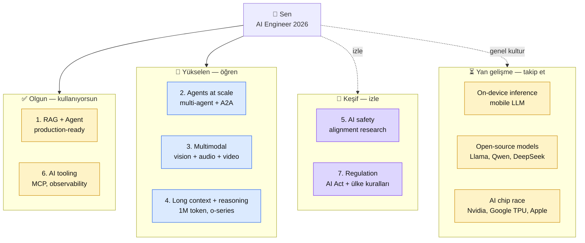

# 10.4 İleri Konular ve Trendler — 2026 Sonrası AI Landscape

<div class="ma-meta" markdown>
<div class="ma-meta-row" markdown>
<strong>Kim için:</strong>
<span class="ma-persona ma-persona-baslangic">🟢 başlangıç</span>
<span class="ma-persona ma-persona-is">🔵 iş</span>
<span class="ma-persona ma-persona-kisisel">🟣 kişisel</span>
</div>
<div class="ma-meta-row"><strong>⏱️ Süre:</strong> ~30 dakika</div>
<div class="ma-meta-row"><strong>📋 Önkoşul:</strong> Platform'un büyük çoğunluğu tamamlandı. Kendi kariyer pozisyonun netleşti (10.1). Mülakat + açık kaynak refleksin var (10.2 + 10.3).</div>
<div class="ma-meta-row"><strong>🎯 Çıktı:</strong> **7 aktif trend** hakkında net görüşün var — hangisi gerçek evrim, hangisi balon. "Generalist mı specialist mı?" kararını bilinçli yapıyorsun. 1 yıl + 3 yıl öngörülere kendi bahsini koydun. Sürekli öğrenme için **seçili 5 kaynak** takip listende. **Bu sayfa platform'un son teknik-kavramsal sayfası** — 10.5 pedagojik kapanış.</div>
</div>

!!! tip "Yabancı kelime mi gördün?"
    **Trend** (eğilim) = 2-3 yılda yaygınlaşacak örüntü. **Hype cycle** (Gartner balonu) = yeni teknolojinin balon → hayal kırıklığı → verimlilik olgunlaşması eğrisi. **Edge inference** (kenar çıkarımı) = modeli kullanıcı cihazında (mobil, dizüstü) çalıştırma; buluta bağımlı olmama. **A2A protocol** (Agent-to-Agent — Ajandan-Ajana) = farklı firma ajanlarının konuşabildiği iletişim protokolü; Google'ın Nisan 2025'te yayımladığı standart. **Alignment** (hizalama) = modelin insan değerlerine uyumlu davranma araştırması. **Evals** (değerlendirmeler) = dizgesel model sınamaları; LLM dünyasındaki gerileme testi karşılığı. **AGI** (Artificial General Intelligence — Yapay Genel Zeka) = insan seviyesi geniş yetkinliğe sahip kuramsal AI sistemi. **Interpretability** (yorumlanabilirlik) = modelin iç hesaplamasını okuma/açıklama araştırması; Anthropic'in mekanistik yorumlanabilirlik ekibi öncü. **RLHF** (Reinforcement Learning from Human Feedback — İnsan Geri Bildirimiyle Pekiştirmeli Öğrenme) = insan tercihleriyle modelin hizalanması.

## Neden bu sayfa?

Bu platform 2026 **Nisan** itibarıyla yazıldı. Okuduğun zaman 6 ay-2 yıl sonra olabilir. AI hızlı değişir — bu platform'daki **teknik detaylar** (model isimleri, fiyatlar, SDK versiyonları) eskimiş olabilir. Ama **temel kavramlar** (RAG, agent, embedding, MCP) kalıcı.

**Bu sayfanın amacı:** Sana 2026 itibarıyla aktif olan 7 trendi göstermek + **her trende doğru bahsi koy** refleksini kazandırmak. "Her yeni duyuruya atla" da "bu moda geçecek" skeptik de yanlış — **orta yol**: trend → deney → karar.

İkincisi: **Generalist vs specialist** kararı. AI alanında hepsini bilmeye çalışan kimse bugün ön planda olmaz. **Seçim**: RAG uzmanı mı, agent uzmanı mı, multimodal uzmanı mı? Bu sayfa seçim refleksi verir.

Üçüncüsü: Bu sayfa **platform'un son teknik içerikli sayfası**. 10.5 duygusal kapanış + platform'un resmi sonu. 10.4 öğrenciye "buradan sonra kendi yolun" haritasını bıraktı.

## 2026 AI landscape — 7 aktif trend

<div class="ma-ekosistem" markdown>
<div class="ma-ekosistem-header">🗺️ 7 trend, olgunluk seviyesi</div>



**Okuma:** 4 kategori, 4 farklı zaman/enerji yatırımı. Tümünü aynı derinlikte öğrenmen gerekmez — **olgun kullan, yükselene yatır, keşfi izle, yanı genel kültür.**

</div>

## Trend 1 — Agents at Scale

### Ne oluyor

Single-agent (Bölüm 6 düzeyi) olgunlaştı — 2026'da production'da yaygın. Sonraki aşama **multi-agent** + agent-agent iletişimi. Birden çok agent aynı sistemde:

- **Specialist agent**'ler (research agent + coding agent + review agent) birleşerek büyük görev çözer
- **Agent-to-Agent (A2A) protokolleri** — Google 2025'te önerdi, Anthropic/MS eşdeğer standartlar
- **Agent marketplace** — bir agent diğer agent'ları **bulur + kullanır** (MCP'nin tool use pattern'inin genişlemesi)

### Somut örnek

```
Kullanıcı: "Pazartesi Paris toplantısı için beni hazırla"
   ↓
Orchestrator Agent
   ├→ Research Agent → Paris haberlerini tara + toplantı katılımcı profilleri
   ├→ Calendar Agent → takvim + seyahat + otel
   ├→ Email Agent → hatırlatmalar + hazırlık maili
   └→ Briefing Agent → 1 sayfa özet + sorular üret
```

Her agent ayrı LLM çağrısı + ayrı sorumluluk + ayrı maliyet optimizasyonu.

### Senin öğrenmen

- 9.5 İçerik Özet Ajanı **tek başına orkestratör-işçi** örüntüsü (Bölüm 6.5).
- Sonraki adım: aynı örüntüde **ikinci** ajan ekle, paralel çalışsınlar (LangGraph 1.x, CrewAI, AutoGen veya Anthropic'in resmi `claude-agent-sdk`'i — `query()` ve `ClaudeSDKClient` ile alt-ajan düzeneği üretim için hazır).
- **Uyarı:** Çok ajanlı sistem hata ayıklaması **zor** — 5 ajanın etkileşim alanı 25 permütasyon. Sade başla (2 ajan), sonra genişle. Her ajanın trace'i ayrı `trace_id` ile loglanmalı; LangFuse veya Helicone bu izlemeyi kolaylaştırır.

### Kaynak

- [Anthropic Building Effective Agents (Aralık 2024, 2025'te güncellendi)](https://www.anthropic.com/research/building-effective-agents) — temel referans
- [Anthropic claude-agent-sdk](https://github.com/anthropics/claude-agent-sdk-python) — resmi ajan SDK'si (2025'te yayımlandı)
- [LangGraph 1.x](https://langchain-ai.github.io/langgraph/) — durumlu ajan grafı çatısı
- [CrewAI](https://www.crewai.com/) — rol tabanlı ajan çatısı
- [Google A2A protocol (Nisan 2025)](https://google.github.io/A2A/) — açık ajan-arası iletişim standardı; OpenAI ve Microsoft 2025'te benimsediğini duyurdu
- [Anthropic Multi-Agent Research System (Haziran 2025)](https://www.anthropic.com/news/multi-agent-research-system) — Claude'un kendi araştırma ürününde kullandığı çok-ajan mimarisi

## Trend 2 — Çoklu Kip (Multimodal) Temel Modeller

### Ne oluyor

Eski LLM yalnızca metin. Yeni modeller metin + görsel + ses + video **aynı içinde**. Claude Sonnet 4.6 + Opus 4.7 görüntü ve PDF doğal alır (Bölüm 7 temel). GPT-5.5 ses + görsel + canlı sesli sohbet. Gemini 2.5 Pro 1M bağlamla uzun video çözümlemesi (2M sürümü 2025'te kapalı betada). 2025'te eklenen **Computer Use** (Claude `computer_20250124+` araç paketi) ile model ekran görüntüsünü alıp fare/klavye eylemleri çıkarabiliyor — masaüstü otomasyonu artık LLM seviyesinde.

### Somut kullanım

- **PDF doğal girdi** — taranmış Türkçe doküman doğrudan LLM'e (Anthropic Messages API'de PDF native, 32 MB / 100 sayfa; Files API ile 500 MB'a kadar). OCR adımı atlanıyor.
- **Ekran görüntüsünden kod** — tasarım maketi → HTML/CSS üret (v0.dev, Vercel'in çoklu kip ürünü).
- **Video toplantı özeti** — 1 saatlik kayıt → 5 dk yönetici özeti (Gemini 2.5 Pro doğal video).
- **Ses tabanlı ajan** — müşteri hizmetleri sesli botu (Pipecat + LiveKit + Claude veya Vapi).
- **Computer Use otomasyonu** — Claude tarayıcıdan form doldurma, raporlama (sandbox içinde, üretim için çok dikkatli).

### Senin öğrenmen

- **Bölüm 7 platformda isteğe bağlı** — 5 sayfa, 1 hafta çalışma.
- Çoklu kip ajan: 9.5 İçerik Özet Ajanı'na görsel çözümleme eklemek (haberin görselini al, başlığa uyuyor mu?).
- **Görsel limit hatırlatması:** Anthropic API tek istekte **20 görsele kadar** kabul eder (önceden 100 sınırı yanlıştı, 2025 belgelerinde 20). Daha fazla için ardışık çağrı.
- **Fiyat uyarısı:** Görsel girdi metne göre yaklaşık **10× daha pahalı** (~1500 token/görsel). Maliyet izlemi kritik.

### Kaynak

- [Claude vision belgesi](https://platform.claude.com/docs/en/build-with-claude/vision)
- [Claude Computer Use](https://platform.claude.com/docs/en/agents-and-tools/computer-use)
- [Gemini multimodal](https://ai.google.dev/gemini-api/docs/vision)
- [OpenAI GPT-5 system card](https://openai.com/index/gpt-5-system-card/)
- [LMArena Multimodal](https://lmarena.ai/) — model karşılaştırma (eski LMSYS)

## Trend 3 — Uzun Bağlam + Akıl Yürütme

### Ne oluyor

2023'te 8K-32K token sıradandı. 2024'te Claude + Gemini 200K. 2025-2026'da **1M token** (yaklaşık 2500 sayfa) modeller yaygınlaştı: Claude Sonnet 4.6 1M (2025'te genel kullanıma açıldı, 200K üstü için Anthropic ek fiyat tarifesi uygular), Gemini 2.5 Pro 1M (2M kapalı beta), GPT-5 400K. Koşut olarak **akıl yürütme modelleri** — OpenAI o3/o4-mini, Claude extended thinking modu (Sonnet 4.6 ve Opus 4.7'de `thinking` parametresiyle). Model adım adım "düşünür", cevabı uzun iç monologla verir. 2026'da Anthropic Opus 4.7 hem klasik hem akıl yürütme kipini tek modelde birleştirdi.

### Somut kullanım

**Long context:**
- Tüm codebase (50K satır) tek prompt'ta → "bu repo'da X pattern'i nerede?"
- 500 sayfa kitap tek çağrıda özet + Q&A → RAG gereksizleşir mi?

**Reasoning:**
- Matematik problemleri (AIME, MATH benchmark) — o1 %80+ başarı
- Kompleks coding — "bu bug'ın nedeni" derinlemesine analiz
- Etik karar senaryoları — Constitutional AI + reasoning birlikte

### Senin öğrenmen

**Long context RAG'i öldürmez ama değiştirir:**

- **RAG hala ucuz** — 1M context inference ~$3-5 / çağrı; RAG $0.01-0.05
- **RAG hala deterministik** — hangi kaynak alıntılandı net; long context "hatırladı" olabilir
- **RAG hala güncel** — her yeni PDF anında; long context model güncellemesi beklemek

**Reasoning:**
- Her problem reasoning gerektirmez — sade API çağrısı reasoning model **5-10× pahalı**
- Kullan: kompleks matematik/kod/etik sorunları
- Kullanma: basit özet, kategorizasyon, RAG cevap

### Kaynak

- [Anthropic prompt caching (2024-11)](https://www.anthropic.com/news/prompt-caching) — long context'i ucuzlatır
- [OpenAI o3 system card](https://openai.com/index/o3-and-o4-mini-system-card/) — reasoning model detayı
- [Gemini 1M context](https://blog.google/technology/ai/google-gemini-next-generation-model-february-2024/)
- [Anthropic extended thinking](https://platform.claude.com/docs/en/build-with-claude/extended-thinking)

## Trend 4 — AI Araç Ekosisteminin Olgunlaşması

### Ne oluyor

2023 = "sohbet arayüzü". 2024 = API + SDK olgunlaştı. 2025-2026 = **üretim araçları** — gözlemlenebilirlik, değerlendirme, orkestrasyon araçları. AI artık "LLM'e istek at" değil, **yazılım mühendisliği disiplini**.

### Somut örnekler

- **MCP** (Bölüm 6.5) — Kasım 2024'te Anthropic açıkladı, **Aralık 2025'te Linux Foundation altındaki AI Alliance Foundation'a (AAIF) bağışlandı**; OpenAI, Google, Microsoft 2025'te resmi olarak benimsedi. 2026'da çapraz ekosistem standardı.
- **Değerlendirme (evals) çatıları** — [Inspect AI (UK AISI)](https://inspect.ai-safety-institute.org.uk/), [OpenAI Evals](https://github.com/openai/evals), [LangSmith](https://www.langchain.com/langsmith), [Anthropic Evals (2025)](https://platform.claude.com/docs/en/test-and-evaluate/eval-tool) — Console içinde yerleşik değerlendirme.
- **Gözlemlenebilirlik** — [LangFuse](https://langfuse.com/) (kendi sunucunda), [Helicone](https://www.helicone.ai/) (yönetilen), [LangSmith](https://www.langchain.com/langsmith), [Phoenix (Arize)](https://docs.arize.com/phoenix), Sentry LLM trace; OpenTelemetry GenAI semantic convention 2025 sonu kararlı oldu.
- **Orkestrasyon** — LangGraph 1.x, CrewAI, [Haystack 2.0](https://haystack.deepset.ai/), [Anthropic claude-agent-sdk](https://github.com/anthropics/claude-agent-sdk-python).
- **Yönerge yönetimi** — [PromptLayer](https://promptlayer.com/), [Mirascope](https://mirascope.com/), [Promptfoo](https://www.promptfoo.dev/) (açık kaynak, A/B testi).

### Senin öğrenmen

- Bu araçların **hepsini öğrenme** — gerek yok.
- Projende **kullandığın** araçları derinleş; ihtiyacına göre öğren.
- Observability için platform'da Bölüm 8.4 + Langfuse/Helicone karşılaştırma (hangi projede hangi araç) gelecek.

### Kaynak

- [Latent Space](https://www.latent.space/) — yazılı + podcast
- [AI Engineer Summit](https://ai.engineer) — yıllık konferans, araç şirketleri

## Trend 5 — AI Güvenliği + Hizalama Araştırması

### Ne oluyor

Model yetkinlikleri hızla artarken **denetim** zorlaşıyor. Hizalama araştırması = modeli insan değerlerine uyumlu davranmaya eğitme. 2026 aktif araştırma alanları:

- **Yorumlanabilirlik (interpretability)** — model içinde ne oluyor, neden bu cevabı verdi? Anthropic'in 2024 Mayıs "Mapping the Mind of a Large Language Model" çalışması ve 2025'teki devam yayınları öncü.
- **Kırmızı takım (red teaming)** — dizgesel saldırı; güvenlik açıklarını önceden bul. Anthropic kendi modellerini yayımlamadan önce dış red team şirketleriyle çalışır.
- **Anayasal Yapay Zeka (Constitutional AI)** — Anthropic'in yaklaşımı (Bölüm 8.2). 2025'te eklenen **Constitutional Classifiers** Claude API üstünde jailbreak savunma katmanı: %95+ saldırı yakalama, %0.4 yanlış pozitif.
- **İnsan geri bildirimiyle pekiştirmeli öğrenme (RLHF) + ödül modelleme** — insan tercihleriyle hizalama; 2025'te DeepSeek R1 saf RL ile akıl yürütme yeteneği elde ettiğini gösterdi (RLHF olmadan).
- **Sandbagging tespiti** — model yetkinliklerini saklıyor mu? Kasıtlı düşük performans gösterimi.
- **Aldatma (deception) tespiti** — model değerlendirme sırasında farklı, üretimde farklı davranıyor mu? Anthropic Aralık 2024 "Alignment faking" makalesi başlangıç noktası.

### Senin öğrenmen

**AI Engineer olarak alignment araştırıcı olmayacaksın** büyük ihtimalle. Ama:

1. **Red teaming refleksi** — her canlı sistemde 10 saldırı sorusu (Bölüm 8.1)
2. **Model davranışı okuma** — "Claude bunu niye reddetti?" Anthropic Model Spec'i referans
3. **Güvenlik açığı bildirim** — Claude'da weird behavior gördüğünde [Anthropic security team](https://trust.anthropic.com/)'e rapor

### Kaynak

- [Anthropic Research](https://www.anthropic.com/research) — ayda 1-2 makale
- [AI Alignment Forum](https://www.alignmentforum.org/) — akademik + topluluk
- [Redwood Research](https://www.redwoodresearch.org/) — safety lab
- [AI Safety Institute (UK + US)](https://www.aisi.gov.uk/) — hükümet kuruluşları, public reports

## Trend 6 — Cihaz İçi / Kenar Çıkarımı (On-device / Edge Inference)

### Ne oluyor

Model çağırmak hep buluta → gecikme + fatura + gizlilik. **Küçük modeller** kullanıcı cihazında (mobil, dizüstü) çalışır:

- **Apple Intelligence** (iPhone 15 Pro+, iPhone 16 / 17 tüm aile, M-serisi Mac) — cihaz üstü 3B yoğunlaştırılmış model + Private Cloud Compute (PCC) gerektiğinde.
- **Gemini Nano** — Pixel 8/9/10 + AICore destekli Android telefon.
- **Phi-4** (Microsoft, 14B + Phi-4-mini 3.8B), **Llama 4 Scout** (kenar için MoE), **Qwen3-VL-3B**, **Mistral Edge**, **DeepSeek-V3.2-edge** — kenar için eniyilenmiş.
- **ONNX Runtime + Core ML + TensorRT-LLM + MLX** — çalışma anı eniyilemesi.
- **WebGPU + transformers.js** — tarayıcıda çıkarım; 2025'te yaygınlaştı.

### Somut kullanım

- **Offline asistan** — uçakta çalışır, cloud gerekmez
- **Privacy-sensitive** — tıbbi veri cihazdan çıkmaz
- **Low latency** — 50ms cevap (cloud 500ms)
- **Zero cost** — inference maliyeti 0 (sadece cihaz CPU/battery)

### Senin öğrenmen

**Şu an edge inference = niche.** 2026-2027'de yaygınlaşacak. Takip et:

- Web tabanlı: [transformers.js](https://huggingface.co/docs/transformers.js/index) (tarayıcıda embedding/tiny LLM)
- Mobile: iOS Core ML, Android AI Core API
- **Gerekirse öğren** — "mobile AI app kur" görevi geldiğinde.

### Kaynak

- [Apple Intelligence](https://www.apple.com/apple-intelligence/)
- [Hugging Face on-device](https://huggingface.co/blog)
- [MLX (Apple Silicon ML)](https://github.com/ml-explore/mlx)

## Trend 7 — AI Düzenlemesi

### Ne oluyor

Hükümetler AI'ya çerçeve getiriyor. 2026 itibarıyla aktif:

- **AB AI Act** (Bölüm 8.2) — **2 Şubat 2025**: yasaklı uygulamalar yürürlükte (sosyal puanlama, biyometrik kategorizasyon, vb). **2 Ağustos 2025**: Genel Amaçlı AI (GPAI) modelleri için yükümlülükler. **2 Ağustos 2026**: yüksek riskli AI sistemleri tam yürürlükte. **2027 Ağustos**: yerleşik ürünlerde yüksek risk uyumu.
- **ABD AI Action Plan (2025)** — Ocak 2025'te Trump yönetimi Biden'ın 14110 sayılı kararnamesini iptal etti; yeni çerçeve "AI Action Plan" Temmuz 2025'te yayımlandı, federal düzenleme yerine eyalet ve sektör düzeyinde yönlendirme.
- **California SB 1047 / California AI Transparency Act (2024-2025)** — eyalet düzeyinde sınır laboratuvar şeffaflığı.
- **UK AI Safety Bill** — 2025-2026 öneri aşamasında; UK AISI (AI Safety Institute) öncesinde gönüllü değerlendirme.
- **Türkiye AI Stratejisi** — KVKK + Anayasa, Cumhurbaşkanlığı Dijital Dönüşüm Ofisi tarafından 2024 sonunda taslak Yapay Zeka Strateji belgesi yayımlandı; bağlayıcı yasa 2027-2028 tahmini.
- **Çin** — kendi model izin dizgesi (CAC — Cyberspace Administration of China onayı); üretken AI hizmetleri için kayıt zorunluluğu 2023'ten beri.

### Senin öğrenmen

- **AB müşterisi varsa** AI Act'e uy (Bölüm 8.2 detay)
- **Türkiye KVKK** her durumda
- **Yıllık gözden geçir** — 2-3 yılda bir büyük değişim olacak

### Kaynak

- [AI Act resmi](https://artificialintelligenceact.eu/)
- [Stanford AI Index Report](https://aiindex.stanford.edu/) — yıllık rapor, dünya geneli
- [Center for AI Safety](https://www.safe.ai/)
- [Ada Lovelace Institute](https://www.adalovelaceinstitute.org/) — UK policy think-tank

## "Generalist mı specialist mı?" — karar ağacı

Platform bitti → 3 yol ayrılışı:

<table class="ma-aktorler" markdown>

| Yol | Kim? | Stratejisi | Gelir tavanı |
|---|---|---|---|
| 🟢 **Generalist AI Engineer** | Çoğu kişi | RAG + Agent + Multimodal + Deploy hepsini orta seviye | Mid-senior, 100K-180K TL |
| 🔵 **Vertical specialist** | "Hukuki AI" / "Finansal AI" / "Sağlık AI" gibi bir alanda derinleşen | Domain uzmanlığı + AI = rakip az | Yüksek, 150K-300K TL |
| 🟣 **Horizontal specialist** | "RAG uzmanı" / "Agent uzmanı" / "Alignment researcher" | Tek eksende derin | Yüksek, niş danışmanlık |

</table>

### Karar kriterleri

1. **Şu an ne biliyorsun?** Eski alanın var mı (hukuk, sağlık, finans, eğitim)? → **Vertical specialist** avantajlı.
2. **Zamanın var mı derin öğrenmeye?** 2-3 yıl tek konuya 20 saat/hafta → **Horizontal specialist**.
3. **Hızlı iş mi?** Generalist daha hızlı employable.
4. **Bağımsız çalışma?** Specialist freelance'te rakip az, ücret yüksek.

**Çoğu kişi için başlangıç: Generalist 1-2 yıl, sonra specialist seçim.**

## 1 yıl + 3 yıl hipotezler

Kendi bahsini koy. 26 Nisan 2027'de dönüp bakınca doğrulanacak veya çürükleşecek.

### 1 yıl — Nisan 2027

**Hipotez 1:** MCP, Aralık 2025'te Linux Foundation'a geçtikten sonra **çapraz ekosistem standardı** olarak yerleşecek; OpenAI/Google/Microsoft istemcilerinde ortak sunucu paylaşımı yaygın olacak. **Benim bahsim: %85 olur** (zaten yarısı oldu).

**Hipotez 2:** 1M bağlam yaygınlaşacak, RAG'i küçük projede öldürecek. **Benim bahsim: %30 olur** — RAG hâlâ daha ucuz + belirlenimci + güncel veri tarafında üstün.

**Hipotez 3:** Sesli ajan (Pipecat / LiveKit / Vapi tabanlı) çağrı merkezi pazarının %30+ inçinde yer alacak. **%75 olur.**

**Hipotez 4:** AB AI Act'in ilk ciddi cezaları (1M+ euro) yüksek riskli AI'da gelecek; Ağustos 2026 yürürlüğüyle takipte. **%85 olur.**

**Hipotez 5:** "AI Engineer" rolü mid-senior düzeyinde "AI + full-stack dev" olarak birleşecek; junior düzeyde de "AI bilgisi olan backend" beklenecek. **%70.**

### 3 yıl — Nisan 2029

**Hipotez 1:** AGI'ye "yakın" sistemler (recursive self-improving) kamuya duyurulacak ama üretim erişimi kontrollü. **%40.**

**Hipotez 2:** Açık kaynak modelleri (Llama, DeepSeek) kapalı modellere neredeyse eşit olacak. **%70.**

**Hipotez 3:** AI Engineer maaşları stabilize veya **düşmeye** başlayacak — arz talep dengesi. **%55.**

**Hipotez 4:** Mobile + edge inference %50+ use case'i ele geçirecek. **%60.**

**Hipotez 5:** AI regulation ihlalinden ilk hapis cezası gelecek. **%35.**

Bu hipotezleri **kendi sayfa notlarında** kopyala — 2027'de dönüp bak.

## Sürekli öğrenme — 5 kaynak takip listesi

Her şeyi takip etme. **5 kaynak seç**, derinleş:

1. **Anthropic News + Research** ([anthropic.com/news](https://www.anthropic.com/news)) — haftalık 30 dk; ayda 5-10 önemli yazı.
2. **Latent Space** ([latent.space](https://www.latent.space/)) — swyx + Alessio, AI Engineer odaklı haftalık podcast + bülten; AI Engineer Summit'in ana sahibi.
3. **AI Engineer World's Fair / Summit konuşmaları** ([ai.engineer/talks](https://www.ai.engineer/talks)) — yıllık konferans (Haziran 2025'te 4. yıl), YouTube'da konuşma kayıtları; ayda 1 saat.
4. **Simon Willison blog** ([simonwillison.net](https://simonwillison.net/)) — Django'nun kurucu eş yazarı, AI mühendisi olarak haftalık günlük yayımlıyor; pragmatik, hızlı tarama için ideal.
5. **Bir Türkçe kaynak** — Türkiye Açık Kaynak Platformu, Atölye15 yayınları, ya da kendi blog yazarlığın (Substack / GitHub Pages / kendi sitende).

**Haftalık 3 saat, dağılımlı:**
- Pazartesi 30 dk — Anthropic News
- Çarşamba 1 saat — 1 podcast bölüm + 1 paper
- Cuma 1 saat — 1 araç deney
- Pazar 30 dk — haftanın özeti + post taslak

**Kural:** Kaliteye odaklan. 5 iyi kaynak > 50 yüzeysel.

## Anthropic ekosistemi — uzun vadeli bakış

<details class="ma-anthropic-oz" markdown>
<summary><strong>🤖 Anthropic-öz: ASL seviyeleri + RSP roadmap</strong></summary>

Anthropic'in [Responsible Scaling Policy (RSP)](https://www.anthropic.com/responsible-scaling-policy) AI yeteneklerini **AI Safety Levels (ASL)** olarak tanımlar. 2026 itibarıyla:

**ASL-1:** Çok sınırlı model (GPT-2 seviyesi). Güvenlik sorunu yok.

**ASL-2:** 2024'te kullanılan çoğu model. "Anlamlı özerk yetkinlikler" var. Standart güvenlik yeterli.

**ASL-3:** Biyolojik/kimyasal saldırıya yardımcı olabilecek veya özerk çoğaltma yapabilecek model. **Ek güvenlik önlemleri zorunlu** — kırmızı takım sınaması, dağıtım kısıtlaması, ağırlık erişim denetimi. **Anthropic Mart 2025'te Claude Opus 4'ün ASL-3 eşiğinde olduğunu açıkladı**; o tarihten itibaren Opus ailesinde ASL-3 önlemleri uygulanıyor.

**ASL-4+:** "Dönüştürücü yetkinlikler" — AGI seviyesine yakın. Henüz yok. Çok sıkı kural seti.

### 2026-2030 olasılıkları

- Anthropic Opus 4.7 (2026 başı) **ASL-3 önlemleri altında** çalışıyor — bio/kimyasal kısıtlamalar, kurumsal SSO + denetim zorunluluğu.
- ASL-4 2027-2030 arası olabilir; kesin değil. ASL-4 deklarasyonu ağırlıkların özel bir "shielded" altyapıda saklanmasını da gerektirir.
- Anthropic **yetkinlik + güvenlik** dengesini şeffaf tutuyor (RSP'nin v2.1 sürümü 2025'te yayımlandı, geniş bir paydaş incelemesinden geçti).

### AI Engineer için ne demek?

- **ASL-3 model'leri** enterprise müşterilere sıkı tanımda. Senin projenin Anthropic **KYC** (Know Your Customer) sürecinden geçmesi gerekebilir.
- **Open-source** açık kaynak modeller (Llama, Qwen) paralel olarak ilerleyecek ama ASL bilgisi onlarda **yok** — kendi değerlendirmen şart.
- **Regulation** — AB AI Act "high-risk AI" tanımı ASL-3'e yaklaşıyor; AI Act + RSP birbirini tamamlar.

**Senin için aksiyon:** Anthropic RSP sayfasını 6 ayda bir kontrol et. ASL değişiklikleri kariyer + proje kararlarını etkiler.

### Model Spec + Constitutional AI devamı

Anthropic Model Spec'i (yayın 2024) sürekli güncellenir. Claude davranışında değişiklik olursa spec önce güncellenir; değişiklik nedeni şeffaf.

- **Canlı projen Claude davranışına bağlıysa** spec'i takip et
- Müşteri "Claude şu durumda şöyle davrandı" sorusuna → spec referans
- Spec'teki guideline'lar **senin system prompt'una** girdi (8.1 rol kilidi pattern'i Model Spec'teki human-override prensibinden)

### Anthropic'in 2030 vizyonu

Anthropic kurucuları "safe AGI" misyonu güdüyor. Ticari başarı + araştırma (safety) parallel. 2026'dan sonra:

- **Claude Code** + **Claude in Excel/Chrome** ürünleri genişleyecek — kullanıcı tabanı büyür
- **API + Platform** enterprise odaklı (karlılık)
- **Safety research** yayın serisi (alignment, interpretability)
- **Regulation** lobby — şirket daha çok AB ve US politika yapıcıyla konuşuyor

Anthropic'i takip etmek = AI endüstri yönünü takip etmenin en hızlı yollarından biri.

</details>

## CTO tuzakları — 8 ileri öğrenme hatası

| # | Tuzak | Sonuç | Doğru |
|---|---|---|---|
| 1 | Her yeni modeli dene | Zaman + fatura kayıp | 1-2 modelde derinleş |
| 2 | Twitter/X günde 2 saat | Bilgi kirliliği + FOMO | 1-2 kaliteli kaynak haftalık |
| 3 | Generalist + specialist aynı anda | Dağınık | Önce generalist 1-2 yıl, sonra specialize |
| 4 | Her hype post'a atla | Moda kovalama | Trend bazlı bahis + deney |
| 5 | Paper okuma yok | Derinleş geride | Haftada 1 paper, özet yaz |
| 6 | Kendi deneyi yok | Teori parlak, pratik zayıf | Ayda 1 küçük deney projesi |
| 7 | Toplulukta pasif | Etki yok | Haftada 3 yorum, 1 post |
| 8 | Regulation umursamaz | İlk ceza dalgasında geç | Yıllık AI Act + KVKK check |

## Çıktı kanıtları — 3 kanıt

<div class="ma-cikti-kaniti" markdown>
<div class="ma-cikti-kaniti-header">📏 Çıktı — 3 kanıt</div>

**1. Kariyer karar yazılı:**

`muhendisal-notlarim/bolum-10/04-ileri/karar.md` →
- Generalist / Vertical specialist / Horizontal specialist?
- Bir alanı seçtiysen: hangisi, neden, 6 ay plan.

**2. 10 hipotez kendi bahsin:**

1 yıl + 3 yıl hipotezlerini kendi dosyanda yaz (5+5 = 10). Her birine **kendi olasılık tahminin** + gerekçen. 2027 Nisan'da geri dön, bak.

**3. 5 kaynak takip listesi:**

Haftalık 3 saat plan dosyada. 5 kaynak + takvim + ilk 2 haftanın tamamlanmış öğrenme notları.

**Kanıt klasörü:** `muhendisal-notlarim/bolum-10/04-ileri/`

</div>

## Görev — 90 dk gelecek planlaması

<div class="ma-gorev" markdown>
<div class="ma-gorev-header">🎯 Görev — 3 karar yazılı olarak</div>

### 30 dk — Kariyer yol kararı

1. Sayfadaki 4 profilden (junior/mid/lateral/specialist) hangisindesin?
2. Generalist mi specialist mi? Hangi alan?
3. 6 ay sonra hedef: "X alanında [Y derinlik]e gelmiş olmak."
4. `karar.md` dosyasına yaz.

### 30 dk — 10 hipotez kendi bahsin

1. 1 yıl 5 hipotez + kendi olasılık tahminin (%X).
2. 3 yıl 5 hipotez + kendi tahminin.
3. Her biri için 1-2 cümle gerekçe.
4. `hipotezler-2026-04.md` dosyasına kaydet, 2027 Nisan'da geri dön.

### 30 dk — Sürekli öğrenme takvimi

1. 5 kaynak seç (Anthropic News + podcast + paper + blog + TR).
2. Haftalık 3 saat dağılımı (Pzt/Çar/Cum/Paz).
3. İlk 2 hafta için somut madde (Pazartesi X oku, Çarşamba Y dinle).
4. Google Calendar'a ekle — bir **alışkanlık**, proje değil.

**Başarı kriteri:** 90 dakika sonunda 3 dosya yazılı + takvim blok'u aktif. 2-3 ay sonra "Platform'dan sonra ne yaptım?" sorusuna somut cevap.

</div>

<div class="ma-neden-sonuc" markdown>
<div class="ma-neden-sonuc-header">🔗 Birlikte okuma — neden ne oldu</div>

<ol class="ma-neden-sonuc-zincir" markdown>
<li>**A → B:** 2026 AI landscape 7 trend; olgun (1,6) yükselen (2,3,4) keşif (5,7) yan gelişme (edge, OSS, chip). Bu yüzden **trend haritası öncelik belirler.**</li>
<li>**B → C:** Agents at scale — orchestrator + specialist multi-agent + A2A protokolleri. Bu yüzden **bölüm 6 bilgisi stratejik değer taşır.**</li>
<li>**C → D:** Multimodal — vision/audio/video tek modelde; RAG + görsel kombinasyon yaygın. Bu yüzden **bölüm 7 bilgisi geleceğe hazırlar.**</li>
<li>**D → E:** Long context + reasoning — 1M token + o-series; RAG'i öldürmez ama değiştirir. Bu yüzden **RAG hala geçerli ama evrilecek.**</li>
<li>**E → F:** AI tooling olgunlaştı — MCP + evals + observability + orchestration. Bu yüzden **araç ekosistemi stabil dönemde.**</li>
<li>**F → G:** Alignment research sürüyor; senin için red team refleksi + Model Spec. Bu yüzden **etik bilgi pratik değer katar.**</li>
<li>**G → H:** Edge inference niche şu an, 2027+ yaygınlaşma. Bu yüzden **şimdi değil, gözde tut.**</li>
<li>**H → I:** Regulation AI Act + KVKK + ülkelerin kendi çerçeveleri. Bu yüzden **hukuki çerçeve teknik kararı etkiler.**</li>
<li>**I → J:** Generalist/specialist karar ağacı; çoğu için önce generalist 1-2 yıl. Bu yüzden **derinleşme zeminde sonra gelir.**</li>
<li>**J → K:** 10 hipotez (1+3 yıl) kendi bahsin; 2027'de dön bak. Bu yüzden **uzun vadeli düşünmek kısa vadeli kararlara ışık tutar.**</li>
</ol>

<div class="ma-neden-sonuc-sonuc" markdown>
**Sonuç:** Platform kapanışına **bir sayfa** kaldı. 7 trend netti, kariyer karar ağacı çizildi, 10 hipotez yazıldı, takip listesi kuruldu. Artık sürekli öğrenme **alışkanlık**. Sonraki (10.5): topluluk + platform'un resmi kapanış notu.
</div>
</div>

<div class="ma-sonraki" markdown>
<div class="ma-sonraki-header">➡️ Sonraki adım</div>

**[10.5 Topluluk + Platform Kapanışı →](05-topluluk.md)** — TR + global topluluklar, mentor arama, sen mentor olma, platform'un kapanış notu.

← [10.3 Açık Kaynak Katkı](03-acik-kaynak.md) &nbsp;|&nbsp; [Bölüm 10 girişi](index.md) &nbsp;|&nbsp; [Ana sayfa](../index.md)

**Pekiştirme:** [Stanford AI Index Report (yıllık)](https://aiindex.stanford.edu/) + [Our World in Data — AI](https://ourworldindata.org/artificial-intelligence) + [State of AI Report (Nathan Benaich, yıllık PDF)](https://www.stateof.ai/). Yılda 1 kez, 3 saat oku. AI endüstri durumunu üst seviye tutmanın en ekonomik yolu.
</div>
