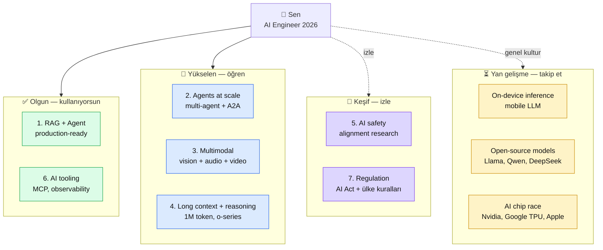

# 10.4 İleri Konular ve Trendler — 2026 Sonrası AI Landscape

<div class="ma-meta" markdown>
<div class="ma-meta-row" markdown>
<strong>Kim için:</strong>
<span class="ma-persona ma-persona-baslangic">🟢 başlangıç</span>
<span class="ma-persona ma-persona-is">🔵 iş</span>
<span class="ma-persona ma-persona-kisisel">🟣 kişisel</span>
</div>
<div class="ma-meta-row"><strong>📋 Önkoşul:</strong> Platform'un büyük çoğunluğu tamamlandı. Kendi kariyer pozisyonun netleşti (10.1). Mülakat + açık kaynak refleksin var (10.2 + 10.3).</div>
<div class="ma-meta-row"><strong>🎯 Çıktı:</strong> **7 aktif trend** hakkında net görüşün var — hangisi gerçek evrim, hangisi balon. "Generalist mı specialist mı?" kararını bilinçli yapıyorsun. 1 yıl + 3 yıl öngörülere kendi bahsini koydun. Sürekli öğrenme için **seçili 5 kaynak** takip listende. **Bu sayfa platform'un son teknik-kavramsal sayfası** — 10.5 pedagojik kapanış.</div>
</div>

!!! tip "Yabancı kelime mi gördün?"
    **Trend** = yönelim; 2-3 yılda yaygınlaşacak pattern. **Hype cycle** (Gartner) = yeni teknolojinin balon → hayal kırıklığı → üretkenlik olgunlaşması eğrisi. **Edge inference** = modeli kullanıcı cihazında (mobile, laptop) çalıştırma; cloud'a bağımlı olmama. **A2A protocol** = Agent-to-Agent iletişim protokolü; farklı firma agent'ları konuşabilir. **Alignment** = modelin insan değerlerine uyumlu davranma araştırması. **Evals** = sistematik model değerlendirmeleri; regression test'in LLM versiyonu.

## Neden bu sayfa?

Bu platform 2026 **Nisan** itibarıyla yazıldı. Okuduğun zaman 6 ay-2 yıl sonra olabilir. AI hızlı değişir — bu platform'daki **teknik detaylar** (model isimleri, fiyatlar, SDK versiyonları) eskimiş olabilir. Ama **temel kavramlar** (RAG, agent, embedding, MCP) kalıcı.

**Bu sayfanın amacı:** Sana 2026 itibarıyla aktif olan 7 trendi göstermek + **her trende doğru bahsi koy** refleksini kazandırmak. "Her yeni duyuruya atla" da "bu moda geçecek" skeptik de yanlış — **orta yol**: trend → deney → karar.

İkincisi: **Generalist vs specialist** kararı. AI alanında hepsini bilmeye çalışan kimse bugün ön planda olmaz. **Seçim**: RAG uzmanı mı, agent uzmanı mı, multimodal uzmanı mı? Bu sayfa seçim refleksi verir.

Üçüncüsü: Bu sayfa **platform'un son teknik içerikli sayfası**. 10.5 duygusal kapanış + platform'un resmi sonu. 10.4 öğrenciye "buradan sonra kendi yolun" haritasını bıraktı.

## 2026 AI landscape — 7 aktif trend

<div class="ma-ekosistem" markdown>
<div class="ma-ekosistem-header">🗺️ 7 trend, olgunluk seviyesi</div>



**Okuma:** 4 kategori, 4 farklı zaman/enerji yatırımı. Tümünü aynı derinlikte öğrenmen gerekmez — **olgun kullan, yükselene yatır, keşfi izle, yanı genel kültür.**

</div>

## Trend 1 — Agents at Scale

### Ne oluyor

Single-agent (Bölüm 6 düzeyi) olgunlaştı — 2026'da production'da yaygın. Sonraki aşama **multi-agent** + agent-agent iletişimi. Birden çok agent aynı sistemde:

- **Specialist agent**'ler (research agent + coding agent + review agent) birleşerek büyük görev çözer
- **Agent-to-Agent (A2A) protokolleri** — Google 2025'te önerdi, Anthropic/MS eşdeğer standartlar
- **Agent marketplace** — bir agent diğer agent'ları **bulur + kullanır** (MCP'nin tool use pattern'inin genişlemesi)

### Somut örnek

```
Kullanıcı: "Pazartesi Paris toplantısı için beni hazırla"
   ↓
Orchestrator Agent
   ├→ Research Agent → Paris haberlerini tara + toplantı katılımcı profilleri
   ├→ Calendar Agent → takvim + seyahat + otel
   ├→ Email Agent → hatırlatmalar + hazırlık maili
   └→ Briefing Agent → 1 sayfa özet + sorular üret
```

Her agent ayrı LLM çağrısı + ayrı sorumluluk + ayrı maliyet optimizasyonu.

### Senin öğrenmen

- 9.5 İçerik Özet Agent **tek başına orchestrator-workers** pattern (Bölüm 6.5).
- Sonraki adım: aynı pattern'de **ikinci** agent ekle, paralel çalışsınlar (CrewAI, LangGraph, AutoGen framework'leri).
- **Uyarı:** Multi-agent sistem debug **zor** — 5 agent'ın 25 permutation etkileşim. Başla basit (2 agent), sonra genişle.

### Kaynak

- [Anthropic Building Effective Agents (2024-12)](https://www.anthropic.com/research/building-effective-agents) — temel referans
- [LangGraph](https://langchain-ai.github.io/langgraph/) — multi-agent framework
- [CrewAI](https://www.crewai.com/) — alternatif framework
- [Google A2A paper (2025)](https://arxiv.org/abs/2501.14734) — protokol önerisi

## Trend 2 — Multimodal Foundation Models

### Ne oluyor

Eski LLM sadece metin. Yeni modeller metin + görsel + ses + video **aynı içinde**. Claude Sonnet 4.6 görüntü alır (Bölüm 7 temel). GPT-4o ses + görsel. Gemini 2.5 uzun video analiz.

### Somut kullanım

- **PDF OCR + analiz** — scan'lı Türkçe doküman direkt LLM'e, OCR step atlanıyor
- **Ekran görüntüsü kodlama** — tasarım mockup'tan HTML/CSS üret
- **Video toplantı özet** — 1 saatlik kayıt → 5 dk executive summary
- **Ses tabanlı agent** — müşteri hizmetleri voice bot (Vapi + Claude)

### Senin öğrenmen

- **Bölüm 7 platform içinde opsiyonel** — 5 sayfa, 1 hafta çalışma
- Multimodal agent: 9.5 İçerik Özet Agent'a görsel analiz eklemek (haberin görselini al, başlığa uyup uymuyor mu?)
- **Fiyat uyarısı:** Görsel input metne göre **10× pahalı** (~1500 token/image). Maliyet takibi kritik.

### Kaynak

- [Claude vision docs](https://docs.claude.com/en/docs/build-with-claude/vision)
- [Gemini multimodal](https://ai.google.dev/gemini-api/docs/vision)
- [OpenAI GPT-4o](https://openai.com/index/hello-gpt-4o/)
- [LMSYS Multimodal Arena](https://chat.lmsys.org/) — model karşılaştırma

## Trend 3 — Long Context + Reasoning

### Ne oluyor

2023'te 8K-32K token normaldi. 2024'te Claude + Gemini 200K. 2025-2026'da **1M token** (1000 sayfa!) modeller piyasada. Paralel olarak **reasoning models** — OpenAI o1/o3, Claude "extended thinking" modları. Model adım adım "düşünür", cevabı uzun iç monologla verir.

### Somut kullanım

**Long context:**
- Tüm codebase (50K satır) tek prompt'ta → "bu repo'da X pattern'i nerede?"
- 500 sayfa kitap tek çağrıda özet + Q&A → RAG gereksizleşir mi?

**Reasoning:**
- Matematik problemleri (AIME, MATH benchmark) — o1 %80+ başarı
- Kompleks coding — "bu bug'ın nedeni" derinlemesine analiz
- Etik karar senaryoları — Constitutional AI + reasoning birlikte

### Senin öğrenmen

**Long context RAG'i öldürmez ama değiştirir:**

- **RAG hala ucuz** — 1M context inference ~$3-5 / çağrı; RAG $0.01-0.05
- **RAG hala deterministik** — hangi kaynak alıntılandı net; long context "hatırladı" olabilir
- **RAG hala güncel** — her yeni PDF anında; long context model güncellemesi beklemek

**Reasoning:**
- Her problem reasoning gerektirmez — sade API çağrısı reasoning model **5-10× pahalı**
- Kullan: kompleks matematik/kod/etik sorunları
- Kullanma: basit özet, kategorizasyon, RAG cevap

### Kaynak

- [Anthropic prompt caching (2024-11)](https://www.anthropic.com/news/prompt-caching) — long context'i ucuzlatır
- [OpenAI o3 system card](https://openai.com/index/o3-and-o4-mini-system-card/) — reasoning model detayı
- [Gemini 1M context](https://blog.google/technology/ai/google-gemini-next-generation-model-february-2024/)
- [Anthropic extended thinking](https://docs.claude.com/en/docs/build-with-claude/extended-thinking)

## Trend 4 — AI Tooling Maturity

### Ne oluyor

2023 = "chat UI". 2024 = API + SDK olgunlaştı. 2025-2026 = **production tooling** — observability, evaluation, orchestration araçları. AI artık "LLM'e istek at" değil, **yazılım mühendisliği disiplini**.

### Somut örnekler

- **MCP** (Bölüm 6.5) — 2024 Kasım Anthropic açıkladı, 2026'da yaygın standart
- **Evals framework'leri** — [Inspect AI](https://inspect.ai-safety-institute.org.uk/), [OpenAI Evals](https://github.com/openai/evals), [LangSmith](https://www.langchain.com/langsmith)
- **Observability** — [Langfuse](https://langfuse.com/), [Helicone](https://www.helicone.ai/), Sentry LLM traces
- **Orchestration** — LangGraph, CrewAI, [Haystack 2.0](https://haystack.deepset.ai/)
- **Prompt management** — [PromptLayer](https://promptlayer.com/), [Mirascope](https://mirascope.com/)

### Senin öğrenmen

- Bu araçların **hepsini öğrenme** — gerek yok.
- Projende **kullandığın** araçları derinleş; ihtiyacına göre öğren.
- Observability için platform'da Bölüm 8.4 + Langfuse/Helicone karşılaştırma (hangi projede hangi araç) gelecek.

### Kaynak

- [AI Engineering Podcast](https://aiengineerpodcast.com/) — haftalık, yeni araçları takibi
- [Latent Space](https://www.latent.space/) — yazılı + podcast
- [AI Engineer Summit](https://ai.engineer) — yıllık konferans, araç şirketleri

## Trend 5 — AI Safety + Alignment Research

### Ne oluyor

Model yetenekleri hızla artarken **kontrol** zorlaşıyor. Alignment research = modeli insan değerlerine uyumlu davranmaya eğitme. 2026 aktif araştırma alanları:

- **Interpretability** — model içinde ne oluyor, neden bu cevabı verdi?
- **Red teaming** — sistematik saldırı; güvenlik açıklarını önceden bul
- **Constitutional AI** — Anthropic'in yaklaşımı (Bölüm 8.2)
- **RLHF + reward modeling** — insan geri bildirimi ile hizalama
- **Sandbagging detection** — model yeteneklerini saklıyor mu?

### Senin öğrenmen

**AI Engineer olarak alignment araştırıcı olmayacaksın** büyük ihtimalle. Ama:

1. **Red teaming refleksi** — her canlı sistemde 10 saldırı sorusu (Bölüm 8.1)
2. **Model davranışı okuma** — "Claude bunu niye reddetti?" Anthropic Model Spec'i referans
3. **Güvenlik açığı bildirim** — Claude'da weird behavior gördüğünde [Anthropic security team](https://www.anthropic.com/security)'e rapor

### Kaynak

- [Anthropic Research](https://www.anthropic.com/research) — ayda 1-2 makale
- [AI Alignment Forum](https://www.alignmentforum.org/) — akademik + topluluk
- [Redwood Research](https://www.redwoodresearch.org/) — safety lab
- [AI Safety Institute (UK + US)](https://www.aisi.gov.uk/) — hükümet kuruluşları, public reports

## Trend 6 — On-device / Edge Inference

### Ne oluyor

Model çağırmak hep cloud → latency + fatura + privacy. **Küçük modeller** kullanıcı cihazında (mobile, laptop) çalışır:

- **Apple Intelligence** (iPhone 15 Pro+) — cihaz üstü 3B model
- **Gemini Nano** — Pixel + Android telefon
- **Phi-4** (Microsoft), **Llama 3.2 3B** — edge için optimize
- **ONNX + Core ML + TensorRT** — runtime optimizasyon

### Somut kullanım

- **Offline asistan** — uçakta çalışır, cloud gerekmez
- **Privacy-sensitive** — tıbbi veri cihazdan çıkmaz
- **Low latency** — 50ms cevap (cloud 500ms)
- **Zero cost** — inference maliyeti 0 (sadece cihaz CPU/battery)

### Senin öğrenmen

**Şu an edge inference = niche.** 2026-2027'de yaygınlaşacak. Takip et:

- Web tabanlı: [transformers.js](https://huggingface.co/docs/transformers.js/index) (tarayıcıda embedding/tiny LLM)
- Mobile: iOS Core ML, Android AI Core API
- **Gerekirse öğren** — "mobile AI app kur" görevi geldiğinde.

### Kaynak

- [Apple Intelligence](https://www.apple.com/apple-intelligence/)
- [Hugging Face on-device](https://huggingface.co/blog/on-device-models)
- [MLX (Apple Silicon ML)](https://github.com/ml-explore/mlx)

## Trend 7 — AI Regulation

### Ne oluyor

Hükümetler AI'ya çerçeve getiriyor. 2026 itibarıyla aktif:

- **AB AI Act** (Bölüm 8.2) — Şubat 2025 yasaklar, Ağustos 2026 tam yürürlük
- **US Executive Order 14110 (2023)** → değişiklikler devam ediyor; 2025 yeni çerçeve
- **UK AI Safety Bill** — 2025-2026 önerileri
- **Türkiye AI stratejisi** — KVKK + Anayasa, yeni çerçeve 2027-2028 tahmini
- **Çin** — kendi model izin sistemi (CAC onayı)

### Senin öğrenmen

- **AB müşterisi varsa** AI Act'e uy (Bölüm 8.2 detay)
- **Türkiye KVKK** her durumda
- **Yıllık gözden geçir** — 2-3 yılda bir büyük değişim olacak

### Kaynak

- [AI Act resmi](https://artificialintelligenceact.eu/)
- [Stanford AI Index Report](https://aiindex.stanford.edu/) — yıllık rapor, dünya geneli
- [Center for AI Safety](https://www.safe.ai/)
- [Ada Lovelace Institute](https://www.adalovelaceinstitute.org/) — UK policy think-tank

## "Generalist mı specialist mı?" — karar ağacı

Platform bitti → 3 yol ayrılışı:

<table class="ma-aktorler" markdown>

| Yol | Kim? | Stratejisi | Gelir tavanı |
|---|---|---|---|
| 🟢 **Generalist AI Engineer** | Çoğu kişi | RAG + Agent + Multimodal + Deploy hepsini orta seviye | Mid-senior, 100K-180K TL |
| 🔵 **Vertical specialist** | "Hukuki AI" / "Finansal AI" / "Sağlık AI" gibi bir alanda derinleşen | Domain uzmanlığı + AI = rakip az | Yüksek, 150K-300K TL |
| 🟣 **Horizontal specialist** | "RAG uzmanı" / "Agent uzmanı" / "Alignment researcher" | Tek eksende derin | Yüksek, niş danışmanlık |

</table>

### Karar kriterleri

1. **Şu an ne biliyorsun?** Eski alanın var mı (hukuk, sağlık, finans, eğitim)? → **Vertical specialist** avantajlı.
2. **Zamanın var mı derin öğrenmeye?** 2-3 yıl tek konuya 20 saat/hafta → **Horizontal specialist**.
3. **Hızlı iş mi?** Generalist daha hızlı employable.
4. **Bağımsız çalışma?** Specialist freelance'te rakip az, ücret yüksek.

**Çoğu kişi için başlangıç: Generalist 1-2 yıl, sonra specialist seçim.**

## 1 yıl + 3 yıl hipotezler

Kendi bahsini koy. 26 Nisan 2027'de dönüp bakınca doğrulanacak veya çürükleşecek.

### 1 yıl — Nisan 2027

**Hipotez 1:** MCP endüstri standart olacak (Anthropic + başka şirket desteği). **Benim bahsim: %70 olur.**

**Hipotez 2:** 1M context yaygınlaşacak, RAG'i küçük projede öldürecek. **Benim bahsim: %30 olur** — RAG hala daha ucuz + deterministik.

**Hipotez 3:** Voice agent (Vapi-like) %30+ büyüyecek. **%80 olur.**

**Hipotez 4:** AI Act'in ilk ciddi cezaları (1M+ euro) gelecek. **%90 olur.**

**Hipotez 5:** Çoğu "AI Engineer" rolü "AI + full-stack dev" olarak birleşecek. **%60.**

### 3 yıl — Nisan 2029

**Hipotez 1:** AGI'ye "yakın" sistemler (recursive self-improving) kamuya duyurulacak ama üretim erişimi kontrollü. **%40.**

**Hipotez 2:** Açık kaynak modelleri (Llama, DeepSeek) kapalı modellere neredeyse eşit olacak. **%70.**

**Hipotez 3:** AI Engineer maaşları stabilize veya **düşmeye** başlayacak — arz talep dengesi. **%55.**

**Hipotez 4:** Mobile + edge inference %50+ use case'i ele geçirecek. **%60.**

**Hipotez 5:** AI regulation ihlalinden ilk hapis cezası gelecek. **%35.**

Bu hipotezleri **kendi sayfa notlarında** kopyala — 2027'de dönüp bak.

## Sürekli öğrenme — 5 kaynak takip listesi

Her şeyi takip etme. **5 kaynak seç**, derinleş:

1. **Anthropic News + Research** — haftalık bakış, 30 dk
2. **Latent Space podcast** — haftalık, AI Engineer merkezli
3. **AI Engineer Summit talks** (YouTube) — ayda 1 saat
4. **Simon Willison blog** — deneyimli pragmatist, weekly summary
5. **Bir Türkçe kaynak** — @KarincaAI, turkiye.ai, veya kendi blog yazarlığı

**Haftalık 3 saat, dağılımlı:**
- Pazartesi 30 dk — Anthropic News
- Çarşamba 1 saat — 1 podcast bölüm + 1 paper
- Cuma 1 saat — 1 araç deney
- Pazar 30 dk — haftanın özeti + post taslak

**Kural:** Kaliteye odaklan. 5 iyi kaynak > 50 yüzeysel.

## Anthropic ekosistemi — uzun vadeli bakış

<details class="ma-anthropic-oz" markdown>
<summary><strong>🤖 Anthropic-öz: ASL seviyeleri + RSP roadmap</strong></summary>

Anthropic'in [Responsible Scaling Policy (RSP)](https://www.anthropic.com/responsible-scaling-policy) AI yeteneklerini **AI Safety Levels (ASL)** olarak tanımlar. 2026 itibarıyla:

**ASL-1:** Çok sınırlı model (GPT-2 seviyesi). Güvenlik sorunu yok.

**ASL-2:** Mevcut çoğu model (Claude Sonnet 4.6, GPT-4, Gemini 2). "Meaningful autonomous capabilities" var. Standart güvenlik yeterli.

**ASL-3:** Biyolojik/kimyasal saldırıyı yardım edebilecek veya otonom replikasyon yapabilecek. **Ek güvenlik önlemleri zorunlu** — red team test, deployment restriction.

**ASL-4+:** "Transformative capabilities" — AGI seviyesi. Henüz yok. Çok sıkı protokol.

### 2026-2030 olasılıkları

- Anthropic'in Claude 5/6 (2026-2027) olası **ASL-3** — bio/chem kısıtlamaları + enterprise-only deploy
- ASL-4 2027-2030 arası olabilir, kesin değil
- Anthropic **yetkinlik + güvenlik** dengesini şeffaf tutacak (kamu RSP updates)

### AI Engineer için ne demek?

- **ASL-3 model'leri** enterprise müşterilere sıkı tanımda. Senin projenin Anthropic **KYC** (Know Your Customer) sürecinden geçmesi gerekebilir.
- **Open-source** açık kaynak modeller (Llama, Qwen) paralel olarak ilerleyecek ama ASL bilgisi onlarda **yok** — kendi değerlendirmen şart.
- **Regulation** — AB AI Act "high-risk AI" tanımı ASL-3'e yaklaşıyor; AI Act + RSP birbirini tamamlar.

**Senin için aksiyon:** Anthropic RSP sayfasını 6 ayda bir kontrol et. ASL değişiklikleri kariyer + proje kararlarını etkiler.

### Model Spec + Constitutional AI devamı

Anthropic Model Spec'i (yayın 2024) sürekli güncellenir. Claude davranışında değişiklik olursa spec önce güncellenir; değişiklik nedeni şeffaf.

- **Canlı projen Claude davranışına bağlıysa** spec'i takip et
- Müşteri "Claude şu durumda şöyle davrandı" sorusuna → spec referans
- Spec'teki guideline'lar **senin system prompt'una** girdi (8.1 rol kilidi pattern'i Model Spec'teki human-override prensibinden)

### Anthropic'in 2030 vizyonu

Anthropic kurucuları "safe AGI" misyonu güdüyor. Ticari başarı + araştırma (safety) parallel. 2026'dan sonra:

- **Claude Code** + **Claude in Excel/Chrome** ürünleri genişleyecek — kullanıcı tabanı büyür
- **API + Platform** enterprise odaklı (karlılık)
- **Safety research** yayın serisi (alignment, interpretability)
- **Regulation** lobby — şirket daha çok AB ve US politika yapıcıyla konuşuyor

Anthropic'i takip etmek = AI endüstri yönünü takip etmenin en hızlı yollarından biri.

</details>

## CTO tuzakları — 8 ileri öğrenme hatası

| # | Tuzak | Sonuç | Doğru |
|---|---|---|---|
| 1 | Her yeni modeli dene | Zaman + fatura kayıp | 1-2 modelde derinleş |
| 2 | Twitter/X günde 2 saat | Bilgi kirliliği + FOMO | 1-2 kaliteli kaynak haftalık |
| 3 | Generalist + specialist aynı anda | Dağınık | Önce generalist 1-2 yıl, sonra specialize |
| 4 | Her hype post'a atla | Moda kovalama | Trend bazlı bahis + deney |
| 5 | Paper okuma yok | Derinleş geride | Haftada 1 paper, özet yaz |
| 6 | Kendi deneyi yok | Teori parlak, pratik zayıf | Ayda 1 küçük deney projesi |
| 7 | Toplulukta pasif | Etki yok | Haftada 3 yorum, 1 post |
| 8 | Regulation umursamaz | İlk ceza dalgasında geç | Yıllık AI Act + KVKK check |

## Çıktı kanıtları — 3 kanıt

<div class="ma-cikti-kaniti" markdown>
<div class="ma-cikti-kaniti-header">📏 Çıktı — 3 kanıt</div>

**1. Kariyer karar yazılı:**

`muhendisal-notlarim/bolum-10/04-ileri/karar.md` →
- Generalist / Vertical specialist / Horizontal specialist?
- Bir alanı seçtiysen: hangisi, neden, 6 ay plan.

**2. 10 hipotez kendi bahsin:**

1 yıl + 3 yıl hipotezlerini kendi dosyanda yaz (5+5 = 10). Her birine **kendi olasılık tahminin** + gerekçen. 2027 Nisan'da geri dön, bak.

**3. 5 kaynak takip listesi:**

Haftalık 3 saat plan dosyada. 5 kaynak + takvim + ilk 2 haftanın tamamlanmış öğrenme notları.

**Kanıt klasörü:** `muhendisal-notlarim/bolum-10/04-ileri/`

</div>

## Görev — 90 dk gelecek planlaması

<div class="ma-gorev" markdown>
<div class="ma-gorev-header">🎯 Görev — 3 karar yazılı olarak</div>

### 30 dk — Kariyer yol kararı

1. Sayfadaki 4 profilden (junior/mid/lateral/specialist) hangisindesin?
2. Generalist mi specialist mi? Hangi alan?
3. 6 ay sonra hedef: "X alanında [Y derinlik]e gelmiş olmak."
4. `karar.md` dosyasına yaz.

### 30 dk — 10 hipotez kendi bahsin

1. 1 yıl 5 hipotez + kendi olasılık tahminin (%X).
2. 3 yıl 5 hipotez + kendi tahminin.
3. Her biri için 1-2 cümle gerekçe.
4. `hipotezler-2026-04.md` dosyasına kaydet, 2027 Nisan'da geri dön.

### 30 dk — Sürekli öğrenme takvimi

1. 5 kaynak seç (Anthropic News + podcast + paper + blog + TR).
2. Haftalık 3 saat dağılımı (Pzt/Çar/Cum/Paz).
3. İlk 2 hafta için somut madde (Pazartesi X oku, Çarşamba Y dinle).
4. Google Calendar'a ekle — bir **alışkanlık**, proje değil.

**Başarı kriteri:** 90 dakika sonunda 3 dosya yazılı + takvim blok'u aktif. 2-3 ay sonra "Platform'dan sonra ne yaptım?" sorusuna somut cevap.

</div>

<div class="ma-neden-sonuc" markdown>
<div class="ma-neden-sonuc-header">🔗 Birlikte okuma — neden ne oldu</div>

- **A → B:** 2026 AI landscape 7 trend; olgun (1,6) yükselen (2,3,4) keşif (5,7) yan gelişme (edge, OSS, chip).
- **B → C:** Agents at scale — orchestrator + specialist multi-agent + A2A protokolleri.
- **C → D:** Multimodal — vision/audio/video tek modelde; RAG + görsel kombinasyon yaygın.
- **D → E:** Long context + reasoning — 1M token + o-series; RAG'i öldürmez ama değiştirir.
- **E → F:** AI tooling olgunlaştı — MCP + evals + observability + orchestration.
- **F → G:** Alignment research sürüyor; senin için red team refleksi + Model Spec.
- **G → H:** Edge inference niche şu an, 2027+ yaygınlaşma.
- **H → I:** Regulation AI Act + KVKK + ülkelerin kendi çerçeveleri.
- **I → J:** Generalist/specialist karar ağacı; çoğu için önce generalist 1-2 yıl.
- **J → K:** 10 hipotez (1+3 yıl) kendi bahsin; 2027'de dön bak.

<div class="ma-neden-sonuc-sonuc" markdown>
**Sonuç:** Platform kapanışına **bir sayfa** kaldı. 7 trend netti, kariyer karar ağacı çizildi, 10 hipotez yazıldı, takip listesi kuruldu. Artık sürekli öğrenme **alışkanlık**. Sonraki (10.5): topluluk + platform'un resmi kapanış notu.
</div>
</div>

<div class="ma-sonraki" markdown>
<div class="ma-sonraki-header">➡️ Sonraki adım</div>

**[10.5 Topluluk + Platform Kapanışı →](05-topluluk.md)** — TR + global topluluklar, mentor arama, sen mentor olma, platform'un kapanış notu.

← [10.3 Açık Kaynak Katkı](03-acik-kaynak.md) &nbsp;|&nbsp; [Bölüm 10 girişi](index.md) &nbsp;|&nbsp; [Ana sayfa](../index.md)

**Pekiştirme:** [Stanford AI Index Report (yıllık)](https://aiindex.stanford.edu/) + [Our World in Data — AI](https://ourworldindata.org/artificial-intelligence) + [State of AI Report (Nathan Benaich, yıllık PDF)](https://www.stateof.ai/). Yılda 1 kez, 3 saat oku. AI endüstri durumunu üst seviye tutmanın en ekonomik yolu.
</div>
