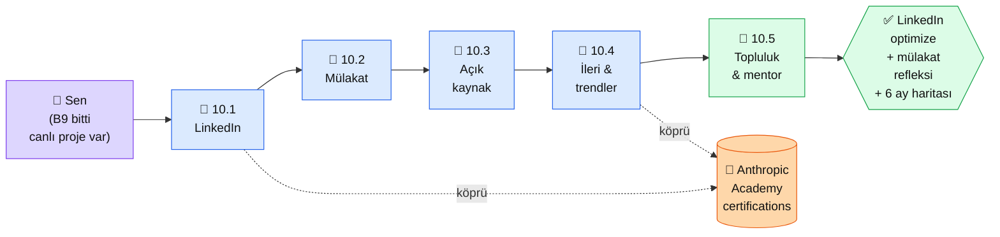

# Bölüm 10 — İleri Seviye ve Kariyer

**Persona:** Bölüm 9'u bitirdi. Canlı projesi var, GitHub'da repo var, README hazır. "Bunu kariyere/işe nasıl çeviririm" sorusu var · **Süre:** ~3 saat (5 sayfa, çoğu eylem planı) · **Önkoşul:** Bölüm 9 çıktısı (canlı URL + repo) elinde · **Çıktı:** LinkedIn profili AI Engineer ekseninde optimize, mülakat soruları için hazırlık notları, sonraki 6 aylık öğrenme yol haritası yazılı

## Neden bu bölüm?

Platformun sonu **proje değil; o projenin sana ne kazandırdığı.** 9. Bölüm projeyi canlıya soktu. Bu bölüm "şimdi ne?" sorusunu cevaplar — iş arama, freelance, açık kaynağa katkı, yan gelir, mentorluk arama.

Niye 5 sayfa, az? Çünkü teknik kısım bitti. Burası **eylem planı + topluluk + sonraki 6 ay haritası.** Sayfalar kısa, örnek bol, gerçekçi.

Üçüncüsü: **AI alanı 6 ayda değişiyor.** Burada öğrendiklerin 6 ay sonra eskiyebilir. Bu bölüm "kendini güncel tutma alışkanlığı"nı kuruyor — hangi blogları takip edersin, hangi topluluklarda olursun, hangi habere zamanını verirsin.

## Bölüm 10 kısaca

**10.1 — LinkedIn Profil Optimizasyonu.** Headline + About bölümü + projenin "Featured" alanına nasıl koyulur. AI Engineer kelimelerinin ATS taraması için hangi yere yerleştirileceği. 3 örnek profil (önce/sonra).

**10.2 — Mülakat Soruları.** En sık 30 soru: "RAG'i fine-tune'dan ne zaman tercih edersin?", "Token nedir?", "Prompt injection nasıl önlenir?", "MCP nedir?". Her birine 1-2 paragraflık model cevap (kalıp değil, refleks için).

**10.3 — Açık Kaynak Katkı.** Anthropic Cookbook'a (anthropic-cookbook), LangChain, Qdrant gibi projelere ilk PR nasıl atılır. "Beginner-friendly issue" etiketleriyle başlama. İlk küçük katkıdan referans inşası.

**10.4 — İleri Konular ve Trendler.** 2026 itibarıyla yükselen konular: AI agents at scale, multimodal foundation models, on-device inference (mobile), AI safety + alignment araştırma. Hangi paper, hangi blog, hangi podcast.

**10.5 — Topluluk ve Mentorluk.** Türkiye AI toplulukları, Discord/Slack grupları, mentorluk arama (ADP Listesi, MentorCruise, Anthropic ambassador programları). Mentor olma tarafı (sen kuyrukta arkadakine yardım ediyorsun).

## Bu bölümün yol haritası

### Aktör tablosu

| Düğüm | Nerede | Ne iş yapıyor |
|---|---|---|
| 👤 **Sen** | LinkedIn + GitHub + topluluk kanalları | Profil yenile, mülakat sorularını çalış, ilk açık kaynak PR'ı at |
| 📄 **10.1 LinkedIn** | linkedin.com/in/sen | Headline + About + Featured projeyi koy |
| 📄 **10.2 Mülakat** | Platform (30 soru) | Model cevaplar oku, sesli kendi cevabını test et |
| 📄 **10.3 Açık kaynak** | GitHub anthropic-cookbook + benzer | İlk küçük PR (typo, doc, küçük örnek) |
| 📄 **10.4 İleri konular** | Platform + dış kaynaklar | 2026 trend listesi + okuma kuyruğu |
| 🏁 **10.5 Topluluk** | Discord + Slack + Türkçe AI grupları | En az 2 topluluğa kayıt + 1 mesajla tanışma |
| 📖 **Anthropic Academy certifications** | skilljar.com | 18 kursun tamamlanma takibi — sertifikaları LinkedIn'e ekle |
| ✅ **Çıktı** | LinkedIn + GitHub + kişisel not | "Sonraki 6 ay" planı yazılı: hangi 3 konu, hangi 5 kaynak, hangi 1 topluluk |

## Bu bölüm bittiğinde elinde ne olacak

- **Optimize LinkedIn profili:** Headline'da "AI Engineer / Building with Claude" benzeri, projeyi Featured'a koymuş, ilgili kelimelerle ATS taranabilir
- **30 mülakat sorusuna refleks:** Sesli cevap verebiliyorsun, bocalama 5 saniyenin altında
- **İlk açık kaynak katkın:** Anthropic Cookbook veya benzer bir projede merge edilmiş bir PR. GitHub profilinde görünüyor
- **6 aylık öğrenme haritası yazılı:** "Sonraki 6 ay şu 3 konuya odaklanacağım: agents-at-scale, on-device, alignment" gibi netlik
- **2 topluluğa kayıt + 1 mentor temasi:** Yalnız değilsin — sorular geldiğinde soracağın, paylaşacağın insanlar var
- **Anthropic Academy sertifikaları planı:** 18 kursun hangilerini ne zaman bitireceğin yazılı (1-2 ayda hepsi mümkün)
- **Mentorluk hazırlığı:** Yeni başlayan birine yardım etme refleksi — bu hem hatırlatır hem network büyütür

Bu çıktı **platformun gerçek bitişi.** Önceki 9 bölüm "üretmeyi" öğretti, bu bölüm "üretmeye devam etme + paylaşma" alışkanlığını kurdu.

📖 Anthropic bu bölümde ne der — öz

Kariyer tarafında Anthropic **doğrudan ders vermez** ama ekosistemin "saygı kazandıran" referansları onlardan gelir:

**1. Anthropic Academy certifications.** [anthropic.skilljar.com](https://anthropic.skilljar.com) — 18 ücretsiz sertifika. LinkedIn "Licenses & Certifications" bölümüne her birini ekleyebilirsin. AI işveren CV taraması yaparken Anthropic sertifikası **piyasa için belirgin sinyal** (Anthropic'in itibarı CV'ye yansıyor).

**2. AI Fluency for Educators / Students / Nonprofits.** Domain-spesifik kurslar. Eğitimde, öğrenciyle, STK'da çalışıyorsan ek 3 sertifika kapısı — ilgili olduğun alana göre seç.

**3. Teaching AI Fluency.** "AI öğretmeyi öğreten" kurs. Bu ileri bir adım — sen başkalarına öğretirken gerçek anlamda öğreniyorsun. Mentorluk planın varsa bu kurs hızlandırır.

**4. Claude in Slack / Cowork integration.** [docs.claude.com/en/docs/claude-in-slack](https://docs.claude.com/en/docs/claude-in-slack) — ekiple çalışma deneyimi gösterirken Claude'u Slack'e entegre etmiş olman teknik bir referans. 10.3 açık kaynak işinin bir varyantı: Anthropic'in resmi entegrasyonlarına katkı.

**5. Anthropic blog + research.** [anthropic.com/news](https://www.anthropic.com/news) ayda 5-10 önemli post. 10.4 ileri konular için birincil kaynak. RSS abone ol, haftalık özet oku.

**Kaynak:** [Anthropic Academy](https://anthropic.skilljar.com/) sertifikalar listesi. 10.1 LinkedIn güncellemesinden sonra aç — bitirebileceğin sertifikaları işaretle, LinkedIn "Licenses & Certifications"a sırayla ekle. 18 kursun hepsi ücretsiz; 4-6 hafta içinde tamamlanabilir.

---

**Bir sonraki adım →** [10.1 LinkedIn Profil Optimizasyonu](01-linkedin.md) (40 dk, headline + about + featured)

← [Bölüm 9 — Deployment ve Portföy](../bolum-9/index.md) &nbsp;|&nbsp; [Ana Sayfa](../index.md)

**🎓 Platformu bitirdiysen:** Tebrikler. Şimdi senin başkalarına öğretme zamanın. Mentorluk + topluluk yolun açık. Bu sayfanın "ma-sonraki"si bir kademe yukarıda — kendi hikâyeni yazıyorsun.

