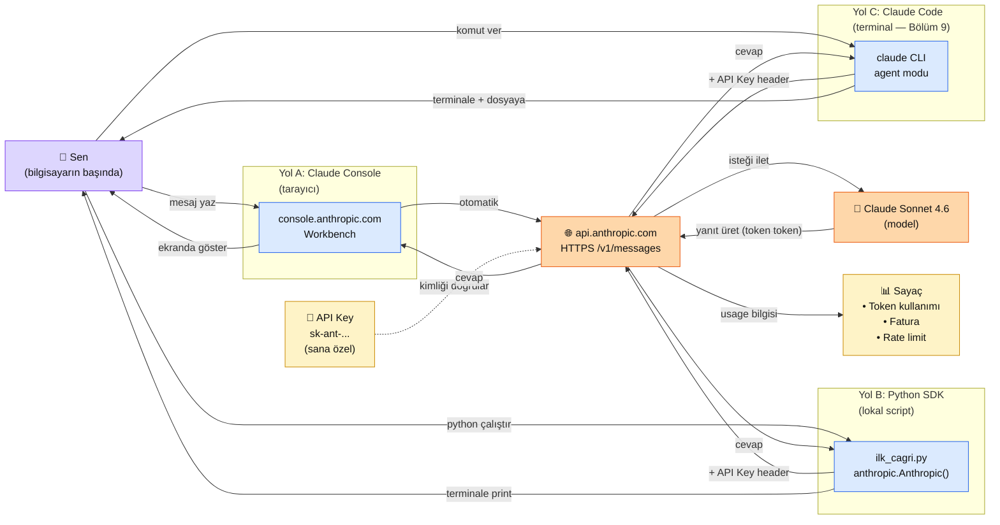

# 2.1 LLM Nedir — ve İlk Claude Çağrın

<div class="ma-meta" markdown>
<div class="ma-meta-row" markdown>
<strong>Kim için:</strong>
<span class="ma-persona ma-persona-baslangic">🟢 başlangıç</span>
<span class="ma-persona ma-persona-is">🔵 iş</span>
<span class="ma-persona ma-persona-kisisel">🟣 kişisel</span>
</div>
<div class="ma-meta-row"><strong>📋 Önkoşul:</strong> Yok — Bölüm 0 kurulumu yapılmadıysa zararı olmaz; Console kısmı tarayıcıda çalışır</div>
<div class="ma-meta-row"><strong>🎯 Çıktı:</strong> Claude'a ilk mesajını gönderirsin; yanıtı aldığında **neyin nereye gittiğini, geriye neyin döndüğünü** kendi cümlelerinle anlatabilirsin.</div>
</div>

!!! tip "Yabancı kelime mi gördün?"
    Bu sayfadaki **italik-altı çizili** ifadelerin (LLM, API, token, RAG, agent, MCP gibi) üstüne mouse'unu getir — kısa tanım çıkacak. Mobilde kelimeye dokun. Bilmediğin her terim burada bu şekilde anlatılır.

## Neden bu sayfa?

Bu rehberde ne yaparsak yapalım — ister Claude'a kendi belgelerini okutmak (RAG), ister ona iş yaptırmak (agent), ister onu Gmail veya veritabanına bağlamak (MCP), ister ona "şöyle cevap ver" demenin inceliklerini öğrenmek (prompt teknikleri) — hepsi tek bir temele oturuyor: **sen Claude'a konuşuyorsun, Claude sana geri konuşuyor.** Bu konuşma nerede olur, nasıl olur, arka planda kim ne yapar?

Sayfa bittiğinde iki şey elinde kalacak: (1) ilk çalışan API çağrın, (2) bu evrende kendini konumlandıran bir harita. Bundan sonraki 63 sayfa bu iki şeyin üzerine yapı kuracak. Haritasız yola çıkarsak yabancı kalırız — bu sayfada o yabancılığı kesiyoruz.

## LLM kısaca — üç paragraf, matematiksiz

LLM (Large Language Model, büyük dil modeli) internet ölçeğinde metin üzerine eğitilmiş bir tahmincidir. Sana bir cümle verdiğinde yaptığı tek şey: **bir sonraki parçayı tahmin etmek**. "Parça" dediğimiz şey token — kelimenin kabaca %75'ine denk gelen bir birim. "İstanbul" tek token olabilir, "kahvaltılık" iki parçaya bölünür. LLM tahmini tekrar tekrar yapar; her yeni token öncekilere bakılarak üretilir. Sana gelen "cevap" işte bu zincirin gözle görünür hali.

Token hem gönderdiğin hem aldığın metinde sayılır. Ücretlendirme bu sayım üzerinden yapılır — Claude API'nin "ne kadara malolur" sorusunun tek cevabı: kaç girdi token gönderdin, kaç çıktı token aldın. Bu yüzden uzun prompt + uzun cevap = pahalı; kısa prompt + hedefli cevap = ucuz.

Bir LLM klasik anlamda "düşünmez" — eğitimde gördüğü milyarlarca örüntüden yararlanarak çoğu zaman şaşırtıcı doğru tahminler yapar. Hatalı çıktı (hallucination) bu mekaniğin doğal sonucu: model emin olmadığında bile bir sonraki token'ı üretmek zorundadır. İyi prompt mühendisliğinin büyük kısmı modeli "emin değilim" diyebileceği bir çerçeveye oturtmaktır. Bu kurstaki her prompt tekniği aslında bu tek amaca hizmet eder.

## Bu sayfanın ekosistemi — kim kime ne veriyor

Aşağıdaki diyagram sayfanın anayurdudur. Uygulamaya geçmeden önce bu haritayı beş dakika incele — kendinin ve Claude'un nerede olduğunu gör.

<div class="ma-ekosistem" markdown>
<div class="ma-ekosistem-header">🗺️ Ekosistem — senden Claude'a, Claude'dan sana</div>



<table class="ma-aktorler" markdown>
<thead><tr><th>Aktör</th><th>Nerede?</th><th>Ne iş yapar?</th></tr></thead>
<tbody>
<tr><td>👤 Sen</td><td>Kendi bilgisayarın</td><td>Mesaj yazarsın. Üç giriş yolundan birini seçersin. Cevabı okursun.</td></tr>
<tr><td>Yol A — Console</td><td>Tarayıcıda console.anthropic.com</td><td>Tek kişilik "yeni bir sohbet ekranı". Kod yok. Hızlı test için. **Bu sayfada kullanacağız.**</td></tr>
<tr><td>Yol B — Python SDK</td><td>Senin bilgisayarında Python script</td><td>`anthropic` kütüphanesi API'ye HTTPS isteği atar. **Bu sayfada kullanacağız.**</td></tr>
<tr><td>Yol C — Claude Code</td><td>Senin terminalinde</td><td>Claude'un agent versiyonu — kendisi dosya okur, komut çalıştırır. Bölüm 9'da öğrenilecek, bu sayfada sadece görmen için.</td></tr>
<tr><td>🔑 API Key</td><td>Console'dan alınır, senin ortam değişkeninde saklanır</td><td>"Bu istek gerçekten Kemal'den geliyor" diye API'ye kimlik ispatı. Sızdırılırsa başkası senin kredini harcar.</td></tr>
<tr><td>🌐 api.anthropic.com</td><td>Anthropic'in sunucuları (ABD/AB)</td><td>İsteği kabul eder, kimliği doğrular, modele iletir, yanıtı geri paketler. HTTPS zorunlu.</td></tr>
<tr><td>🧠 Claude Modeli</td><td>Anthropic'in GPU'larında</td><td>Asıl "düşünen" parça. İstek metnini alır, token token yanıt üretir. Sen hangi yoldan gelsen aynı model.</td></tr>
<tr><td>📊 Sayaç</td><td>Console → Usage sekmesi</td><td>Her çağrıda kaç girdi + çıktı token'ı harcadığın, fatura toplamın, saatlik/dakikalık limitlerin.</td></tr>
</tbody>
</table>
</div>

**Önemli not:** Üç yolun (A, B, C) hedefi aynı — `api.anthropic.com` ve aynı model. Fark sadece "sen hangi araçla konuşuyorsun". Bu kurstaki ilerleyiş de bu sırayla olacak: önce Console'da elini alıştırırsın, sonra Python'a geçer gerçek uygulamaları yazarsın, ileride Claude Code ile Claude'u kendi kendine çalışan bir ortağa dönüştürürsün.

## Uygulama — iki yol

Aşağıdaki iki yolu da dene. Sıralaması önemli: **önce Yol A (Console)**, sonra **Yol B (Python)**. Console'da Claude'un davranışını görürsün, Python'da aynı davranışı kendi ortamında üretirsin. Bu, diyagramda Yol A'dan Yol B'ye geçişi kendi elinle kanıtlaman demek.

### Yol A — Claude Console (kod yok)

🔵 **İş personası için önerilen başlangıç.** Tarayıcı aç, Claude'u yerinde gör.

1. [console.anthropic.com](https://console.anthropic.com) adresine git — hesap aç (Google ile giriş yeterli). Yeni üyelere Anthropic küçük bir deneme kredisi tanımlar; bu sayfa için fazlasıyla yeter.
2. Sol menüden **Workbench**'e gir.
3. Model seçiminden **"Claude Sonnet 4.6"**'yı seç — bu platformda boyunca varsayılan modelimiz olacak (maliyet/kalite dengesi en iyi olan).
4. **User** alanına şunu yapıştır:
   ```
   Selam Claude. Sen Türkçe konuşan bir AI asistansın. Bana 3 cümleyle,
   matematik kullanmadan, bir LLM'in bir sonraki kelimeyi nasıl tahmin
   ettiğini anlat.
   ```
5. **Run** düğmesine bas. Yanıt ekranda akar.
6. Sağ panelde **Usage** bölümüne bak — kaç girdi + çıktı token'ı harcadın? Bu sayılar bundan sonraki her çağrında kafanda olacak.

**Burada olan nedir (diyagram referansı):** Sen → Workbench → api.anthropic.com → Claude modeli → yanıt → Workbench → sen. Tarayıcı seni API'ye taşıdı, API Key Anthropic hesabından otomatik eklendi, sayaç arkada döndü.

### Yol B — Python SDK ile ilk API çağrın

🟢 🟣 **Başlangıç ve kişisel persona için.** Terminal veya Colab ortamında.

**Adım 1 — API key al:**
Console sağ üst profil → **API Keys** → **Create Key** → adını `muhendisal-deneme` koy → oluştur. Key'i kopyala, güvenli bir yere kaydet.

!!! danger "Key'i bir kez görürsün"
    Pencere kapanınca key'i bir daha göremezsin. Kaybedersen sil, yeniden oluştur. **Asla git'e, Gist'e, ekran görüntüsüne koyma.**

**Adım 2 — Paketi kur:**

```bash
pip install anthropic
```

**Adım 3 — Key'i ortam değişkenine koy (kod dışında):**

=== "Linux / macOS"

    ```bash
    export ANTHROPIC_API_KEY="sk-ant-api03-...senin-key'in..."
    ```

=== "Windows (PowerShell)"

    ```powershell
    $env:ANTHROPIC_API_KEY = "sk-ant-api03-...senin-key'in..."
    ```

**Adım 4 — `ilk_cagri.py` dosyası:**

```python
"""İlk Claude API çağrım — bolum 2.1 pratiği."""
import os
from anthropic import Anthropic

client = Anthropic(api_key=os.environ["ANTHROPIC_API_KEY"])

yanit = client.messages.create(
    model="claude-sonnet-4-6",
    max_tokens=300,
    messages=[
        {
            "role": "user",
            "content": (
                "Selam Claude. Sen Türkçe konuşan bir AI asistansın. "
                "Bana 3 cümleyle, matematik kullanmadan, bir LLM'in "
                "bir sonraki kelimeyi nasıl tahmin ettiğini anlat."
            ),
        }
    ],
)

print(yanit.content[0].text)
print("---")
print("Girdi token:", yanit.usage.input_tokens)
print("Çıktı token:", yanit.usage.output_tokens)
```

**Adım 5 — Çalıştır:**

```bash
python ilk_cagri.py
```

**Beklenen çıktı** (metin modele göre değişir, yapı değişmez):

```
Bir LLM aslında bir tamamlama makinesidir... [2-3 cümle daha]
---
Girdi token: 58
Çıktı token: 87
```

**Burada olan nedir (diyagram referansı):** `anthropic.Anthropic()` — Python kütüphanesini başlattın. `messages.create(...)` — kütüphane bir HTTPS POST hazırladı, header'a senin API key'ini koydu, gövdesine modeli + mesajını koydu, `api.anthropic.com/v1/messages` adresine gönderdi. API modeli çağırdı, yanıt token token döndü, tamamlandı, geri geldi, Python kütüphanesi JSON'u Python objesine çevirdi, sen `.content[0].text` ile metni, `.usage` ile sayaçları okudun. Diyagramdaki Yol B akışının tamamı bu 10 satır kodda oldu.

??? tip "Hata aldıysan"
    - `AuthenticationError`: API key export edilmedi. `echo $ANTHROPIC_API_KEY` (Linux/Mac) veya `$env:ANTHROPIC_API_KEY` (Windows) ile kontrol et; boşsa tekrar set et.
    - `model_not_found`: model adı değişmiş olabilir. Güncel adlar için aşağıdaki Anthropic özüne bak.
    - `rate_limit_error`: deneme kredisini bitirdin veya dakikalık limit aşıldı. 1 dakika bekle.
    - `InvalidRequestError (max_tokens)`: sayıyı düşür, 100'den başla.

<div class="ma-anthropic-oz" markdown>
<div class="ma-anthropic-oz-header">📖 Anthropic bu konuyu nasıl anlatıyor — öz</div>

Anthropic'in resmi dokümanı ve **Building with the Claude API** kursu bu sayfadaki çağrıyı üç kuralla özetliyor:

**1. Her API çağrısında üç zorunlu parça var:** (1) hangi modeli kullanacaksın, (2) ne mesaj yollayacaksın, (3) cevap en fazla kaç token olsun (`max_tokens`). **Son maddeyi unutma** — yoksa Claude 20 sayfa cevap üretip faturayı şişirebilir. Sen bu sayfada üçünü de verdin.

**2. Model adını tarihli yaz.** `claude-sonnet-4-6` (sabit isim) yerine `claude-sonnet-4-6` (tarihli snapshot) kullan — böylece Anthropic modeli yarın güncellese de kodun aynı davranır, kırılmaz.

**3. Kimliğini API key ile ispatla.** Key'i koda yazma, ortam değişkenine koy. SDK zaten header'lara otomatik ekliyor; sen bu işin mekaniğiyle uğraşmıyorsun.

??? info "Teknik detay — isteyene (düz HTTP, header'lar, stop_reason, kaynaklar)"

    **Messages API'nin zorunlu alanları: `model` ve `messages`.** Hiçbir çağrı bu ikisi olmadan çalışmaz. Sen bu sayfada `claude-sonnet-4-6` değerini `model`'e, bir `user` mesajını `messages`'a verdin — minimum sözleşme sağlandı. `max_tokens` da zorunlu ve bir güvenlik katmanı: model çıktı token'ı başına ücretlendirilir; `max_tokens=300` Claude'u 300 token'da keser. Geniş işlerde artırırsın (ör. 4000), küçük işlerde düşürürsün (ör. 50). Kesildiğinde `stop_reason: "max_tokens"` döner.

    **Tarihli snapshot neden:** Model sürümleri zamanla güncellenir. `claude-sonnet-4-6` bir takma ad — bugün A sürümüne, yarın B sürümüne işaret edebilir. Tarihli snapshot (`...-20250929`) sabittir. Yeni işlere başladığında [docs.claude.com/models](https://docs.claude.com/en/docs/about-claude/models) adresinden güncel snapshot adını al.

    **Header mekaniği:** SDK senin yerine `x-api-key` ve `anthropic-version` header'larını ekliyor. Düz HTTP ile (ör. `curl` ile) denerken bu ikisini manuel eklemen gerekir. SDK'nin ana kazancı bu: kimlik, hata yakalama, yeniden deneme, streaming hazır gelir.

<div class="ma-anthropic-oz-kaynak" markdown>
**Kaynak:** [docs.claude.com/en/api/messages](https://docs.claude.com/en/api/messages) (resmi API referansı) ve [Building with the Claude API](https://anthropic.skilljar.com/claude-with-the-anthropic-api) — Anthropic Academy (ücretsiz, sertifikalı, EN, ~2 saat). Bu sayfayı bitirdiğinde kursun ilk üç bölümünü zaten deneyimlemiş olacaksın.
</div>
</div>

<div class="ma-cikti-kaniti" markdown>
### 📦 Bu sayfayı bitirdiğini nasıl kanıtlarsın

Aşağıdaki üç kanıttan **en az birini** üret. Sıralama zorluk: en kolay en üstte.

#### 1. 📝 Refleksiyon yazısı — 5 dakika, herkes yapabilir

Not defteri (Windows) veya TextEdit (Mac) aç, 3-5 cümle yaz:

> "`python ilk_cagri.py` yazdığımda şu oldu: önce ... sonra ... Ekrana gelen sayılar ... demek oluyormuş. Diyagrama tekrar baktığımda artık ... anlıyorum."

Dosyayı şu yola kaydet: `muhendisal-notlarim/bolum-2/01-ilk-cagri/refleksiyon.txt` (bu klasörü bilgisayarında bir kere aç, sonraki sayfalar da buraya birikecek).

#### 2. 📸 Ekran görüntüsü — 3 dakika, işletim sistemi kısayolu lazım

**Neyin görüntüsü:** Ya Console → Workbench'teki **Usage** paneli (token sayıları görünmeli), ya da terminaldeki `python ilk_cagri.py` çıktısı.

| İşletim sistemi | Kısayol | Nereye kaydedilir |
|---|---|---|
| **Windows** | `Win + Shift + S` → alan seç → panoya kopyalanır → Paint aç (Başlat'a "Paint" yaz) → `Ctrl + V` → Dosya → Kaydet (PNG) | Seçtiğin klasöre |
| **Mac** | `Cmd + Shift + 4` → alan seç → otomatik kaydedilir | Masaüstü |
| **Linux (GNOME)** | `Shift + PrtScr` → alan seç | Resimler klasörü |

Görüntüyü `muhendisal-notlarim/bolum-2/01-ilk-cagri/ekran.png` olarak taşı.

#### 3. 💻 GitHub Gist — 10 dakika, GitHub hesabı lazım

**Gist nedir:** GitHub'ın "tek dosyalık paylaşım" servisi. Dosyanı başkasının okuyabileceği bir web linkine dönüştürür.

**GitHub hesabın yoksa:** bu adımı atla, yukarıdaki 1 veya 2 yeterli.

**Varsa:**

1. [gist.github.com](https://gist.github.com) aç.
2. Üst sağda **"+"** işareti → **"New gist"**.
3. **"Filename including extension"** kutusuna `ilk_cagri.py` yaz.
4. Büyük metin kutusuna kendi `ilk_cagri.py` içeriğini yapıştır.
5. **Kontrol et:** Kodda `os.environ["ANTHROPIC_API_KEY"]` yazıyor mu? Yazıyorsa iyi — anahtar kodda değil, ortamda. Eğer yanlışlıkla gerçek `sk-ant-...` değerini koyduysan **hemen sil, yerine `os.environ[...]` yaz.**
6. Sağ altta **"Create public gist"** (açık) veya **"Create secret gist"** (linki bilen görür, listede yok) seç.
7. Adres çubuğundaki URL'yi kopyala → `muhendisal-notlarim/bolum-2/01-ilk-cagri/gist-linki.txt` dosyasına yapıştır.

---

**Nereye saklıyoruz:** Bilgisayarında `muhendisal-notlarim/` diye bir ana klasör aç. Her bölüm/sayfa bunun altına birikecek. Kurs bittiğinde bu klasör **senin portföyün** olacak — iş başvurularında "işte yaptıklarım" kanıtı. İleride GitHub'a public repo olarak yükleyebilirsin.

**Neden bu önemli:** Kitap okumak değil, *yapmış olmak* sayılsın diye. Bundan sonraki her sayfa bu çağrının üzerine ekleme yapıyor — çağrıyı yapmadıysan sonraki sayfalarda yolunu bulamazsın.
</div>

<div class="ma-neden-sonuc" markdown>
<div class="ma-neden-sonuc-header">🔗 Birlikte okuma — neden ne oldu</div>

<ol class="ma-neden-sonuc-zincir" markdown>
<li>**LLM bir tamamlama makinesidir**, düşünen bir varlık değil — bu yüzden ona verdiğin her token önemli ve modelin görev çerçevesini belirler. Bu yüzden prompt mühendisliği diye bir disiplin var.</li>
<li>Anthropic modelleri uzaktaki sunucularda çalışıyor, senin bilgisayarında değil — **bu yüzden API üzerinden konuşuyoruz**, HTTPS + kimlik + sayaç gerekli.</li>
<li>Kimlik gerektiği için **API key aldın**. Key sızdırılırsa hesabın saldırıya uğrar, bu yüzden kodun içine yazmadık, ortam değişkenine koyduk.</li>
<li>Ortam değişkenine koyduğun için **kod güvenli**, commit etsen bile key dışarıya sızmaz — repo paylaşımı riski ortadan kalktı.</li>
<li>Model her çağrıda tarihlidir (`claude-sonnet-4-6`) — **bu yüzden kodun zamanla kırılmaz**; Anthropic modeli güncellese bile sen aynı sürümle konuşmaya devam edersin.</li>
<li>Her çağrıda `max_tokens` verdin — **bu yüzden faturan patlamaz**; cevap uzasa da 300 token'da keser.</li>
</ol>

<div class="ma-neden-sonuc-sonuc" markdown>
**Sonuç:** Elinde iki somut şey var — (1) çalışan bir API çağrısı, (2) bu evrende kim-kime-ne haritası. Bundan sonra hangi bölüme gidersen git, aynı harita geçerli olacak; sadece Sen'le API arasına yeni aktörler (RAG, Agent, MCP) girecek.
</div>
</div>

<div class="ma-sonraki" markdown>
<div class="ma-sonraki-header">➡️ Sonraki adım</div>

**[2.2 Token ve Bağlam Penceresi →](02-token-baglam.md)**
Bu sayfada token'ı duydun; sıradaki sayfada neden bir üst sınır olduğunu, uzun belgelerle çalışırken bu sınırın seni nasıl kısıtladığını ve nasıl aştığını öğreniyorsun.

**Pekiştirmek istersen (opsiyonel):** Diyagramı bir kez daha aç, Yol A'daki Console akışını gözle takip et. Sonra `ilk_cagri.py`'yi açıp her satırın diyagramda hangi oka karşılık geldiğini bul.
</div>
