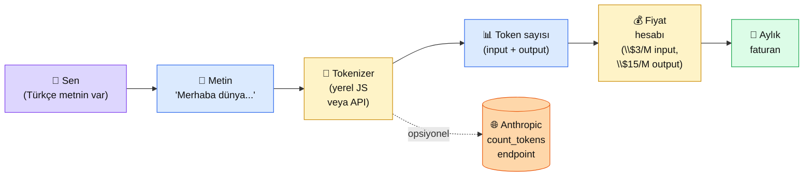

# 2.2 Token, Bağlam, Maliyet

<div class="ma-meta" markdown>
<div class="ma-meta-row" markdown>
<strong>Kim için:</strong>
<span class="ma-persona ma-persona-baslangic">🟢 başlangıç</span>
<span class="ma-persona ma-persona-is">🔵 iş</span>
<span class="ma-persona ma-persona-kisisel">🟣 kişisel</span>
</div>
<div class="ma-meta-row"><strong>📋 Önkoşul:</strong> 2.1 bitmiş — ilk Claude çağrını yapmış olman; Anthropic Console'da API anahtarın var</div>
<div class="ma-meta-row"><strong>🎯 Çıktı:</strong> Bir Türkçe metnin Claude'da kaç token tuttuğunu ölçersin; aylık projenin **TL/$** olarak yaklaşık faturasını hesaplarsın; "Claude pahalı mı?" sorusuna rakamlı cevap verirsin.</div>
</div>

!!! tip "Yabancı kelime mi gördün?"
    Bu sayfadaki **italik-altı çizili** ifadelerin (token, context, prompt gibi) üstüne mouse'unu getir — kısa tanım çıkar. Mobilde kelimeye dokun. Bilmediğin her terim böyle açıklanır.

## Neden bu sayfa?

2.1'de Claude'a "merhaba" dedin ve cevap aldın. Güzel — ama **parayı görmedin.** Anthropic Console'un sağ üst köşesinde küçük bir rakam değişti: belki `$0.0002`. O ne demek? Niye o kadar? Bu sayfa o gizemi açar.

İkincisi: **AI projelerinin %80 ölüm sebebi maliyet sürprizi.** "5 TL'lik bot bir gecede 5000 TL fatura çıkardı" hikâyeleri internetin her yerinde. Bunun olmaması için **token nedir, context window nedir, fiyat nasıl hesaplanır** üçlüsünü içine sindirmen gerek. Bu sayfa o üçlüyü gözle görülür hale getirir.

Üçüncüsü: Sonraki bütün bölümlerde (RAG, agent, multimodal) **token aritmetiği** birden fazla yerden çıkar — "uzun PDF'i nasıl chunk'larım?" sorusu aslında "context window'u nasıl idare ederim?" sorusunun pratik karşılığı. Bu sayfa o hesabın temelidir.

## Token kısaca — üç paragraf, matematiksiz

**Token, dilin "AI'ya yutturulabilen lokması".** Claude bir cümleyi olduğu gibi yutamaz; önce parçalara ayırır. Bu parçalara token denir. Bir token bazen bir kelime ("merhaba"), bazen bir kelimenin parçası ("muhen-disal" → 2 token), bazen tek karakter (noktalama, emoji) olur. **Türkçe'de 1 kelime ortalama 1.5-2 token tutar** (İngilizce'de 0.7-1). Yani aynı içerik Türkçe'de İngilizce'ye göre **~%50 daha pahalıdır.**

**Context window, Claude'un tek seferde "akılda tutabildiği" toplam token sayısı.** Claude Sonnet 4.x için bu pencere 200,000 token (yaklaşık 150,000 Türkçe kelime — orta uzunlukta bir roman). Bu pencere prompt + sistem mesajı + cevap tüm taraflar için ortak — yani 199K token sistem prompt'a verirsen geriye sadece 1K kalır cevap için.

**Fiyatlandırma input ve output ayrı.** Anthropic input token'ı (senin gönderdiğin) **output token'dan ucuz** sayar — çünkü output üretmek (model "düşünmek" anlamında) daha pahalı. Yaklaşık oran 1:5 (output 5 kat). Bu kararı vermek önemli: "uzun cevap üreten" promptlar ile "kısa cevap üreten" promptlar arasında 5x fark var. Bu farkı bilmek = parayı bilmek.

## Bu sayfanın ekosistemi — kim kime ne veriyor

<div class="ma-ekosistem" markdown>
<div class="ma-ekosistem-header">🗺️ Ekosistem — metinden token'a, token'dan faturaya</div>



<table class="ma-aktorler" markdown>

| Düğüm | Nerede | Ne iş yapıyor |
|---|---|---|
| 👤 **Sen** | Tarayıcı veya Python terminal | Metni hazırlıyor, ölçüyor, hesabı yapıyor |
| 📝 **Metin** | Tarayıcıda yazılı / .txt dosyada | Ölçülecek girdi (prompt + sistem mesajı + örnek dokümanlar) |
| 🔢 **Tokenizer** | İki seçenek: (a) yerel JS — Anthropic Tokenizer sayfası; (b) Anthropic API'nin `/v1/messages/count_tokens` endpoint'i | Metni token'lara böler, sayar |
| 📊 **Token sayısı** | Console / terminal çıktısı | Input + tahmini output rakamları |
| 💰 **Fiyat hesabı** | Excel / hesap makinesi / Python | Sonnet 4.x: ~$3 / 1M input, ~$15 / 1M output (2026 fiyatı, [anthropic.com/pricing](https://www.anthropic.com/pricing) ile doğrula) |
| 🧾 **Aylık fatura** | Anthropic Console "Billing" + senin tahminin | Gerçek fatura ile tahmin karşılaştırması |
| 🌐 **count_tokens API** | Anthropic API uzak çağrısı | Yerel tokenizer'ı atlamak isteyenlere kanonik kaynak |

</table>
</div>

## Uygulama — iki yol

### Yol A — Anthropic Tokenizer (kod yok)

Tarayıcıda en hızlı yol:

1. **[claude.com/tokenizer](https://claude.com/tokenizer)** sayfasını aç (resmi Anthropic aracı)
2. Kutuya bir Türkçe paragraf yapıştır (örnek altta)
3. Sağ panelde **token sayısı** anlık çıkar
4. Aynı paragrafın İngilizce çevirisini yapıştır — farkı gör

**Örnek metin (Türkçe):**

> "Merhaba, ben yapay zeka geliştirme öğreniyorum. Bu sayfada token kavramını öğrenip kendi metnimin maliyetini hesaplıyorum. Amacım üç ay sonra çalışan bir sohbet botu yapmak."

Bu metin yaklaşık **52-60 token** tutar. Aynı metnin İngilizcesi (~30 kelime) ~38-44 token. Türkçe'de **~%40 fazlalık** var — Türkçe'nin ekleri ayrı token sayılıyor (`öğreni-yorum` → 2 token).

**Burada olan nedir (diyagram referansı):** Sen → Metin → Tokenizer → Token sayısı yolu. Fiyat henüz hesaplanmadı; o sıradaki adım.

### Yol B — Python ile token ölç + fiyat hesapla

Anthropic SDK'nın `count_tokens` metodu yerel ölçüm yapar — API çağrısı bile gerekmez:

```python
import anthropic

client = anthropic.Anthropic()  # ANTHROPIC_API_KEY env değişkeni okunur

metin = """Merhaba, ben yapay zeka geliştirme öğreniyorum.
Bu sayfada token kavramını öğrenip kendi metnimin maliyetini hesaplıyorum.
Amacım üç ay sonra çalışan bir sohbet botu yapmak."""

# Mesajı count_tokens API'ye gönder (ücretsiz)
sayim = client.messages.count_tokens(
    model="claude-sonnet-4-6",  # güncel model adını docs'tan kontrol et
    messages=[{"role": "user", "content": metin}],
)

print(f"Input token: {sayim.input_tokens}")

# Fiyat hesabı — 2026 yaklaşık Sonnet 4.x fiyatları:
INPUT_FIYAT_USD_PER_MTOK = 3.00     # $3 / 1 milyon input token
OUTPUT_FIYAT_USD_PER_MTOK = 15.00   # $15 / 1 milyon output token

# Bu prompt'u 1000 kullanıcı çağırsa, ortalama 200 token cevap dönerse:
KULLANICI_SAYISI = 1000
ORT_OUTPUT_TOKEN = 200

input_toplam = sayim.input_tokens * KULLANICI_SAYISI
output_toplam = ORT_OUTPUT_TOKEN * KULLANICI_SAYISI

input_maliyet = (input_toplam / 1_000_000) * INPUT_FIYAT_USD_PER_MTOK
output_maliyet = (output_toplam / 1_000_000) * OUTPUT_FIYAT_USD_PER_MTOK
toplam = input_maliyet + output_maliyet

print(f"\n--- 1000 kullanıcı senaryosu ---")
print(f"Input toplam: {input_toplam:,} token → ${input_maliyet:.4f}")
print(f"Output toplam: {output_toplam:,} token → ${output_maliyet:.4f}")
print(f"TOPLAM: ${toplam:.4f} (~{toplam * 38:.2f} TL)")
```

**Beklenen çıktı (yaklaşık):**

```
Input token: 58

--- 1000 kullanıcı senaryosu ---
Input toplam: 58,000 token → $0.1740
Output toplam: 200,000 token → $3.0000
TOPLAM: $3.1740 (~120.61 TL)
```

**Burada olan nedir (diyagram referansı):** Bu kod ekosistem diyagramının **tamamını tek ekranda** çalıştırır: metni alır → tokenizer'a yollar → sayım gelir → fiyat hesaplar → aylık tahmin verir. `count_tokens` çağrısı **ücretsizdir** (Anthropic'in kendi belgesinde belirtilmiş) — gerçek `messages.create` çağrısından farklı.

### Hızlı zihinsel kasıtlama (formül yok, sezgi)

| Senaryo | Yaklaşık token | Yaklaşık $ (Sonnet 4.x, output 200tok) |
|---|---|---|
| Tek kullanıcı, tek soru | 100 in / 200 out | $0.0033 (~0.13 TL) |
| 100 kullanıcı / gün × 30 gün | 300K in / 600K out | $9.90 (~376 TL/ay) |
| 1000 kullanıcı / gün × 30 gün | 3M in / 6M out | $99 (~3,762 TL/ay) |
| Aynı senaryo + 5K token sistem prompt (cache yok) | 153M in / 6M out | $549 (~20,860 TL/ay) ⚠️ |
| Aynı + **prompt caching** (Bölüm 8'de) | 18M in / 6M out | $144 (~5,470 TL/ay) ✅ |

**Önemli not:** Sistem prompt'unu **her çağrıda gönderirsen** ve uzunsa (5K+) fatura patlar. Çözüm: `prompt caching` (2.8 + Bölüm 8'de). Şu anki sayfada sadece farkındalık — caching'e Bölüm 4 ve 8'de döneceğiz.

<div class="ma-anthropic-oz" markdown>
<div class="ma-anthropic-oz-header">📖 Anthropic bu konuyu nasıl anlatıyor — öz</div>

Anthropic token + fiyat konusunu **çok şeffaf** anlatır — fiyat sayfası ve count_tokens endpoint'i bunun kanıtı.

**1. Token sayma ücretsiz.** Anthropic `count_tokens` API çağrısını faturaya yazmaz. Bu kasıtlı: maliyet tahmini yapmanı kolaylaştırmak için. "Önce tahmin et, sonra çağır" disiplini Anthropic'in önerdiği yaklaşım.

**2. Türkçe ~%40 fazla yer kaplar.** Anthropic'in tokenizer'ı (BPE tabanlı) Latin alfabesine optimize. Türkçe-Arapça-Rusça-Çince diller daha çok token harcar. Bu Anthropic'e özgü değil — OpenAI ve Google'da da benzer.

**3. Prompt caching büyük tasarruf.** 1024+ token'lık sabit içerik (sistem prompt, RAG context) cache edilebilir. Cache'den okuma ~%90 ucuz. Anthropic 2024 sonunda ekledi, 2025-2026'da production'da default kabul ediliyor.

??? info "Teknik detay — isteyene (parameter adları, mekanikler, edge case'ler)"

    **`count_tokens` endpoint:** `POST /v1/messages/count_tokens` — request body `messages.create` ile aynı (model, messages, system, tools), sadece response `{"input_tokens": N}` döner. Output token tahmini yapmaz; o senin işin.

    **Cache mekaniği:** `cache_control: {"type": "ephemeral"}` mesaj/sistem bloğuna eklenir. Cache TTL 5 dakika (yenilenir). Cache write (~%25 normal fiyat), cache read (~%10 normal fiyat). 1024 token altı cache'lenmez — minimum eşik var.

    **Vision token maliyeti:** Görsel inputları piksel sayısına göre token'a çevrilir. 1568×1568 piksel = ~1600 token (Sonnet için). Bölüm 7'de detay.

    **Tool use token maliyeti:** Tool tanımları (JSON schema) input token'a sayılır. Çok tool tanımlı agent'larda her çağrıda tüm tanımlar gider — caching kritik. Bölüm 6'da detay.

    **Output limit:** `max_tokens` parametresi maksimum çıktıyı sınırlar. 2026 itibariyla Sonnet 4.x üst limit 8192 token (model güncellemesiyle değişebilir). Bu üst limite ulaşılırsa output kesilir; full cevap için `max_tokens` artırılır.

<div class="ma-anthropic-oz-kaynak" markdown>
**Kaynak:** [docs.claude.com — Token Counting](https://docs.claude.com/en/docs/build-with-claude/token-counting) (EN, ~10 dk). count_tokens endpoint resmi spesifikasyonu + örnek kodlar burada. Fiyat için ayrıca [anthropic.com/pricing](https://www.anthropic.com/pricing) — Anthropic fiyatları zaman zaman güncelliyor, ay başında bir kontrol et.
</div>
</div>

<div class="ma-cikti-kaniti" markdown>
### 📦 Bu sayfayı bitirdiğini nasıl kanıtlarsın

Aşağıdaki üç kanıttan **en az birini** üret. Sıralama zorluk: en kolay en üstte.

#### 1. 📝 Refleksiyon yazısı — 5 dakika, herkes yapabilir

Not defteri (Windows) veya TextEdit (Mac) aç, 3-5 cümle yaz:

> "Token konusunu çalıştığımda şu oldu: kendi yazdığım [şu metin]'i Anthropic Tokenizer'a koydum, [N] token çıktı. Aynı metnin İngilizcesi [M] token. Türkçe ~%X daha pahalıymış. Eğer 100 kullanıcım olsaydı aylık ~$Y tutardı — bu beni [şaşırttı / öngördüğüm gibiydi]."

Dosyayı şu yola kaydet: `muhendisal-notlarim/bolum-2/02-token-baglam/refleksiyon.txt`

#### 2. 📸 Ekran görüntüsü — 3 dakika, işletim sistemi kısayolu lazım

**Neyin görüntüsü:** [claude.com/tokenizer](https://claude.com/tokenizer) sayfası — kendi Türkçe metnin solda, token sayısı sağda görünüyor.

| İşletim sistemi | Kısayol | Nereye kaydedilir |
|---|---|---|
| **Windows** | `Win + Shift + S` → alan seç → Paint aç → `Ctrl + V` → Kaydet (PNG) | Seçtiğin klasöre |
| **Mac** | `Cmd + Shift + 4` → alan seç → otomatik kaydedilir | Masaüstü |
| **Linux (GNOME)** | `Shift + PrtScr` → alan seç | Resimler klasörü |

Görüntüyü `muhendisal-notlarim/bolum-2/02-token-baglam/tokenizer.png` olarak taşı.

#### 3. 💻 Maliyet hesaplayıcı script + Gist — 10 dakika, Python + GitHub gerek

Yukarıdaki Python kodunu (Yol B) kendi metnine uyarla, **3 farklı senaryo** ekle (örn: 10 / 100 / 1000 kullanıcı), çıktıyı al, [gist.github.com](https://gist.github.com) üzerine yükle.

Gist linkini şu yere kaydet: `muhendisal-notlarim/bolum-2/02-token-baglam/gist-link.txt`

</div>

<div class="ma-neden-sonuc" markdown>
<div class="ma-neden-sonuc-header">🔗 Birlikte okuma — neden ne oldu</div>

- **A → B:** LLM token-token üretir, çünkü transformer mimarisi her seferinde "bir sonraki en olası token"u tahmin eder.
- **B → C:** Token sayısı = işlemcinin yapması gereken iş miktarı, çünkü her token için forward pass çalışır.
- **C → D:** İş miktarı = elektrik + GPU saati = **dolar.** Anthropic bunu input/output ayırarak fiyatlar (output üretmek daha pahalı).
- **D → E:** Türkçe metinler İngilizce'den fazla token ürettiği için **aynı içerik Türkçe'de daha pahalı.** Bu Anthropic'in tercihi değil — tokenizer'ın matematiği.
- **E → F:** Sistem prompt'u her çağrıda göndermek faturayı patlatır — çünkü 5K token × 1000 çağrı = 5M token.

<div class="ma-neden-sonuc-sonuc" markdown>
**Sonuç:** Token sayısını ölçmeden çağrı yapmak, su faturası ölçüsüz musluk açmak gibidir. Bu sayfa sana sayacı taktı; sonraki sayfalar (özellikle 2.4 sistem prompt + Bölüm 8 caching) **suyu nasıl kısacağını** öğretecek.
</div>
</div>

<div class="ma-sonraki" markdown>
<div class="ma-sonraki-header">➡️ Sonraki adım</div>

**[2.3 Sıcaklık ve Sampling →](03-sampling.md)** — Aynı prompt'a Claude'un her seferinde farklı cevap vermesini ne sağlıyor? `temperature` parametresi neyi kontrol ediyor? 0 (deterministik) vs 1 (yaratıcı) hangi proje için.

← [2.1 LLM Nedir](01-llm-temelleri.md) &nbsp;|&nbsp; [Bölüm 2 girişi](index.md) &nbsp;|&nbsp; [Ana sayfa](../index.md)

**Pekiştirme:** [docs.claude.com — Token Counting](https://docs.claude.com/en/docs/build-with-claude/token-counting) sayfasını aç, kendi metninle kendi count_tokens çağrını yap. Yukarıdaki Python örneğini referans alabilirsin.
</div>
