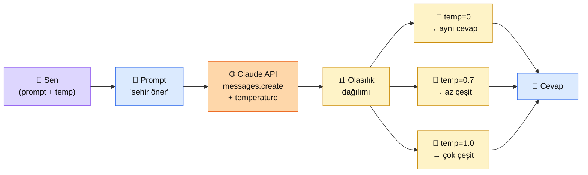

# 2.3 Sıcaklık ve Sampling

<div class="ma-meta" markdown>
<div class="ma-meta-row" markdown>
<strong>Kim için:</strong>
<span class="ma-persona ma-persona-baslangic">🟢 başlangıç</span>
<span class="ma-persona ma-persona-is">🔵 iş</span>
<span class="ma-persona ma-persona-kisisel">🟣 kişisel</span>
</div>
<div class="ma-meta-row"><strong>⏱️ Süre:</strong> ~20 dakika</div>
<div class="ma-meta-row"><strong>📋 Önkoşul:</strong> 2.1 + 2.2 bitmiş; Python ortamın açık, Claude API anahtarı `ANTHROPIC_API_KEY` env değişkenine konulmuş</div>
<div class="ma-meta-row"><strong>🎯 Çıktı:</strong> Aynı prompt'u 3 farklı sıcaklıkla çağırırsın, cevaplar arasındaki farkı kendi gözünle görürsün; kendi projen için **hangi sıcaklığı niye seçeceğine** karar verirsin.</div>
</div>

!!! tip "Yabancı kelime mi gördün?"
    Bu sayfadaki **italik-altı çizili** ifadelerin (sampling, deterministic, hallucination gibi) üstüne mouse'unu getir — kısa tanım çıkar. Mobilde dokun.

## Neden bu sayfa?

Şu deneyi yap: 2.1'deki "merhaba" çağrını 5 kez peş peşe çalıştır. Cevaplar **aynı değil** — bazen "Merhaba! Size nasıl yardımcı olabilirim?", bazen "Selam! Bugün ne yapmak istersin?". Bu rastgelelik nereden geliyor? **Sampling**'den.

Sampling Claude'un "her seferinde aynı cevabı vermesi gerekmiyor" disiplini. Bu disiplini sen ayarlıyorsun — `temperature` parametresiyle. Bu sayfa o ayar düğmesini eline veriyor.

İkincisi: **Yanlış sıcaklık seçimi en yaygın bug sebebi.** Kod üreten bir bot için `temperature=1` koyarsan, aynı soruya bazen çalışan, bazen çalışmayan kod döner. Şiir yazan bir bot için `temperature=0` koyarsan, hep aynı şiiri verir. Doğru sıcaklık = projenin işine bakmak.

## Sampling kısaca — üç paragraf, matematiksiz

**LLM bir sonraki token'ı tahmin ederken aslında bir olasılık dağılımı üretir.** Bu dağılım her olası token'a bir yüzde verir: "İstanbul" (60%), "Ankara" (15%), "şehir" (8%), "büyük" (5%), ... Sampling = bu yüzdeleri kullanarak rastgele seçim yapma.

**Temperature bu dağılımı keskinleştirir veya yumuşatır.** `temperature=0`: en yüksek olasılıklı token her zaman seçilir → Claude **deterministik** olur, aynı prompt'a aynı cevap. `temperature=1`: dağılım olduğu gibi kalır → çeşitlilik vardır. `temperature=0` bile %100 garanti değil (alt seviye sayısal kararsızlık olabilir, ama pratikte ~99% aynı cevap gelir).

**`top_p` ve `top_k` farklı kontrol mekanizmaları.** `top_p=0.9`: olasılıkları yüksekten düşüğe sırala, kümülatif %90'a ulaşana kadar token'ları al, dışarıdakileri at. `top_k=50`: en olası 50 token dışındaki her şeyi at. Anthropic Claude default `top_p=null` (devre dışı), `top_k=null` (devre dışı), `temperature=1` ile çalışır — pratikte sadece temperature'ı ayarlarsın yeter.

## Bu sayfanın ekosistemi — kim kime ne veriyor

<div class="ma-ekosistem" markdown>
<div class="ma-ekosistem-header">🗺️ Ekosistem — sıcaklığın cevaba etkisi</div>



<table class="ma-aktorler" markdown>

| Düğüm | Nerede | Ne iş yapıyor |
|---|---|---|
| 👤 **Sen** | Python terminal | `temperature` parametresini değiştirip 3 deney yapıyor |
| 📝 **Prompt** | `messages` listesi | Sabit tutuluyor — sadece temperature değişiyor |
| 🌐 **Claude API** | api.anthropic.com | Prompt + temperature alıyor, dağılımı oluşturuyor, sampling yapıyor |
| 📊 **Olasılık dağılımı** | Modelin içi (görmüyorsun) | Her token'a olasılık atıyor |
| 🎯 **temp=0** | Cevap akışı | "Argmax" — hep en olası token. Tutarlı, sıkıcı |
| 🎲 **temp=0.7** | Cevap akışı | Hafif çeşitlilik. Chatbot için ideal |
| 🎰 **temp=1.0** | Cevap akışı | Olduğu gibi sample. Yaratıcı yazıma uygun |
| 💬 **Cevap** | Terminal çıktı | 3 deneyde 3 farklı paragraf |

</table>
</div>

## Uygulama — 3 sıcaklıkla aynı prompt

```python
import anthropic

client = anthropic.Anthropic()

PROMPT = "Türkiye'de tatil için 1 şehir öner ve 2 cümleyle anlat."

for temp in [0.0, 0.7, 1.0]:
    print(f"\n{'='*50}")
    print(f"🌡️  TEMPERATURE = {temp}")
    print('='*50)

    for deneme in range(3):
        cevap = client.messages.create(
            model="claude-sonnet-4-6",
            max_tokens=150,
            temperature=temp,
            messages=[{"role": "user", "content": PROMPT}],
        )
        print(f"\nDeneme {deneme + 1}: {cevap.content[0].text}")
```

**Beklenen davranış:**

```
==================================================
🌡️  TEMPERATURE = 0.0
==================================================

Deneme 1: Kapadokya'yı öneririm. Peri bacaları arasında balon turu...
Deneme 2: Kapadokya'yı öneririm. Peri bacaları arasında balon turu...
Deneme 3: Kapadokya'yı öneririm. Peri bacaları arasında balon turu...

==================================================
🌡️  TEMPERATURE = 0.7
==================================================

Deneme 1: Antalya'yı öneririm. Akdeniz kıyısında...
Deneme 2: Kapadokya benim önerim olur. Eşsiz peri bacaları...
Deneme 3: Bodrum harika bir seçim olur. Beyaz evler ve...

==================================================
🌡️  TEMPERATURE = 1.0
==================================================

Deneme 1: Mardin'i öneririm. Mezopotamya'nın kalbinde...
Deneme 2: Şirince köyünü öneririm. Şarap üreten...
Deneme 3: Amasra'yı düşünmeni öneririm. Karadeniz'in...
```

**Burada olan nedir (diyagram referansı):** `temperature=0`'da **3 deneme aynı çıktıyı verdi** — argmax devrede. `temperature=0.7`'de hafif çeşitlilik (3 farklı şehir ama hepsi popüler). `temperature=1.0`'da **çeşitlilik patladı** — Mardin/Şirince/Amasra gibi daha az bilinen yerler de geldi.

### Hangi sıcaklığı ne zaman seçersin

| Senaryo | Önerilen `temperature` | Neden |
|---|---|---|
| **Kod üretimi** (FastAPI endpoint, SQL sorgusu) | **0.0 — 0.2** | Aynı sorun → aynı çözüm refleksi. Çeşitlilik bug demek |
| **Soru-cevap** (RAG, chatbot, müşteri destek) | **0.3 — 0.5** | Tutarlı ama robotik değil. "Ben dün başka cevap aldım" şikâyetini önler |
| **Sohbet/diyalog** (genel chatbot) | **0.7 — 0.8** | Doğal, çeşitli ama sapıtmıyor. **Anthropic default kullanıma yakın** |
| **Yaratıcı yazma** (şiir, hikâye, reklam metni) | **1.0** | Çeşitlilik zenginlik, tekrar zayıflık |
| **Beyin fırtınası** (10 farklı fikir üret) | **1.0 + N kez çağır** | Maksimum çeşitlilik, çoğunu eleyeceksin zaten |
| **Sınıflandırma** (bu mail spam mı?) | **0.0** | Tek doğru cevap var, tutarlılık şart |

### `top_p` ve `top_k` — ne zaman karıştırırsın

**Anthropic önerisi: ya `temperature` ya `top_p` ayarla, ikisini birden değil.** Çoğu durumda sadece `temperature` yeter. `top_p=0.9` "uç saçma cevapları kes ama makul çeşitliliği koru" demek; `temperature=0.7` benzer etki verir, daha sezgisel.

`top_k` Claude'da tipik kullanılmaz. OpenAI'da daha yaygın. Bu sayfa için bilmen gereken: **"Bunu kullanmıyorum"** — bilinçli bir karar.

<div class="ma-anthropic-oz" markdown>
<div class="ma-anthropic-oz-header">📖 Anthropic bu konuyu nasıl anlatıyor — öz</div>

Anthropic sampling konusunda **en sade tavsiyeyi** verir: çoğu zaman sadece `temperature` ile uğraş.

**1. `temperature` aralığı 0-1.** Anthropic Claude için maksimum 1.0 (OpenAI'da 2.0 olabiliyor). 1.0 üstüne çıkamazsın — 1.0 zaten "olduğu gibi sample" anlamına geliyor.

**2. Halüsinasyon ve sıcaklık.** Claude düşük temperature'da bile halüsinasyon yapabilir — sıcaklık halüsinasyonu çözmez. Halüsinasyon için ayrı tedbirler var (Bölüm 4 RAG, Bölüm 8 prompt injection savunma).

**3. Tek değişken disiplini.** Anthropic dokümanları "temperature, top_p, top_k'dan sadece birini ayarla" der. Çünkü ikisi birden ayarlanırsa etkileşim öngörülmez. Default başlangıç: `temperature=1.0`, `top_p` ve `top_k` set etme.

??? info "Teknik detay — isteyene (parameter adları, mekanikler, edge case'ler)"

    **API parametre referans:** `messages.create(temperature=0.7, top_p=0.9, top_k=50)`. Tipler: `temperature: float [0,1]`, `top_p: float [0,1]`, `top_k: int >= 1`. Default'lar: `temperature=1`, `top_p=None`, `top_k=None`.

    **Determinism garantisi yok.** `temperature=0` bile %100 deterministik değil — model çıktısı çoğunlukla aynı ama nadiren değişebilir (donanım kaynaklı sayısal kararsızlık). Birim test yazıyorsan exact-string-match yerine semantic check kullan.

    **Streaming + temperature.** `stream=True` ile birlikte temperature normal çalışır; her token üretiminde sampling devam eder. Stream sonunda token sayıları `usage` bloğunda gelir.

    **Tool use + temperature.** Tool use cevaplarında temperature genellikle düşük tutulur (0.0-0.3) — model'in "hangi tool'u çağıracağına" karar verirken çeşitlilik istemezsin. Bölüm 6'da tool use detayı.

    **Reasoning models özel durumu.** Anthropic'in "extended thinking" özelliği aktifse temperature etkisi azalır — model uzun düşünme zincirinde zaten kendi kendini düzeltir. 2.5 CoT sayfasında detay.

<div class="ma-anthropic-oz-kaynak" markdown>
**Kaynak:** [platform.claude.com — Messages API parameters](https://platform.claude.com/docs/en/api/messages) (EN, ~10 dk). `temperature`, `top_p`, `top_k`'nın resmi spesifikasyonu + varsayılan değerleri burada. Pekiştirme için: **[Reduce Hallucinations](https://platform.claude.com/docs/en/test-and-evaluate/strengthen-guardrails/reduce-hallucinations)** (Halüsinasyonu Azaltma rehberi, EN) — "düşük temperature halüsinasyonu çözmez" tezi orada anlatılır.
</div>
</div>

<div class="ma-cikti-kaniti" markdown>
### 📦 Bu sayfayı bitirdiğini nasıl kanıtlarsın

#### 1. 📝 Refleksiyon yazısı — 5 dakika

Yukarıdaki Python kodunu çalıştırdıktan sonra not defterine 3-5 cümle yaz:

> "Sampling deneyi yaptım. `temperature=0`'da 3 cevap [aynı / farklı] çıktı. `temperature=1`'de [hangi şehirler] geldi. Kendi projem [chatbot / kod üretimi / yaratıcı yazma] için `temperature=[X]` seçeceğim, çünkü..."

Kaydet: `muhendisal-notlarim/bolum-2/03-sampling/refleksiyon.txt`

#### 2. 📸 Ekran görüntüsü — 3 dakika

**Neyin görüntüsü:** Yukarıdaki Python kodunun terminal çıktısı — 3 sıcaklıkta 3 deneme, fark görünür.

| OS | Kısayol | Kayıt |
|---|---|---|
| **Windows** | `Win + Shift + S` → terminal alanı seç → Paint → kaydet | seçtiğin klasör |
| **Mac** | `Cmd + Shift + 4` → terminal alanı seç | masaüstü |
| **Linux** | `Shift + PrtScr` → alan seç | resimler |

Kaydet: `muhendisal-notlarim/bolum-2/03-sampling/cikti.png`

#### 3. 💻 Karşılaştırma tablosu + Gist — 10 dakika

Kendi projende kullanacağın 3 farklı prompt seç (örn: kod üretimi, soru-cevap, yaratıcı yazı). Her birini 3 sıcaklıkla çağır, çıktıları bir Markdown tabloya koy. [gist.github.com](https://gist.github.com)'a yükle.

Gist linkini kaydet: `muhendisal-notlarim/bolum-2/03-sampling/karsilastirma-gist.txt`

</div>

<div class="ma-neden-sonuc" markdown>
<div class="ma-neden-sonuc-header">🔗 Birlikte okuma — neden ne oldu</div>

<ol class="ma-neden-sonuc-zincir" markdown>
<li>**LLM her token için olasılık dağılımı üretir.** Mimarisi softmax ile bitiyor. Bu yüzden **sampling (örnekleme) deterministik değil, istatistiksel.**</li>
<li>**Hep en olası seçilirse model yaratıcılığını kaybeder.** Rastgele örnekleme bu yüzden var. Bu yüzden **temperature=0 tekrarlanabilir, temperature>0 çeşitli.**</li>
<li>**`temperature` dağılımı ısıtır/soğutur.** Softmax içine bölen gibi etki eder. Bu yüzden **yüksek temperature = daha rastgele, düşük = daha öngörülü.**</li>
<li>**Doğru sıcaklık seçimi işin doğasına bakar.** Kod = 0, sohbet = 0.7, şiir = 1. Bu yüzden **her iş için farklı temperature; tek değer herkese uymaz.**</li>
</ol>

<div class="ma-neden-sonuc-sonuc" markdown>
**Sonuç:** Sıcaklık küçük bir parametre ama büyük bir etki. "Bot dün farklı cevap verdi" şikâyetinin %80'i sıcaklık ayar hatası. Bu sayfadan sonra bot davranışını kontrol edebiliyorsun — "rastgelelik" artık gizem değil, ayar düğmesi.
</div>
</div>

<div class="ma-sonraki" markdown>
<div class="ma-sonraki-header">➡️ Sonraki adım</div>

**[2.4 Sistem ve Kullanıcı Promptu →](04-sistem-prompt.md)** — Claude'a "rol" nasıl verilir? `system` parametresi neyi değiştirir? XML tag'leriyle yapılandırılmış prompt neden Anthropic'in tercihi?

← [2.2 Token, Bağlam, Maliyet](02-token-baglam.md) &nbsp;|&nbsp; [Bölüm 2 girişi](index.md) &nbsp;|&nbsp; [Ana sayfa](../index.md)

**Pekiştirme:** Yukarıdaki Python kodunu kendi prompt'unla 5 sıcaklık değeriyle (`0, 0.3, 0.5, 0.7, 1.0`) çalıştır. Hangi noktadan sonra çıktının "anlamsızlaşmaya" başladığını gör — sezginin doğmasına yardımcı olur.
</div>
