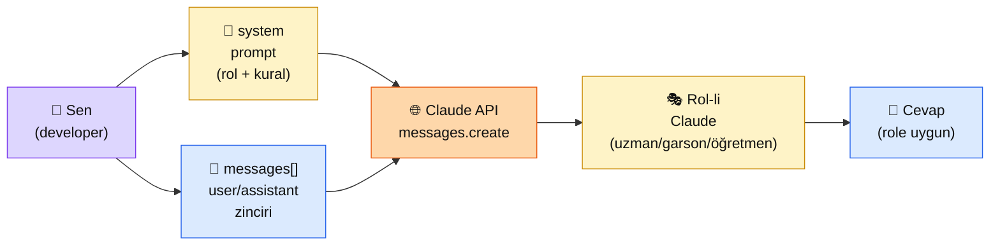

# 2.4 Sistem ve Kullanıcı Promptu

<div class="ma-meta" markdown>
<div class="ma-meta-row" markdown>
<strong>Kim için:</strong>
<span class="ma-persona ma-persona-baslangic">🟢 başlangıç</span>
<span class="ma-persona ma-persona-is">🔵 iş</span>
<span class="ma-persona ma-persona-kisisel">🟣 kişisel</span>
</div>
<div class="ma-meta-row"><strong>📋 Önkoşul:</strong> 2.1 + 2.2 + 2.3 bitmiş; Python + API anahtarı çalışıyor</div>
<div class="ma-meta-row"><strong>🎯 Çıktı:</strong> Claude'a sistem prompt ile "rol/kişilik" verirsin (örn: "kibar müşteri destek", "tarih uzmanı"); XML tag'leriyle yapılandırılmış prompt yazarsın; çoklu turlu sohbet kurarsın.</div>
</div>

!!! tip "Yabancı kelime mi gördün?"
    Bu sayfadaki **italik-altı çizili** ifadelerin (system prompt, XML tag, role gibi) üstüne mouse'unu getir — kısa tanım çıkar. Mobilde dokun.

## Neden bu sayfa?

2.3'e kadar Claude'a "ne yapsın" söyledin: "şehir öner", "merhaba de". Ama "kim olarak yapsın"ı söylemedin. Default Claude **kibar bir asistan**. İş projende belki "ciddi bir hukuk uzmanı" lazım, kişisel projende belki "samimi bir arkadaş" lazım. Bu fark `system` prompt ile kurulur.

İkincisi: Aynı kullanıcı sorusuna **iki farklı sistem prompt** iki tamamen farklı cevap üretir. Bu en güçlü ayar düğmesi — temperature'dan da güçlü. **Doğru sistem prompt = projenin yarısı.**

Üçüncüsü: Anthropic prompt'u nasıl yapılandırırsa Claude o kadar iyi anlar. **XML tag'leri** Anthropic'in en sevdiği yapılandırma — eğitim verisinde XML çok geçtiği için Claude tag'leri "anlam sınırı" olarak görüyor. Bu tekniği bilmek = çıktı kalitesini %20-40 artırmak.

## Sistem prompt kısaca — üç paragraf, matematiksiz

**Sistem prompt = Claude'a verilen rol/talimat seti.** Kullanıcı mesajından önce gelir, kullanıcıya görünmez (UI'da). Claude her cevap üretirken bu rolü hatırlar. "Sen bir hukuk uzmanısın, sadece Türk Borçlar Kanunu çerçevesinde cevap ver" → Claude artık fizik sorusu sorulsa bile "uzmanlık alanım dışında" der.

**Kullanıcı promptu = anlık soru/talep.** `messages` listesinde `{"role": "user", "content": "..."}` olarak gelir. Sistem prompt sabit kalır, kullanıcı promptu her çağrıda değişir. Bir chatbot'ta kullanıcı 100 mesaj atarsa, 100 farklı user mesajı + tek sistem prompt çağrılır.

**XML tag'leri içeriği "kapsayıcı"larla ayırır.** `<task>...</task>`, `<context>...</context>`, `<example>...</example>` gibi. Claude eğitim verisinde XML'i çok gördüğü için tag'leri "burada bitti, başka bir şey başlıyor" sinyali olarak çok iyi okur. Markdown başlıkları da iş görür ama XML daha keskin sınır.

## Bu sayfanın ekosistemi — kim kime ne veriyor

<div class="ma-ekosistem" markdown>
<div class="ma-ekosistem-header">🗺️ Ekosistem — sistem promptun rol kurması</div>



<table class="ma-aktorler" markdown>

| Düğüm | Nerede | Ne iş yapıyor |
|---|---|---|
| 👤 **Sen** | Python kod | Sistem promptu tasarlıyor (rol + kural + format) + kullanıcı mesajını topluyor |
| 📜 **system prompt** | API çağrısının `system` parametresi | Claude'a "kim olduğunu" söyler. UI'da kullanıcıya gösterilmez |
| 💬 **messages[]** | API çağrısının `messages` parametresi | user/assistant turlarının zinciri. Sohbet history'sini taşır |
| 🌐 **Claude API** | api.anthropic.com | Sistem + history + son user mesajını alır, role uygun cevap üretir |
| 🎭 **Rol-li Claude** | Modelin davranışı | Sistem promptun belirlediği kişilikle yanıt verir |
| 💬 **Cevap** | `response.content[0].text` | Role + soruya uygun çıktı |

</table>
</div>

## Uygulama — iki yol

### Yol A — Tek tur, sistem prompt rol değişimi

```python
import anthropic

client = anthropic.Anthropic()

ROL_KIBAR_GARSON = """Sen bir Türk lokantasının kibar bir garsonusun.
- Müşteriye "buyrun efendim" gibi nazik hitaplar kullan
- Yemek önerirken 2-3 alternatif sun
- Kısa ve sıcak konuş, akademik dil yok
- Kendi adın "Mustafa Bey"; gerekirse tanıt"""

ROL_TARIH_UZMANI = """Sen Osmanlı tarihinde uzman bir akademisyensin.
- Cevaplarında tarih (yıl), kişi adı ve birincil kaynak adı geç
- "Sanırım" "galiba" gibi belirsiz ifadeler kullanma; bilmediğin şeye "kaynaklarda yok" de
- Gerektiğinde 2-3 cümlelik ek bağlam ver
- Modern siyasi yorum yapma"""

KULLANICI = "Bana iyi bir öneride bulun, gerçekten merak ediyorum."

for rol_adi, sistem in [("Kibar garson", ROL_KIBAR_GARSON),
                        ("Tarih uzmanı", ROL_TARIH_UZMANI)]:
    print(f"\n{'='*50}")
    print(f"🎭 ROL: {rol_adi}")
    print('='*50)

    cevap = client.messages.create(
        model="claude-sonnet-4-6",
        max_tokens=300,
        system=sistem,
        messages=[{"role": "user", "content": KULLANICI}],
    )
    print(cevap.content[0].text)
```

**Beklenen davranış:**

```
==================================================
🎭 ROL: Kibar garson
==================================================
Buyrun efendim, hoş geldiniz! Bugün size birkaç önerim var:
- Mantı tabağımız özellikle güzel...
- Karnıyarık severseniz bugünün spesyali...
...

==================================================
🎭 ROL: Tarih uzmanı
==================================================
Hangi konuda öneri istediğinizi belirtirseniz daha net olabilirim...
[uzman tonunda cevap]
```

**Burada olan nedir (diyagram referansı):** Aynı `KULLANICI` mesajı, iki farklı `system` promptla iki farklı kişilikten geçti. Diyagramdaki **🎭 Rol-li Claude** düğümü her seferinde başka bir şahsiyetle çıktı verdi.

### Yol B — XML tag'lerle yapılandırılmış prompt + çoklu tur

```python
import anthropic

client = anthropic.Anthropic()

SISTEM = """Sen bir mali müşavir asistanısın.
Kullanıcının vergi sorularına yardımcı oluyorsun.

Cevap kuralların:
- Yanıtını her zaman <ozet>, <detay>, <uyari> XML tag'leriyle yapılandır
- <ozet>: 1 cümle ana cevap
- <detay>: 3-5 cümle açıklama, ilgili kanun maddesi varsa belirt
- <uyari>: Hukuki kararlarda mutlaka bir mali müşavire danışmasını hatırlat
- Hiçbir zaman tag'leri atla — boş bile olsa <uyari></uyari> yaz"""

# Sohbet history — birden fazla tur
mesajlar = [
    {"role": "user", "content": "Serbest meslek kazancımdan ne kadar gelir vergisi öderim?"},
    {"role": "assistant", "content": "<ozet>Türkiye'de serbest meslek kazancı 2026'da %15-40 arası dilimli vergiye tabidir.</ozet>\n<detay>GVK md.65-68 serbest meslek kazancını düzenler. Yıllık beyan dilimleri (2026 değerleriyle): 0-110.000 TL %15, 110.000-230.000 %20, 230.000-580.000 %27, 580.000-1.900.000 %35, 1.900.000+ %40.</detay>\n<uyari>Kesin tutar için bir mali müşavire danışın — istisnalar ve gider düşümleri sonucu değiştirebilir.</uyari>"},
    {"role": "user", "content": "İstisna olarak ne düşebilirim?"},
]

cevap = client.messages.create(
    model="claude-sonnet-4-6",
    max_tokens=500,
    system=SISTEM,
    messages=mesajlar,
)

print(cevap.content[0].text)
```

**Beklenen davranış:** Cevap aynı XML formatında gelir — Claude sistem promptu hatırlar ve önceki turdaki örneği takip eder. Çoklu turda **history kayma** olmaz: 2. user mesajı 1. cevaba referans verir ("İstisna olarak..."), Claude bağlamı zaten görür.

**Burada olan nedir (diyagram referansı):** `messages[]` listesi 3 elemanlı (user → assistant → user). Sistem promptu sabit kalır. Claude tüm history'yi yeniden okur, son user mesajına XML formatında cevap verir.

### XML tag tasarım kuralları (Anthropic önerisi)

| Senaryo | Önerilen tag'ler |
|---|---|
| **Görev tanımı** | `<task>...</task>` veya `<instructions>...</instructions>` |
| **Kullanıcı verisi enjekte etme** | `<document>...</document>` veya `<context>...</context>` |
| **Few-shot örnekler** | `<example>...</example>` (her örnek ayrı tag) |
| **Beklenen format** | `<format>...</format>` |
| **Output yapısı** | `<answer>`, `<reasoning>`, `<sources>` gibi sonuç tag'leri |

**Önemli not:** Tag isimleri **anlamlı + tutarlı** olsun. `<x>...</x>` çalışır ama `<sql_sorgusu>...</sql_sorgusu>` daha iyi — Claude tag adından bile bağlam çıkarır.

<div class="ma-anthropic-oz" markdown>
<div class="ma-anthropic-oz-header">📖 Anthropic bu konuyu nasıl anlatıyor — öz</div>

Anthropic bu konuda **çok güçlü dokümantasyon** üretti — sistem prompt + XML tag'leri Anthropic'in eğitim disipliniyle birlikte gelişti.

**1. Sistem prompt = "rol verme yeri".** Anthropic resmi tavsiyesi: kişilik, kural, format, kısıt → hepsini sistem prompt'a koy. User mesajına sadece o anki soru gelsin. Bu ayrım Claude'un odaklanmasını kolaylaştırır.

**2. XML tag'leri Claude'da özellikle iyi çalışır.** Anthropic eğitim verilerinde XML çok geçtiği için Claude tag'leri "kesin sınır" olarak görür. Diğer LLM'lerde de çalışır ama Claude'da etkisi en yüksek.

**3. Sistem prompt + caching kombinasyonu.** Uzun sistem promptları (1024+ token) cache edilebilir — `cache_control` ekleyerek. Bu durumda her çağrıda sistem prompt yeniden gönderilse bile cache'den okunur, ~%90 ucuzlar. 2.2'de gördüğümüz fatura patlamasının çözümü budur.

??? info "Teknik detay — isteyene (parameter adları, mekanikler, edge case'ler)"

    **`system` parametresi tipi.** İki seçenek: (a) string — basit kullanım; (b) liste of `{type: "text", text: "...", cache_control: {...}}` — caching kullanmak istediğinde.

    **Sistem prompt yer kuralı.** `system` `messages.create()` çağrısının ayrı parametresidir, `messages` listesinin içine konmaz. Bazı kütüphaneler `messages[0].role = "system"` formatını kullanır (OpenAI tarzı) — Anthropic SDK bunu KABUL ETMEZ, ayrı `system=` ister.

    **Conversation history limit.** `messages` dizisinin uzunluğu context window ile sınırlı (Sonnet 4.x: 200K token). Çok uzun sohbette eski mesajlar manuel kesilmeli (sliding window) veya özetlenmeli (summarization).

    **Assistant prefill tekniği.** Son `messages[]` öğesi `{"role": "assistant", "content": "..."}` ise, Claude bu metni **devam ettirir** (yeni mesaj başlatmaz). `<answer>` ile başlayan prefill koymak Claude'u XML formatına zorlamak için güçlü teknik.

    **Empty system prompt.** `system=""` veya parametre verilmezse default Anthropic asistanı davranışı (Constitutional AI eğitimine göre). Boş bırakmak güvenlidir; sadece rol/format gerektiğinde doldur.

    **Multi-modal içerikte sistem prompt.** Görsel içeren mesajlarda sistem prompt görsel için ayrı yorumlanır — "bu görsele şu açıdan bak" talimatı sistem promptta etkili. Bölüm 7'de detay.

<div class="ma-anthropic-oz-kaynak" markdown>
**Kaynak:** [docs.claude.com — Use XML tags to structure your prompts](https://docs.claude.com/en/docs/build-with-claude/prompt-engineering/use-xml-tags) (EN, ~10 dk). XML tasarım kuralları + örnekler. Pekiştirme: [System Prompts](https://docs.claude.com/en/docs/build-with-claude/prompt-engineering/system-prompts) — sistem prompt iyi pratikleri.
</div>
</div>

<div class="ma-cikti-kaniti" markdown>
### 📦 Bu sayfayı bitirdiğini nasıl kanıtlarsın

#### 1. 📝 Refleksiyon yazısı — 5 dakika

> "Sistem prompt deneyi yaptım. [Garson rolü / Tarih uzmanı / kendi rolüm] ile aynı kullanıcı sorusuna [şu] farklı cevaplar geldi. XML tag'leriyle yapılandırılmış prompt'um [çalıştı / kısmen çalıştı], en iyi tag adlandırmam [şu] oldu. Kendi projem için sistem promptum [şöyle] olacak."

Kaydet: `muhendisal-notlarim/bolum-2/04-sistem-prompt/refleksiyon.txt`

#### 2. 📸 Ekran görüntüsü — 3 dakika

**Neyin görüntüsü:** Yol A çıktısı — iki farklı rolde Claude'un cevap farkı net görünüyor.

| OS | Kısayol |
|---|---|
| Windows | `Win + Shift + S` |
| Mac | `Cmd + Shift + 4` |
| Linux | `Shift + PrtScr` |

Kaydet: `muhendisal-notlarim/bolum-2/04-sistem-prompt/roller-cikti.png`

#### 3. 💻 Kendi rolünü tasarla + Gist — 10 dakika

Kendi projen için bir sistem prompt tasarla (en az 5 satır + 2-3 XML tag formatı). Yol B kodunu uyarlayıp 3 farklı user sorusuyla test et. Çıktıları + sistem promptu [gist.github.com](https://gist.github.com)'a yükle.

Gist linkini kaydet: `muhendisal-notlarim/bolum-2/04-sistem-prompt/kendi-rolum-gist.txt`

</div>

<div class="ma-neden-sonuc" markdown>
<div class="ma-neden-sonuc-header">🔗 Birlikte okuma — neden ne oldu</div>

- **A → B:** Claude eğitildiği veride **insan-AI sohbet rolleri** çok geçtiği için "rol" kavramına çok duyarlı.
- **B → C:** Sistem prompt = rolü tek bir yerde keskin tanımlamak; user mesajına serpiştirmekten **5 kat etkili.**
- **C → D:** XML tag'leri Claude'un eğitim verisinde **bağlam sınırı** olarak işaretlenmiş — tag'leri görünce odağını yeniler.
- **D → E:** `messages[]` listesi sıralı bağlamı taşır; Claude history'i otomatik okur — sen state yönetmiyorsun.
- **E → F:** Doğru sistem prompt + iyi XML yapı = **prompt yazma işinin yarısı.** Geri kalan yarısı few-shot ve CoT (2.5).

<div class="ma-neden-sonuc-sonuc" markdown>
**Sonuç:** "Bot saçma cevap veriyor" şikâyetlerinin %60'ı sistem prompt eksikliği veya kötü yapılandırma. Sıcaklığı ayarlamak küçük tornavida; sistem prompt **ana yapıyı** kuran çekiç. Bu sayfadan sonra bot davranışını "tasarlıyorsun", umut etmiyor.
</div>
</div>

<div class="ma-sonraki" markdown>
<div class="ma-sonraki-header">➡️ Sonraki adım</div>

**[2.5 Few-shot ve Chain-of-Thought →](05-few-shot-cot.md)** — Sistem promptu kurdun. Şimdi Claude'a "şu örneklere benzer şekilde cevapla" demek. Few-shot prompting ne, "adım adım düşün" ne zaman çalışır ne zaman boş yere token harcar.

← [2.3 Sıcaklık ve Sampling](03-sampling.md) &nbsp;|&nbsp; [Bölüm 2 girişi](index.md) &nbsp;|&nbsp; [Ana sayfa](../index.md)

**Pekiştirme:** Aynı kullanıcı sorusuna **3 farklı sistem prompt** yazıp dene — örn: "kibar garson", "ciddi avukat", "samimi arkadaş". Cevap tonu nasıl değişiyor gör. Sıcaklık 0.7'de tut.
</div>
