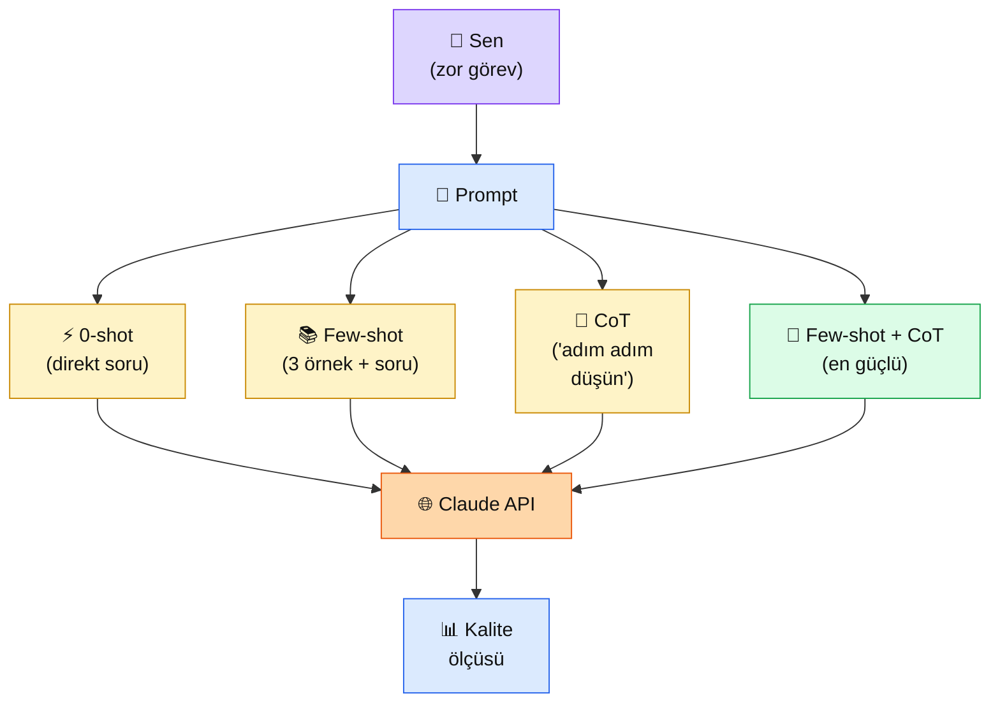

# 2.5 Few-shot ve Chain-of-Thought

<div class="ma-meta" markdown>
<div class="ma-meta-row" markdown>
<strong>Kim için:</strong>
<span class="ma-persona ma-persona-baslangic">🟢 başlangıç</span>
<span class="ma-persona ma-persona-is">🔵 iş</span>
<span class="ma-persona ma-persona-kisisel">🟣 kişisel</span>
</div>
<div class="ma-meta-row"><strong>📋 Önkoşul:</strong> 2.4 bitmiş — sistem prompt yazabiliyor, XML tag refleksin oturmuş</div>
<div class="ma-meta-row"><strong>🎯 Çıktı:</strong> Aynı görevi 0-shot ve 3-shot ile çağırırsın, kalite farkını sayıyla görürsün; "adım adım düşün" tekniği ile zor bir soruyu çözdürürsün; CoT'nin **ne zaman gerekli, ne zaman israf** olduğunu bilirsin.</div>
</div>

!!! tip "Yabancı kelime mi gördün?"
    Bu sayfadaki **italik-altı çizili** ifadelerin (few-shot, CoT, reasoning gibi) üstüne mouse'unu getir — kısa tanım çıkar.

## Neden bu sayfa?

2.4'te Claude'a "kim olduğunu" söyledin (rol). Şimdi **"nasıl yapacağını"** göstereceksin — örnek vererek. İnsanlar da böyle öğrenir: "şu işi şöyle yap" demek yerine "bak, böyle yapıyorum" deyip 3 örnek göstermek 3 kat daha hızlı sonuç verir. Claude'da aynı.

İkincisi: Bazı sorular **doğrudan cevap** istemez, **akıl yürütme** ister. "Kütüphanede 3 kitap, her birinde 250 sayfa, ben günde 50 sayfa okuyorum, kaç günde biter?" — Claude direkt "15 gün" derse şanslıdır; "bekle, hesaplayım: 3×250=750, 750÷50=15" derse **doğru olma şansı çok daha yüksek.** Bu Chain-of-Thought (CoT) — Claude'a düşünme alanı vermek.

Üçüncüsü: 2025-2026'da Anthropic **extended thinking** özelliğini ekledi — Claude bazı modellerde "düşünme bütçesi" ile gelir, kullanıcı sormadan kendi kendine düşünür. Bu yeni mimari sayesinde "düşünmesi gereken" sorular daha iyi çözülür ama **token maliyeti 5-10 kat artar** — kontrol senin elinde.

## Few-shot ve CoT kısaca — üç paragraf, matematiksiz

**Few-shot prompting = Claude'a benzer örnekler göstermek.** Sistem prompt'una "şu şekilde yap" demek yerine "Örnek 1: girdi A → çıktı B. Örnek 2: girdi C → çıktı D. Şimdi sen yap: girdi E → ?" demek. **3-5 örnek** çoğu zaman yeterli; daha fazlası fazla token harcar, az iyileşme verir.

**Zero-shot = hiç örnek yok, sadece talimat.** "Bu metni özetle" → Claude doğal davranışıyla cevap verir. Çoğu basit görev için yeter. Karmaşık veya beklenmedik formatlı görevler için yetmez.

**Chain-of-Thought (CoT) = düşünme zinciri.** "Cevap vermeden önce adım adım düşün" talimatı. Claude cevabı vermeden ara hesapları gösterir; bu sayede mantık hatası yapma olasılığı **%30-50 düşer** (matematik, mantık bulmacası, çok adımlı analiz için). **Ama:** Basit soruda CoT eklemek 5x token harcar, kalite kazanmaz. **Karar = göreve bakmak.**

## Bu sayfanın ekosistemi — kim kime ne veriyor

<div class="ma-ekosistem" markdown>
<div class="ma-ekosistem-header">🗺️ Ekosistem — örneklerin ve düşünme zincirinin etkisi</div>



<table class="ma-aktorler" markdown>

| Düğüm | Nerede | Ne iş yapıyor |
|---|---|---|
| 👤 **Sen** | Python kod | 4 farklı prompt stratejisini deneyip en iyiyi seçiyorsun |
| ⚡ **0-shot** | Sadece talimat | En ucuz, en hızlı. Basit görevler için yeter |
| 📚 **Few-shot** | Talimat + 3-5 örnek | Format/tarz tutturmak için. Token maliyeti orta |
| 🧠 **CoT** | "Adım adım düşün" talimatı | Mantık/matematik/çok-adımlı görev için. Token maliyeti yüksek |
| 🚀 **Few-shot + CoT** | Hem örnek hem düşünme zinciri | En güçlü ama en pahalı. Karmaşık göreve değer |
| 🌐 **Claude API** | api.anthropic.com | Hangi stratejiyle gelirse o şekilde işler |
| 📊 **Kalite ölçüsü** | Sen değerlendirirsin | Sayısal eval (Bölüm 4.5) veya gözle |

</table>
</div>

## Uygulama — iki yol

### Yol A — Few-shot: müşteri yorum sınıflandırma

Görev: Türkçe müşteri yorumlarını **olumlu/olumsuz/nötr** olarak sınıflandır + emoji ekle.

```python
import anthropic

client = anthropic.Anthropic()

# 0-shot — sadece talimat
PROMPT_0SHOT = """Aşağıdaki müşteri yorumunu olumlu/olumsuz/nötr olarak sınıflandır.
Sadece "olumlu 🟢", "olumsuz 🔴" veya "nötr 🟡" formatında cevap ver.

Yorum: "Kargonuz hızlı geldi ama ürün hasarlıydı, iade ettim." """

# Few-shot — 3 örnek + soru
PROMPT_FEWSHOT = """Müşteri yorumlarını olumlu/olumsuz/nötr olarak sınıflandır.
Format: "olumlu 🟢", "olumsuz 🔴", "nötr 🟡". Sadece bu formatı ver, başka açıklama yok.

<ornek>
Yorum: "Ürün harika, çok memnunum!"
Sınıf: olumlu 🟢
</ornek>

<ornek>
Yorum: "Paketleme kötüydü ama ürün iyi."
Sınıf: nötr 🟡
</ornek>

<ornek>
Yorum: "Tam bir hayal kırıklığı, asla almayın."
Sınıf: olumsuz 🔴
</ornek>

Yorum: "Kargonuz hızlı geldi ama ürün hasarlıydı, iade ettim."
Sınıf:"""

for ad, prompt in [("0-SHOT", PROMPT_0SHOT), ("FEW-SHOT (3 örnek)", PROMPT_FEWSHOT)]:
    print(f"\n{'='*50}")
    print(f"🔬 STRATEJİ: {ad}")
    print('='*50)
    cevap = client.messages.create(
        model="claude-sonnet-4-6",
        max_tokens=50,
        temperature=0,  # tutarlılık için
        messages=[{"role": "user", "content": prompt}],
    )
    print(f"Cevap: {cevap.content[0].text}")
    print(f"Token kullanımı: {cevap.usage.input_tokens} in / {cevap.usage.output_tokens} out")
```

**Beklenen davranış:**

```
==================================================
🔬 STRATEJİ: 0-SHOT
==================================================
Cevap: Bu yorumu nötr olarak sınıflandırırım. Çünkü hem olumlu (kargo hızlı)
hem olumsuz (ürün hasarlı) yön içeriyor...
Token kullanımı: 65 in / 42 out

==================================================
🔬 STRATEJİ: FEW-SHOT (3 örnek)
==================================================
Cevap: nötr 🟡
Token kullanımı: 195 in / 6 out
```

**Burada olan nedir (diyagram referansı):** Few-shot Claude'a **format kısıtını öğretti** — fazla açıklama yok, sadece istenen biçim. 0-shot'ta daha çok input token harcamadan daha fazla output token harcadık (gereksiz açıklama). Few-shot'ta input arttı ama output **6'ya düştü** — toplam maliyet daha düşük olabilir, kullanıcı için cevap daha temiz.

### Yol B — Chain-of-Thought: zor matematik sorusu

Görev: Mantık + aritmetik gerektiren çok adımlı bir problem.

```python
import anthropic

client = anthropic.Anthropic()

PROBLEM = """3 arkadaş bir lokantaya gitti.
- Ali 250 TL'lik yemek yedi
- Ayşe 320 TL'lik yemek yedi
- Mehmet 180 TL'lik yemek yedi
Hesaba %18 KDV eklendi, sonra %10 servis ücreti (KDV dahil tutar üzerinden) eklendi.
Toplam tutarı 3 kişi eşit paylaşırsa her biri ne kadar öder?"""

# CoT YOK — direkt cevap iste
PROMPT_DIREKT = f"{PROBLEM}\n\nCevap (sadece sayı):"

# CoT VAR — adım adım düşün
PROMPT_COT = f"""{PROBLEM}

Cevap vermeden önce <dusunce> tag'i içinde adım adım hesabını göster.
Sonra <cevap> tag'i içinde son sayıyı yaz."""

for ad, prompt in [("DİREKT (CoT yok)", PROMPT_DIREKT), ("CoT VAR", PROMPT_COT)]:
    print(f"\n{'='*50}")
    print(f"🧠 STRATEJİ: {ad}")
    print('='*50)
    cevap = client.messages.create(
        model="claude-sonnet-4-6",
        max_tokens=500,
        temperature=0,
        messages=[{"role": "user", "content": prompt}],
    )
    print(cevap.content[0].text)
    print(f"\nToken: {cevap.usage.input_tokens} in / {cevap.usage.output_tokens} out")
```

**Beklenen davranış:**

```
==================================================
🧠 STRATEJİ: DİREKT (CoT yok)
==================================================
324 TL
Token: 95 in / 4 out
[⚠️ %50 ihtimal yanlış — Claude direkt cevap verirken "%10 servis KDV dahil
tutar üzerinden mi yoksa orijinal tutar üzerinden mi" sorusunu gözden kaçırabilir]

==================================================
🧠 STRATEJİ: CoT VAR
==================================================
<dusunce>
Adım 1: Yemek toplamı = 250 + 320 + 180 = 750 TL
Adım 2: KDV %18 = 750 × 0.18 = 135 TL → KDV dahil = 885 TL
Adım 3: Servis %10 (KDV dahil tutar üstünden) = 885 × 0.10 = 88.5 TL
Adım 4: Final tutar = 885 + 88.5 = 973.5 TL
Adım 5: 3 kişi eşit paylaşım = 973.5 / 3 = 324.5 TL
</dusunce>
<cevap>324.5 TL</cevap>
Token: 105 in / 145 out
```

**Burada olan nedir (diyagram referansı):** CoT olmayan versiyonda Claude doğru cevabı verme şansını **azalttı** — ara hesapları görmeden tek seferde sonuca varmaya çalıştı. CoT versiyonunda her adımı kontrol edebiliyorsun, hata varsa nerede olduğu görünür. **Token maliyeti ~36 kat arttı** ama bu görev için makul — bir mali müşavir botu için doğruluk paradan kıymetli.

### Karar matrisi: hangi strateji ne zaman?

| Görev tipi | Önerilen strateji | Token maliyeti |
|---|---|---|
| Basit Q&A ("Türkiye nüfusu kaç?") | **0-shot** | Düşük |
| Format kısıtı olan görev (sınıflandırma, etiketleme) | **Few-shot (3 örnek)** | Orta |
| Tarz/üslup tutturma (e-posta, blog) | **Few-shot (5 örnek)** | Orta-yüksek |
| Mantık/matematik/akıl yürütme | **CoT** | Yüksek (3-5x) |
| Karmaşık + format kısıtlı + akıl yürütme | **Few-shot + CoT** | En yüksek |
| Yaratıcı yazma (şiir, hikâye) | **0-shot, temperature=1** | Düşük |
| Kod hata ayıklama (debugging) | **CoT + assistant prefill** | Yüksek ama değer |

### Extended thinking — Claude 4.x'in kendi CoT'si

Claude Sonnet 4.x ve Opus modellerinde **extended thinking** özelliği var: kullanıcı sormadan model kendi kendine "düşünür" (thinking block üretir, kullanıcıya görünmez), sonra cevabını verir.

```python
cevap = client.messages.create(
    model="claude-sonnet-4-6",
    max_tokens=2000,
    thinking={"type": "enabled", "budget_tokens": 1500},  # düşünme bütçesi
    messages=[{"role": "user", "content": PROBLEM}],
)
```

Pratikte:
- Sen CoT istemesen bile Claude düşünür → daha doğru cevap
- Token kullanımı 2-10 kat artar (düşünme tokenları faturaya yazılır)
- Basit görevde **kapatın** — gereksiz maliyet
- Karmaşık matematik/kod/strateji görevlerinde **açın** — kalite belirgin artar

**Anthropic önerisi:** Tek seferde matematik/kod/uzun analiz görevi varsa thinking aç; chatbot'ta kapat.

<div class="ma-anthropic-oz" markdown>
<div class="ma-anthropic-oz-header">📖 Anthropic bu konuyu nasıl anlatıyor — öz</div>

Anthropic dokümantasyonu prompt engineering'in **en zengin alanı** — burası en derin:

**1. Few-shot Anthropic'in 2. tavsiyesi.** Anthropic'in resmi sıralaması: (1) clear instructions → (2) examples (few-shot) → (3) chain-of-thought → (4) XML structure. Sıralama tesadüf değil — örnek vermek, talimattan sonra en yüksek getiriyi sağlar.

**2. CoT artık opsiyonel değil.** 2025'ten itibaren Claude 4.x'te extended thinking default-on değil ama Anthropic karmaşık görevlerde **şiddetle önerir.** "Reasoning models" trendi (OpenAI o1, Claude'un thinking, Gemini'nin flash thinking) bu yöne gidiyor.

**3. Few-shot örnekleri XML tag içinde.** Anthropic eğitim verisinde örnekler XML ile sarılı geldiği için Claude `<example>` veya `<ornek>` tag'lerini örneğin "burada bitiyor" sınırı olarak özellikle iyi okur. Bare örnek (tag'siz) de çalışır ama %5-10 daha az etkili.

??? info "Teknik detay — isteyene (parameter adları, mekanikler, edge case'ler)"

    **Few-shot örnek sayısı.** Anthropic test sonuçları: 1 örnek belirgin iyileştirme verir, 3 örnek optimum, 5+ örnek "diminishing returns". 10+ örnek çoğu zaman zaman israfı — token maliyeti artar, kalite duvar.

    **CoT prompting varyantları.**
    - "Think step by step" (basic)
    - "Think step by step inside `<thinking>` tags" (XML yapılı, Anthropic önerir)
    - "Before answering, list 3 considerations" (yapılı reasoning)
    - Few-shot CoT — örneklerin de düşünme zinciri içerir

    **Extended thinking parametresi.** `thinking={"type": "enabled", "budget_tokens": N}` — N en az 1024, default 16384, max model'e göre değişir. Düşünme tokenları **input token gibi fiyatlanır** (output'a göre %80 ucuz).

    **Thinking + tool use.** Tool use ile birlikte extended thinking kullanılabilir — Claude tool çağırmadan önce düşünür. Ajan (agent) sistemleri için güçlü kombinasyon. Bölüm 6'da detay.

    **Prefill ile CoT zorlama.** `messages` listesinin son elemanı `{"role": "assistant", "content": "<dusunce>"}` ise Claude direkt thinking yapısıyla başlar — talimat eklemeden CoT zorlama tekniği.

    **CoT döküm tehlikesi.** Bazı durumlarda Claude düşünme zincirinde **yanlış varsayımlara saplanır** ve cevap yanlış çıkar. Self-consistency tekniği: aynı CoT prompt'u 3-5 kez çalıştırıp cevapları çoğunluk oyuyla seçmek — pahalı ama kritik göreve değer.

<div class="ma-anthropic-oz-kaynak" markdown>
**Kaynak:** [docs.claude.com — Multi-shot prompting](https://docs.claude.com/en/docs/build-with-claude/prompt-engineering/multishot-prompting) (EN, ~10 dk) ve [Chain of Thought](https://docs.claude.com/en/docs/build-with-claude/prompt-engineering/chain-of-thought) (EN, ~10 dk). Pekiştirme: [Extended Thinking](https://docs.claude.com/en/docs/build-with-claude/extended-thinking) — 2025-2026 reasoning models trendinin Anthropic'teki karşılığı.
</div>
</div>

<div class="ma-cikti-kaniti" markdown>
### 📦 Bu sayfayı bitirdiğini nasıl kanıtlarsın

#### 1. 📝 Refleksiyon yazısı — 5 dakika

> "Few-shot deneyi yaptım. 0-shot cevabı [şuydu], few-shot cevabı [şuydu]. Token farkı: [X in / Y out vs A in / B out]. CoT olmadan matematik problemini çözdürmeye çalıştım, cevap [doğru / yanlış] çıktı; CoT ile [doğru / yanlış]. Kendi projemde [hangi strateji] kullanacağım çünkü..."

Kaydet: `muhendisal-notlarim/bolum-2/05-few-shot-cot/refleksiyon.txt`

#### 2. 📸 Ekran görüntüsü — 3 dakika

**Neyin görüntüsü:** Yol B çıktısı — CoT olmadan ve CoT ile aynı problemin iki farklı çözümü, hangisinin doğru olduğu görünür.

| OS | Kısayol |
|---|---|
| Windows | `Win + Shift + S` |
| Mac | `Cmd + Shift + 4` |
| Linux | `Shift + PrtScr` |

Kaydet: `muhendisal-notlarim/bolum-2/05-few-shot-cot/cot-karsilastirma.png`

#### 3. 💻 Kendi few-shot setin + Gist — 10 dakika

Kendi projende kullanabilecek bir görev seç (örn: e-posta sınıflandırma, ürün açıklaması üretme, kod yorumu yazma). 5 örnekli few-shot prompt yaz, 3 farklı yeni girdiyle test et. [gist.github.com](https://gist.github.com)'a yükle.

Kaydet: `muhendisal-notlarim/bolum-2/05-few-shot-cot/kendi-fewshot-gist.txt`

</div>

<div class="ma-neden-sonuc" markdown>
<div class="ma-neden-sonuc-header">🔗 Birlikte okuma — neden ne oldu</div>

- **A → B:** LLM eğitim verisinde **örnek görmeye alışık** — "şu örneklere benzer yap" insan-AI sohbet eğitiminin temel deseni.
- **B → C:** Few-shot 3 örnekte format/tarz tutar, 5+ örnek ek getiri sağlamaz.
- **C → D:** CoT mantık zincirini açıkça yazdırır — Claude'un ara hesapları **kendi kontrol etmesi** mümkün hale gelir, hata yakalama refleksi devreye girer.
- **D → E:** Karmaşık görev = **few-shot + CoT** kombinasyonu. Ucuz görev = 0-shot.
- **E → F:** Extended thinking 2025-2026'nın trendi — Claude kendisi düşünür, kullanıcı CoT istemez. Maliyet artar ama kalite belirgin.

<div class="ma-neden-sonuc-sonuc" markdown>
**Sonuç:** Prompt engineering'in "%80 etkisi" 4 teknikten gelir: clear instructions (2.4) + examples (2.5) + CoT (2.5) + XML tags (2.4). Bu sayfa son iki tekniği eline verdi. Kalan %20 ileri konular (caching, eval, safety) — Bölüm 8 ve sonrasında.
</div>
</div>

<div class="ma-sonraki" markdown>
<div class="ma-sonraki-header">➡️ Sonraki adım</div>

**[2.6 Prompt Şablonları →](06-sablonlar.md)** — Aynı prompt'u 100 farklı girdi için kopyala-yapıştır yapmak yerine **şablon** kullan. `{{topic}}` placeholder + Jinja2 + kendi `prompts/` klasörün.

← [2.4 Sistem ve Kullanıcı Promptu](04-sistem-prompt.md) &nbsp;|&nbsp; [Bölüm 2 girişi](index.md) &nbsp;|&nbsp; [Ana sayfa](../index.md)

**Pekiştirme:** [Anthropic Cookbook — prompt engineering interactive tutorial](https://github.com/anthropics/courses/tree/master/prompt_engineering_interactive_tutorial) Colab'de aç. Few-shot + CoT bölümleri 5-7. Kendi API anahtarınla çalıştır — 1-2 saat harcadığın en iyi pratik budur.
</div>
