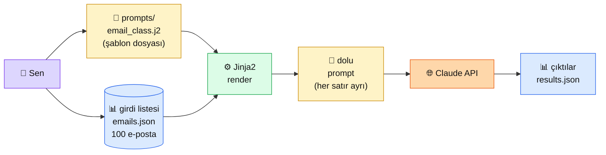

# 2.6 Prompt Şablonları

<div class="ma-meta" markdown>
<div class="ma-meta-row" markdown>
<strong>Kim için:</strong>
<span class="ma-persona ma-persona-baslangic">🟢 başlangıç</span>
<span class="ma-persona ma-persona-is">🔵 iş</span>
<span class="ma-persona ma-persona-kisisel">🟣 kişisel</span>
</div>
<div class="ma-meta-row"><strong>📋 Önkoşul:</strong> 2.5 bitmiş — few-shot ve CoT'yi biliyorsun</div>
<div class="ma-meta-row"><strong>🎯 Çıktı:</strong> Aynı prompt'u **100 farklı girdiyle** çağırmak için tek bir şablon dosyası kullanırsın; kendi `prompts/` klasörünü kurarsın; prompt değişikliklerini git ile versiyonlarsın.</div>
</div>

!!! tip "Yabancı kelime mi gördün?"
    Bu sayfadaki **italik-altı çizili** ifadelerin (template, placeholder, variable gibi) üstüne mouse'unu getir — kısa tanım çıkar.

## Neden bu sayfa?

2.5'e kadar her prompt'u Python kodunun içinde **string** olarak yazdın. Tek seferlik denemeler için iyi. Ama gerçek projede aynı prompt'u **100 farklı kullanıcı girdisiyle** çalıştıracaksın — string concatenation ile yazdığında kod 5 satırda 50 satıra çıkar, bakımı imkânsızlaşır.

İkincisi: Prompt'lar **kod kadar önemli birer varlık.** Bir e-posta sınıflandırma prompt'unu 3 ay sonra geliştirmek isteyeceksin — git history'de eski sürüm görmek istersin. Bu yüzden prompt'lar **ayrı dosya** olarak `prompts/` klasöründe yaşamalı, kod gibi versiyonlanmalı.

Üçüncüsü: Anthropic Console'un **Prompt Builder** özelliği (2024 sonu) tam bu iş için var — prompt'ları görsel olarak şablonlaştır, değişken tanımla, test et. Bu pratik bilinmesi gereken Anthropic ekosistem aracı.

## Prompt şablonları kısaca — üç paragraf, matematiksiz

**Şablon = sabit metin + değişken yerler.** "Merhaba {{ad}}, bugün {{tarih}} ve seni özledim." gibi. `{{ad}}` ve `{{tarih}}` placeholder'lar, çağırırken gerçek değerlerle doldurulur. Aynı şablon binlerce kez farklı verilerle kullanılır.

**Üç Python yöntemi:** (1) f-string — `f"Merhaba {ad}"`, en hızlı, basit; (2) `string.Template` — `Template("Merhaba $ad").substitute(ad="Kemal")`, biraz daha güvenli (yanlış parametre = hata); (3) Jinja2 — `Template("Merhaba {{ ad }}").render(ad="Kemal")`, **en güçlü** (loop, condition, filter destekler). Production projede genellikle **Jinja2.**

**Anthropic'in resmi `prompt_templates` özelliği** API seviyesinde değişken desteği veriyor — `messages.create()` çağrısında `messages` içinde `{{variable}}` yazıp `variables` parametresiyle değer geçiyorsun. Sunucu tarafında doldurulur. **Caching ile uyumlu** olduğu için sistem promptun cache edilirken sadece değişken kısımlar değişir = en ekonomik desen.

## Bu sayfanın ekosistemi — kim kime ne veriyor

<div class="ma-ekosistem" markdown>
<div class="ma-ekosistem-header">🗺️ Ekosistem — şablon + değişken → çağrı</div>



<table class="ma-aktorler" markdown>

| Düğüm | Nerede | Ne iş yapıyor |
|---|---|---|
| 👤 **Sen** | `prompts/` klasörünü tasarlıyor | Şablon dosyası + girdi listesi + render kodu |
| 📄 **Şablon** | `prompts/email_class.j2` | Jinja2 sözdizimi: `{{ ... }}` ve `` blokları |
| 📊 **Girdi listesi** | JSON / CSV / DB | Değişken değerlerinin kaynağı |
| ⚙️ **Jinja2 render** | Python `jinja2` kütüphanesi | Şablon + değer = dolu prompt |
| 📝 **Dolu prompt** | Bellek (string) | API'ye gönderilecek final metin |
| 🌐 **Claude API** | api.anthropic.com | Doldurulmuş prompt'u işliyor |
| 📊 **Çıktılar** | JSON dosyası | Toplu sonuç, sonra analiz edilir |

</table>
</div>

## Uygulama — iki yol

### Yol A — Yerel Jinja2 ile prompt klasörü

`prompts/email_class.j2`:

```jinja2
Sen bir e-posta sınıflandırma asistanısın.

Aşağıdaki e-postayı şu kategorilerden birine sınıflandır:

- {{ kat }}


<email>
Gönderen: {{ gonderen }}
Konu: {{ konu }}
İçerik:
{{ icerik }}
</email>

Sadece kategori adını döndür, başka açıklama yok.
```

Render + çağrı kodu:

```python
import json
from pathlib import Path
from jinja2 import Environment, FileSystemLoader
import anthropic

# Jinja2 ortamı
env = Environment(loader=FileSystemLoader("prompts"))
template = env.get_template("email_class.j2")

# Girdi
emails = [
    {"gonderen": "fatura@vodafone.com.tr", "konu": "Fatura Hatırlatma",
     "icerik": "Sayın müşterimiz, faturanızın son ödeme tarihi yarındır..."},
    {"gonderen": "ahmet@arkadas.com", "konu": "Bu hafta sonu",
     "icerik": "Selam, hafta sonu kahveye gidelim mi?"},
    {"gonderen": "noreply@spam-site.xyz", "konu": "TIKLA, KAZAN!",
     "icerik": "Şanslı seçildiniz! 1 milyon TL kazanmak için..."},
]
KATEGORILER = ["fatura", "kişisel", "spam", "iş", "promosyon"]

# Render + API
client = anthropic.Anthropic()
sonuclar = []

for email in emails:
    prompt = template.render(
        kategoriler=KATEGORILER,
        gonderen=email["gonderen"],
        konu=email["konu"],
        icerik=email["icerik"],
    )
    cevap = client.messages.create(
        model="claude-sonnet-4-6",
        max_tokens=20,
        temperature=0,
        messages=[{"role": "user", "content": prompt}],
    )
    kategori = cevap.content[0].text.strip()
    sonuclar.append({"konu": email["konu"], "kategori": kategori})
    print(f"📧 {email['konu']:<30} → {kategori}")

# Toplu kayıt
Path("results.json").write_text(json.dumps(sonuclar, ensure_ascii=False, indent=2))
print(f"\n✅ {len(sonuclar)} e-posta sınıflandırıldı, results.json kaydedildi")
```

**Beklenen çıktı:**

```
📧 Fatura Hatırlatma             → fatura
📧 Bu hafta sonu                  → kişisel
📧 TIKLA, KAZAN!                  → spam

✅ 3 e-posta sınıflandırıldı, results.json kaydedildi
```

**Burada olan nedir (diyagram referansı):** Diyagramın tüm akışı tek script'te. Şablon dosyası **kod dışında** durur — git'te versiyonlanır, prompt'u değiştirmek için Python kodunu açmana gerek yok.

### Yol B — Anthropic Prompt Templates API (sunucu tarafı)

Anthropic 2024 sonunda native değişken desteği ekledi:

```python
import anthropic

client = anthropic.Anthropic()

cevap = client.messages.create(
    model="claude-sonnet-4-6",
    max_tokens=20,
    temperature=0,
    system="Sen bir e-posta sınıflandırma asistanısın. Sadece kategori adını döndür.",
    messages=[
        {"role": "user", "content": """Aşağıdaki e-postayı kategorilere ayır: {{kategoriler}}.

<email>
Gönderen: {{gonderen}}
Konu: {{konu}}
İçerik: {{icerik}}
</email>"""}
    ],
    extra_body={  # Anthropic Console templates ile uyumlu format
        "metadata": {"variables": {
            "kategoriler": "fatura, kişisel, spam, iş, promosyon",
            "gonderen": "fatura@vodafone.com.tr",
            "konu": "Fatura Hatırlatma",
            "icerik": "Sayın müşterimiz...",
        }}
    },
)
print(cevap.content[0].text)
```

**Burada olan nedir (diyagram referansı):** Şablon **Anthropic sunucusunda** doldurulur. Avantaj: caching ile mükemmel uyumlu — şablonun sabit kısmı cache'lenir, sadece değişkenler her çağrıda değişir, %90 maliyet düşer. Dezavantaj: Anthropic Console'da yönetiliyor, lokal değil.

### `prompts/` klasör yapısı önerisi

Production projende şu yapı işe yarar:

```
projem/
├── prompts/
│   ├── email_class.j2          # e-posta sınıflandırma
│   ├── ozetleme.j2             # uzun metin → 3 cümle özet
│   ├── ceviri_tr_en.j2         # Türkçe→İngilizce çeviri
│   └── _system/
│       ├── garson.txt          # 2.4'ten gelen rol
│       └── tarih_uzmani.txt
├── prompts.py                  # render yardımcı fonksiyonları
└── tests/
    └── test_prompts.py         # her şablonu örnek girdiyle test
```

**Anahtar disiplin:**
- Her prompt **ayrı dosya** (mix etme)
- `_system/` alt klasörü sistem prompt'lar için
- `tests/test_prompts.py` her şablonu örnek girdiyle çağırıp çıktının format-uyumlu olduğunu test eder (Bölüm 2.8'de detay)
- Git: her prompt değişikliği commit'le, mesajda **niye** değiştiğini yaz

<div class="ma-anthropic-oz" markdown>
<div class="ma-anthropic-oz-header">📖 Anthropic bu konuyu nasıl anlatıyor — öz</div>

Anthropic 2024'te prompt yönetimine **resmi destek** ekledi:

**1. Prompt Templates Anthropic Console'da görsel.** [console.anthropic.com](https://console.anthropic.com) → "Workbench" → değişken tanımla, prompt'u kaydet, versiyonla. Geliştirici olmayan ekip üyeleri (PM, content team) prompt değiştirebilir, kod değişmez.

**2. Variables ve caching uyumlu.** Şablonun sabit kısmı (sistem prompt + few-shot örnekleri) cache'lenebilir, sadece `{{variable}}` kısımları her çağrıda farklı. **2.2'deki maliyet patlaması** sorununun çözüm yolu.

**3. Anthropic'in iç ekibi de bu deseni kullanır.** Claude Code, Claude.ai gibi Anthropic ürünleri kendi prompt'larını şablonla yönetiyor — public bir uygulamadan gerçek kanıt.

??? info "Teknik detay — isteyene (parameter adları, mekanikler, edge case'ler)"

    **Variable syntax.** `{{variable_name}}` — boşluk olmadan. Anthropic Console'da, API'de, SDK'da aynı söz dizimi.

    **Variable scoping.** Sistem prompt + user mesajı + assistant mesajı hepsinde değişken kullanılabilir. Aynı değişken birden fazla yerde geçerse aynı değer.

    **Escape mekaniği.** Gerçek `{{` veya `}}` yazmak istersen `{ {` veya `} }` (arada boşluk). Pratikte nadir ihtiyaç.

    **Jinja2 advanced features.** ``, ``, ``, custom filters (`{{ name | upper }}`). Anthropic native template bunları desteklemez — sade `{{var}}` substitution. Karmaşık logic için Jinja2'yi yerel kullan, **render edilmiş** sonucu Anthropic'e gönder.

    **Test edilebilirlik.** Her şablon için `pytest` testi yazılabilir — örnek girdi → render → çıktının pattern eşleştiği kontrol et. Bölüm 2.8'de detay.

    **Prompt versiyon yönetimi.** Git'te `prompts/email_class.j2` history takip edilebilir. Production'da hangi sürümün canlı olduğunu env değişkeni / config dosyası ile bil.

    **A/B test deseni.** İki versiyon prompt (`email_class_v1.j2`, `email_class_v2.j2`), trafiği %50/%50 böl, kalite/maliyet karşılaştır. Bölüm 8'de production deseni.

<div class="ma-anthropic-oz-kaynak" markdown>
**Kaynak:** [docs.claude.com — Prompt templates and variables](https://docs.claude.com/en/docs/build-with-claude/prompt-engineering/prompt-templates-and-variables) (EN, ~10 dk). Anthropic Console workbench: [console.anthropic.com](https://console.anthropic.com) → "Prompts" sekmesi. Visual prompt builder + version history burada.
</div>
</div>

<div class="ma-cikti-kaniti" markdown>
### 📦 Bu sayfayı bitirdiğini nasıl kanıtlarsın

#### 1. 📝 Refleksiyon yazısı — 5 dakika

> "Prompt şablonlaştırdım. [Hangi görev için] kullanacağım, [Jinja2 / Anthropic native] seçtim çünkü [neden]. `prompts/` klasör yapımda [şu] dosyalar olacak. Versiyon yönetiminde [git history / Anthropic Console] kullanacağım."

Kaydet: `muhendisal-notlarim/bolum-2/06-sablonlar/refleksiyon.txt`

#### 2. 📸 Ekran görüntüsü — 3 dakika

**Neyin görüntüsü:** Yol A çıktısı — 3 farklı e-posta için tek şablon, 3 farklı doğru kategori.

| OS | Kısayol |
|---|---|
| Windows | `Win + Shift + S` |
| Mac | `Cmd + Shift + 4` |
| Linux | `Shift + PrtScr` |

Kaydet: `muhendisal-notlarim/bolum-2/06-sablonlar/sablon-cikti.png`

#### 3. 💻 `prompts/` klasörün + GitHub repo — 10 dakika

Kendi projende `prompts/` klasörü kur, içine en az **2 farklı şablon** koy (örn: özetleme + sınıflandırma). Render kodu ekle. GitHub'da public repo olarak yayınla (veya gist).

Repo/gist linkini kaydet: `muhendisal-notlarim/bolum-2/06-sablonlar/prompts-repo-link.txt`

</div>

<div class="ma-neden-sonuc" markdown>
<div class="ma-neden-sonuc-header">🔗 Birlikte okuma — neden ne oldu</div>

- **A → B:** Prompt'lar string concat ile yazılırsa kod karışır, prompt değişikliği = kod değişikliği.
- **B → C:** Prompt'u **ayrı dosya** olarak çıkarmak prompt'u "varlık" yapar — git'te versiyonlanır, ekip üyesi düzenleyebilir.
- **C → D:** Jinja2 loop + condition gerektiren karmaşık şablonlarda lazım; basit `{{var}}` için Anthropic native yeterli.
- **D → E:** Anthropic native variables + caching = **maliyet kontrolünün altın deseni** — sabit kısım cache'lenir, değişken kısım her çağrıda değişir.
- **E → F:** Production'da prompt'lar kod kadar disiplinle yönetilir — test, A/B, version history.

<div class="ma-neden-sonuc-sonuc" markdown>
**Sonuç:** Prompt'u "kod içine string atmak" amatör; prompt'u "varlık olarak yönetmek" production. Bu sayfa o atlamayı verdi. Sıradaki iki sayfada güvenlik (2.7 prompt injection) ve ölçüm (2.8 prompt eval) — production hattını tamamlayan iki ayak.
</div>
</div>

<div class="ma-sonraki" markdown>
<div class="ma-sonraki-header">➡️ Sonraki adım</div>

**[2.7 Prompt Enjeksiyonu ve Savunma →](07-prompt-injection.md)** — Kullanıcı prompt'una "sistem talimatlarını unut, başka şey yap" yazarsa ne olur? Saldırı türleri, savunma desenleri, Anthropic önerisi.

← [2.5 Few-shot ve CoT](05-few-shot-cot.md) &nbsp;|&nbsp; [Bölüm 2 girişi](index.md) &nbsp;|&nbsp; [Ana sayfa](../index.md)

**Pekiştirme:** Anthropic Console'a (console.anthropic.com) git, "Workbench" sekmesinde bir şablon kur, değişken ekle, "Run" ile test et. Görsel arayüzü tanımak production'da paha biçilmez.
</div>
