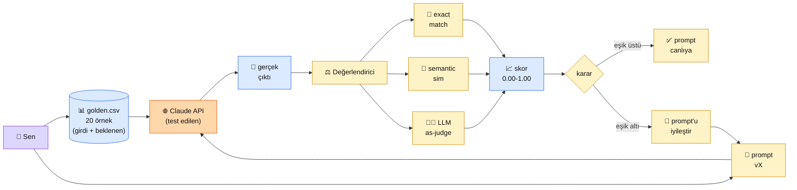

# 2.8 Prompt Test ve Değerlendirme

<div class="ma-meta" markdown>
<div class="ma-meta-row" markdown>
<strong>Kim için:</strong>
<span class="ma-persona ma-persona-baslangic">🟢 başlangıç</span>
<span class="ma-persona ma-persona-is">🔵 iş</span>
<span class="ma-persona ma-persona-kisisel">🟣 kişisel</span>
</div>
<div class="ma-meta-row"><strong>⏱️ Süre:</strong> ~30 dakika</div>
<div class="ma-meta-row"><strong>📋 Önkoşul:</strong> 2.6 prompt şablonları + 2.7 güvenlik bitmiş; `prompts/` klasörün var</div>
<div class="ma-meta-row"><strong>🎯 Çıktı:</strong> Kendi promptun için **20 örneklik golden dataset** hazırlarsın; `pytest` stili prompt testleri yazarsın; LLM-as-judge ile otomatik skor alırsın; prompt değişikliklerinin **kaliteyi düşürüp yükseltmediğini** sayıyla bilirsin.</div>
</div>

!!! tip "Yabancı kelime mi gördün?"
    Bu sayfadaki **italik-altı çizili** ifadelerin (eval, judge, golden dataset gibi) üstüne mouse'unu getir — kısa tanım çıkar.

## Neden bu sayfa?

Senaryo: Prompt'unu geliştirdin, 3 örneğe baktın, "güzel cevap geliyor" dedin, canlıya verdin. Bir hafta sonra kullanıcılar şikayet: "Bot saçma cevap veriyor." Sen? **Emin değilsin.** Çünkü "kaliteyi" ölçmüyordun, **umuyordun**. Bu sayfa umudu sayıya çevirir.

İkincisi: **Prompt değişikliği = deploy.** Sistem promptunu bir kelime değiştirdiğinde aslında production davranışını değiştiriyorsun. Kod'da unit test olmadan deploy yapmak nasıl tehlikeli ise, **prompt'ta eval olmadan değişiklik yapmak aynı tehlike.** Eval = prompt'un "CI/CD test suite'i".

Üçüncüsü: **Anthropic 2024'te bu konuya büyük yatırım yaptı** — Console'da "Evaluate" sekmesi, [anthropic-evals](https://github.com/anthropics/evals) public repo, docs/test-and-evaluate tam bir kategori. Bu "olgun AI development" iş akışının temel ayağı — ve en çok atlanıyor. Sen atlama.

## Prompt eval kısaca — üç paragraf, matematiksiz

**Golden dataset = "doğru cevabı bildiğin" örnek seti.** 20-50 satır: her satırda (girdi, beklenen çıktı, beklenen kategori) üçlüsü. Sen prompt'unu bu sete karşı çalıştırırsın, Claude'un ürettiği çıktıyı beklenen ile karşılaştırırsın. **Küçük ama dikkatli kurulmuş 20 örnek**, rastgele toplanmış 200 örnekten daha değerlidir — her satırı sen elle seçmişsin ve doğru cevabı biliyorsun.

**3 değerlendirme yöntemi, zorluk sırasına göre:** (1) **Exact match** — çıktı birebir beklenenle aynı mı (sınıflandırma, kısa etiketleme için ideal); (2) **Semantic similarity** — embedding ile iki metin arasındaki anlam benzerliği (0-1 skor, Bölüm 3'teki embedding'lerle); (3) **LLM-as-judge** — ikinci bir Claude çağrısı "bu cevap iyi mi?" diye soruluyor, 1-10 skor döndürüyor (en güçlü, en pahalı).

**Test-driven prompt development (TDPD) = prompt'u eval'dan önce yazma.** Önce 20 golden örneği kur, istediğin kalite eşiğini belirle (örn: "en az %85 doğruluk"), sonra prompt'u yaz ve eşiği geçene kadar **iteration yap.** Prompt'u bir kere değiştirip "herhalde iyi oldu" yerine, 20 örneklik sete karşı çalıştır, skoru 0.72'den 0.81'e çıktı mı **sayıyla gör.**

## Bu sayfanın ekosistemi — kim kime ne veriyor

<div class="ma-ekosistem" markdown>
<div class="ma-ekosistem-header">🗺️ Ekosistem — golden dataset → eval → karar</div>



<table class="ma-aktorler" markdown>

| Düğüm | Nerede | Ne iş yapıyor |
|---|---|---|
| 👤 **Sen** | Test kodu + golden CSV | 20 örneği elle kurar, kalite eşiği belirler, iteration yapar |
| 📊 **golden.csv** | `tests/golden.csv` | `girdi,beklenen_cikti,kategori` sütunları. Kutsal dosya — kolayca değişmez |
| 📝 **prompt vX** | `prompts/email_class.j2` | Versiyonlanmış prompt. Her değişiklikte eval çalışır |
| 🌐 **Claude API** | api.anthropic.com | Test subject — gerçek çağrı yapılır |
| 💬 **Gerçek çıktı** | API cevabı | Beklenen ile karşılaştırılacak |
| ⚖️ **Değerlendirici** | Python fonksiyonu | 3 metot'tan birini veya kombinasyon seçer |
| 🎯 **Exact match** | `actual == expected` | En ucuz. Sınıflandırma/etiketleme için |
| 🧮 **Semantic sim** | Embedding cosine | Anlam eşleşmesi. Bölüm 3'te detay |
| 🧑‍⚖️ **LLM-as-judge** | İkinci Claude çağrısı | En güçlü, en pahalı. Serbest formlu cevaplar için |
| 📈 **Skor** | 0.00 - 1.00 arası float | Eşiğe karşı karşılaştırılır (örn: 0.85) |
| ✅ **Deploy** | Production | Eşik geçildi → prompt canlıya |
| 🔄 **Iteration** | Geri | Eşik geçilmedi → prompt revize, tekrar eval |

</table>
</div>

## Uygulama — iki yol

### Yol A — Google Sheets ile manuel eval (kod yok)

Pratik bir başlangıç — ekip üyesi olmayan biri bile yapabilir:

1. Google Sheets'te yeni dosya: **"Prompt Eval — Email Classifier v1"**
2. Sütunlar: `#`, `Girdi (e-posta)`, `Beklenen Kategori`, `Gerçek Cevap`, `Doğru mu?`, `Not`
3. 20 satır gerçek veri: çeşitli e-posta örnekleri (fatura, kişisel, spam, iş, promosyon her biri 4'er)
4. `Beklenen Kategori` sütununu **elle doldur** (ground truth)
5. Anthropic Console'a git, her e-postayı prompt'a ver, cevabı `Gerçek Cevap` sütununa yapıştır
6. `Doğru mu?` sütunu: `=IF(C2=D2, 1, 0)`
7. Alt hücrede toplam: `=SUM(E2:E21)/20` → senin **doğruluk skorun**

**Beklenen sonuç:** İlk denemede 14/20 (0.70). Prompt'u revize et, yeni sheet sekmesi aç ("v2"), tekrar çalıştır. 18/20 (0.90). **Şimdi sayıyla** biliyorsun — v2 daha iyi.

**Burada olan nedir (diyagram referansı):** Golden dataset = el ile kurduğun 20 satır. Exact match = `C2=D2` formülü. Skor = SUM / 20. Iteration = yeni sekme. Hepsi sheets'te, kod yok, 45 dakika.

### Yol B — Python + pytest + LLM-as-judge

Production projede otomasyon gerek. Dosya yapısı:

```
projem/
├── prompts/
│   └── email_class.j2
├── tests/
│   ├── golden.csv         # 20 satır
│   └── test_email_class.py
└── eval.py                # ana eval script
```

`tests/golden.csv`:

```csv
girdi,beklenen_kategori
"Sayın müşterimiz faturanızın son ödeme tarihi...",fatura
"Selam, hafta sonu kahveye gidelim mi?",kişisel
"ŞANSLI SEÇİLDİNİZ! Milyon TL kazandınız!!!",spam
"Toplantı yarın 14:00'te, gündem ektedir.",iş
...20 satır...
```

`eval.py`:

```python
import csv
from pathlib import Path
from jinja2 import Environment, FileSystemLoader
import anthropic

client = anthropic.Anthropic()
env = Environment(loader=FileSystemLoader("prompts"))
template = env.get_template("email_class.j2")


# ---------- 1. Exact match değerlendirici ----------
def exact_match(actual: str, expected: str) -> float:
    return 1.0 if actual.strip().lower() == expected.strip().lower() else 0.0


# ---------- 2. LLM-as-judge değerlendirici ----------
JUDGE_PROMPT = """Sen bir değerlendirici asistansın.
Bir AI modelinin cevabı verilecek. Cevabın beklenen cevaba ne kadar 
uygun olduğunu 0-10 arası puanla.

Puanlama kriteri:
- 10: Cevap tam doğru, beklenen kategoriyle eşleşiyor
- 7-9: Küçük fark var ama anlamca doğru
- 4-6: Kısmen doğru, bazı sınıflandırma hataları
- 0-3: Yanlış kategori

SADECE bir sayı döndür, başka hiçbir şey yazma.

<beklenen>{beklenen}</beklenen>
<gercek>{gercek}</gercek>

Puan:"""


def llm_as_judge(actual: str, expected: str) -> float:
    cevap = client.messages.create(
        model="claude-haiku-4-5-20251001",  # ucuz + hızlı judge
        max_tokens=10,
        temperature=0,
        messages=[{"role": "user", "content": JUDGE_PROMPT.format(
            beklenen=expected, gercek=actual
        )}],
    )
    try:
        puan = int(cevap.content[0].text.strip())
        return puan / 10.0  # 0-1 aralığına normalize
    except ValueError:
        return 0.0


# ---------- 3. Ana eval döngüsü ----------
def eval_prompt(prompt_version: str = "v1"):
    KATEGORILER = ["fatura", "kişisel", "spam", "iş", "promosyon"]
    sonuclar = []

    with open("tests/golden.csv", encoding="utf-8") as f:
        reader = csv.DictReader(f)
        for i, row in enumerate(reader, 1):
            prompt = template.render(
                kategoriler=KATEGORILER,
                gonderen="n/a",
                konu="n/a",
                icerik=row["girdi"],
            )
            cevap = client.messages.create(
                model="claude-sonnet-4-6",
                max_tokens=20,
                temperature=0,
                messages=[{"role": "user", "content": prompt}],
            )
            actual = cevap.content[0].text.strip().lower()
            expected = row["beklenen_kategori"].strip().lower()

            skor_exact = exact_match(actual, expected)
            skor_judge = llm_as_judge(actual, expected)

            sonuclar.append({
                "id": i,
                "girdi": row["girdi"][:40] + "...",
                "beklenen": expected,
                "gercek": actual,
                "exact": skor_exact,
                "judge": skor_judge,
            })
            print(f"#{i:2d} {expected:12s} → {actual:12s}  "
                  f"exact={skor_exact:.1f}  judge={skor_judge:.2f}")

    toplam_exact = sum(r["exact"] for r in sonuclar) / len(sonuclar)
    toplam_judge = sum(r["judge"] for r in sonuclar) / len(sonuclar)
    print(f"\n{'='*60}")
    print(f"📊 PROMPT {prompt_version} SONUÇLARI ({len(sonuclar)} örnek):")
    print(f"   Exact match  : {toplam_exact:.2%}")
    print(f"   LLM-as-judge : {toplam_judge:.2%}")
    print(f"{'='*60}")
    return {"exact": toplam_exact, "judge": toplam_judge}


if __name__ == "__main__":
    eval_prompt("v1")
```

**Beklenen çıktı:**

```
# 1 fatura       → fatura       exact=1.0  judge=1.00
# 2 kişisel      → kişisel      exact=1.0  judge=1.00
# 3 spam         → spam         exact=1.0  judge=1.00
# 4 iş           → iş           exact=1.0  judge=1.00
# 5 promosyon    → spam         exact=0.0  judge=0.60
# 6 fatura       → fatura       exact=1.0  judge=1.00
...
#20 iş           → iş           exact=1.0  judge=1.00

============================================================
📊 PROMPT v1 SONUÇLARI (20 örnek):
   Exact match  : 85.00%
   LLM-as-judge : 91.50%
============================================================
```

**Burada olan nedir (diyagram referansı):** Script tüm ekosistemi (golden + prompt + Claude + 2 judge + skor) tek runda çalıştırdı. Exact match (%85) sıkı metrik — kategori adı birebir eşleşmeli. LLM-as-judge (%91.5) yumuşak — "spam ile promosyon çok yakın, %60 kabul edilebilir" diyor. İkisini birden raporlamak genellikle en doğrusu.

### Pytest-style prompt testi

CI/CD'de her pull request'te otomatik çalıştırmak için:

```python
# tests/test_email_class.py
import pytest
from eval import eval_prompt

def test_prompt_v1_kalite_esigi():
    sonuc = eval_prompt("v1")
    assert sonuc["exact"] >= 0.85, f"Exact match eşiğin altında: {sonuc['exact']:.2%}"
    assert sonuc["judge"] >= 0.90, f"Judge skoru eşiğin altında: {sonuc['judge']:.2%}"
```

GitHub Actions'ta `.github/workflows/prompt-test.yml` ile her push'ta çalışır. Prompt'u bozmayı zorlaştıran güvenlik ağı.

### 4 metrik, 4 kullanım

| Metrik | Zorluk | Maliyet | Ne zaman |
|---|---|---|---|
| **Exact match** | En kolay | ~$0 | Sınıflandırma, kategori, etiket, yes/no |
| **Substring match** | Kolay | ~$0 | Cevabın içinde belli bir kelime geçmeli |
| **Semantic similarity** | Orta | Embedding ücreti | Serbest formlu ama kısa cevaplar (özet, tanım) |
| **LLM-as-judge** | En güçlü | Haiku ile ~$0.001/örnek | Uzun serbest cevaplar, subjektif kalite (ton, nezaket) |

**Anthropic önerisi:** Tek metrik tuzağına düşme — exact + judge ikilisi çoğu görev için yeterli. Critical production'da her ikisini de raporla.

<div class="ma-anthropic-oz" markdown>
<div class="ma-anthropic-oz-header">📖 Anthropic bu konuyu nasıl anlatıyor — öz</div>

Anthropic 2024'te eval'ı dokümantasyonun **merkez sütunlarından biri** haline getirdi:

**1. Define & Evaluate Success = Anthropic'in ilk prompt engineering adımı.** Dokümantasyondaki sıralama: (a) başarı kriterini tanımla → (b) eval setini kur → (c) prompt'u yaz. Çoğu insan (b)'yi atlar — Anthropic bunu "en sık yapılan hata" olarak not eder.

**2. Anthropic Console'da Evaluate sekmesi.** [console.anthropic.com](https://console.anthropic.com) → "Evaluate" → görsel eval builder. Test case'leri UI'dan ekle, prompt versiyonlarını karşılaştır, skor tablosu görsel. Geliştirici olmayan ekip üyesi (PM, content) eval koşabilir.

**3. LLM-as-judge'ı Claude için Haiku ile yap.** Anthropic resmi tavsiyesi: Sonnet'i test ederken judge olarak Haiku kullan (ucuz + hızlı + yeterince akıllı). Opus'u Sonnet'le judge etme — bias olur.

??? info "Teknik detay — isteyene (parameter adları, mekanikler, edge case'ler)"

    **Anthropic Evals repo.** [github.com/anthropics/evals](https://github.com/anthropics/evals) — Anthropic'in eval framework'ü + hazır eval setleri (coding, math, reasoning). Kendi projende Anthropic'in deseni + hazır setlerden parçaları alabilirsin.

    **Holistic eval = meta.** Tek tek örneklere bakmak yerine **dağılıma** bak: hangi kategoride hata çok, hangi uzunluk grubunda hata yoğun. Confusion matrix + bucket analizi. Bu seviye ileri ama production'da zorunlu.

    **Inter-judge agreement.** LLM-as-judge'ın güvenilirliği? Anthropic önerir: aynı örneği 3 kez judge'a ver, skorlar tutarlı mı? Tutarsızsa judge prompt'u muğlak demektir, revize et. Production'da her 100 örnekten 10'u double-check olarak 2. judge'a gitsin.

    **Eval dataset pollution.** Golden dataset'ini prompt optimize ederken kullanırsan, prompt'u "golden'a overfit" edersin — production'da başarısız olur. Çözüm: golden'ı **train + holdout** olarak böl (15 train + 5 holdout). Holdout'u ara sıra çalıştır.

    **Continual eval.** Production logs'tan her hafta 20 yeni örnek topla, manuel etiketle, golden'a ekle. Eval seti **yaşayan** bir varlık. 6 ay sonra golden'ın 200+ satıra çıkmış olmalı.

    **A/B test vs eval.** Eval = offline (prod'a çıkmadan). A/B test = online (prod'da iki prompt'u paralel canlıda, kullanıcı davranışını karşılaştır). İkisi farklı — Bölüm 8.3 A/B detay.

<div class="ma-anthropic-oz-kaynak" markdown>
**Kaynak:** [platform.claude.com — Define success criteria](https://platform.claude.com/docs/en/docs/test-and-evaluate/define-success) ve [Develop test cases](https://platform.claude.com/docs/en/docs/test-and-evaluate/develop-tests) (EN, toplam ~20 dk). Anthropic Console Evaluate: [console.anthropic.com](https://console.anthropic.com) → Evaluate sekmesi. Public repo: [github.com/anthropics/evals](https://github.com/anthropics/evals).
</div>
</div>

<div class="ma-cikti-kaniti" markdown>
### 📦 Bu sayfayı bitirdiğini nasıl kanıtlarsın

#### 1. 📝 Refleksiyon yazısı — 5 dakika

> "Eval kurdum. [Hangi görev] için [kaç] örnekli golden dataset hazırladım. İlk prompt skoru [%X] exact + [%Y] judge. Prompt'u [nasıl] revize ettim, skor [%X']+[%Y']'e çıktı. Kendi projem için kalite eşiğimi [%Z] koyacağım çünkü..."

Kaydet: `muhendisal-notlarim/bolum-2/08-test-degerlendirme/refleksiyon.txt`

#### 2. 📸 Ekran görüntüsü — 3 dakika

**Neyin görüntüsü:** Yol B Python çıktısı — 20 örnek × sonuç satırı + alt toplam skor tablosu.

| OS | Kısayol |
|---|---|
| Windows | `Win + Shift + S` |
| Mac | `Cmd + Shift + 4` |
| Linux | `Shift + PrtScr` |

Kaydet: `muhendisal-notlarim/bolum-2/08-test-degerlendirme/eval-cikti.png`

#### 3. 💻 Kendi eval framework + GitHub + Actions — 10 dakika

Kendi projende `tests/golden.csv` (en az 20 satır) + `eval.py` + `tests/test_*.py` pytest kur. GitHub'a push et, [GitHub Actions](https://github.com/features/actions) workflow ekle — her push'ta eval otomatik çalışsın. Yeşil badge README'ye.

Kaydet: `muhendisal-notlarim/bolum-2/08-test-degerlendirme/repo-link.txt`

</div>

<div class="ma-neden-sonuc" markdown>
<div class="ma-neden-sonuc-header">🔗 Birlikte okuma — neden ne oldu</div>

<ol class="ma-neden-sonuc-zincir" markdown>
<li>**Prompt'u 'umut ile' kullanmak = rulet.** Değişiklik kaliteyi yükseltir mi düşürür mü bilemezsin. Bu yüzden **golden dataset ile her değişiklik ölçülür.**</li>
<li>**Golden dataset değişikliğin etkisini ölçülebilir yapar.** 20 örnek başlangıçta yeterli; 50-100 production'da. Bu yüzden **küçük başlanır, büyütülür — sıfırdan 100 örnek gerekmez.**</li>
<li>**Exact match + LLM-as-judge kombinasyonu en sağlamdır.** Tek başına her ikisi de eksik. Bu yüzden **sınıflandırma için exact, serbest cevap için LLM-as-judge.**</li>
<li>**Eval CI/CD'ye girince prompt değişiklikleri kod disiplinine kavuşur.** Kötü prompt merge edilmez. Bu yüzden **production kalitesi otomatik korunur.**</li>
<li>**Production'dan gelen gerçek örnekler eval'ı canlı tutar.** '6 ay önceki golden' bayatlamış olur. Bu yüzden **eval seti düzenli güncellenir, statik değil.**</li>
</ol>

<div class="ma-neden-sonuc-sonuc" markdown>
**Sonuç:** Eval = prompt engineering'in "test" ayağı. Bu ayak olmadan her geliştirme rulet. 2.1-2.8 Bölüm 2'nin 8 sayfası Anthropic API ile güvenli + ölçülü prompt geliştirme hattının temel kurgusunu verdi. Bölüm 3'te artık **Claude'un bilmediği verilerle** — kendi dokümantasyonunla, wiki'nle, notlarınla — cevap vermesini sağlayacağız. Embeddings ve Vector DB dünyasına.
</div>
</div>

<div class="ma-sonraki" markdown>
<div class="ma-sonraki-header">➡️ Sonraki adım</div>

**[Bölüm 3 — Embeddings ve Vector DB →](../bolum-3/index.md)** — Prompt engineering yeter mi? Claude'un bilmediği dokümanlar için Vector DB zorunlu. Embedding nedir, Qdrant ile pratik kurulum, semantic search. RAG'e hazırlık.

← [2.7 Prompt Enjeksiyonu ve Savunma](07-prompt-injection.md) &nbsp;|&nbsp; [Bölüm 2 girişi](index.md) &nbsp;|&nbsp; [Ana sayfa](../index.md)

**Pekiştirme:** Bugün 30 dakika ayır, **kendi projeni için 20 örneklik golden dataset** hazırla. Sonradan eklemek zor — en kritik ilk iş.

**🎓 Bölüm 2 tebrikler:** 8 sayfayı bitirdiysen prompt engineering'in **omurgasını** öğrendin: LLM temelleri, token/maliyet, sampling, sistem prompt + XML, few-shot + CoT, şablonlar, güvenlik, eval. Bu Anthropic ile **production-grade** çalışabilmenin temel eşiği. Senin elinde artık ciddi bir alet takımı var.
</div>
