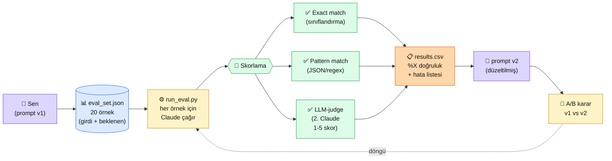

# 2.8 Prompt Test ve Değerlendirme

<div class="ma-meta" markdown>
<div class="ma-meta-row" markdown>
<strong>Kim için:</strong>
<span class="ma-persona ma-persona-baslangic">🟢 başlangıç</span>
<span class="ma-persona ma-persona-is">🔵 iş</span>
<span class="ma-persona ma-persona-kisisel">🟣 kişisel</span>
</div>
<div class="ma-meta-row"><strong>📋 Önkoşul:</strong> 2.7 bitmiş — savunma katmanlarını uyguladın, prompt'larını yazıyorsun</div>
<div class="ma-meta-row"><strong>🎯 Çıktı:</strong> 20 örnekli bir **test seti** kurarsın; prompt'unun doğruluğunu **sayıyla** ölçersin (accuracy / format match / LLM-as-judge); A/B test ile prompt v1 vs v2 karşılaştırırsın; **eval olmadan production deploy etmiyorsun.**</div>
</div>

!!! tip "Yabancı kelime mi gördün?"
    Bu sayfadaki **italik-altı çizili** ifadelerin (eval, accuracy, F1, ground truth gibi) üstüne mouse'unu getir — kısa tanım çıkar. Mobilde dokun.

## Neden bu sayfa?

2.7'ye kadar prompt yazdın, savunma kattın, çalıştırdın. Şu soruyu sormadın: **"Çalışıyor mu? Ne kadar iyi çalışıyor?"** Cevabı bilmiyorsan **bilmiyorsun.** "Bana iyi geldi" sübjektif. "20 testten 18'i geçti" objektif. Production hattı objektif rakam üzerine kurulur.

İkincisi: Prompt'un v1'den v2'ye **iyi mi kötü mü gittiğini** ölçmenin tek yolu eval. "Daha akıcı geliyor" hisle karar vermek = projenin 3 ay sonra geri sarması demek. **Sayı = ilerleme delili.**

Üçüncüsü: Bu sayfa **Bölüm 4.5 RAG eval'inin temelini** kuruyor. RAG'de hem "doğru chunk geldi mi" hem "üretilen cevap doğru mu" iki katmanı ayrı ölçeceksin. O ileri konunun temel disiplini bu sayfadan çıkıyor.

## Eval kısaca — üç paragraf, matematiksiz

**Eval seti = "doğru cevabı önceden bildiğin" 20+ test örneği.** Her örnek `(girdi, beklenen çıktı)` çifti. Prompt'unu bu set üstünde çalıştırıp **kaç tanesinde doğru cevap aldığını** sayıyorsun. 20'de 18 = %90 doğruluk. Sayı somut, karşılaştırılabilir, ilerleme görülebilir.

**3 metrik tipi.** (1) **Exact match** — sınıflandırma için ("spam" vs "ham"); cevap tam eşleşmeli. (2) **Pattern match** — format için ("JSON parse oluyor mu", "regex `\d{2,3}` cümlede var mı"); yapısal kontrol. (3) **LLM-as-judge** — kalite için (özetleme, çeviri, yaratıcı yazma); başka bir Claude'a "bu cevap iyi mi" diye sorar 1-5 skor verirsin. İnsan değerlendirmesi en güvenilir ama **en pahalı** — kritik karar öncesi 50 örnek için kullan.

**A/B test = iki prompt versiyonunu aynı set üstünde çalıştır, kazananı seç.** v1 %78, v2 %85 → v2'yi production'a al, v1'i arşivle. Ama: %78 → %85 değişim **istatistiksel olarak anlamlı mı?** 20 örnekte tek bir flip'in farkı %5 — gürültü olabilir. **100+ örnekli set** karar güvenilirliğini yükseltir, ama küçük başlamak büyük başlamamaktan iyi.

## Bu sayfanın ekosistemi — kim kime ne veriyor

<div class="ma-ekosistem" markdown>
<div class="ma-ekosistem-header">🗺️ Ekosistem — eval seti, çağrı, skorlama</div>



<table class="ma-aktorler" markdown>

| Düğüm | Nerede | Ne iş yapıyor |
|---|---|---|
| 👤 **Sen** | Editör + terminal | Prompt yazıyor, eval setini hazırlıyor, sonuçları okuyor |
| 📊 **eval_set.json** | `tests/eval_data/` klasörü | 20+ örnek `{girdi, beklenen}` çifti — el yazısı veya gerçek user log'larından üretilmiş |
| ⚙️ **run_eval.py** | `tests/` klasörü (pytest uyumlu) | Her örnek için Claude çağrısı yapıyor, çıktıyı topluyor |
| 📐 **Skorlama** | Python kod | Görev tipine göre 3 metrikten en az birini uyguluyor |
| ✅ **Exact match** | `actual == expected` | Sınıflandırma, etiket görevleri için |
| ✅ **Pattern match** | `re.search()`, `json.loads()` try | Format kısıtı olan görevler için |
| ✅ **LLM-judge** | İkinci Claude çağrısı | Yaratıcı/sübjektif görevler için |
| 📋 **results.csv** | `reports/` klasörü | Her örnek için: girdi, beklenen, gerçek, skor, hata |
| 📝 **prompt v2** | `prompts/` klasörü | Hata listesini görüp düzeltilmiş yeni prompt |
| 🔁 **A/B karar** | Sen değerlendiriyorsun | v1 vs v2 toplam skor karşılaştırması |

</table>
</div>

## Uygulama — iki yol

### Yol A — Sınıflandırma görevi için exact match eval

`tests/eval_data/email_class.json`:

```json
[
  {"id": 1, "girdi": "Faturanızın son ödeme tarihi 5 gün sonra dolacaktır.", "beklenen": "fatura"},
  {"id": 2, "girdi": "Selam, bu hafta sonu kahveye gidelim mi?", "beklenen": "kişisel"},
  {"id": 3, "girdi": "ŞANSLI SEÇİLDİNİZ! 1 milyon TL kazandınız!", "beklenen": "spam"},
  {"id": 4, "girdi": "Yarınki toplantı saat 10:00'da, link ekte.", "beklenen": "iş"},
  {"id": 5, "girdi": "Yeni ürünümüzde %30 indirim, kaçırmayın!", "beklenen": "promosyon"},
  {"id": 6, "girdi": "Annem rahatsız, bu hafta köye gidiyorum.", "beklenen": "kişisel"},
  {"id": 7, "girdi": "Vergi dairesinden tebligatınız var, dikkate alın.", "beklenen": "iş"},
  {"id": 8, "girdi": "Tıkla kazan, yarın sona eriyor!", "beklenen": "spam"},
  {"id": 9, "girdi": "Faturanız kesilmiştir, ekte gönderiyoruz.", "beklenen": "fatura"},
  {"id": 10, "girdi": "Düğünümüze davetlisiniz, 15 Mayıs.", "beklenen": "kişisel"}
]
```

`tests/run_eval.py`:

```python
import json
import anthropic
from pathlib import Path
from collections import Counter

client = anthropic.Anthropic()

PROMPT_TEMPLATE = """Aşağıdaki e-postayı şu kategorilerden birine sınıflandır:
fatura, kişisel, spam, iş, promosyon

Sadece kategori adını yaz, başka açıklama yok.

E-posta: {girdi}
Kategori:"""

def claude_cevap(girdi: str) -> str:
    cevap = client.messages.create(
        model="claude-sonnet-4-5",
        max_tokens=20,
        temperature=0,
        messages=[{"role": "user", "content": PROMPT_TEMPLATE.format(girdi=girdi)}],
    )
    return cevap.content[0].text.strip().lower()

# Eval setini yükle
eval_set = json.loads(Path("tests/eval_data/email_class.json").read_text())

# Çalıştır
sonuclar = []
for ornek in eval_set:
    actual = claude_cevap(ornek["girdi"])
    expected = ornek["beklenen"].lower()
    dogru = (actual == expected)
    sonuclar.append({
        "id": ornek["id"],
        "girdi": ornek["girdi"][:50],
        "beklenen": expected,
        "gerçek": actual,
        "doğru": dogru,
    })

# Skorla
toplam = len(sonuclar)
dogru_sayisi = sum(1 for s in sonuclar if s["doğru"])
accuracy = dogru_sayisi / toplam

print(f"\n{'='*60}")
print(f"📊 EVAL RAPORU — Email Sınıflandırma")
print('='*60)
print(f"Toplam örnek:    {toplam}")
print(f"Doğru cevap:     {dogru_sayisi}")
print(f"Accuracy:        %{accuracy*100:.1f}")
print(f"\n❌ Hatalı örnekler:")
for s in sonuclar:
    if not s["doğru"]:
        print(f"  #{s['id']:2d} '{s['girdi']}' → bekliyordu '{s['beklenen']}', aldı '{s['gerçek']}'")

# CSV'ye yaz
import csv
with open("reports/email_class_eval.csv", "w", encoding="utf-8") as f:
    writer = csv.DictWriter(f, fieldnames=sonuclar[0].keys())
    writer.writeheader()
    writer.writerows(sonuclar)
print(f"\n💾 Detay rapor: reports/email_class_eval.csv")
```

**Beklenen çıktı:**

```
============================================================
📊 EVAL RAPORU — Email Sınıflandırma
============================================================
Toplam örnek:    10
Doğru cevap:     9
Accuracy:        %90.0

❌ Hatalı örnekler:
  # 7 'Vergi dairesinden tebligatınız var, dikkate alın.' → bekliyordu 'iş', aldı 'fatura'

💾 Detay rapor: reports/email_class_eval.csv
```

**Burada olan nedir (diyagram referansı):** Tek script tüm pipeline'ı çalıştırdı: eval set → Claude çağrı (10x) → exact match skorlama → CSV rapor. Hata #7 görünür: "vergi dairesi tebligatı" Claude için "fatura" gibi geldi — prompt'a "vergi/yasal yazışmalar = iş kategorisi" örneği eklemek v2 için iyileştirme yönü.

### Yol B — LLM-as-judge ile özet kalitesi ölçme

Sübjektif görev (özetleme) için exact match çalışmaz — başka bir Claude'a "bu özet iyi mi" diye sor.

```python
import anthropic
from pathlib import Path

client = anthropic.Anthropic()

ORIJINAL = """Türkiye'de yapay zeka sektörü 2025-2026 döneminde önemli bir büyüme
yaşadı. Özellikle finansal teknoloji, e-ticaret ve sağlık alanlarında AI destekli
çözümler yaygınlaştı. Yatırım hacmi geçen yıla göre %180 arttı; toplam 8 unicorn
aday startup oluştu. İnsan kaynağı tarafında AI Engineer pozisyonları en çok
aranan 5 teknik rolden biri haline geldi."""

# v1 prompt — basit özet
SUMMARIZER_V1 = "Aşağıdaki metni 1 cümleyle özetle:\n\n{metin}"

# v2 prompt — yapılandırılmış özet
SUMMARIZER_V2 = """Aşağıdaki metni özetle. Özet şu kuralları izlesin:
- 1 cümle (max 30 kelime)
- Ana sayı/yüzde varsa koru
- Tekil isim ve yer adı varsa koru

Metin:
{metin}

Özet:"""

def ozet_uret(prompt_template: str) -> str:
    cevap = client.messages.create(
        model="claude-sonnet-4-5",
        max_tokens=100,
        temperature=0,
        messages=[{"role": "user", "content": prompt_template.format(metin=ORIJINAL)}],
    )
    return cevap.content[0].text.strip()

# 2 versiyondan da çağır
ozet_v1 = ozet_uret(SUMMARIZER_V1)
ozet_v2 = ozet_uret(SUMMARIZER_V2)

# LLM-as-judge — Haiku ile (judge için ucuz model)
JUDGE_PROMPT = """Aşağıdaki orijinal metnin iki farklı özeti var.
Her özeti 5 kritere göre 1-5 arası puanla:
- Doğruluk (orijinaldeki bilgileri yansıtıyor mu)
- Kısalık (gereksiz tekrar var mı)
- Bilgi yoğunluğu (kritik sayıları/isimleri tutmuş mu)
- Akıcılık (Türkçesi düzgün mü)
- Genel kalite

<orijinal>
{orijinal}
</orijinal>

<ozet_v1>
{v1}
</ozet_v1>

<ozet_v2>
{v2}
</ozet_v2>

Çıktı formatı:
v1_skor: [toplam 5-25 arası]
v2_skor: [toplam 5-25 arası]
karar: v1 / v2 / berabere
gerekce: [1 cümle]"""

karar = client.messages.create(
    model="claude-haiku-4-5-20251001",  # judge için ucuz
    max_tokens=300,
    temperature=0,
    messages=[{"role": "user", "content": JUDGE_PROMPT.format(
        orijinal=ORIJINAL, v1=ozet_v1, v2=ozet_v2)}],
).content[0].text

print(f"📝 v1 özeti: {ozet_v1}\n")
print(f"📝 v2 özeti: {ozet_v2}\n")
print(f"⚖️  YARGIÇ KARARI:\n{karar}")
```

**Beklenen çıktı:**

```
📝 v1 özeti: Türkiye'de yapay zeka sektörü 2025-2026'da büyüyerek finans, e-ticaret ve sağlıkta yaygınlaştı.

📝 v2 özeti: Türkiye AI sektörü 2025-2026'da %180 yatırım artışı ve 8 unicorn adayıyla finans, e-ticaret ve sağlıkta büyüdü.

⚖️  YARGIÇ KARARI:
v1_skor: 17
v2_skor: 22
karar: v2
gerekce: v2 kritik sayıları (%180, 8 unicorn) tutmuş, v1 ise sayıları kaybetmiş.
```

**Burada olan nedir (diyagram referansı):** Aynı eval döngüsü ama metrik **LLM-judge.** v2 daha yüksek skor → A/B testi v2 lehine sonuçlandı. Production'da v2 prompt'unu kullan, v1'i arşivle. Maliyet: judge için Haiku (~5x ucuz) seçildi.

### Eval seti tasarım kuralları

| Kural | Niye |
|---|---|
| **Min 20 örnek başlangıç, 100+ olgun** | İstatistiksel anlam için. 20 örnek "yön gösterir", 100 "karar verir" |
| **Edge case dahil et** | Sadece kolay örnek = yanıltıcı yüksek skor. Beklenmedik girdileri (boş, çok uzun, karışık dil) eklemeden olmaz |
| **Real user log'lardan beslen** | Production'a çıktıktan sonra gerçek kullanıcı sorularından eval setini büyüt. En değerli veri burada |
| **Eval setini git'le versiyonla** | `tests/eval_data/` klasörü repo'da. Eval seti büyüdükçe history takip edilebilir |
| **CI/CD'ye bağla** | Her PR'da eval otomatik koşsun. Skor düşerse merge bloklansın. Bölüm 9.3 |
| **Insan eval örneklem** | Her 100 LLM-judge sonucundan 10'unu insan kontrol et — judge bias'ı kaçmasın |

### Anthropic Console "Evals" özelliği

[console.anthropic.com](https://console.anthropic.com) → "Evals" sekmesi (2024 sonu eklendi). Görsel arayüzde:
- Test seti yükle (CSV / JSON)
- Prompt'unu seç
- "Run" → her örnek için Claude çağrılır, sonuç tablosu
- v1 vs v2 yan yana karşılaştır

Geliştirici olmayan ekip üyeleri (PM, content team) bu arayüzde eval yapabilir, kod yazmadan. Production prompt değişikliği öncesi **zorunlu durak.**

<div class="ma-anthropic-oz" markdown>
<div class="ma-anthropic-oz-header">📖 Anthropic bu konuyu nasıl anlatıyor — öz</div>

Anthropic eval konusunda **çok güçlü kaynak üretti** — "evals = production AI'nın yarısı" felsefesi.

**1. Define success criteria önce gelir.** Anthropic dokümantasyonu "promtu yazmadan önce ne demek başarı tanımla" der. Ölçemediğin şeyi iyileştiremezsin. 2.8'in özeti tam bu.

**2. Anthropic Console'un Evals özelliği = native tool.** Üçüncü taraf eval framework'leri (Promptfoo, LangSmith, Braintrust) iyi seçenekler ama Anthropic'in kendisinin native eval arayüzü var, ücretsiz, integrated. Console workflow'u ile birleşik.

**3. LLM-as-judge bilim dalı haline geldi.** Anthropic'in araştırma ekibi judge bias'ları üzerine paper yayınladı: position bias (uzun cevabı tercih etme), familiarity bias (judge kendi tarzına benzeyen cevabı tercih). Çözüm: judge'a kontrol soruları sor, 3-5 kez çalıştır, çoğunluk karar.

??? info "Teknik detay — isteyene (parameter adları, mekanikler, edge case'ler)"

    **Anthropic Console Evals API.** Programatik kullanım için: `client.evals.create(name, dataset_id, prompt_id)`. SDK'da henüz beta — Console'dan başla, API'ye geçiş zamanla.

    **Test seti boyutu vs anlam.** İstatistiksel güç hesabı: %5 farkı %95 güvenle yakalamak için ~400 örnek lazım. Pratikte bu boyut çoğu projede bulunmaz; 100 örnek "iyi tahmin" verir. 20 örnek "yön gösterir."

    **Stratified sampling.** Eval setinde her kategori dengeli temsil edilmeli — 95 spam + 5 ham örneklem yanıltıcı. Dengeli set: kategori başına ~10-20 örnek.

    **Judge model seçimi.** Genel kural: judge **görev modelinden farklı (veya daha güçlü)** olmalı. Aynı modeli judge yapmak self-consistency bias yaratır. Anthropic önerisi: Sonnet üreticiyse Opus judge (veya tersine).

    **Online vs offline eval.** Offline eval (sabit set) prompt değişikliği öncesi. Online eval (canlı user feedback) production sonrası. İkisi de gerekli; offline = hızlı iterasyon, online = gerçek dünya kalibrasyonu.

    **Evaluation drift.** Modelin yeni sürümü gelince (Sonnet 4.5 → Sonnet 4.6) eval skorları değişir. Versiyon güncellemesi öncesi eval setini tekrar koş — "yeni model daha iyi" varsayımı her zaman doğru değil.

    **Anthropic Cookbook eval örnekleri.** [github.com/anthropics/anthropic-cookbook](https://github.com/anthropics/anthropic-cookbook) → `misc/building_evals.ipynb` — Jupyter notebook tam pipeline.

<div class="ma-anthropic-oz-kaynak" markdown>
**Kaynak:** [docs.claude.com — Define your success criteria](https://docs.claude.com/en/docs/test-and-evaluate/define-success) (EN, ~10 dk) ve [Create strong empirical evaluations](https://docs.claude.com/en/docs/test-and-evaluate/develop-tests) (EN, ~15 dk). İkisi birlikte eval disiplinin temeli. Pekiştirme: [Anthropic Console Evals](https://console.anthropic.com) görsel arayüz.
</div>
</div>

<div class="ma-cikti-kaniti" markdown>
### 📦 Bu sayfayı bitirdiğini nasıl kanıtlarsın

#### 1. 📝 Refleksiyon yazısı — 5 dakika

> "Eval seti hazırladım. [Hangi görev için] [N] örnek yazdım. [Exact match / pattern / LLM-judge] metriği seçtim çünkü görevim [...]. Prompt v1 skoru %X, v2 skoru %Y. [v1/v2] kazandı çünkü..."

Kaydet: `muhendisal-notlarim/bolum-2/08-test-degerlendirme/refleksiyon.txt`

#### 2. 📸 Ekran görüntüsü — 3 dakika

**Neyin görüntüsü:** Yol A çıktısı — accuracy + hatalı örnek listesi; veya Yol B çıktısı — judge'ın v1 vs v2 kararı.

| OS | Kısayol |
|---|---|
| Windows | `Win + Shift + S` |
| Mac | `Cmd + Shift + 4` |
| Linux | `Shift + PrtScr` |

Kaydet: `muhendisal-notlarim/bolum-2/08-test-degerlendirme/eval-rapor.png`

#### 3. 💻 Kendi eval setin + GitHub repo — 10 dakika

Kendi projenden bir görev seç (sınıflandırma / özet / çeviri). 20 örnekli `eval_set.json` yaz, `run_eval.py` hazırla. Skor + hata listesi al. GitHub'a public repo olarak yayınla (veya gist).

Repo/gist linkini kaydet: `muhendisal-notlarim/bolum-2/08-test-degerlendirme/eval-repo.txt`

</div>

<div class="ma-neden-sonuc" markdown>
<div class="ma-neden-sonuc-header">🔗 Birlikte okuma — neden ne oldu</div>

- **A → B:** Prompt yazmak kolay, **iyi prompt yazmak** zor. İkisi arasındaki fark **ölçüm.**
- **B → C:** Eval seti = sayısal "iyiliği" tanımlama — "iyi geliyor"u "X% doğruluk"a çeviriyor.
- **C → D:** 3 metrik tipi (exact / pattern / judge) görev tipine göre seçilir; her görev için 1 yeterli, kombinasyon güçlendirir.
- **D → E:** A/B testi prompt iyileştirmesinin tek bilimsel yolu — "hissediyorum" yerine "ölçtüm."
- **E → F:** CI/CD'ye bağlama (Bölüm 9.3) prompt'u kod kalitesinde tutar — eval skoru düşerse merge bloklanır.

<div class="ma-neden-sonuc-sonuc" markdown>
**Sonuç:** Production AI'nın iki yarısı: **prompt yazma + eval.** Eval olmadan production = kör uçuş. Bu sayfa eval disiplinini eline verdi. **Bölüm 2 burada bitti.** Sıradaki bölümler artık bu temelin üstüne — embeddings, RAG, agents — gerçek production sistemleri inşa.
</div>
</div>

<div class="ma-sonraki" markdown>
<div class="ma-sonraki-header">➡️ Sonraki adım</div>

**[Bölüm 3 — Embeddings ve Vector DB →](../bolum-3/index.md)** — Claude'a "kendi belgelerinden" cevap verdirmek için ilk adım: metni sayıya çevirmek (embedding) ve milyonlarca metni hızlı arayabilen veritabanı (Qdrant). RAG'in kalbidir.

← [2.7 Prompt Enjeksiyonu ve Savunma](07-prompt-injection.md) &nbsp;|&nbsp; [Bölüm 2 girişi](index.md) &nbsp;|&nbsp; [Ana sayfa](../index.md)

**Pekiştirme:** Anthropic Console'a (console.anthropic.com) git, "Evals" sekmesinde küçük bir test seti yükle ve görsel arayüzü tanı. Production'da takım üyesi olmayan kişilerin kullanacağı arayüz budur.

**🎉 Bölüm 2 bitti.** Token + sıcaklık + sistem prompt + few-shot + CoT + şablon + injection savunma + eval — tek başına bir AI Engineer'ın **çekirdek alet kutusu.** Bundan sonrası bu kutunun gerçek dünyada nasıl kullanılacağı.
</div>
