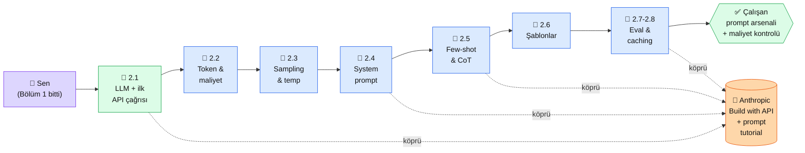

# Bölüm 2 — LLM ve Prompt Engineering

**Persona:** Bölüm 1'den gelmiş, persona netleşmiş, "Claude nedir, nasıl konuşulur"u merak ediyor. Python ve venv biliyor, ama API çağrısı atmamış · **Süre:** ~5 saat (8 sayfa, hepsinde pratik kod) · **Önkoşul:** Bölüm 0 + 1, Python venv aktif, Anthropic hesabı ve API anahtarı (2.1'de nasıl alınacağı anlatılıyor) · **Çıktı:** İlk Claude çağrın çalışıyor, token ekonomisini anlıyorsun, sıcaklık/sistem prompt/few-shot'u pratikte deneyimlemişsin

## Neden bu bölüm?

Platformun **gerçek başlangıcı burası.** Bölüm 0 + 1 zemindi; burada Claude'la konuşmaya başlıyorsun. Python'dan `messages.create(...)` çağrısı atıyorsun, cevap geliyor, parayı nereden ve ne zaman harcadığını görüyorsun.

Niye 8 sayfa? Çünkü "merhaba Claude" demek ile "Claude'u üretim kalitesinde kullanmak" arasında dağlar var. Sistem prompt olmadan yazılmış chatbot'lar niye çuvallıyor, temperature 0 vs 1 ne demek, few-shot prompting neyi kurtarıyor — hepsi somut örneklerle bu bölümde. 8 sayfa sonunda prompt'u "şiir yazdırmak" gibi değil, "ürünümde istikrarlı üretken modül kurmak" gibi düşünüyor olacaksın.

Üçüncüsü: **Anthropic'in en güçlü olduğu alan prompt engineering.** docs.claude.com'un en dolu bölümü prompting; courses repo'sunun en uzun notebook'u prompt engineering tutorial. Bu bölüm onların üstüne Türkçe bir rampa kurar — kendi kaynaklarına gittiğinde yabancılık çekmeyeceksin.

## Bölüm 2 kısaca — ne öğreniyorsun

**2.1 — LLM Nedir, Nasıl Çalışır.** Token-by-token üretim, autoregressive yapı, transformer'ın yüksek seviyeli sezgisi (matematik yok). **İlk Claude API çağrın burada** — Python + `anthropic` SDK + `messages.create` + cevap. Bu sayfa platformun pilot sayfasıdır; Kural 1-12 hepsi uygulanmış referans örneği.

**2.2 — Token, Bağlam, Maliyet.** Tokenizer nedir, Claude bir Türkçe cümleyi kaç token'a ayırıyor, bağlam penceresi (context window) neyi sınırlıyor. **Claude Sonnet fiyatlandırması** (input/output ayrı), 1 milyon token hesabı nasıl yapılır. Bu sayfa biter bitmez "bu proje ayda ~$X tutar" hesabını yapabiliyorsun.

**2.3 — Sıcaklık ve Sampling.** `temperature`, `top_p`, `top_k` parametreleri. Temperature 0 (deterministik, aynı cevap) vs 1 (yaratıcı, değişken) senaryoları. Hangi proje için hangisi: chatbot = 0.7, kod üretimi = 0.1, şiir = 1.0.

**2.4 — Sistem ve Kullanıcı Promptu.** `system` parametresi ne iş yapar, `messages` dizisi nasıl dizilir (user/assistant). **XML tag'leriyle yapılandırılmış prompt** (Anthropic'in tercih ettiği biçim). Bu sayfa chatbot kişiliği vermeyi + rol tanımlamayı kapsıyor.

**2.5 — Few-shot ve Chain-of-Thought.** Örnek göstermenin (few-shot) sıfır-örnek (zero-shot) ile farkı. "Adım adım düşün" (CoT) ne zaman açıklayıcı, ne zaman gereksiz fazla token. Karar-destek soru tasnifi gibi somut örnek üzerinde pratik.

**2.6 — Prompt Şablonları.** Değişken enjekte edilebilir şablonlar. `{{topic}}`, `{{constraint}}` placeholder'lar. Jinja2 vs f-string karşılaştırması. Bu sayfa **yeniden kullanılabilir prompt kütüphanesi** kurmanın temellerini atar — projeniz için bir `prompts/` klasörü çıkıyor.

**2.7 ve 2.8 (nav'da kapalı detay):** Prompt değerlendirmesi ve prompt caching — Anthropic'in son 12 ayda çok önemsediği iki konu. 2.7 prompt'un "doğru mu" sorusunu cevaplamayı (eval framework), 2.8 prompt caching ile maliyet düşürmeyi işliyor.

## Bu bölümün yol haritası

### Aktör tablosu

| Düğüm | Nerede | Ne iş yapıyor |
|---|---|---|
| 👤 **Sen** | Python venv aktif, terminal açık | Her sayfada `python pratik.py` çalıştırıyor, çıktıyı görüyorsun |
| 🏁 **2.1 LLM + API çağrısı** | `bolum-2/01-llm-temelleri.md` | **Pilot sayfa** — v3.2 standardının canlı örneği. İlk `messages.create` burada |
| 📄 **2.2 Token & maliyet** | Platform + terminal | Tokenizer ile kendi metninin token sayısını ölç, fiyat hesabı yap |
| 📄 **2.3 Sampling & temp** | Platform + terminal | Aynı prompt'u 3 farklı temperature'la çağır, farkı gör |
| 📄 **2.4 System prompt** | Platform + terminal | Chatbot'a "Sen X rolündesin" de, cevabı nasıl değişir gör |
| 📄 **2.5 Few-shot & CoT** | Platform + terminal | Karar destek soru seti kur, 0-shot vs 3-shot karşılaştır |
| 📄 **2.6 Şablonlar** | Platform + `prompts/` klasörün | Kendi prompt kütüphanen ilk kez yazılır |
| 📄 **2.7-2.8 Eval & caching** | Platform + test dosyan | Prompt'un doğruluğunu otomatik ölç, caching ile maliyet yarıla |
| 📖 **Anthropic API & Academy** | [docs.claude.com](https://docs.claude.com), [anthropics/courses](https://github.com/anthropics/courses) | Her sayfada ilgili docs + notebook linki |
| ✅ **Çıktı (OUT)** | Repo'nda `prompts/` + `2-bolum-denemeler/` | 8 sayfa sonunda çalışan prompt arsenalin + maliyet tablon |

## Bu bölüm bittiğinde elinde ne olacak

- **Çalışan Claude çağrıları:** İlk "merhaba Claude" + parametreli varyantlar, `messages.create` hafızanda
- **Kendi `prompts/` klasörün:** Sistem prompt + kullanıcı prompt şablonları, projede kopyala-yapıştır hazır
- **Maliyet farkındalığı:** Bir API çağrısının ne kadar token + ne kadar dolar tuttuğunu bilmen — "Claude pahalı mı?" sorusunun cevabı artık rakamlı
- **Temperature/sampling refleksi:** Yeni bir proje geldiğinde "bu deterministik mi yaratıcı mı?" sorusunu sorup doğru temperature'ı seçebiliyorsun
- **Few-shot yazma becerisi:** 0-shot denemeden önce 2-3 örnek hazırlayıp %20-40 daha iyi sonuç alma refleksi oturmuş
- **Prompt eval temeli:** Prompt'un "çalışıyor mu" sorusunu gözle değil testle cevaplayan bir mini framework'ün var
- **Prompt caching kullanan bir örnek:** Uzun sistem prompt'u olan bir çağrının caching'le ne kadar ucuzladığını gördün
- **Anthropic ekosistemine ilk girişin:** docs.claude.com'un prompting bölümü + courses repo'nun prompt tutorial notebook'u senin için artık yabancı değil

Bu çıktı 3. bölüme (embeddings + vektör DB) geçmeden önce zorunlu: Embedding'le arama yapabilmen için önce "LLM ne konuşuyor" hissini kazanmış olman gerek.

📖 Anthropic bu bölümde ne der — öz

Bölüm 2 Anthropic'in **en güçlü olduğu alandır**. Üç kanalda zengin içerik var:

**1. Academy — "Building with the Claude API" (~60 dk, sertifikalı).** Bizim 2.1-2.4'ü kapsayan Anthropic kursu. Biz Türkçe pratikle başlatıyoruz, bu kurs İngilizce geniş perspektif veriyor. 2.4'ten sonra aç — iki tarafın da aynı kavramları farklı örneklerle anlattığını görmek hafızaya oturtur.

**2. Dokümantasyon — Prompt engineering overview ve Best practices.** [docs.claude.com/en/docs/prompt-engineering](https://docs.claude.com/en/docs/prompt-engineering) Anthropic'in **kanonik** rehberi. Her 2.x sayfasında ilgili docs alt sayfasına köprü kuruyoruz. XML tag'leri (2.4), CoT (2.5), prompt templates (2.6) hepsi docs'un adlandırmasıyla aynı — bu kasıtlı, Anthropic sözlüğüne alıştırıyor.

**3. GitHub — `anthropics/courses/prompt_engineering_interactive_tutorial`.** Jupyter notebook, 9 bölüm, her bölümde çalışan kod. 2.5 (few-shot) ve 2.8 (caching) için özellikle zengin. Bu notebook'u Colab'de aç, kendi API anahtarınla çalıştır — 2-3 saat harcadığın en iyi pratik budur. Biz bu notebook'un temel kavramlarını Türkçeleştirip senaryoluyoruz; sen Colab'de pratik etmeye devam ediyorsun.

**Kaynak:** [Anthropic courses — Prompt Engineering Interactive Tutorial](https://github.com/anthropics/courses/tree/master/prompt_engineering_interactive_tutorial) (İngilizce, Jupyter notebook, ücretsiz, ~3 saat). 2.5 sonrasında aç — Colab'de kendi API anahtarınla çalıştır. Bu notebook bu bölümün "en büyük katkı" eşlikçisidir.

## Kural dışı notlar (Tip A bölüm girişi)

Bölüm 2'nin ilk sayfası (2.1) aynı zamanda **platformun pilot sayfasıdır** — Kural 1-12'yi canlı uygulayan referans örneği. Diğer 7 sayfa 2.1'in yapısını takip eder. Bölümün "Uygulama" ağırlığı %80 (her sayfada çalıştırılacak Python kodu), okuma %20.

---

**Bir sonraki adım →** [2.1 LLM Nedir, Nasıl Çalışır](01-llm-temelleri.md) (45 dk, platformun pilot sayfası — ilk Claude çağrın)

← [Bölüm 1 — Giriş ve Temeller](../bolum-1/index.md) &nbsp;|&nbsp; [Ana Sayfa](../index.md)

