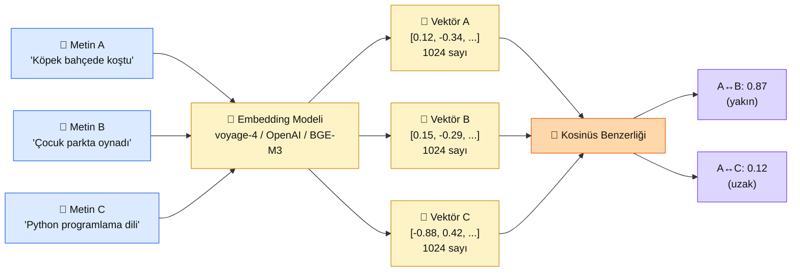

# 3.1 Embedding Nedir — Anlamı Sayılara Çevirmek

<div class="ma-meta" markdown>
<div class="ma-meta-row" markdown>
<strong>Kim için:</strong>
<span class="ma-persona ma-persona-baslangic">🟢 başlangıç</span>
<span class="ma-persona ma-persona-is">🔵 iş</span>
<span class="ma-persona ma-persona-kisisel">🟣 kişisel</span>
</div>
<div class="ma-meta-row"><strong>⏱️ Süre:</strong> ~30 dakika</div>
<div class="ma-meta-row"><strong>📋 Önkoşul:</strong> Bölüm 2 tamamlandıysa ideal — ilk Claude API çağrın yapılmış olur. Ama zorunsuz; sayfa kavramsal anlatır, kod minimaldir.</div>
<div class="ma-meta-row"><strong>🎯 Çıktı:</strong> Embedding'in ne olduğunu 3 cümleyle birine anlatabiliyorsun; iki metnin "anlamca ne kadar yakın" olduğunu **kosinüs benzerliği** ile ölçebilen çalışan bir Python scriptin var; `document` vs `query` asimetrisinin neden kritik olduğunu biliyorsun.</div>
</div>

!!! tip "Yabancı kelime mi gördün?"
    **Embedding** (gömme) = bir metnin sayı dizisine (vektör) dönüşmüş hali. **Vektör** = sabit boyutlu sayı dizisi, örnek: `[0.23, -0.11, 0.08, ...]` 1024 elemanlı. **Dimension** (boyut) = vektörün kaç sayıdan oluştuğu; voyage-4 için 1024, OpenAI için 1536 veya 3072. **Cosine similarity** (kosinüs benzerliği) = iki vektörün açı yakınlığını ölçen 0-1 arası sayı; 1'e yakınsa anlamca yakın. **Semantic** (anlamsal) = kelime eşleşmesine değil, kavramsal yakınlığa dayalı.

## Neden bu sayfa?

Bölüm 2'de Claude'a yazı yazdın, cevap aldın. Ama Claude **her çağrıda sıfırdan başlar** — yaptığı bir önceki konuşmayı hatırlamaz, senin 200 sayfalık bir PDF'ini okumaz. Bunu çözmenin yolu: **PDF'i parçalara böl → her parçayı sayıya çevir → soru geldiğinde sayıca yakın parçaları bul → Claude'a context olarak ver.** Bu zincire **RAG (Retrieval-Augmented Generation)** diyoruz; Bölüm 4'te pratiği var ama zincirin ilk halkası — "metni sayıya çevirmek" — bu sayfada.

İkincisi: Embedding **platformun en soyut görünen** konusu. "Vektör", "boyut", "kosinüs" kelimeleri matematik dersi hissiyatı verir. Ama gerçekte embedding **tek cümleyle** özetlenir: *"anlamca yakın metinlerin sayısal karşılığı birbirine yakındır."* Matematiği öğrenmek şart değil; sezgiyi öğrenmek yeter.

Üçüncüsü: Bu sayfa Bölüm 4 RAG'in, Bölüm 5 semantic search'ün, Bölüm 6 agent'lar'da uzun-hafıza kurulumunun **ortak temelidir**. Tek yerde bir kez öğren, 5 sayfada farkını göreceksin.

## Tek paragraf sezgi — "mesafe = benzerlik"

Bir metni embedding'e çevirmek demek onu **çok boyutlu uzayda bir noktaya** yerleştirmek demek. "İstanbul" bir nokta, "Ankara" başka bir nokta, "makarna" üçüncü nokta. İstanbul ve Ankara **yakın**, ikisi de şehir; makarna **uzak**, yemek. Bilgisayar bu "yakın/uzak"ı **sayısal mesafe** ile ölçer. Sen soru yazdığında ("Türkiye'nin başkenti neresi?"), sistem sorunun noktasını hesaplar, önceden yerleştirdiğin belge parçaları arasında **en yakın 5 noktayı** getirir. Bu kadar.

**Matematik yok** — noktaları hesaplayan embedding modeli (voyage-4, OpenAI, BGE) karmaşık sinir ağı; ama sen onu **kutu** olarak kullanıyorsun: kutuya metin sokuyorsun, kutudan vektör çıkıyor.

## Bu sayfanın ekosistemi — metin in, sayı out

<div class="ma-ekosistem" markdown>
<div class="ma-ekosistem-header">🗺️ Ekosistem — metinden vektöre, vektörden benzerliğe</div>



<table class="ma-aktorler" markdown>

| Parça | Rol |
|---|---|
| 📝 **Metin** | Girdi — kelime, cümle, paragraf, PDF sayfası |
| 🧠 **Embedding Modeli** | Metni vektöre çeviren yapay zekâ ("kutu") |
| 🔢 **Vektör** | Sabit boyutlu sayı dizisi; metnin anlamsal "koordinatı" |
| 📏 **Kosinüs Benzerliği** | İki vektörün yakınlığını ölçen 0-1 formül |
| 🎯 **Sonuç** | A ile B yakın (aynı kategori), A ile C uzak (farklı kategori) |

</table>
</div>

Metin A ve B ikisi de **insan + dışarı + hareket** anlamı taşır; vektörleri 0.87 benzer çıkar. Metin C **teknik + programlama**; A'ya uzak (0.12). Embedding modeli bu sezgiyi sayısal olarak öğrenmiştir — milyarlarca metin üzerinde eğitildi, "bahçede koşma" ile "parkta oynama"nın aynı tür deneyim olduğunu **istatistiksel olarak** yakaladı.

## Kosinüs benzerliği — tek formül, tek satır kod

Matematiksel tanım: iki vektörün **açı** yakınlığı. Tam aynı yöndeyseler 1, dik iseler 0, ters yöndeyseler -1. Embedding vektörleri genelde 0-1 arasında çıkar (eksi değer nadir).

Python'da:

```python
import numpy as np

def cosine_similarity(a: list[float], b: list[float]) -> float:
    """İki vektör arasındaki kosinüs benzerliği. 1.0 = tam aynı, 0.0 = alakasız."""
    a_arr = np.array(a)
    b_arr = np.array(b)
    return float(np.dot(a_arr, b_arr) / (np.linalg.norm(a_arr) * np.linalg.norm(b_arr)))

# Örnek
v1 = [0.12, -0.34, 0.56, 0.21]
v2 = [0.15, -0.29, 0.52, 0.19]
v3 = [-0.88, 0.42, -0.11, -0.65]

print(cosine_similarity(v1, v2))  # 0.997 - çok yakın
print(cosine_similarity(v1, v3))  # -0.42 - ters yönlü
```

**Formülü ezberlemen gerekmez.** Qdrant, Pinecone, pgvector gibi vector DB'ler bu hesabı **senin için** yapar — sen sadece "soru vektörüne en yakın 5 komşu getir" dersin, DB saniyede milyonlarca vektör arasında en yakınları bulup getirir. Formül bilgin **borçluluk yok** disiplini için yeter.

## Pratik örnek — 3 cümleyi embed et

Gerçek kod, gerçek API çağrısı. Voyage AI kullanıyoruz (Anthropic'in resmi tavsiyesi, 1.3'te açıklandı):

```python
# Kurulum
# pip install voyageai

import voyageai
import numpy as np
import os

vo = voyageai.Client(api_key=os.environ["VOYAGE_API_KEY"])

cumleler = [
    "Köpek bahçede top peşinde koştu.",
    "Çocuk parkta salıncakta sallandı.",
    "Python programlama dili 1991'de yaratıldı.",
]

# Embed et — 'document' modu: vektör deposuna yazacağımız metinler için
result = vo.embed(cumleler, model="voyage-4", input_type="document")
vektorler = result.embeddings

print(f"Her vektör boyutu: {len(vektorler[0])}")  # 1024

# Kosinüs benzerliklerini hesapla
def cos(a, b):
    a, b = np.array(a), np.array(b)
    return float(np.dot(a, b) / (np.linalg.norm(a) * np.linalg.norm(b)))

print(f"Köpek ↔ Çocuk: {cos(vektorler[0], vektorler[1]):.3f}")
print(f"Köpek ↔ Python: {cos(vektorler[0], vektorler[2]):.3f}")
print(f"Çocuk ↔ Python: {cos(vektorler[1], vektorler[2]):.3f}")
```

Beklenen çıktı (yaklaşık):

```
Her vektör boyutu: 1024
Köpek ↔ Çocuk:  0.72    ← ikisi de dışarıda oyun anlamı
Köpek ↔ Python: 0.38    ← alakasız, düşük
Çocuk ↔ Python: 0.41    ← yine alakasız
```

**Dikkat çeken:** Köpek-Çocuk 0.72, Köpek-Python 0.38. Model "anlamca yakınlığı" açıkça yakaladı. **Kelimeler hiç aynı değil** — "köpek" ile "çocuk" ortak kelime yok. Ama embedding **kelime değil anlam** üzerinden eşleştirir. Klasik arama (`grep`, SQL LIKE) bunu yapamaz.

## Asimetri — `document` vs `query`

Voyage AI (ve çoğu modern embed modeli) **iki farklı mod**da çalışır:

- `input_type="document"` — vektör deposuna yazacağın metinler için
- `input_type="query"` — o depoya sorduğun sorular için

**Neden önemli?** Arama senaryosu şu: binlerce belgeyi deposuna yazarsın (cevap adayları), sonra biri soru sorar ("Evrimin ikinci yasası ne?"). Soru ve cevap aynı yapıda **değildir** — cevap uzun bir paragraf, soru kısa. Model bunu ayrı modlarla optimize eder; her biri farklı vektör uzayına düşer.

**Karıştırırsan:** Retrieval kalitesi **%20-30 düşer**. 9.4 RAG Chatbot sayfasında bu ayrımı tekrar vurguladık; şimdi sebebini biliyorsun.

```python
# DOĞRU kullanım
docs = vo.embed(["Belge 1", "Belge 2"], model="voyage-4", input_type="document")
q = vo.embed(["Sorum ne?"], model="voyage-4", input_type="query")

# YANLIŞ — asimetriyi boz
docs = vo.embed(["Belge 1", "Belge 2"], model="voyage-4", input_type="query")
q = vo.embed(["Sorum ne?"], model="voyage-4", input_type="query")
# retrieval kalitesi %20-30 düşer
```

**Kural:** Yazarken `document`, sorarken `query`. Bu iki kelimeyi ezberle.

## Boyut sorusu — neden 1024? neden 3072?

Embedding modellerinin çıktı **boyutları** farklıdır:

| Model | Boyut |
|---|---|
| voyage-4 | 1024 |
| OpenAI text-embedding-3-small | 1536 |
| OpenAI text-embedding-3-large | 3072 |
| BGE-large-v2 | 1024 |
| all-MiniLM-L6-v2 | 384 |

**Daha büyük boyut = daha fazla detay yakalar** (teorik). Ama trade-off var:

- **Daha büyük boyut → daha çok disk alanı.** 1M vektör × 3072 × 4 byte ≈ 12 GB. 1024 boyutlu aynı sayı ≈ 4 GB.
- **Daha büyük → daha yavaş arama.** Vector DB retrieval hızı boyutla lineer bağlı.
- **Ama kalite farkı nadiren büyük.** Günlük kullanımda 1024 vs 3072 arasındaki fark %2-5 civarında; dev hacimde **1024 yeter**.

**Pratik kural:** Yüksek trafik / dar bütçe → 1024 (voyage-4 veya BGE). Düşük hacim / en iyi kalite → 3072 (OpenAI large). Orta yol: 1536 (OpenAI small).

## Çalıştır ve gör — mini lab

<div class="ma-gorev" markdown>
<div class="ma-gorev-header">🎯 Görev — ilk embedding deneyin</div>

**Kurulum (5 dk):**

```bash
# Bölüm 0'da kurduğun venv aktifse
pip install voyageai numpy

# Voyage AI key al (ücretsiz tier): https://www.voyageai.com/
export VOYAGE_API_KEY=pa-xxxxx
```

**Deneme (15 dk):**

`benzerlik_testi.py` yaz:

```python
import voyageai, numpy as np, os

vo = voyageai.Client(api_key=os.environ["VOYAGE_API_KEY"])

# Kendi 5 cümleni yaz — ikisi benzer, üçü farklı
cumleler = [
    "Annem bugün ev yemeği pişirdi.",           # A
    "Mutfakta lezzetli bir yemek hazırlandı.",  # B (A'ya yakın)
    "Akşam saatlerinde yağmur başladı.",        # C (farklı)
    "Projede yeni bir özellik geliştirdim.",    # D (farklı)
    "Havada damlalar belirdi.",                 # E (C'ye yakın)
]

result = vo.embed(cumleler, model="voyage-4", input_type="document")
vs = result.embeddings

def cos(a, b):
    a, b = np.array(a), np.array(b)
    return float(np.dot(a, b) / (np.linalg.norm(a) * np.linalg.norm(b)))

# Tüm ikili karşılaştırmalar
labels = ["A (yemek)", "B (yemek)", "C (yağmur)", "D (proje)", "E (yağmur)"]
for i in range(5):
    for j in range(i+1, 5):
        print(f"{labels[i]} ↔ {labels[j]}: {cos(vs[i], vs[j]):.3f}")
```

**Beklenti:**

- A↔B (ikisi yemek) → ~0.75 üstü
- C↔E (ikisi yağmur) → ~0.70 üstü
- A↔C, A↔D, B↔D, B↔C, D↔E → ~0.50 altı

**Kanıt:** Terminal ekran görüntüsü + cümleler.

**Dosyaya kaydet:** `muhendisal-notlarim/bolum-3/01-embedding/kanit.txt`

</div>

## CTO tuzakları — embedding'le ilk temasta

| # | Tuzak | Sonuç | Doğru |
|---|---|---|---|
| 1 | `document` ve `query` karıştırmak | Retrieval kalitesi %20-30 düşer | Yazarken `document`, sorarken `query` — ezberle |
| 2 | Aynı metni iki farklı modelle embed etmek | Farklı vektör uzayı, karşılaştırılamaz | Bir projede **tek model** kullan |
| 3 | Model değiştirip eski vektörleri tutmak | Eski ve yeni vektör uzayları karışır | Model değişince **tüm** vektörleri yeniden hesapla |
| 4 | Çok uzun metni tek sefer embed etmek | 2048+ token'da kalite düşer, bazı API'ler red | 500-1000 token chunk'lara böl (Bölüm 4) |
| 5 | Boyut seçiminde hep "en büyük" tercih | Disk + hız maliyeti 3×, kalite farkı %2-5 | 1024 default, özel ihtiyaçta büyüt |
| 6 | Kosinüs benzerliğini kendi elle yazmak | Hata riski + yavaş | Vector DB kullan (Qdrant, pgvector), o halleder |
| 7 | API key'i hardcode etmek | GitHub'da sızıntı, kötü adamlar kullanır | `.env` + `os.environ` + `.gitignore` |
| 8 | Embedding'i "model eğitmek" zannetmek | Kavram karışıklığı | Embedding kullanmak = ML Engineer işi DEĞİL (1.2) |

## Anthropic ekosistemi — Voyage AI neden tercih

<details class="ma-anthropic-oz" markdown>
<summary><strong>🤖 Anthropic-öz: Claude + Voyage AI çifti</strong></summary>

Anthropic kendi embedding modeli sunmaz. Bunun yerine **Voyage AI**'ı resmi tavsiye olarak gösterir (platform.claude.com/docs/en/docs/build-with-claude/embeddings). Gerekçe:

1. **Voyage AI Anthropic dostu pedagoji izler** — `input_type` asimetrisi, 200K bağlam-uyumlu context modeli (voyage-4-context), retrieval performansı MTEB benchmark'ta sürekli ilk 3'te.
2. **Ücretsiz tier cömert** — ayda 50M token ücretsiz (2026 itibarıyla); öğrenme + MVP için fazlasıyla yeter.
3. **Fiyat/performans** — OpenAI text-embedding-3-small ile neredeyse eşit kalite, ~%30 daha ucuz.
4. **Claude ile entegre dokümantasyon** — RAG örneklerinde Claude + Voyage çifti standart.

Alternatif yollar (platform dogmatik değil, 1.3 deseni):

- **OpenAI embeddings** — ekip zaten OpenAI kullanıyorsa, tek SDK disiplini
- **BGE-large-v2 (sentence-transformers)** — ücretsiz + lokal + GDPR uyumu
- **Multilingual-E5** — Türkçe + İngilizce birlikte

Bu platform **voyage-4** default seçim olarak kullanır; 3.2'de tüm alternatifler detayla açılır.

</details>

## Çıktı kanıtları — 3 kanıt

<div class="ma-cikti-kaniti" markdown>
<div class="ma-cikti-kaniti-header">📏 Çıktı — 3 kanıt</div>

**1. 3 cümleyle birine anlat:**

"Embedding bir metni ____ sayı dizisine çeviren ____ yöntemidir. Anlamca yakın metinlerin sayıları ____ çıkar, anlamca uzakların ____ çıkar. Bilgisayar bu farkı ____ benzerliği formülüyle ölçer."

Boşlukları doldur, birine oku.

**2. Çalışan mini lab:**

Yukarıdaki 5 cümlelik benzerlik testi çalışıyor, çıktıda A↔B ve C↔E yüksek, diğer çiftler düşük. Ekran görüntüsü kanıt.

**3. Asimetri bilgisi:**

`document` ve `query` arasındaki farkı 1 cümleyle anlat. Ezber, sonraki bölümlerde refleks olacak.

**Kanıt dosyası:** `muhendisal-notlarim/bolum-3/01-embedding/`

</div>

<div class="ma-neden-sonuc" markdown>
<div class="ma-neden-sonuc-header">🔗 Birlikte okuma — neden ne oldu</div>

<ol class="ma-neden-sonuc-zincir" markdown>
<li>**A → B:** Claude'un hafızası yok → kendi dokümanları okutmak için metin-sayı dönüşümü (embedding) gerek. Bu yüzden **embedding ilk adım.**</li>
<li>**B → C:** Embedding = metin → sabit boyutlu vektör; anlamca yakın metinler yakın vektörler verir. Bu yüzden **vektör mesafesi anlam ölçer.**</li>
<li>**C → D:** Kosinüs benzerliği = iki vektörün açı yakınlığı (0-1); 1'e yakın = anlamca yakın. Bu yüzden **tek formül yeter.**</li>
<li>**D → E:** voyage-4 örneği 3 cümlede 0.72 / 0.38 / 0.41 — model anlamsal yakınlığı yakaladı. Bu yüzden **API çağrısı gerçek sonuç verir.**</li>
<li>**E → F:** `document` (yazma) vs `query` (sorgulama) asimetrisi — karıştırma %20-30 kalite kaybı. Bu yüzden **input_type seçimi kritik.**</li>
<li>**F → G:** Boyut seçimi (384 / 1024 / 1536 / 3072) maliyet-kalite dengesi; 1024 default. Bu yüzden **varsayılan genelde yeterli.**</li>
<li>**G → H:** 8 CTO tuzak: asimetri ihlali, model karıştırma, hardcode key, büyüklük abartısı. Bu yüzden **baştan doğru yapı kur.**</li>
</ol>

<div class="ma-neden-sonuc-sonuc" markdown>
**Sonuç:** Embedding soyutu somuta indi. Metin → vektör → kosinüs benzerliği zincirini anlıyorsun, ilk mini deneyin çalıştı. Sonraki sayfada (3.2) **hangi** embedding modelini seçeceğine karar vereceksin — Voyage, OpenAI, BGE arasında.
</div>
</div>

<div class="ma-sonraki" markdown>
<div class="ma-sonraki-header">➡️ Sonraki adım</div>

**[3.2 Embedding Modelleri →](02-modeller.md)** — Voyage vs OpenAI vs açık kaynak; fiyat + kalite + Türkçe performansı karşılaştırma.

← [Bölüm 3 girişi](index.md) &nbsp;|&nbsp; [Ana sayfa](../index.md) &nbsp;|&nbsp; [Bölüm 2 — Prompt Engineering](../bolum-2/index.md)

**Pekiştirme:** [MTEB Leaderboard](https://huggingface.co/spaces/mteb/leaderboard) — embedding modellerinin açık benchmark'ı; Türkçe bölümünü incelersen hangi modelin ne yaptığı net olur. [Voyage AI docs: embeddings](https://docs.voyageai.com/docs/embeddings) — input_type asimetrisini resmi kaynaktan oku.
</div>
