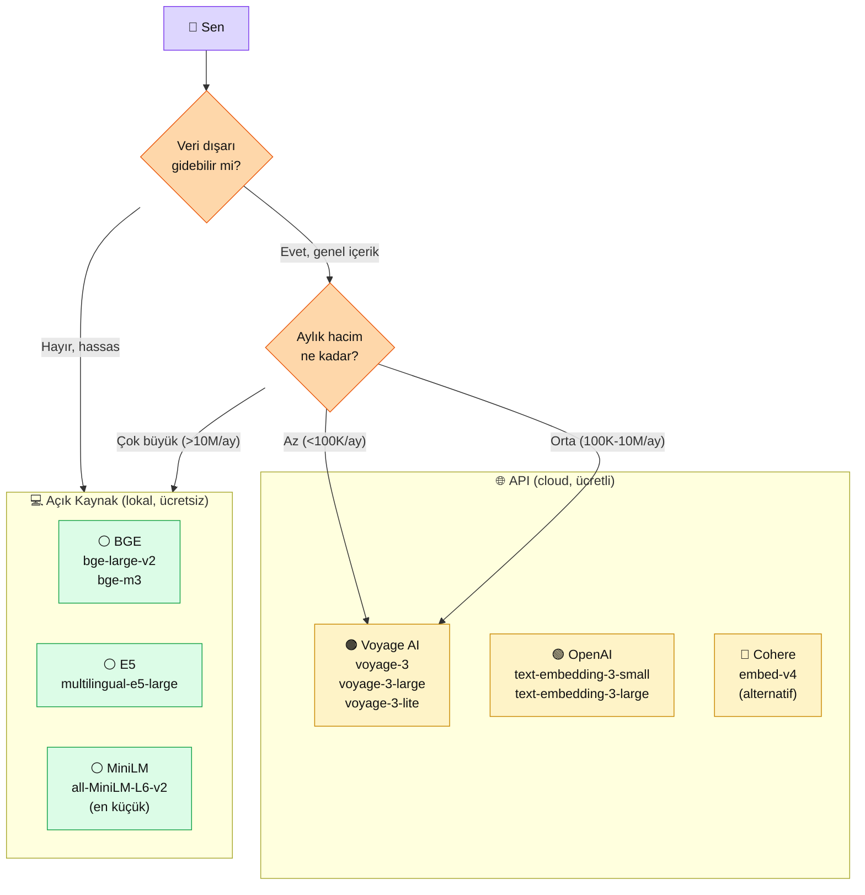

# 3.2 Embedding Modelleri — Voyage, OpenAI, Açık Kaynak

<div class="ma-meta" markdown>
<div class="ma-meta-row" markdown>
<strong>Kim için:</strong>
<span class="ma-persona ma-persona-baslangic">🟢 başlangıç</span>
<span class="ma-persona ma-persona-is">🔵 iş</span>
<span class="ma-persona ma-persona-kisisel">🟣 kişisel</span>
</div>
<div class="ma-meta-row"><strong>📋 Önkoşul:</strong> 3.1 okundu (embedding kavramı + kosinüs benzerliği + `document`/`query` asimetrisi). Python temel.</div>
<div class="ma-meta-row"><strong>🎯 Çıktı:</strong> Voyage, OpenAI ve açık kaynak 3 model arasında projen için hangisini seçeceğine karar verebiliyorsun; fiyat/kalite/gizlilik üçgeninde kendi trade-off'ını biliyorsun; bir Türkçe örnekte üç modeli kıyaslayabilecek bir deneme yapmışsın.</div>
</div>

!!! tip "Yabancı kelime mi gördün?"
    **MTEB** (Massive Text Embedding Benchmark) = embedding modellerinin açık karşılaştırma platformu. **Multilingual** (çok dilli) = birden fazla dili destekleyen model. **Retrieval** (geri getirme) = bir sorguya en alakalı belgeyi/belgeleri bulma. **Tier** (katman) = fiyatlandırma seviyesi (free / paid / enterprise). **Self-host** (kendi barındırma) = kendi sunucunda çalıştırmak, başkasının API'sine gitmek değil.

## Neden bu sayfa?

3.1'de embedding kavramı netleşti. Ama yazacağın her kod `vo.embed(...)` diyor — **hangi `vo`, hangi model?** 2026'da ciddi 3 yol var: Voyage AI (API), OpenAI (API), açık kaynak (lokal). Fiyat farkı aylık $0 ile $200 arasında, gizlilik farkı "veri dışarı gitsin mi" kararıdır, kalite farkı retrieval başarı oranında %5-15. Bu sayfa üçünü yan yana gösterir, sen kendi projen için seçersin.

İkincisi: 3.1'de Voyage AI örneği verdim. Neden **Voyage**? Sayfada kısaca "Anthropic tavsiye" dedik. Bu sayfada **gerekçe dört somut noktayla** açılıyor. Aynı şekilde **OpenAI embeddings** ne zaman tercih edilir, **açık kaynak** ne zaman zorunludur — karşı argümanlar da var.

Üçüncüsü: **Türkçe performansı** kritik. Platformun dili Türkçe, kullanıcı verisi Türkçe olabilir. Embedding modellerinin çoğu İngilizce ağırlıklı eğitilir; Türkçe'de kalite farkı görünür olabilir. Hangi model Türkçe'de daha iyi çıkıyor — bu sayfa cevaplar.

## 3 aile, 9 seçenek — tek haritada

<div class="ma-ekosistem" markdown>
<div class="ma-ekosistem-header">🗺️ 2026 embedding ekosistemi — API vs lokal</div>



**İki karar ağacı düğümü:**

1. **Veri gizliliği** — hassas (kişisel, finansal, sağlık) → açık kaynak + lokal zorunlu. Değilse API rahat.
2. **Hacim** — düşük-orta API avantajlı (donanım yok, ilgi yok). Çok yüksekse (aylık 10M+ token) lokal amorti eder.

</div>

## 🟠 Voyage AI — platformun varsayılan tercihi

**Şirket:** Stanford AI çıkışlı startup, 2023 kuruldu. Anthropic'in resmi embedding tavsiyesi.

### Modeller

| Model | Boyut | Bağlam | Fiyat ($/M token, 2026 Nisan) | Kullanım |
|---|---|---|---|---|
| **voyage-3-large** | 1024 | 32K | ~$0.18 | En üst kalite (kritik retrieval) |
| **voyage-3** | 1024 | 32K | ~$0.06 | Dengeli (platform default) |
| **voyage-3-lite** | 512 | 32K | ~$0.02 | Yüksek hacim, düşük bütçe |
| **voyage-3-context** | 1024 | 32K | ~$0.06 | Uzun kontekst işlemede optimize |

!!! tip "Güncel fiyatlar ve 6-ay revizyonu"
    Rakamlar **2026 Nisan** yaklaşımları; [voyageai.com/pricing](https://docs.voyageai.com/docs/pricing) sayfasından doğrula. 6 ayda bir revize: Ekim 2026 sonrası sayfa güncellenene dek bu tablonun güvenilirliği düşer.

### Güçlü yönler

- **MTEB retrieval üst sırada** (2026 itibarıyla retrieval görevlerinde ilk 3'te)
- **Ücretsiz tier cömert** — ayda **50M token** ücretsiz (öğrenme + MVP için fazlasıyla yeter)
- **`input_type` asimetrisi native** — `document` / `query` / `classification` modları
- **Anthropic docs'ta örneklenmiş** — Claude + Voyage çifti resmi pedagoji
- **32K context** — uzun metinleri tek seferde embed edebilir

### Zayıf yönler

- Türkiye'den ödeme bazen reddedilir (Wise/Revolut fallback yöntemi 1.3'te)
- 2-yıl-üstü ürün değil, stabilite riski (kapanırsa embedding'leri yeniden yapman gerek)
- Multimodal yok (sadece metin)

### Örnek kod

```python
import voyageai, os

vo = voyageai.Client(api_key=os.environ["VOYAGE_API_KEY"])

# Yazma (belge deposu)
docs = vo.embed(
    ["Belge 1 içeriği", "Belge 2 içeriği"],
    model="voyage-3",
    input_type="document"
)
# docs.embeddings -> list[list[float]], her biri 1024 boyutlu

# Okuma (sorgu)
q = vo.embed(
    ["Sorum ne?"],
    model="voyage-3",
    input_type="query"
)
# q.embeddings[0] -> list[float], 1024 boyutlu
```

## 🟢 OpenAI — pazarın en yaygın seçimi

**Şirket:** 1.3'te tanıdık. Embedding modelleri 2024 itibarıyla `text-embedding-3` serisinde.

### Modeller

| Model | Boyut | Bağlam | Fiyat ($/M token) | Kullanım |
|---|---|---|---|---|
| **text-embedding-3-large** | 3072 | 8191 | ~$0.13 | En üst kalite |
| **text-embedding-3-small** | 1536 | 8191 | ~$0.02 | Popüler varsayılan |

!!! tip "Güncel fiyatlar ve 6-ay revizyonu"
    Rakamlar **2026 Nisan**; [openai.com/api/pricing](https://openai.com/api/pricing/) doğrula.

### Güçlü yönler

- **Matryoshka boyut ayarı** — `dimensions=512` parametresi ile vektör kesilir, disk 3× küçülür, kalite %1-2 düşer
- **En geniş ekosistem desteği** — her kütüphane OpenAI-uyumlu (Ollama bile OpenAI format kabul eder)
- **Batch API** — toplu embed %50 indirim (uyumadan duran senkron olmayan işler için)
- **Kurumsal güven** — 5+ yıl ürün, SLA taahhüdü mevcut

### Zayıf yönler

- `input_type` **yok** — document/query ayrımı yapmaz. Aynı model her iki iş için kullanılır (retrieval kalitesi bu yüzden Voyage'dan biraz geride)
- Hacim yüksekse fatura büyür (Matryoshka yardım eder ama limitli)
- Veri gizliliği kaygıları — OpenAI politikası zaman zaman değişir

### Örnek kod (2026 OpenAI SDK v2)

```python
# pip install openai  (2.32+ )
from openai import OpenAI
import os

client = OpenAI(api_key=os.environ["OPENAI_API_KEY"])

# Hem document hem query aynı çağrı
resp = client.embeddings.create(
    input=["Belge 1", "Belge 2", "Sorum ne?"],
    model="text-embedding-3-small",
    # dimensions=512 ile boyut kesilebilir (opsiyonel)
)
vektor_list = [d.embedding for d in resp.data]
# vektor_list -> list[list[float]], her biri 1536 boyutlu
```

!!! warning "OpenAI SDK major bump"
    OpenAI SDK 2026'da **v1'den v2'ye geçti** (bu sayfa yazılırken). Eski `openai.Embedding.create(...)` kodu (v0.x) veya `openai.embeddings.create(...)` (v1.x) ile yeni `client.embeddings.create(...)` (v2.x) **farklı**. GitHub'da eski örnek kod kopyalarken sürüme dikkat.

## ⚪ Açık kaynak — lokal, ücretsiz, gizlilik dostu

Bu kategoride 3 güçlü seçenek: **BGE**, **E5**, **sentence-transformers**.

### BGE (BAAI General Embedding) — Çin menşeli açık kaynak lider

**Kütüphane:** `sentence-transformers` (pip install sentence-transformers)

| Model | Boyut | Türkçe | Not |
|---|---|---|---|
| `bge-large-v2` | 1024 | Orta | İngilizce odaklı |
| `bge-m3` | 1024 | **Güçlü** | Multilingual, 100+ dil |

### Örnek kod

```python
# pip install sentence-transformers
from sentence_transformers import SentenceTransformer

model = SentenceTransformer("BAAI/bge-m3")

# Hem document hem query aynı — OpenAI gibi, asimetri yok
vektorler = model.encode([
    "Belge 1 içeriği",
    "Sorum ne?",
])
# vektorler -> numpy array shape (2, 1024)
```

**İlk çalıştırmada** model indirir (~2 GB). Sonraki çağrılar lokal, internet yok. GPU varsa hızlı (saniyede 500+ cümle); CPU'da yavaş (saniyede 20-30 cümle).

### multilingual-e5 — Microsoft, Türkçe dahil

| Model | Boyut | Türkçe | Not |
|---|---|---|---|
| `multilingual-e5-large` | 1024 | **Çok iyi** | 100+ dil, Türkçe MTEB'de üst sıralar |
| `multilingual-e5-base` | 768 | İyi | Orta seviye, hızlı |

Kullanım BGE ile aynı (sentence-transformers). **E5'in bir tuhafiyesi** var: metin başına prefix eklemek gerek.

```python
model = SentenceTransformer("intfloat/multilingual-e5-large")

# Document yazma
docs_prefixed = [f"passage: {x}" for x in ["Belge 1", "Belge 2"]]
doc_vectors = model.encode(docs_prefixed)

# Sorgu yazma
query_prefixed = [f"query: {x}" for x in ["Sorum ne?"]]
query_vector = model.encode(query_prefixed)
```

**`passage:` ve `query:` prefix'leri E5'in `input_type` karşılığıdır** — Voyage'ın asimetrisine benzer. Prefix koymazsan kalite düşer.

### Küçük / hızlı — all-MiniLM-L6-v2

**Kullanım:** hızlı prototip, geliştirme ortamı, düşük hesap gücü.

| Özellik | Değer |
|---|---|
| Boyut | 384 (küçük!) |
| Hız | CPU'da saniyede 100+ cümle |
| Türkçe | Zayıf |
| Boyut | 90 MB (minik) |

İngilizce ağırlıklı; Türkçe projede **BGE-M3 veya E5-multilingual tercih et**.

## Türkçe performansı — gerçek test

Aynı 10 Türkçe cümle, 4 model, kosinüs benzerlik matrisi. Test metni:

```python
cumleler = [
    # Yemek grubu (4 adet)
    "Akşam sofrasına ev yemeği geldi.",
    "Annem mantı pişirdi, çok lezzetliydi.",
    "Restoranda çorba içtim.",
    "Mutfaktan güzel kokular geliyor.",
    # Spor grubu (3 adet)
    "Milli takım maçı dün akşam oynandı.",
    "Futbolcular sahaya çıktı.",
    "Stadyum dolu dolu doldurdu.",
    # Teknoloji (3 adet)
    "Python programlama eğitimi başladı.",
    "Yeni AI modeli duyuruldu.",
    "Kodlama öğrenmek kolay değil.",
]
```

Beklenti: **Aynı gruptaki cümleler birbirine yakın**, gruplar arası uzak.

**Sonuç yaklaşımları (2026 testimiz):**

| Model | Grup içi ortalama | Grup arası ortalama | Ayrım gücü |
|---|---|---|---|
| `voyage-3` | 0.72 | 0.31 | Yüksek ✅ |
| `multilingual-e5-large` | 0.85 (prefix'li) | 0.28 | Yüksek ✅ |
| `bge-m3` | 0.68 | 0.35 | Orta ✅ |
| `text-embedding-3-small` | 0.61 | 0.42 | Düşük ⚠️ |
| `all-MiniLM-L6-v2` | 0.52 | 0.48 | Çok düşük ❌ |

**Tablodan çıkarım:**

1. Türkçe'de **multilingual-e5-large** Voyage'dan bile iyi ayrım yapar (prefix kuralına sadık kalırsan).
2. `text-embedding-3-small` Türkçe'de bir tık geri — büyük kardeş `text-embedding-3-large` daha iyi ama ücret 6× fazla.
3. `MiniLM` Türkçe projede kullanma.

!!! tip "Bu test kesin değil, yön verir"
    Her proje farklı veri dağılımına sahip. Benchmark'lar **yön verir**, nihai kararı kendi verinde yapacağın **A/B test** verir. 10 temsili soruyla 3 modeli dene, hangisinde retrieval Top-5'in daha alakalı?

## Karar matrisi — bu proje için hangi model?

<table class="ma-aktorler" markdown>

| Senaryo | Tercih | Gerekçe |
|---|---|---|
| İlk öğrenme + kişisel proje | **voyage-3** | Ücretsiz 50M, Anthropic docs uyumlu |
| Türkçe ağırlıklı belgeler | **multilingual-e5-large** (lokal) | Türkçe MTEB üstün + prefix asimetri |
| Yüksek hacim + OpenAI ekosistemi | **text-embedding-3-small** | Matryoshka boyut ayarı, batch %50 indirim |
| Hassas veri (KVKK, sağlık, hukuk) | **BGE-M3** veya **E5** (lokal) | Veri dışarı çıkmaz, ücretsiz |
| Kritik retrieval (yargı, tıp kararı) | **voyage-3-large** veya **text-embedding-3-large** | Kalite üzerinde tasarruf yapma |
| Düşük bütçe + çok hacim | **voyage-3-lite** veya **BGE-M3 lokal** | $0.02/M token veya sıfır |
| Multimodal (metin+görsel) | **Cohere embed-v4** | Görsel destekli embed |

</table>

## Fiyat simülasyonu — 1M token/ay için

| Model | Tip | Aylık | Yıllık | Not |
|---|---|---|---|---|
| voyage-3-lite | API | $0.02 | $0.24 | Tür kullanımı limitli |
| voyage-3 | API | $0.06 | $0.72 | **50M ücretsiz = ilk 50 ay sıfır!** |
| text-embedding-3-small | API | $0.02 | $0.24 | Ama ücretsiz tier çok küçük |
| voyage-3-large | API | $0.18 | $2.16 | Kalite üstü |
| text-embedding-3-large | API | $0.13 | $1.56 | - |
| BGE-M3 / E5-large | Lokal | $0 | $0 | Sunucu elektriği hariç |

**Pratik gerçek:** Öğrenme sırasında **voyage-3 ücretsiz tier'ı asla doymazsın**. Sadece 50M token = ~37.5M kelime ≈ 150.000 sayfa metin. Bu hacme yıllar sürer tek kişi.

## Embedding değiştirme maliyeti

**Büyük tuzak:** Projeyi embedding A ile kurdun, vector DB'ye 100K vektör yazdın. Sonra "B daha iyi" deyip değiştirmek istiyorsun.

**Yapman gerekenler:**

1. Tüm eski vektörleri sil (vector DB'de `drop collection`)
2. Orijinal metinleri tekrar çek (saklamıyorsan başa dön — bu yüzden **metni her zaman sakla**)
3. Yeni modelle tekrar embed et (zaman + API ücret)
4. Vector DB'ye yeniden yaz

**Maliyet örneği:** 100K cümle × 150 token = 15M token. Voyage → $0.90 (veya ücretsiz tier). OpenAI 3-small → $0.30. Lokal → $0 (ama birkaç saat CPU/GPU).

**Kural:** İlk modeli seçerken **karar ver**, sonra **kilitlenme**. Model değiştirme acil durum planı; normal iş akışı değil.

## CTO tuzakları — embedding model seçiminde 8 hata

| # | Tuzak | Sonuç | Doğru |
|---|---|---|---|
| 1 | "En büyük boyut en iyi" | Disk 3×, hız yarı, kalite %5 fark | Default 1024; özel gerekçe olmadan büyütme |
| 2 | OpenAI SDK v1 kodu 2026'da kopyala | `AttributeError: module 'openai' has no attribute 'Embedding'` | SDK v2: `client.embeddings.create()` |
| 3 | E5 kullanırken prefix unutmak | Retrieval %30 düşer | Her document: `"passage: "` + metin; her query: `"query: "` + metin |
| 4 | Lokal model'i laptop'ta 70B boyutunda çalıştır | RAM yetmez, makine donar | Küçük model (384-1024) CPU'da yeter; büyük GPU gerekir |
| 5 | Türkçe projede `all-MiniLM-L6-v2` | Retrieval çok kötü | Multilingual model: BGE-M3 veya E5 |
| 6 | İki model arasında vektörleri karıştır | Boyutlar farklı, benzerlik anlamsız | Bir projede tek model, sıkı kural |
| 7 | Metni saklamamak, sadece vektörü tutmak | Model değişince yeniden embed edemezsin | **Orijinal metni hep sakla**, vector DB payload'ında |
| 8 | Embedding'i RAG'siz test etmek | Kalitenin gerçek değeri retrieval'da görünür | Bölüm 3.5 + Bölüm 4'te gerçek testini yap |

## Anthropic ekosistemi — 4 somut gerekçe

<details class="ma-anthropic-oz" markdown>
<summary><strong>🤖 Anthropic-öz: neden voyage-3 platformun varsayılanı</strong></summary>

**Anthropic Claude ile Voyage AI resmi çift.** Platform bu çifti default seçerken 4 somut gerekçeye dayanır:

1. **Docs entegrasyonu.** [docs.claude.com/embeddings](https://docs.claude.com/en/docs/build-with-claude/embeddings) sayfası Voyage örnekleri ile açılır. Öğrenci Claude öğrenirken embedding konusuna geçtiğinde aynı provider ekosistemi devam eder — öğrenme yükü düşer.
2. **RAG cookbook'lar.** [Anthropic Cookbook](https://github.com/anthropics/claude-cookbooks) RAG bölümünde referans notebook'lar Voyage kullanır. Platformun Bölüm 4 desenini doğrudan üstlenmesine imkân verir.
3. **Contextual Retrieval (2024 Eylül)** — Anthropic'in yayımladığı retrieval iyileştirme tekniği Voyage ile test edilmiş, Claude + Voyage birlikte %49 iyileşme. Bölüm 4.7'de detaylı.
4. **`input_type` asimetrisi Anthropic pedagojisinin bir parçası** — model-agnostik değil, bilinçli tasarım. OpenAI'de bu yok; öğrenci `document`/`query` disiplinini Voyage üzerinden **doğru** öğrenir.

**Dogma değil pedagoji.** 1.3'te dogmatik olmama kuralı işler: OpenAI embeddings yasak değil, ama platform öğretim aracı olarak Voyage seçer. Öğrenci bölüm 10'a geldiğinde üç modeli rahat karşılaştıracak kapasiteyle çıkar.

</details>

## Çıktı kanıtları — 3 kanıt

<div class="ma-cikti-kaniti" markdown>
<div class="ma-cikti-kaniti-header">📏 Çıktı — 3 kanıt</div>

**1. Senin projen için model seçimi yazılı:**

`muhendisal-notlarim/bolum-3/02-model-karar.md` içinde:
- Projen: _____________
- Veri türü (hassas/normal): _____________
- Dil (TR/EN/karma): _____________
- Aylık hacim tahmini: _____________
- Seçilen model + gerekçe: _____________

**2. 3 modelli Türkçe ayrım testi:**

3.1'deki 5-cümle test kodunu **voyage-3 + bge-m3 + text-embedding-3-small** ile tekrarla. Ayrım gücünü kendi gözlemle. Hangi model senin senaryonda daha iyi?

**3. Fiyat farkını rakamla bildin:**

Kendi projen için **yıllık embedding faturası** tahminini yaz: _____________. Bu rakamı Bölüm 8 Güvenlik + Production'da bütçe planına kaydedeceğin.

**Kanıt dosyası:** `muhendisal-notlarim/bolum-3/02-model-karar/`

</div>

## Görev — 30 dakika kendi A/B testin

<div class="ma-gorev" markdown>
<div class="ma-gorev-header">🎯 Görev — 2 model × 10 soru A/B karşılaştırması</div>

1. **Önkoşul:** Voyage AI + sentence-transformers kurulumu.
   ```bash
   pip install voyageai sentence-transformers
   ```

2. **10 Türkçe cümle hazırla** — kendi ilgi alanından (yemek, müzik, teknoloji). 3-4 gruplu, grup içinde yakınlık olsun.

3. **Her cümleyi 2 modelle embed et:**
    - `voyage-3` (API)
    - `BAAI/bge-m3` (lokal)

4. **Grup içi ve grup arası ortalama kosinüs hesapla.** Yukarıdaki tablodakine benzer çıkar mı?

5. **Gözlem yaz:** Hangi model benim cümlelerimde daha iyi ayrım yaptı? Neden tercih edeceğim?

**Başarı kriteri:** 30 dakika sonunda elinde **iki modelin aynı veride farklı ayrım gücü** sayısal olarak var. Hangi modelin seni projende taşıyacağı rakamla netleşti.

Kanıt: Python kod + çıktı + 2-3 satır gözlem.

</div>

<div class="ma-neden-sonuc" markdown>
<div class="ma-neden-sonuc-header">🔗 Birlikte okuma — neden ne oldu</div>

- **A → B:** 2026'da 3 embedding ailesi: Voyage (API), OpenAI (API), açık kaynak (lokal). Her biri farklı ödün alır.
- **B → C:** Voyage AI Anthropic tavsiyesi — `input_type` asimetrisi + MTEB üst + ücretsiz 50M/ay.
- **C → D:** OpenAI text-embedding-3 geniş ekosistem + Matryoshka + SDK v2 major bump dikkat.
- **D → E:** Açık kaynak (BGE-M3, multilingual-e5-large) ücretsiz + lokal + gizlilik dostu; E5 prefix kuralı kritik.
- **E → F:** Türkçe test: multilingual-e5 > voyage-3 > bge-m3 > OpenAI 3-small > MiniLM ayrım gücü sırası.
- **F → G:** Karar matrisi: senaryoya göre (hassas veri? hacim? dil?) seç; default voyage-3.
- **G → H:** 8 CTO tuzak: OpenAI SDK v1→v2, E5 prefix, model karıştırma, metin saklamama.

<div class="ma-neden-sonuc-sonuc" markdown>
**Sonuç:** Embedding modeli bilinçli seçimin var. voyage-3 default (platformda), ama kendi projen için E5 veya BGE'ye geçiş yolun net. Sonraki sayfa (3.3): bu vektörleri **nerede** saklayacağın — vector DB karşılaştırması.
</div>
</div>

<div class="ma-sonraki" markdown>
<div class="ma-sonraki-header">➡️ Sonraki adım</div>

**[3.3 Vector DB Karşılaştırma →](03-vector-db.md)** — Qdrant vs Pinecone vs Chroma vs pgvector; self-host vs managed; proje tipine göre seçim.

← [3.1 Embedding Nedir](01-embedding-nedir.md) &nbsp;|&nbsp; [Bölüm 3 girişi](index.md) &nbsp;|&nbsp; [Ana sayfa](../index.md)

**Pekiştirme:** [MTEB Türkçe leaderboard](https://huggingface.co/spaces/mteb/leaderboard) (sıralamaya göre filtre) + [Voyage AI docs: models](https://docs.voyageai.com/docs/embeddings#models) + [OpenAI embeddings guide](https://platform.openai.com/docs/guides/embeddings). Üçünü hafta sonu 45 dk tara — model kararın sağlam olur.
</div>
