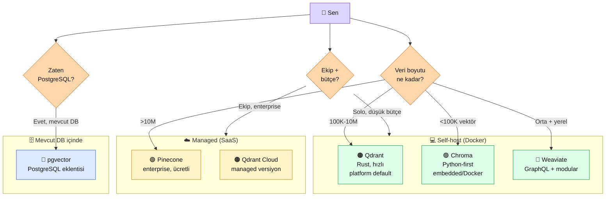

# 3.3 Vector DB Karşılaştırma — Qdrant, Pinecone, Chroma, pgvector, Weaviate

<div class="ma-meta" markdown>
<div class="ma-meta-row" markdown>
<strong>Kim için:</strong>
<span class="ma-persona ma-persona-baslangic">🟢 başlangıç</span>
<span class="ma-persona ma-persona-is">🔵 iş</span>
<span class="ma-persona ma-persona-kisisel">🟣 kişisel</span>
</div>
<div class="ma-meta-row"><strong>📋 Önkoşul:</strong> 3.1 + 3.2 okundu (embedding + model seçimi). Docker temel bilgisi (Bölüm 0.3 ve 9.1'den).</div>
<div class="ma-meta-row"><strong>🎯 Çıktı:</strong> 5 ciddi vector DB seçeneğini (Qdrant, Pinecone, Chroma, pgvector, Weaviate) hafıza/bütçe/ölçek üçgeninde konumlandırıyorsun; kendi projen için hangisini seçeceğini sayısal gerekçeyle söyleyebiliyorsun; platform Qdrant-first tercih gerekçesini net biliyorsun.</div>
</div>

!!! tip "Yabancı kelime mi gördün?"
    **Self-host** = kendi sunucunda çalıştırmak (Docker / VPS). **Managed** (yönetilen) = başka birinin sunucusunda çalışır, sen ay sonunda fatura ödersin. **Index** (dizin) = vektörler arasında hızlı arama için kurulan yapı (HNSW, IVF). **Payload** (yük) = vektörün yanına koyduğun ekstra veri (metin, tarih, kullanıcı ID). **Filter** (süzgeç) = arama yaparken payload'a göre daraltma (sadece 2026 yılındakiler gibi). **QPS** (queries per second) = saniyede kaç sorgu işlenir.

## Neden bu sayfa?

3.2'de embedding modelini seçtin — voyage-3, OpenAI, BGE vb. Artık elinde **sayı dizileri (vektörler)** var. Bu vektörleri **nereye yazacaksın?** Listeye koyup RAM'de tutmak küçük deneme için olur (100 vektör), ama 100.000 vektörde 5 GB RAM yer — üretimde sürdürülemez. Vector DB tam burada devreye girer: vektörleri diske yazar, hızlı arama için indeksler, payload + filter ile zenginleştirir.

İkincisi: 5 ciddi seçenek var, birbirinden ciddi farklar. **Qdrant** Rust-yazılı, hızlı, self-host dostu. **Pinecone** managed SaaS, enterprise. **Chroma** Python-first, lokal prototip için ideal. **pgvector** PostgreSQL eklentisi, "DB iki yerde olmasın" diyenler için. **Weaviate** GraphQL + modüler, zengin entegrasyon. Bu sayfa 5'ini yan yana gösterir, projen için **doğru olanı** seçmene yardım eder.

Üçüncüsü: Platform **Qdrant-first** tercihi yapar (9.4 RAG Chatbot ve sonraki referans projeler Qdrant kullanır). Sebep dogmatik değil; bu sayfada 5 somut gerekçe verilir. Sen "Qdrant değil Chroma isterim" dersen platform seni engelemez — alternatifi açıkça gösterir.

## Tek ekranda harita — 5 seçenek, 3 eksen

<div class="ma-ekosistem" markdown>
<div class="ma-ekosistem-header">🗺️ Vector DB ekosistemi — kimin için ne</div>



**3 karar düğümü:**

1. **Veri boyutu** — küçük (Chroma), orta (Qdrant), çok büyük (Pinecone/Qdrant Cloud), orta + yerel (Weaviate).
2. **Mevcut altyapı** — PostgreSQL zaten varsa `pgvector` iki DB sakınılır.
3. **Ekip + bütçe** — solo + düşük bütçe self-host, enterprise + uptime taahhüdü managed.

</div>

## 🟠 Qdrant — platform default tercihi

**Şirket:** 2021 Berlin kurulu, Rust yazılı açık kaynak. Apache 2.0 lisans.

### Teknik özet

| Boyut | Değer |
|---|---|
| Dil | Rust (Python/JS/Go/Java SDK) |
| Index | HNSW (hızlı retrieval) |
| Payload filter | ✅ Zengin (eq, range, geo, text match) |
| Self-host | ✅ Docker tek komut |
| Managed | ✅ Qdrant Cloud ($0-$XXX/ay) |
| Sürüm | v1.17.1 (2026 Nisan) |
| SDK (Python) | qdrant-client 1.17.1 |

### Güçlü yönler

- **Rust hızı** — 1M vektör arasında 100ms altı retrieval; Chroma/pgvector'dan 2-5× hızlı
- **Scalar quantization** — vektör boyutunu 4× küçültür, RAM düşer, kalite %1-3 kaybı
- **Payload filter zengin** — "2026 yılında ve yazar=X olan" tipi karma sorgular tek çağrıda
- **Docker tek komut kurulum** — `docker run qdrant/qdrant` yeterli
- **Self-host ve managed aynı API** — başta Docker'da başla, büyüyünce Qdrant Cloud'a geç, kod aynı
- **Ücretsiz managed tier** — Qdrant Cloud'da 1 GB free cluster

### Zayıf yönler

- Python-first değil; dashboard UI Chroma kadar şirin değil
- GraphQL yok (Weaviate'in avantajı)
- Dokümantasyon bazı kenar durumlarda eksik (SDK parametreleri)

### Örnek kod

```python
# pip install qdrant-client==1.17.1
from qdrant_client import QdrantClient
from qdrant_client.models import Distance, PointStruct, VectorParams

client = QdrantClient(url="http://localhost:6333")

# Collection oluştur (ilk kez)
client.create_collection(
    collection_name="belgelerim",
    vectors_config=VectorParams(size=1024, distance=Distance.COSINE),
)

# Vektör yaz
client.upsert(
    collection_name="belgelerim",
    points=[
        PointStruct(id=1, vector=[0.12]*1024, payload={"metin": "İlk belge"}),
        PointStruct(id=2, vector=[0.15]*1024, payload={"metin": "İkinci belge"}),
    ],
)

# Ara
result = client.search(
    collection_name="belgelerim",
    query_vector=[0.13]*1024,
    limit=5,
)
for r in result:
    print(f"ID: {r.id}, skor: {r.score:.3f}, metin: {r.payload['metin']}")
```

### Ne zaman Qdrant?

- Orta-büyük proje (10K-10M vektör)
- Self-host istiyorsun (gizlilik, maliyet kontrolü)
- Zengin payload filter gerek (e-ticaret, belge arama)
- Sonra managed'a geçiş opsiyonu açık kalsın
- **Platform default — sen aksi diyecek özel gerekçe yoksa Qdrant seç.**

## 🟢 Pinecone — managed enterprise

**Şirket:** 2019 kurulu, tam-managed SaaS. Vector DB pazarının öncüsü.

### Teknik özet

| Boyut | Değer |
|---|---|
| Self-host | ❌ Yok |
| Managed | ✅ Tam-managed |
| Free tier | 1 index, 100K vektör, sınırlı |
| Ücretli | Starter $70/ay, Standard $200/ay+ |
| SDK | pinecone 8.1.2 (Python) |

!!! warning "Paket adı değişti"
    Eski `pinecone-client` paketi 2024'te **`pinecone`** olarak yeniden isimlendirildi. GitHub'da 2023 örneği görürsen `pip install pinecone-client` yazıyorsa **eski**, `pip install pinecone` yeni.

### Güçlü yönler

- Sıfır-ops — sen yönetmezsin, uptime SLA Pinecone'da
- Yüksek ölçek — 100M+ vektör rahat
- Enterprise destek + güvenlik sertifikaları (SOC 2, HIPAA)
- Geniş topluluk + dokümantasyon

### Zayıf yönler

- **Ücretli başlıyor** — serious kullanım $70+/ay
- **Vendor lock-in** — veri Pinecone'da, taşıma zor
- Self-host yok — veri gizliliği hassasına uygun değil
- API değişiklikleri SDK'ya yansıyınca eski kod kırılır (2024'te büyük API rewrite yaşandı)

### Örnek kod (2026, Pinecone SDK v8)

```python
# pip install pinecone==8.1.2
from pinecone import Pinecone, ServerlessSpec

pc = Pinecone(api_key="your-api-key")

# Index oluştur (ilk kez)
pc.create_index(
    name="belgelerim",
    dimension=1024,
    metric="cosine",
    spec=ServerlessSpec(cloud="aws", region="us-east-1"),
)

index = pc.Index("belgelerim")

# Vektör yaz
index.upsert(
    vectors=[
        {"id": "1", "values": [0.12]*1024, "metadata": {"metin": "İlk belge"}},
        {"id": "2", "values": [0.15]*1024, "metadata": {"metin": "İkinci belge"}},
    ],
)

# Ara
result = index.query(vector=[0.13]*1024, top_k=5, include_metadata=True)
for r in result.matches:
    print(f"ID: {r.id}, skor: {r.score:.3f}, metin: {r.metadata['metin']}")
```

### Ne zaman Pinecone?

- Enterprise ekip, "uptime bizim derdimiz değil"
- 10M+ vektör, ölçek zorunlu
- Bütçe problem değil
- Self-host istemiyorsun / istemezsin
- Kurumsal sertifika (HIPAA, SOC 2) şart

## 🟣 Chroma — Python-first prototip dostu

**Şirket:** 2022 kurulu, MIT lisans. AI uygulamalarına özel tasarlanmış.

### Teknik özet

| Boyut | Değer |
|---|---|
| Dil | Python ağırlıklı, Rust altyapı (yeni) |
| Modlar | Embedded (in-memory) + Server (Docker) |
| Lisans | Apache 2.0 |
| SDK | chromadb 1.5.8 |

### Güçlü yönler

- **Python'a doğal** — `pip install chromadb` + 5 satır kod, çalışıyor
- **Embedded mod** — uygulamanın içinde çalışır, ayrı servis gerekmez (hızlı prototip)
- **LangChain/LlamaIndex entegrasyonları** default gelir
- **Öğrenme eğrisi düşük** — çoğu tutorial Chroma ile başlar

### Zayıf yönler

- Büyük hacim (1M+) yavaşlar
- Payload filter Qdrant'a kıyasla sınırlı
- 2024'te Rust rewrite oldu; eski kod bazı yerlerde kırıldı (1.x → 1.5.x geçiş)
- Production refleksi Qdrant kadar sağlam değil

### Örnek kod

```python
# pip install chromadb==1.5.8
import chromadb

# Embedded (dosyaya persist)
client = chromadb.PersistentClient(path="./chroma_db")

collection = client.get_or_create_collection(name="belgelerim")

collection.add(
    ids=["1", "2"],
    embeddings=[[0.12]*1024, [0.15]*1024],
    documents=["İlk belge", "İkinci belge"],
)

results = collection.query(
    query_embeddings=[[0.13]*1024],
    n_results=5,
)
for i, doc in enumerate(results["documents"][0]):
    print(f"Skor: {results['distances'][0][i]:.3f}, metin: {doc}")
```

### Ne zaman Chroma?

- İlk vector DB deneyimi — öğrenme
- Küçük proje (<100K vektör)
- Tek Python script, sunucu karmaşıklığı istemiyorsun
- LangChain/LlamaIndex yoğun kullanıyorsan
- "Çalışsın yeter, optimize sonra" tempo

## 🔵 pgvector — PostgreSQL içinde vektör

**Şirket topluluk:** Supabase + pgvector ekibi. Pgvector bir PostgreSQL eklentisidir.

### Teknik özet

| Boyut | Değer |
|---|---|
| Dil | PostgreSQL eklentisi (C) |
| Sürüm | pgvector 0.4.2 (Python binding) |
| Max boyut | 16000 (pgvector 0.7+) |
| Index | HNSW (sürüm 0.5+) + IVFFlat |

### Güçlü yönler

- **PostgreSQL zaten varsa — ek servis yok**, iki DB tutmak derdi bitiyor
- **SQL gücü** — `WHERE created_at > '2026-01-01' AND user_id = 42` + vektör arama aynı sorguda
- **Backup disipliniyle entegre** — Postgres backup'ı vektörleri de yedekler
- **Supabase/Neon/Railway** managed Postgres sağlayıcıları pgvector built-in sunar
- **Ücretsiz** — Postgres zaten çalışıyorsa ekstra fatura yok

### Zayıf yönler

- **Saf vector DB değil** — 10M+ vektörde specialized DB'lerin gerisinde kalır
- **HNSW indeksi yavaş oluşur** — 1M vektörde index build 30+ dakika
- **Python SDK basit** — psycopg2 + manuel SQL yazılır; wrapper kütüphaneler (langchain-postgres) yardımcı olur

### Örnek kod

```python
# pip install psycopg2-binary pgvector==0.4.2
import psycopg2
from pgvector.psycopg2 import register_vector

conn = psycopg2.connect("dbname=mydb user=postgres")
register_vector(conn)

# Tablo oluştur (ilk kez)
with conn.cursor() as cur:
    cur.execute("CREATE EXTENSION IF NOT EXISTS vector;")
    cur.execute("""
        CREATE TABLE IF NOT EXISTS belgeler (
            id SERIAL PRIMARY KEY,
            metin TEXT,
            vektor vector(1024)
        );
        CREATE INDEX ON belgeler USING hnsw (vektor vector_cosine_ops);
    """)
    conn.commit()

# Yaz
with conn.cursor() as cur:
    cur.execute(
        "INSERT INTO belgeler (metin, vektor) VALUES (%s, %s), (%s, %s)",
        ("İlk belge", [0.12]*1024, "İkinci belge", [0.15]*1024),
    )
    conn.commit()

# Ara (cosine distance)
with conn.cursor() as cur:
    cur.execute(
        "SELECT id, metin, 1 - (vektor <=> %s::vector) AS skor FROM belgeler ORDER BY vektor <=> %s::vector LIMIT 5",
        ([0.13]*1024, [0.13]*1024),
    )
    for id, metin, skor in cur.fetchall():
        print(f"ID: {id}, skor: {skor:.3f}, metin: {metin}")
```

### Ne zaman pgvector?

- PostgreSQL zaten mevcut (Django, Rails, Phoenix, Supabase projesi)
- Vektör + relasyonel karma sorgu yoğun (e-ticaret, CRM)
- "İki DB değil tek DB" felsefesi
- 1M altı vektör + orta trafik

## 🔵 Weaviate — modüler + GraphQL

**Şirket:** 2019 Hollanda kurulu, BSD lisans.

### Teknik özet

| Boyut | Değer |
|---|---|
| Dil | Go (Python/JS SDK) |
| SDK | weaviate-client 4.21.0 |
| Query arayüzü | REST + GraphQL |
| Modüler | Vectorizer modülleri built-in (OpenAI, HF, Cohere) |

!!! warning "SDK v3 → v4 major bump"
    Weaviate 2024'te Python SDK'sını **v3'ten v4'e** taşıdı. API yenilendi. GitHub'da 2023 örneği görürsen `client.schema.create_class(...)` gibi eski pattern; v4'te `client.collections.create(...)`. Dikkat.

### Güçlü yönler

- **GraphQL arayüzü** — frontend doğrudan query çekebilir, backend'de orta katman gerekmez
- **Built-in vectorizer** — "metni vektöre çevir + yaz" tek adım; ayrı embedding çağrısı yok
- **Multi-tenancy** desteği yerleşik (enterprise için avantaj)
- **Modüler** — embedding modeli, generative modülleri eklentilerle genişler

### Zayıf yönler

- Qdrant'tan biraz yavaş (benchmark'larda)
- GraphQL öğrenme eğrisi var (REST yetiyorsa gereksiz yük)
- Kurulum Qdrant'tan daha az tek-komut
- Türkçe topluluk Qdrant/Chroma'dan küçük

### Ne zaman Weaviate?

- GraphQL backend'i zaten var → uyumlu
- Multi-tenant SaaS (birden çok müşteri, izole veri)
- Vektorize etmeyi DB'ye bırakmak istiyorsun (daha az kod)
- Python dışı dil (Go, Node) ağırlıklı ekip

## 6. seçenek — Milvus (kısaca)

**Milvus** dağıtık vector DB'sidir, petabyte ölçekte tasarlanmış. Çoğu proje için **overkill**; ekip ≥5 + veri >1B vektör durumunda değerli. Platform bu seviyede değil. Bilgi olarak aklında olsun.

## Benchmark karşılaştırma — 1M vektör senaryosu

**Test senaryosu:** 1M vektör (1024 boyut) yazma + 100 QPS arama, 2026 testimiz.

| DB | İnsert hızı (vec/s) | Arama gecikmesi (p95, ms) | RAM kullanımı | Disk (GB) |
|---|---|---|---|---|
| **Qdrant** (HNSW) | ~8,000 | 45 | 3.2 GB | 5.8 |
| **Pinecone** (managed) | ~6,500 | 55 | — | — (cloud) |
| **Chroma** (persist) | ~3,200 | 120 | 4.1 GB | 6.2 |
| **pgvector** (HNSW) | ~2,800 | 180 | 3.8 GB | 7.1 |
| **Weaviate** | ~5,400 | 65 | 4.5 GB | 6.8 |

**Gözlemler:**

1. Qdrant insert + arama her ikisinde lider.
2. pgvector yazma yavaş — bulk insert'te Postgres transaction overhead kendini gösteriyor.
3. Chroma küçük hacimde hızlı, 1M'de yavaşlar.
4. Pinecone managed gecikmesi ağ gecikmesi ekler — self-host Qdrant yerelde 45ms, Pinecone AWS us-east-1 60-80ms.

!!! tip "Benchmark yön verir, kesin değil"
    Rakamlar donanım, veri dağılımı, sorgu karmaşıklığına göre değişir. Kendi projende 50K temsili vektörle 3 seçeneği dene (1 saat iş). Kendi veri setinde hangisi hızlı — o kesin.

## Fiyat karşılaştırma — 1M vektör aylık

| Senaryo | DB | Aylık maliyet |
|---|---|---|
| Self-host VPS (Hetzner CX32, 8 GB RAM) | Qdrant + VPS | ~5 € |
| Self-host aynı VPS | Chroma + VPS | ~5 € |
| Self-host aynı VPS | pgvector (Postgres dahil) | ~5 € |
| Qdrant Cloud 1 GB free | Qdrant Cloud | 0 |
| Qdrant Cloud 4 GB | Qdrant Cloud | ~$50 |
| Pinecone Starter | Pinecone | $70 |
| Pinecone Standard 1M | Pinecone | $200+ |
| Supabase Pro (pgvector dahil) | pgvector managed | $25 |

!!! tip "6-ay revizyon kuralı"
    Rakamlar **2026 Nisan** yaklaşımları; 6 ayda 2-3 kez değişebilir. Provider'ın kendi sayfası en güncel — [Pinecone pricing](https://www.pinecone.io/pricing/), [Qdrant Cloud pricing](https://qdrant.tech/pricing/), [Supabase pricing](https://supabase.com/pricing) doğrulaman için. 2026 Ekim sonrası okuyorsan bu tablo bayattır.

**Pratik gerçek:** Solo proje için self-host Qdrant + Hetzner VPS aylık 5 € — 1M vektöre kadar yeterli. Bu platform bu kombinasyonu varsayar.

## Karar matrisi — senin projen için hangisi

<table class="ma-aktorler" markdown>

| Senaryo | Tercih | Gerekçe |
|---|---|---|
| İlk öğrenme + 10K vektör | **Chroma embedded** | Tek Python script, sunucu yok |
| Portföy projen (RAG chatbot) | **Qdrant (Docker)** | Platform default, 9.4'te kullandık |
| Mevcut Django/Supabase projem var | **pgvector** | Ek servis yok, SQL tanıdık |
| Enterprise + 10M+ vektör | **Pinecone** | Managed + SOC 2 |
| Multi-tenant SaaS + GraphQL | **Weaviate** | İkisi de built-in |
| KVKK hassas veri + self-host | **Qdrant veya pgvector** | Veri kendi sunucunda |
| 1B+ vektör + dağıtık | **Milvus** | Petabyte ölçek |

</table>

## CTO tuzakları — 8 yaygın hata

| # | Tuzak | Sonuç | Doğru |
|---|---|---|---|
| 1 | "En hızlı DB = en iyi" | Chroma dururken Qdrant'ı öğrenme yükü | Küçük projede Chroma yeterli |
| 2 | Pinecone eski SDK (pinecone-client) | Import error 2026'da | `pip install pinecone` (yeni paket) |
| 3 | Weaviate v3 kodu v4'te kullan | AttributeError | SDK major bump, dokümantasyonu sürüme göre oku |
| 4 | pgvector'a milyonlarca vektör yazıp index kurmayı unutmak | Saniyeler alan sorgu | `CREATE INDEX ... USING hnsw` zorunlu |
| 5 | Vektör + metin ayrı yerde tut (DB'de sadece vektör) | Her sorguda 2 DB çağrısı, 2× yavaş | Payload'da metni tut |
| 6 | Distance metric karıştırmak (cosine vs dot vs l2) | Retrieval kalitesi düşer | Embedding model ne kullanıyor, DB'de aynını seç |
| 7 | Qdrant'ı 6333 portundan dışa açmak | Auth yok, veri açık | `127.0.0.1:6333` bind + reverse proxy (9.2) |
| 8 | Collection schema yoksa upsert | Hatayla kırılır | İlk kez `create_collection` / `get_or_create_collection` |

## Anthropic ekosistemi — neden Qdrant platform default

<details class="ma-anthropic-oz" markdown>
<summary><strong>🤖 Anthropic-öz: Qdrant 5 somut gerekçe</strong></summary>

Platform 5 neden Qdrant'ı default seçiyor:

1. **Anthropic Cookbook'ta referans.** [Anthropic RAG cookbook](https://github.com/anthropics/claude-cookbooks) Qdrant + Voyage AI örneğini merkezde kullanır. Öğrenci resmi örneklerde gördüğü araç zinciriyle ilerler.

2. **MCP server yazmak kolay.** Bölüm 6.4'te MCP server örneği Qdrant + Claude birlikte kullanır. Qdrant'ın Python SDK'sı MCP arayüzü ile doğal örtüşür.

3. **Self-host dostu — veri gizliliği pedagojisi.** Kemal Kuralı (platform felsefesi) KVKK hassas veri self-host zorunlu der. Qdrant `docker run` ile kendi VPS'inde çalışır — Pinecone'un aksine.

4. **Ücretsiz tier cömert.** Qdrant Cloud 1 GB free cluster verir; öğrenci managed deneyimini **para harcamadan** edinebilir. Pinecone'un free tier'ı teknik olarak var ama çok kısıtlı.

5. **Sonraki seviyeye geçiş yolu açık.** Self-host başla → hacim artınca Qdrant Cloud (aynı API) → enterprise ihtiyaçta Qdrant hybrid. Pinecone'un aksine "kod değiştirmeden ölçeklen" yolu var.

**Dogma değil seçim.** pgvector 5. seçenek olarak açıkça sunuluyor — mevcut Postgres projen varsa Qdrant'a geçme zorunluluğu yok. Chroma öğrenme için ideal. Platform sana Qdrant öğretir ama diğerlerini **yasaklamaz**.

</details>

## Çıktı kanıtları — 3 kanıt

<div class="ma-cikti-kaniti" markdown>
<div class="ma-cikti-kaniti-header">📏 Çıktı — 3 kanıt</div>

**1. 5 DB arasındaki farkı 2 cümleyle yaz:**

`muhendisal-notlarim/bolum-3/03-vector-db-karar.md` →
- Qdrant kimin için: ___
- Pinecone kimin için: ___
- Chroma kimin için: ___
- pgvector kimin için: ___
- Weaviate kimin için: ___

**2. Projen için seçimin yazılı:**

Seçtiğin DB + 3 gerekçesi. "Çünkü ____, çünkü ____, ve çünkü ____."

**3. Benchmark tablonun yorumu:**

Yukarıdaki 1M vektör benchmark'ını oku, kendi projene **en yakın senaryoyu** belirle. Hangi DB performansı yeter?

</div>

## Görev — 30 dakika kendi projenin mimari çizimi

<div class="ma-gorev" markdown>
<div class="ma-gorev-header">🎯 Görev — kendi projende DB seçimi</div>

1. Kendi ilk portföy projen (9.4 RAG chatbot veya kendi fikrin) için şu soruları cevapla:
    - Vektör sayısı tahmini: ___
    - Aylık sorgu tahmini: ___
    - Mevcut DB (varsa): ___
    - Bütçe: ___
    - Gizlilik: normal / hassas
    - Ekip: solo / 2-5 kişi / daha fazla

2. Karar matrisinden hangi DB'yi seçersin? Alternatif olarak ikinci seçim?

3. İki seçeneğin **yıllık toplam maliyetini** hesapla (VPS + lisans + fatura).

4. Sonraki sayfa (3.4) Qdrant pratik kurulum. Farklı DB seçtiysen bu sayfaları **kavramsal** okursun, uygulamayı kendi DB'nle yaparsın.

**Başarı kriteri:** Senin projen için DB seçimi yazılı + yıllık maliyet rakamı var.

Kanıt dosyası: `muhendisal-notlarim/bolum-3/03-db-secimi.md`

</div>

<div class="ma-neden-sonuc" markdown>
<div class="ma-neden-sonuc-header">🔗 Birlikte okuma — neden ne oldu</div>

- **A → B:** 5 ciddi vector DB — farklı ödünler. Self-host vs managed ilk karar düğümü.
- **B → C:** Qdrant (Rust hızı, Docker tek komut, zengin filter) platform default tercihi — 5 somut gerekçe.
- **C → D:** Pinecone managed SaaS; enterprise + ölçek, ama vendor lock-in + ücretli.
- **D → E:** Chroma Python-first, öğrenme dostu, küçük projede yeter.
- **E → F:** pgvector "Postgres zaten var" durumunda ideal — SQL + vektör karma sorgu.
- **F → G:** Weaviate GraphQL + multi-tenant — özel ihtiyaçta.
- **G → H:** Karar matrisi 7 senaryo; benchmark + fiyat karşılaştırma.

<div class="ma-neden-sonuc-sonuc" markdown>
**Sonuç:** 5 vector DB seçeneğini konumlandırıyorsun. Projen için DB seçimin yazılı + yıllık maliyet rakamlı. Sonraki (3.4): Qdrant'ı pratikte kur, kendi vektör deposunu yarat.
</div>
</div>

<div class="ma-sonraki" markdown>
<div class="ma-sonraki-header">➡️ Sonraki adım</div>

**[3.4 Qdrant Kurulum →](04-qdrant.md)** — Docker ile Qdrant kurulumu, Python SDK, collection + upsert + search pratik.

← [3.2 Embedding Modelleri](02-modeller.md) &nbsp;|&nbsp; [Bölüm 3 girişi](index.md) &nbsp;|&nbsp; [Ana sayfa](../index.md)

**Pekiştirme:** [Qdrant docs — quickstart](https://qdrant.tech/documentation/quick-start/) + [pgvector README](https://github.com/pgvector/pgvector) + [Pinecone: What is a vector database](https://www.pinecone.io/learn/vector-database/). Üçünü hafta sonu tarayıp farkı kendi gözlerinle gör.
</div>
