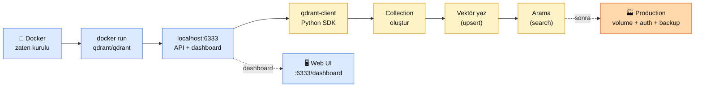

# 3.4 Qdrant Kurulum — Docker'dan İlk Sorguya

<div class="ma-meta" markdown>
<div class="ma-meta-row" markdown>
<strong>Kim için:</strong>
<span class="ma-persona ma-persona-baslangic">🟢 başlangıç</span>
<span class="ma-persona ma-persona-is">🔵 iş</span>
<span class="ma-persona ma-persona-kisisel">🟣 kişisel</span>
</div>
<div class="ma-meta-row"><strong>⏱️ Süre:</strong> ~40 dakika</div>
<div class="ma-meta-row"><strong>📋 Önkoşul:</strong> 3.1 + 3.2 + 3.3 okundu. Bölüm 0.3 (Docker) ve Bölüm 9.1 (Docker imaj yönetimi) tecrübesi. Python + pip çalışıyor.</div>
<div class="ma-meta-row"><strong>🎯 Çıktı:</strong> Yerel makinende **çalışan Qdrant**; `http://localhost:6333` dashboard açılıyor; Python scriptinle 20 Türkçe cümleyi embed edip Qdrant'a yazdın, soru sorduğunda en alakalı 5 cümle dönüyor; production refleksleri (volume mount, healthcheck, auth) biliyorsun.</div>
</div>

!!! tip "Yabancı kelime mi gördün?"
    **Collection** (koleksiyon) = vector DB'de bir veritabanı tablosunun karşılığı; vektörlerin gruplandığı yer. **Point** (nokta) = Qdrant'ta bir vektör + ID + payload üçlüsü. **Upsert** = update + insert; kayıt varsa güncelle, yoksa oluştur. **HNSW** = Hierarchical Navigable Small World; vektör aramada popüler hızlı indeks. **Scalar quantization** = float32 vektörü int8'e sıkıştırmak; boyut 4× küçük, kalite ~%1-3 kaybı. **Payload** = vektör yanına konan ek bilgi (metin, tarih, kaynak URL).

## Neden bu sayfa?

3.3'te Qdrant'ı **tercih** ettik. Bu sayfada **elle kuruyoruz**. 10 dakikada yerel makinende Qdrant ayakta, 20 dakikada ilk semantic search sorgusu çalışıyor. Bu noktadan sonra embedding artık senin için **soyut değil araçla çalışılan** bir şey.

İkincisi: 9.4 RAG Chatbot referans projesi Qdrant kullanıyor — oraya geldiğinde "ben bu DB'yi kurdum, komut biliyorum" refleksiyle gideceksin. Bölüm 9 deploy bölümü de Qdrant'ı production'a alır. Bu sayfa o zincirin başlangıcı.

Üçüncüsü: Qdrant kurulumu **tek komut**: `docker run qdrant/qdrant`. Ama production refleksi daha derin — volume mount, healthcheck, auth, scalar quantization, backup. Bu sayfa ikisini birden verir: hızlı başlangıç + production refleksi.

## Bu sayfanın ekosistemi

<div class="ma-ekosistem" markdown>
<div class="ma-ekosistem-header">🗺️ Qdrant kurulum akışı</div>



**İki aşama:** Önce Docker'da Qdrant ayağa kalkar (API + dashboard). Sonra Python SDK ile konuşursun.

</div>

## Adım 1 — Qdrant'ı Docker ile kur (2 dakika)

**Minimal komut** (yerel deneme için):

```bash
docker run -p 6333:6333 -p 6334:6334 qdrant/qdrant:v1.17.1
```

**Port açıklamaları:**

- `6333` — REST API + dashboard (tarayıcıdan erişim)
- `6334` — gRPC API (opsiyonel, yüksek performanslı Python SDK bu portu kullanabilir)

Kontrol et:

```bash
# Başka terminalde
curl http://localhost:6333/
# {"title":"qdrant - vector search engine","version":"1.17.1",...}

# Dashboard
open http://localhost:6333/dashboard
# veya tarayıcıda aç
```

Dashboard'da henüz koleksiyon yok — şimdi oluşturacağız.

!!! warning "Bu komut VERİYİ KAYBEDİYOR"
    `docker run` yukarıdaki gibi volume olmadan çalışırsa container kapandığında **tüm vektörler silinir**. Sadece deneme için OK. Üretim veya ciddi kullanım için volume mount şart — aşağıda.

### Production versiyonu — volume + restart + healthcheck

`compose.yml`:

```yaml
services:
  qdrant:
    image: qdrant/qdrant:v1.17.1
    restart: unless-stopped
    volumes:
      - qdrant_storage:/qdrant/storage
      - qdrant_snapshots:/qdrant/snapshots
    ports:
      - "127.0.0.1:6333:6333"   # localhost-only; dışa açma
    healthcheck:
      test: ["CMD-SHELL", "bash -c ':> /dev/tcp/127.0.0.1/6333' || exit 1"]
      interval: 10s
      timeout: 3s
      retries: 5

volumes:
  qdrant_storage:
  qdrant_snapshots:
```

Çalıştır:

```bash
docker compose up -d
docker compose ps   # healthy status görmelisin
```

**9.2 sertleştirme kuralı burada:** `127.0.0.1:6333:6333` — Qdrant portu dış dünyaya **açılmaz**. Aynı makinede çalışan app container'ınızdan erişirsiniz. Dışarıdan erişim gerekirse (uzaktan geliştirme) SSH tüneli kur:

```bash
# yerel makinende
ssh -L 6333:localhost:6333 user@server
# şimdi yerel tarayıcında http://localhost:6333/dashboard çalışır
```

## Adım 2 — Python SDK kurulumu (1 dakika)

```bash
# Bölüm 0'daki venv aktif olmalı
pip install qdrant-client==1.17.1
```

!!! tip "Sürüm pin disiplini"
    `==` sürüm pini mandatory — qdrant-client 1.16 → 1.17 arasında API parametre adları değişebilir. 3.2'deki OpenAI SDK v1→v2 gibi sürpriz yaşama, pin kullan.

**İlk bağlantı testi:**

```python
from qdrant_client import QdrantClient

client = QdrantClient(url="http://localhost:6333")
print(client.get_collections())
# CollectionsResponse(collections=[])
```

Eğer `ConnectionError` alırsan Docker çalışmıyor veya port 6333 kapalı — `docker compose ps` ile kontrol et.

## Adım 3 — İlk koleksiyonu oluştur (1 dakika)

```python
from qdrant_client import QdrantClient
from qdrant_client.models import Distance, VectorParams

client = QdrantClient(url="http://localhost:6333")

# İlk koleksiyon — 1024 boyut (voyage-4 ile uyumlu), cosine distance
client.create_collection(
    collection_name="haberler",
    vectors_config=VectorParams(size=1024, distance=Distance.COSINE),
)

print(client.get_collections())
# CollectionsResponse(collections=[CollectionDescription(name='haberler')])
```

**3 parametre kritik:**

1. `collection_name` — benzersiz; var olanla çakışırsa hata (aşağıda `get_or_create` deseni).
2. `size` — vektör boyutu. Embedding modelin ne veriyorsa o (voyage-4 → 1024, OpenAI small → 1536).
3. `distance` — `COSINE` (en yaygın), `DOT`, `EUCLID`, `MANHATTAN`. Embedding modelin için hangisi önerildiyse onu seç (Voyage → Cosine).

**Tekrar çalıştırırsan** aynı koleksiyon adıyla `create_collection` hata verir. Güvenli desen:

```python
def ensure_collection(client: QdrantClient, name: str, size: int = 1024) -> None:
    """Koleksiyon yoksa oluştur, varsa geç."""
    existing = [c.name for c in client.get_collections().collections]
    if name not in existing:
        client.create_collection(
            collection_name=name,
            vectors_config=VectorParams(size=size, distance=Distance.COSINE),
        )

ensure_collection(client, "haberler", size=1024)
```

Bu desen 9.4 RAG Chatbot'ta kullandığımız aynı — idempotent (defalarca çalıştırılabilir).

## Adım 4 — Gerçek veri yaz (5 dakika)

20 Türkçe haber başlığı alalım, Voyage AI ile embed edelim, Qdrant'a yazalım:

```python
# pip install qdrant-client voyageai
import os
import voyageai
from qdrant_client import QdrantClient
from qdrant_client.models import Distance, PointStruct, VectorParams

client = QdrantClient(url="http://localhost:6333")
vo = voyageai.Client(api_key=os.environ["VOYAGE_API_KEY"])

# 20 başlık — 4 kategori, her biri 5 tane
haberler = [
    # Ekonomi
    ("ekon_1", "Merkez Bankası faiz kararını açıkladı"),
    ("ekon_2", "Dolar kuru yeni rekor seviyesine ulaştı"),
    ("ekon_3", "Borsa İstanbul günü yükselişle kapattı"),
    ("ekon_4", "Enflasyon rakamları TÜİK'ten geldi"),
    ("ekon_5", "Tarım kredi kooperatiflerine yeni destek paketi"),
    # Teknoloji
    ("tek_1", "Anthropic Claude 5'i tanıttı"),
    ("tek_2", "OpenAI'nin yeni modeli GPT-6 yolda"),
    ("tek_3", "Apple M5 çipi duyuruldu, hız iki kat"),
    ("tek_4", "Google kuantum bilgisayarda yeni rekor"),
    ("tek_5", "Microsoft Copilot tüm Windows'ta varsayılan"),
    # Spor
    ("spor_1", "Milli takım Avrupa Şampiyonası'nda yarı finalde"),
    ("spor_2", "Galatasaray Şampiyonlar Ligi'nde tur atladı"),
    ("spor_3", "Tenis yıldızı Wimbledon'ı kazandı"),
    ("spor_4", "Formula 1'de yeni sezon başladı"),
    ("spor_5", "Basketbol ligi final serisi başlıyor"),
    # Kültür
    ("kul_1", "Cannes Film Festivali'nde Türk filmi ödül aldı"),
    ("kul_2", "İstanbul Bienali 40'ıncı yılını kutluyor"),
    ("kul_3", "Yeni kitap sergisi İstanbul'da açıldı"),
    ("kul_4", "Tiyatro sezonu bu hafta başladı"),
    ("kul_5", "Arkeologlar Troya'da yeni buluntu açıkladı"),
]

# Koleksiyon hazır olsun
existing = [c.name for c in client.get_collections().collections]
if "haberler" not in existing:
    client.create_collection(
        collection_name="haberler",
        vectors_config=VectorParams(size=1024, distance=Distance.COSINE),
    )

# Embed et (document modu)
metinler = [h[1] for h in haberler]
result = vo.embed(metinler, model="voyage-4", input_type="document")
vektorler = result.embeddings

# Qdrant'a yaz
points = [
    PointStruct(
        id=i + 1,  # Qdrant integer ID ister (veya UUID str)
        vector=vec,
        payload={"kategori": haberler[i][0].split("_")[0], "baslik": haberler[i][1]},
    )
    for i, vec in enumerate(vektorler)
]

client.upsert(collection_name="haberler", points=points, wait=True)
print(f"{len(points)} haber yüklendi.")

# Doğrula
info = client.get_collection("haberler")
print(f"Toplam nokta: {info.points_count}")
# 20
```

**Dikkat edilecek noktalar:**

- `id` — integer veya UUID string. Qdrant `id="ekon_1"` kabul etmez; `id=1` veya `id="ae6db7..."` ister.
- `wait=True` — upsert'in diskte oturmasını bekle; `False` daha hızlı ama sonraki arama eski durumu görebilir.
- `payload` — metinleri + kategorileri yanına koyduk. Arama sonucunda hem vektör skoru hem metni alırız.

## Adım 5 — İlk arama (2 dakika)

```python
# Sorgu: "AI modelleri son gelişmeler"
sorgu = "AI modelleri son gelişmeler"

# Sorgu modunda embed et!
q_result = vo.embed([sorgu], model="voyage-4", input_type="query")
q_vector = q_result.embeddings[0]

# Qdrant'ta ara — query_points modern API (v1.18'de search() kaldırılıyor)
hits = client.query_points(
    collection_name="haberler",
    query=q_vector,
    limit=5,
).points

for h in hits:
    print(f"{h.score:.3f}  [{h.payload['kategori']}]  {h.payload['baslik']}")
```

**Beklenen çıktı yaklaşımı:**

```
0.782  [tek]   Anthropic Claude 5'i tanıttı
0.758  [tek]   OpenAI'nin yeni modeli GPT-6 yolda
0.612  [tek]   Microsoft Copilot tüm Windows'ta varsayılan
0.594  [tek]   Apple M5 çipi duyuruldu, hız iki kat
0.521  [tek]   Google kuantum bilgisayarda yeni rekor
```

**Güzellik:** 20 haberden ilk 5'i `tek` (teknoloji) kategorisinden — kelime eşleşmesi YOK (sorguda "Claude" veya "AI" kelimesi aranmadı; `"AI modelleri son gelişmeler"` de haber başlıklarında yok). Embedding **anlamsal yakınlığı** yakaladı.

## Adım 6 — Payload filter ile akıllı arama

"Sadece ekonomi kategorisinden en alakalı 3 haber" demek istiyorsun:

```python
from qdrant_client.models import FieldCondition, Filter, MatchValue

hits = client.query_points(
    collection_name="haberler",
    query=q_vector,
    limit=3,
    query_filter=Filter(
        must=[
            FieldCondition(key="kategori", match=MatchValue(value="ekon"))
        ]
    ),
).points

for h in hits:
    print(f"{h.score:.3f}  [{h.payload['kategori']}]  {h.payload['baslik']}")
```

**Sonuç:** Sadece `ekon` kategorisinde, sorguya en yakın 3 haber döner. Vektör benzerliği + structural filter = güç.

### Filter örnekleri

```python
# Tek değer
Filter(must=[FieldCondition(key="kategori", match=MatchValue(value="tek"))])

# Birden fazla değer (OR)
from qdrant_client.models import MatchAny
Filter(must=[FieldCondition(key="kategori", match=MatchAny(any=["tek", "spor"]))])

# Tarih aralığı (payload'da 'tarih' varsayalım)
from qdrant_client.models import Range
Filter(must=[FieldCondition(key="tarih", range=Range(gte="2026-01-01", lt="2026-06-01"))])

# Hariç tutma (must_not)
Filter(must_not=[FieldCondition(key="kategori", match=MatchValue(value="spor"))])

# Karma: kategori=tek VE 2026'dan sonra
Filter(
    must=[
        FieldCondition(key="kategori", match=MatchValue(value="tek")),
        FieldCondition(key="tarih", range=Range(gte="2026-01-01")),
    ]
)
```

Filter'ın gücü Qdrant'ın öne çıktığı alanlardan biri. Chroma ve pgvector'da da var ama daha sınırlı.

## Adım 7 — Scalar quantization (ileri seviye)

Büyüyen koleksiyonda RAM sorunu: 1M vektör × 1024 × 4 byte = **4 GB**. Çözüm: quantization.

```python
from qdrant_client.models import (
    Distance, ScalarQuantization, ScalarQuantizationConfig,
    ScalarType, VectorParams,
)

client.create_collection(
    collection_name="haberler_q",
    vectors_config=VectorParams(size=1024, distance=Distance.COSINE),
    quantization_config=ScalarQuantization(
        scalar=ScalarQuantizationConfig(
            type=ScalarType.INT8,
            always_ram=True,  # sıkıştırılmış vektör RAM'de
        ),
    ),
)
```

**Etki:** float32 (4 byte/değer) → int8 (1 byte/değer). RAM **4× küçük**, retrieval **2× hızlı**, kalite **~%1-3 kaybı**. 10M+ vektör varsa çoğu zaman açılır.

## Adım 8 — Dashboard UI keşif

`http://localhost:6333/dashboard` aç. Sol menüde:

- **Collections** — oluşturduğun koleksiyonlar, boyut + vektör sayısı
- **API** — OpenAPI dokümantasyonu (Swagger benzeri, interaktif)
- **Console** — HTTP istek denemeleri
- **Telemetry** — performans istatistikleri

Küçük projede dashboard opsiyonel; büyükte debug için paha biçilmez.

## Adım 9 — Production refleksi: backup + snapshot

Qdrant manuel snapshot yapabilir:

```python
# Koleksiyonun snapshot'ını al
snapshot_info = client.create_snapshot(collection_name="haberler")
print(snapshot_info.name)  # haberler-1234.snapshot

# Snapshot dosyaları container'ın /qdrant/snapshots/ dizininde (volume'a yazılır)
```

Production disiplini:

```bash
# Günlük snapshot (cron)
0 3 * * * docker exec qdrant-container ls /qdrant/snapshots/

# Snapshot'ı dışarı kopyala (yedek sunucuya)
docker cp qdrant-container:/qdrant/snapshots/ ./backup/
rsync -av ./backup/ user@yedek-sunucu:/backup/qdrant/
```

**Bölüm 8 Güvenlik** detaylı backup stratejileri işler (3-2-1 kuralı, restore testi, vb).

## Adım 10 — Auth (production için kritik)

Default Qdrant auth **yok**; VPS'te dışa açıksa herkes veriyi okur/yazar. İki seviye güvenlik:

### Seviye 1 — Network isolation (platform default)

Compose.yml'de `127.0.0.1:6333:6333` bindine kaldık — sadece aynı makinedeki app container erişir. Yeterli çoğu solo proje için.

### Seviye 2 — API key auth (Qdrant 1.10+)

```yaml
# compose.yml'e ekle
services:
  qdrant:
    environment:
      QDRANT__SERVICE__API_KEY: ${QDRANT_API_KEY}
```

Python'da:

```python
client = QdrantClient(
    url="http://localhost:6333",
    api_key=os.environ["QDRANT_API_KEY"],
)
```

API key yanlışsa tüm çağrılar 401 döner.

## CTO tuzakları — Qdrant ile 10 yaygın hata

| # | Tuzak | Sonuç | Doğru |
|---|---|---|---|
| 1 | Volume mount unutmak | Container yeniden başlayınca veri sıfır | `compose.yml`'de `qdrant_storage` volume |
| 2 | Port 6333'ü `0.0.0.0` bindlemek | İnternetten herkes eriir | `127.0.0.1:6333:6333` (9.2 kuralı) |
| 3 | `id` string olarak geçmek (`"abc"`) | Qdrant hata verir | Integer veya UUID string |
| 4 | `create_collection` `get_or_create` olmadan | 2. run'da "already exists" hata | Ensure pattern (3.1'de gösterdim) |
| 5 | Embedding model boyutu ile collection size uyuşmaz | `ValueError: vector size mismatch` | voyage-4 → 1024, OpenAI small → 1536 |
| 6 | `document` ve `query` asimetrisini unutmak | Retrieval kalitesi %20-30 düşer | 3.1 kuralı: yazarken document, sorarken query |
| 7 | `wait=False` upsert + hemen arama | Eski durumu görür, kaybolmuş cevap | İlk yüklemede `wait=True`; yüksek hacim canlıda `False` |
| 8 | 10M+ vektörde HNSW index kurulumunu beklemeden upload | Dakikalarca yavaş arama | İlk upload önce, sonra index build |
| 9 | Distance metric embedding modeli ile uyumsuz | Kalite düşer | Voyage/OpenAI → `COSINE`; L2 normalize edilmiş ise `DOT` da OK |
| 10 | Dashboard'ı production'da açık bırakmak | Harici kullanıcı data listesini görebilir | Caddy'de reverse proxy + auth zorunlu |

## Anthropic ekosistemi — Qdrant + Claude = RAG

<details class="ma-anthropic-oz" markdown>
<summary><strong>🤖 Anthropic-öz: Qdrant + Claude zinciri</strong></summary>

Bu sayfada kurduğun Qdrant, sonraki bölümde Claude'a bağlanacak:

1. **Bölüm 4 (RAG):** Qdrant'ta ara → ilk 5 chunk al → Claude'a context olarak ver → Claude cevaplar. Tam pipeline.
2. **9.4 RAG Chatbot (örnek uygulama):** FastAPI + Qdrant + Voyage + Claude. Kullanıcı PDF yükler → chunk + embed + Qdrant'a yaz → soru → retrieval → Claude.
3. **Bölüm 6 (Agent):** Claude agent'ı Qdrant'a MCP server üzerinden erişir; "belgem ne diyor?" soruda agent otomatik Qdrant sorgulayabilir.

**Öğrenme sırası:**

- ✅ Embedding kavramı (3.1)
- ✅ Model seçimi (3.2)
- ✅ DB karşılaştırma (3.3)
- ✅ **Qdrant kurulum (bu sayfa)**
- 🔜 Semantic search uygulaması (3.5)
- 🔜 RAG pipeline (Bölüm 4)
- 🔜 Agent + MCP (Bölüm 6)

[Anthropic RAG cookbook](https://github.com/anthropics/claude-cookbooks) Qdrant + Voyage desenini resmi referans olarak sunar.

</details>

## Çıktı kanıtları — 3 kanıt

<div class="ma-cikti-kaniti" markdown>
<div class="ma-cikti-kaniti-header">📏 Çıktı — 3 kanıt</div>

**1. Qdrant ayakta:**

```bash
curl http://localhost:6333/
# {"title":"qdrant - vector search engine","version":"1.17.1",...}
```

Dashboard erişilebilir: `http://localhost:6333/dashboard`

**2. 20 haber yüklü + arama çalışıyor:**

```bash
curl -s http://localhost:6333/collections/haberler | python3 -m json.tool
# "points_count": 20
```

Python scriptiyle "AI modelleri son gelişmeler" sorusu → ilk 5'i teknoloji kategorisinden.

**3. Filter çalışıyor:**

Kategori filter ile ekonomi-özel arama yapmışsın; 3 ekonomi haberi dönmüş.

**Kanıt dosyası:** `muhendisal-notlarim/bolum-3/04-qdrant/`
- `docker-ps.txt` (compose ps çıktısı)
- `ilk-arama.txt` (Python script çıktısı)
- `dashboard-screenshot.png`

</div>

## Görev — 30 dakika kendi koleksiyonun

<div class="ma-gorev" markdown>
<div class="ma-gorev-header">🎯 Görev — kendi verinle Qdrant deneyimi</div>

1. Qdrant Docker compose ile ayakta (volume mount + localhost bind).
2. `qdrant-client==1.17.1` + `voyageai` kurulu, venv aktif.
3. Kendi verinden 20 satır hazırla — 3-4 kategori (ör. kendi hobby alanların, yemek tarifleri, film önerileri).
4. Her satırı embed et (voyage-4, `document` modu), Qdrant'a yaz.
5. Kendi yazdığın 3 farklı sorgu ile ara; sonuçların anlamlı olup olmadığını gözle.
6. 1 sorguyu kategori filter ile tekrarla.
7. Dashboard'u aç, koleksiyonunu orada gör.

**Başarı kriteri:** 30 dakika sonunda Qdrant içinde **kendi verin** var, aramalar anlamlı sonuç veriyor, dashboard'da koleksiyonu görüyorsun.

Kanıt: 3 soru + sonuç çıktıları + dashboard ekran görüntüsü.

</div>

<div class="ma-neden-sonuc" markdown>
<div class="ma-neden-sonuc-header">🔗 Birlikte okuma — neden ne oldu</div>

<ol class="ma-neden-sonuc-zincir" markdown>
<li>**A → B:** Docker ile Qdrant tek komutta ayağa kalkar; production için compose + volume + localhost bind. Bu yüzden **önce çalıştır, sonra sağlamlaştır.**</li>
<li>**B → C:** Python SDK `qdrant-client==1.17.1` — sürüm pin mandatory. Bu yüzden **pin'siz kurulum ileriki kırılmaları davet eder.**</li>
<li>**C → D:** Koleksiyon boyutu embedding modeliyle uyumlu olmalı (voyage-4 → 1024); `ensure_collection` idempotent deseni. Bu yüzden **boyut uyumsuzluğu sessiz yanlışlık üretir.**</li>
<li>**D → E:** Upsert `document` modunda embed edilmiş vektör + payload (metin + kategori) birlikte. Bu yüzden **payload olmadan arama anlamsız kalır.**</li>
<li>**E → F:** Arama `query` modunda embed edilmiş vektör; top_k sonuç + skor + payload döner. Bu yüzden **skor eşiği kalitenin kilidi.**</li>
<li>**F → G:** Filter + vektör arama = yapısal ve semantik birleşimi (Qdrant'ın gücü). Bu yüzden **salt vektör aramadan üstündür.**</li>
<li>**G → H:** Production refleksi: volume + healthcheck + localhost bind + API key + snapshot. Bu yüzden **geliştirme alışkanlığı production alışkanlığına dönmeli.**</li>
<li>**H → I:** 10 CTO tuzak önlemi; Qdrant-Claude zinciri Bölüm 4'te RAG pipeline'ı tamamlayacak. Bu yüzden **refleksler şimdiden yerleşmeli.**</li>
</ol>

<div class="ma-neden-sonuc-sonuc" markdown>
**Sonuç:** Qdrant yerel makinende çalışıyor, kendi verin içinde. Embedding soyutu somutlaştı — ilk semantic search projen elde. Sonraki (3.5): 50 Türkçe başlıkla tam bir semantic search uygulaması (Bölüm 3'ün imza sayfası).
</div>
</div>

<div class="ma-sonraki" markdown>
<div class="ma-sonraki-header">➡️ Sonraki adım</div>

**[3.5 Semantic Search Uygulaması →](05-semantic-search.md)** — Bölüm 3 imza projesi. 50 Türkçe haber başlığı + FastAPI + Qdrant + production refleksi.

← [3.3 Vector DB Karşılaştırma](03-vector-db.md) &nbsp;|&nbsp; [Bölüm 3 girişi](index.md) &nbsp;|&nbsp; [Ana sayfa](../index.md)

**Pekiştirme:** [Qdrant quickstart](https://qdrant.tech/documentation/quick-start/) + [Qdrant Python SDK tutorial](https://python-client.qdrant.tech/) + [Qdrant filter örnekleri](https://qdrant.tech/documentation/concepts/filtering/). Üçünü hafta sonu tara — payload + filter refleksi derin oluşur.
</div>
