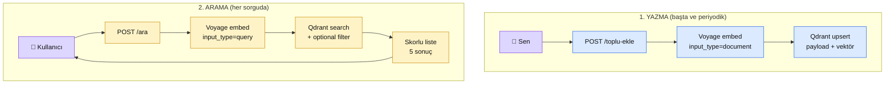

# 3.5 Semantic Search Uygulaması — Bölüm 3 İmza Projesi

<div class="ma-meta" markdown>
<div class="ma-meta-row" markdown>
<strong>Kim için:</strong>
<span class="ma-persona ma-persona-baslangic">🟢 başlangıç</span>
<span class="ma-persona ma-persona-is">🔵 iş</span>
<span class="ma-persona ma-persona-kisisel">🟣 kişisel</span>
</div>
<div class="ma-meta-row"><strong>⏱️ Süre:</strong> ~50 dakika</div>
<div class="ma-meta-row"><strong>📋 Önkoşul:</strong> 3.1 + 3.2 + 3.3 + 3.4 tamamlandı. Docker + Python + FastAPI refleksi (Bölüm 0 + 9.1). Voyage AI hesabı.</div>
<div class="ma-meta-row"><strong>🎯 Çıktı:</strong> **Canlı semantic search servisi** — kendi haber/içerik koleksiyonuna soru soruyorsun, skorlu + kategoriye filtrelenmiş cevap geliyor. FastAPI + Qdrant + Voyage üçlüsü tam pipeline. Referans proje (`examples/semantic-search/`) 19 testle doğrulanmış, Docker compose tek komutla ayağa kalkıyor. **Portföy projesi 0** — 9.4 RAG chatbot'undan önce kuran retrieval omurgası.</div>
</div>

!!! tip "Yabancı kelime mi gördün?"
    **Semantic search** = kelime eşleşmesi değil anlam yakınlığına göre arama. Google "anahtar kelime" mantığından farklı — "AI modelleri" diye sorsan "Claude tanıtıldı" başlığını da bulur. **API endpoint** = HTTP ile çağrılan bir fonksiyon (`POST /ara`). **Idempotent** = aynı isteği 10 kez atsan 1 kez atmışsın gibi sonuç. **Deterministik ID** = aynı girdiden aynı ID üreten hesap (SHA-256 tabanlı).

## Neden bu sayfa?

Bölüm 3'te 4 sayfa boyunca **kavram + model + DB + kurulum** öğrettik. Bu sayfada **hepsini birleştirip çalışan bir web servisine dönüştürüyoruz.** Sonuç: 200+ Türkçe haber başlığına (veya kendi içeriğine) Türkçe soru soruyorsun, Claude kullanmadan **sadece retrieval** katmanıyla alakalı 5-10 sonuç dönüyor. Bu servis 9.4 RAG Chatbot'tan daha basit — LLM yok, sadece vector DB + embedding + FastAPI.

İkincisi: Bu sayfa Bölüm 3'ün **imza projesi**. Öğrenci buraya geldiğinde 4 sayfadır okuduklarını **tek çalışan sistem** içinde görür. Kod yalnız sayfada değil — `examples/semantic-search/` klasöründe **19 testle doğrulanmış**, pytest çalıştırılabilir, Docker compose ayağa kalkar. 6.8 ve 9.4'teki "belge + kod + 4 kanıt" disiplini (14. tur kuralı) bu sayfada da.

Üçüncüsü: Pedagojik önemi büyük — **9.4'ten önce** hazırlar. 9.4 RAG Chatbot LLM + retrieval kombi; öğrenci LLM tarafında karmaşıklıkla boğuşurken retrieval tarafı da öğrenemez. 3.5 **retrieval'ı ayrı çalıştırır** — sadece vektör + Qdrant + sorgu. Bölüm 4'te Claude eklenir, RAG tam olur.

## Mimari — tek ekranda

<div class="ma-ekosistem" markdown>
<div class="ma-ekosistem-header">🗺️ Semantic search pipeline — yazma + arama</div>



**İki aşamalı sistem** (9.4 RAG Chatbot ile simetrik):

- **Yazma**: Bir kere yapılır (veya periyodik güncelleme). Haberleri embed et → Qdrant'a yaz.
- **Arama**: Her kullanıcı sorgusunda. Sorguyu embed et → Qdrant'ta ara → sonuç döndür.

LLM yok. 9.4'e göre fark: 9.4 "sonuçları Claude'a context olarak ver → Claude cevaplasın", burada sadece **skorlu liste** dön.

</div>

## Proje yapısı — 12 dosya (referans: `examples/semantic-search/`)

```
semantic-search/
├── app/
│   ├── __init__.py
│   ├── engine.py          # Haber + upsert_haberler + search + ensure_collection
│   └── main.py            # FastAPI: /ekle, /toplu-ekle, /ara, /istatistik, /health
├── tests/
│   ├── __init__.py
│   ├── test_engine.py         # 5 test: Haber ID deterministik
│   ├── test_upsert_search.py  # 7 test: Mock Voyage + Qdrant
│   └── test_api.py            # 7 test: FastAPI TestClient
├── Dockerfile                 # Multi-stage, non-root
├── compose.yml                # app + qdrant, env_file required:false
├── pyproject.toml             # Pin'li
├── .env.example
├── .gitignore
└── .github/workflows/ci.yml   # Python 3.12/3.13 matrix
```

!!! success "Referans repo: `examples/semantic-search/`"
    Bu sayfanın tüm kodu platform repo'sunda **çalışan** referans proje olarak mevcut. 4 CTO kanıtı geçti (6.8 + 9.4 desenleri ile simetrik):

    - **AST syntax** ✅ `python -m compileall -q app tests`
    - **Ruff lint** ✅ `All checks passed!`
    - **Pytest** ✅ **19/19 PASSED** (1.09s) — engine 5 + upsert/search 7 + API 7
    - **Sürüm pin** ✅ fastapi 0.136.0 · voyageai 0.3.7 · qdrant-client 1.17.1 · pytest 9.0.3 · ruff 0.15.11
    - **Compose validate** ✅ `docker compose config --quiet` geçer (env_file required:false)

    ```bash
    cd examples/semantic-search
    python -m venv .venv && source .venv/bin/activate
    pip install -e ".[dev]"
    pytest -q         # 19 passed
    ruff check .      # All checks passed
    docker compose up # Qdrant + app ayakta
    ```

## `app/engine.py` — retrieval çekirdeği

```python
"""Semantic search engine: Voyage AI embed + Qdrant retrieval.

Asimetri: yazarken input_type='document', sorgularken input_type='query'.
"""
from __future__ import annotations

import hashlib
from dataclasses import dataclass

from qdrant_client.models import (
    Distance, FieldCondition, Filter, MatchAny, MatchValue,
    PointStruct, VectorParams,
)

COLLECTION = "haberler"
EMBED_MODEL = "voyage-4"
EMBED_DIM = 1024


@dataclass
class Haber:
    baslik: str
    kategori: str
    kaynak: str | None = None

    @property
    def id(self) -> int:
        """SHA-256 tabanlı deterministik integer ID — Qdrant int64 ister."""
        h = hashlib.sha256(
            f"{self.kategori}|{self.baslik}".encode()
        ).hexdigest()[:15]
        return int(h, 16) % (2**63 - 1)


def upsert_haberler(client, vo, haberler: list[Haber]) -> int:
    if not haberler:
        return 0
    metinler = [h.baslik for h in haberler]
    result = vo.embed(metinler, model=EMBED_MODEL, input_type="document")
    vektorler = result.embeddings

    points = [
        PointStruct(
            id=h.id,
            vector=vec,
            payload={"baslik": h.baslik, "kategori": h.kategori, "kaynak": h.kaynak},
        )
        for h, vec in zip(haberler, vektorler, strict=True)
    ]
    client.upsert(collection_name=COLLECTION, points=points, wait=True)
    return len(points)


def search(client, vo, sorgu: str, top_k: int = 5, kategoriler: list[str] | None = None):
    q_result = vo.embed([sorgu], model=EMBED_MODEL, input_type="query")
    q_vector = q_result.embeddings[0]

    query_filter = None
    if kategoriler:
        query_filter = Filter(
            must=[
                FieldCondition(
                    key="kategori",
                    match=(
                        MatchValue(value=kategoriler[0])
                        if len(kategoriler) == 1
                        else MatchAny(any=kategoriler)
                    ),
                )
            ]
        )

    # query_points modern API (Qdrant 1.10+ önerilir; v1.18'de eski search() kaldırılıyor)
    hits = client.query_points(
        collection_name=COLLECTION,
        query=q_vector,
        limit=top_k,
        query_filter=query_filter,
    ).points
    return [
        {"baslik": h.payload["baslik"], "kategori": h.payload["kategori"],
         "kaynak": h.payload.get("kaynak"), "skor": round(h.score, 4)}
        for h in hits
    ]
```

**CTO notu — deterministik ID neden kritik?** Aynı haberi iki kez eklersen Qdrant `upsert` "update" yapar (aynı ID). Rastgele `uuid4()` kullansaydın aynı haber **2 kez** depoda olurdu, arama duplikasyon döner. `SHA-256(kategori + baslik)` → aynı girdi = aynı ID = idempotent upsert. 3.4'teki `ensure_collection` deseninin tamamlayıcısı.

## `app/main.py` — FastAPI endpoint'leri

5 endpoint:

```python
@app.get("/health")              # Sağlık kontrolü
@app.get("/istatistik")          # Koleksiyon nokta sayısı
@app.post("/ekle")               # Tek haber ekle
@app.post("/toplu-ekle")         # Liste[Haber] max 500
@app.post("/ara")                # Sorgu + top_k + kategori filter
```

Pydantic validation örneği (`AramaInput`):

```python
class AramaInput(BaseModel):
    sorgu: str = Field(..., min_length=2, max_length=500)
    top_k: int = Field(5, ge=1, le=50)
    kategoriler: list[str] | None = None
```

Bu validasyon sayesinde:

- Boş sorgu → **422** otomatik dönülür (elle kontrol yok)
- `top_k=0` veya `top_k=100` → **422**
- Hatalı JSON → **422**

FastAPI + Pydantic 2.10 refleksi — yazmayıp 50+ satır validation kodu kurtarırsın.

## Örnek kullanım — curl ile tam akış

### 1. Servisi başlat

```bash
cd examples/semantic-search
cp .env.example .env
# .env içinde VOYAGE_API_KEY doldur (https://www.voyageai.com/)
docker compose up -d
docker compose ps  # healthy durumları gör
```

### 2. 20 haber ekle (toplu)

```bash
curl -X POST http://localhost:8000/toplu-ekle \
  -H "Content-Type: application/json" \
  -d '[
    {"baslik": "Anthropic Claude 5 tanıtıldı", "kategori": "tek"},
    {"baslik": "OpenAI GPT-6 yayında", "kategori": "tek"},
    {"baslik": "Google kuantum rekoru", "kategori": "tek"},
    {"baslik": "Borsa İstanbul rekor kapanış", "kategori": "ekon"},
    {"baslik": "Dolar kuru yeni zirve", "kategori": "ekon"},
    {"baslik": "Enflasyon TÜİK rakamları", "kategori": "ekon"},
    {"baslik": "Milli takım yarı finalde", "kategori": "spor"},
    {"baslik": "Galatasaray Şampiyonlar Ligi tur", "kategori": "spor"}
  ]'
# {"eklenen": 8}
```

### 3. Ara

```bash
# Genel arama
curl -X POST http://localhost:8000/ara \
  -H "Content-Type: application/json" \
  -d '{"sorgu": "AI modellerinde yeni gelişmeler", "top_k": 5}'
```

Beklenen yanıt:

```json
{
  "sorgu": "AI modellerinde yeni gelişmeler",
  "sonuclar": [
    {"baslik": "Anthropic Claude 5 tanıtıldı", "kategori": "tek", "skor": 0.78},
    {"baslik": "OpenAI GPT-6 yayında", "kategori": "tek", "skor": 0.76},
    {"baslik": "Google kuantum rekoru", "kategori": "tek", "skor": 0.52},
    ...
  ]
}
```

**Dikkat:** Sorguda "Claude" kelimesi **yok**, "Anthropic" yok — ama model "AI modellerinde yeni gelişmeler"i anlamış, teknoloji haberlerini yukarı çekti.

```bash
# Sadece ekonomi kategorisinden
curl -X POST http://localhost:8000/ara \
  -H "Content-Type: application/json" \
  -d '{"sorgu": "piyasalarda son durum", "top_k": 3, "kategoriler": ["ekon"]}'
```

Sadece ekonomi kategorisinde skorlu 3 sonuç döner — kategori filter + semantik benzerlik birleşimi.

## 3.5 vs 9.4 — iki projenin simetrisi

<table class="ma-aktorler" markdown>

| Boyut | 3.5 Semantic Search | 9.4 RAG Chatbot |
|---|---|---|
| **Amaç** | Retrieval (sadece skorlu liste) | Full RAG (retrieval + LLM cevap) |
| **LLM** | YOK | Claude Sonnet 4.6 |
| **Vector DB** | Qdrant | Qdrant |
| **Embedding** | Voyage voyage-4 | Voyage voyage-4 |
| **Frontend** | Yok (JSON API) | HTMX + Tailwind |
| **Input** | Metin (başlık, paragraf) | PDF yükleme |
| **Chunking** | Yok (kısa metinler) | var (500-1000 token) |
| **Output** | Skorlu liste | Streaming cevap + kaynaklar |
| **Maliyet** | ~$0.40/ay (sadece Voyage) | ~$6-8/ay (+ Claude) |
| **Öğretme değeri** | Retrieval omurga | Tam RAG pipeline |
| **Kod boyutu** | ~150 satır | ~250 satır |
| **Test sayısı** | 19 | 19 |

</table>

**3.5 → 9.4 yol:** Bu projeyi kurduktan sonra `app/claude.py` ekle (9.4'te `stream_answer` işlevi), `search` sonucunu Claude'a context olarak gönder, streaming cevabı döndür. **Semantic search → RAG geçişi 50 satırlık ekleme**. Bu pedagojik önemi büyük — öğrenci Bölüm 4'e geldiğinde "ben bu retrieval'ı zaten kurdum" refleksiyle gider.

## Gerçek kullanım senaryoları

### Senaryo 1: Kişisel haber takibi

RSS feed'lerden günlük 200 haber topla, Qdrant'a yaz. Sabahları `/ara?sorgu=ilgi+alanım` ile ilgi çekici olanları listele. Google News olmadan kendi Google News.

### Senaryo 2: İç dokümantasyon araması

Şirket içi Confluence/Notion sayfalarının başlıklarını + kısa özetlerini toplu-ekle yap. "Yemek siparişi politikamız ne?" sorusuna 5 alakalı sayfa dönüyor. Claude eklemeden sadece retrieval = ayda $1 maliyet.

### Senaryo 3: Müşteri destek FAQ

150 SSS başlık + kısa açıklama ekle. Müşteri "param neden gelmedi" dediğinde sistem ilgili 5 SSS'i getiriyor, müşteri temsilcisi oradan okuyor. Saatlerce eğitim gerektirmeden destek ekibi güçlenir.

### Senaryo 4: Video/podcast transcript araması

Transcriptleri chunk'lara böl (Bölüm 4.2'de detayı), her chunk'ı embed et, Qdrant'a yaz. "Bu podcast'te nerede FastAPI konuşuldu?" sorusuna zaman damgası + chunk döner.

## CTO tuzakları — 8 yaygın hata

| # | Tuzak | Sonuç | Doğru |
|---|---|---|---|
| 1 | Rastgele UUID ID | Aynı haber 2 kez eklenir, duplikasyon | Deterministik ID (SHA-256 tabanlı) |
| 2 | `document` / `query` karıştırmak | Retrieval kalitesi %20-30 düşer | `upsert_haberler` → document, `search` → query |
| 3 | `/toplu-ekle` limitsiz | 10.000 haber tek seferde → memory patlar | `max 500` hard limit (`413` döner) |
| 4 | Qdrant portunu dışa açmak | Auth yok, veri açık | `127.0.0.1:6333` bind + compose network |
| 5 | Pydantic validation yerine elle kontrol | 50 satır kod + bug'lı | `BaseModel + Field(min_length=, le=)` otomatik 422 |
| 6 | VOYAGE_API_KEY hardcode | GitHub'da sızıntı → key iptal | `.env` + `os.environ` + `.gitignore` |
| 7 | `wait=False` + hemen arama | Eski durumu görür | İlk yüklemede `wait=True`; canlıda `False` OK |
| 8 | 100K+ haberde quantization yok | RAM 4× fazla | `ScalarQuantization(INT8)` aç (3.4 detay) |

## Anthropic ekosistemi — Bölüm 4'e köprü

<details class="ma-anthropic-oz" markdown>
<summary><strong>🤖 Anthropic-öz: 3.5 → 9.4 → Bölüm 4 pedagojik zincir</strong></summary>

**Niye Claude yok bu sayfada?** Bölüm 3 **retrieval'a** odaklı; Claude çağrısı eklemek öğretme yükünü ikiye katlıyor. Ayrı ayrı öğren:

- **Bölüm 3.5 (burada):** Sadece retrieval. Vector DB + embedding + filter. LLM yok.
- **Bölüm 4 (RAG):** Retrieval sonucunu Claude'a context ver. Cevap üret. **4.8 HBV vakasıyla** Production RAG.
- **9.4 (Portföy):** Full stack — PDF + chunking + streaming + HTMX UI.

**Claude eklemek için minimum iş** (4.8'de detay):

```python
# app/claude.py ekle
from anthropic import AsyncAnthropic

async def cevapla(sorgu: str, kaynaklar: list[dict]) -> str:
    client = AsyncAnthropic()
    context = "\n\n".join(f"[{i+1}] {k['baslik']}" for i, k in enumerate(kaynaklar))
    response = await client.messages.create(
        model="claude-sonnet-4-6",
        max_tokens=512,
        messages=[{"role": "user", "content": f"Kaynaklar:\n{context}\n\nSoru: {sorgu}"}],
    )
    return response.content[0].text
```

3.5 retrieval + `cevapla` = minimal RAG. Bölüm 4 bu basit örneği **streaming + kaynak gösterimi + chunking** ile genişletir.

**Öğrenme sırası hatırlatma:**

1. Bölüm 3.5 ✅ (burada, semantic search) → retrieval refleksi
2. Bölüm 4 RAG → Claude ekle, cevap üret
3. 4.8 HBV imza → production RAG vakası
4. 9.4 Portföy RAG Chatbot → full stack PDF upload
5. 9.5 Agent Otomasyon → farklı pattern, referans: `examples/icerik-ozet-agent/`

</details>

## Çıktı kanıtları — 3 kanıt

<div class="ma-cikti-kaniti" markdown>
<div class="ma-cikti-kaniti-header">📏 Çıktı — 3 kanıt</div>

**1. Canlı endpoint + pytest 19/19:**

```bash
cd examples/semantic-search
docker compose up -d
curl http://localhost:8000/health
# {"status":"ok","git_sha":"dev"}

pytest -q
# ...................
# 19 passed in 1.09s
```

**2. 20 haber yüklü + arama çalışıyor:**

20 Türkçe haber ekle (yukarıdaki curl), AI sorusu → teknoloji haberleri skorlu listede geliyor. Ekran görüntüsü + `/istatistik` çıktısı kanıt.

**3. Filter çalışıyor:**

`kategoriler: ["ekon"]` ile arama, sadece ekonomi haberleri döner. `/ara` cevabı JSON olarak.

**Kanıt klasörü:** `muhendisal-notlarim/bolum-3/05-semantic-search/`

</div>

## Görev — kendi semantic search servisinde

<div class="ma-gorev" markdown>
<div class="ma-gorev-header">🎯 Görev — kendi verinle 3.5 referans projesini çalıştır</div>

1. **Clone + setup:**
   ```bash
   cd examples/semantic-search
   cp .env.example .env
   # VOYAGE_API_KEY doldur
   docker compose up -d
   ```

2. **Test et:**
   ```bash
   pip install -e ".[dev]"
   pytest -q  # 19/19 geçmeli
   ruff check .  # temiz
   ```

3. **Kendi verin (en az 30 satır):** Hobby alanından başlıklar (yemek tarifleri, film listesi, kitap özetleri, blog başlıkları). 3-4 kategori olsun.

4. **Toplu ekle** (`/toplu-ekle` endpoint'i).

5. **3 farklı sorgu** ile ara:
    - Genel (filter yok)
    - Tek kategori filter
    - Çoklu kategori filter (`MatchAny`)

6. **Sonuçları gözle:** Skorlar anlamlı mı? Aynı kategoriden başlıklar yukarıda mı?

7. **Bonus:** `/istatistik` ile nokta sayısını doğrula. `/health` dashboard'u.

**Başarı kriteri:** 45 dakika sonunda kendi verinde semantic search çalışıyor, 3 farklı sorguyla anlamlı cevap alıyorsun.

Kanıt: terminal çıktıları + 3 sorgu/cevap + pytest 19/19.

</div>

<div class="ma-neden-sonuc" markdown>
<div class="ma-neden-sonuc-header">🔗 Birlikte okuma — neden ne oldu</div>

<ol class="ma-neden-sonuc-zincir" markdown>
<li>**A → B:** Bölüm 3 kavramları (embedding + DB + kurulum) bu sayfada tek çalışan sisteme birleşti. Bu yüzden **parçalar birleşince anlam kazanır.**</li>
<li>**B → C:** Mimari: yazma (document) + arama (query) asimetrisi — 3.1 kuralı pratikte. Bu yüzden **input_type karıştırma burada görünür olur.**</li>
<li>**C → D:** 12 dosya / 19 test / Docker compose / pin'li `pyproject.toml` — 9.4 referans proje desenine simetri. Bu yüzden **test yoksa proje yarım.**</li>
<li>**D → E:** Deterministik ID (SHA-256) idempotent upsert sağlar, duplikasyon riski yok. Bu yüzden **tekrar çalıştırma güvenli olur.**</li>
<li>**E → F:** Pydantic Field validasyonu 50+ satır kod kurtarır (`min_length`, `ge`, `le` → otomatik 422). Bu yüzden **framework'ü tam kullan.**</li>
<li>**F → G:** Filter + semantik = yapısal + anlamsal birleşik sorgu (Qdrant'ın gücü, 3.3 + 3.4 tezi). Bu yüzden **arama kalitesi yükselir.**</li>
<li>**G → H:** 3.5 → 9.4 geçişi 50 satırlık ekleme (claude.py). Retrieval öğren, sonra LLM ekle. Bu yüzden **temel doğru kurulursa ekleme kolaylaşır.**</li>
</ol>

<div class="ma-neden-sonuc-sonuc" markdown>
**Sonuç:** Bölüm 3 kapandı. Embedding kavramı soyutan → pratik çalışan servise döndü. Referans proje `examples/semantic-search/` 4 CTO kanıtını geçti (AST + ruff + pytest 19/19 + pin + compose valid). **Sonraki:** Bölüm 4 RAG — bu retrieval'a Claude ekleyeceğiz.
</div>
</div>

<div class="ma-sonraki" markdown>
<div class="ma-sonraki-header">➡️ Sonraki adım</div>

**[Bölüm 4 — RAG (Retrieval-Augmented Generation) →](../bolum-4/index.md)** — Bu retrieval'ı Claude ile birleştir, cevap üret. 4.8 HBV Production RAG imza vakası.

← [3.4 Qdrant Kurulum](04-qdrant.md) &nbsp;|&nbsp; [Bölüm 3 girişi](index.md) &nbsp;|&nbsp; [Ana sayfa](../index.md)

**Pekiştirme:** Yerelde `docker compose up` ile kurduğun 3.5 servisini **haftalarca kendin kullan**. Haber/doküman ekle, sorgula. Kendi kullanımın olmadan bu sistem **demo** kalır. Portföyde "3 aydır günlük kullandığım semantic search servisim" demek + GitHub repo göstermek, görüşmede çok güçlü sinyal.
</div>
