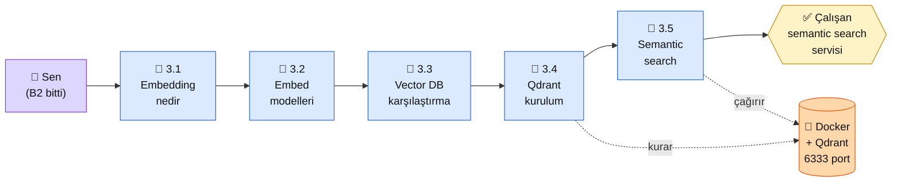

# Bölüm 3 — Embeddings ve Vector DB

**Persona:** Bölüm 2 bitmiş, Claude API çağırabiliyor, prompt yazabiliyor. Şimdi "kendi dokümanlarımı AI'ya sordurmak" istiyor — ama "nasıl?" kısmı muğlak · **Süre:** ~4 saat (5 sayfa, yoğun pratik) · **Önkoşul:** Bölüm 2 tamam, Python + Docker temel bilgisi · **Çıktı:** Kendi metinlerinden "benzer olanı bul" yapan çalışan bir semantic search servisi

## Neden bu bölüm?

Bölüm 2'de Claude'la konuştun ama Claude'un hafızası yok — her çağrı sıfırdan. "Benim PDF'imi okusun sonra soru cevaplasın" demek için **metni vektöre çevirip arayabilir hale getirmek** gerek. Bu bölüm o dönüşümü öğretir.

Embedding platformun en soyut konusu gibi görünür ama aslında "anlam benzerliği = vektör mesafesi" tek cümleyle biter. Yoğunluk vektörün nereden nasıl üretildiği + hangi vektör DB'yi seçeceğin + Qdrant'ı kurup çalıştırmanda — 4 saatlik yatırım.

Üçüncüsü: Bölüm 4 (RAG) tamamen buna dayanır. RAG = Embeddings + Retrieval + LLM. Burayı atlamak mümkün değil.

## Bölüm 3 kısaca

**3.1 — Embedding Nedir.** Bir metni sabit boyutlu sayı dizisine çevirmek ("İstanbul" → `[0.23, -0.11, ..., 0.08]` 1536 boyutlu). Yakın anlamlı metinler yakın vektörler verir (kosinüs benzerliği). Matematiği yok — sezgi var.

**3.2 — OpenAI ve Açık Kaynak Modeller.** OpenAI `text-embedding-3-small` ($0.02/1M token, kaliteli, ücretli) vs açık kaynak `all-MiniLM-L6-v2` (ücretsiz, yerelde çalışır, biraz zayıf) vs `BGE-large` (ücretsiz, güçlü, daha büyük). Karar tablosu: ne zaman hangisi.

**3.3 — Vector DB Karşılaştırma.** Qdrant (önerilen, Rust, hızlı, self-host), Weaviate (GraphQL arayüzü, zengin), Pinecone (managed, SaaS), pgvector (Postgres eklentisi, DB'yi iki yerde tutmak istemeyenlere). Proje tipine göre öneri.

**3.4 — Qdrant Pratik Kurulum.** `docker run qdrant/qdrant` → 6333 portunda açılır. Python istemci + collection oluştur + vektör yaz + ara. Her adım terminal ekran görüntüsüyle.

**3.5 — Semantic Search Uygulaması.** 50 Türkçe haber başlığını embed et, Qdrant'a yaz, yeni bir sorgu gelince 5 benzer haberi döndür. **Bu sayfanın çıktısı senin küçük semantic search servisin** — sonraki bölümlerde RAG'in omurgası.

## Bu bölümün yol haritası

### Aktör tablosu

| Düğüm | Nerede | Ne iş yapıyor |
|---|---|---|
| 👤 **Sen** | Docker kurulu, Python venv aktif | Embed model indir, Qdrant container çalıştır, semantic search çağır |
| 📄 **3.1 Embedding** | Platform (teori + sezgi) | Kavramı oturt — matematik yok |
| 📄 **3.2 Modeller** | Platform (karşılaştırma) | Hangi model senin için: maliyet + kalite + dil desteği |
| 📄 **3.3 Vector DB** | Platform (karşılaştırma) | Qdrant vs Weaviate vs Pinecone vs pgvector seçim matrisi |
| 📄 **3.4 Qdrant** | Docker + terminal | `docker run` → 6333'te ayakta → ilk collection + vektör |
| 🏁 **3.5 Semantic search** | Python + Qdrant | 50 Türkçe haber → embed → yaz → sorgu → 5 benzer |
| 🐳 **Qdrant (Docker)** | Localhost `:6333` | Vektör DB. Arka planda, kapatmazsan yaşar |
| ✅ **Çıktı** | Repo'nda `3-semantic-search/` | Çalışan küçük servis, Bölüm 4'te RAG'in tabanı |

## Bu bölüm bittiğinde elinde ne olacak

- **Embedding sezgisi:** "Anlam benzerliği = vektör mesafesi" cümlesi soyut değil, pratik
- **Model seçim kası:** Yeni proje geldiğinde OpenAI vs BGE vs all-MiniLM arasında fiyat/kalite/lisans dengesiyle seçiyorsun
- **Qdrant çalışır vaziyette:** `docker ps`'te görüyorsun, `:6333/dashboard`'da web UI açılıyor
- **Çalışan semantic search servisi:** 50 Türkçe belge üzerinde arama — kendi belge koleksiyonuna genişletmeye hazır
- **Karşılaştırma tablosu:** Vector DB'ler için kendi notların var (proje-profiline göre hangisini seçersin)

📖 Anthropic bu bölümde ne der — öz

**Dürüst not:** Anthropic'in kendi embedding modeli **yok.** Anthropic docs embedding için [Voyage AI](https://www.voyageai.com/) tavsiye eder — bu Anthropic'in önerdiği üçüncü parti. Biz bu bölümde Voyage AI'yı kısa değiniyoruz (3.2'de) ama ana odak daha yaygın seçenekler (OpenAI + açık kaynak Qdrant).

**1. Anthropic'in embedding politikası.** Anthropic "biz LLM + tool use'a odaklanıyoruz, embedding ekosistemde yeterince güçlü, yeni bir oyuncu eklemiyoruz" duruşu aldı. Bu karar bizim için iyi — tek sağlayıcıya bağımlı kalmıyorsun. Embedding'i istediğin yerden al, Claude'u LLM olarak kullan.

**2. Claude + embedding pratik örneği.** Anthropic Cookbook'ta [Contextual Retrieval](https://github.com/anthropics/claude-cookbooks) örneği — Claude'u **embed edilecek metni daha aranabilir hale getirmek** için kullanır (contextual chunking). Bu Bölüm 4'te yeniden karşımıza çıkacak; 3.5'te tohumlarını atıyoruz.

**Kaynak:** [Anthropic Cookbook — Contextual Embeddings](https://github.com/anthropics/claude-cookbooks) (İngilizce, Jupyter, ücretsiz). 3.5'ten sonra aç — embedding öncesi Claude ile "bağlam zenginleştirme" tekniği burada. Bölüm 4'te derinleşeceğiz, burada giriş okuması faydalı.

## Kural dışı notlar

Bu bölümde Docker zorunlu önkoşul. Docker yoksa 3.4'te duruyorsun — kurulum rehberi 3.4 içinde var ama temel Docker bilgisi varsayılıyor.

---

**Bir sonraki adım →** [3.1 Embedding Nedir](01-embedding-nedir.md) (40 dk, sezgi + ilk kod)

← [Bölüm 2 — LLM ve Prompt](../bolum-2/index.md) &nbsp;|&nbsp; [Ana Sayfa](../index.md)

