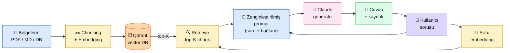

# 4.1 RAG Nedir, Niye Lazım

<div class="ma-meta" markdown>
<div class="ma-meta-row" markdown>
<strong>Kim için:</strong>
<span class="ma-persona ma-persona-baslangic">🟢 başlangıç</span>
<span class="ma-persona ma-persona-is">🔵 iş</span>
<span class="ma-persona ma-persona-kisisel">🟣 kişisel</span>
</div>
<div class="ma-meta-row"><strong>📋 Önkoşul:</strong> Bölüm 2 (Claude API çağrısı) + Bölüm 3 (embedding ve Qdrant kavramı); `ANTHROPIC_API_KEY` aktif</div>
<div class="ma-meta-row"><strong>🎯 Çıktı:</strong> RAG'ın 3 adımını (Embed → Retrieve → Generate) kendi cümlelerinle anlatırsın; fine-tune / context stuffing / RAG üçlüsünü **karar tablosu** üstünden karşılaştırabilirsin; 20 satırlık **naif RAG** prototipini kendi metinlerinle çalıştırırsın.</div>
</div>

!!! tip "Yabancı kelime mi gördün?"
    Bu sayfadaki **italik-altı çizili** ifadelerin (RAG, retrieval, augment, hallucination gibi) üstüne mouse'unu getir — kısa tanım çıkar. Mobilde dokun.

## Neden bu sayfa?

Claude çok şey biliyor — ama **senin belgelerini bilmiyor.** Şirketinin 2025 satış raporunu, dedenin anılarını, Hacı Bayram Vakfı'nın bağış kurallarını, ders notlarını — hiçbirini görmedi. Claude'a "şu PDF'i özetle" deyince geçici olarak bağlamdan okur; "şu konuda bize özel nasıl karar verilmeli?" deyince uyduracaktır. **RAG bu açığı kapatır.**

İkincisi: 2025-2026'nın **her kurumsal chatbot'u** RAG üstüne kurulu. OpenAI Custom GPTs, Claude Projects, Notion AI, Glean, Perplexity Spaces — hepsi aynı desen: kullanıcının dokümanlarını vektör veritabanına at, soru gelince ilgili parçaları bul, Claude'a "şu bağlamda cevapla" de. Bu bölümü bitirdiğinde **sana özel bir "Perplexity" kurabiliyor olacaksın** — mühendislik olarak.

Üçüncüsü: RAG **basit görünür, production'da kırılır.** "Niye cevap saçma geliyor?" sorusunun cevabı 9/10 kez retrieval kalitesinde. Bu sayfa kavram katmanı; 4.2-4.5 pratik hata noktalarını teker teker çözüyor. Naif RAG = 1 gün, production RAG = 2 hafta. Bu gerçeği bilmek = projeni doğru planlamak.

## RAG kısaca — üç paragraf, matematiksiz

**RAG = Retrieval-Augmented Generation. Üç adım.** (1) **Embed:** Belgelerini küçük parçalara böl, her parçanın anlamsal "koordinatını" (embedding vektörü) hesapla, vektör veritabanına (Qdrant gibi) koy. (2) **Retrieve:** Kullanıcı soru sorduğunda, sorunun embedding'ini hesapla, vektör DB'de en benzer 3-10 parçayı bul. (3) **Generate:** Bulunan parçaları sistem promptuna koy, Claude'a "şu bağlamda cevapla, kaynak yoksa bilmiyorum de" talimatını ver.

**RAG vs fine-tune:** Fine-tune = modelin ağırlıklarını değiştir (pahalı, saatlerce, veri + GPU gerek). RAG = bağlamı akıllıca yönet (ucuz, anlık, veri yeterli). Yeni bir ürünün fiyatı gelince fine-tune'u yeniden çalıştıramazsın; **RAG tabanını güncellersen 1 saniyede** Claude yeni fiyatı biliyor. Bu yüzden kurumsal AI **%95 RAG**, çok nadir fine-tune.

**Naif RAG vs production RAG.** Naif = 20 satır kod, demo'ya yarar. Production = chunking stratejisi + hibrit retrieval + re-ranking + contextual retrieval + eval + caching + hata yolları. 20 satır → 2000 satır arası bir yelpaze. Bu bölüm o yelpazenin nasıl tırmanılacağını adım adım gösterir.

## Bu sayfanın ekosistemi — kim kime ne veriyor

<div class="ma-ekosistem" markdown>
<div class="ma-ekosistem-header">🗺️ Ekosistem — RAG'ın üç adımı uçtan uca</div>



<table class="ma-aktorler" markdown>

| Düğüm | Nerede | Ne iş yapıyor |
|---|---|---|
| 📄 **Belgelerin** | Disk / DB / URL listesi | RAG'ın "bilgi kaynağı" — Claude'un görmediği senin dokümanların |
| ✂️ **Chunking + Embedding** | Python script (offline, bir kerelik) | Her belgeyi küçük parçalara böl, her parçanın embedding vektörünü hesapla |
| 🗄️ **Qdrant / vektör DB** | Docker container veya cloud | Embedding'leri sakla; anlamsal arama (cosine/dot) hızlı yapılsın diye indexler |
| 👤 **Kullanıcı sorusu** | Chat arayüzü / API | Doğal dilde soru |
| 🔢 **Soru embedding** | Python, **aynı** embedding modeli | Sorunun embedding'ini belgelerle **aynı uzayda** hesapla (aynı model şart) |
| 🔍 **Retrieve** | Qdrant sorgusu | Soru vektörüne en yakın K parçayı getir (K=3-10 tipik) |
| 📝 **Zenginleştirilmiş prompt** | Python'da string birleştirme | Sistem prompt + bulunan chunks + kullanıcı sorusu |
| 🤖 **Claude generate** | api.anthropic.com | Prompt'u alır, bağlamdan cevap üretir; yoksa "bilmiyorum" der |
| 💬 **Cevap + kaynak** | JSON response | Cevap metni + hangi chunk'tan geldiği (attribution) |

</table>
</div>

## Uygulama — iki yol

### Yol A — Naif RAG (25 satır, bellek içi)

Qdrant kurmadan, sadece Python listesi ile — kavramı kafana oturtmak için:

```python
import anthropic
from sentence_transformers import SentenceTransformer  # pip install sentence-transformers
import numpy as np

# 1) BELGELER (gerçekte PDF'ten okunur, bu basit örnek)
BELGELER = [
    "Hacı Bayram-ı Veli Vakfı 2026 kurban bayramında büyükbaş için 14.000 TL alır.",
    "Vakfın IBAN'ı TR12 3456 7890 ile başlar; ödemeler bu hesaba yapılır.",
    "Kurban bağışları Bayram'dan önce en geç 27 Mayıs 2026 saat 23:00'a kadar kabul edilir.",
    "Vakıf yetkilisi WhatsApp üzerinden +90 312 ... numarasıyla bilgi verir.",
    "Yurtdışı bağışlar için fiyatlar farklıdır; USD bazlı ayrı tarife uygulanır.",
]

# 2) EMBEDDING — tüm belgelerin vektörünü al (offline, bir kerelik)
embedder = SentenceTransformer("sentence-transformers/paraphrase-multilingual-mpnet-base-v2")
belge_vec = embedder.encode(BELGELER)  # shape: (5, 768)

def retrieve(soru: str, k: int = 2) -> list[str]:
    """Soru embedding'ini hesapla, en yakın k belgeyi döndür."""
    soru_vec = embedder.encode([soru])[0]
    # cosine benzerlik (normalize edilmiş vektörler için dot product)
    benzerlik = belge_vec @ soru_vec
    top_idx = np.argsort(benzerlik)[::-1][:k]
    return [BELGELER[i] for i in top_idx]

# 3) GENERATE — bulunan belgeleri Claude'a ver
client = anthropic.Anthropic()

def rag_cevap(soru: str) -> str:
    chunks = retrieve(soru, k=2)
    baglam = "\n".join(f"- {c}" for c in chunks)

    r = client.messages.create(
        model="claude-sonnet-4-6",
        max_tokens=400,
        system=(
            "Sen bir vakıf asistanısın. Aşağıdaki <baglam> içindeki bilgilerle "
            "cevap ver. Bağlam dışına çıkma — bilgi yoksa 'kaynaklarımda bulamadım' de."
        ),
        messages=[{
            "role": "user",
            "content": f"<baglam>\n{baglam}\n</baglam>\n\nSoru: {soru}"
        }],
    )
    return r.content[0].text


# TEST
for soru in [
    "Kurban fiyatı ne kadar?",
    "Bayramdan sonra bağış yapabilir miyim?",
    "Başkanın adı nedir?",  # kaynakta yok — 'bilmiyorum' demeli
]:
    print(f"\n❓ {soru}")
    print(f"💬 {rag_cevap(soru)}")
```

Beklenen çıktı (yaklaşık):

```
❓ Kurban fiyatı ne kadar?
💬 Kaynaklarımdaki bilgiye göre Hacı Bayram-ı Veli Vakfı 2026 kurban
bayramında büyükbaş için 14.000 TL alır. Yurtdışı bağışlar için USD
bazlı ayrı tarife uygulanır.

❓ Bayramdan sonra bağış yapabilir miyim?
💬 Kurban bağışları Bayram'dan önce en geç 27 Mayıs 2026 saat 23:00'a
kadar kabul edilir — bu tarihten sonrasını kaynaklarımda bulamadım.

❓ Başkanın adı nedir?
💬 Kaynaklarımda vakıf başkanının adı ile ilgili bir bilgi bulamadım.
```

**Burada olan nedir (diyagram referansı):** Diyagramın tam uygulaması, Qdrant yerine bellekte numpy array. `retrieve()` = 🔍 düğümü, `rag_cevap()` = 📝 + 🤖 düğümü. 3. soru RAG'ın **en değerli davranışı**: "kaynakta yok" deme, uydurmama.

### Yol B — Aynı mantık, Qdrant + async (production'a yakın)

```python
import anthropic
from qdrant_client import AsyncQdrantClient
from qdrant_client.models import Distance, VectorParams, PointStruct
from sentence_transformers import SentenceTransformer
import asyncio

# Qdrant Docker'da :6333'te (Bölüm 3.4)
qdrant = AsyncQdrantClient(url="http://localhost:6333")
COLLECTION = "hbv_bilgi"
embedder = SentenceTransformer("sentence-transformers/paraphrase-multilingual-mpnet-base-v2")

async def indexle(belgeler: list[str]):
    """Offline adım — bir kere çalıştırılır."""
    await qdrant.recreate_collection(
        collection_name=COLLECTION,
        vectors_config=VectorParams(size=768, distance=Distance.COSINE),
    )
    vektorler = embedder.encode(belgeler)
    await qdrant.upsert(
        collection_name=COLLECTION,
        points=[
            PointStruct(id=i, vector=v.tolist(), payload={"metin": b})
            for i, (b, v) in enumerate(zip(belgeler, vektorler))
        ],
    )

async def retrieve_async(soru: str, k: int = 3) -> list[str]:
    qvec = embedder.encode([soru])[0].tolist()
    r = await qdrant.search(
        collection_name=COLLECTION,
        query_vector=qvec,
        limit=k,
    )
    return [hit.payload["metin"] for hit in r]

async def rag_cevap_async(soru: str) -> str:
    chunks = await retrieve_async(soru, k=3)
    baglam = "\n".join(f"- {c}" for c in chunks)
    client = anthropic.AsyncAnthropic()
    r = await client.messages.create(
        model="claude-sonnet-4-6",
        max_tokens=400,
        system="Bağlamdan cevap ver; yoksa 'bilmiyorum' de.",
        messages=[{"role": "user", "content": f"<baglam>\n{baglam}\n</baglam>\n\n{soru}"}],
    )
    return r.content[0].text
```

**Burada olan nedir (diyagram referansı):** Yol A'nın bellekte yaptığı işi Qdrant kalıcı olarak yapıyor. 1 belge vs 1 milyon belge arasındaki fark: Qdrant milisaniyede arar, RAM'e sığmasına gerek yok. `AsyncAnthropic` + `AsyncQdrantClient` = FastAPI'de paralel kullanıcıya cevap.

### RAG vs Fine-tune vs Context Stuffing — karar tablosu

| Kriter | **Fine-tune** | **Context stuffing** | **RAG** |
|---|---|---|---|
| İlk kurulum süresi | 1-5 gün (eğitim) | 5 dk (PDF'i prompt'a yapıştır) | 1 gün (naif) — 2 hafta (prod) |
| Yeni belge eklemek | Yeniden eğit (saatler) | Her çağrıda prompt'a ekle | Index'e upsert (saniye) |
| Belge sayısı limiti | Yok (model içine yediriyor) | Context window (~200K token) | Milyonlarca (DB genişler) |
| Maliyet / sorgu | Düşük (tek model çağrı) | **Çok yüksek** (uzun prompt her seferinde) | Orta (kısa prompt + top-K chunk) |
| Güncellik | Eğitim tarihinde donuk | Prompt ne kadar güncel olursa | Canlı (index'i güncelle, anlık etki) |
| Kaynak gösterme | ❌ Yok (nereden bildiği belirsiz) | Zor (tüm prompt bağlam) | ✅ Kolay (hangi chunk geldi biliniyor) |
| Halüsinasyon kontrolü | Düşük | Orta | **Yüksek** ("bağlam dışı cevap verme") |
| Kurumsal kullanıma uyum | Düşük | Orta | **Yüksek** |

**Karar kuralı:** %95 durumda cevap **RAG**. Fine-tune sadece dil/tarz öğretmek için (örn: şirket tonu), asla **bilgi ekleme** için. Context stuffing PDF özetleme gibi tek-seferlik görevler için.

<div class="ma-anthropic-oz" markdown>
<div class="ma-anthropic-oz-header">📖 Anthropic bu konuyu nasıl anlatıyor — öz</div>

Anthropic RAG konusunda **en net tavrı alan** AI şirketidir:

**1. "Fine-tune değil, prompt + RAG."** Anthropic 2024-2026 boyunca tutarlı mesajı: Claude genel fine-tune'a kapalıdır, çünkü "prompt engineering + RAG hemen hemen her kullanım için yeterlidir." Bu tercih Anthropic API'sini ucuz tutar (tek model herkese); RAG'ı Anthropic ekosisteminin **birincil veri stratejisi** yapar.

**2. Contextual Retrieval — Anthropic'in kendi tekniği.** 2024 Eylül'ünde Anthropic blog'u "Introducing Contextual Retrieval" yayınladı: RAG'ın en büyük problemi chunk'ın bağlamından koparılması, çözüm her chunk'a Claude ile özet başlık üretip embedding'i onunla almak. **%49 daha az arama hatası.** 4.2'de detay.

**3. Claude long-context'e dayanıklı.** 200K token pencereye gerçekten dayanıyor — "needle in haystack" testlerinde Claude Sonnet 4.x'in bulma oranı yüksek. Uzun bağlam = büyük top-K = RAG kalitesi. Diğer modellerde "effective context" 32K civarı, Claude'da 180K+.

??? info "Teknik detay — isteyene (parameter adları, mekanikler, edge case'ler)"

    **Embedding modeli Anthropic'te yok.** Claude text generate eder, embedding için Voyage AI (Anthropic'in partner önerisi) veya open-source (sentence-transformers, BGE, E5) kullanılır. 3.2'de detay.

    **Prompt caching ile RAG.** Sistem prompt + sabit bağlam parçaları cache'lenir; kullanıcı sorusu + değişken chunks cache dışı. 1024+ token uzunluklar için %90 tasarruf. 4.4'te uygulama.

    **"I don't know" davranışı.** Claude eğitiminde bilmediğini bilme disiplini var — sistem prompt'unda `"If the context doesn't contain the answer, say 'I don't know' in Turkish"` talimatı etkili. Diğer modellerde bu davranış zayıf.

    **Attribution (kaynak gösterme).** Claude'a `"After each sentence, cite the source chunk index"` dersen, `[chunk 2]` tarzı inline atıf üretir. Hukuki/finansal RAG'da şart. Bölüm 4.4'te detay.

    **Token ekonomisi RAG'da.** Her sorgu = küçük soru + K adet chunk (~500 token/chunk). K=5 → 2500 chunk token + 200 soru + 400 cevap = ~3000 token/sorgu. Aylık 10K sorgu × 3000 token = 30M token → Sonnet 4.x'te ~$90 input + $60 output = ~$150/ay. Fine-tune'un kıyasla ~%70 ucuz.

    **Multi-modal RAG.** PDF içinde tablo/grafik varsa metin embedding yetmez. Claude vision + OCR pipeline'ı kurarsın; görsel parçaları base64 ile prompt'a eklersin. Bölüm 7'de detay.

<div class="ma-anthropic-oz-kaynak" markdown>
**Kaynak:** [Anthropic News — Introducing Contextual Retrieval](https://www.anthropic.com/news/contextual-retrieval) (EN, ~15 dk). RAG'ın en güçlü Anthropic makalesi. Pekiştirme: [Anthropic Cookbook — contextual-embeddings](https://github.com/anthropics/anthropic-cookbook/tree/main/skills/contextual-embeddings) — aynı tekniğin çalışır Jupyter notebook'u.
</div>
</div>

<div class="ma-cikti-kaniti" markdown>
### 📦 Bu sayfayı bitirdiğini nasıl kanıtlarsın

#### 1. 📝 Refleksiyon yazısı — 5 dakika

> "Naif RAG denedim. Belgelerim [şu]du. 3 soru sordum: (1) [bağlamda vardı, cevap doğru], (2) [kısmen vardı, Claude iyi birleştirdi], (3) [bağlamda yoktu, Claude 'bilmiyorum' dedi]. Fine-tune vs RAG farkını şöyle anladım: [kendi cümlen]. Kendi projemde kullanacağım RAG şöyle olacak: [belge kaynağı + tipik soru]."

Kaydet: `muhendisal-notlarim/bolum-4/01-rag-nedir/refleksiyon.txt`

#### 2. 📸 Ekran görüntüsü — 3 dakika

**Neyin görüntüsü:** Yol A terminal çıktısı — 3 soru × 3 cevap, özellikle "bağlamda yok → bilmiyorum" davranışı görünür.

| OS | Kısayol |
|---|---|
| Windows | `Win + Shift + S` |
| Mac | `Cmd + Shift + 4` |
| Linux | `Shift + PrtScr` |

Kaydet: `muhendisal-notlarim/bolum-4/01-rag-nedir/naif-rag-cikti.png`

#### 3. 💻 Kendi belgelerinle naif RAG + GitHub — 10 dakika

Yol A kodunu **kendi metinlerinle** (şirket FAQ'un, ders notların, favori kitap özetin — 10+ cümle) çalıştır. 5 soru sor — 3'ü bağlamda olsun, 2'si olmasın. Beklenen davranışı gör. [gist.github.com](https://gist.github.com)'a kod + çıktı yükle.

Gist linkini kaydet: `muhendisal-notlarim/bolum-4/01-rag-nedir/kendi-rag-gist.txt`

</div>

<div class="ma-neden-sonuc" markdown>
<div class="ma-neden-sonuc-header">🔗 Birlikte okuma — neden ne oldu</div>

- **A → B:** Claude genel bilgiye sahip ama **senin belgelerine sahip değil** — eğitim verisine girmemiş bilgiler gözünden kaçar.
- **B → C:** Fine-tune pahalı + yavaş + güncel tutmak zor → **bilgi eklemenin yanlış aracı.**
- **C → D:** Context stuffing = "her çağrıda tüm PDF'i prompt'a yapıştır" → context window + maliyet duvarına çarpar.
- **D → E:** RAG = "soruyla alakalı 3-10 parçayı akıllıca getir" → hem hızlı hem ucuz hem güncel.
- **E → F:** Kaliteli RAG ≠ "naif RAG". 4.2-4.5 üretim seviyesine tırmanıyor; her basamak bir hata noktasını çözüyor.

<div class="ma-neden-sonuc-sonuc" markdown>
**Sonuç:** RAG bu bölümde öğreneceğin en değerli araç. Portföyündeki RAG projesi = iş görüşmesinde gösterebileceğin **en güçlü kanıt** (çünkü gerçek kurumsal senaryo). Bu sayfa kavramın iskeletini kurdu; 4.2 chunking = RAG'ı iyi yapan ya da berbat eden ilk ayar düğmesi.
</div>
</div>

<div class="ma-sonraki" markdown>
<div class="ma-sonraki-header">➡️ Sonraki adım</div>

**[4.2 Chunking Stratejileri →](02-chunking.md)** — Belgeyi nasıl böleceğin RAG kalitesini belirler. 4 strateji (sabit/cümle/paragraf/semantik) + **Anthropic Contextual Chunking** ile arama hatasını %49 azaltma.

← [Bölüm 4 girişi](index.md) &nbsp;|&nbsp; [Ana sayfa](../index.md)

**Pekiştirme:** [Anthropic News — Introducing Contextual Retrieval](https://www.anthropic.com/news/contextual-retrieval) blog yazısını oku (15 dk). 4.2'ye girerken hem kavramı hem de Anthropic'in "niye böyle" tezini anlamış olacaksın.
</div>
