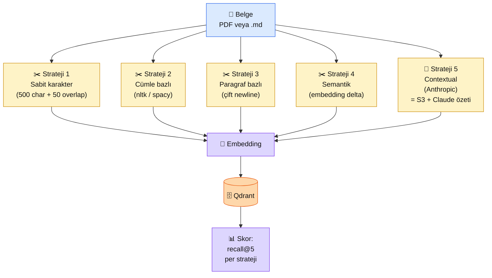

# 4.2 Chunking Stratejileri

<div class="ma-meta" markdown>
<div class="ma-meta-row" markdown>
<strong>Kim için:</strong>
<span class="ma-persona ma-persona-baslangic">🟢 başlangıç</span>
<span class="ma-persona ma-persona-is">🔵 iş</span>
<span class="ma-persona ma-persona-kisisel">🟣 kişisel</span>
</div>
<div class="ma-meta-row"><strong>⏱️ Süre:</strong> ~35 dakika</div>
<div class="ma-meta-row"><strong>📋 Önkoşul:</strong> 4.1 naif RAG çalıştı; Claude API + Python embedder hazır</div>
<div class="ma-meta-row"><strong>🎯 Çıktı:</strong> Aynı belgeyi **4 farklı stratejiyle** bölersin, her birinin aynı soruya dönen cevap kalitesini karşılaştırırsın; **Anthropic Contextual Retrieval** tekniğini kendi belgelerine uygularsın; "hangi chunking ne zaman" sorusuna somut cevap verirsin.</div>
</div>

!!! tip "Yabancı kelime mi gördün?"
    Bu sayfadaki **italik-altı çizili** ifadelerin (chunk, overlap, contextual, semantic gibi) üstüne mouse'unu getir — kısa tanım çıkar. Mobilde dokun.

## Neden bu sayfa?

RAG'da **kötü chunking = kötü cevap.** Neden? Çünkü Claude'a giden bağlam "parça parça" olur — bir cümle ortadan kesilir, tablo bir chunk'ta başlık başka chunk'ta, referans "yukarıda belirtildiği gibi" havada kalır. Claude yamuk bağlamdan düzgün cevap **üretemez**; ya yanlış söyler ya "bilmiyorum" der. Cevap kalitesinin **%40'ı** buradan gelir.

İkincisi: **Anthropic 2024 Eylül'ünde** bu problemi kitabi şekilde çözdü — "Contextual Retrieval" tekniği. Her chunk'a, Claude ile **özet başlık** ürettirip embedding'i başlıkla beraber alıyorsun. Sonuç: aynı belge, aynı sorular, **%49 daha az arama hatası.** Bu teknik 2026 itibarıyla production RAG'ın default'u olmaya başladı. Bu sayfa tekniği **kendi belgelerinle** uygulatacak.

Üçüncüsü: Chunking "bir kere kurulur, yüz kere kullanılır". İndekslemeyi doğru yapmazsan, tüm RAG pipeline'ının kalite tavanı kırılır. Retrieval süper olsa bile **yanlış chunk'lar gelir**, Claude süper olsa bile **kırık bağlamdan cevap üretemez.** Bu yüzden chunking RAG'da **ilk yatırımı yapılması gereken yer.**

## Chunking kısaca — üç paragraf, matematiksiz

**Chunking = belgeyi hangi sınırlarla böleceksin.** Dört ana strateji: (1) **sabit karakter** — "her 500 karakterde bir böl", en kolay ama cümleleri ortadan kırar; (2) **cümle bazlı** — nokta/soru/ünlem sonrası böl, daha iyi ama paragraf bütünlüğünü bozabilir; (3) **paragraf bazlı** — boş satırdan böl, en doğal ama paragraflar çok uzun olabilir; (4) **semantik** — embedding farkına bak, "konu değişti" noktasında böl, en kaliteli ama en pahalı.

**Chunk boyutu ve overlap kritik.** Çok küçük chunk (100 token) = bağlam koparılır, Claude yetersiz bilgi görür. Çok büyük chunk (2000 token) = top-K getirirken alakasız içerik karışır, maliyet patlar. Tatlı nokta **400-800 token**. `overlap` = ardışık chunk'ların son/ilk 50-100 token'ı paylaşması — sınırda kalan bilgi iki chunk'ta da bulunsun diye.

**Contextual chunking = Anthropic'in ekstra katmanı.** Normalde chunk'ı olduğu gibi embedding'liyorsun. Contextual'da: chunk'a Claude'dan "bu chunk bu belgede hangi konunun parçası?" diye **50-100 token'lık özet başlık** ürettiriyorsun, embedding'i **başlık + chunk** birleşiminden alıyorsun. Başlık = arama sırasında "bu chunk ne hakkında" sinyalini güçlendiriyor. Embedding uzayında chunk'lar **anlamlarını kaybetmeden** duruyor.

## Bu sayfanın ekosistemi — kim kime ne veriyor

<div class="ma-ekosistem" markdown>
<div class="ma-ekosistem-header">🗺️ Ekosistem — aynı belge, beş farklı chunking yolu</div>



<table class="ma-aktorler" markdown>

| Düğüm | Nerede | Ne iş yapıyor |
|---|---|---|
| 📄 **Belge** | Disk (PDF/MD/TXT) | Kaynak metin — HBV kılavuzu, teknik doküman, vs. |
| ✂️ **Strateji 1 Sabit** | Python `text[i:i+500]` | En kolay, cümleleri kesebilir. Demo'da yeter, prod'da riskli |
| ✂️ **Strateji 2 Cümle** | `nltk` veya `spacy` cümle ayırıcı | Cümle bütünlüğü korunur, paragraf içeriği kopabilir |
| ✂️ **Strateji 3 Paragraf** | `text.split("\n\n")` | En doğal sınır, paragraf uzunsa hâlâ sorunlu |
| ✂️ **Strateji 4 Semantik** | Peşpeşe cümlelerin embedding farkına bak | Kaliteli, ama indexleme **10x pahalı** (her cümleyi embed et) |
| 🚀 **Strateji 5 Contextual** | Strateji 3 + Claude'dan özet başlık | Anthropic önerisi, **%49 arama kalitesi** — ek maliyet chunk başına bir Claude çağrısı |
| 🔢 **Embedding** | Voyage AI / sentence-transformers | Chunk'ı (veya başlık+chunk'ı) vektöre çevir |
| 🗄️ **Qdrant** | Docker :6333 | 5 collection = 5 strateji — yan yana karşılaştırma |
| 📊 **Skor** | Eval script | 20 soru test setinde her strateji için recall@5 |

</table>
</div>

## Uygulama — iki yol

### Yol A — 4 stratejiyi karşılaştır (çalışan kod)

Bu kod aynı belgeyi 4 farklı stratejiyle böler, her birinin 3 örnek soruya dönen top-1 chunk'ını yan yana gösterir:

```python
from sentence_transformers import SentenceTransformer
import numpy as np
import re

# --- KAYNAK METİN (gerçek senaryoya benziyor) ---
METIN = """\
Hacı Bayram-ı Veli Vakfı hakkında genel bilgiler.

Vakıf 1985'te Ankara'da kurulmuştur; amacı eğitim ve sosyal yardım.

Kurban bağış tarifeleri 2026:
Büyükbaş (sığır) hissesi: 14.000 TL
Küçükbaş (koyun) bir adet: 8.000 TL
Vekaletin son günü 27 Mayıs 2026 saat 23:00'tır.

Yurtdışı bağışlar farklı hesaplanır. USD tarifesi için büyükbaş hissesi 500 USD,
küçükbaş 250 USD'dir. Ödemeler PayPal veya banka havalesi ile yapılır.

Teslim ve bilgilendirme. Bağış sonrası kullanıcıya WhatsApp üzerinden bilgi
verilir. Kesim sonrası fotoğraf paylaşılır. Eğer fotoğraf istenmiyorsa kullanıcı
bunu baştan belirtmelidir.

İletişim ve IBAN. Vakıf yetkilisi 0312 ... numarasından aranabilir. Banka
hesabı Ziraat Bankası'nda açıktır, IBAN TR12 3456 7890 ile başlar.
"""

# --- STRATEJİLER ---
def chunk_sabit(metin: str, boyut: int = 300, overlap: int = 50) -> list[str]:
    """Strateji 1 — sabit karakter + overlap."""
    ch = []
    i = 0
    while i < len(metin):
        ch.append(metin[i:i + boyut])
        i += boyut - overlap
    return ch

def chunk_cumle(metin: str) -> list[str]:
    """Strateji 2 — cümle bazlı (basit regex; prod'da nltk/spacy)."""
    cumleler = re.split(r'(?<=[.!?])\s+', metin.strip())
    # Kısa cümleleri birleştir (<200 char)
    ch, buf = [], ""
    for c in cumleler:
        if len(buf) + len(c) < 400:
            buf = (buf + " " + c).strip()
        else:
            if buf:
                ch.append(buf)
            buf = c
    if buf:
        ch.append(buf)
    return ch

def chunk_paragraf(metin: str) -> list[str]:
    """Strateji 3 — boş satırdan böl."""
    return [p.strip() for p in metin.split("\n\n") if p.strip()]

def chunk_semantik(metin: str, embedder, esik: float = 0.6) -> list[str]:
    """Strateji 4 — cümle embedding farkı, 'konu değişti' sınırı.
    Basitleştirilmiş — gerçek: LangChain SemanticChunker veya LlamaIndex."""
    cumleler = re.split(r'(?<=[.!?])\s+', metin.strip())
    if not cumleler:
        return []
    vecs = embedder.encode(cumleler)
    ch, buf = [cumleler[0]], vecs[0]
    for i in range(1, len(cumleler)):
        benzerlik = float(np.dot(buf, vecs[i]) / (np.linalg.norm(buf) * np.linalg.norm(vecs[i])))
        if benzerlik < esik:  # kopma var — yeni chunk başlat
            ch[-1] = " ".join(filter(None, [ch[-1]]))
            ch.append(cumleler[i])
            buf = vecs[i]
        else:
            ch[-1] += " " + cumleler[i]
            buf = (buf + vecs[i]) / 2  # kayan ortalama
    return ch


# --- KARŞILAŞTIRMA ---
embedder = SentenceTransformer("sentence-transformers/paraphrase-multilingual-mpnet-base-v2")
strateji = {
    "1-sabit":     chunk_sabit(METIN),
    "2-cumle":     chunk_cumle(METIN),
    "3-paragraf":  chunk_paragraf(METIN),
    "4-semantik":  chunk_semantik(METIN, embedder),
}

sorular = [
    "Yurtdışı bağış fiyatı ne kadar?",
    "IBAN bilgisi nedir?",
    "Bağıştan sonra fotoğraf istemezsem ne olur?",
]

for ad, chunks in strateji.items():
    print(f"\n{'='*60}\n📦 {ad.upper()} — {len(chunks)} chunk\n{'='*60}")
    cvec = embedder.encode(chunks)
    for s in sorular:
        qv = embedder.encode([s])[0]
        top = int(np.argmax(cvec @ qv))
        snippet = chunks[top][:140].replace("\n", " ")
        print(f"  ❓ {s}")
        print(f"  ↳ {snippet}...")
```

**Beklenen gözlem:**

```
============================================================
📦 1-SABIT — 8 chunk
============================================================
  ❓ Yurtdışı bağış fiyatı ne kadar?
  ↳ Yurtdışı bağışlar farklı hesaplanır. USD tarifesi için büyükbaş hissesi 500 USD,
     küçükbaş 250 USD'dir. Ödemeler P...

  ❓ IBAN bilgisi nedir?
  ↳ ... karakter kesildiği için IBAN'ın yarısı bir chunk'ta, devam diğer chunk'ta
     — Claude TR12 ile başlayıp yarım kalmış metin görür ❌

============================================================
📦 2-CUMLE — 6 chunk
============================================================
  ❓ IBAN bilgisi nedir?
  ↳ Banka hesabı Ziraat Bankası'nda açıktır, IBAN TR12 3456 7890 ile başlar. ✅

============================================================
📦 3-PARAGRAF — 5 chunk
============================================================
  ❓ Bağıştan sonra fotoğraf istemezsem ne olur?
  ↳ Teslim ve bilgilendirme. Bağış sonrası kullanıcıya WhatsApp ...
     Eğer fotoğraf istenmiyorsa kullanıcı bunu baştan belirtmelidir. ✅
```

**Burada olan nedir (diyagram referansı):** Strateji 1 (sabit) cümleleri kesiyor → IBAN parçalanıyor. Strateji 2-3 (cümle/paragraf) cümle bütünlüğünü koruyor → IBAN tek chunk'ta. Strateji 4 (semantik) konu değişimlerinde kesiyor — "yurtdışı bağış" ile "teslim" bölümleri ayrı chunk'larda daha net.

### Yol B — Anthropic Contextual Chunking (strateji 5, en kaliteli)

Her paragraf chunk'ına Claude ile **"bu belgede hangi konunun parçası" özeti** ekleyip, embedding'i özet+chunk'tan al:

```python
import anthropic
from sentence_transformers import SentenceTransformer

client = anthropic.Anthropic()
embedder = SentenceTransformer("sentence-transformers/paraphrase-multilingual-mpnet-base-v2")

def contextual_baslik(tam_belge: str, chunk: str) -> str:
    """
    Anthropic Contextual Retrieval — chunk için özet başlık üret.
    https://www.anthropic.com/news/contextual-retrieval
    """
    prompt = f"""<document>
{tam_belge}
</document>

Yukarıdaki belgede şu chunk'ın ana konusunu 1-2 cümlede Türkçe özetle:

<chunk>
{chunk}
</chunk>

Sadece özet başlığı yaz, başka açıklama verme."""

    r = client.messages.create(
        model="claude-haiku-4-5-20251001",   # ucuz + hızlı yeter
        max_tokens=150,
        messages=[{"role": "user", "content": prompt}],
    )
    return r.content[0].text.strip()


# Paragraf chunks (strateji 3) + Contextual
chunks = chunk_paragraf(METIN)
contextual_chunks = []
for c in chunks:
    baslik = contextual_baslik(METIN, c)
    zenginlestirilmis = f"{baslik}\n---\n{c}"
    contextual_chunks.append(zenginlestirilmis)

# Embedding'i başlık+chunk'tan al
cvec = embedder.encode(contextual_chunks)

# ÖRNEK GÖZLEM — soruya nasıl cevap veriyor
soru = "Bağıştan sonra fotoğraf istemezsem ne olur?"
qv = embedder.encode([soru])[0]
top_idx = int(np.argmax(cvec @ qv))
print(f"\n❓ {soru}")
print(f"📑 Contextual başlık: {contextual_chunks[top_idx].split('---')[0].strip()}")
print(f"📄 Chunk: {chunks[top_idx][:200]}...")
```

**Beklenen çıktı:**

```
❓ Bağıştan sonra fotoğraf istemezsem ne olur?
📑 Contextual başlık: Bu bölüm HBV'nin bağış sonrası bilgilendirme sürecini,
   WhatsApp üzerinden iletişimi ve kullanıcının fotoğraf paylaşım tercihini
   nasıl belirteceğini açıklar.
📄 Chunk: Teslim ve bilgilendirme. Bağış sonrası kullanıcıya WhatsApp...
```

**Burada olan nedir (diyagram referansı):** Başlık olmadan, "bağıştan sonra" kelimeleri dört paragrafta da geçebilir — belirsiz. Başlık ile embedding'e "bu paragraf bağış-sonrası-bilgilendirme + fotoğraf tercihi anlatıyor" sinyali eklenir. Arama **%49 daha az hata** yapar.

**Maliyet gerçeği:** 1000 chunk × Haiku 4.5 ~$0.30 → bir kerelik yatırım. RAG'ın ömür boyu kalitesine yansıyor.

### "Hangi strateji ne zaman" — karar tablosu

| Belge türü | Önerilen strateji | Neden |
|---|---|---|
| **Kısa FAQ / SSS** (her soru-cevap bağımsız) | **Paragraf** | Her SSS zaten anlamsal birim |
| **Uzun akademik makale** | **Semantik** veya **Contextual** | Alt-bölüm sınırları embedding ile yakalanır |
| **Teknik dokümantasyon** (API docs, HOWTO) | **Paragraf + Contextual** | Kod blokları ve açıklamalar beraber kalsın |
| **Hukuki sözleşme / mevzuat** | **Cümle** (küçük chunk) + **Contextual** | Madde-madde aranır, tam atıf kritik |
| **Sohbet transkripti / e-posta zinciri** | **Cümle** veya rol-bazlı | Konuşmacı sınırı önemli |
| **Mixed PDF** (tablo + metin + görsel) | **Paragraf** + tablo özel işleme | 4.7'de vision pipeline'a köprü |
| **HBV vakfı rehberi (Kemal senaryosu)** | **Paragraf + Contextual** | Karma içerik, muğlak sorular — contextual başlık çok değerli |

**Default önerim:** Emin değilsen **Paragraf + Contextual.** %80 durumda en iyi kalite/maliyet dengesi.

<div class="ma-anthropic-oz" markdown>
<div class="ma-anthropic-oz-header">📖 Anthropic bu konuyu nasıl anlatıyor — öz</div>

Contextual Retrieval Anthropic'in **en güçlü RAG makalesi.** Dürüst ve rakam-destekli:

**1. Problemi tanımlar: chunk bağlamdan kopuyor.** "Financial Reports içindeki bir chunk: 'Company revenue grew 3%.' — hangi şirket? hangi yıl? embedding bu belirsizliği çözemez." Anthropic sorunu ilan eder, çözümü önerir.

**2. Çözüm: chunk öncesinde 50-100 token'lık bağlam özeti.** `<document>` + `<chunk>` prompt'uyla Claude Haiku chunk'a "bu belgede şu bölümden, şu konuyu anlatıyor" başlığı ekler. Başlık embedding'e dahil.

**3. Rakam: %49 daha az arama hatası.** Anthropic 70+ dataset üzerinde test etti. Contextual Retrieval + BM25 hibrit + Re-ranking kombinasyonu "end-to-end RAG accuracy %67 iyileşme" verdi. Bu rakamlar pazarlama değil, reproducible cookbook notebook'unda.

??? info "Teknik detay — isteyene (parameter adları, mekanikler, edge case'ler)"

    **Prompt caching ile ekonomik.** Her chunk için tam belgeyi Claude'a göndermek pahalı görünür — ama caching sayesinde **tam belge 1 kere cache'lenir**, N chunk için N × küçük "chunk diff" çağrısı. Anthropic cookbook'ta detaylı.

    **Model seçimi: Haiku 4.5.** Opus/Sonnet gereksiz, Haiku özet görevi için yeterli. Maliyet: ~$0.001 / chunk (1000 chunk = $1).

    **Başlık dili: Türkçe vs İngilizce.** Türkçe belgede Türkçe başlık üret — embedding modelin multilingual ise sorun olmaz. Tek dilli embedder kullanıyorsan belgeyle aynı dil zorunlu.

    **Hybrid ile kombinasyon.** Contextual embedding + BM25 + Reranking = Anthropic'in önerdiği "full stack". 4.3'te BM25 + rerank uygulanacak.

    **Chunk boyutu etkileşimi.** Çok küçük chunk'larda (< 200 token) contextual başlık chunk'tan daha uzun olabilir — faydası düşer. 400-800 token chunk ideal.

    **Güncelleme stratejisi.** Belge değişirse sadece etkilenen chunk'lar yeniden contextual'lanır, tamamını yeniden hesaplamak gerekmez. Change detection + incremental reindex deseni production'da şart.

    **Non-Claude kullanıcıları için.** Bu teknik Anthropic'e özel değil — Gemini veya GPT ile de çalışır. Ama Anthropic prompt caching yaptığı için **maliyet avantajı** diğer sağlayıcılardan fark atıyor.

<div class="ma-anthropic-oz-kaynak" markdown>
**Kaynak:** [Anthropic News — Introducing Contextual Retrieval](https://www.anthropic.com/news/contextual-retrieval) (EN, ~15 dk, blog yazısı). Ana teknik makale. **Pekiştirme:** [Cookbook — Contextual Embeddings notebook](https://github.com/anthropics/claude-cookbooks) — kod bazlı Jupyter, kendi Colab'inde çalıştırabilirsin.
</div>
</div>

<div class="ma-cikti-kaniti" markdown>
### 📦 Bu sayfayı bitirdiğini nasıl kanıtlarsın

#### 1. 📝 Refleksiyon yazısı — 5 dakika

> "4 chunking stratejisini denedim. [Şu soru] için [strateji 1] yanlış chunk döndürdü, [strateji 3] doğru chunk döndürdü. Contextual chunking'i Haiku ile uyguladım, ~[X] chunk'a başlık ürettim, maliyet [Y] $ oldu. Kendi projemde [hangi strateji]'yi seçeceğim çünkü [belgem şu yapıda]."

Kaydet: `muhendisal-notlarim/bolum-4/02-chunking/refleksiyon.txt`

#### 2. 📸 Ekran görüntüsü — 3 dakika

**Neyin görüntüsü:** Yol A terminal çıktısı — 4 strateji × 3 soru karşılaştırması, hangi stratejinin hangi soruda iyi olduğu görünür.

Kaydet: `muhendisal-notlarim/bolum-4/02-chunking/karsilastirma.png`

#### 3. 💻 Kendi belgenle contextual chunking + Gist — 10 dakika

Kendi belgeni (5-10 paragraf) Yol B kodu ile işle. Her paragraf için Claude'un ürettiği başlıkları incele — hangi başlık gerçekten bağlam zenginleştiriyor, hangisi zayıf? Çıktıyı + Haiku maliyetini [gist.github.com](https://gist.github.com)'a yükle.

Gist linkini kaydet: `muhendisal-notlarim/bolum-4/02-chunking/contextual-gist.txt`

</div>

<div class="ma-neden-sonuc" markdown>
<div class="ma-neden-sonuc-header">🔗 Birlikte okuma — neden ne oldu</div>

<ol class="ma-neden-sonuc-zincir" markdown>
<li>**A → B:** Embedding modeli 'anlamı vektöre çevirir' — ama **belirsiz metin = belirsiz vektör.** Bu yüzden **chunk kalitesi retrieval kalitesini belirler.**</li>
<li>**B → C:** Cümleleri ortadan kesen chunking = chunk'lar anlamını kaybediyor = retrieval zayıf. Bu yüzden **doğal sınırları koru.**</li>
<li>**C → D:** Cümle/paragraf sınırları doğal anlam sınırlarıyla örtüşür → chunks tam anlamlı olur. Bu yüzden **semantik bölme ilk tercih.**</li>
<li>**D → E:** 'Bu chunk ne hakkında?' sorusu embedding dışında — ama Claude'la chunk'a başlık üretip embedding'e eklersen, vektör uzayı bu sinyali de görür. Bu yüzden **bağlam zenginleştirme değer katar.**</li>
<li>**E → F:** Contextual = 'embedding vektörüne chunk'ın bağlamını zorla' — %49 daha az arama hatası, bir kerelik kurulum maliyeti. Bu yüzden **maliyet/kazanç net.**</li>
</ol>

<div class="ma-neden-sonuc-sonuc" markdown>
**Sonuç:** Chunking "sonra optimize ederiz" denilip ertelenen alan — ama ertelenirse RAG'ın tavanı düşer. Bu sayfa dört basit stratejiyi + Anthropic'in güçlü beşincisini eline verdi. 4.3'te **retrieval tarafına** geçiyoruz: iyi chunk'lar var, nasıl doğru olanları buluruz?
</div>
</div>

<div class="ma-sonraki" markdown>
<div class="ma-sonraki-header">➡️ Sonraki adım</div>

**[4.3 Retrieval ve Re-ranking →](03-retrieval.md)** — Vektör araması + BM25 (kelime) hibrit neden %20 daha iyi? Re-ranking ile top-K'yı ikinci elekle geçirmek ne zaman mantıklı, ne zaman zaman kaybı?

← [4.1 RAG Nedir](01-rag-nedir.md) &nbsp;|&nbsp; [Bölüm 4 girişi](index.md) &nbsp;|&nbsp; [Ana sayfa](../index.md)

**Pekiştirme:** [Anthropic Cookbook — Contextual Embeddings](https://github.com/anthropics/claude-cookbooks) notebook'unu Colab'de aç, kendi API anahtarınla çalıştır. 30 dakika, kazanç ömür boyu.
</div>
