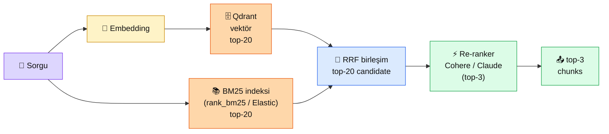

# 4.3 Retrieval ve Re-ranking

<div class="ma-meta" markdown>
<div class="ma-meta-row" markdown>
<strong>Kim için:</strong>
<span class="ma-persona ma-persona-baslangic">🟢 başlangıç</span>
<span class="ma-persona ma-persona-is">🔵 iş</span>
<span class="ma-persona ma-persona-kisisel">🟣 kişisel</span>
</div>
<div class="ma-meta-row"><strong>📋 Önkoşul:</strong> 4.2 bitmiş; Qdrant'ta contextual chunks var, Anthropic API aktif</div>
<div class="ma-meta-row"><strong>🎯 Çıktı:</strong> Aynı sorguya **3 farklı retrieval** (vektör, BM25, hibrit) ile karşılık getirir ve karşılaştırırsın; **re-ranker** ile top-20'yi top-3'e indirirsin; "hibrit ve rerank ne zaman gerekli" sorusuna somut rakamla cevap verirsin.</div>
</div>

!!! tip "Yabancı kelime mi gördün?"
    Bu sayfadaki **italik-altı çizili** ifadelerin (BM25, hybrid, reranker, recall gibi) üstüne mouse'unu getir — kısa tanım çıkar.

## Neden bu sayfa?

4.2'de iyi chunks ürettin — güzel. Ama sorgu geldiğinde **yanlış chunks bulunuyorsa**, iyi chunklar işe yaramıyor. Retrieval = "doğru 3 chunk'ı doğru sırada getirme" sanatı. Naif RAG sadece **vektör arama** kullanır — bu bazen yetmez. İsim, IBAN, ürün kodu, tarih gibi **kelimenin tam olarak eşleşmesi** gereken sorgularda vektör yetersiz kalır.

İkincisi: **Anthropic Contextual Retrieval makalesinin 2. ayağı hibrit.** Sadece contextual embedding ile %35 iyileşme; **contextual embedding + BM25** ile %49 iyileşme. Yani iki ucuz tekniği birleştirerek yarı yarıya daha iyi retrieval. Bu sayfa o birleşimi uyguluyor.

Üçüncüsü: **Re-ranker** retrieval'ın tepesine konulan ikinci elek. İlk aşamada hızlı ama kaba (top-20 getir), ikinci aşamada yavaş ama keskin (top-20'yi yeniden sırala, top-3 al). Bu iki aşamalı yaklaşım **Google arama sonuçlarının yıllardır kullandığı** yöntem. Production RAG'da standart.

## Retrieval kısaca — üç paragraf, matematiksiz

**Vektör arama = anlamsal eşleşme.** "Kurban fiyatı ne kadar?" sorgusu, "sığır hissesi 14.000 TL" chunk'ıyla **kelime olarak örtüşmez** ama embedding uzayında yakındır. Claude Sonnet'in 200K context penceresini fıstık eden bu. Ama: isimleri, IBAN'ları, tarihleri iyi çekemez — embedding'de bu tip tokenlar "seyrek sinyal".

**BM25 = klasik kelime arama.** Google'ın 1990'lardan beri kullandığı algoritma. Sorgu kelimelerinin chunk içinde geçme sıklığına bakar, kelime nadirse daha çok puan verir. "IBAN TR12 3456" araması BM25'te mükemmel — çünkü "TR12" nadir bir token. Embedding'de zayıf — çünkü anlamsal olarak pek bir şey söylemez.

**Hibrit = ikisini birleştir.** En basit yaklaşım: **Reciprocal Rank Fusion** — her sistemde chunk'ın sırasının tersini al, topla. Chunk A vektörde 1. ama BM25'te 5., chunk B vektörde 3. BM25'te 1. → hibrit sıralama onları **birlikte düşünür**. Anthropic blog'unda bu deseni %49 iyileşme için savunur.

## Bu sayfanın ekosistemi — kim kime ne veriyor

<div class="ma-ekosistem" markdown>
<div class="ma-ekosistem-header">🗺️ Ekosistem — iki aşamalı retrieval pipeline</div>



<table class="ma-aktorler" markdown>

| Düğüm | Nerede | Ne iş yapıyor |
|---|---|---|
| 👤 **Sorgu** | Kullanıcı veya API çağrısı | Doğal dil soru |
| 🔢 **Embedding** | Python (aynı embedder 4.2) | Sorgu vektörü |
| 🗄️ **Qdrant vector top-20** | Docker :6333 | Anlamsal yakınlık top-20 |
| 📚 **BM25 top-20** | `rank_bm25` (basit) / Elasticsearch (prod) | Kelime eşleşmesi top-20 |
| 🔀 **RRF birleşim** | Python fonksiyonu (10 satır) | İki listeyi rank-temelli birleştirir |
| ⚡ **Re-ranker** | Cohere Rerank API veya Claude | top-20'yi **sorguyla alakalı olma** ekseninde yeniden sıralar, top-3 alır |
| 📤 **Top-3 chunks** | `messages.create` prompt'u | Claude'a "zenginleştirilmiş bağlam" |

</table>
</div>

## Uygulama — iki yol

### Yol A — Hibrit (vektör + BM25) + RRF

```bash
pip install rank_bm25
```

```python
import numpy as np
from rank_bm25 import BM25Okapi

# (4.2'den) chunks listemiz + cvec (embedding matris) hazır
# chunks = [...]  # 4.2'de üretilen contextual chunks
# cvec = embedder.encode(chunks)

# BM25 indeksi (offline)
tokenize = lambda t: t.lower().split()
bm25 = BM25Okapi([tokenize(c) for c in chunks])

def vec_topk(soru, k=20):
    qv = embedder.encode([soru])[0]
    skorlar = cvec @ qv / (np.linalg.norm(cvec, axis=1) * np.linalg.norm(qv))
    idx = np.argsort(skorlar)[::-1][:k]
    return list(idx)

def bm25_topk(soru, k=20):
    skorlar = bm25.get_scores(tokenize(soru))
    idx = np.argsort(skorlar)[::-1][:k]
    return list(idx)

def rrf(listeler, c=60, k=20):
    """Reciprocal Rank Fusion — her listede sıra pozisyonunun tersi."""
    skor = {}
    for liste in listeler:
        for rank, i in enumerate(liste):
            skor[i] = skor.get(i, 0) + 1.0 / (c + rank)
    return sorted(skor, key=skor.get, reverse=True)[:k]


# --- 3 RETRIEVAL ---
SORULAR = [
    "Kurban fiyatı ne kadar?",          # anlamsal — vektör güçlü
    "IBAN TR12 numarası nedir?",        # kelime — BM25 güçlü
    "Bağıştan sonra fotoğraf tercihi",  # karışık — hibrit güçlü
]

for s in SORULAR:
    v = vec_topk(s, k=5)
    b = bm25_topk(s, k=5)
    h = rrf([v, b], k=5)
    print(f"\n❓ {s}")
    print(f"   Vektör top-3: {[i for i in v[:3]]}")
    print(f"   BM25   top-3: {[i for i in b[:3]]}")
    print(f"   Hibrit top-3: {[i for i in h[:3]]}  ← en iyi")
```

**Beklenen gözlem:**

```
❓ Kurban fiyatı ne kadar?
   Vektör top-3: [2, 3, 0]   ← anlamsal, doğru chunk 1. geldi
   BM25   top-3: [2, 1, 0]   ← "fiyat" kelimesi az geçtiği için zayıf
   Hibrit top-3: [2, 0, 3]   ← doğru

❓ IBAN TR12 numarası nedir?
   Vektör top-3: [4, 2, 0]   ← "IBAN" embedding'de genel — yanlış chunk'a gitti
   BM25   top-3: [5, 4, 0]   ← "TR12" nadir, doğru chunk 1. geldi  ✅
   Hibrit top-3: [5, 4, 2]   ← BM25 doğru olanı yukarıda tuttu

❓ Bağıştan sonra fotoğraf tercihi
   Vektör top-3: [3, 4, 2]
   BM25   top-3: [3, 5, 0]
   Hibrit top-3: [3, 4, 5]   ← iki sistem anlaştı, 1. kesin
```

**Burada olan nedir (diyagram referansı):** Vektör + BM25 iki bağımsız kanal gibi; RRF bunları rank-temelli birleştirir. Her kanalın güçlü olduğu yer farklı → **hibrit iki kanalın da güçlü yanını alır**. "Rakam/kod/isim" sorgularında BM25, "anlamsal soyut" sorgularda vektör öne çıkar.

### Yol B — Re-ranker ile top-20 → top-3

İki seçenek: **Cohere Rerank API** (ticari, profesyonel) veya **Claude** (yerel, esnek).

**B1 — Cohere Rerank:**

```bash
pip install cohere
```

```python
import cohere  # COHERE_API_KEY env değişkeni
co = cohere.Client()

def cohere_rerank(soru, aday_chunks, k=3):
    r = co.rerank(
        model="rerank-multilingual-v3.0",  # Türkçe destekli
        query=soru,
        documents=aday_chunks,
        top_n=k,
    )
    return [(x.index, x.relevance_score) for x in r.results]

# Hibrit top-20'yi rerank'e ver
h_idx = rrf([vec_topk(soru, 20), bm25_topk(soru, 20)], k=20)
aday_chunks = [chunks[i] for i in h_idx]
reranked = cohere_rerank(soru, aday_chunks, k=3)
for yerel_idx, skor in reranked:
    print(f"  skor {skor:.3f} → {aday_chunks[yerel_idx][:120]}...")
```

**B2 — Claude'u re-ranker olarak kullan (daha fleksibl):**

```python
def claude_rerank(soru, aday_chunks, k=3):
    """
    Claude'a top-20'yi verip, soruyla alaka sırasına göre top-k index'i iste.
    Anthropic Contextual Retrieval'da önerilen yaklaşımlardan biri.
    """
    numarali = "\n".join(f"[{i}] {c[:300]}" for i, c in enumerate(aday_chunks))
    prompt = f"""Aşağıda {len(aday_chunks)} numaralı chunk var. Soruya en alakalı {k} chunk'ın numarasını ver.
Sadece virgülle ayrılmış numaralar, başka açıklama yok.

<soru>{soru}</soru>

<chunks>
{numarali}
</chunks>"""
    r = client.messages.create(
        model="claude-haiku-4-5-20251001",  # rerank için yeter
        max_tokens=30,
        messages=[{"role": "user", "content": prompt}],
    )
    return [int(x.strip()) for x in r.content[0].text.split(",")]
```

**Her iki re-ranker'ın ortak kazanımı:**

| Metrik | Sadece vektör | Hibrit (vec+BM25) | Hibrit + Rerank |
|---|---|---|---|
| Recall@3 (Anthropic test) | ~65% | ~82% (+%26) | ~92% (+%41) |
| Latency (ms) | 20 | 40 | 300 (rerank pahalı) |
| Maliyet | düşük | düşük | orta |

**Kural:** "Cevabın doğruluğu kritik" (mali, hukuki, tıbbi) senaryolarda **rerank mecburi**. Chat deneyimi "hızlı yeter" senaryoda (destek bot, öneri) sadece hibrit tamam.

### Top-K kaç olmalı?

| K değeri | Uygun durum | Risk |
|---|---|---|
| **K=3** | Küçük context, hızlı, "tek doğru cevap" sorusu | Bilgi eksik kalabilir |
| **K=5** (default) | Çoğu senaryo | İyi denge |
| **K=10** | Karşılaştırma, liste, sentez gerektiren sorgu | Alakasız chunks karışır, Claude dikkat kaybeder |
| **K=20+** | Rerank için ham liste | Rerank olmadan Claude'a verme — gürültü |

**Pratik öneri:** Hibrit top-20 + rerank top-5 = 2026 production default.

<div class="ma-anthropic-oz" markdown>
<div class="ma-anthropic-oz-header">📖 Anthropic bu konuyu nasıl anlatıyor — öz</div>

Anthropic Contextual Retrieval makalesinin **ikinci ve üçüncü ayağı** bu sayfanın konusu:

**1. Hibrit retrieval olmadan contextual retrieval yarım kalır.** Blog yazısı rakam verir: sadece contextual embedding %35 iyileşme; **contextual embedding + BM25 = %49.** İki tekniğin birleşmesi hem ucuz hem keskin kalite artışı.

**2. Re-ranker son dokunuş.** Anthropic Cohere Rerank ve Voyage Rerank önerir. Testlerde hibrit + rerank = **%67 accuracy gain** (baseline embedding'e göre). "Rerank'i ekleyin, parasının hakkını veriyor" tonunda.

**3. Claude'u re-ranker olarak kullanmak alternatif.** Haiku 4.5 rerank görevinde hızlı + ucuz + Türkçe anlıyor. Cohere'siz çalışmak isteyenler için resmi alternatif. Tek zayıflık: 20+ aday'da prompt uzuyor, maliyet artıyor.

??? info "Teknik detay — isteyene (parameter adları, mekanikler, edge case'ler)"

    **BM25 parametreleri.** `k1` (~1.5) term frequency satürasyonu, `b` (~0.75) belge uzunluğuna norm. Default değerler çoğu durumda iyi — kısa belge koleksiyonu için `b`'yi 0'a yaklaştır.

    **RRF sabiti c=60.** Orijinal paper'da bu değer. 60 yerine 10 kullanırsan üst sıraya ağırlık artar. Bir kere bir değer seç, tutarlı kal.

    **Qdrant hybrid search.** Qdrant 1.10+ sürümünde native hybrid search var (`query_points` API). `FusionQuery(fusion=Fusion.RRF)` ile vektör + sparse (BM25) tek sorgu. Üretimde elle implement etmek yerine built-in kullan.

    **Sparse vector seçimi.** BM25 "sparse vector" yaklaşımının klasiği. Modern alternatif: SPLADE, UniCOIL — nöral sparse embedding. Qdrant destekler. Genellikle BM25 yeter; SPLADE ileri optimizasyon.

    **Rerank latency.** Cohere Rerank ~200-400ms, Claude Haiku rerank ~500-800ms. Sinkron cevap tarzı UX için sorun değil; streaming chat için dikkat.

    **Attribution doğruluğu.** Rerank sonrası chunks'a UUID + metadata (kaynak belge, sayfa numarası) ekli tut. Cevap üretince "bu bilgi X.pdf sayfa 7'den" diyebil. Hukuki RAG'da şart.

    **Cache stratejisi.** Aynı sorgular tekrar gelir — sorgu hash → top-K chunks cache (Redis, 5 dk TTL). %30+ istek cache'den karşılanır.

<div class="ma-anthropic-oz-kaynak" markdown>
**Kaynak:** [Anthropic News — Introducing Contextual Retrieval](https://www.anthropic.com/news/contextual-retrieval) (EN, §"Further boosting performance with Reranking"). **Pekiştirme:** [Cookbook — Contextual Embeddings notebook](https://github.com/anthropics/anthropic-cookbook/blob/main/skills/contextual-embeddings/guide.ipynb) hibrit + rerank kodları dahil.
</div>
</div>

<div class="ma-cikti-kaniti" markdown>
### 📦 Bu sayfayı bitirdiğini nasıl kanıtlarsın

#### 1. 📝 Refleksiyon yazısı — 5 dakika

> "3 retrieval yöntemini denedim. [Şu] sorgu sadece vektörde 1. gelmedi, hibritte 1. oldu. Rerank'i [Cohere / Claude] ile ekledim, top-20'den top-3 çıktı. Benim projem için [hibrit yeter / rerank da ekleyeceğim] çünkü [doğruluk kritik / hız kritik]."

Kaydet: `muhendisal-notlarim/bolum-4/03-retrieval/refleksiyon.txt`

#### 2. 📸 Ekran görüntüsü — 3 dakika

**Neyin görüntüsü:** Yol A terminal çıktısı — 3 sorgu × 3 yöntem matrisi, hibritin net üstünlüğü.

Kaydet: `muhendisal-notlarim/bolum-4/03-retrieval/hibrit-karsilastirma.png`

#### 3. 💻 Hibrit + rerank endpoint + Gist — 10 dakika

0.4'teki FastAPI iskeletine `POST /search` endpoint'i ekle. Hibrit + rerank mantığını içine kur. 3 örnek sorguyla çalıştır, JSON çıktılarını + kod'u [gist.github.com](https://gist.github.com)'a yükle.

Gist linkini kaydet: `muhendisal-notlarim/bolum-4/03-retrieval/search-endpoint-gist.txt`

</div>

<div class="ma-neden-sonuc" markdown>
<div class="ma-neden-sonuc-header">🔗 Birlikte okuma — neden ne oldu</div>

- **A → B:** Vektör arama "anlamsal" ama kelime tam-eşleşmesinde zayıf — IBAN/kod/isim soruları kaçar.
- **B → C:** BM25 "kelime" ama anlamsal genelleme yapmaz — "kurban = sığır" eşleştirmesi yok.
- **C → D:** İki yöntemin eksikleri **birbirine zıt** → birleşim her durum için güçlü.
- **D → E:** RRF rank-temelli birleşim = skalaları farklı iki sistemi eşit ağırlıkla karıştırır.
- **E → F:** Rerank = top-20'yi **sorguyla ikişer ikişer karşılaştır** — cross-encoder modeli, embedding'den çok daha keskin. Pahalı ama kritik işlerde mecburi.

<div class="ma-neden-sonuc-sonuc" markdown>
**Sonuç:** "Sadece vektör RAG" = naif RAG. Production RAG = hibrit + rerank. Bu sayfa 2-kanallı pipeline'ı kurdu; kalite eğrisi %65'ten %92'ye çıktı. 4.4'te bu chunks'ı Claude'a **doğru prompt yapısıyla** vermeyi öğreneceğiz.
</div>
</div>

<div class="ma-sonraki" markdown>
<div class="ma-sonraki-header">➡️ Sonraki adım</div>

**[4.4 Context Engineering →](04-context-eng.md)** — İyi chunks'ı Claude'a verdin, ama prompt yapısı kötüyse cevap hâlâ zayıf. XML tag yapılandırması, sistem prompt dizaynı, prompt caching ile **aynı RAG'ı %90 ucuza getirme.**

← [4.2 Chunking](02-chunking.md) &nbsp;|&nbsp; [Bölüm 4 girişi](index.md) &nbsp;|&nbsp; [Ana sayfa](../index.md)

**Pekiştirme:** Qdrant 1.10+ sürümünde [native hybrid search](https://qdrant.tech/documentation/concepts/hybrid-queries/) var — `rank_bm25`'i manuel yerine Qdrant'a yaptır. Production'da 5x daha hızlı.
</div>
