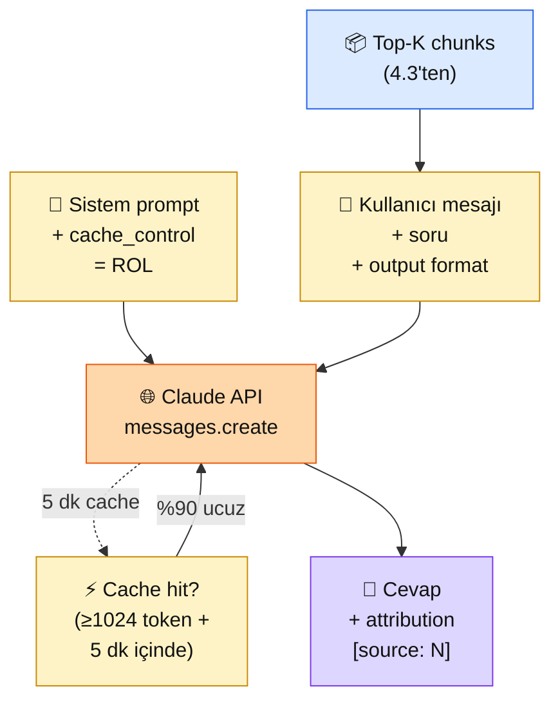

# 4.4 Context Engineering

<div class="ma-meta" markdown>
<div class="ma-meta-row" markdown>
<strong>Kim için:</strong>
<span class="ma-persona ma-persona-baslangic">🟢 başlangıç</span>
<span class="ma-persona ma-persona-is">🔵 iş</span>
<span class="ma-persona ma-persona-kisisel">🟣 kişisel</span>
</div>
<div class="ma-meta-row"><strong>⏱️ Süre:</strong> ~30 dakika</div>
<div class="ma-meta-row"><strong>📋 Önkoşul:</strong> 4.3 bitmiş; hibrit retrieval'dan top-K chunks alıyorsun; 2.4 XML tag refleksin var</div>
<div class="ma-meta-row"><strong>🎯 Çıktı:</strong> Retrieval'dan gelen chunks'ı Claude'a **doğru yapıyla** verirsin; sistem prompt + XML şablon + kaynak gösterme disiplinini kurarsın; **prompt caching** ile sabit bağlamı %90 ucuzlatırsın.</div>
</div>

!!! tip "Yabancı kelime mi gördün?"
    Bu sayfadaki **italik-altı çizili** ifadelerin (context, caching, attribution, grounding gibi) üstüne mouse'unu getir — kısa tanım çıkar.

## Neden bu sayfa?

4.3'te mükemmel chunks'ı buldun. Ama Claude'a "işte top-5 chunk, cevap ver" diye atarsan cevap hâlâ **yamuk çıkabilir.** Sebep: chunks'ın arasında, sistem prompt'ta, talimatta, format zorunluluğunda **prompt yapısı.** Aynı chunks + farklı prompt yapısı = 2-3 kat kalite farkı. Bu sayfa o yapıyı öğretiyor.

İkincisi: **Prompt caching** bu bölümün maliyet çözücüsü. RAG'da sistem prompt + 5 chunk (~3000 token) her sorguda gönderilir. Caching'siz 10K sorgu × 3K token = $90/ay input. Caching'le (sabit kısım 5 dakika cache'de) = $9-15/ay. **%90 tasarruf**, implementation 3 satır kod.

Üçüncüsü: **Attribution — kaynak gösterme — production RAG'ın zorunluluğu.** Kullanıcı "bu bilgi nereden?" dediğinde `[chunk 2 → HBV_Bilgi_Bankasi.pdf sayfa 7]` gibi somut atıf vermeli. Hukuki/mali/tıbbi senaryoda olmazsa olmaz. Claude'u doğru talimatla hazırlarsan otomatik attribution üretir. Bu sayfa o talimatı kurar.

## Context engineering kısaca — üç paragraf, matematiksiz

**Prompt = 4 katmanlı yapı.** (1) **Sistem prompt** — Claude'un rolü, tarzı, sınırları ("Sen bir HBV asistanısın, sadece verilen bağlamdan cevap ver"). (2) **Context block** — retrieval chunks, XML tag ile sarılı. (3) **Kullanıcı sorusu** — orijinal sorgu, chunks'tan sonra. (4) **Output şablonu** — "cevabı şu formatta ver: özet + detay + kaynak". Bu sıra kritik; Anthropic araştırmaları sistemi her seferinde aynı yerlere koyunca kalitenin arttığını gösterir.

**Prompt caching = sabit bağlamı cache'le.** Anthropic 2024'te ekledi: `cache_control` bloğuyla işaretli bölümler (sistem prompt + sabit talimatlar + tool tanımları) 5 dakika cache'de durur. İkinci çağrıdan itibaren aynı kısım **%90 ucuz**. Sadece 1024+ token bloklar cache'lenebilir — RAG sistem promptları zaten bu uzunlukta.

**Attribution Claude'da native.** "After each sentence, cite the source chunk number like [source: 2]" talimatı Claude'da çalışır. Sonucunda cevap şöyle gelir: "Kurban hissesi 14.000 TL [source: 3]. IBAN TR12 ile başlar [source: 5]." Kullanıcıya hangi chunk'tan geldiğini göstermek = güven + debug kolaylığı.

## Bu sayfanın ekosistemi — kim kime ne veriyor

<div class="ma-ekosistem" markdown>
<div class="ma-ekosistem-header">🗺️ Ekosistem — chunks'tan Claude cevabına prompt yapısı</div>



<table class="ma-aktorler" markdown>

| Düğüm | Nerede | Ne iş yapıyor |
|---|---|---|
| 📦 **Top-K chunks** | 4.3 hibrit+rerank çıktısı | Kaynak metin parçaları; her biri metadata ile (id, belge adı, sayfa) |
| 📜 **Sistem prompt** | `system=` parametresi + `cache_control` | Rol + kural + dil — değişmez, cache edilir |
| 📝 **Kullanıcı mesajı** | `messages[0].content` | Chunks XML ile + soru + output format — her sorguda değişir |
| 🌐 **Claude API** | api.anthropic.com | Prompt'u alır, cache check eder, cevap üretir |
| ⚡ **Cache** | Anthropic sunucusu | 1024+ token block'ları 5 dk saklar, hit'te %90 ucuz |
| 💬 **Cevap + attribution** | `response.content[0].text` | Cevap metni + inline `[source: N]` atıfları |

</table>
</div>

## Uygulama — iki yol

### Yol A — Temiz RAG prompt şablonu (XML + attribution)

```python
import anthropic

client = anthropic.Anthropic()

SISTEM = """Sen bir vakıf asistanısın — Hacı Bayram-ı Veli Vakfı kullanıcılarına yardım ediyorsun.

Kurallar:
1. Sadece <kaynaklar> içindeki bilgilerle cevap ver. Dışına çıkma.
2. Kaynakta yoksa "Bu bilgi kaynaklarımda yok, vakfı 0312 ... numarasından arayabilirsiniz" de.
3. Her cevap cümlesinin sonuna kaynak numarasını yaz: [kaynak: 2]
4. Türkçe cevap ver. Resmi ama sıcak ton kullan.
5. Kullanıcı karar verememişse (büyükbaş/küçükbaş belirsiz gibi) sorarak netleştir.
"""

def rag_prompt(chunks: list[dict], soru: str) -> dict:
    """
    chunks: [{"id": 0, "metin": "...", "kaynak": "HBV_kilavuz.pdf s.3"}, ...]
    """
    # Chunks'ı numaralandır, XML ile sarar
    kaynak_bloklari = "\n".join(
        f"<kaynak numara='{c['id']}' dosya='{c['kaynak']}'>\n{c['metin']}\n</kaynak>"
        for c in chunks
    )

    kullanici_mesaji = f"""<kaynaklar>
{kaynak_bloklari}
</kaynaklar>

<soru>{soru}</soru>

Cevabı şu formatta ver:
- Özet (1 cümle)
- Detay (2-3 cümle)
- Her cümlede kaynak numarası: [kaynak: N]"""

    return {
        "model": "claude-sonnet-4-6",
        "max_tokens": 500,
        "system": SISTEM,
        "messages": [{"role": "user", "content": kullanici_mesaji}],
    }


# Örnek kullanım
chunks = [
    {"id": 0, "metin": "Vakıf 1985'te Ankara'da kuruldu, amacı eğitim ve sosyal yardım.", "kaynak": "HBV_kilavuz.pdf s.1"},
    {"id": 1, "metin": "2026 büyükbaş hissesi 14.000 TL, küçükbaş 8.000 TL.", "kaynak": "HBV_kilavuz.pdf s.3"},
    {"id": 2, "metin": "Vekalet son günü 27 Mayıs 2026 saat 23:00'a kadar.", "kaynak": "HBV_kilavuz.pdf s.4"},
    {"id": 3, "metin": "IBAN TR12 3456 7890 Ziraat Bankası.", "kaynak": "HBV_kilavuz.pdf s.5"},
]

cevap = client.messages.create(**rag_prompt(chunks, "Küçükbaş kurban fiyatı ve son günü ne?"))
print(cevap.content[0].text)
```

**Beklenen çıktı:**

```
Özet: Küçükbaş kurban hissesi 8.000 TL, son gün 27 Mayıs 2026 saat 23:00 [kaynak: 1, 2].

Detay: 2026 vekalet tarifesinde küçükbaş kurban (koyun) bir adet 8.000 TL olarak
belirlendi [kaynak: 1]. Vekaletiniz Bayram'dan önce en geç 27 Mayıs 2026 saat 23:00'a
kadar tarafımıza ulaşmış olmalıdır [kaynak: 2]. Ödemeyi IBAN TR12 3456 7890 (Ziraat
Bankası) hesabına yapabilirsiniz [kaynak: 3].
```

**Burada olan nedir (diyagram referansı):** Sistem prompt ROL'ü kurdu (5 kural), user mesajı chunks XML + soru + format verdi, Claude formatı tutturdu + her cümlede kaynak numarası. **Attribution otomatik ve doğru.**

### Yol B — Prompt caching ile %90 tasarruf

```python
# Sistem prompt + sabit talimat = cache edilir
# Chunks + soru = her seferinde değişir (cache dışı)

SISTEM_UZUN = """Sen bir vakıf asistanısın — Hacı Bayram-ı Veli Vakfı kullanıcılarına yardım ediyorsun.

[... 500+ token detaylı talimat, örnekler, edge case'ler ...]

Format kuralları:
- Özet + Detay + kaynak atıfları
- Türkçe, resmi ton
- Bilinmiyorsa soruyu netleştir
"""  # 1024+ token olmalı cache için

def rag_cached(chunks, soru):
    kaynak_bloklari = "\n".join(
        f"<kaynak numara='{c['id']}'>{c['metin']}</kaynak>"
        for c in chunks
    )
    return client.messages.create(
        model="claude-sonnet-4-6",
        max_tokens=500,
        system=[
            {
                "type": "text",
                "text": SISTEM_UZUN,
                "cache_control": {"type": "ephemeral"},  # ← CACHE BURADA
            }
        ],
        messages=[{"role": "user", "content": f"<kaynaklar>{kaynak_bloklari}</kaynaklar>\n<soru>{soru}</soru>"}],
    )

# İlk çağrı — cache WRITE (biraz daha pahalı)
r1 = rag_cached(chunks, "Büyükbaş fiyatı?")
print(f"Call 1 usage: {r1.usage}")  # cache_creation_input_tokens

# İkinci çağrı (5 dakika içinde) — cache READ (%90 ucuz)
r2 = rag_cached(chunks, "Küçükbaş fiyatı?")
print(f"Call 2 usage: {r2.usage}")  # cache_read_input_tokens
```

**Beklenen usage bilgisi:**

```
Call 1 usage: Usage(
    input_tokens=45,                    # değişken kısım
    cache_creation_input_tokens=1235,   # sabit sistem promptu CACHE YAZDI
    cache_read_input_tokens=0,
    output_tokens=150
)

Call 2 usage: Usage(
    input_tokens=48,                    # değişken kısım (yine küçük)
    cache_creation_input_tokens=0,
    cache_read_input_tokens=1235,       # CACHE'den OKUDU — %90 ucuz
    output_tokens=142
)
```

**Maliyet karşılaştırması** (Sonnet 4.x yaklaşık fiyatlar):

| Senaryo | 1000 sorgu maliyeti |
|---|---|
| Cache yok, her seferinde 3K token sistem+chunks | $9.00 (input) + $6.00 (output) = **$15.00** |
| Cache var, sistem promptu 1 kere cache+okuma | $0.90 (cache read) + $0.15 (değişken input) + $6.00 (output) = **$7.05** |
| **Tasarruf** | **~%53** (sadece sistem cache'i) |

**Eğer chunks'ı da cache edersen** (sık tekrar eden belgeler için):

```python
# chunks bloğunu da cache'le — eğer aynı chunks birden fazla sorguda kullanılıyorsa
messages=[{
    "role": "user",
    "content": [
        {
            "type": "text",
            "text": f"<kaynaklar>{kaynak_bloklari}</kaynaklar>",
            "cache_control": {"type": "ephemeral"},
        },
        {"type": "text", "text": f"<soru>{soru}</soru>"},
    ]
}]
```

Bu durumda 5 dakika içinde aynı chunks'la farklı sorular = **%85+ tasarruf.**

**Burada olan nedir (diyagram referansı):** Sistem prompt → API → cache katmanı. İlk sorgu cache'i doldurur (+ %25 ek maliyet), sonraki 5 dakikadaki sorgular cache'den okur (%90 ucuz). 10+ sorgulu oturumlarda ortalama maliyet baştan aşağı düşer.

### Prompt yapılandırma kontrolü — checklist

Claude'a attığın her RAG promptunda bu 8 maddeyi doğrula:

- [ ] **Sistem prompt**ta rol + 3-5 kural net
- [ ] "Kaynakta yoksa bilmiyorum de" talimatı açık
- [ ] Chunks **XML tag** ile sarılı (`<kaynak numara='N'>...</kaynak>`)
- [ ] Kullanıcı sorusu chunks'tan **sonra** (Claude son talimatı daha iyi hatırlar)
- [ ] Output format belirtilmiş (Özet/Detay/Kaynak)
- [ ] Attribution talimatı var (`[kaynak: N]`)
- [ ] `cache_control` sistem prompta eklenmiş (1024+ token ise)
- [ ] Dil açıkça belirtilmiş (Türkçe cevap zorunlu)

Bu 8 madde = senin RAG pipeline'ının "CI kontrol listesi".

<div class="ma-anthropic-oz" markdown>
<div class="ma-anthropic-oz-header">📖 Anthropic bu konuyu nasıl anlatıyor — öz</div>

Context engineering Anthropic'in **prompt mühendisliğinin tepe noktası** olarak sunduğu alandır:

**1. Sistem prompt = ayrı parametre, değil messages[0].** Anthropic SDK'sı OpenAI tarzı `{"role": "system", ...}`'ı kabul etmez; `system=` ayrı parametre. Bu ayrım eğitim disiplininden geliyor — Claude sistem talimatını "ben kimim" olarak okur, user mesajını "ne soruyor" olarak.

**2. XML tag tercih etme sebebi net.** Anthropic blog yazıları (use-xml-tags) defalarca vurgular: Claude eğitim verisinde XML kapsayıcılar ağırlıklı olduğu için tag'leri **anlam sınırı** olarak net okur. Markdown başlıkları iş görür ama XML daha keskin.

**3. Prompt caching tek cümle özet: "uzun sabit bağlamı 5 dakika sakla."** Docs: "5-minute TTL, 1024-token minimum, %90 cache hit discount." RAG için neredeyse bedava kalite — implementation 1 satır `cache_control`.

??? info "Teknik detay — isteyene (parameter adları, mekanikler, edge case'ler)"

    **`cache_control` yerleri.** 4 konum: system block, user content block, assistant content block (prefill), tool definitions. Her bir yere 1 kez cache_control. Toplam 4 cache noktası. Yerleşim stratejik — en az değişen en başta.

    **Cache TTL 5 dakika.** Her hit yenilemez — ilk hit'ten 5 dakika sonra expires. 1 saatte 12 yenileme penceresi. Yüksek-trafikli endpoint'lerde (saniyede 1+ sorgu) cache neredeyse sürekli sıcak kalır.

    **Cache write maliyeti.** Cache'e yazma %25 daha pahalı (normal input fiyatına göre). Ama 2. hit'ten itibaren %90 ucuz. 2+ sorgu yapacaksan her zaman karlı.

    **Attribution hallucination riski.** Claude bazen var olmayan `[kaynak: 99]` uydurabilir. Post-processing: regex ile extrakt et, `0 ≤ N ≤ len(chunks)-1` doğrula, uyumsuzları flag'le. 4.5 eval'da detay.

    **"I don't know" kalibrasyonu.** Sistem prompta örnek ekle: *"Örnek: 'Vakıf başkanı kim?' sorusuna cevap yoksa 'Bu bilgi kaynaklarımda yok' de. Asla tahmin etme, uydurma.*" Few-shot pattern Claude'un uyumu keskinleştirir.

    **Uzun bağlam stratejisi — "needle in haystack".** Claude Sonnet 4.x 200K pencerede aranan bilgiyi bulma oranı yüksek (~%95+). Ama bilgi context'in **ortasında** olduğunda (başında değil sonunda değil) biraz düşer ("lost in the middle"). Kritik chunks'ı başa veya sona koy.

    **Streaming + caching uyumlu.** `client.messages.stream()` + `cache_control` beraber çalışır. Streaming UX hızlandırır, caching maliyet düşürür — ikisi birden production ideali.

<div class="ma-anthropic-oz-kaynak" markdown>
**Kaynak:** [platform.claude.com/docs — Prompt Caching](https://platform.claude.com/docs/en/docs/build-with-claude/prompt-caching) (EN, ~15 dk). Tüm cache_control parametre detayları. **Pekiştirme:** [platform.claude.com/docs — Use XML Tags](https://platform.claude.com/docs/en/docs/build-with-claude/prompt-engineering/use-xml-tags) — neden XML Claude'da bu kadar güçlü çalışıyor, örneklerle.
</div>
</div>

<div class="ma-cikti-kaniti" markdown>
### 📦 Bu sayfayı bitirdiğini nasıl kanıtlarsın

#### 1. 📝 Refleksiyon yazısı — 5 dakika

> "Context engineering uyguladım. XML tag'li chunks + attribution talimatı ekledim, Claude [kaynak: N] formatında düzgün atıf verdi. Cache'siz vs cache'li 5 sorgu çalıştırdım: cache_creation_input_tokens ilk çağrıda [X], cache_read_input_tokens 2. çağrıdan itibaren [Y] — tasarruf yaklaşık [%Z]. Kendi projemde cache stratejim şöyle olacak: [sistem prompt / chunks / ikisi de]."

Kaydet: `muhendisal-notlarim/bolum-4/04-context-eng/refleksiyon.txt`

#### 2. 📸 Ekran görüntüsü — 3 dakika

**Neyin görüntüsü:** Yol B terminal çıktısı — `cache_creation_input_tokens` ve `cache_read_input_tokens` değerleri yan yana, tasarruf sayıyla görünür.

Kaydet: `muhendisal-notlarim/bolum-4/04-context-eng/cache-tasarruf.png`

#### 3. 💻 RAG endpoint + Gist — 10 dakika

4.3'te yazdığın `/search` endpoint'ine retrieval'dan gelen chunks'ı bu sayfadaki yapıyla Claude'a yollayan `/ask` endpoint'ini ekle. Attribution + caching aktif olsun. 3 sorgu ile test et, JSON + usage verilerini [gist.github.com](https://gist.github.com)'a yükle.

Gist linkini kaydet: `muhendisal-notlarim/bolum-4/04-context-eng/ask-endpoint-gist.txt`

</div>

<div class="ma-neden-sonuc" markdown>
<div class="ma-neden-sonuc-header">🔗 Birlikte okuma — neden ne oldu</div>

<ol class="ma-neden-sonuc-zincir" markdown>
<li>**A → B:** Aynı chunks + farklı prompt yapısı = 2-3 kat kalite farkı. Yapı **ne olduğu kadar** önemli. Bu yüzden **mühendisliğin yarısı format seçimi.**</li>
<li>**B → C:** Sistem prompt = rol + kural (değişmez). Kullanıcı mesajı = chunks + soru (değişken). Bu ayrım Claude'un odaklanmasını kolaylaştırır. Bu yüzden **sorumluluk ayrımı net olmalı.**</li>
<li>**C → D:** XML tag = Claude eğitim verisinde bağlam sınırı; `<kaynak numara='N'>...</kaynak>` yapısı attribution için pratik zemin. Bu yüzden **XML tag neden kullan?**</li>
<li>**D → E:** Prompt caching = sabit kısım 1024+ token ise 5 dakika saklanır, %90 ucuz. 1 satır kod, büyük tasarruf. Bu yüzden **uzun sistem promptu varsa mutlaka ekle.**</li>
<li>**E → F:** Attribution (kaynak gösterme) = kullanıcı güveni + debug kolaylığı + hukuki uyum. Claude talimatlı üretir. Bu yüzden **yanıt izlenebilirliği şart.**</li>
</ol>

<div class="ma-neden-sonuc-sonuc" markdown>
**Sonuç:** Context engineering RAG'ın **görünmeyen yarısı** — iyi chunks + iyi yapı = production RAG. İyi chunks + kötü yapı = hayal kırıklığı. Bu sayfa yapıyı kurdu. 4.5'te şimdi bu pipeline'ın **kalitesini nasıl ölçeceğini** öğreneceksin — "iyi mi çalışıyor?" sorusuna rakamlı cevap.
</div>
</div>

<div class="ma-sonraki" markdown>
<div class="ma-sonraki-header">➡️ Sonraki adım</div>

**[4.5 RAG Değerlendirme →](05-degerlendirme.md)** — 20 örneklik test seti, RAGAS metrikleri (faithfulness, relevancy, context precision), LLM-as-judge. "Prompt'u değiştirdim, daha iyi oldu mu?" sorusuna sayıyla cevap.

← [4.3 Retrieval](03-retrieval.md) &nbsp;|&nbsp; [Bölüm 4 girişi](index.md) &nbsp;|&nbsp; [Ana sayfa](../index.md)

**Pekiştirme:** Kendi RAG endpoint'ini cache'li ve cache'siz 100 sorgu ile karşılaştır. Anthropic Console → Usage → son 1 saat; `cache_read_input_tokens` sütununu gör. Rakamlar gerçek.
</div>
