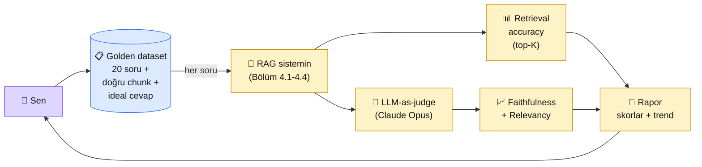

# 4.5 RAG Değerlendirme

<div class="ma-meta" markdown>
<div class="ma-meta-row" markdown>
<strong>Kim için:</strong>
<span class="ma-persona ma-persona-baslangic">🟢 başlangıç</span>
<span class="ma-persona ma-persona-is">🔵 iş</span>
<span class="ma-persona ma-persona-kisisel">🟣 kişisel</span>
</div>
<div class="ma-meta-row"><strong>⏱️ Süre:</strong> ~35 dakika</div>
<div class="ma-meta-row"><strong>📋 Önkoşul:</strong> 4.1-4.4 bitmiş; çalışan bir RAG iskeletin var (chunking + embedding + retrieval + context engineering)</div>
<div class="ma-meta-row"><strong>🎯 Çıktı:</strong> **20 soru-cevap çiftli golden dataset** hazırlarsın; her RAG çıktısını 3 metrikte ölçersin (retrieval accuracy + faithfulness + answer relevancy); prompt veya chunking değişince skorun **düştüğünü mü yükseldiğini mi** sayıyla bilirsin.</div>
</div>

!!! tip "Yabancı kelime mi gördün?"
    Bu sayfadaki **italik-altı çizili** ifadelerin (eval, ground truth, faithfulness gibi) üstüne mouse'unu getir — kısa tanım çıkar. Mobilde dokun.

## Neden bu sayfa?

Senaryo: RAG sistemini kurdun. 3-4 soru sordun, cevaplar "iyi görünüyor" dedin, vakıfa teslim ettin. Bir hafta sonra müdür arar: "Chatbot bize yanlış IBAN söyledi, 30 bin lira yanlış hesaba gitti." Sen? **Şok.** Çünkü **"kaliteyi" ölçmüyordun, umuyordun.** Bu sayfa umudu sayıya çevirir.

İkincisi: **RAG üç aşamalı bir sistem** (retrieval + augmentation + generation) ve her aşamanın **kendine özgü hatası** var. Retrieval yanlışsa (yanlış belge geldi), generation doğru da yapsa yanlış cevap. Generation halüsine ettiyse (belgede yok ama uydurdu), retrieval iyi olsa da yanlış cevap. **Hangi aşama bozuk bilmeden onaramazsın.** Eval sana bu tanıyı verir.

Üçüncüsü: **Prompt veya chunking değişikliği = deploy.** Chunk boyutunu 200'den 500'e çıkardığında kalitenin **arttığını mı azaldığını mı** bilmek zorundasın. Kod'da unit test olmadan deploy yapmak nasıl tehlikeli ise, RAG'de eval olmadan değişiklik yapmak aynı tehlike. Anthropic 2024'te bu konuya büyük yatırım yaptı — Console "Evaluate" sekmesi + [anthropic-evals](https://github.com/anthropics/evals) public repo = "olgun AI development" disiplini.

## RAG eval kısaca — üç paragraf, matematiksiz

**Golden dataset = "doğrusunu bildiğin" soru-cevap seti.** 20 soru hazırlıyorsun, her biri için (a) hangi belge chunk'ının gelmesi gerektiğini, (b) ideal cevabın ne olduğunu sen belirliyorsun. Bu "sınav cevap anahtarı" — RAG'in çıktısını buna göre puanlıyorsun. En az 20, ideal 100 soru. Üretimine zaman harcayacaksın, **yatırım kurtarır.**

**Üç temel metrik.** (1) **Retrieval accuracy:** doğru chunk geldi mi? (top-K içinde golden chunk var mı?) (2) **Faithfulness:** cevap sadece getirilen belgeye mi dayanıyor, uydurma var mı? (3) **Answer relevancy:** cevap soruyu gerçekten cevaplıyor mu, konu dışına mı kaymış? Üçünü ayrı ölçmek = hangi aşama bozuk görmek.

**LLM-as-judge = Claude'u hakem yapmak.** "Cevap belgeye dayalı mı?" sorusunu insan yerine Claude'a sorduruyorsun — 0-5 arası puan veriyor, gerekçe yazıyor. 100 örneği insan 5 saat puanlar, Claude 5 dakikada. **%90 örtüşme insan puanıyla** — Anthropic kanıtı. Ama **kendi promptunu kendi judge'ı ile puanlatma** (önyargı riski) — judge için farklı/daha güçlü model kullan.

## Bu sayfanın ekosistemi — kim kime ne veriyor

<div class="ma-ekosistem" markdown>
<div class="ma-ekosistem-header">🗺️ Ekosistem — golden dataset'ten skor raporuna</div>



<table class="ma-aktorler" markdown>

| Düğüm | Nerede | Ne iş yapıyor |
|---|---|---|
| 👤 **Sen** | Eval kodunu çalıştırıyorsun | Golden dataset hazırla, runner yaz, raporu oku |
| 📋 **Golden dataset** | `eval/golden.jsonl` | 20 soru + doğru chunk ID + ideal cevap (elle veya Claude + revizyon) |
| 🔄 **RAG sistemi** | Senin kodun | Her soru için retrieval + generation yapıyor |
| 📊 **Retrieval accuracy** | Basit boolean karşılaştırma | "Doğru chunk top-5 içinde mi?" → 1/0 |
| 🧠 **LLM-as-judge** | Claude Opus 4.x | Faithfulness + relevancy 0-5 puan + gerekçe |
| 📈 **Faithfulness + Relevancy** | Python skorları | Dataset üstüne ortalaması |
| 📄 **Rapor** | JSON + Markdown | Hangi sorularda batak, hangi metrik düşük |

</table>
</div>

## Uygulama — iki yol

### Yol A — Golden dataset + 3 metrik runner

`eval/golden.jsonl` (her satır bir soru):

```jsonl
{"id":"q01","soru":"Kurban bedeli 2026 yılı ne kadar?","dogru_chunk_id":"fiyat-2026-001","ideal_cevap":"2026 yılı kurban bedeli 14.000 TL'dir."}
{"id":"q02","soru":"IBAN numarası nedir?","dogru_chunk_id":"iban-001","ideal_cevap":"Hacı Bayram-ı Veli Vakfı IBAN'ı TR33 0006 4000 0011 2345 6789 01'dir."}
{"id":"q03","soru":"Nasıl bağış yapabilirim?","dogru_chunk_id":"bagis-yontem-001","ideal_cevap":"Banka havalesi veya kredi kartı ile yapabilirsiniz..."}
```

`eval/runner.py`:

```python
import json
from pathlib import Path
import anthropic
from rag_sistemi import rag_cevapla  # senin 4.4 sonundaki sistem

client = anthropic.Anthropic()

# 1. Golden dataset yükle
golden = [json.loads(l) for l in Path("eval/golden.jsonl").read_text().splitlines()]

# 2. LLM-as-judge promptu
JUDGE_PROMPT = """Aşağıdaki RAG cevabını 2 metrikte 0-5 arası puanla.

<soru>{soru}</soru>
<getirilen_belge>{belge}</getirilen_belge>
<cevap>{cevap}</cevap>
<ideal_cevap>{ideal}</ideal_cevap>

**Faithfulness (0-5):** Cevaptaki iddialar sadece getirilen_belge'ye mi dayanıyor?
 - 5 = her iddia belgede var
 - 3 = çoğu var, bir kısmı belge dışı ama genel bilgi
 - 0 = belge dışı uydurma var
**Relevancy (0-5):** Cevap soruyu gerçekten cevaplıyor mu?
 - 5 = tam cevap
 - 3 = kısmi, konuya değiniyor
 - 0 = konu dışı

JSON formatında döndür: {{"faithfulness": N, "relevancy": N, "gerekce": "..."}}"""

sonuclar = []
for item in golden:
    # 3. RAG çalıştır
    rag_out = rag_cevapla(item["soru"])  # {"chunks":[...], "cevap":"..."}

    # 4. Retrieval accuracy — doğru chunk top-5 içinde mi?
    top5_ids = [c["id"] for c in rag_out["chunks"][:5]]
    retrieval_ok = item["dogru_chunk_id"] in top5_ids

    # 5. LLM-as-judge (Opus = daha güçlü judge)
    judge_cevap = client.messages.create(
        model="claude-opus-4-7",  # NOT: kendi servisinin promptuyla AYNI değil
        max_tokens=300,
        messages=[{"role": "user", "content": JUDGE_PROMPT.format(
            soru=item["soru"],
            belge=rag_out["chunks"][0]["text"] if rag_out["chunks"] else "",
            cevap=rag_out["cevap"],
            ideal=item["ideal_cevap"],
        )}],
    )
    judge = json.loads(judge_cevap.content[0].text.strip())

    sonuclar.append({
        "id": item["id"],
        "retrieval": int(retrieval_ok),
        "faithfulness": judge["faithfulness"],
        "relevancy": judge["relevancy"],
        "gerekce": judge["gerekce"],
    })

# 6. Rapor
N = len(sonuclar)
print(f"\n{'='*50}\n📊 RAG EVAL — {N} soru")
print(f"Retrieval accuracy: {sum(s['retrieval'] for s in sonuclar)}/{N}")
print(f"Faithfulness ort:   {sum(s['faithfulness'] for s in sonuclar)/N:.2f}/5")
print(f"Relevancy ort:      {sum(s['relevancy'] for s in sonuclar)/N:.2f}/5")

# 7. Batak sorular
print("\n❌ Düşük puanlı sorular (gözden geçir):")
for s in sorted(sonuclar, key=lambda x: x['faithfulness']+x['relevancy'])[:3]:
    print(f"  {s['id']}: faith={s['faithfulness']} rel={s['relevancy']} — {s['gerekce'][:100]}")

Path("eval/rapor.json").write_text(json.dumps(sonuclar, ensure_ascii=False, indent=2))
```

**Beklenen çıktı:**

```
==================================================
📊 RAG EVAL — 20 soru
Retrieval accuracy: 17/20  (85%)
Faithfulness ort:   4.35/5
Relevancy ort:      4.10/5

❌ Düşük puanlı sorular (gözden geçir):
  q07: faith=2 rel=3 — Cevap 'yaklaşık 5000 TL' diyor ama belgede sadece 'değişken' yazıyor, spesifik rakam uydurma
  q12: faith=3 rel=2 — Cevap soruyu cevaplıyor ama eksik; belgede 3 yöntem var, cevap sadece 1'ini söylüyor
  q15: faith=5 rel=1 — Cevap konu dışı; soru IBAN istiyor, cevap misyon anlatıyor
```

**Burada olan nedir (diyagram referansı):** Diyagramın tüm akışı — Golden → RAG → 3 metrik → Rapor. 20 sorunun 3'ünde sorun bulduk (%85 retrieval, 4.35/5 faithfulness, 4.10/5 relevancy) ve hangi soruların zayıf olduğunu biliyoruz. **Umut sayıya dönüştü.**

### Yol B — A/B test: chunking değiştirdiğinde skor ne olur?

Bir chunking stratejisi (örn: 500 token fixed) → eval → skor. Sonra başka (örn: semantic chunking) → eval → skor. Karşılaştır:

```python
# chunking_v1: fixed 500 token
# chunking_v2: semantic (4.2'de öğrendiğin)

for v in ["v1", "v2"]:
    rebuild_index(strategy=v)  # Qdrant yeniden yükle
    skorlar[v] = run_eval("eval/golden.jsonl")

print(f"Retrieval — v1: {skorlar['v1']['retrieval']:.2f}, v2: {skorlar['v2']['retrieval']:.2f}")
print(f"Faithfulness — v1: {skorlar['v1']['faith']:.2f}, v2: {skorlar['v2']['faith']:.2f}")
# Karar: v2 %12 daha iyi → v2'ye geç
```

**Burada olan nedir:** "chunking stratejimi değiştirdim" demek yerine "chunking stratejimi değiştirdim, retrieval 0.85'ten 0.92'ye çıktı" diyebiliyorsun. **Bu fark senin ile junior arasındaki fark.**

### Golden dataset üretme desenleri

Elinde doküman var, 20 soru nasıl hazırlayacaksın?

| Yöntem | Süre | Kalite |
|---|---|---|
| **Tamamen elle** (sen yaz + ideal cevap) | 2-3 saat | En yüksek — sen uzmansın |
| **Claude yardımıyla + sen revize** | 45-60 dk | Yüksek — her soruyu oku, düzelt |
| **Tamamen Claude üretsin** | 15 dk | Düşük — Claude kendi cevabını onaylar, "çember" |
| **Gerçek kullanıcı sorularından** | sürekli | En iyi uzun vadede — production'a koyduktan sonra |

**Önerilen başlangıç:** Claude üretsin (20 soru), sen 45 dakikada revize et, 3-5'ini direk sil (kötü soru) + diğerlerinin ideal cevaplarını düzelt.

<div class="ma-anthropic-oz" markdown>
<div class="ma-anthropic-oz-header">📖 Anthropic bu konuyu nasıl anlatıyor — öz</div>

Anthropic 2024-2025'te eval'e büyük yatırım yaptı — Console'da "Evaluate" sekmesi, anthropic-evals repo'su, docs/test-and-evaluate kategorisi.

**1. Eval eksikliği = en büyük "ölüm" sebebi.** Anthropic'in kendi ekibi production AI servislerinin %70'inin **eval eksiği nedeniyle** başarısız olduğunu söylüyor. "Çalışıyor sanıyor" → "çalışmıyor fark ediyor" → kullanıcı kaybı.

**2. LLM-as-judge = Anthropic'in önerisi.** Ama 3 kuralla: (a) judge için **daha güçlü model** (Opus), (b) judge'ın **rubriği açık** (0-5 her puanın ne demek olduğu), (c) judge'ı **100 örnekte insan ile doğrula** bir kere — %90+ örtüşme varsa güven.

**3. Golden dataset canlı büyür.** Production'a koyduktan sonra her kullanıcı şikâyeti = yeni bir golden örnek. Böylece eval set **zamanla daha gerçekçi** olur — lab'de üretilmiş sorular değil, gerçek kullanıcı sorularının bir aynası.

??? info "Teknik detay — isteyene (parameter adları, mekanikler, edge case'ler)"

    **RAGAS çerçevesi.** Açık kaynak Python kütüphanesi ([github.com/explodinggradients/ragas](https://github.com/explodinggradients/ragas)) — faithfulness, answer_relevancy, context_precision, context_recall metrikleri hazır. Biz kendi basit runner'ı yazdık, RAGAS production'da daha olgun.

    **Context precision vs recall.** Precision = "getirilen chunk'ların kaçı ilgili?" Recall = "ilgili chunk'ların kaçı getirildi?" İkisi birden yüksek = mükemmel retrieval.

    **Answer hallucination detection.** Faithfulness'ın sıkı versiyonu — her iddiayı tek tek belgeye bağlayan. Çok pahalı (her cevap için N iddia × 1 çağrı) ama critical domain'de (hukuk, medikal) şart.

    **Human-in-the-loop.** Eval setinin %10-20'sini insan elle puanlasın, Claude judge ile karşılaştır. Cohen's kappa > 0.8 ise judge güvenilir.

    **Drift detection.** Model veya prompt değişince eval setini yeniden çalıştır. Skorun **%5'ten fazla düştüyse** değişikliği reddet (rollback).

    **Anthropic Console Evaluate.** console.anthropic.com → Workbench → "Evaluate" sekmesi. Görsel A/B test, 2 prompt sürümünü aynı test setinde çalıştırıp yan yana gösterir. Non-developer ekip üyeleri prompt değişikliğini test edebilir.

<div class="ma-anthropic-oz-kaynak" markdown>
**Kaynak:** [platform.claude.com/docs — Test and Evaluate](https://platform.claude.com/docs/en/docs/test-and-evaluate/develop-tests) (EN, ~15 dk). Full eval metodolojisi. Pekiştirme: [anthropic-evals GitHub](https://github.com/anthropics/evals) — Anthropic'in kendi modelini değerlendirmek için kullandığı açık kaynak eval set'i. Kendi eval set'ini bu formatta yapman önerilir.
</div>
</div>

<div class="ma-cikti-kaniti" markdown>
### 📦 Bu sayfayı bitirdiğini nasıl kanıtlarsın

#### 1. 📝 Refleksiyon yazısı — 5 dakika

> "RAG eval seti hazırladım, [X] soru. Runner'ı çalıştırdığımda retrieval [Y/X], faithfulness [Z/5], relevancy [W/5] çıktı. En düşük puanlı [N] soru şunlardı: [...]. Bunların [nedenini] buldum: [chunking / prompt / retrieval] katmanında sorun. Düzeltmeyi [Z] yapınca skor [A]'dan [B]'ye çıktı."

Kaydet: `muhendisal-notlarim/bolum-4/05-degerlendirme/refleksiyon.txt`

#### 2. 📸 Ekran görüntüsü — 3 dakika

**Neyin görüntüsü:** Runner çıktısı — skorlar + "en düşük puanlı 3 soru" listesi.

Kaydet: `muhendisal-notlarim/bolum-4/05-degerlendirme/skor-raporu.png`

#### 3. 💻 Eval repo + GitHub — 15 dakika

`eval/` klasörü: `golden.jsonl` (en az 10 soru), `runner.py`, `rapor.json`. GitHub repo'ya commit. README'de **son 3 koşturmadaki skor trend'ini** göster (örn: v1: 0.75 → v2: 0.82 → v3: 0.88).

Repo linkini kaydet: `muhendisal-notlarim/bolum-4/05-degerlendirme/eval-repo-link.txt`

</div>

<div class="ma-neden-sonuc" markdown>
<div class="ma-neden-sonuc-header">🔗 Birlikte okuma — neden ne oldu</div>

<ol class="ma-neden-sonuc-zincir" markdown>
<li>**A → B:** RAG 3 aşamalı, her aşama bozulabilir. Ayrı ölçmeden 'bozuk' demek yetmez. Bu yüzden **aşama bazlı metrik şart.**</li>
<li>**B → C:** Golden dataset = sınav cevap anahtarı. Yatırımı büyük, kazancı büyük. Bu yüzden **100 örnek başlangıç için yeterli.**</li>
<li>**C → D:** LLM-as-judge = insan puanının %90 ucuz versiyonu, 100 örneği 5 dk'da puanlıyor. Bu yüzden **insandan önce modeli dene.**</li>
<li>**D → E:** 3 metrik (retrieval + faithfulness + relevancy) = hangi aşama bozuk tanısı. Bu yüzden **tek metrik yeterli değil.**</li>
<li>**E → F:** A/B test = 'bu değişiklik skoru artırdı mı?' — her chunking/prompt değişikliğinden sonra sorulan soru. Bu yüzden **değişim ölçülmeden uygulanmaz.**</li>
</ol>

<div class="ma-neden-sonuc-sonuc" markdown>
**Sonuç:** "Gözle bakarak RAG kalite kontrolü" ile "sayıyla ölçülen RAG kalite kontrolü" arasında production-grade servis ile yan proje farkı var. Bu sayfadan sonra chatbotun kalitesi hakkında **rakam** üretebiliyorsun. Bu rakam vakıfa/müdüre/müşteriye verilen söz. 4.6-4.7'de LangChain/LlamaIndex'le aynı iskeletin hazır kütüphane sürümünü göreceğiz.
</div>
</div>

<div class="ma-sonraki" markdown>
<div class="ma-sonraki-header">➡️ Sonraki adım</div>

**[4.6 LangChain ile RAG →](06-langchain.md)** — 4.1-4.5'te adım adım kurduğun RAG iskeletini LangChain 10 satırda veriyor. Ne zaman kullanılır, ne zaman elle yazılır?

← [4.4 Context Engineering](04-context-eng.md) &nbsp;|&nbsp; [Bölüm 4 girişi](index.md) &nbsp;|&nbsp; [Ana sayfa](../index.md)

**Pekiştirme:** Eval runner'ını **GitHub Actions CI**'a bağla — her push'ta golden dataset çalışsın, skor düşerse PR reddedilsin. Bu desen Bölüm 9.3'te detay ama bugünden başla.
</div>
