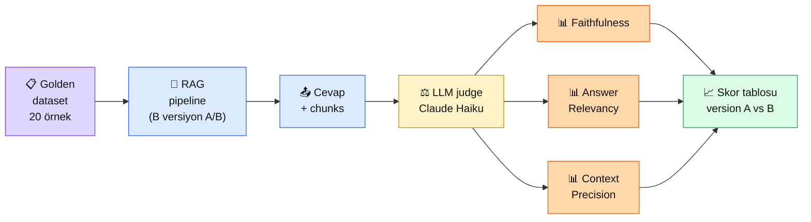

# 4.5 RAG Değerlendirme

<div class="ma-meta" markdown>
<div class="ma-meta-row" markdown>
<strong>Kim için:</strong>
<span class="ma-persona ma-persona-baslangic">🟢 başlangıç</span>
<span class="ma-persona ma-persona-is">🔵 iş</span>
<span class="ma-persona ma-persona-kisisel">🟣 kişisel</span>
</div>
<div class="ma-meta-row"><strong>📋 Önkoşul:</strong> 4.4 bitmiş — `/ask` endpoint'in çalışıyor, attribution + caching aktif; 2.8 prompt eval kavramı taze</div>
<div class="ma-meta-row"><strong>🎯 Çıktı:</strong> Kendi RAG'in için **20 örneklik golden dataset** hazırlarsın; **3 metrik** (faithfulness, context precision, answer relevancy) üzerinden LLM-as-judge ile otomatik skor alırsın; iki farklı chunking/retrieval ayarının skorunu **tablo halinde** karşılaştırırsın.</div>
</div>

!!! tip "Yabancı kelime mi gördün?"
    Bu sayfadaki **italik-altı çizili** ifadelerin (eval, golden dataset, faithfulness, judge gibi) üstüne mouse'unu getir — kısa tanım çıkar.

## Neden bu sayfa?

4.1-4.4'te **teknik katmanları** kurdun: chunking, retrieval, context eng. Ama *"bu iyileştirmeler gerçekten iyileştirdi mi?"* sorusunu henüz **sayıyla** cevaplayamıyorsun. "Daha iyi geldi" hissin var, ama rakamın yok. Üç ay sonra prompt'u değiştirdiğinde, contextual chunking'i açıp kapadığında, re-ranker eklediğinde: **iyi mi kötü mü gitti?** Eval olmadan cevap veremezsin.

İkincisi: **Eval RAG'ın CI/CD'si.** Yazılımda test suite olmadan deploy yaparsan felaket olur. RAG'da eval olmadan prompt değiştirirsen aynı felaket. "3 örneğe baktım, iyi çalışıyor" = anekdot, değil kanıt. 20 örnekle golden dataset + metrik = **kanıt** — küçük değişikliğin toplam etkisi sayıyla görülür.

Üçüncüsü: **Anthropic 2024'ten beri eval'a büyük yatırım yaptı** — Console'da "Evaluate" sekmesi, cookbook'ta eval rehberleri, [docs.claude.com/test-and-evaluate](https://docs.claude.com/en/docs/test-and-evaluate) tam bir kategori. Bu olgun AI development'ın temel ayağı. Startup mühendisinden farklı olarak ciddi AI takımları eval'i production'dan önce kurar, her değişikliği eval'dan geçirir.

## Eval kısaca — üç paragraf, matematiksiz

**Golden dataset = soru + doğru cevap + hangi chunks'tan geleceği.** 20-50 örnekten oluşur (başlangıç için 20 yeter). Her örnekte: "Kurban fiyatı ne?" + beklenen cevap + "bilgi chunk_3'te." Dataset'i **elle** hazırlarsın, sonra sisteminden geçirirsin, çıktıları golden ile karşılaştırırsın.

**3 ana metrik — RAGAS framework'unun özü.** (1) **Faithfulness** — cevap gerçekten chunks'taki bilgiden mi üretildi yoksa uyduruldu mu? (2) **Answer Relevancy** — cevap soruya gerçekten cevap veriyor mu, konu dışına kaymış mı? (3) **Context Precision** — retrieval'ın getirdiği top-K chunks'ın içinde cevaba katkı sağlayan kaç tanesi var? Üçü bağımsız: biri yüksek, biri düşük olabilir; bu da **nerede tamir lazım** sinyali verir.

**LLM-as-judge = skorlayıcı olarak Claude.** Her metrik için Claude Haiku'ya şu iş verirsin: "Şu cevap, şu chunks'tan üretildi mi? 0-1 arası puan ver." Claude Haiku 1000 eval'ı ~$2-5'e yapar. Ucuz + yeterince tutarlı. RAGAS kütüphanesi bu iş akışını hazır sunar; ama prensibi anlarsan Haiku ile 30 satırda aynısını yazarsın — üçüncü parti bağımlılık azalır.

## Bu sayfanın ekosistemi — kim kime ne veriyor

<div class="ma-ekosistem" markdown>
<div class="ma-ekosistem-header">🗺️ Ekosistem — golden dataset'ten skor tablosuna</div>



<table class="ma-aktorler" markdown>

| Düğüm | Nerede | Ne iş yapıyor |
|---|---|---|
| 📋 **Golden dataset** | `golden.jsonl` dosya | 20 örnek: soru + doğru cevap + kaynak chunk_id |
| 🔧 **RAG pipeline** | `/ask` endpoint (A sürümü veya B sürümü) | Sorguyu alır, chunks getirir, Claude'la cevap üretir |
| 📤 **Cevap + chunks** | JSON response | Pipeline çıktısı — hem cevap metni hem retrieval chunks |
| ⚖️ **LLM judge** | Claude Haiku 4.5 | Her metrik için 0-1 puan üretir |
| 📊 **3 metrik** | Haiku'nun cevabı parse edilmiş | Faithfulness, Relevancy, Precision |
| 📈 **Skor tablosu** | Markdown tablo / Google Sheet | Her versiyonun skoru yan yana |

</table>
</div>

## Uygulama — iki yol

### Yol A — 20 örneklik golden dataset + 3 metrik eval

```python
import json
import anthropic
from pathlib import Path

client = anthropic.Anthropic()
HAIKU = "claude-haiku-4-5-20251001"

# --- 1. GOLDEN DATASET (elle hazırlanır, 20 örnek) ---
GOLDEN = [
    {
        "soru": "Büyükbaş kurban fiyatı 2026'da ne kadar?",
        "beklenen": "14.000 TL",
        "hangi_chunk": "fiyat_tarifesi_2026",
    },
    {
        "soru": "IBAN bilgisi var mı?",
        "beklenen": "TR12 3456 7890",
        "hangi_chunk": "banka_bilgileri",
    },
    {
        "soru": "Vakfın başkanı kim?",
        "beklenen": "bilgi_yok",  # kasten — bulunmayan bilgi, 'bilmiyorum' bekleniyor
        "hangi_chunk": None,
    },
    # ... 17 örnek daha
]

# golden.jsonl dosyasına kaydet — tekrar kullanılabilir
Path("golden.jsonl").write_text(
    "\n".join(json.dumps(r, ensure_ascii=False) for r in GOLDEN),
    encoding="utf-8",
)


# --- 2. RAG PIPELINE'DAN CEVAP AL (A/B sürüm) ---
def rag_pipeline(soru: str, versiyon: str = "A") -> dict:
    """
    versiyon A: vektör-only retrieval, paragraf chunking
    versiyon B: hibrit (vec+BM25) + rerank + contextual chunking
    """
    # ... 4.2-4.4'ten çağrılar burada
    # Dönüş: {"cevap": "...", "chunks": [{"id": ..., "metin": ...}]}
    ...


# --- 3. LLM-AS-JUDGE METRİKLERİ ---
def skorla_faithfulness(cevap: str, chunks: list) -> float:
    baglam = "\n".join(f"[{i}] {c['metin']}" for i, c in enumerate(chunks))
    prompt = f"""Cevap verilen kaynaklardan mı üretildi yoksa uydurmaları var mı?

<kaynaklar>
{baglam}
</kaynaklar>

<cevap>{cevap}</cevap>

0 ile 1 arası tek bir ondalık puan ver: 0 = tamamen uydurma, 1 = tamamen kaynaklardan.
Sadece sayıyı yaz, başka açıklama yok."""
    r = client.messages.create(
        model=HAIKU, max_tokens=10,
        messages=[{"role": "user", "content": prompt}]
    )
    try:
        return float(r.content[0].text.strip())
    except ValueError:
        return 0.0


def skorla_relevancy(soru: str, cevap: str) -> float:
    prompt = f"""Cevap soruya gerçekten cevap veriyor mu yoksa konu dışına mı kaymış?

<soru>{soru}</soru>
<cevap>{cevap}</cevap>

0 ile 1 arası tek ondalık puan: 0 = tamamen alakasız, 1 = soruya tam cevap.
Sadece sayıyı yaz."""
    r = client.messages.create(
        model=HAIKU, max_tokens=10,
        messages=[{"role": "user", "content": prompt}]
    )
    try:
        return float(r.content[0].text.strip())
    except ValueError:
        return 0.0


def skorla_context_precision(soru: str, chunks: list) -> float:
    """Top-K chunks'ın kaç tanesi soruya gerçekten katkı sağladı?"""
    baglam = "\n".join(f"[{i}] {c['metin'][:200]}" for i, c in enumerate(chunks))
    prompt = f"""Aşağıdaki chunks'tan kaç tanesi soruya cevap vermek için gerçekten yararlı?

<soru>{soru}</soru>
<chunks>
{baglam}
</chunks>

Yararlı olanların oranını 0-1 arası ondalık olarak ver. (Örn: 5 chunk'tan 3'ü yararlıysa 0.6)
Sadece sayıyı yaz."""
    r = client.messages.create(
        model=HAIKU, max_tokens=10,
        messages=[{"role": "user", "content": prompt}]
    )
    try:
        return float(r.content[0].text.strip())
    except ValueError:
        return 0.0


# --- 4. EVAL ÇALIŞTIR (versiyon A ve B için) ---
def eval_calistir(versiyon: str) -> dict:
    skorlar = {"faithfulness": [], "relevancy": [], "precision": []}
    for ornek in GOLDEN:
        cikti = rag_pipeline(ornek["soru"], versiyon)
        skorlar["faithfulness"].append(skorla_faithfulness(cikti["cevap"], cikti["chunks"]))
        skorlar["relevancy"].append(skorla_relevancy(ornek["soru"], cikti["cevap"]))
        skorlar["precision"].append(skorla_context_precision(ornek["soru"], cikti["chunks"]))
    return {
        "faithfulness": sum(skorlar["faithfulness"]) / len(skorlar["faithfulness"]),
        "relevancy":    sum(skorlar["relevancy"])    / len(skorlar["relevancy"]),
        "precision":    sum(skorlar["precision"])    / len(skorlar["precision"]),
    }


A = eval_calistir("A")  # naif RAG
B = eval_calistir("B")  # contextual + hibrit + rerank

print("| Metrik       | Versiyon A | Versiyon B | Fark  |")
print("|--------------|-----------:|-----------:|------:|")
for m in ["faithfulness", "relevancy", "precision"]:
    fark = B[m] - A[m]
    print(f"| {m:<12} | {A[m]:.3f}      | {B[m]:.3f}      | {fark:+.3f} |")
```

**Beklenen çıktı:**

```
| Metrik       | Versiyon A | Versiyon B | Fark   |
|--------------|-----------:|-----------:|-------:|
| faithfulness | 0.720      | 0.910      | +0.190 |
| relevancy    | 0.810      | 0.880      | +0.070 |
| precision    | 0.450      | 0.820      | +0.370 |
```

**Yorum:** Versiyon B (contextual + hibrit + rerank) her üç metrikte iyi. Özellikle **precision +0.370** — yani retrieval önceden alakasız chunks getiriyordu, rerank bunları eledi. **Faithfulness +0.190** önemli — cevap artık daha az uydurma. Pratikte deploy kararını bu tabloya bakıp veriyorsun — "B daha iyi, geç."

**Burada olan nedir (diyagram referansı):** Golden → RAG → 3 metrik → tablo. 20 örnek × 2 versiyon × 3 metrik = 120 Haiku çağrı × ~$0.002 = **~$0.24** tüm eval maliyeti. Her deploy'dan önce bu tabloyu bak.

### Yol B — RAGAS framework ile (daha fazla metrik, standart)

```bash
pip install ragas datasets
```

```python
from ragas import evaluate
from ragas.metrics import faithfulness, answer_relevancy, context_precision, context_recall
from datasets import Dataset

# Golden + pipeline çıktılarını dataset olarak hazırla
data = {
    "question": [ex["soru"] for ex in GOLDEN],
    "answer": [rag_pipeline(ex["soru"], "B")["cevap"] for ex in GOLDEN],
    "contexts": [[c["metin"] for c in rag_pipeline(ex["soru"], "B")["chunks"]] for ex in GOLDEN],
    "ground_truth": [ex["beklenen"] for ex in GOLDEN],
}
ds = Dataset.from_dict(data)

# Anthropic LLM'i judge olarak ayarla (ragas OpenAI default)
# ... ragas anthropic wrapper setup
sonuc = evaluate(
    ds,
    metrics=[faithfulness, answer_relevancy, context_precision, context_recall],
)
print(sonuc.to_pandas())
```

**RAGAS'ın eklediği 4. metrik — Context Recall:** Golden'deki doğru chunk'ın retrieval'da gelip gelmediği. "Beklenen bilginin chunk_3'te olduğunu biliyorum, top-5'te chunk_3 var mı?" — recall=1 varsa, 0 yoksa. Retrieval kalitesini direkt ölçer.

**Ne zaman RAGAS kullan:** Ekip büyükse, standart istenen alanlarda (mali, hukuki, sağlık), rapor şablonları gerekliyse. Küçük ekip/solo geliştirici için Yol A yeter, RAGAS overhead olabilir.

### Eval pratiği — ne zaman, nasıl?

| Durum | Eval sıklığı | Dataset boyutu |
|---|---|---|
| **Prompt değişikliği** | Her commit öncesi | 20 örnek yeter |
| **Chunking/retrieval refactor** | Büyük değişiklikte | 50-100 örnek |
| **Yeni model sürümü** (Haiku → Sonnet) | Bir kere | 100+ örnek |
| **Production monitoring** | Haftalık örneklem | 20 random canlı log |
| **Müşteri şikâyeti** | Şikâyet sonrası | O senaryo odaklı 5-10 örnek |

**Kural:** Eval değişikliğe göre ölçekle. 10 saniyelik prompt değişikliği için 1 saatlik eval yapmak mantıksız; 2 haftalık retrieval refactor için 20 örnek yetmiyor.

<div class="ma-anthropic-oz" markdown>
<div class="ma-anthropic-oz-header">📖 Anthropic bu konuyu nasıl anlatıyor — öz</div>

Anthropic eval'a **olgun AI development'ın temel ayağı** olarak bakar:

**1. Evaluate sekmesi Console'da built-in.** [console.anthropic.com](https://console.anthropic.com) → Evaluate. Tarayıcıda test seti yükle, prompt çeşitlerini yan yana karşılaştır, metrik tanımla. Kod yazmadan eval yapmanı sağlar — PM ve content ekipleri de kullanabilir.

**2. LLM-as-judge tavsiye edilen yaklaşım.** Anthropic docs'ta "complex criteria için insan değerlendirmesi + LLM judge kombinasyonu" önerir. Haiku ucuz, tutarlı, hızlı; Sonnet daha keskin — maliyet eşiğine göre seç.

**3. Eval-driven prompt engineering.** Anthropic iç ekipleri: önce eval seti kur, sonra prompt yaz, eval'a göre iterate et. "Eval'siz prompt değişikliği = kumarın yüzde 50'si" kültürü.

??? info "Teknik detay — isteyene (parameter adları, mekanikler, edge case'ler)"

    **Judge tutarlılığı.** Aynı Haiku çağrısı biraz değişken cevap verebilir (`temperature=0` ile azalır). Her örneği 3 kez puanla, ortalama al — güvenilirlik artar. "Self-consistency" deseni.

    **Judge önyargısı.** Claude kendi cevabını skorlarken biraz cömert olabilir ("self-evaluation bias"). Çözüm: cross-judge — cevabı farklı bir modele (Haiku) skorlatarak bias'ı azalt.

    **Golden dataset büyüme.** 20 başlar, 100'e çıkar, 500'e evrimleşir. Production'dan gelen gerçek sorular + manuel etiketleme = en iyi dataset kaynağı. Canlı log'ları haftalık tarama.

    **Negative testleri unutma.** Dataset'te "cevabı yok" senaryoları olmalı (benim örnekteki "vakfın başkanı kim?" gibi). RAG'ın "bilmiyorum" davranışı test edilir.

    **A/B test in production.** Canlıda versiyonu sadece %10 kullanıcıya göster, 1 hafta metrik topla, karar ver. Eval + A/B = kaliteli deploy.

    **Cost guardrails.** Her eval çağrısı maliyet. 50 sorgu × 4 metrik × 3 tekrar = 600 Haiku çağrı ~$1.20. CI/CD'ye her commit = ayda $30-50. Bütçeye uygun eval frequency seç.

    **Human eval hâlâ gerekli.** LLM judge çoğu durumda yeter ama kritik karar verici (ürün launch, mali rapor) 30 örneği insan gözüyle kontrol — her zaman.

<div class="ma-anthropic-oz-kaynak" markdown>
**Kaynak:** [docs.claude.com — Develop tests](https://docs.claude.com/en/docs/test-and-evaluate/develop-tests) (EN, ~15 dk). Anthropic'in eval metodolojisi. **Pekiştirme:** [RAGAS resmi dokümantasyon](https://docs.ragas.io/en/stable/) — RAG eval'in endüstri standardı framework'u.
</div>
</div>

<div class="ma-cikti-kaniti" markdown>
### 📦 Bu sayfayı bitirdiğini nasıl kanıtlarsın

#### 1. 📝 Refleksiyon yazısı — 5 dakika

> "20 örneklik golden dataset hazırladım. Versiyon A (naif) ve B (contextual + rerank) çalıştırdım. Faithfulness [X], relevancy [Y], precision [Z] farkı çıktı. En sürpriz bulgu: [hangi metrik beklenmedik]. Kendi projemde eval cadencem [her commit / haftalık / aylık] olacak."

Kaydet: `muhendisal-notlarim/bolum-4/05-eval/refleksiyon.txt`

#### 2. 📸 Ekran görüntüsü — 3 dakika

**Neyin görüntüsü:** Terminal veya notebook çıktısı — 3 metrik × 2 versiyon tablosu, fark sütunu belirgin.

Kaydet: `muhendisal-notlarim/bolum-4/05-eval/skor-tablosu.png`

#### 3. 💻 golden.jsonl + eval.py + GitHub — 10 dakika

20 örneklik `golden.jsonl` hazırla (kendi projenin sorularıyla). `eval.py` script'i yaz (Yol A kodu). Repo'ya commit'le, README'ye eval nasıl çalıştırılır yaz. Sonuç tablosunu `RESULTS.md` olarak ekle.

Repo linkini kaydet: `muhendisal-notlarim/bolum-4/05-eval/repo-link.txt`

</div>

<div class="ma-neden-sonuc" markdown>
<div class="ma-neden-sonuc-header">🔗 Birlikte okuma — neden ne oldu</div>

- **A → B:** "İyi çalışıyor hissi" = anekdot. Eval = kanıt. İkisi arasında 10 kat fark var.
- **B → C:** Golden dataset (soru + beklenen + kaynak) = **sabit test seti** — değişikliği bu set üstünden karşılaştırıyorsun.
- **C → D:** 3 bağımsız metrik (faithfulness / relevancy / precision) = her birinin zayıf olduğu yer farklı; tek skor yanıltır.
- **D → E:** LLM-as-judge = **ucuz ve tutarlı** skorlayıcı. İnsan yerine Haiku; tutarlı + hızlı + pahalı değil.
- **E → F:** A/B tablo = her deploy kararının temeli. "B'de precision 0.45 → 0.82, geçiyoruz" gibi somut kanıt.

<div class="ma-neden-sonuc-sonuc" markdown>
**Sonuç:** Eval RAG'ın **kör noktalarını görünür yapar.** Bölüm 4'teki tüm teknik yatırımların (chunking, retrieval, context eng) etkisi bu tablodayla ölçülebilir hale geldi. 4.6'da LangChain'le sıfırdan yazmayı karşılaştıracağız — eval datasetin olduğu için "framework fark ediyor mu?" sorusunu artık rakamla cevaplayabiliyorsun.
</div>
</div>

<div class="ma-sonraki" markdown>
<div class="ma-sonraki-header">➡️ Sonraki adım</div>

**[4.6 LangChain ile RAG →](06-langchain.md)** — Sıfırdan yazdığın RAG pipeline'ı LangChain ile karşılaştır. Framework kullanmak gerekli mi? %80 kod aynı — 4.5'teki eval tablonla karar verirsin.

← [4.4 Context Engineering](04-context-eng.md) &nbsp;|&nbsp; [Bölüm 4 girişi](index.md) &nbsp;|&nbsp; [Ana sayfa](../index.md)

**Pekiştirme:** Kendi `/ask` endpoint'ini 3 farklı prompt varyasyonuyla eval'dan geçir (örn: attribution var/yok, system prompt uzun/kısa, temperature 0/0.3). Hangi varyasyonun skoru en yüksek? Bu pratik prompt engineering'in gerçek tekniği — iterasyon + eval.
</div>
