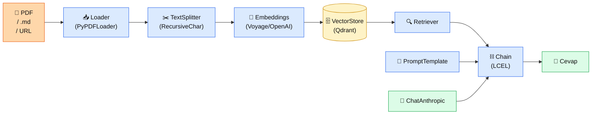

# 4.6 LangChain ile RAG

<div class="ma-meta" markdown>
<div class="ma-meta-row" markdown>
<strong>Kim için:</strong>
<span class="ma-persona ma-persona-baslangic">🟢 başlangıç</span>
<span class="ma-persona ma-persona-is">🔵 iş</span>
<span class="ma-persona ma-persona-kisisel">🟣 kişisel</span>
</div>
<div class="ma-meta-row"><strong>📋 Önkoşul:</strong> 4.1-4.5 bitmiş; kendi RAG iskeletini elden yazmış, neyin ne yaptığını biliyorsun</div>
<div class="ma-meta-row"><strong>🎯 Çıktı:</strong> Aynı RAG'i **LangChain ile 20 satırda** kurarsın; elden yazdığın ile karşılaştırırsın; LangChain'in **kazandırdığı ve götürdüğü** şeyleri sayıyla bilirsin; kendi projen için **seçim** yaparsın (elden vs LangChain).</div>
</div>

!!! tip "Yabancı kelime mi gördün?"
    Bu sayfadaki **italik-altı çizili** ifadelerin (abstraction, chain, retriever gibi) üstüne mouse'unu getir — kısa tanım çıkar. Mobilde dokun.

## Neden bu sayfa?

4.1-4.4'te RAG'i **elden** yazdın — chunking + embedding + Qdrant + retrieval + prompt birleştirme. 4.5'te eval ekledin. Toplam ~200 satır kod. LangChain bunu **20 satıra** indiriyor. Neden elden yazdıktan sonra LangChain'i öğreniyoruz? Çünkü **"neyin gizlendiğini"** bilmeden kütüphane kullanmak en tehlikeli şey.

İkincisi: **LangChain ekosistemin standart kütüphanesi** (2022'den beri). 2026'da neredeyse her RAG tutorial'ı LangChain ile başlıyor. İş ilanlarında "LangChain experience" arandığını görürsün. Öğrenmemek = ekosistemden kopuk olmak.

Üçüncüsü: Ama LangChain **her iş için doğru değil.** Öğrendikten sonra **seçim yapmak** için. Bazı projede elden yazmak daha iyi (özel gereksinim, performans kritik), bazı projede LangChain daha iyi (hızlı iterasyon, prototip, ekip kullanımı). Bu sayfa sana **iki ayak** veriyor, sonra sen seçiyorsun.

## LangChain kısaca — üç paragraf, matematiksiz

**LangChain = LLM uygulamaları için Python çatısı.** Nasıl FastAPI HTTP servisi için iskelet veriyorsa, LangChain LLM-DB-prompt-output zinciri için iskelet veriyor. Ana kavramlar: **loader** (belge yükleyici), **splitter** (chunker), **embedder**, **vector store**, **retriever**, **chain**. Her biri bir "component" — plug-and-play değiştirirsin.

**Temel felsefe: "chain".** LLM çağrıları birbirine bağlanır — RAG chain = "soru al → retrieve et → prompt doldur → LLM çağır → cevap dön". LangChain bunu 4 satırda ifade eder. Dezavantaj: arkada ne oluyor görünmez, debug zor. Avantaj: 200 satırlık kod 4 satıra iner.

**LangSmith = LangChain'in observability katmanı.** Her chain adımını loglar, chain görselleştirir, trace gösterir. Ücretsiz başlangıç, sonra ücretli. Production'da kullanırsan değerli — "cevap neden yanlıştı?" sorusunun cevabını 30 saniyede buluyorsun (elden yazınca print statement'larla 30 dakika).

## Bu sayfanın ekosistemi — kim kime ne veriyor

<div class="ma-ekosistem" markdown>
<div class="ma-ekosistem-header">🗺️ Ekosistem — LangChain komponentleri</div>



<table class="ma-aktorler" markdown>

| Düğüm | LangChain adı | Ne yapıyor |
|---|---|---|
| 📥 **Loader** | `PyPDFLoader`, `TextLoader`, `WebBaseLoader` | Dosya/URL → `Document` nesnesi (text + metadata) |
| ✂️ **TextSplitter** | `RecursiveCharacterTextSplitter`, `SemanticChunker` | Document'ları chunk'lara böler (4.2) |
| 🧮 **Embeddings** | `VoyageAIEmbeddings`, `OpenAIEmbeddings` | Chunk → vector (3.1) |
| 🗄 **VectorStore** | `Qdrant`, `Chroma`, `Pinecone` | Vectorları depolar + benzerlik ara |
| 🔍 **Retriever** | `.as_retriever(search_kwargs={"k":5})` | Soru → top-K chunk |
| 📝 **PromptTemplate** | `ChatPromptTemplate.from_template(...)` | Şablon + değişken (2.6) |
| 🤖 **ChatAnthropic** | `langchain_anthropic.ChatAnthropic` | Claude SDK sarmalayıcı |
| ⛓️ **Chain** | **LCEL** (`|` operatörüyle) | Tüm adımları pipeline'a bağlar |

</table>
</div>

## Uygulama — iki yol

### Yol A — En sade RAG (20 satır)

Kurulum:

```bash
pip install langchain langchain-anthropic langchain-qdrant langchain-voyageai
```

`rag_langchain.py`:

```python
from langchain_anthropic import ChatAnthropic
from langchain_voyageai import VoyageAIEmbeddings
from langchain_qdrant import QdrantVectorStore
from langchain.text_splitter import RecursiveCharacterTextSplitter
from langchain_community.document_loaders import TextLoader
from langchain_core.prompts import ChatPromptTemplate
from langchain_core.runnables import RunnablePassthrough
from langchain_core.output_parsers import StrOutputParser

# 1. Yükle + böl
docs = TextLoader("hbv-bilgi-bankasi.md").load()
chunks = RecursiveCharacterTextSplitter(chunk_size=500, chunk_overlap=50).split_documents(docs)

# 2. Embedding + vector store
emb = VoyageAIEmbeddings(model="voyage-3")
vs = QdrantVectorStore.from_documents(chunks, emb, url="http://localhost:6333", collection_name="hbv")

# 3. Retriever + prompt + LLM
retriever = vs.as_retriever(search_kwargs={"k": 5})
prompt = ChatPromptTemplate.from_template("""Aşağıdaki belgelere dayanarak soruyu cevapla.
Belgede yoksa 'kaynaklarda yok' de, uydurma yapma.

<belge>
{context}
</belge>

Soru: {question}""")
llm = ChatAnthropic(model="claude-sonnet-4-5", temperature=0)

# 4. Chain — LCEL (LangChain Expression Language)
rag_chain = (
    {"context": retriever, "question": RunnablePassthrough()}
    | prompt
    | llm
    | StrOutputParser()
)

# 5. Çağır
cevap = rag_chain.invoke("Kurban bedeli 2026 yılı ne kadar?")
print(cevap)
```

**Çıktı (yaklaşık):**

```
Hacı Bayram-ı Veli Vakfı'nın 2026 yılı kurban bedeli 14.000 TL'dir.
Bu tutar vakıf yönetimi tarafından yıllık güncellenir.
```

**Burada olan nedir (diyagram referansı):** Diyagramın tüm akışı 20 satıra sığdı. LCEL'in `|` operatörü her adımı bir pipeline'a bağlıyor — `retriever | prompt | llm | parser`. Her bileşen **değiştirilebilir** — Qdrant yerine Chroma, Voyage yerine OpenAI, Claude yerine Llama.

### Yol B — LangSmith ile trace + karşılaştırma

```bash
pip install langsmith
export LANGSMITH_API_KEY=ls__...  # langsmith.com'dan ücretsiz al
export LANGSMITH_TRACING=true
export LANGSMITH_PROJECT=hbv-rag-test
```

Yukarıdaki `rag_chain.invoke(...)` çağrısı **otomatik log'lanır.** LangSmith web panelinde:

- Her adımın latency'si (retrieval: 120ms, LLM: 2300ms)
- Retriever'ın getirdiği 5 chunk'ın **tam metni**
- Prompt'un final hali (template + doldurulmuş context)
- Claude'un raw cevabı
- Token kullanımı

Bir cevap yanlışsa hangi adımda patladığını **gözle** görüyorsun — retrieval yanlış chunk mu getirmiş, prompt mu bozuk, Claude halüsine mi etmiş.

### Elden yazılan vs LangChain — karşılaştırma

| Kriter | Elden yazım (4.1-4.4) | LangChain |
|---|---|---|
| **Kod satırı** | ~200 | ~20 |
| **Öğrenme eğrisi** | Her katmanı anladın | Abstraction bol, önce elden öğren |
| **Debug kolaylığı** | Print statement, görünür | LangSmith şart; yoksa zor |
| **Özelleştirme** | İstediğin gibi değiştir | LangChain sınırında kal (veya subclass) |
| **Performans** | Yazdığın kadar hızlı | ~%5-10 overhead (abstraction) |
| **Kütüphane güncellemesi** | Sen kontrol ediyorsun | LangChain her hafta değişir, breaking changes |
| **Ekip onboarding** | Kod okuyarak | LangChain bilen biri bildiğini getirir |
| **Production uzun vadeli** | Bakım sen | Community + LangSmith |
| **Prototip hızı** | Yavaş | Çok hızlı |

**Pratik öneri:** Prototip ve **PoC** (proof of concept) → LangChain. Production **kritik** + özel gereksinim → elden yaz. Ara durum: LangChain'le başla, ihtiyaç olunca kritik parçaları elden yaz (hybrid).

### LangChain'in sakındığın tuzakları

- **Versiyon değişir.** `langchain==0.1` → `0.2` → `0.3` breaking changes çıktı. requirements.txt'te **pin sabitle.**
- **LCEL büyüdükçe okunmaz olur.** 10+ bileşen `|` ile zincirlenince debug cehennemi. Büyük chain'i fonksiyonlara böl.
- **Community kod kalitesiz olabilir.** `langchain_community` altındaki bazı integration'lar stable değil. **Resmi partner package** varsa onu kullan (`langchain_anthropic` resmi, `langchain_qdrant` resmi).
- **Overkill.** Tek soru-cevap için LangChain = bazooka ile sivrisinek. `anthropic` SDK + 5 satır yeter.

<div class="ma-anthropic-oz" markdown>
<div class="ma-anthropic-oz-header">📖 Anthropic bu konuyu nasıl anlatıyor — öz</div>

Anthropic LangChain'i **önermez de, kötülemez de.** Resmi `langchain_anthropic` package var → ortak çalışıyor. Ama Anthropic'in kendi örnekleri genellikle **SDK'yı direkt** kullanır — "abstraction az, şeffaf" felsefesi.

**1. Resmi partner package var.** `langchain_anthropic` — Anthropic + LangChain ortak maintain ediyor. `ChatAnthropic`, `AnthropicLLM`, tool use, streaming, async hepsi destekli.

**2. Anthropic cookbook'ta LangChain az.** [anthropic-cookbook](https://github.com/anthropics/anthropic-cookbook) notebook'larının **%80'i raw SDK** kullanır. Mesaj: "LangChain gerekli değil, bizim SDK yeter."

**3. Anthropic'in kendi felsefesi: "build on primitives".** Claude Code, Claude SDK — hepsi düşük seviyeli primitives üstüne kurulu. "Agentic pattern'leri LangChain abstraction'larıyla kurmak" yerine "primitives + kendi agent yapına kur" deniyor. Bölüm 6'da detay.

??? info "Teknik detay — isteyene (parameter adları, mekanikler, edge case'ler)"

    **LangGraph = agent için alt-proje.** LangChain'in agent/workflow tarafı ayrı paket oldu: `langgraph`. State machine + loop + conditional edges. Bölüm 6'da agent bağlamında tekrar ele alacağız.

    **LCEL batch + stream + async.** `rag_chain.batch([q1, q2, q3])` paralel, `.stream(...)` token-token, `.ainvoke(...)` async. Hepsi ücretsiz (LCEL sayesinde).

    **Custom retriever.** `BaseRetriever` subclass'ıyla kendi retrieval mantığını LangChain'e bağlayabilirsin. Contextual Retrieval (4.4) custom retriever olarak yazılabilir.

    **Tool use + LangChain.** `llm.bind_tools([tool1, tool2])` → Claude tool calling LangChain zincirine bağlanır. Agent'ların temeli. Bölüm 6.

    **Prompt management.** LangSmith'te prompt'ları sürümlü tutabilirsin — 2.6'da `prompts/` klasöründe yaptığımızın bulut versiyonu.

    **LangChain'e alternatifler.** LlamaIndex (data-centric, 4.7), Haystack (Deepset, prod-odaklı), Semantic Kernel (Microsoft), DSPy (Stanford, programmable prompts). 2026'da LangChain hâlâ en yaygın ama rekabet sert.

<div class="ma-anthropic-oz-kaynak" markdown>
**Kaynak:** [python.langchain.com — Anthropic integration](https://python.langchain.com/docs/integrations/chat/anthropic/) (EN, ~15 dk). `ChatAnthropic` tüm parametreler + örnekler. Pekiştirme: [Anthropic Cookbook'taki LangChain örnekleri](https://github.com/anthropics/anthropic-cookbook/tree/main/third_party/LangChain) — Claude + LangChain birleşimi production desen.
</div>
</div>

<div class="ma-cikti-kaniti" markdown>
### 📦 Bu sayfayı bitirdiğini nasıl kanıtlarsın

#### 1. 📝 Refleksiyon yazısı — 5 dakika

> "LangChain ile RAG'i [X] satıra indirdim. Elden yazdığımda [Y] satırdı, oran [Y/X]x. LangSmith trace'inde en çok [hangi adım] sürüyor: [ms]. Kendi projem için [LangChain / elden yazım / hybrid] seçeceğim çünkü..."

Kaydet: `muhendisal-notlarim/bolum-4/06-langchain/refleksiyon.txt`

#### 2. 📸 Ekran görüntüsü — 3 dakika

**Neyin görüntüsü:** LangSmith web paneli — bir RAG çağrısının trace'i, her adım + latency görünür.

Kaydet: `muhendisal-notlarim/bolum-4/06-langchain/langsmith-trace.png`

#### 3. 💻 Yan yana karşılaştırma repo + GitHub — 15 dakika

`rag-karsilastirma/` klasörü: `elden_yazim.py` (4.1-4.4 özeti) + `langchain_yazim.py` (bu sayfa) + `README.md` (kod satırı, latency, LangSmith trace link). GitHub'a public repo.

Repo linkini kaydet: `muhendisal-notlarim/bolum-4/06-langchain/karsilastirma-repo-link.txt`

</div>

<div class="ma-neden-sonuc" markdown>
<div class="ma-neden-sonuc-header">🔗 Birlikte okuma — neden ne oldu</div>

- **A → B:** Elden yazdın, her katmanı biliyorsun — abstraction'ları okuyunca şok olmuyorsun.
- **B → C:** LangChain'in 200→20 satır kazancı = **prototip hızı.** 10 fikri hafta sonu deneyebilirsin.
- **C → D:** LangSmith observability = "neden yanlış?" sorusunu 30 saniyede cevaplama.
- **D → E:** LangChain her iş için doğru değil — seçim kriterleri listede. **Araç seçmek = mühendisliğin yarısı.**
- **E → F:** Resmi `langchain_anthropic` partner paketi = Anthropic ile birlikte maintain. Güvenli köprü.

<div class="ma-neden-sonuc-sonuc" markdown>
**Sonuç:** Artık iki ayağın var — elden (derin anlayış) ve LangChain (hızlı prototip). Gerçek dünyada mühendis her ikisini de bilen kişi, sadece birini savunan değil. 4.7'de LlamaIndex'e de kısa bakış sonra 4.8'de HBV production case'i (Kemal'in gerçek projesi).
</div>
</div>

<div class="ma-sonraki" markdown>
<div class="ma-sonraki-header">➡️ Sonraki adım</div>

**[4.7 LlamaIndex ile RAG →](07-llamaindex.md)** — LangChain'in "data-first" rakibi. Doküman-yoğun projelerde daha güçlü. Hangi durumda ne tercih?

← [4.5 RAG Değerlendirme](05-degerlendirme.md) &nbsp;|&nbsp; [Bölüm 4 girişi](index.md) &nbsp;|&nbsp; [Ana sayfa](../index.md)

**Pekiştirme:** Kendi RAG chain'ine **Contextual Retrieval** (4.4) custom retriever olarak ekle. LangChain dünyasında `BaseRetriever` subclass'ı = Anthropic'in tekniği + LangChain'in ekosistemi.
</div>
