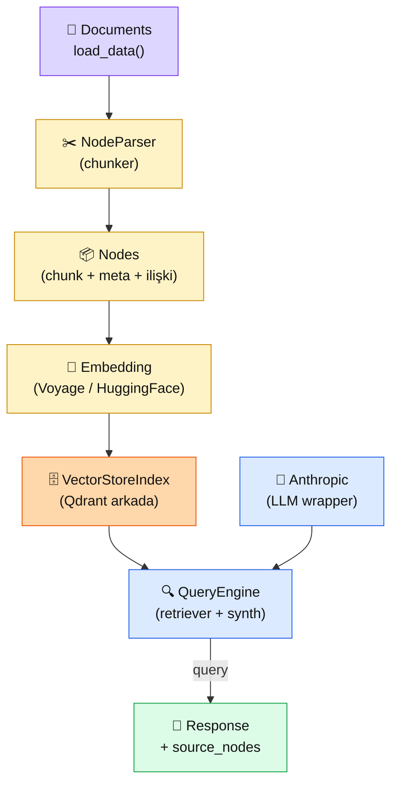

# 4.7 LlamaIndex ile RAG

<div class="ma-meta" markdown>
<div class="ma-meta-row" markdown>
<strong>Kim için:</strong>
<span class="ma-persona ma-persona-baslangic">🟢 başlangıç</span>
<span class="ma-persona ma-persona-is">🔵 iş</span>
<span class="ma-persona ma-persona-kisisel">🟣 kişisel</span>
</div>
<div class="ma-meta-row"><strong>📋 Önkoşul:</strong> 4.1-4.5 elden RAG bitmiş + 4.6 LangChain denemiş; ikisinin **felsefi** farkını anlamaya hazırsın</div>
<div class="ma-meta-row"><strong>🎯 Çıktı:</strong> Aynı RAG'i **LlamaIndex ile 15 satırda** kurarsın; LangChain ile yan yana koyarsın; ikisinin **felsefi farkını** (chain vs index, agent vs document) kendi cümlelerinle anlatırsın; kendi projen için hangisi daha uygun kararını verirsin.</div>
</div>

!!! tip "Yabancı kelime mi gördün?"
    Bu sayfadaki **italik-altı çizili** ifadelerin (index, node, query engine gibi) üstüne mouse'unu getir — kısa tanım çıkar. Mobilde dokun.

## Neden bu sayfa?

LangChain (4.6) ve LlamaIndex **aynı ekosistemde iki rakip** — ikisi de RAG kurar, ama **başlangıç varsayımları farklı.** LangChain "agent" merkezli düşünür ("LLM'e ne yapacağını söyle, zincirle, tool'lar ver"). LlamaIndex **belge merkezli** düşünür ("belgeyi indexle, sorguyla gel, RAG'ın daha doğal aracı benim"). İkisini öğrenmek = iki ayrı zihinsel modele sahip olmak.

İkincisi: RAG **kurumsal ürünlerde** LlamaIndex daha çok tercih ediliyor (2024-2026 trendi). Sebep: LlamaIndex'in `VectorStoreIndex`, `NodeParser`, `QueryEngine` gibi abstraksiyonları RAG'ın kendi kavramlarıyla örtüşür. LangChain'de RAG bir **alt desen**; LlamaIndex'te RAG **ana amacı**. Bu fark tutorial'larda, API'de, dokümantasyonda hissediliyor.

Üçüncüsü: **Karar verme zamanı.** Bu sayfa bittiğinde üç seçeneğin var: elden yaz (4.1-4.4), LangChain kullan (4.6), LlamaIndex kullan (4.7). Her projede bir seçim yapacaksın. Bu sayfa sana **üçüncü seçeneği** veriyor — artık bilinçli karar verebileceksin.

## LlamaIndex kısaca — üç paragraf, matematiksiz

**LlamaIndex'in çekirdek kavramı: "Index".** LangChain'de "Chain" (işlem zinciri) merkezdedir; LlamaIndex'te "Index" (belge üstünde arama yapısı) merkezde. `VectorStoreIndex.from_documents(docs)` bir satırda: belgeyi parçala, embed et, sakla, indexle. 4 adımı tek soyutlama.

**Node = chunk.** LlamaIndex "chunk" yerine "Node" der. Her Node'un `text`, `metadata`, `relationships` var (parent/prev/next sibling). Bu graf yapısı — LangChain'in düz chunk listesinden farkı. Karmaşık belgelerde (hiyerarşik PDF, sözleşme bölümleri) Node ilişkileri **retrieval sırasında ek bağlam** sağlar.

**Query Engine = RAG pipeline tek nesne.** `index.as_query_engine(llm=Anthropic(model="..."))` bir satırda: retriever + reranker + response synthesizer hazır. Çağırıyorsun `.query("soru")`, cevap geliyor. LangChain'de `RetrievalQA.from_chain_type(...)` benzeri, ama LlamaIndex'te kavramlar RAG'a daha yakın adlandırılmış.

## Bu sayfanın ekosistemi — kim kime ne veriyor

<div class="ma-ekosistem" markdown>
<div class="ma-ekosistem-header">🗺️ Ekosistem — LlamaIndex soyutlama katmanları</div>



<table class="ma-aktorler" markdown>

| Düğüm | LlamaIndex sınıfı | Ne iş yapıyor |
|---|---|---|
| 📄 **Documents** | `SimpleDirectoryReader` / `Document` | PDF, MD, TXT, URL yükle |
| ✂️ **NodeParser** | `SentenceSplitter`, `SemanticSplitterNodeParser` | Chunking stratejisi (4.2'deki 4 yol buralarda) |
| 📦 **Nodes** | `TextNode` + `metadata` + `relationships` | Chunk + meta + bağlantı grafı |
| 🔢 **Embedding** | `VoyageEmbedding`, `HuggingFaceEmbedding` | Embedding modeli wrapper'ı |
| 🗄️ **VectorStoreIndex** | `VectorStoreIndex`, `QdrantVectorStore` | Tüm chunking+embedding+saklama tek çağrıda |
| 🔍 **QueryEngine** | `index.as_query_engine(llm=...)` | Retriever + Synthesizer birleşik |
| 🤖 **LLM wrapper** | `Anthropic(model="claude-sonnet-4-6")` | LLM çağrılarını standardize eder |
| 💬 **Response** | `response.response` + `response.source_nodes` | Cevap + kaynak Node listesi (attribution) |

</table>
</div>

## Uygulama — iki yol

### Yol A — LlamaIndex ile 15 satırda RAG

```bash
pip install llama-index llama-index-llms-anthropic llama-index-embeddings-huggingface
```

```python
from llama_index.core import VectorStoreIndex, SimpleDirectoryReader, Settings
from llama_index.llms.anthropic import Anthropic
from llama_index.embeddings.huggingface import HuggingFaceEmbedding

# Global ayar — LLM ve embedding modeli
Settings.llm = Anthropic(model="claude-sonnet-4-6")
Settings.embed_model = HuggingFaceEmbedding(
    model_name="sentence-transformers/paraphrase-multilingual-mpnet-base-v2"
)

# 1) Belgeleri yükle (data/ klasöründe PDF/MD/TXT)
docs = SimpleDirectoryReader("data/hbv_bilgi").load_data()

# 2) Index kur (chunking + embedding + storage TEK SATIRDA)
index = VectorStoreIndex.from_documents(docs)

# 3) Query engine — RAG hazır
qe = index.as_query_engine(similarity_top_k=5)

# 4) Soru sor
r = qe.query("Yurtdışı bağış fiyatı ne kadar?")
print(r.response)

# 5) Kaynak Node'lar (attribution)
for node in r.source_nodes:
    print(f"  [skor {node.score:.3f}] {node.text[:100]}...")
```

**Beklenen çıktı:**

```
Yurtdışı bağışlar için USD bazlı ayrı tarife uygulanır: büyükbaş hissesi
500 USD, küçükbaş 250 USD. Ödemeler PayPal veya banka havalesi ile
yapılabilir.

  [skor 0.891] Yurtdışı bağışlar farklı hesaplanır. USD tarifesi için...
  [skor 0.654] IBAN TR12 3456 7890 Ziraat Bankası...
```

**Burada olan nedir (diyagram referansı):** Tek satır `VectorStoreIndex.from_documents(docs)` diyagramın 4 düğümünü (NodeParser + Nodes + Embedding + VectorStoreIndex) zincirleyerek çalıştırıyor. 4.1-4.4'te elden yazdığın 100+ satır, burada **varsayılan ayarlarla** 5 satıra iniyor.

### Yol B — Contextual + Qdrant + Rerank (production yapı)

```python
from llama_index.core import VectorStoreIndex, StorageContext
from llama_index.core.node_parser import SentenceSplitter
from llama_index.vector_stores.qdrant import QdrantVectorStore
from llama_index.core.postprocessor import SentenceTransformerRerank
from qdrant_client import QdrantClient

# Qdrant (4.3'ten)
qdrant = QdrantClient(url="http://localhost:6333")
vector_store = QdrantVectorStore(client=qdrant, collection_name="hbv_li")
storage_ctx = StorageContext.from_defaults(vector_store=vector_store)

# Chunking stratejisi — 4.2'deki paragraf yaklaşımına denk
Settings.node_parser = SentenceSplitter(chunk_size=500, chunk_overlap=50)

# Index'i Qdrant üstüne kur
index = VectorStoreIndex.from_documents(
    docs, storage_context=storage_ctx
)

# Rerank post-processor
reranker = SentenceTransformerRerank(
    model="cross-encoder/ms-marco-MiniLM-L-12-v2",  # veya Cohere/Voyage wrapper
    top_n=3,
)

# Query engine — top-20 getir, top-3'e rerank, Claude cevap üret
qe = index.as_query_engine(
    similarity_top_k=20,
    node_postprocessors=[reranker],
)

r = qe.query("Bağıştan sonra fotoğraf istemezsem ne olur?")
print(r.response)
print(f"Kaynak {len(r.source_nodes)} Node'dan sentezlendi")
```

**Burada olan nedir (diyagram referansı):** LangChain'de `RetrievalQA` + `ContextualCompressionRetriever` + `CohereRerank` 3-4 sınıf gerektirirken, LlamaIndex'te `similarity_top_k=20` + `node_postprocessors=[reranker]` iki parametre. **Aynı pipeline, daha az kavram.**

### LangChain vs LlamaIndex — felsefi + pratik karşılaştırma

| Kriter | **LangChain (4.6)** | **LlamaIndex (4.7)** | **Elden (4.1-4.4)** |
|---|---|---|---|
| Felsefe | Chain / Agent merkezli | Index / Document merkezli | Kontrol merkezli |
| RAG kod satırı | ~20 | ~15 | ~200 |
| Kavramsal yük | Yüksek (Chain, Tool, Agent, Memory...) | Orta (Document, Node, Index, QueryEngine) | Düşük (doğrudan Python) |
| Kontrol | Orta (abstraksiyon sızıntıları) | Orta (config parametreleri) | Yüksek (her şey sende) |
| Ekosistem | **Çok geniş** (agent, tool, memory için ideal) | **RAG-odaklı** (PDF, hiyerarşik, grafik index) | Kendi ekosistemin |
| Topluluk | 95K+ GitHub stars | 35K+ GitHub stars | — |
| Debug | Zor (zincir katmanları) | Orta (daha sade) | Kolay (kendi kodun) |
| Öğrenme eğrisi | Dik (çok kavram) | Orta | Düz (temel Python) |
| Performans | Orta (abstraksiyon overhead) | Orta (benzer) | Yüksek (native) |
| 2026 trendi | Agent + tool use senaryolar için güçleniyor | RAG uygulamaları için standartlaşıyor | Hybrid (elden + kütüphane parçaları) |

**Karar ağacı:**

- **RAG merkezli mi projen?** → LlamaIndex
- **Agent + çoklu tool use + MCP?** → LangChain (veya Anthropic native, Bölüm 6)
- **Maksimum kontrol + minimum bağımlılık?** → Elden
- **Prototip hızı önemli?** → Hangisini bilirsen o
- **HBV gibi üretim RAG projesi?** → Elden (şeffaflık) veya LlamaIndex (hız)

<div class="ma-anthropic-oz" markdown>
<div class="ma-anthropic-oz-header">📖 Anthropic bu konuyu nasıl anlatıyor — öz</div>

Anthropic **ne LangChain ne LlamaIndex'e** özel bağlılık göstermez — üçüncü parti kütüphaneler `claude-cookbooks`'ta opsiyon olarak geçer, resmi bir tavsiye yok:

**1. Anthropic resmi SDK yeterli RAG için.** `anthropic.Anthropic()` + `messages.create(...)` ile prompt caching + tool use + structured output — hepsi elden yazılabilir. Anthropic "abstraksiyon gerektirmez, bizim SDK kuvvetli" tutumunda.

**2. LlamaIndex ve LangChain Anthropic wrapper'ı hazır.** `llama-index-llms-anthropic` ve `langchain-anthropic` paketleri **Anthropic tarafından desteklenir**. Üçüncü parti kütüphane tercihinde Claude'u devre dışı bırakmak zorunda değilsin.

**3. "Framework yorgunluğu" trendi.** 2024-2026'da mühendis topluluğu framework abstraksiyonlarını sorgulamaya başladı (@hwchase17, LangChain yaratıcısının kendi dahi). Anthropic "bizim SDK + iyi prompt = çoğu iş tamam" mesajını bu ortamda net veriyor. Claude Code'ın kendi LangChain kullanmaması = ilan gibi.

??? info "Teknik detay — isteyene (parameter adları, mekanikler, edge case'ler)"

    **Settings global state.** LlamaIndex 0.10+ sürümünde `Settings.llm`, `Settings.embed_model` global konfig. Production'da tek proje için iyi, mikro servislerde izolasyon kaybı.

    **Response synthesizer modları.** `response_mode="compact"` (default, tek LLM çağrısı), `"tree_summarize"` (hiyerarşik), `"accumulate"` (her node için ayrı cevap + birleştir). Uzun context'te tree_summarize daha iyi.

    **Node relationships.** `Node.relationships[NodeRelationship.PREVIOUS]` ile önceki chunk'ın referansı. Hiyerarşik belgelerde (sözleşme maddeleri) "madde X'in üst başlığı" ilişkisi retrieval'da bağlam zenginleştirir.

    **Observability.** LlamaIndex `Settings.callback_manager` ile LangSmith, Langfuse, Phoenix gibi gözlemlenebilirlik platformlarına entegre. LangChain'de benzer `LangChainTracer`.

    **Anthropic wrapper fiyat farkı yok.** `Anthropic(model=...)` doğrudan Anthropic API'ye gider, Anthropic fiyatından aracılık yok. Üçüncü parti SaaS (Helicone, OpenRouter) kullanmadıkça fiyat şeffaf.

    **Streaming desteği.** Her iki framework'te `streaming=True` parametresi; FastAPI + SSE veya WebSocket ile birleşir. LlamaIndex'te `qe.query()` yerine `qe.aquery()` async; `stream=True` ile token token.

    **Memory + history.** LangChain'de `ConversationBufferMemory` + `ChatMessageHistory`. LlamaIndex'te `ChatEngine` ile benzeri. Memory ayrı bir konu (Bölüm 6 agent'ta detay).

<div class="ma-anthropic-oz-kaynak" markdown>
**Kaynak:** [LlamaIndex — Anthropic Integration](https://docs.llamaindex.ai/en/stable/examples/llm/anthropic/) (EN, ~10 dk). Resmi Claude entegrasyonu. **Pekiştirme:** [Anthropic Cookbook — third_party folder](https://github.com/anthropics/claude-cookbooks/tree/main/third_party) — LlamaIndex + LangChain örnekleri Anthropic resmi deposu altında.
</div>
</div>

<div class="ma-cikti-kaniti" markdown>
### 📦 Bu sayfayı bitirdiğini nasıl kanıtlarsın

#### 1. 📝 Refleksiyon yazısı — 5 dakika

> "LlamaIndex ile aynı RAG'i [X] satırda kurdum. LangChain sürümüm [Y] satır, elden sürümüm [Z] satırdı. Hız bakımından [hangisi önde], kod okunabilirlik [hangisi], kontrol [hangisi]. Kendi projem için seçimim: [LangChain / LlamaIndex / Elden], çünkü [gerekçe]."

Kaydet: `muhendisal-notlarim/bolum-4/07-llamaindex/refleksiyon.txt`

#### 2. 📸 Ekran görüntüsü — 3 dakika

**Neyin görüntüsü:** Aynı soruya 3 yol çıktısı yan yana — elden, LangChain, LlamaIndex. Cevap + source nodes/chunks görünür.

Kaydet: `muhendisal-notlarim/bolum-4/07-llamaindex/uc-yol-karsilastirma.png`

#### 3. 💻 3 yolu aynı repo'da + Gist — 10 dakika

Repo'nda `rag_elden.py`, `rag_langchain.py`, `rag_llamaindex.py` üçünü koy. README'ye eval tablonu (4.5'ten) ekle — her biri aynı 20 golden sorgu üzerinde. Skor farklarını yorumla. [gist.github.com](https://gist.github.com)'a karşılaştırma raporu yükle.

Repo linkini kaydet: `muhendisal-notlarim/bolum-4/07-llamaindex/uc-yol-repo.txt`

</div>

<div class="ma-neden-sonuc" markdown>
<div class="ma-neden-sonuc-header">🔗 Birlikte okuma — neden ne oldu</div>

- **A → B:** LangChain "chain/agent" merkezli düşünür; RAG bir alt desen.
- **B → C:** LlamaIndex "index/document" merkezli düşünür; RAG ana iş.
- **C → D:** Kavramsal olarak LlamaIndex'in soyutlamaları RAG ihtiyaçlarıyla **daha dar örtüşür** — ezberlemesi kolay.
- **D → E:** LangChain **çok amaçlı geniş** (agent + tool + memory + RAG); LlamaIndex **RAG-odaklı derin**.
- **E → F:** Her iki kütüphane de Anthropic tarafından resmi desteklenir; seçim "hangi zihinsel modele yakın hissediyorsun" sorusuna iner.

<div class="ma-neden-sonuc-sonuc" markdown>
**Sonuç:** Üç yolu da gördün — **elden** (4.1-4.4), **LangChain** (4.6), **LlamaIndex** (4.7). Her seçim bir değiş-tokuş. Kurumsal RAG'da LlamaIndex 2026'da öne geçiyor, agent-yoğun senaryolarda LangChain güçlü kalıyor, hassas kontrol gerektiren üretimde elden vazgeçilmez. 4.8'de **gerçek bir HBV üretim vakası** ile bu seçimin nasıl yapıldığını göreceğiz.
</div>
</div>

<div class="ma-sonraki" markdown>
<div class="ma-sonraki-header">➡️ Sonraki adım</div>

**[4.8 Production RAG (HBV Vakası) →](08-production.md)** — Bu platformun yazarı Kemal'in gerçek üretim RAG projesi. 35 gün içinde canlıya alınan bir kurumsal chatbot'un **ham gerçekleri** — neyin çalıştığı, neyin kırıldığı, hangi kararların geri döndüğü.

← [4.6 LangChain](06-langchain.md) &nbsp;|&nbsp; [Bölüm 4 girişi](index.md) &nbsp;|&nbsp; [Ana sayfa](../index.md)

**Pekiştirme:** [LlamaIndex — Node Postprocessors](https://docs.llamaindex.ai/en/stable/module_guides/querying/node_postprocessors/) sayfasını gez. `SentenceTransformerRerank`, `LongContextReorder`, `MetadataReplacementPostProcessor` gibi hazır post-process'ler var — çoğu 4.3-4.4'te elden yazdığımız şeyler.
</div>
