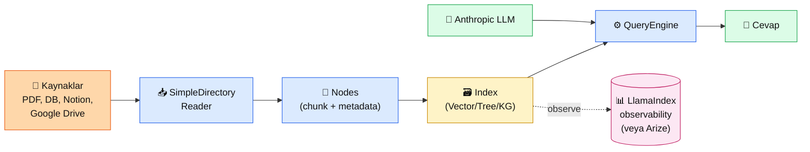

# 4.7 LlamaIndex ile RAG

<div class="ma-meta" markdown>
<div class="ma-meta-row" markdown>
<strong>Kim için:</strong>
<span class="ma-persona ma-persona-baslangic">🟢 başlangıç</span>
<span class="ma-persona ma-persona-is">🔵 iş</span>
<span class="ma-persona ma-persona-kisisel">🟣 kişisel</span>
</div>
<div class="ma-meta-row"><strong>📋 Önkoşul:</strong> 4.6 bitmiş — LangChain'i gördün, abstraction felsefesini biliyorsun</div>
<div class="ma-meta-row"><strong>🎯 Çıktı:</strong> Aynı RAG'i **LlamaIndex** ile 15 satırda kurarsın; LangChain'den **ne zaman farklı** olduğunu bilirsin; **doküman-yoğun** projelerde (PDF, veritabanı, wiki) LlamaIndex'i niye tercih edebileceğini sayıyla anlarsın.</div>
</div>

!!! tip "Yabancı kelime mi gördün?"
    Bu sayfadaki **italik-altı çizili** ifadelerin (indexing, query engine, node gibi) üstüne mouse'unu getir — kısa tanım çıkar. Mobilde dokun.

## Neden bu sayfa?

LangChain'i öğrendin. **Niye ikinci kütüphane?** Çünkü LangChain *LLM-zinciri* odaklı, LlamaIndex *veri-zinciri* odaklı. İkisi aynı problemi farklı tarafından çözüyor:

- **LangChain:** "LLM'e nasıl veri beslerim + nasıl zincirlerim + nasıl agent yaparım?"
- **LlamaIndex:** "Dokümanlarımı nasıl iyi indekslerim + nasıl sorgulanabilir yaparım?"

İkincisi: **Kurumsal doküman yoğunluğu artarsa** (yüzlerce PDF, birden fazla veri kaynağı, güncellenen wiki), LlamaIndex'in **ingestion pipeline**'ı LangChain'inkinden olgun. Kemal'in HBV vakıf belgeleri, bir hukuk firmasının dava dosyaları, bir hastanenin klinik kılavuzları — hepsi **doküman-ağır RAG** = LlamaIndex tercih sebebi.

Üçüncüsü: 2024'te LlamaIndex **"agentic RAG"** kavramını öne çıkardı — retriever'ın kendisi de bir Claude çağrısıyla "ne aramalıyım?" kararı veriyor. Bölüm 6 ajan'a köprü. Bu yönde LlamaIndex hâlâ öndedir.

## LlamaIndex kısaca — üç paragraf, matematiksiz

**LlamaIndex = veri → LLM köprüsü.** 2022'de "GPT-Index" olarak başladı, 2023'te LlamaIndex oldu. Temel fikir: "LLM'in context'ine **ne zaman, ne ölçüde, ne kadar** veri vereceğini" akıllıca yönet. Document → Node (chunk) → Index → Query Engine zinciri.

**Ana farkı: indexing çeşitliliği.** Sadece vector index değil — tree index, list index, keyword index, knowledge graph index. Hangisi hangi veri için? Kod arama = keyword; hiyerarşik dokümantasyon = tree; soru-cevap = vector. LangChain bu çeşitliliği "retriever" düzeyinde soyutluyor ama LlamaIndex **indexing'i birinci sınıf** yapıyor.

**Query engine = RAG motoru.** `index.as_query_engine()` çağrısı retrieval + prompt + LLM'i tek soyutlamada veriyor. LangChain'deki chain'in LlamaIndex versiyonu. Subquery engine (karmaşık sorguyu alt parçalara böl), router query engine (doğru indexe yönlendir) gibi güçlü varyantlar var.

## Bu sayfanın ekosistemi — kim kime ne veriyor

<div class="ma-ekosistem" markdown>
<div class="ma-ekosistem-header">🗺️ Ekosistem — LlamaIndex veri-yoğun zinciri</div>



<table class="ma-aktorler" markdown>

| Düğüm | LlamaIndex adı | Ne yapıyor |
|---|---|---|
| 📥 **Reader** | `SimpleDirectoryReader`, `PDFReader`, `NotionPageReader`, `GoogleDriveReader` | Kaynağa özel konektör, `Document` döndürür |
| 🧩 **Nodes** | `SentenceSplitter`, `SemanticSplitter` | Document → Node (chunk + metadata ilişkileri) |
| 🗃 **Index** | `VectorStoreIndex`, `TreeIndex`, `KeywordTableIndex`, `KnowledgeGraphIndex` | Veri tipine göre farklı indexleme |
| ⚙️ **QueryEngine** | `.as_query_engine()`, `SubQuestionQueryEngine`, `RouterQueryEngine` | Retrieval + prompt + LLM tek paket |
| 🤖 **Anthropic** | `llama_index.llms.anthropic.Anthropic` | Claude SDK wrapper |

</table>
</div>

## Uygulama — iki yol

### Yol A — 15 satırda RAG

```bash
pip install llama-index llama-index-llms-anthropic llama-index-embeddings-voyageai llama-index-vector-stores-qdrant
```

`rag_llamaindex.py`:

```python
from llama_index.core import VectorStoreIndex, SimpleDirectoryReader, Settings
from llama_index.llms.anthropic import Anthropic
from llama_index.embeddings.voyageai import VoyageEmbedding
from llama_index.vector_stores.qdrant import QdrantVectorStore
from qdrant_client import QdrantClient

# 1. Global ayar — LLM + embedding
Settings.llm = Anthropic(model="claude-sonnet-4-5", temperature=0)
Settings.embed_model = VoyageEmbedding(model_name="voyage-3")

# 2. Dokümanları yükle (klasördeki tüm .md, .pdf, .txt otomatik)
docs = SimpleDirectoryReader("./hbv-belgeler").load_data()

# 3. Qdrant vector store + index
client = QdrantClient(url="http://localhost:6333")
vs = QdrantVectorStore(client=client, collection_name="hbv_li")
index = VectorStoreIndex.from_documents(docs, vector_store=vs)

# 4. Query engine + sorgu
qe = index.as_query_engine(similarity_top_k=5)
cevap = qe.query("Kurban bedeli 2026 yılı ne kadar?")
print(cevap)
print(f"\nKullanılan belgeler: {[n.metadata.get('file_name') for n in cevap.source_nodes]}")
```

**Çıktı:**

```
Hacı Bayram-ı Veli Vakfı 2026 kurban bedeli 14.000 TL'dir. Bu tutar
yıllık olarak güncellenir.

Kullanılan belgeler: ['fiyat-listesi-2026.md', 'bagis-sikca-sorulan.md']
```

**Burada olan nedir (diyagram referansı):** Diyagramın tüm akışı 15 satırda. Özellik: `SimpleDirectoryReader` klasördeki **PDF + md + txt** dosyalarını **otomatik tanıyor**, LangChain'de her format için ayrı loader yazardın. Bu LlamaIndex'in "veri-first" avantajı.

### Yol B — Router QueryEngine (2 farklı index)

Senaryo: Vakıfın 2 tip belgesi var:
1. **Fiyat listeleri** (yapılandırılmış, tablolar) → keyword index
2. **Sıkça sorulan sorular** (anlatım) → vector index

Doğru soruya doğru indexi otomatik yönlendir:

```python
from llama_index.core import VectorStoreIndex, KeywordTableIndex
from llama_index.core.tools import QueryEngineTool
from llama_index.core.query_engine import RouterQueryEngine
from llama_index.core.selectors import LLMSingleSelector

# Aynı dokümanlardan 2 ayrı index
fiyat_docs = SimpleDirectoryReader("./hbv-belgeler/fiyat").load_data()
sss_docs = SimpleDirectoryReader("./hbv-belgeler/sss").load_data()

fiyat_index = KeywordTableIndex.from_documents(fiyat_docs)
sss_index = VectorStoreIndex.from_documents(sss_docs)

# Her index bir "tool"
fiyat_tool = QueryEngineTool.from_defaults(
    query_engine=fiyat_index.as_query_engine(),
    description="Fiyat, rakam, tutar, lira soruları için",
)
sss_tool = QueryEngineTool.from_defaults(
    query_engine=sss_index.as_query_engine(),
    description="Genel süreç, yöntem, açıklama soruları için",
)

# Router — Claude karar veriyor hangi tool'a gidecek
router = RouterQueryEngine(
    selector=LLMSingleSelector.from_defaults(),
    query_engine_tools=[fiyat_tool, sss_tool],
)

# Sorgu 1 → fiyat_tool'a yönlenir
print(router.query("Kurban bedeli ne kadar?"))
# Sorgu 2 → sss_tool'a yönlenir
print(router.query("Nasıl bağış yapabilirim?"))
```

**Burada olan nedir (diyagram referansı):** LlamaIndex Claude'u **router** olarak kullandı — "bu soru hangi tool'a gitmeli?" kararını LLM veriyor. Bu **agentic RAG'in** giriş kapısı. Bölüm 6'da tam agent'ları göreceğiz ama LlamaIndex zaten bu tarafa mı mı eğik.

### LlamaIndex vs LangChain — karşılaştırma

| Kriter | LlamaIndex | LangChain |
|---|---|---|
| **Odak** | Veri ingestion + indexleme | LLM zinciri + agent |
| **Loader çeşitliliği** | **Üstün** — Notion/GDrive/Confluence hazır | Orta — community paketleri |
| **Vector store desteği** | ~20 destek | ~40 destek |
| **Query engine çeşitleri** | **Üstün** — Router/SubQuestion built-in | RouterChain var ama az güçlü |
| **Tool/agent desteği** | Orta — son 1 yılda geliştirdi | **Üstün** — LangGraph var |
| **Öğrenme materyali** | İyi ama az | **Çok fazla** — 10x tutorial |
| **Production kullanımı** | Doküman-yoğun şirketler | Her yer |
| **Topluluk büyüklüğü** | ~25K GitHub star | ~95K GitHub star |
| **Anthropic native** | Var (`llama-index-llms-anthropic`) | Var (`langchain-anthropic`) |

**Pratik öneri:** Çok sayıda doküman + çeşitli format + ingestion pipeline → LlamaIndex. LLM-zinciri + agent + multi-step workflow → LangChain. Hem RAG hem agent varsa → ikisini beraber kullan (LlamaIndex ingestion + LangGraph agent).

### HBV için seçim (Kemal'in projesi)

HBV chatbot:
- 16 markdown belge (orta büyüklük)
- Tek dil (Türkçe)
- Fiyat + süreç iki farklı tip → **Router faydalı**
- Agent değil, basit RAG → LangChain'de gerek yok
- **Seçim: LlamaIndex + Router QueryEngine**

Ama 4.8'de göreceğimiz gibi Kemal'in **gerçek** HBV chatbot'u **elden yazılmış** — çünkü spam filter, Meta webhook idempotency, custom state machine gibi özel gereksinimler var. LlamaIndex bunların hepsini override etmeni gerektirir; bu noktada "elden yaz" daha hızlı olur.

<div class="ma-anthropic-oz" markdown>
<div class="ma-anthropic-oz-header">📖 Anthropic bu konuyu nasıl anlatıyor — öz</div>

Anthropic LlamaIndex'i de LangChain gibi **önermez-kötülemez.** Resmi `llama-index-llms-anthropic` package ortak maintain ediliyor — yanıt kalitesi test ediliyor.

**1. Resmi partner package.** `llama-index-llms-anthropic` + `llama-index-embeddings-voyageai` (Anthropic'in embedding ortağı Voyage). İkisi birlikte çalışır — Claude + Voyage sadece LlamaIndex ekosisteminde değil, birbirleriyle de uyumlu.

**2. Anthropic cookbook'ta LlamaIndex örneği var.** [anthropic-cookbook/third_party/LlamaIndex](https://github.com/anthropics/anthropic-cookbook/tree/main/third_party/LlamaIndex) — 2-3 notebook. LangChain'den daha az ama var.

**3. Contextual Retrieval + LlamaIndex.** Anthropic'in 4.4'te gördüğümüz Contextual Retrieval tekniği LlamaIndex'te **custom node postprocessor** olarak kurulabilir. Resmi bir package yok, community implementasyonları var. Bölüm 4.4'teki manuel uygulama referans değerli.

??? info "Teknik detay — isteyene (parameter adları, mekanikler, edge case'ler)"

    **Ingestion pipeline.** LlamaIndex'in `IngestionPipeline` sınıfı = chunking + embedding + cache tek paket. Aynı belgeyi iki kere işlemez (hash ile cache). Büyük dokümanlarla çok verimli.

    **Node relationships.** LlamaIndex node'lar arasında parent/child/prev/next ilişkisi kurar — chunk bağlamını retrieval'da koruyor. LangChain bu relationship'leri direkt saklamaz.

    **Structured data.** `llama-index-readers-database` ile Postgres/MySQL'den direkt okuma. LangChain community'de var ama LlamaIndex native desteği olgun.

    **LlamaParse.** LlamaIndex'in ücretli PDF parser'ı (LlamaCloud) — karmaşık PDF tablo/formül'leri doğru çıkarıyor. Bölüm 4.2 chunking'in upgrade versiyonu.

    **Evaluator.** `llama-index.core.evaluation` modülü — faithfulness, relevancy, correctness evaluator'ları hazır. 4.5 eval'in LlamaIndex versiyonu. RAGAS'a alternatif.

    **Agent workflow.** LlamaIndex'in `Workflow` API'si (2024 sonu) = LangGraph alternatifi. Event-driven, async, state machine. Bölüm 6'da agent'larda tekrar ele alacağız.

<div class="ma-anthropic-oz-kaynak" markdown>
**Kaynak:** [docs.llamaindex.ai — Anthropic integration](https://docs.llamaindex.ai/en/stable/examples/llm/anthropic/) (EN, ~15 dk). Setup + examples. Pekiştirme: [Anthropic Cookbook — LlamaIndex notebook](https://github.com/anthropics/anthropic-cookbook/tree/main/third_party/LlamaIndex) — Claude + LlamaIndex ortak desenler.
</div>
</div>

<div class="ma-cikti-kaniti" markdown>
### 📦 Bu sayfayı bitirdiğini nasıl kanıtlarsın

#### 1. 📝 Refleksiyon yazısı — 5 dakika

> "LlamaIndex ile aynı RAG'i [X] satırda kurdum. LangChain'e göre [neden] farklı hissettirdi. Router QueryEngine denedim, '[hangi soru]' '[hangi tool]'a yönlendi. Kendi projem [HBV / başka] için [LangChain / LlamaIndex / elden / hybrid] seçeceğim çünkü..."

Kaydet: `muhendisal-notlarim/bolum-4/07-llamaindex/refleksiyon.txt`

#### 2. 📸 Ekran görüntüsü — 3 dakika

**Neyin görüntüsü:** Router QueryEngine çalışırken — iki farklı soru, iki farklı tool'a yönlendiği konsol çıktısı.

Kaydet: `muhendisal-notlarim/bolum-4/07-llamaindex/router-cikti.png`

#### 3. 💻 3'lü karşılaştırma repo + GitHub — 15 dakika

`rag-3li-karsilastirma/` — elden yazım + LangChain + LlamaIndex, üçü de aynı golden dataset üstünde çalışsın. Aynı 5 soruda 3 farklı sonuç, kalite + hız karşılaştırması README'de tablo.

Repo linkini kaydet: `muhendisal-notlarim/bolum-4/07-llamaindex/uclu-karsilastirma-link.txt`

</div>

<div class="ma-neden-sonuc" markdown>
<div class="ma-neden-sonuc-header">🔗 Birlikte okuma — neden ne oldu</div>

- **A → B:** LangChain LLM-zinciri, LlamaIndex veri-zinciri. Farklı problem çözüyorlar.
- **B → C:** Doküman çeşitliliği artarsa (PDF + Notion + DB) LlamaIndex'in **loader çeşitliliği** avantaj.
- **C → D:** Index çeşidi (vector/tree/keyword/KG) = "veri tipine özel arama" = LangChain'de daha soyut.
- **D → E:** Router QueryEngine = agentic RAG giriş kapısı; Bölüm 6 agent'lara mantıksal köprü.
- **E → F:** Gerçek seçim tek kütüphane değil — hybrid desenler production'da yaygın.

<div class="ma-neden-sonuc-sonuc" markdown>
**Sonuç:** Artık 3 seçeneğin var — elden, LangChain, LlamaIndex. Her birinin güçlü/zayıf tarafını biliyorsun. 4.8'de **Kemal'in gerçek HBV chatbot'u** vakası: 100+ kullanıcı, canlı production, neden elden yazıldı, hangi dersler alındı.
</div>
</div>

<div class="ma-sonraki" markdown>
<div class="ma-sonraki-header">➡️ Sonraki adım</div>

**[4.8 Production RAG (HBV Vakası) →](08-production.md)** — Platformun **gerçek hayat** karşılığı. 135 bağışçı, Meta Cloud API, Chatwoot, spam filter — Bölüm 4'ün bitiş çizgisi.

← [4.6 LangChain ile RAG](06-langchain.md) &nbsp;|&nbsp; [Bölüm 4 girişi](index.md) &nbsp;|&nbsp; [Ana sayfa](../index.md)

**Pekiştirme:** LlamaIndex'in [starter tutorial](https://docs.llamaindex.ai/en/stable/getting_started/starter_example/)'ını birebir yap (15 dk). Farkları kendi gözünle gör — yazılı karşılaştırmadan 10 kat değerli.
</div>
