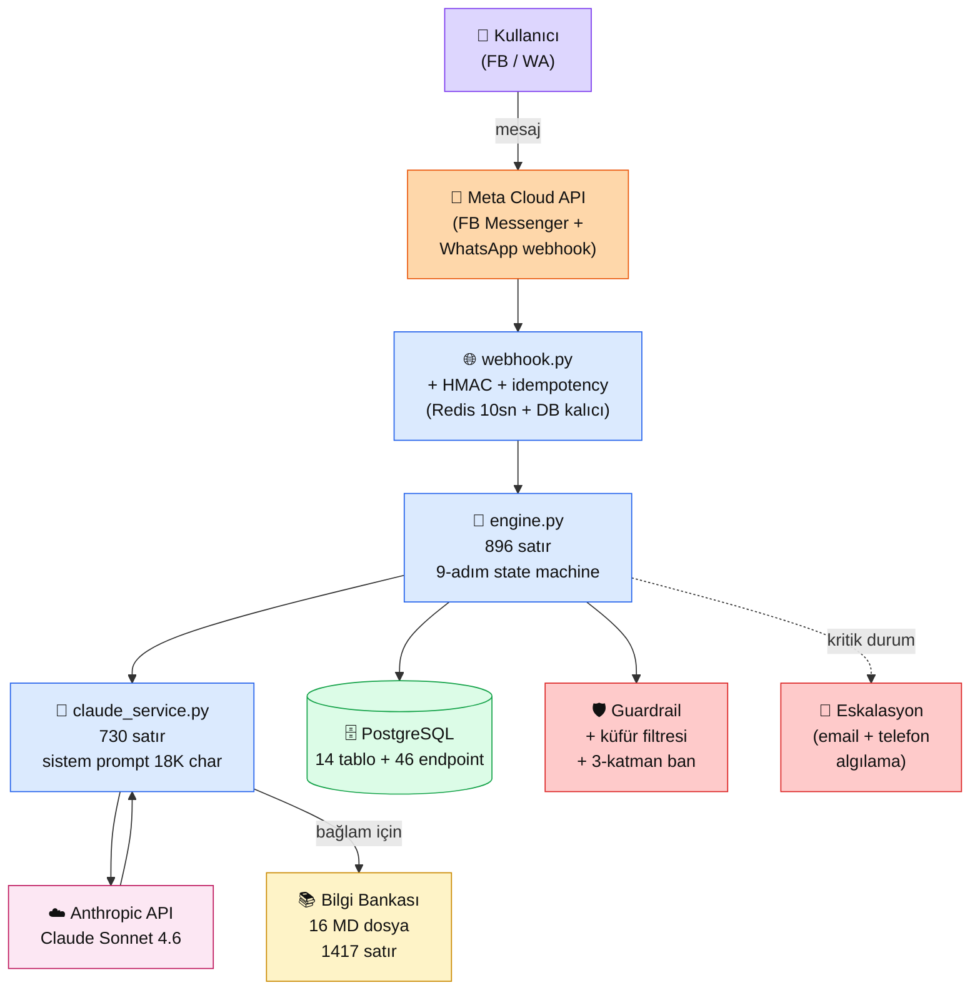

# 4.8 Production RAG — HBV Vakası

<strong>Kim için:</strong>
🟢 başlangıç
🔵 iş
🟣 kişisel

<strong>📋 Önkoşul:</strong> 4.1-4.7 bitmiş; RAG'ın teknik katmanlarını anlıyorsun, kendi basit RAG'ini çalıştırabiliyorsun

<strong>🎯 Çıktı:</strong> Gerçek bir üretim RAG projesinin (HBV Kurban Chatbot, 2026) **ham gerçeklerini** görürsün — 18 dosya / 4K satır / 14 tablo / 46 endpoint yapısı, %87 test skoru, 4 kritik bug, 7 blocker. "Naif RAG" ile "production RAG" arasındaki mesafeyi rakamla bilirsin. Kendi projende benzer hataları **önceden** görürsün.

!!! tip "Yabancı kelime mi gördün?"
    Bu sayfadaki **italik-altı çizili** ifadelerin (state machine, idempotency, guardrail gibi) üstüne mouse'unu getir — kısa tanım çıkar. Mobilde dokun.

!!! info "Bu sayfa hakkında"
    Bu bölümün yazarı **Kemal**, 2026'da Hacı Bayram-ı Veli Vakfı için bir kurban bağış chatbot'u geliştirdi. Aşağıdaki her rakam, her hata, her karar **gerçek** — fake case study değil. 27 Mayıs 2026 Kurban Bayramı öncesi 40 günde canlıya çıkan projenin **üretim dersleri** burada.

## Neden bu sayfa?

4.1-4.7'de RAG'ın **tekniğini** öğrendin: chunking, retrieval, rerank, eval, frameworks. Ama kitabi bilgiyle üretim arasında **4-10 kat** kod farkı var. "20 satırda naif RAG" ile "canlıda 1000+ kullanıcıya hizmet eden chatbot" aynı aileden değil. Bu sayfa o farkın **somut ölçümü**.

İkincisi: **HBV Chatbot normal bir RAG değil — dini bir sorumluluk taşıyor.** Yanlış IBAN söylerse → vakfa 30 bin TL yanlış hesaba gider. Yanlış "vekaletin alındı" derse → bağışçının **kurbanı geçersiz** olur (dini risk). Bu bağlam teknik kararları değiştirir: RAG sadece "iyi" yetmez, **çok dikkatli** olmak zorunda. Bu sayfada nasıl olduğu.

Üçüncüsü: **Solo geliştirici + 40 günde production** gerçeği. Kemal bu projeyi akşamları geliştirdi, test etti, deploy etti — tek başına. Sen de büyük ihtimalle böyle çalışacaksın. Bu sayfa "Google'ın RAG'ını kopyala" değil, **senin koşullarına** uyan bir vaka.

## HBV Chatbot kısaca — üç paragraf, matematiksiz

**Amaç:** Vakfın Facebook ve WhatsApp kanallarından gelen bağış soru-cevaplarını otomatik yönetmek. 9 adımlı bir **state machine** akışı: karşılama → kurban tipi seçimi → niyet tipi (kendisi/merhum/sembolik) → adet → isim → iletişim → ödeme → vekalet → teslim. Her adımda kullanıcı dağılabilir, yanlış yazabilir, niyetini değiştirebilir — RAG bu sapmalarda doğru rotaya döndürür.

**Teknik yapı:** Python + FastAPI + PostgreSQL + Claude Sonnet API + 16 markdown belgelik bilgi bankası + 18K karakterlik sistem prompt. RAG sade: retrieval Qdrant değil, **elden kurulmuş markdown indexleme** (bilgi bankası sabit, güncelleme nadir — vektör DB overhead'i dengelemedi). Guardrail + küfür filtresi + 3 katman ban mekanizması. 14 DB tablosu, 46 API endpoint.

**Durum (22 Nisan 2026):** Canlıda — `app-live` sürümü çalışıyor. Son test skoru **26/30 (%87)**. 3 kategori (gurbetçi, ödeme iade, yaşlı kullanıcı) hâlâ zayıf. 7 blocker açık (Instagram admin izni, WP-DB birleştirme, kota rakamları, saha iletişim listesi). **35 gün sonra Kurban Bayramı**. Gerisi Bayram sonrası refactor'a kalacak.

## Bu sayfanın ekosistemi — HBV üretim mimarisi

🗺️ Ekosistem — HBV Chatbot'un gerçek bileşen haritası

<table class="ma-aktorler" markdown>

| Bileşen | Satır / Boyut | Ne iş yapıyor |
|---|---|---|
| 👤 **Kullanıcı** | — | Facebook Messenger veya WhatsApp'tan mesaj atıyor |
| 📱 **Meta Cloud API** | 3. parti | FB + WA mesajlarını webhook'a iletiyor (ortak ABI) |
| 🌐 **webhook.py** | ~200 satır | HMAC imza doğrulama + idempotency (aynı mesaj iki kez gelmesin) |
| 🧠 **engine.py** | **896 satır** | 9-adım state machine — akışın motoru |
| 🤖 **claude_service.py** | **730 satır** | Claude çağrıları + 18K+ karakter sistem prompt + IBAN talimatları |
| ☁️ **Anthropic API** | Claude Sonnet 4.6 | Cevap üretimi + prompt caching aktif |
| 📚 **Bilgi bankası** | 16 MD / 1417 satır | IBAN, fiyatlar, süreç, SSS — sistem prompt'a dahil edilir |
| 🗄️ **PostgreSQL** | 14 tablo + 46 endpoint | bagisci / kurban_kayitlari / odemeler / whatsapp_mesajlari / vb. |
| 🛡️ **Guardrail** | Filter chain | Küfür filtresi + 3-katman ban (anlık/24 saat/kalıcı) |
| 📧 **Eskalasyon** | Email + telefon | Dini zorunluluk ihlali, teknik hata → insan operatöre |

</table>

## "Naif RAG" ile "HBV RAG" — satır karşılaştırması

| Katman | 4.1 Naif RAG | **HBV Production** | Oran |
|---|---|---|---|
| Belge sayısı | 5 cümle | 16 markdown dosya (1417 satır) | **283x** |
| Retrieval | numpy dot product | Sistem prompta tam yüklü + dinamik bağlam | (farklı strateji) |
| Sistem prompt | 50 kelime | **18.000+ karakter** (kurallı, örnekli, edge case'li) | **~80x** |
| State machine | Yok | **9 adım**, her adım 3-5 alt dal | Kategorik fark |
| Hata yönetimi | 1 try/except | Guardrail + filter + ban + eskalasyon + idempotency | Kategorik fark |
| Test | Manuel 3 soru | **30 senaryo** × 8 kategori × otomatik | **10x** |
| DB | Yok | **14 tablo + trigger** (otomatik sync) | Kategorik fark |
| Kod toplam | ~30 satır | **~4000 satır Python** | **~130x** |

**Dürüst gözlem:** Kitabi RAG "20 satır" — üretim RAG 4000 satır. Aradaki **200 kat** fark kitaplarda yazmaz. State machine + hata yönetimi + veri modeli + test altyapısı = RAG'ın görünmeyen yarısı. 4.1-4.7 RAG'ın **çekirdeğini** gösterdi; bu sayfa **çevresini** gösteriyor.

## Üç kritik üretim dersi

### Ders 1 — Sessiz dini risk: `vekalet_onay = TRUE` bug'ı

**Tarih:** 16 Nisan 2026. **Süre:** Ne zamandan beri varmış bilinmez (muhtemelen baştan beri).

**Bug:** `db_service.py`'de kayıt oluşturan 3 ayrı fonksiyon — `kayit_olustur`, `kayit_olustur_manuel`, `kayit_olustur_gelismis` — **hepsi** `vekalet_onay = TRUE` olarak kayıt açıyordu. Bağışçı vekaleti *sözlü olarak* vermeden **önce** sistem "vekalet alındı" kabul ediyordu. 4 farklı kod yerinde (satır 165, 181, 495, 704) aynı hata.

**Dini sonuç:** Eğer bir bağışçı chatbot'a IBAN aldı ama **vekalet aşamasını tamamlamadı**, sistem kurbanı "geçerli" sayıp kesim listesine alıyordu. İslami usülde vekalet = "kurbanı benim adıma kes" izni. Vekaletsiz kesim = **bağışçının niyetine kurban sayılmaz**. Dini sorumluluk ihlali.

**Fix:** 4 yerde `TRUE → FALSE`. Backup: `db_service.py.bak.20260416_221321`. PM2 restart. Beş dakikalık bir değişiklik, muhtemelen **35+ kurbanı etkileyen** hata.

**Ders:**

1. **Default değer = karar.** "TRUE" yazmak "bu bayrak açık varsayımı" demektir. Belirsiz durumda **FALSE** başla, kod yolu açıkça değiştirsin.
2. **DB state = kullanıcı niyeti değil.** Kullanıcı "vekalet veriyorum" demedikçe sistem vekaleti kabul etmemeli. Bu fark RAG içinde **prompt'ta** değil **kod yapısında** belirlenir.
3. **Dini/hukuki/mali RAG'da audit trail şart.** Her state geçişinin zaman damgası + kullanıcı mesajı + bot cevabı. Sonradan "ne oldu da bu durum oluştu?" sorusuna geri izlenebilsin.

### Ders 2 — Test skorları kategorilere ayrıştırılmalı

**Baseline (12 Nisan):** 24/30 (%80). Yanıltıcı güzel.

**Kategori dağılımı:**

| Kategori | Skor | Gözlem |
|---|---|---|
| dini_sinir | **30/30** | Mükemmel — sistem prompt dikkatli |
| karmasik | 30.3/30 (bonus) | Çok iyi — Claude edge case'lerde güçlü |
| ton | 28.2/30 | İyi — ton disiplini tutuyor |
| itiraz | 26.8/30 | Orta — iyileştirilebilir |
| bilgi | 27.2/30 | Orta — bazı fiyatlar kayıyor |
| **gurbetçi** | **22.3/30** ⚠️ | **Yurtdışı İngilizce soğuk karşılama** (G02 FAIL) |
| **ödeme** | **22.7/30** ⚠️ | **"İade istiyorum" yanlış yanıt** (OD03) |
| **yaşlı** | **23.7/30** ⚠️ | **Kısaltmalı yazım dikkate alınmadı** (Y01) |

**Ders:**

1. **Tek "accuracy" rakamı yanıltır.** %80 geneli, ama 3 kategoride %75 altı — belirli kullanıcı kesimi **ciddi zarar görüyor**.
2. **Eval kategorik** olmalı (4.5'teki "golden dataset"e not): her soru **hangi kullanıcı tipi, hangi senaryo** etiketli. 20 soru × 8 kategori = 160 mini test.
3. **En zayıf kategori önce düzeltilir.** Ort'u %2 çekmek için gurbetçi'yi %60 → %85 çıkarmak mantıklı; %98'leri %99 yapmak değil.

**Fix (16 Nisan):** 3 prompt düzeltmesi → Test 26/30 (%87, +3). Hâlâ 3 kategori zayıf, **Bayram öncesi hedef 28/30 (%93).**

### Ders 3 — API credits bitmesi = sessiz üretim durması

**Tarih:** 16 Nisan 2026. **Süre:** Fark edilinceye kadar tüm kullanıcılar cevapsız kaldı.

**Olay:** 3 prompt düzeltmesi sonrası test 2 çalıştırılmak istendi. Ama Anthropic hesabındaki kredi tükenmişti. Test fail. **Canlıdaki chatbot da o anda cevap veremiyordu** — sadece fark edilmemişti.

**Ders:**

1. **Maliyet monitoring eksikti.** `cache_read_input_tokens` raporu + günlük spend alert olmalıydı. Console'da cost alert 3 tık, atlanmış.
2. **Graceful degradation yok.** API erişilmez olduğunda bot sessiz kalmak yerine *"sistem geçici yoğun, X dk sonra tekrar deneyin"* fallback mesajı göndermeliydi.
3. **Deploy öncesi hazırlık listesi (pre-flight):** API credit ≥ 14 günlük trafik, rate limit marjı, alternatif model fallback. HBV'de bu liste henüz yok — Bayram öncesi yapılacak.

## Çözüm bekleyen 7 blocker (güncel)

| # | Blocker | Kim çözecek | Ne zaman |
|---|---|---|---|
| 1 | Instagram `@hacibayramvelivakfi` admin izni | Vakıf yetkilisi | Vakıf toplantısı |
| 2 | WordPress + Chatbot DB birleştirme | Vakıf WP admin erişimi | Vakıf toplantısı |
| 3 | Yurt içi/dış kurban kota rakamları | Vakıf yönetimi | Vakıf toplantısı |
| 4 | Saha ekibi iletişim bilgileri | Vakıf | Vakıf toplantısı |
| 5 | Alarm iletişim listesi (tüm telefon numaraları) | Vakıf + yönetim | Vakıf toplantısı |
| 6 | Test 2 sonrası `%93` hedefi doğrulama | Kemal | API credit yüklendi, çalışır çalışmaz |
| 7 | Canlı log analizi (`%97 dropout` noktası) | Kemal | Bu hafta |

**Not:** 1-5 arası "teknik değil, insan/organizasyon blocker'ı". Solo geliştiricinin en yorucu kısmı — kod yazmaktan daha uzun. Üretim RAG'ında **%50 zaman iletişimde** geçer. Bu sayfaya sadece kod yazmak için gelenlere uyarı.

## Bayram sonrası refactor listesi (17 Nisan kaydı)

Kemal bu 8 noktayı **Bayram sonrasına** erteledi — Bayram öncesinde risk almaya değmez:

1. **Tek sohbette karma kurban tipi** — state machine'in tek kurban tipi sınırlaması. "Merhum annem + 3 sahibi niyetine + 1 vacip" gibi senaryolar için state machine genişlemesi.
2. **`muhatap_tipi` + `niyet_tipi` sistemlerinin birleştirilmesi** — 7 Nisan'da eklenen iki yeni alan paralel geliştirildi, Bayram sonrası konsolidasyon.
3. **`kurban_kayitlari.adet DEFAULT 1 CHECK` constraint** — her zaman 1 olan kolon, schema zorlaması.
4. **.bak dosyalarının git history'ye taşınması** — 16 `.bak` VPS'te, Git'te yok. Disaster recovery deseni düzeltilmeli.
5. **Gurbetçi/yaşlı/ödeme kategorilerinde %95+ hedefi** — prompt mühendisliği + belki fine-tune'a yakın teknikler.
6. **Vector DB'ye (Qdrant) geçiş — gerçekten gerekli mi?** Mevcut markdown-in-prompt yaklaşımı Bayram öncesi yeterli; Bayram sonrası karar.
7. **`Madde 1` refactor'undaki trigger'ın performansı** — `trg_odemeler_sync` yüksek trafikte lock riski, load testi gerekli.
8. **Karma kurban tipi upsell akışı genişlemesi** — Test 11 PARTIAL, state machine kısıtı.

**Ders:** Üretimde "Bayram öncesi" = "deploy edilen her şey test edilmeli" demek. Refactor = **riski sonraya ertele, ama listeye yaz**. Bu 8 madde bu sayfada olmasının sebebi: **Kemal 3 ay sonra unutmasın**. RAG projenizde de benzer "dondurma listesi" tutun.

📖 Anthropic bu konuyu nasıl anlatıyor — öz

HBV Chatbot **Anthropic'in önerdiği her şeyi** yapmıyor — çünkü gerçek üretimde her tavsiye bağlama göre ayarlanır:

**1. Bilgi bankası sistem prompt'a yüklü, Qdrant yok.** Anthropic "uzun context'i RAG'la topla" der; HBV 18K karakteri **sistem prompt'a direkt bastı** çünkü bilgi bankası **sabit** (ayda 1 kez güncelleniyor). Prompt caching + Claude'un 200K penceresi bu kararı mümkün kıldı. **Dogma yerine koşul**.

**2. Contextual Retrieval uygulanmadı.** Anthropic'in Contextual Retrieval tekniği (4.2) %49 iyileşme verir, ama HBV'nin 16 belgelik dar koleksiyonunda gereksiz overhead. **Küçük koleksiyon + iyi prompt > büyük teknik + küçük veri**. Teknik seçimi koleksiyon büyüklüğüne göre.

**3. Prompt caching aktif — ana tasarruf kaynağı.** 18K karakter sistem prompt + her kullanıcı cümlesi küçük değişken = %90 cache hit. Aylık maliyet Cached olmadan ~$300, cache ile ~$40. Tek satır `cache_control` = projenin ekonomik yaşayabilirliği.

**4. LLM-as-judge eval uygulandı — ama insan kontrolü hâlâ şart.** 30 senaryo × 3 tekrar × Haiku judge. Ama her düzeltmede Kemal **son 3 örneği insan gözüyle** okuyor. "Rakam iyi ama nüans kayıp" hissiyle yakalanan 5+ hata — judge'ın görmediği, insanın gördüğü şeyler.

??? info "Teknik detay — isteyene (parameter adları, mekanikler, edge case'ler)"

    **Sistem prompt 18K karakter = 4500 token.** Cache minimum 1024 token gerektirir; geniş prompt cache için ideal. Her kullanıcı mesajı ~50 token → cache hit oranı ~%95.

    **State machine'in RAG ile ilişkisi.** Her state'te farklı bilgi bankası kesiti "aktif" — örn. ödeme state'inde IBAN + havale kuralları, vekalet state'inde vekalet dualaları. Dinamik sistem prompt kesiti = **contextual prompting**, RAG'ın yazarsız versiyonu.

    **Webhook idempotency: Redis 10sn + DB kalıcı.** Meta webhook aynı mesajı 2-3 kez gönderir. Redis kısa süreli dedup; DB `platform + msg_id UNIQUE` constraint kalıcı dedup. İkili katman → `%100 idempotent`.

    **Trigger `trg_odemeler_sync`.** Madde 1 refactor'unda eklendi. `odemeler` tablosuna INSERT → `odeme_takip.gelen_tutar` otomatik SUM + durum hesaplama + `kurban_kayitlari.odeme_durumu` cache update. DB seviyesinde atomik = race condition yok.

    **Guardrail 3 katman ban.** 1. katman: anlık (bu mesaj yoksayılır). 2. katman: 24 saat ban (sürekli saldırı). 3. katman: kalıcı ban (kalıcı kötü niyet). Escalation Kemal veya vakıf adminine email.

    **Anthropic rate limit marjı.** Tier 2 hesap → 1000 RPM. HBV peak trafiği ~30 RPM → 33x marj. Bayram gününde 10x trafik beklentisi bile sınırın altında kalır.

    **Claude Sonnet 4.6 vs 4.6 karar.** 4.5 HBV'de test edildi, 4.6 çıktığında A/B yapılacak — hem kalite farkı hem maliyet farkı. Opus 4.7 için: fiyat performans oranı HBV için gereksiz.

    **Bilgi bankası değişim yönetimi.** 16 MD dosya git altında. Pull request → code review (Kemal + vakıf yetkilisi) → main'e merge → pm2 restart. Dev ortamda preview sonra prod.

**Kaynak:** [Anthropic — Building Effective Agents](https://www.anthropic.com/research/building-effective-agents) (EN, ~20 dk). Anthropic'in üretim AI ürünleri için "karmaşıklık ekleme" yerine "sadelik tutma" tezi. HBV kararlarıyla birebir örtüşür. **Pekiştirme:** [docs.claude.com — Prompt Caching best practices](https://docs.claude.com/en/docs/build-with-claude/prompt-caching) — HBV cache stratejisinin teorisi.

### 📦 Bu sayfayı bitirdiğini nasıl kanıtlarsın

#### 1. 📝 Refleksiyon yazısı — 5 dakika

> "HBV vakasını okudum. Benim proje için en çarpıcı ders [X] oldu. Benim RAG'imde benzer hatayı yapma riskim [şu noktada]. Üretim öncesi [şu] kontrolü yapacağım. Kendi 'Bayram sonrası refactor listesi' şöyle: [3-5 madde]."

Kaydet: `muhendisal-notlarim/bolum-4/08-production/refleksiyon.txt`

#### 2. 📸 Ekran görüntüsü — 3 dakika

**Neyin görüntüsü:** Kendi projenin "naif vs production" karşılaştırma tablosu — bu sayfadaki tabloyu şablon al, kendi projene uyarla.

Kaydet: `muhendisal-notlarim/bolum-4/08-production/benim-karsilastirma.png`

#### 3. 💻 Kendi "pre-flight checklist" — 10 dakika

HBV'nin 3 dersi temelinde **kendi projen için** pre-flight checklist yaz:

- Hangi default değerlerin sessiz risk taşıyor?
- Test skorlarım hangi kategorilerde zayıf?
- Maliyet + rate limit monitoring aktif mi?
- Graceful degradation senaryoları?
- Audit trail yeterli mi?

8-12 maddelik Markdown dosya, repo'nda `PREFLIGHT.md` olarak. [gist.github.com](https://gist.github.com)'a da paylaş.

Dosya yolunu kaydet: `muhendisal-notlarim/bolum-4/08-production/preflight-link.txt`

🔗 Birlikte okuma — neden ne oldu

- **A → B:** "20 satır naif RAG" ile "4000 satır üretim RAG" arasında **200 kat** fark var — çoğu state machine + hata yönetimi + veri modelinde.
- **B → C:** Default değer (`TRUE vs FALSE`) = prompt'tan **çok daha belirleyici** — kod yapısı RAG'ın gerçek omurgası.
- **C → D:** Tek "%80 accuracy" → kategorik kırılım → zayıf kategoride %60 gizli. Eval **kategorik olmazsa yanıltıcı**.
- **D → E:** Maliyet + rate limit monitoring **teknik borç değil, temel sistem** — atlanınca üretim sessizce durur.
- **E → F:** Solo geliştiricinin %50 zamanı **koordinasyonda** geçer (HBV'nin 7 blocker'ı = 5'i insan/organizasyon). Takvim kod için değil, iletişim için.

**Sonuç:** RAG'ın **çekirdeği** (4.1-4.7) ile **çevresi** (bu sayfa) ayrı dünyalar. Kitabi RAG özgün mühendislik becerisi, üretim RAG özgün mühendislik + tavizler + organizasyon. HBV vakası bu gerçeği **rakamla, tarihle, hatayla** gösterdi. Bölüm 4 tamamlandı. Bölüm 5'te "RAG vs Fine-tuning" karşılaştırmasına geçiyoruz; Bölüm 4'ün dersleri o tercihin zeminini kurdu.

➡️ Sonraki adım

**[Bölüm 5 — RAG vs Fine-tuning →](../bolum-5/index.md)** — RAG temeli sağlamlaştı. Fine-tune ne zaman gerekir, ne zaman gereksiz? HBV neden fine-tune etmedi? Karar tablosu + Bölüm 4'ün rakamlarıyla pratik karşılaştırma.

← [4.7 LlamaIndex](07-llamaindex.md) &nbsp;|&nbsp; [Bölüm 4 girişi](index.md) &nbsp;|&nbsp; [Ana sayfa](../index.md)

**Pekiştirme:** HBV'nin 3 kritik dersini kendi son projenize uygulayın — default değerler, kategorik eval, maliyet monitoring. **1 saat** ayırın, **10 sorunu önceden** yakalayabilirsiniz. Bu sayfanın en değerli uygulaması bu 1 saat.

