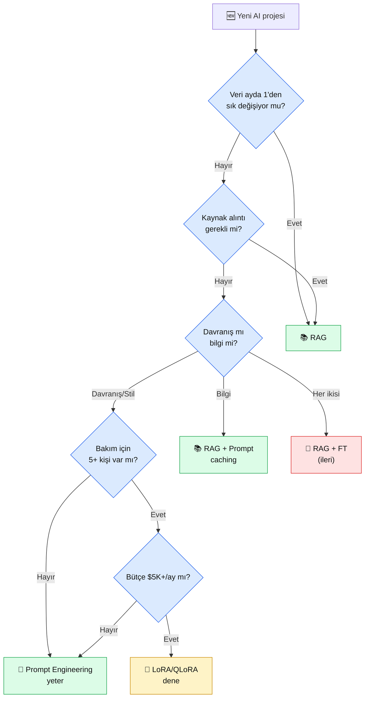

# 5.2 Karar Ağacı — Hangisini Seçmeli

<div class="ma-meta" markdown>
<div class="ma-meta-row" markdown>
<strong>Kim için:</strong>
<span class="ma-persona ma-persona-baslangic">🟢 başlangıç</span>
<span class="ma-persona ma-persona-is">🔵 iş</span>
<span class="ma-persona ma-persona-kisisel">🟣 kişisel</span>
</div>
<div class="ma-meta-row"><strong>📋 Önkoşul:</strong> 5.1 okundu (prompt ↔ RAG ↔ FT üçgeni + 3 FT biçimi + maliyetler).</div>
<div class="ma-meta-row"><strong>🎯 Çıktı:</strong> **10 kriterli karar ağacı** elinde; yeni proje geldiğinde 5 dakikada "prompt / RAG / FT / hybrid" kararını **gerekçeli** verebiliyorsun. 5 somut senaryo (müşteri destek, hukuki doküman, tıbbi tanı, finansal analiz, yaratıcı yazım) üzerinde pratik uyguladın. Mülakattaki "FT mi RAG mi?" sorusuna (10.2) derinleşmiş cevap. **Bölüm 5'in karar-odaklı sayfası.**</div>
</div>

!!! tip "Yabancı kelime mi gördün?"
    **Concept drift** = verinin zamanla değişmesi; bu ayın müşteri sorusu geçen yılın sorusundan farklı. **Latency budget** = uygulamanın cevap süresi bütçesi; chatbot 2-3 sn, batch agent 30 sn tolere eder. **Cold start** = ilk kullanıcı için modelin kurulum süresi. **Staleness** = modelin güncel olmaması; RAG'de chunk güncel, FT modeli eğitilme gününden sonra "donuk". **Hybrid** = RAG + FT birlikte; genellikle FT ton/stil, RAG bilgi.

## Neden bu sayfa?

5.1'de kavramları gördün. Bu sayfa o kavramları **karara** dönüştürür. Müşterin geldi: *"Bana hukuki doküman analizi sistemi kur."* Nereden başlarsın?

AI Engineer'ı juniordan ayıran nokta: **doğru soru sorma refleksi.** Bu sayfa 10 kriterli soru listesi verir — her biri kararı daraltır. 10 dakika sonra müşterine: *"Sizinki için RAG + prompt engineering yeter; FT'ye **şu noktada** ihtiyaç olursa geri dönelim"* diyebiliyorsun.

İkincisi: Mülakat sorusu olarak direk çıkar. 10.2 sayfasında "FT mi RAG mi?" sorusu vardı; bu sayfa o cevabı derinleştirir. Senaryo soruları için (10.2'deki senaryo 29) somut cevap şablonu.

Üçüncüsü: Bu sayfa **imza niteliğinde** — Bölüm 5'in karar-odaklı sayfası. Index'te 🏁 işaretli. 5.4 pratik imza (Colab'de LoRA), 5.2 kavramsal imza (karar refleksi).

## 10 kriterli karar soruları

Yeni proje için sırayla sor:

### 1. Veri değişim sıklığı

**Soru:** Model görevinin **bilgisi** ne sıklıkta değişir?

| Sıklık | Kategori | Tercih |
|---|---|---|
| Saat / gün | Fiyat, stok, haber | **RAG** (FT anında güncellenemez) |
| Hafta | Müşteri katalog, doküman | **RAG** |
| Ay | Ürün kılavuzu | RAG veya hybrid |
| Yıl | Şirket stili, tıp kurallarının temeli | FT düşünülebilir |
| Hiç | Matematik sabitleri | Model zaten biliyor, hiçbiri |

**Altın kural:** Veri ayda 1'den sık değişiyorsa **RAG**. FT her güncellemede yeniden eğitim = sürdürülemez.

### 2. Kaynak alıntı gereksinimi

**Soru:** Kullanıcı cevabın **hangi belgeye** dayandığını görmeli mi?

- **Evet:** Hukuk, tıp, finans, akademi → **RAG** zorunlu. FT modeli "şu sayfadan" bilgi veremez.
- **Hayır:** Günlük chatbot, stil değiştirme → FT veya prompt.

Kaynak alıntı = RAG'in **yapısal avantajı**. Hiçbir FT bu açığı kapatmaz.

### 3. Veri miktarı

**Soru:** Elinde kaç kaliteli örnek var?

| Örnek sayısı | Tercih |
|---|---|
| **0-50** | Prompt engineering + few-shot (FT yetersiz, overfitting) |
| **50-500** | Prompt + RAG |
| **500-2000** | RAG veya small LoRA |
| **2000-10K** | LoRA/QLoRA anlamlı |
| **10K+** | FT ciddi düşün; continued pre-training olasılığı |

### 4. Davranış mı bilgi mi?

**Soru:** Sorun ne?

| Sorun | Tercih |
|---|---|
| "Model **bilmiyor**" (yeni ürün, içine eklenmemiş bilgi) | **RAG** |
| "Model **yanlış söylüyor**" (stil, ton, format) | **FT** |
| "Model **yapmıyor**" (tool çağırmıyor, format dışı) | Prompt engineering + tool calling |

**Örnek ayrımı:**

- "Model 'müşteri' diyor, biz 'ürün sahibi' diyoruz" → **FT** (ton)
- "Model şirketin iade politikasını bilmiyor" → **RAG** (bilgi)
- "Model JSON dönüş formatına uymuyor" → **tool_choice** (prompt)

### 5. Latency bütçesi

**Soru:** Uygulaman ne kadar hızlı cevap vermeli?

- **<500ms** (sesli agent, gerçek zamanlı): **FT** (retrieval overhead yok) veya küçük model
- **500ms-3sn** (chatbot, streaming): **RAG** uygun (retrieval 100-300ms)
- **>3sn** (batch, agent): Her ikisi de olur

RAG retrieval bir ek adım (embedding hesapla + Qdrant sorgu + context ekle). Toplam latency 300-500ms artar. Kritik durumda FT veya cache.

### 6. Maliyet bütçesi

**Soru:** Aylık AI bütçesi?

| Aylık bütçe | Tercih |
|---|---|
| **<$50** | Prompt + hafif RAG + Haiku |
| **$50-500** | RAG + Sonnet + prompt caching |
| **$500-5000** | RAG (Opus) veya QLoRA self-host |
| **$5K+** | FT + self-host geniş kapsamlı düşün |

**FT'nin gizli maliyeti:** GPU inference. $300/ay A100 self-host + elektrik; Anthropic API ~$100/ay eşdeğer yük. FT %80+ kesintisiz kullanılırsa karşılar; yoksa maliyet artar.

### 7. Domain spesifiklik

**Soru:** Sorun ne kadar niche?

- **Genel bilgi** (özet, çeviri, soru-cevap): Claude zaten üstün → prompt yeter
- **Orta niş** (hukuk, tıp, finans): **RAG** kaynaklarla zenginleştir
- **Derin niş** (molecular biology terimleri, maritime law TR): FT veya hybrid

Claude + Voyage **çoğu niş**'te İngilizce ve Türkçe'de iyi. FT'ye atlamadan önce RAG + zengin kaynak + few-shot dene.

### 8. Bakım kapasitesi

**Soru:** Modeli **canlı tutmak** için kaç kişi ayırırsın?

- **Solo (sen):** RAG çok daha kolay. Qdrant + embedding = 1 haftada kurulur, ayda 1 saat bakım.
- **2-3 kişi:** LoRA/QLoRA mümkün, aylık retrain döngüsü.
- **5+ kişi / ML team:** Tam FT + continuous training düşünülebilir.

**Solo için altın kural:** FT'ye girme. Sürdürülemez. 6 ay sonra model "çürür" (concept drift) ve yeniden eğitim için zaman yok.

### 9. Veri sahipliği + gizlilik

**Soru:** Veri nerede kalmalı?

- **Bulut OK** (KVKK uyum varsa): Claude + Qdrant Cloud → kolay.
- **On-prem zorunlu** (sağlık, savunma): Self-host Qdrant + self-host model (Llama). FT muhtemelen gerekli — API kullanamazsın.
- **Hibrit:** Hassas veri on-prem (embedding on-prem), LLM cloud (anonim prompt).

On-prem + API kullanmaya direnç yüksekse FT + self-host Llama/Qwen tek seçenek.

### 10. Geri alınabilirlik

**Soru:** Yanlış giderse ne kadar hızlı düzeltebilirsin?

- **Prompt** — 1 dakikada `git commit` ile geri al.
- **RAG** — chunks yeniden index'le, 1 saatte geri al.
- **FT** — eski adapter'ı yükle + yeni eğitim başlat; gün veya hafta.

**Kritik:** FT "iade edilemez" değil ama "yavaş iade." Production bug'ı 3 gün kalıcı olursa müşteri kaybedebilirsin.

## Karar ağacı — görsel

<div class="ma-ekosistem" markdown>
<div class="ma-ekosistem-header">🗺️ 5-dakikalık karar ağacı</div>



**Ağacın mesajı:** 5 "evet/hayır" sorusu → karar. Çoğu yol **RAG veya prompt**'a çıkıyor — FT sadece çok spesifik koşulların birleşimi.

</div>

## 5 senaryo — pratik uygulama

### Senaryo 1 — Müşteri destek chatbot'u

**Durum:** E-ticaret şirket, günlük 500 müşteri soru. Sipariş takibi + iade + kargo + ürün bilgisi.

**Kriter uygulama:**
- Veri değişim: günlük (sipariş durumu değişir) → **RAG**
- Kaynak: "Sipariş #X şuradan aldık" gerek → **RAG**
- Davranış/bilgi: **bilgi** (ürün + sipariş) → **RAG**
- Bakım: solo dev → **RAG kolay**
- Gizlilik: bulut OK (KVKK form) → **RAG kolay**

**Karar: RAG + prompt engineering.** Sipariş veritabanı real-time; ürün katalogu Qdrant'ta; Claude Sonnet cevap. FT gerekmez.

### Senaryo 2 — Hukuki doküman analizi

**Durum:** Hukuk bürosu, avukat sözleşmeleri yüklüyor, risk analizi istiyor.

**Kriter uygulama:**
- Veri: sözleşme değişir, yasa değişir (nadiren) → **RAG**
- Kaynak alıntı: **kritik** — "Madde 3'te riskli" demek gerek → **RAG**
- Davranış: Avukat jargonu → **prompt + few-shot** yeter
- Gizlilik: müşteri sözleşmesi hassas → KVKK rıza + şifreleme ama API OK

**Karar: RAG + Claude Sonnet + kapsamlı system prompt.** Yasalar + sözleşmeler ayrı Qdrant collection. Reference + line number gönderme zorunlu.

### Senaryo 3 — Tıbbi tanı asistan (araştırma)

**Durum:** Radyoloji bölümü, X-ray + röntgen raporu yazım asistanı. Sadece **araştırma ortamı**, son karar radyolog.

**Kriter uygulama:**
- Veri: tıbbi literatür (yıllık güncellemeler) + hastane protokol
- Kaynak alıntı: zorunlu — tıp etik
- Davranış: radyolog tonu + format
- Gizlilik: on-prem zorunlu (HIPAA / KVKK özel nitelikli veri)
- Bütçe: araştırma projesi, uygun

**Karar: Hybrid (RAG + FT LoRA) self-host.** Llama 3.1 veya benzeri self-host; radyolog raporu format'ı için LoRA (500 örnek); tıp literatürü Qdrant RAG; on-prem. FT ton için, RAG bilgi için. **Karmaşık proje; 3-6 aylık iş.**

### Senaryo 4 — Finansal analiz (kişisel proje)

**Durum:** Kendi kişisel gelir-gider takibi + bütçe önerisi. Sadece senin verin.

**Kriter uygulama:**
- Veri: kişisel, günlük değişir → **RAG** veya direkt prompt
- Kaynak alıntı: yok (kişisel, sen zaten görürsün)
- Davranış: samimi dil OK → prompt
- Bakım: yalnız sen → **minimal**
- Bütçe: düşük → Haiku

**Karar: Prompt engineering + Claude Haiku + günlük CSV.** Hayır, RAG bile gereksiz — CSV prompt'a direkt yapıştır. 200-satır Python script, tek dosya, ayda $2.

### Senaryo 5 — Yaratıcı yazım — "Ahmet Ümit tonunda polisiye roman üret"

**Durum:** Roman yazarı, Ahmet Ümit'in 10 romanını verdi, benzer ton istiyor.

**Kriter uygulama:**
- Veri: sabit (10 roman, değişmez) → FT uygun
- Kaynak alıntı: **yok** (yaratıcı eser)
- Davranış: **ton + stil değişimi** → **FT'nin kullanım alanı**
- Gizlilik: eser telif ama edebi pastiche için eğitim gri bölge
- Bütçe: hobi → düşük

**Karar: QLoRA + Llama 3.2 (Türkçe iyi) + 200-300 örnek paragraf.** Colab T4 ücretsiz, 4 saat eğitim, $0. Ama **telif not:** Ticari kullanım yasal riski; sadece kişisel deney için.

**Alternatif (daha basit):** Claude Sonnet + 20 Ahmet Ümit paragraf few-shot + prompt caching. Kalite yetmezse LoRA.

## Hybrid yaklaşım — ileri kullanım

RAG + FT birlikte. Amaç: FT ton/stil/format, RAG bilgi.

### Mimari

```
[Kullanıcı sorusu]
     ↓
[RAG retrieval] ← Qdrant: bilgi kaynakları
     ↓
[Fine-tuned Llama] ← LoRA adapter: ton/stil/format
     ↓
[Cevap (müşteri tonunda + doğru bilgi)]
```

### Hybrid'in maliyeti

- **Compute:** GPU self-host (Llama + adapter) veya Anthropic + FT başka platform
- **Complexity:** 2 sistem bakımı (RAG index + LoRA adapter)
- **Bakım:** her ikisinin de kendi refresh döngüsü

### Hybrid ne zaman?

- Hukuk/tıp gibi **kaynak alıntı + sektör dili** ikisi birden gerekli
- Banka müşteri destek — stil şirket kimliği + veri gerçek zamanlı
- Çok-dilli + domain spesifik sistem (tıp İngilizce + Türkçe)

**Çoğu projede gerekmez.** Hybrid "gösterişli" ama bakım yükü çifte.

## CTO tuzakları — 8 karar hatası

| # | Tuzak | Sonuç | Doğru |
|---|---|---|---|
| 1 | Sadece trend'e göre karar | FT popüler diye FT → $$$$ | 10 kriteri sırayla uygula |
| 2 | İlk denemede hybrid | 2 sistem bakım + karmaşık | Önce tekil, yetmezse hybrid |
| 3 | Prompt denemeden RAG'e geç | Gereksiz Qdrant kurulum | Prompt + few-shot önce |
| 4 | RAG denemeden FT'ye geç | $500-$5K gereksiz | RAG 1 haftada sonuç verir; FT 4 haftada |
| 5 | "Müşteri FT istedi" = FT | Müşteri teknik bilgisi eksik | Gereksinim analizi + sen karar |
| 6 | Tek senaryoya uzun karar | 3 saat boşa | 10 kriter + 5 dakika yeter |
| 7 | Karar sonrası sorgulama yok | 3 ay sonra yanlış anlaşılır | 1 aylık checkpoint |
| 8 | "Hybrid en iyisi" refleksi | Gereksiz karmaşıklık | Tekil yetiyorsa tekil |

## Anthropic ekosistemi — karar öncesi sorgular

<details class="ma-anthropic-oz" markdown>
<summary><strong>🤖 Anthropic-öz: Claude + RAG + tool'a özel kalibre</strong></summary>

Claude kullanıyorsan karar ağacının **RAG** yolu %80+ olasılıkla sonuç. Sebepleri:

### 1. 200K context + prompt caching

Claude Sonnet 4.5 + prompt caching (2024-11) ile sistem prompt %90 indirimli. **Büyük few-shot örnek seti** (50-100 örnek, 10K+ token) system prompt'a sığar + her istekte $0.003/1K token (cache'den). Bu **"mini FT"** gibi çalışır.

### 2. Tool calling — davranış kilidi

`tool_choice={"type":"tool","name":"X"}` ile Claude cevabı kesin JSON şemasına uyar. FT'nin "format değişikliği" ihtiyacının %80'ini karşılar. Bölüm 6.2 + 8.1 referans.

### 3. Extended thinking (2025+)

Claude'un reasoning modu karmaşık problemlerde adım adım düşünür; FT ile yapılmaya çalışılan "reasoning kapasitesi" artışının bir kısmını karşılar. Platform'da Bölüm 4.7/4.8 civarında değindi.

### 4. Constitutional AI tutarlılığı

Claude "kötü karar" vermeme refleksine sahip. FT bu refleksi bozabilir. Claude hybrid'te cloud tarafı + self-host Llama'yı FT için kullan — Claude Constitutional rolü (güvenli cevap filter), Llama domain rolü.

### 5. Pratik karar

"Claude + RAG + tool calling" %85 projeye uyar. Kalan %15'te:

- Ton/stil değişimi kritik → Llama/Qwen LoRA
- On-prem zorunlu → self-host Llama
- Kosulsuz latency <500ms → küçük self-host model

**Claude projen için karar ağacı eğik RAG tarafına.** 5.1'de Anthropic public FT yok dedim; bu eksik değil, sistem tasarımı teşvik.

### Model seçim içinde karar

Proje FT gerektiriyorsa:

| Senaryo | Öneri |
|---|---|
| Türkçe yaratıcı | Llama 3.2 (8B) |
| Türkçe + kod | Qwen 2.5 (7B) |
| Çok-dilli | Mistral Nemo 12B |
| Küçük (mobile) | Gemma 3 (2B-9B) |
| Reasoning yoğun | DeepSeek V3.5 |

Hepsi açık ağırlık + Hugging Face'de erişilebilir + LoRA/QLoRA uyumlu.

</details>

## Çıktı kanıtları — 3 kanıt

<div class="ma-cikti-kaniti" markdown>
<div class="ma-cikti-kaniti-header">📏 Çıktı — 3 kanıt</div>

**1. 10 kriter özeti:**

Tek sayfa (not defterinde veya `notlarim/bolum-5/02-karar/10-kriter.md`): her kriter + karar yönü. 5 dakika tekrar hatırlama için referans.

**2. Kendi 3 projesini karar ağacına koy:**

9.4 RAG Chatbot + 9.5 Agent + 5.4 FT Deneyi (bir sonraki sayfada yapacağın) için karar ağacı yürüt. Hangi dalda? Neden?

**3. Müşteri sorusu için karar:**

Bir arkadaş veya kendi düşündüğün bir proje — "AI sistemi istiyorum" dediğinde 5 dakika içinde karar ağacı uygula + sonucu yaz.

**Kanıt klasörü:** `muhendisal-notlarim/bolum-5/02-karar/`

</div>

## Görev — 45 dk üç karar yaz

<div class="ma-gorev" markdown>
<div class="ma-gorev-header">🎯 Görev — karar ağacını 3 projede uygula</div>

1. **Proje A:** Kendin için — 9.4 RAG Chatbot + 5 soru (10 kriterden) — karar zaten RAG, ama **nedenini** yaz.
2. **Proje B:** Hayali senaryo — "Türkiye bir avukat grubu için yasa + içtihat arama sistemi" — karar ağacı uygula + gerekçe 3 paragraf.
3. **Proje C:** Senin niş ilgin — kendi seçtiğin bir domain (oyun, müzik, finans, eğitim...) — "X için AI asistan" + karar.
4. `muhendisal-notlarim/bolum-5/02-karar/kararlar.md` dosyasına commit.
5. Mülakatta "FT mi RAG mi?" sorusuna bu 3 karardan **1 tanesini** örnekle anlatırsın.

**Başarı kriteri:** 45 dakika sonunda 3 proje için gerekçeli karar yazılı. Karar ağacı refleksin sağlam.

</div>

<div class="ma-neden-sonuc" markdown>
<div class="ma-neden-sonuc-header">🔗 Birlikte okuma — neden ne oldu</div>

- **A → B:** AI Engineer'ı junior'dan ayıran: doğru soru sorma + karar refleksi.
- **B → C:** 10 kriter: değişim sıklığı + kaynak + veri + davranış/bilgi + latency + maliyet + niş + bakım + gizlilik + geri alınabilirlik.
- **C → D:** Karar ağacı 5 soruda sonuç; çoğu yol RAG veya prompt'a çıkar.
- **D → E:** 5 senaryo (müşteri destek, hukuk, tıp, kişisel finans, yaratıcı); her birinde karar ağacı uygulandı.
- **E → F:** Hybrid (RAG + FT) ileri seviye; tekil yetiyorsa tekil; hukuk/tıp büyük projelerde anlamlı.
- **F → G:** Claude kullanıyorsan karar ağacı %80+ RAG'e çıkar; FT gerekiyorsa Llama/Qwen self-host.
- **G → H:** 8 CTO tuzak; en yaygını "ilk denemede hybrid" ve "müşteri FT dedi diye FT".

<div class="ma-neden-sonuc-sonuc" markdown>
**Sonuç:** Karar refleksi kuruldu. Yeni proje için 5 dakika → karar. Sonraki (5.3): LoRA + QLoRA matematik sezgi — eğer FT'ye girersen ne yapıyorsun.
</div>
</div>

<div class="ma-sonraki" markdown>
<div class="ma-sonraki-header">➡️ Sonraki adım</div>

**[5.3 LoRA ve QLoRA →](03-lora.md)** — matris ayrıştırma sezgisi + 4-bit quantization + hangi GPU için hangisi.

← [5.1 Fine-tuning Nedir](01-finetune-nedir.md) &nbsp;|&nbsp; [Bölüm 5 girişi](index.md) &nbsp;|&nbsp; [Ana sayfa](../index.md)

**Pekiştirme:** [OpenAI fine-tuning docs](https://platform.openai.com/docs/guides/fine-tuning) + [Anthropic Claude best practices](https://docs.claude.com/en/docs/build-with-claude/prompt-engineering/overview) + [HuggingFace Smol Course](https://huggingface.co/learn/cookbook). Üç farklı bakış: provider-specific + framework-agnostic + hands-on.
</div>
