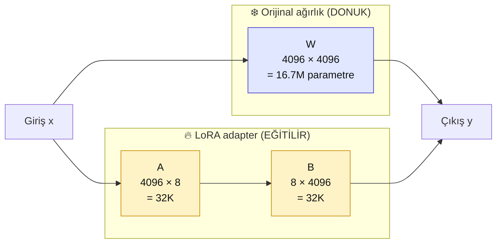

# 5.3 LoRA ve QLoRA — Matematik Sezgisi + GPU Seçimi

<div class="ma-meta" markdown>
<div class="ma-meta-row" markdown>
<strong>Kim için:</strong>
<span class="ma-persona ma-persona-baslangic">🟢 başlangıç</span>
<span class="ma-persona ma-persona-is">🔵 iş</span>
<span class="ma-persona ma-persona-kisisel">🟣 kişisel</span>
</div>
<div class="ma-meta-row"><strong>📋 Önkoşul:</strong> 5.1 + 5.2 okundu. FT gereksinimi karar ağacında çıktı — şimdi **nasıl** yapıldığını öğreneceksin.</div>
<div class="ma-meta-row"><strong>🎯 Çıktı:</strong> LoRA matrisi ayrıştırma sezgisini biliyorsun (formül ezberlemeden); **rank** + **target modules** + **learning rate** hyperparameter'larını kalibre edebiliyorsun; QLoRA'nın 4-bit NF4 quantization mantığını anladın; **hangi GPU için hangi boyut** modeli eğitebileceğinin memory math tablosu hazır. 5.4'te Colab'de eğitim yaparken parametre seçimlerini gerekçeli yapıyorsun.</div>
</div>

!!! tip "Yabancı kelime mi gördün?"
    **Rank** = LoRA adapter matrisinin "inceliği"; 4/8/16 yaygın. **Target modules** = modelin hangi layer'ları eğitilir (attention Q/K/V/O, MLP). **NF4** = Normal Float 4-bit; QLoRA'nın özel quantization format'ı. **Double quantization** = quantization constant'larını da quantize etme, ek %10 memory. **Learning rate** = gradient update boyutu; FT'de 1e-4 ila 5e-4 aralığı. **Epoch** = veri seti kaç kez görülür; FT'de 1-3 optimum. **Gradient accumulation** = küçük batch'leri birleştir, efektif büyük batch.</p>

## Neden bu sayfa?

5.1'de *"LoRA matris ayrıştırma, QLoRA 4-bit quantization"* dedim — kavram seviyesi. 5.2 karar ağacında FT'ye yönlendi. Bu sayfa **eğitim sırasında karşılaşacağın seçimleri** açıklar:

- **Rank = 8 mi 16 mı?** — adapter büyüklüğü
- **Target modules: q_proj + v_proj mi yoksa hepsi mi?** — hangi katmanları eğit
- **Learning rate 1e-4 mü 2e-4 mü?** — optimize konfigürasyonu
- **4-bit mi 8-bit mi?** — quantization tercihi
- **Hangi GPU'da hangi model?** — donanım kısıt

Bu seçimler notebook'un üst 10 satırıdır. Default'a mahkum kalmayıp **gerekçeli karar** vermek senin işin.

İkincisi: Sayfa **matematik formülü içermez.** Sezgi → diagram → karar mantığı. Bölüm 3.1 embedding matematiksizlik kuralının devamı.

## LoRA sezgisi — iki küçük matris

Bir büyük modelin bir ağırlık matrisi (örnek: attention'da `W_q` sorgu projeksiyonu) 4096×4096 = **16.7 milyon parametre**. Tam FT'de bu 16.7M hepsi güncellenir.

**LoRA fikri:** Bu büyük matrisin **değişimi** (ΔW) **düşük rank**'li olabilir. Yani:

```
ΔW  ≈  A × B
```

- **A** = 4096×8 matris (32K parametre)
- **B** = 8×4096 matris (32K parametre)
- **Toplam:** 64K parametre (orijinal 16.7M'in **%0.4'ü**)

<div class="ma-ekosistem" markdown>
<div class="ma-ekosistem-header">🗺️ LoRA görsel sezgi</div>



**Görsel okuma:** Giriş paralel iki yoldan geçer — (1) orijinal ağırlık **değişmez**, (2) LoRA adapter ekstra küçük bir düzeltme hesaplar. İki çıktı toplanır. Eğitimde sadece A ve B güncellenir; büyük W donuk kalır.

</div>

**Sonuç:** Model'in ana bilgisi korunur (W donuk), LoRA adapter'ı "ek davranış" yaratır. Adapter dosyası ~10-50 MB; orijinal model ~30-70 GB. **1000× daha küçük** dosya ile model davranışını değiştirebildin.

## Rank seçimi — adapter kalınlığı

`r` parametresi adapter'ın "rank"ı (A ve B matrisinin orta boyutu):

<table class="ma-aktorler" markdown>

| Rank | Parametre (4096² bazında) | Ne zaman |
|---|---|---|
| **r=4** | 32K | Hızlı deney, basit ton değişimi |
| **r=8** | 64K | **Default** — çoğu instruction tuning |
| **r=16** | 128K | Karmaşık domain; biraz daha kapasite |
| **r=32** | 256K | Büyük domain kayması; dikkat — overfit riski |
| **r=64+** | 512K+ | Nadir; full FT'ye yaklaşıyor, avantajı azalıyor |

**Rule of thumb:** Küçük veri seti (500-1000 örnek) → r=8. Büyük veri (5000+) → r=16. Veri 200 altı → r=4, overfit engelle.

**Alpha parametresi (scaling):** Genelde `alpha = 2 × r`. Yani r=8 için alpha=16. Gradient büyüklüğü kontrolü.

## Target modules — hangi katmanlar

Transformer model içinde **eğitilecek layer'lar** seçilmeli. Hugging Face PEFT config'i:

```python
from peft import LoraConfig

config = LoraConfig(
    r=8,
    lora_alpha=16,
    target_modules=["q_proj", "v_proj"],  # seçim
    lora_dropout=0.05,
    bias="none",
    task_type="CAUSAL_LM",
)
```

### 3 yaygın preset

**1. Minimal — `[q_proj, v_proj]`**

Sadece attention Q ve V. En küçük adapter, en hızlı. Basit tarz değişimi.

**2. Standart — `[q_proj, k_proj, v_proj, o_proj]`**

Tüm attention projeksiyonları. 2× daha büyük adapter, daha iyi kalite.

**3. Full — `[q_proj, k_proj, v_proj, o_proj, gate_proj, up_proj, down_proj]`**

Attention + MLP. En büyük adapter; tam FT'ye yaklaşan kalite, ama memory + süre artar.

**Tavsiye:** Standart preset (QKVO) çoğu kullanım için en iyi denge. Minimal deneyde, Full büyük bütçede.

### Unsloth kısayolu

Unsloth library otomatik seçim:

```python
from unsloth import FastLanguageModel

model = FastLanguageModel.get_peft_model(
    model,
    r=8,
    target_modules=["q_proj", "k_proj", "v_proj", "o_proj",
                    "gate_proj", "up_proj", "down_proj"],
    lora_alpha=16,
    use_gradient_checkpointing="unsloth",
)
```

Unsloth "standart" + MLP'yi otomatik önerir.

## QLoRA — quantization sihri

LoRA adapter küçük ama **orijinal model hâlâ 14-70 GB**. Colab T4'ün 16 GB VRAM'i 7B modeli bile zor kaldırır. QLoRA çözüm:

1. **Orijinal model 4-bit NF4 format'ına quantize** — memory 4× düşer (14 GB → 3.5 GB)
2. **LoRA adapter 16-bit kalır** — eğitim kalitesi korunur
3. **Double quantization** — quantization constant'larını da quantize et, ek %10 memory

### NF4 nedir

**Normal Float 4-bit** — 4 bit (16 olası değer) ile neural network ağırlıklarının normal dağılımına optimize edilmiş format. FP4 (standart float 4-bit)'dan **kalite olarak daha iyi**; QLoRA paper'ı 2023 (Dettmers et al.).

**Quantization kalitesi** — tam precision'a göre kayıp %1-3. Benchmark kalitesi **neredeyse özdeş** (MMLU, HellaSwag).

### Memory math — kendi hesap

Model parametre sayısı → memory formula:

```
Tam precision (FP16):  P × 2 bytes
8-bit:                  P × 1 byte
4-bit (QLoRA):          P × 0.5 bytes  +  %10 overhead
```

**Örnek — 7B model:**

| Format | Memory |
|---|---|
| FP16 (tam) | 14 GB |
| 8-bit | 7 GB |
| 4-bit NF4 | 3.5 GB + 0.35 GB overhead ≈ 4 GB |

**Eğitim için ek:** gradients + optimizer states. AdamW optimizer 8-bit kullanırsa (bitsandbytes `AdamW8bit`) ek 2-3 GB. Toplam eğitim hafızası:

- 7B QLoRA eğitim: **~6-8 GB VRAM** (T4 16 GB rahat)
- 13B QLoRA eğitim: **~12 GB VRAM** (T4 sınırda, A100 rahat)
- 70B QLoRA eğitim: **~40 GB VRAM** (A100 80 GB gerek)

## GPU seçimi — model × donanım matrisi

<table class="ma-aktorler" markdown>

| GPU | VRAM | Max QLoRA model | Fiyat |
|---|---|---|---|
| **Colab T4 (ücretsiz)** | 16 GB | 7B (Qwen 7B, Llama 8B) | $0 |
| **Colab Pro A100** | 40 GB | 13B rahat, 34B sınırda | $10/ay + saatlik |
| **RTX 3060** | 12 GB | 3B-7B | $300-400 |
| **RTX 4090** | 24 GB | 13B rahat, 34B sıkış | $1800 |
| **A100 40 GB** | 40 GB | 34B rahat, 70B QLoRA | $1.5-2/saat kiralık |
| **A100 80 GB** | 80 GB | 70B rahat | $2-3/saat kiralık |
| **H100 80 GB** | 80 GB | 70B + eğitim hızlı | $4-5/saat kiralık |
| **RunPod / Lambda Labs** | değişken | kiralama platformları | $0.3-5/saat |

**5.4 sayfası için:** Colab T4 (ücretsiz) + Qwen 2.5-1.5B veya TinyLlama 1.1B seçim. İlk FT deneyimi için ideal.

## Hyperparameter önerileri

Default değerlerle başla, sonra ayarla:

### Learning rate

```python
learning_rate = 2e-4  # QLoRA default
```

Çok büyükse (5e-4+): kayıp zıplayacak, model "bozuk" çıkacak.
Çok küçükse (5e-5): eğitim yavaş, yeterli değişim olmayacak.

**1e-4 ile 3e-4 arası güvenli bölge.** İlk deneyde 2e-4 dene.

### Epoch

```python
num_train_epochs = 2  # veya 3
```

- **1 epoch**: Kaba giriş, özellikle veri 5000+ ise yeter.
- **2-3 epoch**: Sweet spot. Çoğu küçük-orta set için.
- **5+ epoch**: Overfitting başlar; hold-out test set'te kötüleşir.

### Batch size + gradient accumulation

Tek GPU'da büyük batch sığmaz. Trick — küçük batch + accumulation:

```python
per_device_train_batch_size = 2       # GPU'ya sığan boyut
gradient_accumulation_steps = 8       # efektif batch = 2 × 8 = 16
```

Efektif 16 batch ile eğitim ama VRAM tek batch × 2 örneği tutar. **16 normal bir batch size.**

### Diğer

```python
warmup_ratio = 0.03                   # ilk %3 adım ısınma
lr_scheduler_type = "cosine"          # cosine decay
weight_decay = 0.01                   # regularization
max_grad_norm = 1.0                   # gradient clipping
```

Bunlar "konserve" değerler — hyperparameter tuning zamanın yoksa dokunma.

## Monitoring — eğitim nasıl gidiyor?

3 kritik metrik:

1. **Training loss** — her 10-20 adımda düşmeli. Düşmüyorsa LR çok küçük; zıplıyorsa LR çok büyük.
2. **Validation loss** — hold-out set üzerinde. Training'le birlikte düşmeli, sonra **plateau** yapmalı. Eğer train düşerken val artıyorsa **overfitting**.
3. **Eğitim süresi tahmini** — `transformers` Trainer otomatik ETA gösterir. Gerçekçi tutmak için.

**Weights & Biases (wandb) veya TensorBoard** grafik takip:

```python
training_args = TrainingArguments(
    ...,
    report_to="wandb",  # veya "tensorboard"
    logging_steps=10,
)
```

wandb ücretsiz kişisel plan yeter.

## Evaluation — işe yaradı mı?

Eğitim sonrası **objektif değerlendirme** şart:

### 1. Hold-out test set

Eğitim verinin %10'unu başta ayır, eğitime girme. Eğitim sonrası bu set'te test:

```python
# 100 örnek train/test için 90-10 split
from datasets import Dataset
ds = Dataset.from_list(data)
split = ds.train_test_split(test_size=0.1, seed=42)
train_ds, test_ds = split["train"], split["test"]
```

**Karşılaştırma:** Base model (eğitilmemiş) vs fine-tuned. Aynı test sorularıyla. Hangisi daha iyi?

### 2. Qualitative örnek

10 gerçek örnek üzerinde **insan değerlendirme**:

```
Soru: [test example]
Base output: ...
FT output: ...

Hangisi tercih edilir? Neden?
```

5+ insan (arkadaşlar, iş arkadaşları) → istatistiksel anlamlılık.

### 3. Benchmark (ileri)

MMLU (multi-task), HellaSwag (commonsense), HumanEval (kod) gibi standart benchmark'lar. FT sonrası genel yetenek kaybı var mı? Örneğin ton için FT ettin, matematik beceri düştü mü?

**lm-evaluation-harness** kütüphanesi standart benchmark'ları tek komutla çalıştırır.

## CTO tuzakları — 10 FT eğitim hatası

| # | Tuzak | Sonuç | Doğru |
|---|---|---|---|
| 1 | LR 1e-3 (çok büyük) | Kayıp zıplar, model bozuk | 1e-4 ile 3e-4 arası |
| 2 | 10 epoch | Overfitting, test kötü | 2-3 epoch |
| 3 | Rank=64 küçük veride | Overfit + gereksiz büyük adapter | r=8 veri 500-5000 için |
| 4 | Target modules sadece q_proj | Kalite sınırlı | QKVO preset |
| 5 | Evaluation hiç | "İyi mi bilmem" | Hold-out set + kalite karşılaştırma |
| 6 | Train/test aynı | Leakage, yanlış ölçüm | %10-20 hold-out |
| 7 | Monitoring olmaksızın | Eğitim ortasında durdurmazsın | wandb veya logging_steps |
| 8 | 4-bit quantization + küçük rank | Bazen dipte kalite kaybı | Kalite kritikse r=16 dene |
| 9 | Tek deney sonrası "tamam" | Hyperparameter tuning yok | 2-3 farklı LR/epoch dene |
| 10 | Model Hub'a push etmeden sakla | Yerelde unut, kaybol | HF Hub'a push + versioning |

## Anthropic ekosistemi — Claude ile kıyas

<details class="ma-anthropic-oz" markdown>
<summary><strong>🤖 Anthropic-öz: Claude refleksleri + FT alternatifleri</strong></summary>

LoRA ile FT edersin — ne alacaksın, ne kaybedeceksin?

### Kazanırsın

- **Domain dil** — tıp jargonu, hukuki terim, şirket özel jargon (200+ terim)
- **Output format** — katı JSON, özel XML şema
- **Ton/stil** — kurumsal, samimi, akademik
- **Tekrar eden pattern** — belirli soru-cevap çiftleri

### Kaybedersin

- **Genel yetenek** — matematik, kod, genel bilgi bozulabilir (catastrophic forgetting)
- **Constitutional AI refleksi** — Claude'un yerleşik güvenlik + dürüstlük; FT sonrası Llama'da benzer yok
- **Güncel bilgi** — FT modeli eğitim günü donuk; RAG yok ise güncel bilgi alma
- **Prompt caching avantajı** — Anthropic prompt caching açık; self-host FT modelde yok

### Trade-off örnek

**Senaryo:** Türk vergi uzmanı için asistan.

**Claude + RAG (5.2 tavsiyemiz):**
- Jargon: RAG'deki örnek belgeler yeter
- Güncellemeler: her ay yeni kanun RAG'e eklenir
- Güvenlik: Constitutional AI "yanlış tavsiye vermeme" refleksi
- Maliyet: aylık $10-50

**Llama 3 + FT + RAG hybrid:**
- Jargon: FT ile derinleş (500 örnek)
- Güncellemeler: RAG tarafı
- Güvenlik: **sen tasarlarsın** — Claude Constitutional avantajı yok
- Maliyet: $200+/ay GPU + compute + bakım

**Ne zaman hybrid değer?** Veri on-prem zorunluluğu varsa (sağlık, savunma). Aksi takdirde Claude + RAG **maliyet + güvenlik + bakım** üçlüsünde kazanır.

### Claude'un dolaylı FT yolu — Anthropic Academy + feedback

Anthropic Claude'a direkt FT sunmasa da:

1. **Model Spec feedback** — [docs.claude.com/en/docs/model-spec](https://docs.claude.com/en/docs/model-spec) → davranış önerilerini Anthropic'e ilet
2. **Cookbook contributions** — senin use case'in örneği cookbook'a eklenir → gelecek Claude eğitiminde etkili
3. **Academy courses** — kullanım pattern'leri dolaylı olarak model kalitesini etkiler (Anthropic prompt engineering araştırması)

Bu "crowd-sourced improvement" — formal FT değil ama Anthropic müşteri sinyali dinler.

### Açık kaynak ekosistem 2026

FT ekosistemi hızlı gelişiyor:

- **Unsloth** — 2024'te çıktı, 2× daha hızlı LoRA
- **LLaMA-Factory** — Çin kökenli, konsol UI'lı FT platformu
- **MLX LoRA** (Apple) — M-serisi Mac'te LoRA, ücretsiz
- **Axolotl** — YAML config, production pipeline

**Trend:** FT demokratikleşiyor, enterprise-only değil. Fiyat 2024-2026 arası %60 düştü.

</details>

## Çıktı kanıtları — 3 kanıt

<div class="ma-cikti-kaniti" markdown>
<div class="ma-cikti-kaniti-header">📏 Çıktı — 3 kanıt</div>

**1. Hyperparameter tercih tablosu:**

`muhendisal-notlarim/bolum-5/03-lora/hyperparams.md` →
- Senin projen için: rank, target_modules, learning_rate, epochs, batch size + accumulation
- Gerekçesi: veri boyutu + domain + GPU

**2. Memory math hesabı:**

`muhendisal-notlarim/bolum-5/03-lora/memory.md` →
- Elindeki GPU VRAM
- Hangi boyut modeli QLoRA ile eğitebilirsin (3B, 7B, 13B?)
- LoRA vs QLoRA memory karşılaştırma

**3. FT vs Claude + RAG trade-off:**

Kendi projen için (veya hayali) — 5.2 karar ağacının çıkışı FT ise — hangi kayıp/kazanç var? 1 paragraf analiz.

</div>

## Görev — 20 dk hyperparameter planlaması

<div class="ma-gorev" markdown>
<div class="ma-gorev-header">🎯 Görev — kendi FT senin için nasıl görünürdü?</div>

1. **Hayali proje:** 5.2'deki senaryolardan birini seç (hukuk / tıp / yaratıcı yazım veya kendi niş konun).
2. **Hyperparameter seç:**
   - Rank: 4 / 8 / 16 — hangisi?
   - Target: minimal / standart / full — hangisi?
   - Epochs: 1 / 2 / 3 — hangisi?
   - LR: 1e-4 / 2e-4 / 3e-4 — hangisi?
3. **GPU seç:** Colab T4 / Colab Pro A100 / RTX 4090 self-host — hangisi?
4. **Veri boyutu:** Kaç örnek? Nereden toplarsın?
5. **Evaluation:** Nasıl değerlendireceksin? 3-5 test sorusu yaz.
6. `muhendisal-notlarim/bolum-5/03-lora/plan.md` dosyasına commit.

**Başarı kriteri:** 20 dakika sonra hayali bir FT projesinin **tam hyperparameter config'i** yazılı. 5.4'te Colab'de çalıştırma zemini hazır.

</div>

<div class="ma-neden-sonuc" markdown>
<div class="ma-neden-sonuc-header">🔗 Birlikte okuma — neden ne oldu</div>

- **A → B:** LoRA iki küçük matris (A ve B); orijinal W donuk, parametre %0.4.
- **B → C:** Rank 4/8/16/32 — adapter kalınlığı; r=8 default.
- **C → D:** Target modules minimal/standart/full — QKVO preset yaygın tercih.
- **D → E:** QLoRA 4-bit NF4 + double quantization; 7B model 14 GB'dan 4 GB'a.
- **E → F:** GPU matrisi: Colab T4 7B, A100 34B, H100 70B rahat.
- **F → G:** Hyperparameter: LR 2e-4, epoch 2-3, batch 2 + accumulation 8 = 16 efektif.
- **G → H:** Monitoring: training + validation loss + wandb/TensorBoard.
- **H → I:** Evaluation: hold-out test + kalitatif + benchmark opsiyonel.
- **I → J:** Claude kıyası — FT kazanır ton/format/jargon; kaybeder Constitutional AI + güncel bilgi + maliyet.

<div class="ma-neden-sonuc-sonuc" markdown>
**Sonuç:** LoRA/QLoRA kavramsal netti. Sonraki (5.4): Colab'de gerçek eğitim — Qwen2.5-1.5B + 50 örnek + 20 dk + ilk LoRA adapter'ın.
</div>
</div>

<div class="ma-sonraki" markdown>
<div class="ma-sonraki-header">➡️ Sonraki adım</div>

**[5.4 Hugging Face Pratik →](04-hf-pratik.md)** — Bölüm 5 İMZA SAYFASI. Colab T4 + Qwen2.5-1.5B + 50 örnek + ilk adapter.

← [5.2 Karar Ağacı](02-karar.md) &nbsp;|&nbsp; [Bölüm 5 girişi](index.md) &nbsp;|&nbsp; [Ana sayfa](../index.md)

**Pekiştirme:** [QLoRA paper (2023)](https://arxiv.org/abs/2305.14314) + [LoRA paper (2021)](https://arxiv.org/abs/2106.09685) + [Unsloth blog](https://unsloth.ai/blog). Üçünü bir hafta sonu tara — matematik arkaplanı ister okursun, istemezsen pratik notebook'lara geç.
</div>
