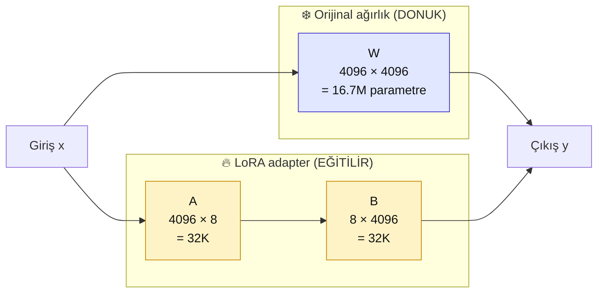

# 5.3 LoRA ve QLoRA — Sezgi, Hiperparametre, GPU Seçimi

<div class="ma-meta" markdown>
<div class="ma-meta-row" markdown>
<strong>Kim için:</strong>
<span class="ma-persona ma-persona-baslangic">🟢 başlangıç</span>
<span class="ma-persona ma-persona-is">🔵 iş</span>
<span class="ma-persona ma-persona-kisisel">🟣 kişisel</span>
</div>
<div class="ma-meta-row"><strong>⏱️ Süre:</strong> ~35 dakika</div>
<div class="ma-meta-row"><strong>📋 Önkoşul:</strong> 5.1 + 5.2 okundu. İnce ayar gereksinimi karar ağacında çıktı — şimdi **nasıl** yapıldığını öğreneceksin.</div>
<div class="ma-meta-row"><strong>🎯 Çıktı:</strong> LoRA matris ayrıştırma sezgisini biliyorsun (formül ezberlemeden); **rank** + **hedef katmanlar (target modules)** + **öğrenme oranı (learning rate)** hiperparametrelerini kalibre edebiliyorsun; QLoRA'nın 4-bit NF4 küçültme (quantization) mantığını anladın; **hangi GPU için hangi boyut** modeli eğitebileceğinin bellek hesabı tablosu hazır. 5.4'te Colab'de eğitim yaparken parametre seçimlerini gerekçeli yapıyorsun.</div>
</div>

!!! tip "Yabancı kelime mi gördün?"
    **Rank (rütbe)** = LoRA adaptör matrisinin "inceliği"; 4/8/16 yaygın. **Hedef katmanlar (target modules)** = modelin hangi katmanları eğitilir (attention Q/K/V/O, MLP). **NF4** = Normal Float 4-bit; QLoRA'nın özel küçültme formatı. **Çift küçültme (double quantization)** = küçültme sabitlerini de küçültmek; ek ~%10 bellek tasarrufu. **Öğrenme oranı (learning rate)** = gradyan güncelleme boyutu; ince ayarda 1e-4 ile 5e-4 arası. **Epoch (devir)** = veri setinin kaç kez taranacağı; ince ayarda 1-3 en uygunu. **Gradyan biriktirme (gradient accumulation)** = küçük batch'leri birleştirip etkin büyük batch elde etme.

## Neden bu sayfa?

5.1'de *"LoRA matris ayrıştırma, QLoRA 4-bit küçültme"* dedim — kavram seviyesi. 5.2 karar ağacında ince ayara yönlendi. Bu sayfa **eğitim sırasında karşılaşacağın seçimleri** açıklar:

- **Rank = 8 mi 16 mı?** — adaptör büyüklüğü
- **Hedef katmanlar: `q_proj + v_proj` mi yoksa hepsi mi?** — hangi katmanları eğit
- **Öğrenme oranı 1e-4 mü 2e-4 mü?** — eniyileyici (optimizer) ayarı
- **4-bit mi 8-bit mi?** — küçültme tercihi
- **Hangi GPU'da hangi model?** — donanım kısıtı

Bu seçimler notebook'un üst 10 satırıdır. Varsayılana mahkûm kalmayıp **gerekçeli karar** vermek senin işin.

İkincisi: Sayfa **matematik formülü içermez.** Sezgi → diyagram → karar mantığı. Bölüm 3.1 embedding matematiksizlik kuralının devamı.

## LoRA sezgisi — iki küçük matris

Bir büyük modelin bir ağırlık matrisi (örnek: attention'da `W_q` sorgu projeksiyonu) 4096×4096 = **16.7 milyon parametre**. Tam ince ayarda bu 16.7M'in hepsi güncellenir.

**LoRA fikri:** Bu büyük matrisin **değişimi** (ΔW) **düşük rank**'li olabilir. Yani:

```
ΔW  ≈  A × B
```

- **A** = 4096×8 matris (32K parametre)
- **B** = 8×4096 matris (32K parametre)
- **Toplam:** 64K parametre (orijinal 16.7M'in **%0.4'ü**)

<div class="ma-ekosistem" markdown>
<div class="ma-ekosistem-header">🗺️ LoRA görsel sezgi</div>



**Görsel okuma:** Giriş paralel iki yoldan geçer — (1) orijinal ağırlık **değişmez**, (2) LoRA adapter ekstra küçük bir düzeltme hesaplar. İki çıktı toplanır. Eğitimde sadece A ve B güncellenir; büyük W donuk kalır.

</div>

**Sonuç:** Modelin ana bilgisi korunur (W donuk), LoRA adaptörü "ek davranış" yaratır. Adaptör dosyası ~10-50 MB; orijinal model 16-140 GB (Llama 3.1 8B FP16 = 16 GB; 70B FP16 = 140 GB). **1000 kattan fazla küçük** dosya ile model davranışını değiştirebildin.

## Rank seçimi — adapter kalınlığı

`r` parametresi adapter'ın "rank"ı (A ve B matrisinin orta boyutu):

<table class="ma-aktorler" markdown>

| Rank | Parametre (4096² bazında) | Ne zaman |
|---|---|---|
| **r=4** | 32K | Hızlı deney, basit ton değişimi |
| **r=8** | 64K | **Default** — çoğu instruction tuning |
| **r=16** | 128K | Karmaşık domain; biraz daha kapasite |
| **r=32** | 256K | Büyük domain kayması; dikkat — overfit riski |
| **r=64+** | 512K+ | Nadir; full FT'ye yaklaşıyor, avantajı azalıyor |

</table>

**Pratik kural:** Küçük veri seti (500-1000 örnek) → r=8. Büyük veri (5000+) → r=16. Veri 200'ün altında → r=4, ezberlemeyi engelle.

**Alpha parametresi (ölçekleme):** Genelde `alpha = 2 × r`. Yani r=8 için alpha=16. Gradyan büyüklüğü kontrolü.

## Hedef katmanlar (target modules) — hangi katmanlar

Transformer model içinde **eğitilecek katmanlar** seçilmeli. Hugging Face PEFT yapılandırması:

```python
from peft import LoraConfig

config = LoraConfig(
    r=8,
    lora_alpha=16,
    target_modules=["q_proj", "v_proj"],  # seçim
    lora_dropout=0.05,
    bias="none",
    task_type="CAUSAL_LM",
)
```

### 3 yaygın preset

**1. Minimal — `[q_proj, v_proj]`**

Sadece dikkat (attention) Q ve V projeksiyonları. En küçük adaptör, en hızlı. Basit stil değişimi.

**2. Standart — `[q_proj, k_proj, v_proj, o_proj]`**

Tüm dikkat projeksiyonları. 2 kat büyük adaptör, daha iyi kalite.

**3. Tam — `[q_proj, k_proj, v_proj, o_proj, gate_proj, up_proj, down_proj]`**

Dikkat + MLP. En büyük adaptör; tam ince ayara yaklaşan kalite, ama bellek + süre artar.

**Tavsiye:** Standart hazır ayar (QKVO) çoğu kullanım için en iyi denge. Minimal deney için, Tam büyük bütçe için.

### Unsloth kısayolu

Unsloth library otomatik seçim:

```python
from unsloth import FastLanguageModel

model = FastLanguageModel.get_peft_model(
    model,
    r=8,
    target_modules=["q_proj", "k_proj", "v_proj", "o_proj",
                    "gate_proj", "up_proj", "down_proj"],
    lora_alpha=16,
    use_gradient_checkpointing="unsloth",
)
```

Unsloth "standart" + MLP'yi otomatik önerir.

## QLoRA — küçültme sihri

LoRA adaptörü küçük ama **orijinal model hâlâ 14-140 GB**. Colab T4'ün 16 GB VRAM'i 7B modeli bile zor kaldırır. QLoRA çözüm:

1. **Orijinal model 4-bit NF4 formatına küçültülür** — bellek 4 kat düşer (14 GB → 3.5 GB)
2. **LoRA adaptörü 16-bit (BF16) kalır** — eğitim kalitesi korunur
3. **Çift küçültme (double quantization)** — küçültme sabitlerini de küçültür, ek ~%10 bellek tasarrufu

### NF4 nedir

**Normal Float 4-bit** — 4 bitlik (16 olası değer) bir format; sinir ağı ağırlıklarının normal (Gauss) dağılımına optimize edilmiş. FP4'ten (standart 4-bit float) **istatistiksel olarak daha iyi temsil verir**; bu nedenle QLoRA makalesi (Dettmers ve ark., 2023) NF4'ü tercih ediyor.

**Küçültme kalitesi** — tam hassasiyete göre kayıp %1-3. Benchmark kalitesi neredeyse özdeş (MMLU, HellaSwag).

### Memory math — kendi hesap

Model parametre sayısı → memory formula:

```
Tam precision (FP16):  P × 2 bytes
8-bit:                  P × 1 byte
4-bit (QLoRA):          P × 0.5 bytes  +  %10 overhead
```

**Örnek — 7B model:**

| Format | Memory |
|---|---|
| FP16 (tam) | 14 GB |
| 8-bit | 7 GB |
| 4-bit NF4 | 3.5 GB + 0.35 GB overhead ≈ 4 GB |

**Eğitim için ek:** gradyanlar + eniyileyici (optimizer) durumları. AdamW eniyileyicisi 8-bit kullanırsa (bitsandbytes `AdamW8bit`) ek 2-3 GB. Toplam eğitim belleği:

- 7B QLoRA eğitim: **~6-8 GB VRAM** (T4 16 GB rahat)
- 13B QLoRA eğitim: **~12 GB VRAM** (T4 sınırda, A100 rahat)
- 70B QLoRA eğitim: **~40 GB VRAM** (A100 80 GB gerek)

## GPU seçimi — model × donanım matrisi

<table class="ma-aktorler" markdown>

| GPU | VRAM | En büyük QLoRA modeli | Fiyat (2026 Nisan) |
|---|---|---|---|
| **Colab T4 (ücretsiz katman)** | 16 GB | 7B (Qwen 3-7B, Llama 3.1 8B) | $0 — günlük kota var, 2024 sonu kısıtlandı |
| **Colab L4 (ücretsiz katman)** | 22 GB | 8B-13B | $0 — kullanılabilirlik değişken |
| **Colab Pro A100** | 40 GB | 13B rahat, 32B sınırda | $10/ay + işlem birimi (compute unit) saatlik |
| **RTX 3060** | 12 GB | 3B-7B | $250-350 (2026 ikinci el) |
| **RTX 4090** | 24 GB | 13B rahat, 32B sıkışık | $1500-1800 |
| **RTX 5090** | 32 GB | 32B rahat | $2000-2500 (Ocak 2025'te çıktı) |
| **A100 40 GB** | 40 GB | 32B rahat, 70B QLoRA sıkışık | $1.20-1.80/saat kiralık |
| **A100 80 GB** | 80 GB | 70B rahat | $1.50-2.50/saat kiralık |
| **H100 80 GB** | 80 GB | 70B + eğitim 2-3 kat hızlı | $2-3/saat kiralık (2026'da düştü) |
| **RunPod / Lambda Labs / Vast.ai** | değişken | kiralama platformları | $0.30-5/saat |

</table>

**5.4 sayfası için:** Colab T4 / L4 (ücretsiz katman) + Qwen 3-1.7B veya Llama 3.2 1B seçimi. İlk ince ayar deneyimi için ideal.

## Hyperparameter önerileri

Default değerlerle başla, sonra ayarla:

### Learning rate

```python
learning_rate = 2e-4  # QLoRA default
```

Çok büyükse (5e-4+): kayıp zıplayacak, model "bozuk" çıkacak.
Çok küçükse (5e-5): eğitim yavaş, yeterli değişim olmayacak.

**1e-4 ile 3e-4 arası güvenli bölge.** İlk deneyde 2e-4 dene.

### Epoch

```python
num_train_epochs = 2  # veya 3
```

- **1 epoch**: Kaba giriş, özellikle veri 5000+ ise yeter.
- **2-3 epoch**: Sweet spot. Çoğu küçük-orta set için.
- **5+ epoch**: Overfitting başlar; hold-out test set'te kötüleşir.

### Batch size + gradient accumulation

Tek GPU'da büyük batch sığmaz. Trick — küçük batch + accumulation:

```python
per_device_train_batch_size = 2       # GPU'ya sığan boyut
gradient_accumulation_steps = 8       # efektif batch = 2 × 8 = 16
```

Efektif 16 batch ile eğitim ama VRAM tek batch × 2 örneği tutar. **16 normal bir batch size.**

### Diğer

```python
warmup_ratio = 0.03                   # ilk %3 adım ısınma
lr_scheduler_type = "cosine"          # cosine decay
weight_decay = 0.01                   # regularization
max_grad_norm = 1.0                   # gradient clipping
```

Bunlar "konserve" değerler — hyperparameter tuning zamanın yoksa dokunma.

## Monitoring — eğitim nasıl gidiyor?

3 kritik metrik:

1. **Training loss** — her 10-20 adımda düşmeli. Düşmüyorsa LR çok küçük; zıplıyorsa LR çok büyük.
2. **Validation loss** — hold-out set üzerinde. Training'le birlikte düşmeli, sonra **plateau** yapmalı. Eğer train düşerken val artıyorsa **overfitting**.
3. **Eğitim süresi tahmini** — `transformers` Trainer otomatik ETA gösterir. Gerçekçi tutmak için.

**Weights & Biases (wandb) veya TensorBoard** grafik takip:

```python
training_args = TrainingArguments(
    ...,
    report_to="wandb",  # veya "tensorboard"
    logging_steps=10,
)
```

wandb ücretsiz kişisel plan yeter.

## Evaluation — işe yaradı mı?

Eğitim sonrası **objektif değerlendirme** şart:

### 1. Hold-out test set

Eğitim verinin %10'unu başta ayır, eğitime girme. Eğitim sonrası bu set'te test:

```python
# 100 örnek train/test için 90-10 split
from datasets import Dataset
ds = Dataset.from_list(data)
split = ds.train_test_split(test_size=0.1, seed=42)
train_ds, test_ds = split["train"], split["test"]
```

**Karşılaştırma:** Base model (eğitilmemiş) vs fine-tuned. Aynı test sorularıyla. Hangisi daha iyi?

### 2. Qualitative örnek

10 gerçek örnek üzerinde **insan değerlendirme**:

```
Soru: [test example]
Base output: ...
FT output: ...

Hangisi tercih edilir? Neden?
```

5+ insan (arkadaşlar, iş arkadaşları) → istatistiksel anlamlılık.

### 3. Benchmark (ileri)

MMLU (multi-task), HellaSwag (commonsense), HumanEval (kod) gibi standart benchmark'lar. FT sonrası genel yetenek kaybı var mı? Örneğin ton için FT ettin, matematik beceri düştü mü?

**lm-evaluation-harness** kütüphanesi standart benchmark'ları tek komutla çalıştırır.

## CTO tuzakları — 10 ince ayar eğitim hatası

| # | Tuzak | Sonuç | Doğru |
|---|---|---|---|
| 1 | LR 1e-3 (çok büyük) | Kayıp zıplar, model bozuk | 1e-4 ile 3e-4 arası |
| 2 | 10 epoch | Modelin ezberlemesi, test kötü | 2-3 epoch |
| 3 | r=64 küçük veride | Ezberleme + gereksiz büyük adaptör | r=8, veri 500-5000 için |
| 4 | Hedef katman olarak yalnızca `q_proj` | Kalite sınırlı | QKVO hazır ayarı |
| 5 | Değerlendirme yok | "İyi mi bilmem" | Ayrı test seti + kalite karşılaştırma |
| 6 | Eğitim/test aynı veri | Sızıntı (leakage), yanlış ölçüm | %10-20 ayrı tut |
| 7 | İzleme olmadan eğitim | Ortada durdurma sezgisi yok | wandb veya `logging_steps` ekle |
| 8 | 4-bit küçültme + küçük rank | Kalite dipte kalabilir | Kalite kritikse r=16 dene |
| 9 | Tek deney sonrası "tamam" | Hiperparametre ayarı yok | 2-3 farklı LR/epoch dene |
| 10 | Model Hub'a yüklemeden saklama | Yerelde unutulur, kaybolur | HuggingFace Hub'a yükle + sürümle |

??? warning "Tipik LoRA/QLoRA hataları — şu durum şu çözüm"

    | Hata | Sebep | Çözüm |
    |---|---|---|
    | `CUDA out of memory` (eğitim sırasında) | Batch + model büyük | `per_device_train_batch_size=1`, `gradient_accumulation_steps=16`; gradient checkpointing aç |
    | `bitsandbytes` import hatası | CUDA / sürücü uyumsuz | `pip install -U bitsandbytes`; CUDA 12.x sürücü kontrol et |
    | Eğitim kayıp düşmüyor (sabit) | LR çok düşük veya veri çok az | LR'yi 5e-5 → 2e-4'e çek; 200+ örnekli veriyle dene |
    | İnce ayar sonrası model "saçmalıyor" | Yıkıcı unutma (catastrophic forgetting) — LR çok yüksek veya çok epoch | LR'yi düşür (5e-5'e); epoch 1'e indir; rank'i azalt |
    | Adaptör yüklenmiyor | Versiyon uyumsuzluğu (peft sürümü) | `peft` ve `transformers` aynı uyumlu sürümlere yükselt |
    | Çıktı tam saçma değil ama kötü | r veya hedef katmanlar yetersiz | Hedef katmanları QKVO'ya çıkar; rank 8 → 16 |

## Anthropic ekosistemi — Claude ile kıyas

<details class="ma-anthropic-oz" markdown>
<summary><strong>🤖 Anthropic-öz: Claude refleksleri + FT alternatifleri</strong></summary>

LoRA ile FT edersin — ne alacaksın, ne kaybedeceksin?

### Kazanırsın

- **Domain dil** — tıp jargonu, hukuki terim, şirket özel jargon (200+ terim)
- **Output format** — katı JSON, özel XML şema
- **Ton/stil** — kurumsal, samimi, akademik
- **Tekrar eden pattern** — belirli soru-cevap çiftleri

### Kaybedersin

- **Genel yetenek** — matematik, kod, genel bilgi bozulabilir (catastrophic forgetting)
- **Constitutional AI refleksi** — Claude'un yerleşik güvenlik + dürüstlük; FT sonrası Llama'da benzer yok
- **Güncel bilgi** — FT modeli eğitim günü donuk; RAG yok ise güncel bilgi alma
- **Prompt caching avantajı** — Anthropic prompt caching açık; self-host FT modelde yok

### Trade-off örnek

**Senaryo:** Türk vergi uzmanı için asistan.

**Claude + RAG (5.2 tavsiyemiz):**
- Jargon: RAG'deki örnek belgeler yeter
- Güncellemeler: her ay yeni kanun RAG'e eklenir
- Güvenlik: Constitutional AI "yanlış tavsiye vermeme" refleksi
- Maliyet: aylık $10-50

**Llama 3 + FT + RAG hybrid:**
- Jargon: FT ile derinleş (500 örnek)
- Güncellemeler: RAG tarafı
- Güvenlik: **sen tasarlarsın** — Claude Constitutional avantajı yok
- Maliyet: $200+/ay GPU + compute + bakım

**Ne zaman hybrid değer?** Veri on-prem zorunluluğu varsa (sağlık, savunma). Aksi takdirde Claude + RAG **maliyet + güvenlik + bakım** üçlüsünde kazanır.

### Claude'un dolaylı FT yolu — Anthropic Academy + feedback

Anthropic Claude'a direkt FT sunmasa da:

1. **Model Spec geri bildirimi** — [platform.claude.com/docs/en/about-claude/model-spec](https://platform.claude.com/docs/en/about-claude/model-spec) → davranış önerilerini Anthropic'e ilet
2. **Cookbook contributions** — senin use case'in örneği cookbook'a eklenir → gelecek Claude eğitiminde etkili
3. **Academy courses** — kullanım pattern'leri dolaylı olarak model kalitesini etkiler (Anthropic prompt engineering araştırması)

Bu "crowd-sourced improvement" — formal FT değil ama Anthropic müşteri sinyali dinler.

### Açık kaynak ekosistem 2026

FT ekosistemi hızlı gelişiyor:

- **Unsloth** — 2024'te çıktı, 2× daha hızlı LoRA
- **LLaMA-Factory** — Çin kökenli, konsol UI'lı FT platformu
- **MLX LoRA** (Apple) — M-serisi Mac'te LoRA, ücretsiz
- **Axolotl** — YAML config, production pipeline

**Trend:** FT demokratikleşiyor, enterprise-only değil. Fiyat 2024-2026 arası %60 düştü.

</details>

## Çıktı kanıtları — 3 kanıt

<div class="ma-cikti-kaniti" markdown>
<div class="ma-cikti-kaniti-header">📏 Çıktı — 3 kanıt</div>

**1. Hyperparameter tercih tablosu:**

`muhendisal-notlarim/bolum-5/03-lora/hyperparams.md` →
- Senin projen için: rank, target_modules, learning_rate, epochs, batch size + accumulation
- Gerekçesi: veri boyutu + domain + GPU

**2. Memory math hesabı:**

`muhendisal-notlarim/bolum-5/03-lora/memory.md` →
- Elindeki GPU VRAM
- Hangi boyut modeli QLoRA ile eğitebilirsin (3B, 7B, 13B?)
- LoRA vs QLoRA memory karşılaştırma

**3. FT vs Claude + RAG trade-off:**

Kendi projen için (veya hayali) — 5.2 karar ağacının çıkışı FT ise — hangi kayıp/kazanç var? 1 paragraf analiz.

</div>

## Görev — 20 dk hyperparameter planlaması

<div class="ma-gorev" markdown>
<div class="ma-gorev-header">🎯 Görev — kendi FT senin için nasıl görünürdü?</div>

1. **Hayali proje:** 5.2'deki senaryolardan birini seç (hukuk / tıp / yaratıcı yazım veya kendi niş konun).
2. **Hyperparameter seç:**
   - Rank: 4 / 8 / 16 — hangisi?
   - Target: minimal / standart / full — hangisi?
   - Epochs: 1 / 2 / 3 — hangisi?
   - LR: 1e-4 / 2e-4 / 3e-4 — hangisi?
3. **GPU seç:** Colab T4 / Colab Pro A100 / RTX 4090 self-host — hangisi?
4. **Veri boyutu:** Kaç örnek? Nereden toplarsın?
5. **Evaluation:** Nasıl değerlendireceksin? 3-5 test sorusu yaz.
6. `muhendisal-notlarim/bolum-5/03-lora/plan.md` dosyasına commit.

**Başarı kriteri:** 20 dakika sonra hayali bir FT projesinin **tam hyperparameter config'i** yazılı. 5.4'te Colab'de çalıştırma zemini hazır.

</div>

<div class="ma-neden-sonuc" markdown>
<div class="ma-neden-sonuc-header">🔗 Birlikte okuma — neden ne oldu</div>

<ol class="ma-neden-sonuc-zincir" markdown>
<li>**A → B:** LoRA iki küçük matris (A ve B); orijinal W donuk, parametre %0.4. Bu yüzden **parametre verimliliği muazzam.**</li>
<li>**B → C:** Rank 4/8/16/32 — adapter kalınlığı; r=8 default. Bu yüzden **daha yüksek rank her zaman iyi değil.**</li>
<li>**C → D:** Target modules minimal/standart/full — QKVO preset yaygın tercih. Bu yüzden **preset'le başla, gerekirse genişlet.**</li>
<li>**D → E:** QLoRA 4-bit NF4 + double quantization; 7B model 14 GB'dan 4 GB'a. Bu yüzden **tüketici GPU ile 7B eğitilebilir.**</li>
<li>**E → F:** GPU matrisi: Colab T4 7B, A100 34B, H100 70B rahat. Bu yüzden **model boyutu GPU'ya göre seç.**</li>
<li>**F → G:** Hyperparameter: LR 2e-4, epoch 2-3, batch 2 + accumulation 8 = 16 efektif. Bu yüzden **başlangıç değerleri iyi test edilmiş.**</li>
<li>**G → H:** Monitoring: training + validation loss + wandb/TensorBoard. Bu yüzden **eğitim körlüğü sonucu mahveder.**</li>
<li>**H → I:** Evaluation: hold-out test + kalitatif + benchmark opsiyonel. Bu yüzden **sayı olmadan iyileşme belirsiz kalır.**</li>
<li>**I → J:** Claude kıyası — FT kazanır ton/format/jargon; kaybeder Constitutional AI + güncel bilgi + maliyet. Bu yüzden **FT her zaman daha iyi değil.**</li>
</ol>

<div class="ma-neden-sonuc-sonuc" markdown>
**Sonuç:** LoRA/QLoRA kavramsal netti. Sonraki (5.4): Colab'de gerçek eğitim — Qwen2.5-1.5B + 50 örnek + 20 dk + ilk LoRA adapter'ın.
</div>
</div>

<div class="ma-sonraki" markdown>
<div class="ma-sonraki-header">➡️ Sonraki adım</div>

**[5.4 Hugging Face Pratik →](04-hf-pratik.md)** — Bölüm 5 İMZA SAYFASI. Colab T4 + Qwen2.5-1.5B + 50 örnek + ilk adapter.

← [5.2 Karar Ağacı](02-karar.md) &nbsp;|&nbsp; [Bölüm 5 girişi](index.md) &nbsp;|&nbsp; [Ana sayfa](../index.md)

**Pekiştirme:** [QLoRA paper (2023)](https://arxiv.org/abs/2305.14314) + [LoRA paper (2021)](https://arxiv.org/abs/2106.09685) + [Unsloth blog](https://unsloth.ai/blog). Üçünü bir hafta sonu tara — matematik arkaplanı ister okursun, istemezsen pratik notebook'lara geç.
</div>
