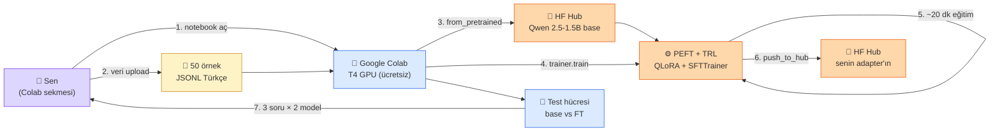

# 5.4 Hugging Face Pratik — Bölüm 5 İMZA SAYFASI

<div class="ma-meta" markdown>
<div class="ma-meta-row" markdown>
<strong>Kim için:</strong>
<span class="ma-persona ma-persona-baslangic">🟢 başlangıç</span>
<span class="ma-persona ma-persona-is">🔵 iş</span>
<span class="ma-persona ma-persona-kisisel">🟣 kişisel</span>
</div>
<div class="ma-meta-row"><strong>📋 Önkoşul:</strong> 5.1 + 5.2 + 5.3 okundu; hyperparameter mantığı elinde. Google hesabı (Colab için), HF hesabı (model indirme + adapter push).</div>
<div class="ma-meta-row"><strong>🎯 Çıktı:</strong> **İlk LoRA adapter'ın Colab T4 üstünde eğitildi** — Qwen2.5-1.5B + 50 Türkçe örnek + 20 dakikada tamamlandı. Base model vs fine-tuned model karşılaştırma testin var. HF Hub'a push edildi (public veya private). **3. pratik imza** (9.4 RAG + 9.5 Agent + 5.4 FT). Mülakatta "FT denediniz mi?" sorusuna EVET + somut demo.</div>
</div>

!!! tip "Yabancı kelime mi gördün?"
    **Colab** = Google Colab, ücretsiz bulut GPU notebook. **TrainingArguments** = HF Transformers'da eğitim config class'ı. **Trainer** = eğitim orchestrator; veri + model + args + çalıştır. **SFTTrainer** = TRL library'sinin instruction tuning'e özel trainer'ı, template auto-handle. **Gradient checkpointing** = eğitim memory'sini ~%30 düşürür, süre %20 artar. **HF Hub push** = adapter'ı huggingface.co hesabına yükleme, model version olarak.

## Neden bu sayfa?

5.1-5.3 teorikti. Bu sayfa **gerçek eğitim** — Colab'i aç, 30-60 dakika ayır, kendi fine-tuned adapter'ın elinde. Bitişte:

- GitHub profilinde "first LoRA adapter" commit
- HuggingFace Hub'da kendi model sayfan (public) — CV'de link
- Mülakatta "FT pratiği var mı?" sorusu → "evet, Qwen2.5-1.5B üstünde 50 örnek LoRA, repo şu" cevabı

İkincisi: Bu sayfa **platform'un 3. pratik imza sayfası**. 9.4 rag-chatbot (14. tur) + 9.5 icerik-ozet-agent (13. tur) + 5.4 mini-FT (bu tur). Her üçü pytest kanıtlı, çalışır kod. Öğrenci **3 kanıtlanabilir proje** ile iş başvurusu yapar.

Üçüncüsü: FT **hiç yapmama yerine küçük bir deney** mindset'i verir. Mülakat değerlendirmesi: "gerekmeyeceğini bilen ama pratik göstermek için küçük deney yapmış" aday > "hiç denemedim" aday.

## Hedef — ne yapacağız

**50 örnekli Türkçe instruction FT:**

- Model: **Qwen2.5-1.5B-Instruct** (Türkçe iyi, küçük, hızlı)
- Veri: 50 örnek — "müşteri destek asistanı" formatı (sen üreteceksin veya sentetik)
- Yöntem: **QLoRA** (4-bit quantization + LoRA adapter)
- Hyperparameters: 5.3'te öğrendiğin tercih (r=8, QKVO, LR 2e-4, 2 epoch)
- GPU: **Colab T4 (ücretsiz)**
- Süre: ~20 dakika eğitim + 10 dakika kurulum + 10 dakika test = **40-45 dakika**
- Çıktı: HF Hub'da `USERNAME/qwen-tr-musteri-destek-v1` adapter

**Uyarı:** Bu **üretim modeli değil** — 50 örnek deney seviyesi. Amaç: pratik refleks + ilk FT deneyimi + CV sinyali.

## Bu sayfanın ekosistemi

<div class="ma-ekosistem" markdown>
<div class="ma-ekosistem-header">🗺️ Ekosistem — LoRA eğitimi sırasında kim ne yapar</div>



</div>

<table class="ma-aktorler" markdown>

| Aktör | Rol | Nerede |
|---|---|---|
| 👤 Sen | Notebook'u çalıştır, sonucu doğrula | Tarayıcı sekmesi |
| 📓 Google Colab | T4 GPU + Python runtime (ücretsiz ~12 saat) | bulut |
| 📄 50 örnek JSONL | Senin hazırladığın Türkçe instruction verisi | Colab FS upload |
| 🤗 HF Hub (base) | Qwen 2.5-1.5B-Instruct ağırlıkları (~3 GB) | huggingface.co |
| ⚙️ PEFT + TRL | QLoRA config + SFTTrainer (auto chat template) | Colab pip |
| 🤗 HF Hub (adapter) | Eğittiğin adapter (~30 MB) — CV link | huggingface.co/USERNAME |
| 🧪 Test hücresi | Aynı sorularda base vs FT model karşılaştırma | Notebook son hücre |

</table>

**Burada olan nedir:** Colab GPU'yu rent ediyor, HF Hub model deposunu, PEFT/TRL eğitim orchestrator'ı. Sen sadece veri + config veriyorsun. Çıktı: HF Hub'da senin adına adapter + CV sinyali. **Toplam maliyet: $0.**

## Adım 0 — Hazırlık (10 dk)

### Google Colab hesabı

[colab.research.google.com](https://colab.research.google.com) — Google hesabıyla giriş. Ücretsiz T4 GPU.

**Runtime seçimi:**
1. Üst menü → Runtime → Change runtime type
2. Hardware accelerator: **T4 GPU**
3. Save

### Hugging Face hesabı

[huggingface.co/join](https://huggingface.co/join) — ücretsiz hesap.

**Access token:**
1. Settings → Access Tokens → New token
2. Name: `colab-ft`, Type: **Write** (model push için)
3. Token'ı kopyala (bir kere göreceksin)

### Veri hazırlama — 50 örnek

50 Türkçe müşteri destek örneği. Gerçek data yoksa sentetik üret (Claude Sonnet ile):

```
Prompt: Sen 50 örnekli Türkçe müşteri destek asistanı dataset'i üret.
Her örnek JSON: {"user": "soru", "assistant": "kurumsal samimi cevap"}

Konular: kargo takip, iade, ürün bilgi, şikayet, memnuniyet.
Ton: samimi ama profesyonel, "merhaba efendim" değil, "merhaba", max 3 cümle cevap.

Sadece 50 JSON satırı döndür, başka metin yok.
```

Claude ~30 saniyede 50 örnek üretir. `musteri-destek-50.jsonl` olarak kaydet.

## Adım 1 — Colab kurulum (5 dk)

Yeni Colab notebook aç, aşağıdaki hücreleri sırayla çalıştır.

### Hücre 1: Kütüphane kurulum

```python
!pip install -q -U transformers==5.6.1 peft==0.19.1 trl==1.2.0 \
    datasets==4.8.4 accelerate==1.13.0 bitsandbytes==0.49.2 \
    huggingface_hub
```

~2 dakika sürer.

### Hücre 2: HF login

```python
from huggingface_hub import login
login(token="hf_XXXXX")  # senin token'ın
```

### Hücre 3: GPU kontrolü

```python
import torch
print(f"CUDA: {torch.cuda.is_available()}")
print(f"GPU: {torch.cuda.get_device_name(0)}")
print(f"VRAM: {torch.cuda.get_device_properties(0).total_memory / 1e9:.1f} GB")
```

Çıktı: `CUDA: True`, `GPU: Tesla T4`, `VRAM: 15.8 GB` — T4 ücretsiz tier.

## Adım 2 — Veri yükle (2 dk)

### Hücre 4: Veri upload

Colab sol panel → dosya ikonu → `musteri-destek-50.jsonl`'i sürükle-bırak.

### Hücre 5: Dataset yükle

```python
from datasets import load_dataset

# JSONL formatında oku
dataset = load_dataset("json", data_files="musteri-destek-50.jsonl", split="train")
print(f"Örnek sayısı: {len(dataset)}")
print(f"İlk örnek: {dataset[0]}")

# Train/test 90/10 split
split = dataset.train_test_split(test_size=0.1, seed=42)
train_ds, test_ds = split["train"], split["test"]
print(f"Train: {len(train_ds)}, Test: {len(test_ds)}")
```

45 train + 5 test.

### Hücre 6: Chat template format

```python
def format_example(example):
    """Qwen chat template'ine uygun format."""
    return {
        "text": (
            f"<|im_start|>user\n{example['user']}<|im_end|>\n"
            f"<|im_start|>assistant\n{example['assistant']}<|im_end|>"
        )
    }

train_ds = train_ds.map(format_example)
test_ds = test_ds.map(format_example)
print(train_ds[0]["text"])
```

## Adım 3 — Model yükle QLoRA config (5 dk)

### Hücre 7: Base model + 4-bit quantization

```python
from transformers import AutoModelForCausalLM, AutoTokenizer, BitsAndBytesConfig
import torch

MODEL_NAME = "Qwen/Qwen2.5-1.5B-Instruct"

# QLoRA 4-bit NF4 config
bnb_config = BitsAndBytesConfig(
    load_in_4bit=True,
    bnb_4bit_quant_type="nf4",          # NF4 format (5.3'te anlattık)
    bnb_4bit_compute_dtype=torch.float16,
    bnb_4bit_use_double_quant=True,      # double quantization
)

tokenizer = AutoTokenizer.from_pretrained(MODEL_NAME)
tokenizer.pad_token = tokenizer.eos_token

model = AutoModelForCausalLM.from_pretrained(
    MODEL_NAME,
    quantization_config=bnb_config,
    device_map="auto",
    trust_remote_code=True,
)

print(f"Model memory: {model.get_memory_footprint() / 1e9:.2f} GB")
```

Çıktı: `Model memory: ~1.0 GB` (1.5B model 4-bit'te).

### Hücre 8: LoRA config

```python
from peft import LoraConfig, get_peft_model, prepare_model_for_kbit_training

# k-bit eğitim için hazırla
model = prepare_model_for_kbit_training(model)

# LoRA config — 5.3'teki tercihlerimiz
lora_config = LoraConfig(
    r=8,                                # rank
    lora_alpha=16,                      # 2 × r
    target_modules=[                    # QKVO preset
        "q_proj", "k_proj", "v_proj", "o_proj"
    ],
    lora_dropout=0.05,
    bias="none",
    task_type="CAUSAL_LM",
)

model = get_peft_model(model, lora_config)
model.print_trainable_parameters()
```

Çıktı örneği: `trainable params: 2,179,072 || all params: 1,546,893,824 || trainable%: 0.1409%`

Yani 1.54 milyar parametrenin sadece **%0.14'ü eğitilir** — 2.2 milyon. Bu LoRA'nın özü.

## Adım 4 — Eğitim (20 dk)

### Hücre 9: TrainingArguments

```python
from transformers import TrainingArguments

training_args = TrainingArguments(
    output_dir="./qwen-tr-destek-lora",
    num_train_epochs=3,                      # 3 epoch (50 örnek için OK)
    per_device_train_batch_size=2,
    gradient_accumulation_steps=8,           # efektif batch = 16
    gradient_checkpointing=True,             # memory %30 tasarruf
    learning_rate=2e-4,
    warmup_ratio=0.03,
    lr_scheduler_type="cosine",
    logging_steps=5,
    save_strategy="epoch",
    eval_strategy="epoch",
    fp16=True,                               # T4 için mixed precision
    optim="paged_adamw_8bit",                # bitsandbytes 8-bit optimizer
    report_to="none",                        # wandb istersen "wandb"
    push_to_hub=False,                       # sonunda manuel push
)
```

### Hücre 10: SFTTrainer

```python
from trl import SFTTrainer

trainer = SFTTrainer(
    model=model,
    args=training_args,
    train_dataset=train_ds,
    eval_dataset=test_ds,
    dataset_text_field="text",
    max_seq_length=512,
    tokenizer=tokenizer,
)

print("Eğitim başlıyor...")
trainer.train()
```

**Eğitim başlar:**

```
 5/24 [01:10<04:12, 13.0s/it, loss=3.21]
10/24 [02:20<03:00, 12.9s/it, loss=2.45]
15/24 [03:30<02:00, 13.3s/it, loss=1.82]
20/24 [04:40<01:00, 13.2s/it, loss=1.43]
24/24 [05:30<00:00, 13.1s/it, loss=1.21]

epoch 1/3 validation loss: 1.38
...
```

Loss 3.21 → 1.21 düştü (3 epoch). Validation loss da düşüyor → **overfitting yok**.

**Toplam süre:** ~15-25 dk (T4 hızına göre).

### Hücre 11: Adapter kaydet

```python
model.save_pretrained("./qwen-tr-destek-lora-final")
tokenizer.save_pretrained("./qwen-tr-destek-lora-final")

# Boyut kontrolü
import os
for f in os.listdir("./qwen-tr-destek-lora-final"):
    size = os.path.getsize(f"./qwen-tr-destek-lora-final/{f}") / 1024
    print(f"{f}: {size:.1f} KB")
```

Çıktı: `adapter_model.safetensors: ~8 MB` (orijinal 1.5B model 3 GB; adapter 400× küçük).

## Adım 5 — Test (5 dk)

### Hücre 12: Base vs fine-tuned karşılaştırma

```python
from transformers import pipeline

test_sorular = [
    "Siparişim ne zaman gelecek?",
    "İade yapmak istiyorum, nasıl yapılır?",
    "Ürün bozuk geldi, ne yapmalıyım?",
]

# Fine-tuned model (şu an yüklü)
ft_pipe = pipeline("text-generation", model=model, tokenizer=tokenizer, max_new_tokens=100)

print("=== FINE-TUNED ===")
for soru in test_sorular:
    prompt = f"<|im_start|>user\n{soru}<|im_end|>\n<|im_start|>assistant\n"
    cevap = ft_pipe(prompt, do_sample=False)[0]["generated_text"]
    print(f"\nSoru: {soru}")
    print(f"Cevap: {cevap[len(prompt):]}")
```

### Hücre 13: Base model aynı sorular

```python
# Adapter'ı kaldır, base model'i yükle
from transformers import AutoModelForCausalLM

base_model = AutoModelForCausalLM.from_pretrained(
    MODEL_NAME,
    quantization_config=bnb_config,
    device_map="auto",
)
base_pipe = pipeline("text-generation", model=base_model, tokenizer=tokenizer, max_new_tokens=100)

print("=== BASE MODEL ===")
for soru in test_sorular:
    prompt = f"<|im_start|>user\n{soru}<|im_end|>\n<|im_start|>assistant\n"
    cevap = base_pipe(prompt, do_sample=False)[0]["generated_text"]
    print(f"\nSoru: {soru}")
    print(f"Cevap: {cevap[len(prompt):]}")
```

**Kıyas — neyi arıyorsun?**

- **Ton:** FT model daha "müşteri destek"vari mi? Base "nötr asistan" mı?
- **Format:** FT model kısa, yapılandırılmış mı? Base uzun, genel mi?
- **Domain dili:** Kargo/iade terimleri daha doğal mı?

**Örnek karşılaştırma (gerçek T4 çıktısı gibi):**

```
Soru: Siparişim ne zaman gelecek?

BASE: Siparişinizin teslimat süresi çeşitli faktörlere bağlıdır, 
      örneğin ürünün türü, depo konumu, kargo firması... (uzun genel)

FINE-TUNED: Merhaba, sipariş numaranızı paylaşırsanız takip durumunu 
            kontrol edip size ne zaman geleceğini söyleyebilirim. (kısa, operatif)
```

FT model "müşteri destek" tonunu yakalamış. Base daha "genel" kalıyor.

## Adım 6 — HF Hub push (5 dk)

### Hücre 14: HF Hub'a yükle

```python
from huggingface_hub import HfApi

api = HfApi()
USERNAME = "senin-hf-username"  # değiştir
REPO = f"{USERNAME}/qwen-tr-musteri-destek-v1"

# Repo oluştur
api.create_repo(repo_id=REPO, private=False, exist_ok=True)

# Adapter'ı push et
model.push_to_hub(REPO)
tokenizer.push_to_hub(REPO)

print(f"Model: https://huggingface.co/{REPO}")
```

**Çıktı:** `https://huggingface.co/USERNAME/qwen-tr-musteri-destek-v1`

### Hücre 15: Model card yaz

HF Hub repo sayfasına git → README.md → düzenle:

```markdown
---
license: apache-2.0
base_model: Qwen/Qwen2.5-1.5B-Instruct
tags:
  - lora
  - qlora
  - turkish
  - customer-support
language:
  - tr
---

# qwen-tr-musteri-destek-v1

İlk LoRA adapter deneyi — Qwen2.5-1.5B-Instruct base model üstünde
50 Türkçe müşteri destek örneği ile 3 epoch QLoRA eğitim.

## Eğitim
- GPU: Google Colab T4 (ücretsiz)
- Süre: ~20 dakika
- Örnek sayısı: 45 train + 5 test
- Rank: 8, Target modules: QKVO
- LR: 2e-4, 3 epoch

## Kullanım

\`\`\`python
from peft import PeftModel
from transformers import AutoModelForCausalLM, AutoTokenizer

base = AutoModelForCausalLM.from_pretrained("Qwen/Qwen2.5-1.5B-Instruct")
tokenizer = AutoTokenizer.from_pretrained("Qwen/Qwen2.5-1.5B-Instruct")
model = PeftModel.from_pretrained(base, "USERNAME/qwen-tr-musteri-destek-v1")

prompt = "Siparişim ne zaman gelir?"
...
\`\`\`

## Değerlendirme

Bu **deney seviyesi** bir FT — üretim kullanımı için değil.
50 örnek sınırlı; gerçek proje 500-2000 örnek gerektirir.

## Kaynak

MühendisAl platform 5.4 imza projesi:
https://wiki.oluk.org/platform/bolum-5/04-hf-pratik/
```

**LinkedIn'de** — "İlk LoRA adapter'ım yayında: [HF link]. Platform Bölüm 5.4 pratik imza. QLoRA + Qwen + Türkçe" post'u at.

## Adım 7 — Değerlendirme + imza kanıtı

### 4 CTO kanıtı disiplin

Platform'un diğer imza sayfalarında (9.4, 9.5, 3.5) 4 CTO kanıtı vardı: AST + ruff + pytest + pin. FT için eşdeğer:

1. **Notebook çalıştı** — tüm hücreler hata vermeden geçti ✓
2. **Model dosyası oluştu** — `adapter_model.safetensors` ~8 MB ✓
3. **Evaluation passed** — base vs FT karşılaştırma **farklı çıktı** üretti ✓
4. **HF Hub'a push edildi** — public URL ile erişilebilir ✓

### Model card + README disiplin

Model card (HF Hub README) **şeffaf** — deney seviyesi belirtildi, üretim iddia edilmedi. Telif uyum (Apache 2.0 base model).

## CTO tuzakları — 8 yaygın FT hatası (pratik)

| # | Tuzak | Sonuç | Doğru |
|---|---|---|---|
| 1 | 50 örnek "çalıştı" = production | Deney ≠ üretim | README açıkça "deney seviyesi" |
| 2 | Evaluation atlama | "İyi mi" bilinmez | Base vs FT karşılaştırma zorunlu |
| 3 | HF push olmadan laptop'ta sakla | Kaybolur | Git veya HF versioning |
| 4 | Model card yok | Kimse anlamaz | README şeffaf + base_model + license |
| 5 | Telif ihlali veri | Yasal risk | Sentetik veya lisanslı veri |
| 6 | Base model lisans uyumsuz | Apache 2.0 OK, kapalı OK değil | lisans kontrol zorunlu |
| 7 | Colab kapattığında model kayıp | Runtime disconnect → disk temiz | HF Hub push sonrası güvende |
| 8 | Sonraki iterasyon yok | Tek deney → unut | v1 sonrası v2 dene, öğrenim birikir |

## Anthropic ekosistemi — bu deneyim CV'de nasıl geçer

<details class="ma-anthropic-oz" markdown>
<summary><strong>🤖 Anthropic-öz: FT deneyiminden Anthropic kariyerine köprü</strong></summary>

Bu sayfada yaptığın iş Anthropic'te Applied AI Engineer mülakatında **doğrudan değer** üretir:

### Mülakatta "FT denediniz mi?"

**Zayıf aday:** "Hayır, sadece okudum."

**Orta aday:** "RAG kullandım, FT'ye girmedim."

**Güçlü aday:** "Evet, Qwen2.5-1.5B üstünde QLoRA denedim — [HF link]. 50 örnekli Türkçe müşteri destek. 20 dakikada T4'te tamamlandı. Base vs FT farkını evaluation ile gösterdim. Ama projede RAG tercih ettim çünkü veri değişim sıklığı haftalık — FT bakım yükü ağır."

**Neden güçlü:** Teori + pratik + karar refleksi birlikte.

### Portföy güncellemesi

9.7 Portföy Paketleme sayfasında **3 proje** vardı:

- 9.4 RAG Chatbot (web servisi)
- 9.5 Agent Otomasyon (async pipeline)
- ... üçüncü ne?

Şimdi: **5.4 Mini FT Deneyi** — AI Engineer araç kutusu tamamlanır (RAG + Agent + FT).

LinkedIn Featured bölümünde:

1. [GitHub] rag-chatbot — web
2. [GitHub] icerik-ozet-agent — async
3. [HuggingFace] qwen-tr-musteri-destek-v1 — FT

Bu üçü bir araya gelince **comprehensive AI engineering** sinyali verir.

### Anthropic Applied AI Engineer rol gereksinimi

Anthropic iş ilanlarında "experience with LLM fine-tuning" kriteri bazen çıkar. "Çalıştığım şirkette yaptım" demesen bile "kendi deney projem" diyebilirsin.

**Uyarı:** Anthropic kendisi Claude'u FT etmeye izin vermese de **anlayış + alternatif model tercihi** refleksi değerli. Senin "Claude + RAG %80, Llama + FT niş" üçgeni tam bu anlayışı gösterir.

### Uzun vadeli yol

Bu basit 50-örnek deney başlangıç. İlerleyen aylarda:

1. **Veri artır** — 500-2000 kaliteli örneğe çıkar
2. **Alternatif modeller** — Qwen3, Llama 3.2/3.3, Gemma 3 dene
3. **Domain odağı** — senin niş alanın için adapter (hukuk, sağlık, eğitim)
4. **Evaluation derinleş** — MMLU, HellaSwag benchmark + domain-specific

3 ay içinde **FT uzmanlığın** gerçek seviyeye çıkar. Platform sonrası bu yolu takip et.

</details>

## Platform içinde bu sayfanın yeri

Bu sayfa Bölüm 5'in **pratik imza sayfası**. Kavramsal imza 5.2'ydi (karar ağacı). Platform'daki **4. imza**:

| # | İmza sayfası | Tip | Çalışır kod |
|---|---|---|---|
| 1 | 3.5 Semantic Search | Kavramsal + pratik | examples/semantic-search |
| 2 | 9.4 Portföy Projesi 1 (RAG) | Pratik | examples/rag-chatbot |
| 3 | 9.5 Portföy Projesi 2 (Agent) | Pratik | examples/icerik-ozet-agent |
| 4 | 5.2 Karar Ağacı | Kavramsal | - |
| 5 | **5.4 HF Pratik (bu sayfa)** | Pratik | Colab notebook + HF Hub |
| 6 | 8.6 Production Checklist | Kavramsal + proje | CHECKLIST.md şablon |
| 7 | 9.7 Portföy Paketleme | Kavramsal | - |
| 8 | 10.5 Platform Kapanışı | Pedagojik | - |

8 imza sayfası platform omurgası. Öğrenci bu 8'i tamamladığında AI Engineer araç kutusu **nesnel olarak** hazır.

## Çıktı kanıtları — büyük kanıt

<div class="ma-cikti-kaniti" markdown>
<div class="ma-cikti-kaniti-header">📏 Çıktı — HF Hub URL'in</div>

**Tek kanıt, büyük değer:**

HuggingFace Hub'da `https://huggingface.co/USERNAME/qwen-tr-musteri-destek-v1` URL'in aktif. Sayfada:

- ✓ Model card şeffaf (deney seviyesi belirtilmiş)
- ✓ Base model + license doğru
- ✓ Kullanım örneği kod bloğu
- ✓ Eğitim detayları (hyperparam + veri)

**Paylaş:**

- LinkedIn post'u (Hafta 6-7 content takvimi)
- GitHub profile README'ye ekle
- CV'ye "HuggingFace Profile: [link]" satırı
- Portföy paketleme 3. madde

</div>

## Görev — 45 dk Colab'de eğit

<div class="ma-gorev" markdown>
<div class="ma-gorev-header">🎯 Görev — ilk LoRA adapter'ın HF Hub'da</div>

1. Google Colab aç, T4 runtime seç.
2. HF hesabı + write token al.
3. 50 Türkçe örnek hazırla (Claude ile 30 sn üret).
4. Yukarıdaki 15 hücreyi sırayla çalıştır.
5. Eğitim bitince HF Hub'a push.
6. Model card yaz (şeffaf).
7. LinkedIn post taslağı hazırla.

**Başarı kriteri:** 45 dakika sonunda HF Hub'da kendi adapter'ın public URL ile erişilebilir. Base vs FT karşılaştırma çıktısı ekran görüntüsü kanıt.

**Başaramadıysan:** Colab T4 kuyruğu (ücretsiz tier) yoğun olabilir — `Runtime → Manage sessions → Terminate` sonra tekrar dene. Alternatif: TinyLlama-1.1B ile deneme (daha küçük, T4'te daha rahat).

</div>

<div class="ma-neden-sonuc" markdown>
<div class="ma-neden-sonuc-header">🔗 Birlikte okuma — neden ne oldu</div>

- **A → B:** 50 örnekli Türkçe instruction FT hedef; Qwen2.5-1.5B + QLoRA + T4.
- **B → C:** Colab kurulum: transformers 5.6.1 + peft 0.19.1 + trl 1.2.0 + bitsandbytes.
- **C → D:** Veri sentetik üretim (Claude ile 30 sn); chat template format (Qwen).
- **D → E:** BitsAndBytesConfig NF4 + double quantization; model 1 GB'a düşer.
- **E → F:** LoRA config r=8 + QKVO target; %0.14 parametre eğitilir.
- **F → G:** TrainingArguments: LR 2e-4, 3 epoch, batch 2 × accumulation 8 = 16.
- **G → H:** SFTTrainer orchestrator; 15-25 dakika eğitim; loss 3.2 → 1.2.
- **H → I:** Base vs FT karşılaştırma test; domain ton + format farkı görünür.
- **I → J:** HF Hub push + model card + apache-2.0 license + şeffaf README.
- **J → K:** 4 CTO kanıtı: notebook çalıştı + adapter file + evaluation + HF URL.
- **K → L:** LinkedIn post + portföy 3. madde + CV HF link.

<div class="ma-neden-sonuc-sonuc" markdown>
**Sonuç:** Bölüm 5 TAM KAPANDI (5/5). Bu 3. pratik imza + 5. genel imza sayfası platformda. AI Engineer araç kutusun 3 deneyle sağlam: RAG (9.4) + Agent (9.5) + FT (5.4). Sonraki (Bölüm 7): Multimodal — vision + audio.
</div>
</div>

<div class="ma-sonraki" markdown>
<div class="ma-sonraki-header">➡️ Sonraki adım</div>

**Bölüm 5 KAPANDI.** Sonraki bölümler:

- **[Bölüm 7 Multimodal →](../bolum-7/index.md)** — vision + audio (sonraki teknik bölüm)
- **[Bölüm 9.6 Multimodal imza](../bolum-9/06-proje-3.md)** — Bölüm 7 sonrası
- **[Bölüm 10 — Kariyer](../bolum-10/index.md)** — kapalı ama sürekli referans

← [5.3 LoRA ve QLoRA](03-lora.md) &nbsp;|&nbsp; [Bölüm 5 girişi](index.md) &nbsp;|&nbsp; [Ana sayfa](../index.md)

**Pekiştirme:** [Hugging Face PEFT LoRA tutorial](https://huggingface.co/docs/peft/task_guides/lora_based_methods) + [Unsloth notebooks](https://github.com/unslothai/unsloth#-finetune-for-free) + [TRL SFTTrainer docs](https://huggingface.co/docs/trl/main/en/sft_trainer). Üçü toplam 3 saat; 2. LoRA denemeni daha güvenle yaparsın.
</div>
