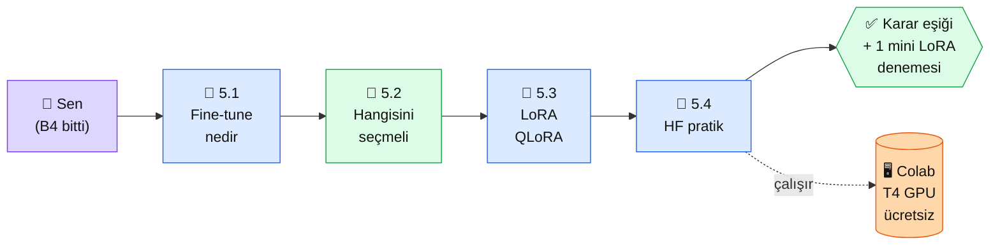

# Bölüm 5 — RAG vs Fine-tuning

**Persona:** Bölüm 4'te RAG çalıştırdı, "bu yetmez, modeli kendime göre eğitsem?" sorusu kafasında. Veya aksi — "RAG çok iş, fine-tune daha temiz olmaz mı?" · **Süre:** ~3 saat (4 sayfa, kısmen teorik) · **Önkoşul:** Bölüm 4 bitti, çalışan RAG elinde · **Çıktı:** Bir proje geldiğinde RAG/Fine-tune/Hibrit arasında **gerekçeli karar** verebilecek eşik, ve Hugging Face üzerinde mini LoRA denemesi

## Neden bu bölüm?

Fine-tune piyasada "havalı" görünür — "kendi modelimi eğittim" cümlesi ağır basar. Ama gerçekte **%90 projede fine-tune gereksiz,** RAG yeter. Bu bölüm tam olarak bu %10 ile %90'ın arasındaki hattı çizer.

Niye 4 sayfa? Çünkü fine-tune bir kez karıştırılır yanlış yola saparsın: $500+ maliyet, haftalarca iş, sonunda RAG'le aynı sonuç. Önceden karar doğrusu önemli.

Üçüncüsü: Fine-tune "modern" değil artık. 2024-2025'te **LoRA / QLoRA** teknikleri çıktı — tam fine-tune yerine modelin küçük bir kısmını eğitmek. Bu bölüm o tekniği de tanıtır.

## Bölüm 5 kısaca

**5.1 — Fine-tuning Nedir.** Tam fine-tune (tüm parametre, pahalı), LoRA (adapter layer, küçük), QLoRA (quantized, tüketici GPU'da). Fine-tune vs prompt engineering vs RAG ekseni.

**5.2 — Hangisini Seçmeli.** **Karar ağacı.** "Modelin davranışını mı değiştirmek istiyorsun (ton, stil, format) → fine-tune. Yeni bilgi mi eklemek → RAG. Çok spesifik domain (tıbbi, hukuki) + davranış değiştirme → hibrit." Somut 5 proje senaryosu üzerinde uygulama.

**5.3 — LoRA ve QLoRA.** LoRA matematiği sezgisel (matris ayrıştırma). QLoRA'nın 4-bit quantization ile 24GB GPU'da 70B model fine-tune edebildiği iddia. Pratikte hangi GPU için hangisi.

**5.4 — Hugging Face ile Pratik.** Küçük bir model (Qwen 1.5B) üzerinde 50 örnekli LoRA fine-tune. Colab T4 GPU (ücretsiz) yeter. Kendi küçük "tonu değişmiş" model üretimi. Deneyim için; production için değil.

## Bu bölümün yol haritası

### Aktör tablosu

| Düğüm | Nerede | Ne iş yapıyor |
|---|---|---|
| 👤 **Sen** | Platform + Google Colab | 5.1-5.3 oku, 5.4 Colab'de çalıştır |
| 📄 **5.1 Fine-tune nedir** | Platform | Tam FT vs LoRA vs QLoRA tanımları |
| 🏁 **5.2 Karar ağacı** | Platform (en kritik) | 5 senaryo + karar tablosu |
| 📄 **5.3 LoRA/QLoRA** | Platform | Matematik sezgisi (yine formül yok) |
| 📄 **5.4 HF pratik** | Colab + T4 GPU | Qwen 1.5B üstünde 50 örnek LoRA, 20 dk eğitim |
| 🖥 **Google Colab** | Tarayıcı | Ücretsiz T4 GPU, 12 saat oturum limiti |
| ✅ **Çıktı** | Repo'nda karar notu + Colab linki | "Ben bu projede şunu seçerim çünkü..." yazılı |

## Bu bölüm bittiğinde elinde ne olacak

- **Karar ağacı:** RAG mi, Fine-tune mi, hibrit mi — 10 saniyede kararı veren eşik
- **Maliyet farkındalığı:** Tam FT ($500+), LoRA ($20), QLoRA ($5) — rakamlı karşılaştırma
- **1 mini LoRA denemesi:** Qwen 1.5B'yi kendi tonunla eğitmiş olmanın deneyimi. "Fine-tune efsanevi değilmiş" hissi
- **Hugging Face + Colab refleksi:** Sonraki ML denemeleri için hazır ortam

📖 Anthropic bu bölümde ne der — öz

**Anthropic'in fine-tune'a bakışı belirgin şekilde temkinli.** Şöyle özetlenebilir:

**1. "Prompt engineering + RAG önce."** Anthropic dokümanları ilk başlık olarak prompt + RAG önerir. Fine-tune "son çare" olarak konumlandırılır. Bizim bölümün ana hattı bu görüşü yansıtır: önce RAG dene, yetmezse LoRA.

**2. Claude için fine-tune kısıtlı.** Claude doğrudan fine-tune'a açık değil. Bedrock üzerinden Anthropic Custom Model Import sınırlı biçimde sunulur (enterprise-only). Yani "Claude'u fine-tune edeyim" çoğunlukla mümkün değil — **Claude prompt ile şekillenir, RAG ile besleniyor, fine-tune başka modellerde** (Qwen, Llama, Mistral).

**3. Claude Code'un yaklaşımı.** Anthropic'in kendi kod asistanı Claude Code hiç fine-tune kullanmıyor — sistem prompt + tool use + MCP ile çözüyor. Bu bölümün "%90 projede FT gereksiz" tezi Anthropic'in kendi ürün disiplininin yansıması.

**Kaynak:** [docs.claude.com — Prompt Engineering Overview](https://docs.claude.com/en/docs/prompt-engineering/overview) (İngilizce, ~10 dk). Fine-tune konusundaki Anthropic duruşunu docs'ta açık okuyabilirsin — "before considering fine-tuning" paragrafı 5.2 karar ağacımızla uyumlu.

---

**Bir sonraki adım →** [5.1 Fine-tuning Nedir](01-finetune-nedir.md) (30 dk, FT/LoRA/QLoRA tanımları)

← [Bölüm 4 — RAG](../bolum-4/index.md) &nbsp;|&nbsp; [Ana Sayfa](../index.md)

