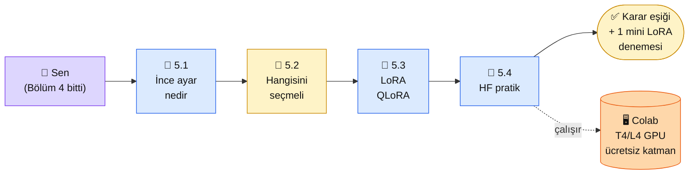

# Bölüm 5 — RAG vs Fine-tuning

👤 <strong>Kim için:</strong> Bölüm 4'te RAG çalıştırdın. "Bu yetmez, modeli kendime göre eğitsem mi?" diye sorduğun nokta. Ya da tam tersi: "RAG çok iş, ince ayar (fine-tuning) daha temiz olmaz mı?"

⏱️ <strong>Süre:</strong> ~2.5-3 saat (4 sayfa; 5.4'te Colab eğitimi ek 30 dk)

📋 <strong>Önkoşul:</strong> Bölüm 4 bitti, çalışan bir RAG sistemin var

🎯 <strong>Çıktı:</strong> Bir proje geldiğinde RAG / ince ayar / hibrit arasında **gerekçeli karar** verebilecek eşik, ve Hugging Face üzerinde mini LoRA denemesi

## Neden bu bölüm?

İnce ayar (fine-tuning) piyasada caziptir — "kendi modelimi eğittim" cümlesi ağır basar. Pratikte ise **çoğu projede ince ayar yerine RAG + iyi sistem promptu yeterli oluyor**. Anthropic, OpenAI ve HuggingFace dokümanları aynı sırayı tavsiye eder: önce prompt → sonra RAG → en son ince ayar. Bu bölüm o sıranın gerekçesini ve istisnalarını gösterir.

Niye 4 sayfa? Çünkü ince ayar bir kez yanlış yola saparsan $200-500 maliyet, 1-2 hafta iş, sonunda RAG'le aynı sonuç çıkar. Karar baştan doğru olsun diye önemli.

Üçüncüsü: 2024'ten itibaren tam ince ayar yerini büyük ölçüde **LoRA / QLoRA** tekniklerine bıraktı — modelin tüm ağırlıklarını eğitmek yerine küçük bir adaptör katmanı eğitiyorsun. 2026'da ucuz tüketici GPU'larında (RTX 4090 / 5090) bile 8B modelleri ince ayar etmek mümkün. Bu bölüm o ekonomiyi de açar.

## Bölüm 5 kısaca

**5.1 — İnce Ayar Nedir.** Tam ince ayar (tüm parametre, pahalı), LoRA (adaptör katman, küçük), QLoRA (4-bit küçültme + LoRA, tüketici GPU'da). DPO (Direct Preference Optimization) ile RLHF arasındaki yeni denge — 2025'te DPO, RLHF'ye kıyasla %70 daha az hesaplama maliyeti gerektiriyor ve eşdeğer hizalama veriyor. İnce ayar ile yönerge mühendisliği ve RAG arasındaki rol ayrımı.

**5.2 — Hangisini Seçmeli.** **Karar ağacı.** "Modelin davranışını mı değiştirmek istiyorsun (ton, stil, biçim) → ince ayar. Yeni bilgi mi eklemek → RAG. Çok özelleşmiş alan (tıbbi, hukuki) + davranış değiştirme → hibrit." Somut 5 proje senaryosu + 2026 maliyet karşılaştırma tablosu (RAG aylık $5-50 vs LoRA tek seferlik $10-30).

**5.3 — LoRA ve QLoRA.** LoRA matematiği sezgisel (kerteli matris ayrıştırma — low-rank decomposition). QLoRA'nın 4-bit NF4 niceleme (NormalFloat4 quantization) + LoRA ile 24 GB GPU'da 70B model eğitebilmesi ve sınırları. Pratikte hangi GPU için hangisi (RTX 4090 24 GB / 5090 32 GB / A100 80 GB / H100 80 GB / H200 141 GB). 2025'te eklenen **Unsloth** kütüphanesi LoRA eğitimini 2-5× hızlandırıyor — `unsloth` paketi Colab T4'te bile kullanılabilir.

**5.4 — Hugging Face ile Pratik.** Küçük bir model (Qwen3-1.7B veya Llama 3.2 1B Instruct) üzerinde 50 örnekli LoRA ince ayarı. Colab ücretsiz katmanı (T4 16 GB veya L4 22.5 GB, günlük yaklaşık 4-6 saat işlem birimi kotası) ya da yerelde 12 GB+ VRAM yeter. Kendi küçük "tonu değişmiş" modelinin üretimi. Deneyim için; üretim için değil.

## Bu bölümün yol haritası

### Aktör tablosu

| Düğüm | Nerede | Ne iş yapıyor |
|---|---|---|
| 👤 **Sen** | Platform + Google Colab | 5.1-5.3 oku, 5.4 Colab'de çalıştır |
| 📄 **5.1 İnce ayar nedir** | Platform | Tam ince ayar ile LoRA ve QLoRA tanımları |
| 🏁 **5.2 Karar ağacı** | Platform (en kritik) | 5 senaryo + karar tablosu |
| 📄 **5.3 LoRA/QLoRA** | Platform | Matematik sezgisi (yine formül yok) |
| 📄 **5.4 HF pratik** | Colab + T4/L4 GPU | Qwen 3-1.7B üstünde 50 örnek LoRA, ~20-30 dk eğitim |
| 🖥 **Google Colab** | Tarayıcı | Ücretsiz katman (2024 sonu kısıtlandı) — günlük kullanım kotası ve 12 saat oturum sınırı; sürekli kullanım için Colab Pro ($10/ay) öneriliyor |
| ✅ **Çıktı** | Reponda karar notu + Colab linki | "Ben bu projede şunu seçerim, çünkü..." yazılı |

## Bu bölüm bittiğinde elinde ne olacak

- **Karar ağacı:** RAG mı, ince ayar mı, hibrit mi — 10 saniyede kararı veren eşik
- **Maliyet farkındalığı:** Tam ince ayar (8B model) $200-500, LoRA $10-30, QLoRA $3-10, Unsloth + QLoRA $1-5 — 2026 bulut GPU fiyatlarına (RunPod, Vast.ai, Lambda Labs) göre sayısal karşılaştırma (5.3'te ayrıntı)
- **1 mini LoRA denemesi:** Qwen3-1.7B'yi kendi tonunla eğitmiş olmanın deneyimi — "ince ayar efsanevi değilmiş, ama RAG'in yerini de tutmuyor" hissi
- **Hugging Face + Colab refleksi:** Sonraki ML denemeleri için hazır ortam; HF Hub'a model push etme + Hugging Face Spaces'e demo dağıtma alışkanlığı

📖 Anthropic bu bölümde ne der — öz

**Anthropic'in ince ayara bakışı belirgin şekilde temkinli.** Şöyle özetlenebilir:

**1. "Prompt mühendisliği + RAG önce."** Anthropic dokümanları ilk başlık olarak prompt + RAG önerir. İnce ayar "son çare" olarak konumlandırılır — *"Before considering fine-tuning, exhaust prompt engineering and RAG."* Bu bölümün ana hattı bu görüşü yansıtır: önce RAG dene, yetmezse LoRA.

**2. Claude için ince ayar kısıtlı.** Claude'un ağırlıkları halka açık değil; doğrudan ince ayara açık değil. AWS Bedrock üzerindeki "Custom Model Import" özelliği sadece açık ağırlıklı modeller (Llama, Mistral, DeepSeek) içindir; **Claude buna dahil değildir**. Yani "Claude'u ince ayar edeyim" mümkün değil — **Claude prompt ile şekillenir, RAG ile beslenir, ince ayar başka modellerde** (Qwen, Llama, Mistral) yapılır.

**3. Claude Code'un yaklaşımı.** Anthropic'in kendi kod asistanı Claude Code hiç ince ayar kullanmıyor — sistem promptu + tool use + MCP ile çözüyor. Bu bölümün "ince ayar çoğu projede gereksiz" tezi Anthropic'in kendi ürün disiplininin yansıması.

**Kaynak:** [platform.claude.com — Prompt Engineering Best Practices](https://platform.claude.com/docs/en/build-with-claude/prompt-engineering/claude-prompting-best-practices) (İngilizce, ~15 dk). Fine-tune konusundaki Anthropic duruşunu doc'ta açıkça okuyabilirsin — "before considering fine-tuning" paragrafı 5.2 karar ağacımızla uyumlu.

---

**Bir sonraki adım →** [5.1 Fine-tuning Nedir](01-finetune-nedir.md) (30 dk, FT/LoRA/QLoRA tanımları)

← [Bölüm 4 — RAG](../bolum-4/index.md) &nbsp;|&nbsp; [Ana Sayfa](../index.md)

