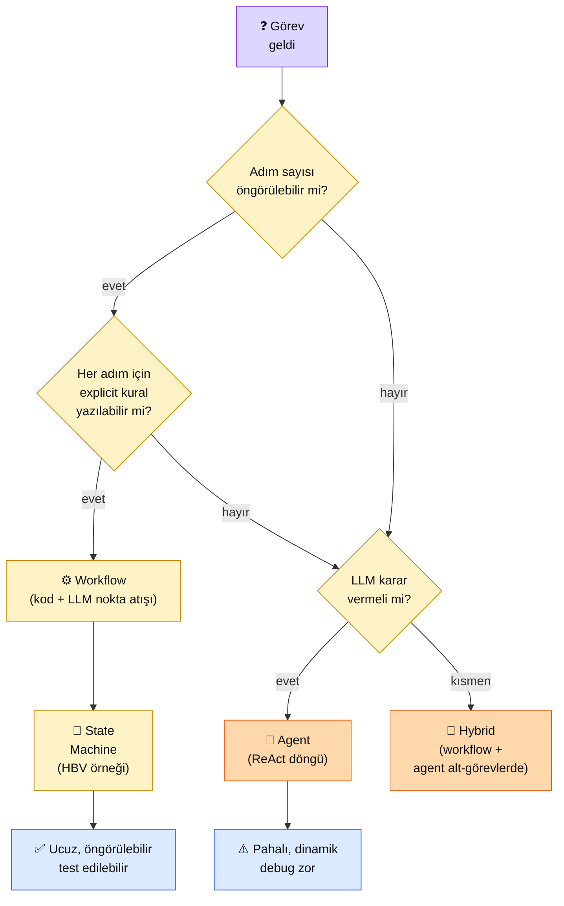

# 6.1 Ajan (Agent) Nedir, ReAct Deseni

<div class="ma-meta" markdown>
<div class="ma-meta-row" markdown>
<strong>Kim için:</strong>
<span class="ma-persona ma-persona-baslangic">🟢 başlangıç</span>
<span class="ma-persona ma-persona-is">🔵 iş</span>
<span class="ma-persona ma-persona-kisisel">🟣 kişisel</span>
</div>
<div class="ma-meta-row"><strong>⏱️ Süre:</strong> ~30 dakika</div>
<div class="ma-meta-row"><strong>📋 Önkoşul:</strong> Bölüm 2 bitmiş (sistem promptu + few-shot + prompt caching); Bölüm 4 bitmiş (retrieve + generate ayrımı net)</div>
<div class="ma-meta-row"><strong>🎯 Çıktı:</strong> **İş akışı (workflow)** ile **ajan (agent)** farkını bir paragrafta anlatabilirsin; ReAct döngüsünü (Think → Act → Observe → Loop) kendi kodunla yazarsın; **"bu projede ajan gerekli mi?"** sorusuna 5 kriterle cevap verebilirsin — **çoğu durumda "hayır" doğru cevap**.</div>
</div>

!!! tip "Yabancı kelime mi gördün?"
    Bu sayfadaki **kalın** teknik terimler (workflow / iş akışı, agent / ajan, ReAct, autonomy / özerklik gibi) ilk geçişte hemen yanında veya altında Türkçe açıklanır.

## Neden bu sayfa?

2024-2026 AI dünyasında "ajan (agent)" kelimesi **her yerde** — LinkedIn'deki her üçüncü gönderi "AI agent built", her girişim sunumunda "multi-agent architecture". Ama sektörün **en büyük sırrı**: bu projelerin çoğu aslında **ajan değil**, sıradan bir iş akışıdır (workflow). Daha kötüsü: çoğu proje için ajan **gereksiz pahalı ve kırılgan** bir çözüm.

İkincisi: Anthropic Aralık 2024'te [Building Effective Agents](https://www.anthropic.com/research/building-effective-agents) makalesini yayınladı. Tek cümlelik mesajı: **"Önce iş akışı dene, ajan son çare."** Bu makaleye kadar sektör dogmatikti: "ajan iyidir, daha çok ajan daha iyidir." Anthropic denklemi çevirdi. Bu bölüm o yeni denklem üzerine kurulu.

Üçüncüsü: **HBV bağış chatbot'u ajan değildir** — deterministik bir durum makinesi (state machine — 4.8'de gördük). 135 bağışçı, canlıda çalışıyor, ajansız. Buna rağmen başarılı. Bu sayfa, "ajan mı lazım yoksa durum makinesi mi" sorusunun cevabını vermeyi öğretir. Yanlış cevap = ya 10 kat pahalı sistem ya da kırılgan servis.

## İş akışı (Workflow) ile Ajan (Agent) farkı — üç paragraf, matematiksiz

**İş akışı = kod tabanlı, deterministik akış.** Sen geliştirici olarak her adımı **önceden** tanımladın: "bu durum oluşursa şu LLM çağrısı, o çıktı gelirse şu araç, aksi halde şu hata." Kod `if/else` ile akar, LLM sadece **nokta atışı** işler yapar (sınıflandırma, özetleme, çeviri). Karar mercii = **sen**, kodun. **HBV chatbot bu kategoride.**

**Ajan = LLM'in kendisi karar veriyor.** Görevi veriyorsun ("bu müşterinin siparişini araştır, sorun varsa çöz"), LLM'e bir dizi **araç (tool)** (arama, veritabanı sorgusu, e-posta gönderme) ve bir hedef veriyorsun. LLM her adımda "şimdi hangi aracı çağırayım?" kararını **kendi** veriyor. Adım sayısı önceden bilinmiyor, iş akışı dinamik. Karar mercii = **LLM**.

**Seçim kuralı: İş akışı varsayılan, ajan son çare.** 2026 gerçeği şu: ekosistem "ajan" kelimesini abartıyor. Gerçek üretimde iş akışı **daha ucuz** (adım sayısı sabit, token patlaması yok), **daha öngörülebilir** (test edilebilir, hata ayıklama kolay), **daha güvenli** (LLM yanlış kararlar almıyor). Ajana **sadece** dinamik görevlerde geçilir — adım sayısı önceden bilinmiyor, LLM'in gerçek akıl yürütmesi gerekiyor, insan denetimi var.

## Bu sayfanın ekosistemi — kim kime ne veriyor

<div class="ma-ekosistem" markdown>
<div class="ma-ekosistem-header">🗺️ Ekosistem — workflow'tan agent'a geçiş kriterleri</div>



<table class="ma-aktorler" markdown>

| Düğüm | Anthropic terminolojisi | Örnek |
|---|---|---|
| ⚙️ **İş akışı (Workflow)** | "Prompt chaining" + "Routing" | Müşteri mesajı gelince → sınıflandır → ilgili şablonla cevapla |
| 🔄 **Durum makinesi (State Machine)** | İş akışının durum-tutan hali | HBV: miktar → niyet → onay → ödeme (4.8) |
| 🤖 **Ajan (Agent)** | "Autonomous agent" | Claude Desktop'tan "toplantı notlarını özetle, e-posta at" → LLM: oku → özetle → e-posta aracı → gönder |
| 🔀 **Hibrit** | "Orchestrator + subagents" | Ana akış iş akışı; bir adımda LLM birkaç alt-aracı kendi seçiyor |

</table>
</div>

## ReAct döngüsü — LLM'in "düşün-yap-gözle" ritmi

ReAct (Yao ve ark., 2022) = **Reason + Act** (Akıl Yürüt + Eyle). Her adımda LLM üç şeyi yapar:

1. **Think (düşün):** "Bu görevi tamamlamak için şimdi ne yapmam gerek?"
2. **Act (yap):** Bir araç çağırır (arama, hesaplama, API çağrısı)
3. **Observe (gözle):** Aracın sonucunu okur, hedefe ulaşıldı mı kontrol eder

Döngü: hedefe ulaşılmadıysa tekrar Think adımına döner, ulaşıldıysa final cevap döner.

```
Görev: "İstanbul'da yarın yağmur var mı? Varsa bana uygun iç mekan aktivite öner."

[Think] Hava durumunu sorgulamam lazım.
[Act]   hava_durumu(sehir="Istanbul", tarih="yarin")
[Observe] {"yagmur": true, "sicaklik": 12}

[Think] Yağmurlu, iç mekan aktivite aramalıyım.
[Act]   aktivite_ara(sehir="Istanbul", tip="ic_mekan")
[Observe] ["Arkeoloji Müzesi", "Pera Müzesi", "Sakıp Sabancı..."]

[Think] Kullanıcıya sonucu sunayım.
[Final] "İstanbul'da yarın yağmur bekleniyor (12°C). Şu iç mekan aktiviteleri önerebilirim: ..."
```

**Burada önemli nokta:** LLM **hangi** aracı, **hangi** argümanlarla, **kaç** adımda çağıracağına kendisi karar verdi. Sen sadece araçları tanıttın + hedef belirledin. Bu özerklik (autonomy) = ajanın tanımı.

## Uygulama — iki yol

### Yol A — 40 satırlık basit ReAct agent (Anthropic SDK native)

```bash
pip install anthropic
```

`agent_basit.py`:

```python
import anthropic
import json

client = anthropic.Anthropic()

# 1. Tool tanımları — Anthropic format
tools = [
    {
        "name": "hava_durumu",
        "description": "Bir şehrin belirli günde hava durumunu döndürür",
        "input_schema": {
            "type": "object",
            "properties": {
                "sehir": {"type": "string"},
                "tarih": {"type": "string", "description": "bugun|yarin|YYYY-MM-DD"},
            },
            "required": ["sehir", "tarih"],
        },
    },
    {
        "name": "aktivite_ara",
        "description": "Bir şehirde belirli tipte aktiviteleri listeler",
        "input_schema": {
            "type": "object",
            "properties": {
                "sehir": {"type": "string"},
                "tip": {"type": "string", "enum": ["ic_mekan", "dis_mekan", "yemek"]},
            },
            "required": ["sehir", "tip"],
        },
    },
]

# 2. Tool'ların gerçek implementasyonu (mock)
def tool_calistir(name, args):
    if name == "hava_durumu":
        return {"yagmur": True, "sicaklik": 12}
    if name == "aktivite_ara":
        return ["Arkeoloji Müzesi", "Pera Müzesi", "Sakıp Sabancı Müzesi"]
    return {"hata": "bilinmeyen tool"}

# 3. ReAct döngü
messages = [{"role": "user", "content": "İstanbul'da yarın yağmur var mı? Varsa iç mekan aktivite öner."}]

for adim in range(10):  # Güvenlik kapağı — max 10 döngü
    cevap = client.messages.create(
        model="claude-sonnet-4-6",
        max_tokens=1024,
        tools=tools,
        messages=messages,
    )

    # Claude tool çağırmak istiyor mu?
    if cevap.stop_reason == "tool_use":
        messages.append({"role": "assistant", "content": cevap.content})
        tool_sonuclari = []
        for block in cevap.content:
            if block.type == "tool_use":
                sonuc = tool_calistir(block.name, block.input)
                print(f"  [Act] {block.name}({block.input}) → {sonuc}")
                tool_sonuclari.append({
                    "type": "tool_result",
                    "tool_use_id": block.id,
                    "content": json.dumps(sonuc, ensure_ascii=False),
                })
        messages.append({"role": "user", "content": tool_sonuclari})
        continue

    # Final cevap
    if cevap.stop_reason == "end_turn":
        print("\n[Final]", cevap.content[0].text)
        break
```

**Beklenen çıktı:**

```
  [Act] hava_durumu({'sehir': 'Istanbul', 'tarih': 'yarin'}) → {'yagmur': True, 'sicaklik': 12}
  [Act] aktivite_ara({'sehir': 'Istanbul', 'tip': 'ic_mekan'}) → ['Arkeoloji Müzesi', 'Pera Müzesi', 'Sakıp Sabancı Müzesi']

[Final] İstanbul'da yarın yağmur bekleniyor (12°C civarı). Yağmurlu hava için şu iç mekan aktiviteleri önerebilirim:

- Arkeoloji Müzesi
- Pera Müzesi
- Sakıp Sabancı Müzesi

Müzeler hem sıcak hem kültürel değer katar — yağmurlu bir gün için ideal!
```

**Burada olan nedir (diyagram referansı):** LLM 2 tool'u **kendisi** çağırdı, sıralamayı **kendisi** belirledi, durma noktasını **kendisi** kararlaştırdı (`end_turn`). `max_tokens`, `max iterations` güvenlik kapakları hariç kodun kalanı 40 satır — **agent = loop + tools.**

### Yol B — Aynı görev, workflow olarak (agent değil)

```python
# 1. Hava durumunu çek
hava = hava_durumu_al("Istanbul", "yarin")

# 2. Yağmur varsa aktivite çek
if hava["yagmur"]:
    aktiviteler = aktivite_ara("Istanbul", "ic_mekan")
    # 3. LLM sadece cevap formatlama için — karar değil
    cevap = claude_ozet_yaz(hava, aktiviteler)
else:
    cevap = "Yarın yağmur beklenmiyor, dış mekan aktivitelere bakalım..."

print(cevap)
```

**Farklar:**

| Kriter | Ajan (Yol A) | İş akışı (Yol B) |
|---|---|---|
| **Kod satırı** | 40 | 12 |
| **Maliyet (1 görev)** | ~3 LLM çağrısı (~$0.01) | ~1 LLM çağrısı (~$0.003) |
| **Hız** | ~6 saniye | ~2 saniye |
| **Öngörülebilirlik** | Orta (LLM farklı araç sırası deneyebilir) | Yüksek (adımlar sabit) |
| **Yeni durum (örn: sis)** | LLM kendisi uyarlanır | Kodu güncellemek gerek |
| **Hata ayıklama** | İzleme (trace) gerekir (araç çağrı sırası değişebilir) | `print` ifadesi yeter |

**CTO tavsiyesi:** Bu görev için **iş akışı daha iyi** — 3 kat ucuz, 3 kat hızlı, deterministik. Ajana geçmek için iş gerçekten dinamik olmalı (örn: kullanıcı "İstanbul'da hafta sonum için plan yap, hava durumuna göre 5 aktivite öner, otelden uzaklığı da kontrol et" derse — adım sayısı bilinmiyor, LLM karar vermeli).

### "Bu projede ajan gerekli mi?" — 5 kriter kontrol listesi

| # | Soru | Evet = ajan lehine | Hayır = iş akışı yeter |
|---|---|---|---|
| 1 | Adım sayısı önceden bilinmiyor mu? | Ajan | İş akışı |
| 2 | LLM'in **kendi** karar vermesi gerekli mi (yoksa kural yeter mi)? | Ajan | İş akışı |
| 3 | Kullanıcı "görev tamamlansın" diyor, detayları umurunda değil mi? | Ajan | İş akışı |
| 4 | Her adım maliyeti kaldırılabilir mi (ajan çok LLM çağrısı demek)? | Ajan | İş akışı |
| 5 | Üretimde başarısız olsa kabul edilebilir mi (ajan kırılgan)? | Ajan (örn. iç kullanım) | İş akışı (müşteriye dokunan) |

**3+ "Ajan" = ajan düşün. 3+ "İş akışı" = iş akışı kal.**

HBV için cevap: İş akışı (5/5). Claude Desktop'tan "toplantı notlarımı özetle, aksiyonları e-posta at" için: Ajan (4/5).

??? warning "Tipik tool use / ReAct hataları — şu durum şu çözüm"

    | Hata | Sebep | Çözüm |
    |---|---|---|
    | Sonsuz döngü (tool1 → tool2 → tool1...) | LLM aynı tool'u tekrar tekrar çağırıyor | `max_iterations=10` üst sınırı + son 3 çağrı aynı tool ise döngüyü kır |
    | `Token limit reached` | Geçmiş ReAct mesajları context'i şişiriyor | Eski adımları özetle (özetleme adımı), max 10 turla sınırla |
    | Tool zaman aşımı (timeout) | Yavaş dış API | `try/except httpx.TimeoutException` + LLM'e `is_error=True` ile dön |
    | LLM yanlış argüman gönderiyor | JSON şema eksik veya ucuz örnek yok | `input_schema`'da `required` alanları net, description'da örnek 2-3 cümle |
    | Maliyet patlaması (saatte $50+) | Adım sayısı veya tool çağrısı çok | Bütçe üst sınırı (cost cap) + uyarı; `max_iterations` düşür |
    | "tool_use" stop_reason ama content boş | API geçici hatası veya `disable_parallel_tool_use` çakışması | Bir kez yeniden dene; `messages` listesini doğrula |

<div class="ma-anthropic-oz" markdown>
<div class="ma-anthropic-oz-header">📖 Anthropic bu konuyu nasıl anlatıyor — öz</div>

Anthropic Aralık 2024'te [Building Effective Agents](https://www.anthropic.com/research/building-effective-agents) makalesini yayınladı — bu bölümün **pusula belgesi**. Özet iddiası: "Çoğu proje için sade workflow'lar agent'lardan üstündür."

**1. "Agent" kavramını iki kategoriye ayırdı.**
- **Workflow** — "LLM'ler ve tool'lar önceden tanımlı kod yollarıyla orchestrate edilir." Deterministik.
- **Agent** — "LLM'ler kendi süreçlerini ve tool kullanımlarını dinamik olarak yönetir." Otonom.

**2. Beş workflow pattern'i tanıttı** (hepsi agent değil):
- Prompt chaining (iki LLM çağrısı ardışık)
- Routing (girdi → doğru LLM/prompt)
- Parallelization (aynı görev paralel LLM + oylama)
- Orchestrator-workers (tek LLM alt-görevleri dağıtıyor)
- Evaluator-optimizer (bir LLM yazıyor, bir LLM değerlendiriyor, iyileştiriyor)

**3. "Agent ne zaman?" net cevap.** Açık uçlu görev + adım sayısı bilinmiyor + LLM'in **çoklu adımda akıl yürütmesi** gerekli. Örnekler: açık kaynak kod editörü asistanı (Claude Code), araştırma asistanı (internet + kaynak sentezleme), kod incelemesi.

**4. ReAct bir "agent pattern'i" değil, agent'ın temel ritmi.** LLM her tool çağrısından sonra observe edip karar veriyor — bu **zorunlu**, varyantlar üstüne.

??? info "Teknik detay — isteyene (parameter adları, mekanikler, edge case'ler)"

    **`stop_reason` değerleri.** `end_turn` (LLM görev bitti dedi), `tool_use` (LLM tool çağırmak istiyor), `max_tokens` (context doldu — güvenlik!), `stop_sequence` (sen kural koydun). ReAct loop'un while condition'ı bu değere bakar.

    **Infinite loop riski.** LLM bazı görevlerde "tool1 → tool2 → tool1 → tool2" sonsuz döngüye girebilir. Çözüm: `max_iterations` sabit kapağı + aynı tool'u art arda 3x çağırırsa abort.

    **Parallel tool calling.** Claude bir adımda **birden fazla** tool çağırabilir (Anthropic API'de `disable_parallel_tool_use=False` default). ReAct sadeliği için sequential başla, prod'da parallel aç.

    **Tool hata yönetimi.** Tool fırlattığı exception'u `content` alanında Claude'a geri ilet: `{"type":"tool_result","content":"HATA: API 503","is_error":true}`. LLM kendi kendine retry veya fallback yapar.

    **Context budget.** Her ReAct turu mesaj geçmişine ekleniyor — 20 adım sonra context şişer. Çözüm: `max_iterations=10` + özetleme adımı (önceki adımları özetle, geçmişi sıfırla).

    **Human-in-the-loop.** Kritik adımlardan önce "onay iste" tool'u ekle — LLM bu tool'u çağırınca insan cevaplayana kadar bekle. Prod ortamda şart (mali işlem, email gönderme vb.)

    **Observability.** Her tool çağrısını (timestamp, input, output, latency, error) log'la. LangSmith, Langfuse, veya kendi DB — agent debug'ı bunsuz imkansız.

<div class="ma-anthropic-oz-kaynak" markdown>
**Kaynak:** [Anthropic — Building Effective Agents](https://www.anthropic.com/research/building-effective-agents) (EN, 20 dk okuma, bu bölümün **pusula belgesi**). Her alt sayfa bu makalenin bir fragmanı. Pekiştirme: [Anthropic Cookbook — agents examples](https://github.com/anthropics/claude-cookbooks/tree/main/patterns/agents) — 5 workflow + 1 agent pattern'inin tam kod örnekleri.
</div>
</div>

<div class="ma-cikti-kaniti" markdown>
### 📦 Bu sayfayı bitirdiğini nasıl kanıtlarsın

#### 1. 📝 Refleksiyon yazısı — 5 dakika

> "Workflow vs Agent farkı: [kendi cümlenle]. Yol A (agent) çalıştırdım, LLM [X] tool çağırdı, maliyet [~Y token]. Yol B (workflow) aynı görev için [Z] token sürdü. Farkın oranı [A:B]. Kendi projemde ([hangi proje]) hangisini seçeceğim: [X], çünkü 5 kriterden [N]'i workflow lehine."

Kaydet: `muhendisal-notlarim/bolum-6/01-agent-nedir/refleksiyon.txt`

#### 2. 📸 Ekran görüntüsü — 3 dakika

**Neyin görüntüsü:** `agent_basit.py` çalışırken konsol — `[Act]` satırları + `[Final]` cevap görünür.

Kaydet: `muhendisal-notlarim/bolum-6/01-agent-nedir/react-cikti.png`

#### 3. 💻 GitHub + 2 karar dokümanı — 15 dakika

`agent-vs-workflow/` repo: `agent.py` + `workflow.py` + `README.md`. README'de:
- Ölçümlü karşılaştırma tablosu (token, süre, maliyet — her ikisi 10 çalıştırma ortalaması)
- **Kendi projenin 5-kriter analizi** — hangi projende agent, hangisinde workflow, neden

Repo linkini kaydet: `muhendisal-notlarim/bolum-6/01-agent-nedir/repo-link.txt`

</div>

<div class="ma-neden-sonuc" markdown>
<div class="ma-neden-sonuc-header">🔗 Birlikte okuma — neden ne oldu</div>

<ol class="ma-neden-sonuc-zincir" markdown>
<li>'Agent' sektörde modaya döndü ama çoğu proje workflow'la yeter. Karıştırmak = gereksiz maliyet + kırılganlık. Bu yüzden **önce workflow mu agent mi? sorusunu sor.**</li>
<li>**B → C:** Anthropic Aralık 2024 makalesi bu karışıklığı temizledi — 5 workflow pattern + 1 agent kategorisi net ayrıldı. Bu yüzden **terminoloji karmaşası bitti.**</li>
<li>**C → D:** ReAct = agent'ın DNA'sı — Think/Act/Observe/Loop. 40 satır Python'da kurulabiliyor. Bu yüzden **mekanizme anlaşılınca korku azalır.**</li>
<li>**D → E:** Workflow vs agent seçimi 5-kriter ile netleşiyor; çoğu zaman 4+/5 workflow lehine çıkar (3 kat ucuz, öngörülebilir, debug kolay). Bu yüzden **varsayılan workflow olmalı.**</li>
<li>**E → F:** HBV deterministik workflow = doğru seçim (4.8'de kanıtlı, 100+ bağışçı canlıda). Claude Desktop'ta 'özet + email at' = agent doğru. Bu yüzden **bağlam seçimi belirler.**</li>
</ol>

<div class="ma-neden-sonuc-sonuc" markdown>
**Sonuç:** Bu sayfadan sonra "agent" kelimesini duyduğunda sorduğun ilk soru "bu gerçekten agent mı yoksa workflow mu?" oluyor. %70 ihtimalle workflow cevabı çıkıyor — 2026 AI mühendisliğinin en değerli refleksi. 6.2'de tool calling **mekaniği** çalışılacak, 6.3-6.4'te MCP ile tool'lara **platform** kazandıracağız.
</div>
</div>

<div class="ma-sonraki" markdown>
<div class="ma-sonraki-header">➡️ Sonraki adım</div>

**[6.2 Tool Calling →](02-tool-calling.md)** — Agent'ın "Act" adımının mekaniği. JSON schema ile tool tanımlama, Claude'un `tool_use` cevabını parse etme, sonucu geri yollama. Hava durumu + hesap makinesi örnekleri.

← [Bölüm 6 girişi](index.md) &nbsp;|&nbsp; [Ana sayfa](../index.md)

**Pekiştirme:** [Building Effective Agents](https://www.anthropic.com/research/building-effective-agents) makalesini **birebir oku** (20 dk). Kalan 7 alt sayfa bu makalenin uygulaması — asıl metni okumak yapı taşını sağlamlaştırır.
</div>
