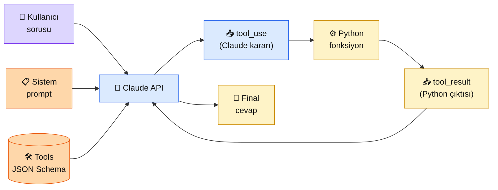

# 6.2 Tool Calling

<div class="ma-meta" markdown>
<div class="ma-meta-row" markdown>
<strong>Kim için:</strong>
<span class="ma-persona ma-persona-baslangic">🟢 başlangıç</span>
<span class="ma-persona ma-persona-is">🔵 iş</span>
<span class="ma-persona ma-persona-kisisel">🟣 kişisel</span>
</div>
<div class="ma-meta-row"><strong>⏱️ Süre:</strong> ~30 dakika</div>
<div class="ma-meta-row"><strong>📋 Önkoşul:</strong> 6.1 bitmiş — workflow/agent/ReAct ayrımı net; Anthropic SDK kurulu + `ANTHROPIC_API_KEY` env aktif</div>
<div class="ma-meta-row"><strong>🎯 Çıktı:</strong> Claude API'nin `tools` parametresini **JSON Schema** ile doğru tanımlarsın; `tool_use` cevabını parse eder, tool'u çalıştırır, sonucu `tool_result` ile geri yollarsın; **3 farklı tool** (hesap, hava, veritabanı) ile kendi mini-agent'ını canlıya geçersin.</div>
</div>

!!! tip "Yabancı kelime mi gördün?"
    Bu sayfadaki **italik-altı çizili** ifadelerin (schema, tool_use, tool_result, enum gibi) üstüne mouse'unu getir — kısa tanım çıkar. Mobilde dokun.

## Neden bu sayfa?

LLM kendi başına **iki şeyi** yapamaz: (1) Canlı veriye ulaşamaz (2026 fiyat, bugünkü hava, veritabanında son kayıt); (2) Gerçek dünyayı değiştiremez (email gönder, fatura oluştur, CRM'e kayıt). **Tool calling** bu iki eksiği kapatır — Claude'a "bu fonksiyonları çağırabilirsin" diyerek LLM'i dış dünyaya bağlarsın.

İkincisi: Tool calling = agent'ın **"Act"** adımının mekaniği (6.1). 6.1'de teoride gördün; bu sayfada **protokol detayları** — JSON schema nasıl yazılır, `tool_use` bloğu nasıl parse edilir, `tool_result` nasıl geri yollanır, hata durumları nasıl yönetilir. Her Anthropic API entegrasyonunun **fiili standart** iskeleti burası.

Üçüncüsü: Tool calling **iyi yazılmazsa** — şema muğlak, tanım eksik — Claude **yanlış tool** çağırır veya **yanlış argüman** geçer. Sektörde bu "agent halüsinasyonu" denir. %60 agent başarısızlığının kökü kötü tool tanımı. Bu sayfa o tuzağı nasıl geçersiniyi gösteriyor.

## Tool calling kısaca — üç paragraf, matematiksiz

**Tool calling = Claude'a "bu fonksiyon imzalarını biliyorsun, çağırabilirsin" demek.** Sen Python fonksiyonlarının **şemasını** (isim + açıklama + parametreler) JSON formatında Claude'a veriyorsun. Claude kullanıcı sorusunu okuyup "şu anda şu tool'u şu argümanlarla çağırmam gerek" kararı veriyor. Fonksiyonu **çalıştırmıyor** — sadece "çağır" diyor, çalıştırmak sen.

**İki adımlı protokol.** (1) Claude `tool_use` bloğu döner — "şu tool'u şu input ile çağır". (2) Sen Python'da çalıştırırsın, sonucu `tool_result` olarak geri yollarsın. Claude sonucu alır, ya final cevap üretir ya da **başka bir tool** daha çağırır. ReAct döngüsünün motoru bu protokol.

**JSON Schema = tool tanımının dili.** Her tool için: `name` (fonksiyon adı), `description` (Claude'un **hangi durumda çağıracağını anlamak için okuduğu** metin), `input_schema` (parametreler + tipler + zorunluluklar). **`description` = en kritik alan** — Claude buraya bakıp karar veriyor. Muğlak description = yanlış tool seçimi.

## Bu sayfanın ekosistemi — kim kime ne veriyor

<div class="ma-ekosistem" markdown>
<div class="ma-ekosistem-header">🗺️ Ekosistem — tool tanımından final cevaba</div>



<table class="ma-aktorler" markdown>

| Düğüm | Nerede | Ne iş yapıyor |
|---|---|---|
| 👤 **Kullanıcı sorusu** | `messages[0].content` | Dilsel istek ("5000 TL'nin %18 KDV'si kaç?") |
| 📋 **Sistem prompt** | `system="..."` | Claude'un davranış kuralları (2.4) |
| 🛠 **Tools JSON Schema** | `tools=[...]` | Tool kataloğu — ad/açıklama/parametre |
| 🤖 **Claude API** | `client.messages.create()` | Soruya bakıp hangi tool'u çağıracağını veya direkt cevap verip vermeyeceğini kararlaştırıyor |
| 📤 **tool_use bloğu** | `response.content[i].type == "tool_use"` | `{"name":"kdv_hesapla","input":{"tutar":5000}}` |
| ⚙️ **Python fonksiyon** | Senin kodun | Gerçek iş — hesaplama, API çağrısı, DB sorgusu |
| 📥 **tool_result bloğu** | `{"type":"tool_result","tool_use_id":...,"content":"..."}` | Python çıktısı Claude'a geri yollanıyor |
| 💬 **Final cevap** | `stop_reason == "end_turn"` | Claude kullanıcıya dönüyor |

</table>
</div>

## Uygulama — iki yol

### Yol A — Tek tool (KDV hesaplama) — en sade örnek

```python
import anthropic
import json

client = anthropic.Anthropic()

# 1. Tool tanımı
tools = [{
    "name": "kdv_hesapla",
    "description": (
        "Bir tutarın KDV'sini hesaplar. Kullanıcı 'KDV dahil/hariç', "
        "'%18', '%20', 'katma değer vergisi' gibi ifadeler kullandığında bu tool çağrılır. "
        "Claude'un kendi kendine hesaplaması yerine hassas aritmetik için tool kullanılmalıdır."
    ),
    "input_schema": {
        "type": "object",
        "properties": {
            "tutar": {
                "type": "number",
                "description": "KDV'si hesaplanacak ana tutar (TL)"
            },
            "oran": {
                "type": "number",
                "description": "KDV oranı yüzde olarak (örn: 18, 20, 10, 1)",
                "default": 20,
            },
        },
        "required": ["tutar"],
    },
}]

# 2. Python implementasyonu
def kdv_hesapla(tutar: float, oran: float = 20) -> dict:
    kdv = tutar * oran / 100
    return {
        "ana_tutar": tutar,
        "oran_yuzde": oran,
        "kdv_tutari": round(kdv, 2),
        "toplam": round(tutar + kdv, 2),
    }

# 3. ReAct döngü (6.1'deki iskelet)
messages = [{"role": "user", "content": "5000 TL'lik faturanın %18 KDV'si ve toplam tutarı nedir?"}]

for _ in range(5):
    resp = client.messages.create(
        model="claude-sonnet-4-6",
        max_tokens=1024,
        tools=tools,
        messages=messages,
    )

    if resp.stop_reason == "tool_use":
        messages.append({"role": "assistant", "content": resp.content})
        results = []
        for block in resp.content:
            if block.type == "tool_use":
                out = kdv_hesapla(**block.input)
                print(f"  [Act] kdv_hesapla({block.input}) → {out}")
                results.append({
                    "type": "tool_result",
                    "tool_use_id": block.id,
                    "content": json.dumps(out, ensure_ascii=False),
                })
        messages.append({"role": "user", "content": results})
        continue

    print("\n[Final]", resp.content[0].text)
    break
```

**Beklenen çıktı:**

```
  [Act] kdv_hesapla({'tutar': 5000, 'oran': 18}) → {'ana_tutar': 5000, 'oran_yuzde': 18, 'kdv_tutari': 900.0, 'toplam': 5900.0}

[Final] 5000 TL'lik faturanın detayları:

- Ana tutar: 5.000 TL
- KDV oranı: %18
- KDV tutarı: 900 TL
- Toplam tutar: 5.900 TL
```

**Burada olan nedir (diyagram referansı):** Claude **kendi başına hesap yapmadı** — `kdv_hesapla` tool'unu çağırdı. Neden? `description` alanına "Claude'un kendi kendine hesaplaması yerine hassas aritmetik için tool kullanılmalıdır" yazdım. Bu cümle olmadan Claude kendi kafasına hesap yapar (bazen yanlış), tool'u çağırmaz. **Description = tool seçiminin motoru.**

### Yol B — 3 tool + toolChoice kontrolü

Senaryo: Muhasebe asistanı — KDV, para birimi dönüşümü, bir de kur tablo sorgusu.

```python
tools = [
    {
        "name": "kdv_hesapla",
        "description": "KDV tutarı ve toplam hesaplar. Kullanıcı fatura/KDV/vergi hesap bahsederse çağrılır.",
        "input_schema": {
            "type": "object",
            "properties": {
                "tutar": {"type": "number"},
                "oran": {"type": "number", "default": 20},
            },
            "required": ["tutar"],
        },
    },
    {
        "name": "kur_cevir",
        "description": (
            "Bir para birimini başka para birimine çevirir. USD/EUR/TL/GBP/SAR destekli. "
            "Güncel TCMB kurları kullanılır. Kullanıcı 'çevir', 'kaç TL eder', 'kur' dediğinde çağrılır."
        ),
        "input_schema": {
            "type": "object",
            "properties": {
                "miktar": {"type": "number"},
                "kaynak": {"type": "string", "enum": ["USD", "EUR", "TL", "GBP", "SAR"]},
                "hedef": {"type": "string", "enum": ["USD", "EUR", "TL", "GBP", "SAR"]},
            },
            "required": ["miktar", "kaynak", "hedef"],
        },
    },
    {
        "name": "kur_tablosu",
        "description": (
            "Bugünkü TCMB kur tablosunu döndürür. Kullanıcı 'kurlar ne?', 'dolar kaç?' gibi "
            "genel sorguda çağrılır. Belirli bir çevirme için kur_cevir kullanılmalıdır."
        ),
        "input_schema": {"type": "object", "properties": {}},
    },
]

# Tool implementasyonları (mock)
def kur_cevir(miktar, kaynak, hedef):
    kurlar = {"USD": 34.5, "EUR": 37.2, "GBP": 44.0, "SAR": 9.2, "TL": 1.0}
    tl_miktar = miktar * kurlar[kaynak]
    hedef_miktar = tl_miktar / kurlar[hedef]
    return {"miktar": round(hedef_miktar, 2), "kur": round(kurlar[kaynak]/kurlar[hedef], 4)}

def kur_tablosu():
    return {"USD/TL": 34.5, "EUR/TL": 37.2, "GBP/TL": 44.0, "SAR/TL": 9.2, "tarih": "2026-04-22"}
```

**`tool_choice` parametresi ile Claude'un davranışını kontrol et:**

```python
# 1. 'auto' (default) — Claude kendisi karar verir tool çağırıp çağırmayacağına
resp = client.messages.create(
    model="claude-sonnet-4-6", max_tokens=1024,
    tools=tools,
    tool_choice={"type": "auto"},
    messages=[{"role": "user", "content": "Merhaba, nasılsın?"}],
)
# Sonuç: Claude tool çağırmaz, direkt "Merhaba, iyiyim!" der

# 2. 'any' — Claude MUTLAKA bir tool çağırır (hangisi onun kararı)
resp = client.messages.create(
    ..., tool_choice={"type": "any"},
    messages=[{"role": "user", "content": "Bana bir hesap yap"}],
)
# Sonuç: Claude 3 tool'dan uygun olanı çağırır (muhtemelen kdv_hesapla eksik params ile bile olsa)

# 3. 'tool' + spesifik isim — Claude bu tool'u çağırmak ZORUNDA
resp = client.messages.create(
    ..., tool_choice={"type": "tool", "name": "kur_tablosu"},
    messages=[{"role": "user", "content": "Bilmem"}],
)
# Sonuç: Claude kur_tablosu'nu çağırır (kullanıcı istemese bile)

# 4. 'none' — Claude tool çağıramaz, sadece metin cevabı
resp = client.messages.create(
    ..., tool_choice={"type": "none"},
    messages=[{"role": "user", "content": "5000 TL'nin KDV'si nedir?"}],
)
# Sonuç: Claude kendi kafasına hesaplar (pahalı + hatalı olabilir)
```

**Ne zaman hangi `tool_choice`:**

| Mod | Kullanım |
|---|---|
| `auto` | **%95 durum** — Claude akıllı, kendi karar verir |
| `any` | Routing — "bu mesaj mutlaka bir backend operasyonu gerektiriyor" |
| `tool` + ad | Structured output — "bu cevap JSON formatında olmalı, şu şemaya uysun" |
| `none` | Halüsinasyon testi — "tool'suz ne yapardı?" debugging |

### Tool tanımlarken tuzaklar — CTO uyarıları

| Tuzak | Sonucu | Çözüm |
|---|---|---|
| **Muğlak `description`** ("Hesaplama yapar") | Claude yanlış tool seçiyor | Örnek ifadeler ekle ("kullanıcı 'KDV', 'fatura', 'vergi' dediğinde") |
| **Description'a "Claude'a talimat" yazma** ("Her zaman bu toolu kullan") | Sistem prompt ile karıştırır, etkisi sınırlı | Talimat sistem prompt'a gider, description nötr kalır |
| **Çok fazla tool** (15+) | Claude seçimde kafası karışır, token şişer | Routing pattern — önce "hangi kategori" soran meta-tool, sonra alt-tool'lar |
| **`enum` kullanmama** | Claude argümana rastgele değer geçiyor | Sabit liste varsa `enum: ["USD","EUR",...]` kullan |
| **`required` eksik** | Claude argüman atlıyor, tool hata fırlatıyor | Zorunluları net belirt |
| **Tool return'ü yapılandırılmamış** (`"evet"` döndürme) | Claude sonuç üstüne cevap yazarken kafası karışır | Her zaman **JSON** döndür: `{"sonuc": "evet", "detay": "..."}` |
| **Tool hata fırlatıyor ama sadece exception** | Agent çöker | `try/except` + `{"hata": str(e), "tip": "ValueError"}` dön, `is_error=True` flag |

<div class="ma-anthropic-oz" markdown>
<div class="ma-anthropic-oz-header">📖 Anthropic bu konuyu nasıl anlatıyor — öz</div>

Anthropic [Tool Use Overview](https://platform.claude.com/docs/en/build-with-claude/tool-use/overview) dokümanında tool calling'i **Claude 4 serisinin en gelişmiş kapasitelerinden** olarak tanıtıyor.

**1. Parallel tool use default açık.** Claude 3.5'ten itibaren bir adımda birden fazla tool çağırabilir. `disable_parallel_tool_use=True` ile kapatabilirsin (basit ReAct'ta sıralılık istersen).

**2. Tool description'da örnekler kritik.** Anthropic'in resmi öneri: description'a **3-5 tane örnek kullanıcı ifadesi** yazın (hangi ifadelerde bu tool tetiklenmeli). Biz yukarıda "kullanıcı 'KDV', 'fatura', 'vergi' dediğinde" deseni ile bunu uyguladık.

**3. `tool_choice` + `disable_parallel_tool_use=True` kombinasyonu "structured output" demek.** LLM'in **kesinlikle** JSON formatında cevap vermesini istiyorsan `tool_choice={"type":"tool","name":"structured_response"}` + o tool'un `input_schema`'sını hedef formata göre yaz. Claude cevap yerine tool'u "çağırır", sen tool'u çalıştırmak zorunda değilsin — input zaten istediğin JSON.

??? info "Teknik detay — isteyene (parameter adları, mekanikler, edge case'ler)"

    **Fine-grained tool streaming.** Claude 4 ile tool call'ları **streaming** olarak alabilirsin — `stream=True` + `anthropic-beta: fine-grained-tool-streaming-2025-05-14`. Büyük input parametreli tool'ları kullanıcıya gerçek zamanlı gösterme.

    **Computer use.** Tool calling'in özel bir hali — Claude ekrana bakıp fare/klavye komutu veriyor. `type: "computer_20241022"` ile beta. Anthropic'in "agent" vitrini.

    **Text editor tool.** Benzer — dosya okuma/yazma built-in tool. `type: "text_editor_20241022"`. Claude Code'un iskeleti.

    **Tool use pricing.** Tool tanımları input token olarak sayılır + schema dahil. Büyük schemas expensive; gereksiz alan koyma. Prompt caching tool definitions'ı cache'ler (2.1'de kavram).

    **Extended thinking + tools.** Claude 4 Opus `thinking` bloğu + tool use aynı istekte. LLM önce düşünüyor, sonra tool çağırıyor. Karmaşık agent'larda performance artışı.

    **`stop_reason` ek değerler.** `pause_turn` (streaming uzun tool call için), `refusal` (Claude güvenlik nedeniyle reddetti). Prod'da bunları da handle et.

    **Token verimliliği.** Claude 4 serisi tool use'da **token-efficient mode** (`anthropic-beta: token-efficient-tools-2025-02-19`) — %14 token tasarrufu, yüksek hacimli agent'larda fark ediyor.

<div class="ma-anthropic-oz-kaynak" markdown>
**Kaynak:** [platform.claude.com — Tool Use Overview](https://platform.claude.com/docs/en/build-with-claude/tool-use/overview) (EN, ~30 dk). Tüm parametreler + örnekler + en iyi uygulamalar. Pekiştirme: [Anthropic Cookbook — tool_use klasörü](https://github.com/anthropics/claude-cookbooks/tree/main/tool_use) — 8 farklı tool use deseni, parallel calling, JSON mode, customer service agent.
</div>
</div>

<div class="ma-cikti-kaniti" markdown>
### 📦 Bu sayfayı bitirdiğini nasıl kanıtlarsın

#### 1. 📝 Refleksiyon yazısı — 5 dakika

> "3 tool tanımladım: [isimler]. Claude '[örnek kullanıcı sorusu]' için '[tool X]'i seçti, argümanları: [...]. `tool_choice='none'` ile aynı soruyu denedim, Claude [sayı] hatalı hesap yaptı — tool calling'in sayısal doğruluk için neden kritik olduğunu anladım. Kendi projem için tasarladığım tool: [adı + description]."

Kaydet: `muhendisal-notlarim/bolum-6/02-tool-calling/refleksiyon.txt`

#### 2. 📸 Ekran görüntüsü — 3 dakika

**Neyin görüntüsü:** Konsol çıktısı — **2 farklı tool** peş peşe çağrılıyor (örn: "500 USD'yi TL yap, sonra %18 KDV ekle" → `kur_cevir` + `kdv_hesapla`).

Kaydet: `muhendisal-notlarim/bolum-6/02-tool-calling/zincir-toollar.png`

#### 3. 💻 Kendi alan projesi + GitHub — 20 dakika

Kendi ilgi alanında **3-tool'luk mini agent** yaz (örn: fitness takibi → `kalori_hesapla`/`antrenman_ara`/`hedef_ilerleme`). Description'larda 3+ örnek ifade + `enum` kullan + tüm tool'lar JSON döndürsün. README'de **5 farklı soru** + **Claude'un tool seçim sıralaması** tablosu.

Repo linkini kaydet: `muhendisal-notlarim/bolum-6/02-tool-calling/mini-agent-repo.txt`

</div>

<div class="ma-neden-sonuc" markdown>
<div class="ma-neden-sonuc-header">🔗 Birlikte okuma — neden ne oldu</div>

<ol class="ma-neden-sonuc-zincir" markdown>
<li>**A → B:** LLM canlı veriye ulaşamaz + gerçek dünyayı değiştiremez — tool calling bu iki eksiği kapatıyor. Bu yüzden **tool calling agent'ın gözü ve eli.**</li>
<li>**B → C:** Protokol iki adımlı: Claude `tool_use` → sen çalıştır → `tool_result` geri. Bu yüzden **kontrol her zaman uygulamanda.**</li>
<li>**C → D:** `description` alanı Claude'un tool seçim motoru — muğlak yazım = yanlış seçim = agent halüsinasyonu. Bu yüzden **description en kritik alan.**</li>
<li>**D → E:** `tool_choice` 4 modu (auto/any/tool/none) ile Claude'un özerliğini kontrol ediyorsun. Bu yüzden **esneklik tam sende.**</li>
<li>**E → F:** 7 yaygın tuzak (muğlak description, çok fazla tool, enum kullanmama…) — bu sayfayla birlikte CTO refleksi kazanıyorsun. Bu yüzden **tuzakları önceden bilmek kurtarır.**</li>
</ol>

<div class="ma-neden-sonuc-sonuc" markdown>
**Sonuç:** Tool calling mekaniği tüm Anthropic agent ekosisteminin temel taşı. 6.3-6.4'te MCP ile tool'lara **taşınabilir standart** getireceğiz — kendi yazdığın tool'ları Claude Desktop'ta başkalarının da kullanabilmesi. 6.5-6.8'de multi-agent + production dersleri.
</div>
</div>

<div class="ma-sonraki" markdown>
<div class="ma-sonraki-header">➡️ Sonraki adım</div>

**[6.3 MCP Protokolü →](03-mcp.md)** — Tool calling bir API özelliği; MCP **protokol standardı**. "Tool'u bir kere yaz, her LLM istemcisi kullansın" vaadi. Anthropic'in 2024 sonu imza hamlesi.

← [6.1 Agent Nedir, ReAct Pattern](01-agent-nedir.md) &nbsp;|&nbsp; [Bölüm 6 girişi](index.md) &nbsp;|&nbsp; [Ana sayfa](../index.md)

**Pekiştirme:** `tool_choice={"type":"tool","name":"..."}` yöntemiyle Claude'dan **yapılandırılmış JSON cevap** üret (örn: kullanıcı yorumunu `{"duygu":"olumlu","konu":"hizmet","yogunluk":"yüksek"}` şeması ile ayrıştır). "Structured output" deseni — pratik yan değeri yüksek.
</div>
