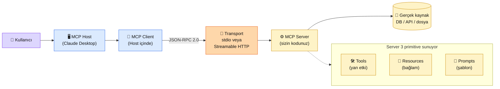

# 6.3 MCP Protokolü — AI için USB-C

<div class="ma-meta" markdown>
<div class="ma-meta-row" markdown>
<strong>Kim için:</strong>
<span class="ma-persona ma-persona-baslangic">🟢 başlangıç</span>
<span class="ma-persona ma-persona-is">🔵 iş</span>
<span class="ma-persona ma-persona-kisisel">🟣 kişisel</span>
</div>
<div class="ma-meta-row"><strong>⏱️ Süre:</strong> ~35 dakika</div>
<div class="ma-meta-row"><strong>📋 Önkoşul:</strong> 6.2 bitmiş — tool calling + JSON Schema + `tool_choice` mekaniği oturmuş; Claude Desktop kurulu (ücretsiz [claude.ai/download](https://claude.ai/download))</div>
<div class="ma-meta-row"><strong>🎯 Çıktı:</strong> **MCP'nin ne olduğunu ve tool calling'den farkını** tek cümleyle anlatabiliyorsun; **3 primitive** (Resources/Tools/Prompts) tanımını örneklerle ayırt ediyorsun; **hazır bir MCP server'ı** (Filesystem) Claude Desktop'a bağlayıp "Masaüstümdeki dosyaları listele" demek işlediğini görüyorsun.</div>
</div>

!!! tip "Yabancı kelime mi gördün?"
    Bu sayfadaki **kalın** teknik terimler (yapı taşı / primitive, taşıma katmanı / transport, stdio, JSON-RPC gibi) ilk geçişte hemen yanında veya altında Türkçe açıklanır.

## Neden bu sayfa?

6.2'de araç çağırmayı (tool calling) gördün. İstesen bugün Claude'a KDV hesaplatan bir araç yazabilirsin. **Ama bu araç senin Python dosyanda esir.** Başka biri kullanamaz; Claude Desktop tanımaz; Claude Code'a bağlanmaz; başka bir uygulamaya taşımak için baştan yazman gerekir. Araç çağırma **bir API özelliği**, ama **taşınabilirlik** için yeterli değil.

İkincisi: Kasım 2024'te Anthropic **MCP (Model Context Protocol — Model Bağlam Protokolü)**'ü duyurdu. Vaat basit — "Claude'a bir aracı **bir kere** yaz, **her** istemci (Desktop, Code, API, başka modeller) kullansın". **Mart 2025'te OpenAI**, **Nisan 2025'te Google DeepMind** MCP'yi resmen kabul etti. **Aralık 2025'te Anthropic, MCP'yi Linux Foundation altındaki Agentic AI Foundation'a (AAIF) bağışladı** — bugün ChatGPT, Claude, Cursor, Gemini, Microsoft Copilot, VS Code dahil tüm büyük istemciler MCP konuşuyor. AI Engineer iş ilanlarında "MCP" satırı 2026'da neredeyse standart hâline geldi.

Üçüncüsü: MCP yalnızca "araç taşıyıcı" değil. **Resources** (Claude'a yüklenecek bağlam), **Tools** (Claude'un çağırabileceği işlemler), **Prompts** (hazır şablonlar) — üç ayrı yapı taşı sunuyor. Bu sayfa bu üç yapı taşının ne olduğunu + neyin nereye oturduğunu netleştirir; bir sonraki sayfa (6.4) Python'da gerçek bir MCP sunucusu yazar.

## MCP kısaca — üç paragraf, matematiksiz

**MCP = "AI için USB-C".** Anthropic'in resmi benzetmesi. USB-C'den önce her cihaz farklı kablo istiyordu (lightning, micro-USB, mini-USB…). USB-C standardı geldi, bir kablo her yere takılıyor. MCP de aynı şey: her LLM ürünü kendi eklenti (plugin) sistemini yazmak yerine, **ortak bir protokole** (JSON-RPC 2.0 üzeri açık spesifikasyon) bağlanıyor. Sen bir MCP sunucusu yazıyorsun — Claude Desktop, Claude Code, Cursor, Zed, Windsurf, Continue.dev, ChatGPT Desktop, Gemini, VS Code; hepsi aynı sunucuyu kullanabiliyor.

**Araç çağırma (6.2) bir API özelliği — MCP ise protokol standardı. Fark bu.** Araç çağırma senin Python kodundaki Anthropic API entegrasyonu. MCP ise **ayrı bir süreç** (senin sunucun) ile **istemci** (Claude Desktop) arası konuşma kuralı. MCP sunucunun içinde **zaten araç çağırma yapıyor olabilirsin** — ama MCP, aracı bir **paket** halinde, standart bir arayüzle dış dünyaya sunuyor. Benzetme: araç çağırma = Python fonksiyonu; MCP = Python paketi + PyPI'a yükleme.

**Üç yapı taşı (primitive) = Claude'a üç farklı şey verme yolu.** (1) **Tools** — Claude'un çağırabileceği fonksiyonlar (POST uç noktası benzeri; yan etki yapar): `email_gonder`, `dosya_sil`. (2) **Resources** — Claude'a yüklenebilir bağlam (GET uç noktası benzeri; salt okunur): `musteri_listesi`, `config://app/ayarlar`. (3) **Prompts** — kullanıcının **slash komutu** olarak çağırabileceği hazır şablonlar: `/kod-review`, `/makale-ozetle`. Üçünün de JSON-RPC üzerinde ortak metotları var (`tools/list`, `resources/read`, `prompts/get`), ama Claude'un kullandığı anlamlar farklı.

## Bu sayfanın ekosistemi — host, client, server

<div class="ma-ekosistem" markdown>
<div class="ma-ekosistem-header">🗺️ Ekosistem — Claude Desktop'tan MCP server'a</div>



<table class="ma-aktorler" markdown>

| Düğüm | Nerede | Ne iş yapıyor |
|---|---|---|
| 👤 **Kullanıcı** | Sohbet ekranı | Doğal dilde istek — "masaüstümdeki PDF'leri listele" |
| 🖥️ **MCP Host (ana uygulama)** | Claude Desktop / Code / Cursor / ChatGPT Desktop | LLM'i içinde barındıran uygulama; MCP istemcisini başlatıyor |
| 🔌 **MCP Client (istemci)** | Host içinde kütüphane | Sunucu ile JSON-RPC konuşur; sunucuyu çağırır, cevabı host'a verir |
| 📡 **Transport (taşıma katmanı)** | stdio veya HTTP | İstemci ↔ sunucu arasındaki boru. Yerel = stdio, uzak = Streamable HTTP |
| ⚙️ **MCP Server (sunucu)** | Senin yazdığın bağımsız süreç | Tools + Resources + Prompts sunuyor |
| 💾 **Gerçek kaynak** | DB, dosya sistemi, API | Sunucunun arka ucu — gerçek veri burada |
| 🛠 **Tools** | Sunucu yapı taşı 1 | `send_email`, `delete_file` — yan etkili fonksiyon |
| 📄 **Resources** | Sunucu yapı taşı 2 | `file:///path` — salt okunur bağlam |
| 💬 **Prompts** | Sunucu yapı taşı 3 | `/review-code` — kullanıcıya slash komutu |

</table>
</div>

**Önemli:** Tool, Claude'un kararıyla otomatik çağrılır; resource'u **kullanıcı seçer** (Claude Desktop'ta "+" menüsündeki "Attach from MCP" gibi); prompt'u **kullanıcı slash komutu ile** çağırır. Üçü de Claude'un elinde ama **tetikleme kaynakları farklı.**

## Uygulama — iki yol

### Yol A — Hazır bir MCP sunucusunu Claude Desktop'a bağla (~15 dk)

Kendin yazmadan önce, **başkasının yazdığını kullanmak** refleksi. Filesystem sunucusu resmi [modelcontextprotocol/servers](https://github.com/modelcontextprotocol/servers) deposunda — Claude'a dosya listele/oku/ara yeteneği veriyor.

**1. Yapılandırma dosyasını aç.** Claude Desktop → Settings → Developer → **Edit Config**. Dosya konumu:

| OS | Yol |
|---|---|
| macOS | `~/Library/Application Support/Claude/claude_desktop_config.json` |
| Windows | `%APPDATA%\Claude\claude_desktop_config.json` |
| Linux | `~/.config/Claude/claude_desktop_config.json` |

**2. JSON içeriği:**

```json
{
  "mcpServers": {
    "filesystem": {
      "command": "npx",
      "args": [
        "-y",
        "@modelcontextprotocol/server-filesystem",
        "/Users/kemal/Desktop",
        "/Users/kemal/Documents/proje"
      ]
    }
  }
}
```

- `command`: Sunucuyu başlatan komut (`npx`, `uv`, `python`, `docker`…)
- `args`: Komut argümanları. İlk iki argüman sabit; sonrası sunucuya **izinli dizinler** (güvenlik: Claude sadece bu yollara erişebilir)

**3. Claude Desktop'ı tam kapat ve yeniden aç.** macOS'ta `Cmd+Q` (pencere kapatmak yeterli değil); Windows'ta sistem tepsisinden Quit. Sunucu alt süreç (subprocess) olarak başlar.

**4. Doğrulama — "çekiç" (hammer) ikonu.** Yeni sohbet açtığında mesaj kutusunun altında 🔨 ikonu ve yanında araç sayısı görünür. Tıkla → `read_file`, `write_file`, `list_directory`, `search_files` araçlarını listeler. Eğer ikon **yoksa**: JSON sözdizimi hatası var (virgül/süslü parantez) veya log dosyasına bak → `~/Library/Logs/Claude/mcp-server-filesystem.log`.

**5. Test.** Sohbete yaz: "Masaüstümdeki PDF dosyalarını listele." Claude `list_directory` aracını otomatik çağırır, izin ister (ilk defa), onayladığında dosya listesini döndürür. **Bu, Claude'un artık senin dosya sisteminle konuştuğunun ispatı.**

### Yol B — Uzak MCP server'a `mcp-remote` ile bağlan

Kendi sunucun VPS'de veya bir şirket uzak MCP endpoint'i sağlıyor (ör. Notion, Linear, GitHub). Claude Desktop **yerel stdio** bekler — ama `mcp-remote` paketi uzak HTTP endpoint'i yerel stdio'ya **köprülüyor**:

```json
{
  "mcpServers": {
    "notion": {
      "command": "npx",
      "args": [
        "mcp-remote",
        "https://mcp.notion.com/mcp"
      ]
    }
  }
}
```

Bu desen benim `mcp.oluk.org` sunucumun Claude Desktop'tan nasıl bağlanacağının aynısı — uzak HTTP endpoint, `mcp-remote` wrapper, IP whitelist (veya OAuth) güvenlik katmanı. 6.4'te bu tarafta kendi server'ını yazacaksın; bugün sadece **tüketici** tarafındasın.

### 3 primitive somut örnekler — hangi işe hangisi

| Senaryo | Hangi primitive? | Neden |
|---|---|---|
| "Jira'da bug ticket aç" | **Tool** | Yan etki, Claude kendi çağırsın |
| "Bu müşterinin CRM kaydını bağlama ekle" | **Resource** | Salt-okunur bağlam, kullanıcı `+` ile seçiyor |
| "`/code-review` yaz, aşağıdaki kodu review et" | **Prompt** | Kullanıcı slash-command ile tetikliyor, şablon + argüman |
| "SQL sorgusu çalıştır" | **Tool** | Yan etkisiz de olsa Claude'un otomatik çağırması isteniyor |
| "Son 10 git commit log'u göster" | **Resource** veya **Tool** — ikisi de olur | Kullanıcı seçecekse Resource; Claude karar verecekse Tool |

**Pratik kural:** Kullanıcı "Claude buna karar versin" istiyorsa **Tool**. Kullanıcı "ben hangi bağlamı veriyorum, sen cevapla" diyorsa **Resource**. Kullanıcı "belli bir görev şablonunu tetikleyeyim" istiyorsa **Prompt**.

## MCP'yi kullanırken tuzaklar — CTO uyarıları

| Tuzak | Sonucu | Çözüm |
|---|---|---|
| **MCP'yi araç çağırmanın yerine koymak** ("MCP araç çağırmayı geride bırakır") | Mimari yanlış kavranır | Araç çağırma API özelliği, MCP protokol — **ikisi beraber çalışır** (sunucu içinde araç çağırma yapıyorsun) |
| **Her şeyi Tool yapmak** | Kullanıcı deneyimi bozuk, resource anlamı kaybolur | Kullanıcı seçimli = Resource; Claude kararlı = Tool |
| **`claude_desktop_config.json` sözdizimi hatası** | **Hiçbir sunucu** yüklenmez (sessiz başarısızlık) | JSON'u [jsonlint.com](https://jsonlint.com)'de doğrula; virgül + tırnak + parantez |
| **stdio sunucusunda `stdout`'a `print` atmak** | Protokol bozulur — sunucu çöker | stdio taşımasında `stdout` **sadece JSON-RPC için**; loglar `stderr`'e (`print(..., file=sys.stderr)` veya `logging`) |
| **İzinli dizin çok geniş** (`/` veya `$HOME`) | Güvenlik riski — Claude her yere erişir | Sadece proje dizinlerine izin ver; yapılandırmada her yolu açıkça yaz |
| **Sunucu yeniden başlatması Claude Desktop'a yansımadı** | Değişiklik görünmez | Claude Desktop'ı **tam kapat** (Cmd+Q / tepsi Quit) ve yeniden aç — alt süreç o zaman başlar |
| **Uzak MCP için OAuth eksik** | Kimse bağlanamaz | Halka açık değilse IP beyaz listesi + token (`.env`) veya OAuth 2.1 (resmi spec 2025) |
| **`.mcpb` Desktop Extension ihmali** | Son kullanıcı JSON düzenlemek istemiyor | 2026 başında Anthropic **Desktop Extensions** formatını çıkardı — `manifest.json` + `mcpb pack` ile tek tık kurulum; teknik olmayan kullanıcıya dağıtımın doğru yolu |

??? warning "Tipik MCP bağlantı hataları — şu durum şu çözüm"

    | Hata | Sebep | Çözüm |
    |---|---|---|
    | Hammer ikonu görünmüyor | JSON sözdizimi hatası veya komut yolu yanlış | jsonlint.com'da doğrula; `which npx` ile `command` yolunu doğrula |
    | "Server crashed" log'u | stdio'ya stdout print | `print()` yerine `logging.warning(...)` (stderr'e gider) |
    | Tool çağrısı 30 sn hata | Sunucu cevap vermiyor | `timeout` parametresi sunucu kodunda; Claude Desktop log'una bak |
    | "Method not found" | Spec sürüm uyuşmazlığı | İstemci ve sunucu MCP `2025-03-26` veya üstü mü kontrol et |
    | Uzak sunucu OAuth döngüsü | Token süresi dolmuş | `~/.mcp-auth/` dizinini sil, yeniden oturum aç |
    | `mcp-remote` çalışmıyor | Eski sürüm | `npx mcp-remote@latest <url>` ile en güncel sürümü çek |

<div class="ma-anthropic-oz" markdown>
<div class="ma-anthropic-oz-header">📖 Anthropic bu konuyu nasıl anlatıyor — öz</div>

Anthropic MCP'yi [Anthropic Academy — Introduction to Model Context Protocol](https://www.anthropic.com/learn) kursunda (ücretsiz + sertifikalı) anlatıyor. Resmi metin [modelcontextprotocol.io](https://modelcontextprotocol.io) + [platform.claude.com/docs MCP bölümü](https://platform.claude.com/docs/en/mcp). MCP, Aralık 2025'te Linux Foundation'a bağışlandı; OpenAI ve Google da artık destekliyor.

**1. Üç primitive'in isim seçimi bilinçli.** Anthropic REST API metaforunu kasıtlı kullanıyor: Resource = GET (bağlam yükle), Tool = POST (yan etki). Prompt üçüncü bir konsept — önceden düşünülmüş çağrı şablonu. Bu ayrım geliştirici zihninde "ne zaman ne" refleksi kurar.

**2. Transport iki ayak üstünde.** **stdio** — yerel server, subprocess olarak başlatılıyor, Claude Desktop için varsayılan. **Streamable HTTP** (2025 Mart spec güncellemesi) — uzak server, tek HTTP endpoint üstünde bidirectional streaming. Eski SSE transport **deprecated**; yeni MCP server'ları Streamable HTTP üstüne kurmalı.

**3. Güvenlik protokolün merkezinde.** MCP server'ların **açıkça izin verilen kaynaklara** erişebilmesi gerekir. Filesystem server'da "izinli dizin" parametresi + her tool çağrısında Claude Desktop **kullanıcıdan izin** istiyor (ilk çağrıda). Production MCP server'da OAuth 2.1 + scope tabanlı yetkilendirme Anthropic spec'inde standardize edildi.

??? info "Teknik detay — isteyene (spec versionu, transport mekaniği, client lifecycle)"

    **MCP spec versiyonu.** Protokol **semantic versioning** kullanıyor — son stabil `2025-03-26` (2025 Mart). Client-server handshake'te `initialize` metoduyla versiyon pazarlığı yapılıyor; uyumsuzluk varsa bağlantı kapanır.

    **JSON-RPC 2.0 mesaj tipleri.** Request (id + method + params), Response (id + result/error), Notification (id yok, tek yönlü). MCP bunların üstünde **capability negotiation** ekliyor: client "ben resources desteklerim" der, server hangi primitive'leri desteklediğini ilan eder.

    **Client lifecycle.** `initialize` → `notifications/initialized` → `tools/list` + `resources/list` + `prompts/list` → kullanım → `shutdown`. Her adım spec'te tanımlı, istemci kütüphanesi bunları otomatik yapar.

    **Capability discovery.** Server startup'ta hangi tool/resource/prompt'lara sahip olduğunu ilan eder. Client bunu cache'ler; yeni tool eklendiğinde server `notifications/tools/list_changed` gönderir.

    **Resource URI schemes.** `file://`, `https://`, `git://`, `config://` — istediğin schema'yı tanımlayabilirsin. Best practice: domain-specific URI (`crm://musteri/123`, `hbv://bagisci/456`).

    **Sampling (tersine akış).** Server client'tan LLM completion isteyebilir (`sampling/createMessage`). Yani MCP server **içinden** "bu veriyi Claude'a özetlet" çağrısı yapılabilir. Multi-agent desenler için temel (6.5).

    **Desktop Extensions (.mcpb, 2026 başı).** `manifest.json` metadata + server kodu + `mcpb pack` komutu → tek dosya dağıtım. Claude Desktop `.mcpb` dosyasına çift tıkla kur. Sensitive fields (`"sensitive": true`) Keychain/Credential Manager'da şifreli saklanır. Teknik olmayan kullanıcı + kurumsal dağıtım için doğru yol.

<div class="ma-anthropic-oz-kaynak" markdown>
**Kaynak:** [modelcontextprotocol.io — Spec](https://modelcontextprotocol.io/specification) (EN, protokolün canonical kaynağı, ~1 saat tam okuma). Pekiştirme: [Anthropic Academy — Introduction to MCP](https://anthropic.skilljar.com/) (~45 dk, ücretsiz, sertifikalı) ve [Anthropic news — MCP duyurusu, 25 Kasım 2024](https://www.anthropic.com/news/model-context-protocol). Server örnekleri: [modelcontextprotocol/servers GitHub](https://github.com/modelcontextprotocol/servers) — Filesystem, Git, GitHub, Postgres, Slack, Google Drive resmi server'ları okuyarak öğren.
</div>
</div>

<div class="ma-cikti-kaniti" markdown>
### 📦 Bu sayfayı bitirdiğini nasıl kanıtlarsın

#### 1. 📝 Refleksiyon yazısı — 5 dakika

> "MCP'yi tek cümleyle şöyle açıklıyorum: [...]. Tool calling'den farkı: [...]. 3 primitive'den benim kendi projem için en uygun olan [Tool/Resource/Prompt], çünkü [...]. Hazır server [filesystem/git/...] bağladım; [X] tool'u denedim; sonuç [...]."

Kaydet: `muhendisal-notlarim/bolum-6/03-mcp/refleksiyon.txt`

#### 2. 📸 Ekran görüntüsü — 3 dakika

**Neyin görüntüsü:** Claude Desktop mesaj kutusunun altındaki **🔨 hammer** ikonu + açık tool listesi (filesystem tool'ları görünüyor). Bunun altında bir chat turu — Claude'un `list_directory` tool'unu çağırıp izin istediği kadraj.

Kaydet: `muhendisal-notlarim/bolum-6/03-mcp/hammer-ikonu.png`

#### 3. 💻 Kendi alan vaka çalışması — 20 dakika

Kendi ilgi alanında bir MCP server örneği seç ([awesome-mcp-servers](https://github.com/punkpeye/awesome-mcp-servers) listesinden) — GitHub, Postgres, Slack, Obsidian, Home Assistant. Config'e ekle, **5 soru** sor Claude'a (kendi veri içeriğinden). 5 soru + Claude'un cevabı + hangi tool'u hangi argümanlarla çağırdığı tablo halinde README'ye yaz. Repoyu portföye ekle.

Kaydet: `muhendisal-notlarim/bolum-6/03-mcp/vaka-calismasi-repo.txt`

</div>

<div class="ma-neden-sonuc" markdown>
<div class="ma-neden-sonuc-header">🔗 Birlikte okuma — neden ne oldu</div>

<ol class="ma-neden-sonuc-zincir" markdown>
<li>**A → B:** Tool calling (6.2) taşınabilir değil — Python dosyanda esir. MCP bu eksiği protokol standardıyla kapatır. Bu yüzden **MCP = taşınabilirlik.**</li>
<li>**B → C:** MCP = 'AI için USB-C' — bir kere yaz, her LLM istemcisi kullansın. Anthropic'in 2024 Kasım'dan beri süren en büyük ekosistem hamlesi. Bu yüzden **standart olmak değer katar.**</li>
<li>**C → D:** Tool calling API feature, MCP protocol standard — **ikisi birlikte çalışır**, birbirini yerine geçmez. Bu yüzden **ikisini de bilmek şart.**</li>
<li>**D → E:** 3 primitive (Tools/Resources/Prompts) aynı şey değil — Tool = Claude kararlı, Resource = kullanıcı seçimli, Prompt = slash-command. Bu yüzden **primitive karıştırma hata üretir.**</li>
<li>**E → F:** Host (Claude Desktop) ↔ Client ↔ Server; JSON-RPC 2.0 üstünde stdio veya Streamable HTTP. Kendi server'ın subprocess olarak başlatılıyor. Bu yüzden **mimari net anlaşılmalı.**</li>
<li>**F → G:** Hazır server (filesystem) 5 dakikada bağlanır, hammer ikonu görünür, Claude dosyalarına erişir — MCP'nin ne kazandırdığı somut olarak çıkar. Bu yüzden **tüketici olmak başlangıç noktası.**</li>
</ol>

<div class="ma-neden-sonuc-sonuc" markdown>
**Sonuç:** MCP = Anthropic ekosisteminde **vazgeçilmez refleks**. Tüketici olmayı 15 dakikada öğrendin; 6.4'te üretici olacaksın — kendi MCP server'ını Python `mcp` kütüphanesi ile yazıp, `mcp.oluk.org` tarzı bir canlı servis çıkaracaksın. Bölüm 6'nın imza sayfası sıradaki sayfa.
</div>
</div>

<div class="ma-sonraki" markdown>
<div class="ma-sonraki-header">➡️ Sonraki adım</div>

**[6.4 MCP Server Yazma →](04-mcp-server.md)** — Python `mcp` SDK (`FastMCP`), 3 gerçek tool + Resource + Prompt, Claude Desktop'a kendi sunucunu bağlama, `mcp.oluk.org` canlı referansı. Bölüm 6'nın imza sayfası.

← [6.2 Tool Calling](02-tool-calling.md) &nbsp;|&nbsp; [Bölüm 6 girişi](index.md) &nbsp;|&nbsp; [Ana sayfa](../index.md)

**Pekiştirme:** Anthropic Academy [Introduction to Model Context Protocol](https://www.anthropic.com/learn) kursunu aç (ücretsiz, sertifikalı). Bu sayfadaki 3 yapı taşı + USB-C benzetmesi + araç çağırma ↔ MCP ayrımı kurstan geri dönünce pekişir.
</div>
