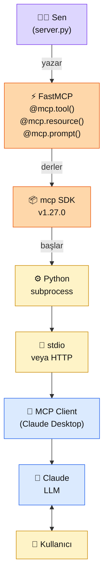
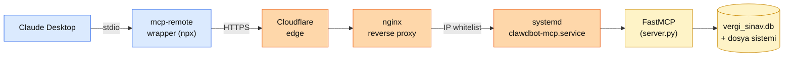

# 6.4 MCP Sunucusu Yazma — Bölüm 6 İmza Sayfası

<div class="ma-meta" markdown>
<div class="ma-meta-row" markdown>
<strong>Kim için:</strong>
<span class="ma-persona ma-persona-baslangic">🟢 başlangıç</span>
<span class="ma-persona ma-persona-is">🔵 iş</span>
<span class="ma-persona ma-persona-kisisel">🟣 kişisel</span>
</div>
<div class="ma-meta-row"><strong>⏱️ Süre:</strong> ~45 dakika</div>
<div class="ma-meta-row"><strong>📋 Önkoşul:</strong> 6.3 bitmiş — MCP'nin 3 yapı taşı + ana uygulama (host) / istemci (client) / sunucu (server) mimarisi + Claude Desktop yapılandırması yapıldı; Python 3.10+ ve `uv` ya da `pip` kurulu</div>
<div class="ma-meta-row"><strong>🎯 Çıktı:</strong> Python `mcp` SDK (`FastMCP`) ile **kendi MCP sunucun** ayakta — **3 gerçek Tool** + **1 Resource** + **1 Prompt** sunuyor; Claude Desktop'a bağladığında 🔨 ikonunda görünüyor; "TCMB kurunu göster" dediğinde senin yazdığın fonksiyon çalışıp cevabı Claude aracılığıyla döndürüyor. Portföye **GitHub repo** + **30 saniyelik demo GIF** çıktı olarak kalıyor.</div>
</div>

!!! tip "Yabancı kelime mi gördün?"
    Bu sayfadaki **kalın** teknik terimler (decorator / dekoratör, type hint / tip ipucu, FastMCP, stdio gibi) ilk geçişte hemen yanında veya altında Türkçe açıklanır.

## Neden bu sayfa?

6.3'te **tüketici** oldun — hazır filesystem sunucusunu Claude Desktop'a bağladın. Bu sayfada **üretici** oluyorsun. Fark şu: MCP ekosistemindeki değerli iş birinci kategoride değil — binlerce kişi hazır sunucu kurup mutlu; **az kişi kendi sunucusunu yazıyor.** İş ilanlarında, açık kaynak portföyde, teknik görüşmede farkı yaratan bu taraf. AI Engineer rolünde "MCP sunucusu yazdım" cümlesi **mesleki geçiş kartı**.

İkincisi: Python `mcp` SDK 2025 boyunca olgunlaştı, 2026 Nisan itibarıyla v1.27.x serisinde. İçindeki **FastMCP** modülü — Flask/FastAPI tarzı **dekoratör (decorator)** sözdizimi + Python **tip ipuçlarını (type hints)** otomatik JSON Şemasına çeviriyor. Yani 6.2'de elle yazdığın `"input_schema": {"type":"object",...}` blokları artık yok — `def tool(a: int, b: str) -> dict` imzası yeter, şema otomatik üretilir. Bu dekoratör devrimi, MCP sunucu yazımını ~30 satırlık işe indirir.

Üçüncüsü: Bu sayfanın **canlı referansı [mcp.oluk.org](https://mcp.oluk.org)** — 12 araç sunan üretim MCP sunucusu; Streamable HTTP taşıması, IP beyaz listesiyle güvenlik, FastMCP üzerine kurulu. Aşağıda kendi hello-world sunucunu yazacaksın; `mcp.oluk.org`'u ise **mimari desen kanıtı** olarak referans alacağız — "bu kitapta öğrenilenler üretimde nasıl görünüyor" sorusunun somut cevabı.

## FastMCP kısaca — üç paragraf, matematiksiz

**FastMCP = Python `mcp` SDK'sının dekoratör katmanı.** İçe aktarma: `from mcp.server.fastmcp import FastMCP`. `mcp = FastMCP("AdımSunucu")` ile sunucu nesnesi. `@mcp.tool()`, `@mcp.resource(uri)`, `@mcp.prompt()` dekoratörleriyle fonksiyonları 3 yapı taşına kaydediyorsun. `mcp.run()` ile ayakta. **~30 satırlık kodda** üretime hazır MCP sunucusu çıkıyor — eski SDK'nın 120 satırlık şablon kodu (boilerplate) yok.

**Tip ipucu = otomatik JSON Şema.** `def kdv_hesapla(tutar: float, oran: float = 20) -> dict` yazıyorsun — FastMCP `tutar` ve `oran`'ı JSON Şemasına çeviriyor, docstring'i `description`'a yazıyor, `-> dict` dönüş tipinden **yapılandırılmış çıktı (structured output)** çıkarıyor. 6.2'de elle yazdığın `input_schema` bloğu **tamamen otomatik**. Python'ın `typing` modülünden gelen `Literal["USD","EUR"]` → JSON'da `enum`; `Optional[int]` → `nullable`; `list[str]` → `array of string`. Tip sistemi senin şeman.

**Taşıma kararı: stdio (yerel) veya Streamable HTTP (uzak).** `mcp.run()` varsayılan stdio çalıştırır — Claude Desktop alt süreç olarak başlatır. `mcp.run(transport="streamable-http", port=8000)` dersen HTTP uç noktası sunar — uzaktan (VPS'te) kurulu sunucuya `mcp-remote` ile veya doğrudan HTTP istemcisinden bağlanabilirsin. `mcp.oluk.org` ikincisini kullanıyor; Claude Desktop → `mcp-remote` sarıcısı → HTTP uç noktası. (Not: Eski `sse` taşıması Mart 2025 spec'iyle birlikte deprecate edildi; yeni sunucularda Streamable HTTP kullan.)

## Bu sayfanın ekosistemi — geliştiriciden son kullanıcıya

<div class="ma-ekosistem" markdown>
<div class="ma-ekosistem-header">🗺️ Ekosistem — yazdığın Python kodundan Claude chat'e</div>



<table class="ma-aktorler" markdown>

| Düğüm | Nerede | Ne iş yapıyor |
|---|---|---|
| 👩‍💻 **Geliştirici (sen)** | `server.py` dosyası | Python fonksiyonu yaz, dekoratör koy |
| ⚡ **FastMCP dekoratörleri** | `@mcp.tool()` vb. | Fonksiyonu yapı taşına kaydet + şemayı otomatik üret |
| 📦 **mcp SDK (v1.27.x, Nisan 2026)** | `pip install mcp` | JSON-RPC işleyici + taşıma katmanı |
| ⚙️ **Python alt süreci (subprocess)** | `python server.py` veya `uv run` | Sunucunun ayakta olduğu süreç |
| 📡 **Taşıma (transport)** | stdio (yerel) / Streamable HTTP (uzak) | İstemci ↔ sunucu borusu |
| 🔌 **MCP İstemcisi** | Claude Desktop içinde | Sunucuyu keşfet, aracı çağır, cevabı al |
| 🤖 **Claude LLM** | Anthropic API | Kullanıcı mesajına göre araç kararı |
| 👤 **Kullanıcı** | Sohbet ekranı | Doğal dilde soru/komut |

</table>
</div>

## Uygulama — iki yol

### Yol A — Hello World server (15 dk)

**1. Proje kur.**

```bash
mkdir ilk-mcp-server && cd ilk-mcp-server
python3 -m venv .venv && source .venv/bin/activate  # Windows: .venv\Scripts\activate
pip install "mcp[cli]>=1.27"
```

**2. `server.py` yaz.**

```python
from mcp.server.fastmcp import FastMCP

mcp = FastMCP("ilk-server")

@mcp.tool()
def topla(a: int, b: int) -> int:
    """İki tam sayıyı toplar. Kullanıcı 'topla', 'artı', 'toplam' dediğinde çağrılır."""
    return a + b

if __name__ == "__main__":
    mcp.run()  # default: stdio transport
```

**7 satır. Bu tam bir MCP server.** FastMCP docstring'i `description`'a, type hint'leri JSON Schema'ya çevirdi.

**3. MCP Inspector ile test et (Claude Desktop'a bağlamadan önce).**

```bash
npx @modelcontextprotocol/inspector python server.py
```

Tarayıcıda `http://localhost:6274` açılır; `topla` tool'unu görürsün, argüman verip çağırabilirsin. **Bu sanki Postman — MCP server'ın için.**

**4. Claude Desktop'a bağla.**

`claude_desktop_config.json`:

```json
{
  "mcpServers": {
    "ilk-server": {
      "command": "/mutlak/yol/ilk-mcp-server/.venv/bin/python",
      "args": ["/mutlak/yol/ilk-mcp-server/server.py"]
    }
  }
}
```

!!! warning "Mutlak yol şart"
    Claude Desktop subprocess başlatırken **HOME dizininde** başlar — `python server.py` gibi göreli yol çalışmaz. Her iki yol da mutlak (`/Users/kemal/...` veya `C:\Users\Kemal\...`).

Claude Desktop'ı tam kapat (`Cmd+Q`) ve yeniden aç. Hammer ikonunda `topla` görünmeli. Chat'e "5 ile 3'ü topla" yaz — Claude `topla(a=5, b=3)` çağırır, `8` döner.

### Yol B — 3 gerçek tool + 1 Resource + 1 Prompt (45 dk, portföy projesi)

Türkiye odaklı somut server — **TurkiyeHelper**:

- **Tool 1 — `tcmb_kuru`:** TCMB güncel kur tablosu
- **Tool 2 — `hava_durumu`:** Şehir adından hava
- **Tool 3 — `notlarim_ara`:** Yerel markdown notlarında arama
- **Resource — `config://ayarlar`:** Server konfigürasyonu (salt-okunur bağlam)
- **Prompt — `/metin_ozetle`:** Kullanıcıya sunulacak özetleme şablonu

**1. Kurulum:**

```bash
mkdir turkiye-helper && cd turkiye-helper
python3 -m venv .venv && source .venv/bin/activate
pip install "mcp[cli]>=1.27" httpx python-frontmatter
```

**2. `server.py` — tam içerik:**

```python
"""TurkiyeHelper MCP Server — TCMB kur + hava + yerel notlar.

Claude Desktop'a bağlanınca 3 tool + 1 resource + 1 prompt sunar.
"""

from __future__ import annotations

import sys
from pathlib import Path
from typing import Literal

import httpx
from mcp.server.fastmcp import FastMCP

# ── Server nesnesi ──────────────────────────────────────────────
mcp = FastMCP("turkiye-helper")

# Server'a özgü sabitler (gerçek projede .env'den oku)
NOTLAR_DIZINI = Path.home() / "Documents" / "notlarim"
HTTP_TIMEOUT = 10.0


# ── Tool 1: TCMB kuru ──────────────────────────────────────────
@mcp.tool()
async def tcmb_kuru(
    para: Literal["USD", "EUR", "GBP", "CHF", "SAR"] = "USD",
) -> dict:
    """Türkiye Merkez Bankası güncel kurunu döndürür.

    Kullanıcı 'dolar kaç', 'euro kuru', 'tcmb', 'döviz' dediğinde çağrılır.

    Args:
        para: Hedef para birimi. USD/EUR/GBP/CHF/SAR destekli.

    Returns:
        dict: {'para': 'USD', 'alis': 34.52, 'satis': 34.58, 'tarih': '2026-04-22'}
    """
    url = "https://www.tcmb.gov.tr/kurlar/today.xml"
    try:
        async with httpx.AsyncClient(timeout=HTTP_TIMEOUT) as c:
            r = await c.get(url)
            r.raise_for_status()
        # Basit XML parse (gerçek projede lxml veya xml.etree kullan)
        import xml.etree.ElementTree as ET
        root = ET.fromstring(r.text)
        for currency in root.findall("Currency"):
            if currency.get("CurrencyCode") == para:
                return {
                    "para": para,
                    "alis": float(currency.findtext("ForexBuying") or 0),
                    "satis": float(currency.findtext("ForexSelling") or 0),
                    "tarih": root.get("Tarih", ""),
                }
        return {"hata": f"{para} bulunamadı", "tip": "NotFound"}
    except httpx.HTTPError as e:
        return {"hata": str(e), "tip": "HTTPError"}


# ── Tool 2: hava durumu ────────────────────────────────────────
@mcp.tool()
async def hava_durumu(sehir: str) -> dict:
    """Bir Türkiye şehrinin güncel hava durumunu döndürür.

    wttr.in açık servisini kullanır. Kullanıcı 'hava nasıl', 'yağmur var mı'
    dediğinde çağrılır.

    Args:
        sehir: Şehir adı (İstanbul, Antalya, Isparta, Ankara...).

    Returns:
        dict: {'sehir': 'Antalya', 'sicaklik_c': 22, 'durum': 'Partly cloudy', ...}
    """
    url = f"https://wttr.in/{sehir}"
    try:
        async with httpx.AsyncClient(timeout=HTTP_TIMEOUT) as c:
            r = await c.get(url, params={"format": "j1"})
            r.raise_for_status()
        data = r.json()
        curr = data["current_condition"][0]
        return {
            "sehir": sehir,
            "sicaklik_c": int(curr["temp_C"]),
            "hissedilen_c": int(curr["FeelsLikeC"]),
            "durum": curr["weatherDesc"][0]["value"],
            "nem_yuzde": int(curr["humidity"]),
            "ruzgar_kmh": int(curr["windspeedKmph"]),
        }
    except (httpx.HTTPError, KeyError, IndexError) as e:
        return {"hata": str(e), "tip": type(e).__name__}


# ── Tool 3: yerel not arama ────────────────────────────────────
@mcp.tool()
def notlarim_ara(anahtar: str, max_sonuc: int = 5) -> list[dict]:
    """Yerel markdown notları içinde anahtar kelime arar.

    ~/Documents/notlarim altındaki .md dosyalarında tam-metin araması.
    Kullanıcı 'notlarımda X ara', 'geçen haftaki not' dediğinde çağrılır.

    Args:
        anahtar: Aranacak metin (case-insensitive).
        max_sonuc: En fazla kaç dosya döndürülecek.

    Returns:
        list[dict]: Her biri {'dosya', 'satir_no', 'satir'} içeren liste.
    """
    if not NOTLAR_DIZINI.exists():
        return [{"hata": f"Dizin yok: {NOTLAR_DIZINI}", "tip": "NotFound"}]

    sonuclar = []
    anahtar_lower = anahtar.lower()
    for md in NOTLAR_DIZINI.rglob("*.md"):
        try:
            for i, satir in enumerate(md.read_text(encoding="utf-8").splitlines(), 1):
                if anahtar_lower in satir.lower():
                    sonuclar.append({
                        "dosya": str(md.relative_to(NOTLAR_DIZINI)),
                        "satir_no": i,
                        "satir": satir.strip()[:200],
                    })
                    if len(sonuclar) >= max_sonuc:
                        return sonuclar
        except OSError:
            continue
    return sonuclar or [{"bilgi": f"'{anahtar}' için eşleşme yok"}]


# ── Resource: server config (salt-okunur bağlam) ───────────────
@mcp.resource("config://ayarlar")
def ayarlar() -> str:
    """TurkiyeHelper server ayarları — Claude'a bağlam olarak yüklenebilir."""
    return (
        f"TurkiyeHelper v1.0\n"
        f"Notlar dizini: {NOTLAR_DIZINI}\n"
        f"HTTP timeout: {HTTP_TIMEOUT}s\n"
        f"Desteklenen para birimleri: USD, EUR, GBP, CHF, SAR\n"
    )


# ── Prompt: kullanıcıya sunulacak slash-command ────────────────
@mcp.prompt()
def metin_ozetle(metin: str, max_cumle: int = 3) -> str:
    """Bir metni Türkçe olarak özetlemek için hazır prompt.

    Kullanıcı Claude Desktop'ta '/metin_ozetle' yazdığında argüman
    formu açılır; metin ve cümle sayısı girilince Claude'a gider.
    """
    return (
        f"Aşağıdaki metni Türkçe olarak **en fazla {max_cumle} cümle** ile özetle. "
        f"Ana tezi koru, ikincil detayları at.\n\n"
        f"---\n{metin}\n---"
    )


# ── Ayakta kalma ───────────────────────────────────────────────
if __name__ == "__main__":
    # stdio default — Claude Desktop bunu subprocess olarak başlatır
    # HTTP istenirse: mcp.run(transport="streamable-http", port=8000)
    mcp.run()
```

**Kritik noktalar:**

- **`async def` ile IO-bound tool.** `httpx.AsyncClient` ile paralel HTTP istekleri. FastMCP hem sync hem async destekler.
- **`Literal["USD","EUR",...]` → JSON Schema `enum`.** Claude geçersiz para birimi veremez.
- **Return tipi `dict` / `list[dict]` / `str` → Structured output.** Claude JSON olarak parse eder.
- **Hatalar `{"hata": ..., "tip": ...}` JSON döner** — exception atmak yerine. Claude hatayı "görüyor" ve kullanıcıya özetliyor.
- **`@mcp.resource("config://ayarlar")` URI** — özel schema, Claude Desktop'ta `+` menüsünden "Attach" ile eklenir.
- **`@mcp.prompt()` — slash-command** — Claude Desktop'ta `/metin_ozetle` yazınca argüman formu açılır.

**3. Claude Desktop config:**

```json
{
  "mcpServers": {
    "turkiye-helper": {
      "command": "/mutlak/yol/turkiye-helper/.venv/bin/python",
      "args": ["/mutlak/yol/turkiye-helper/server.py"]
    }
  }
}
```

**4. Test (Claude Desktop'ı tam yeniden başlattıktan sonra):**

| Soru | Beklenen |
|---|---|
| "Dolar kuru bugün ne?" | `tcmb_kuru(para="USD")` çağrılır, alış/satış döner |
| "Antalya'da hava nasıl?" | `hava_durumu(sehir="Antalya")` çağrılır |
| "Notlarımda 'chatbot' geçen yerler" | `notlarim_ara(anahtar="chatbot")` çağrılır |
| "Server ayarlarını bağlama ekle" (kullanıcı + menüsünden) | `config://ayarlar` resource olarak yüklenir |
| Chat'e `/metin_ozetle` yaz | Prompt formu açılır, metin ve max_cumle sor |

**Bu 5 örnek başarıyla dönüyorsa: MCP server yazımı konusunda temel yetkinliğin var.** Portföye gider.

## Canlı referans — `mcp.oluk.org`

Benim kendi production MCP server'ım — 12 tool, Streamable HTTP transport, IP whitelist güvenlik katmanı. Mimari desen şöyle:



**Neden bu mimari üç katmanlı (Cloudflare + nginx + systemd):**

1. **Cloudflare edge** — DDoS koruması, TLS termination, CDN cache'lenebilir resource'lar için.
2. **nginx reverse proxy** — IP whitelist (`allow 160.79.104.0/21; deny all;` Anthropic Claude IP aralığı), HTTP header normalizasyonu, rate limit.
3. **systemd** — server'ın cihaz restart'ında otomatik ayakta kalması, log rotasyonu, crash-restart politikası.

**Yol B'deki `turkiye-helper` server'ı production'a götürmek** demek: `mcp.run(transport="streamable-http", port=8000)` + yukarıdaki 3 katmanı koymak. Bu sayfanın kapsamı dışında (9.5-9.6 deployment sayfalarında işlenecek), ama **teknik yol net**: yerel stdio → uzak HTTP tek parametre.

**Güvenlik notu (özel detay paylaşmıyorum):** Production MCP sunucunda **kimin neye erişebildiği** protokolün kendi kadar önemli. `mcp.oluk.org`'da IP whitelist yöntemini seçtim — çünkü server yalnız kendi Claude hesabımdan geldi. Halka açık production server için OAuth 2.1 + scope-based yetkilendirme (Anthropic resmi spec) doğru seçim. Bu seçimleri 8. Bölüm'de derinleştireceğiz.

## MCP server yazarken tuzaklar — CTO uyarıları

| Tuzak | Sonucu | Çözüm |
|---|---|---|
| **Docstring eksik / tek satır** | Claude aracı çağırmıyor veya yanlış çağırıyor | Docstring'de (1) ne yapıyor (2) ne zaman çağrılır (3) 3+ örnek ifade |
| **Tip ipucu yok** (`def f(a, b)`) | FastMCP şema üretemez, araç mcp_inspector'da görünmez | **Her argümana tip ver.** `int`, `str`, `float`, `bool`, `Literal[...]`, `Optional[X]` |
| **`print()` kullanmak (stdio taşıması)** | `stdout` protokolü bozar, sunucu çöker | `logging` veya `print(..., file=sys.stderr)` — **`stdout` sadece JSON-RPC için** |
| **Göreli yol + Claude Desktop** | Sunucu başlamaz ("command not found") | `command` ve `args` **mutlak yol**; venv'in python ikilisi (binary) |
| **`async` + `sync` karışık** | Olay döngüsü (event loop) hatası | Araç fonksiyonları türdeş: ya hepsi async ya hepsi sync. HTTP çağrısı varsa async tercih |
| **Araç çok geniş kapsamlı** (`veritabani_sorgula(sql)` gibi) | Güvenlik riski + Claude karmaşık SQL üretemez | Dar araçlar: `musteri_getir(id)`, `siparis_listele(tarih)`. Her araç tek iş |
| **İstisna fırlatmak** (`raise ValueError`) | Sunucu çöker veya Claude anlamaz | `{"hata": str(e), "tip": type(e).__name__}` JSON dön + `is_error=True` bayrağı |
| **Ortam değişkenleri kodun içinde sabit** | Repoya gizli anahtar sızar | `.env` + `python-dotenv`; yapılandırma dosyasında `"env": {"KEY": "..."}` bloğu |
| **Test etmeden Claude Desktop'a bağlamak** | Hata ayıklama cehennemi | **Her zaman önce `mcp_inspector`** ile dene; araçlar orada çalışıyorsa Desktop'ta da çalışır |
| **Paket dağıtımı ihmali** | Başkası kuramıyor | `pyproject.toml` + `uv publish` veya `.mcpb` paketi (2026 Desktop Extension biçimi) |

??? warning "Tipik MCP sunucu çalıştırma hataları — şu durum şu çözüm"

    | Hata | Sebep | Çözüm |
    |---|---|---|
    | "Server failed to start" | Mutlak yol değil veya venv yanlış | `which python` ile mutlak yolu al, `command`'e koy |
    | Hammer ikonunda görünmüyor ama log temiz | İlk çağrı zaman aşımı (>10 sn) | Sunucuda yavaş import (örn. `pandas`) varsa sadeleştir |
    | "JSON parse error" log'u | `print()` veya `sys.stdout.write` stdout'a yazıyor | Tüm yazımları `logging` veya `stderr`'e çek |
    | Tool argümanlar None geliyor | Tip ipucu eksik veya `Optional` yanlış | `Optional[int]` yerine `int | None` (Python 3.10+) net |
    | `httpx.ConnectError` (TCMB API) | Ağ erişimi yok / DNS / IPv6 sorunu | `httpx.AsyncClient(transport=httpx.AsyncHTTPTransport(retries=2))` |
    | Resource görünmüyor ama tool görünüyor | `+` menüsü yerel sunucularda gizli olabilir | Claude Desktop'ı tam yeniden başlat; spec sürümünü 2025-03 üstüne çek |

<div class="ma-anthropic-oz" markdown>
<div class="ma-anthropic-oz-header">📖 Anthropic bu konuyu nasıl anlatıyor — öz</div>

Anthropic MCP sunucu yazımını [modelcontextprotocol/python-sdk](https://github.com/modelcontextprotocol/python-sdk) deposunda + Academy [Advanced MCP](https://www.anthropic.com/learn) kursunda (ücretsiz, sertifikalı) anlatıyor. Python SDK 2026 Nisan itibarıyla **v1.27.x** serisi.

**1. FastMCP 1.0 SDK'ya birleştirildi.** Eskiden ayrı paketti; 2024 sonunda resmi SDK'ya entegre oldu. Bugün `pip install mcp` yeterli. Bağımsız FastMCP paketi (`pip install fastmcp`) daha gelişmiş özellikler (barındırma, etkileşimli UI) sunar — açık kaynaklı MCP sunucularının büyük çoğunluğu bir FastMCP sürümü üzerinde çalışıyor.

**2. Structured output otomatik.** Python return type annotation (`-> dict`, `-> list[X]`, Pydantic modeli) → MCP spec'teki **structured output** bloğuna çevrilir. Claude bu yapılandırılmış veriyi daha doğru parse eder. Geriye dönük uyumluluk için `structured_output=False` ile kapatılabilir.

**3. Context objesi — ilerleyiş raporu + kaynak erişimi.** `@mcp.tool()` imzasına `ctx: Context` eklersen: `ctx.info("...")` log, `ctx.report_progress(i, total)` progress bar, `ctx.read_resource(uri)` kendi server'ındaki resource'u çağır. Uzun süren tool'larda kullanıcıya **geri bildirim** kritik.

??? info "Teknik detay — isteyene (sampling, Image, lifespan, deployment)"

    **Sampling — server LLM'den cevap istiyor.** `await ctx.sample("özetle: ...")` — MCP server Claude'a geri **completion isteği** yollar. Multi-agent için motor: bir server tool'u içinde Claude'dan özet ister, işlem yapar, sonucu dönder. Bölüm 6.5'in teknik temeli.

    **Image çıktısı.** `from mcp.server.fastmcp import Image` — tool multimodal dönebilir. `return Image(data=bytes, format="png")` Claude'un görsel olarak görmesini sağlar.

    **Lifespan — startup/shutdown hook.** `@asynccontextmanager async def lifespan(server): ...; yield ...; ...` — server başlarken DB bağlantısı aç, kapanırken kapat. Production için şart.

    **Transport seçimi detay.**
    - **stdio**: Yerel, tek client, subprocess. Claude Desktop default.
    - **Streamable HTTP**: Uzak, çoklu client, tek endpoint (POST + GET), bidirectional stream. 2025 Mart spec'iyle geldi; eski `sse` transport'un yerini aldı (deprecated).

    **Deployment yolu — uv + Docker.**
    ```bash
    uv init mcp-server
    uv add "mcp[cli]>=1.27" httpx
    # production
    uv run server.py
    # veya Docker: FROM python:3.12-slim + uv pip install
    ```

    **`.mcpb` Desktop Extensions (2026).** `manifest.json` + server + `mcpb pack` → tek dosya dağıtım. Teknik olmayan kullanıcıya yönelik; double-click kurulum. Kurumsal dağıtımda doğru yol.

    **Resource templates.** `@mcp.resource("db://user/{user_id}")` — URI içinde parametreli template. Claude Desktop kullanıcı seçtiğinde `{user_id}` doldurulur, server fonksiyonu çağrılır.

    **Authentication — OAuth 2.1.** 2025 Mart spec'iyle MCP OAuth 2.1 destekliyor. `mcp.run(transport="streamable-http", auth=OAuthProvider(...))` — kimlik doğrulama gereken uzak server için standart.

<div class="ma-anthropic-oz-kaynak" markdown>
**Kaynak:** [modelcontextprotocol/python-sdk GitHub](https://github.com/modelcontextprotocol/python-sdk) (EN, kod öncelikli, kanonik SDK). `examples/snippets/servers/fastmcp_quickstart.py` dosyası ~50 satırlık tam referans. Pekiştirme: [Anthropic Academy — Model Context Protocol: Advanced Topics](https://www.anthropic.com/learn) (ücretsiz, sertifikalı); üretim için kimlik doğrulama + akış + kaynak şablonları burada. Örnek sunucular: [modelcontextprotocol/servers GitHub](https://github.com/modelcontextprotocol/servers) — Filesystem, Git, Postgres, Slack — Python ve TypeScript referans uygulamalar.
</div>
</div>

<div class="ma-cikti-kaniti" markdown>
### 📦 Bu sayfayı bitirdiğini nasıl kanıtlarsın

#### 1. 📝 Refleksiyon yazısı — 5 dakika

> "Server adı: [...]. Sunduğum primitive'ler: [X tool + Y resource + Z prompt]. En beğendiğim tool [ad], çünkü [...]. En büyük tuzağım [...] oldu, şöyle çözdüm: [...]. FastMCP decorator'ların eski 6.2 elle-schema yöntemine göre avantajı benim için: [...]. Bundan sonra genişleteceğim 2 tool fikri: [...]."

Kaydet: `muhendisal-notlarim/bolum-6/04-mcp-server/refleksiyon.txt`

#### 2. 🎥 30 saniyelik demo GIF — 10 dakika

**Ne gösterecek:** Claude Desktop açık, hammer ikonuna tıklayıp kendi server'ının 3 tool'unu gösteriyorsun. Ardından chat'e Türkçe bir soru (ör. "Antalya hava ve dolar kuru"). Claude sırayla `hava_durumu` ve `tcmb_kuru` tool'larını çağırıyor, sonuçlar dönüyor, final cevap. Kayıt aracı: LICEcap (macOS/Win) veya Kap.

Kaydet: `muhendisal-notlarim/bolum-6/04-mcp-server/demo.gif`

#### 3. 💻 GitHub repo + README — 30 dakika

Repo adı: `kullanici-adi/turkiye-helper-mcp` (veya kendi alan adın). README'de:

- **Ne**: 1 paragraf server tanımı
- **Kurulum**: `uv` veya `pip` 3 komutluk adım
- **Claude Desktop config**: JSON örneği
- **5 soru + 5 cevap**: tabloyla Claude'un çağırdığı tool + argüman + sonuç
- **Demo GIF**: embed
- **MIT lisans** + `.gitignore` (venv, `.env` hariç)

**Bu repo seninportföyünün Bölüm 6 köşe taşı.** AI Engineer başvurularında "MCP server yazdım" cümlesinin arkasındaki kanıt.

Repo linkini kaydet: `muhendisal-notlarim/bolum-6/04-mcp-server/github-repo.txt`

</div>

<div class="ma-neden-sonuc" markdown>
<div class="ma-neden-sonuc-header">🔗 Birlikte okuma — neden ne oldu</div>

<ol class="ma-neden-sonuc-zincir" markdown>
<li>**A → B:** MCP'de tüketici olmak (6.3) kolay; **üretici olmak** ekosistemde değerli iş — iş ilanlarında arananı bu taraf. Bu yüzden **yapanlar fark yaratır.**</li>
<li>**B → C:** `FastMCP` decorator + type hint = otomatik JSON Schema; 6.2'deki elle şema artık yok. 7 satırda hello world server. Bu yüzden **boilerplate sıfıra indi.**</li>
<li>**C → D:** 3 gerçek tool + 1 Resource + 1 Prompt ile üç primitive'in hepsine dokunuyorsun — senaryolar gerçek, Claude Desktop'ta canlı çalışıyor. Bu yüzden **kavram elle tutulur hale gelir.**</li>
<li>**D → E:** Transport kararı: `mcp.run()` stdio default (yerel) ↔ `transport='streamable-http'` uzak. Tek satır parametre değişikliği. Bu yüzden **yerel→production geçiş kolay.**</li>
<li>**E → F:** `mcp.oluk.org` canlı örneği — 3 katmanlı production mimari (Cloudflare → nginx → systemd → FastMCP). Yerel server'dan production'a yol haritası. Bu yüzden **gerçek referans soyutu kapatır.**</li>
<li>**F → G:** 10 yaygın tuzak (docstring eksik, print stdout, göreli yol, env var hardcoded…) — bu sayfayla birlikte kendi server'ını yazarken otomatik kaçınıyorsun. Bu yüzden **tuzak listesi üretim kalitesini artırır.**</li>
</ol>

<div class="ma-neden-sonuc-sonuc" markdown>
**Sonuç:** Bölüm 6'nın imza sayfası. Kendi MCP server'ın ayakta, Claude Desktop'a bağlı, 🔨 ikonunda görünüyor — GitHub'a yüklü repo + demo GIF portföyde. Bu tek sayfa AI Engineer başvurunda bir cümlenin altını dolduruyor: **"MCP server yazdım, Claude ekosistemine entegre ettim."** Bundan sonra multi-agent mimari (6.5), Claude Agent SDK (6.6), LangChain Agents karşılaştırma (6.7) ve KarıncaAI production vakası (6.8) kalıyor.
</div>
</div>

<div class="ma-sonraki" markdown>
<div class="ma-sonraki-header">➡️ Sonraki adım</div>

**[6.5 Multi-Agent Sistemler →](05-multi-agent.md)** — Tek agent yetmediğinde: planner + executor + critic rolleri, Anthropic'in Subagents yaklaşımı, orchestrator-workers pattern.

← [6.3 MCP Protokolü](03-mcp.md) &nbsp;|&nbsp; [Bölüm 6 girişi](index.md) &nbsp;|&nbsp; [Ana sayfa](../index.md)

**Pekiştirme:** Anthropic Academy [Model Context Protocol: Advanced Topics](https://www.anthropic.com/learn) kursunu aç (ücretsiz, sertifikalı). Kimlik doğrulama + akış + kaynak şablonları — kendi sunucunu üretime çekerken bunlara ihtiyacın olacak. Paralel okuma: [modelcontextprotocol/servers GitHub](https://github.com/modelcontextprotocol/servers) deposundan **Postgres** ve **Git** sunucularının kaynak kodunu oku — resmi örneklerin yazım stili kendi projelerinde refleks olur.
</div>
