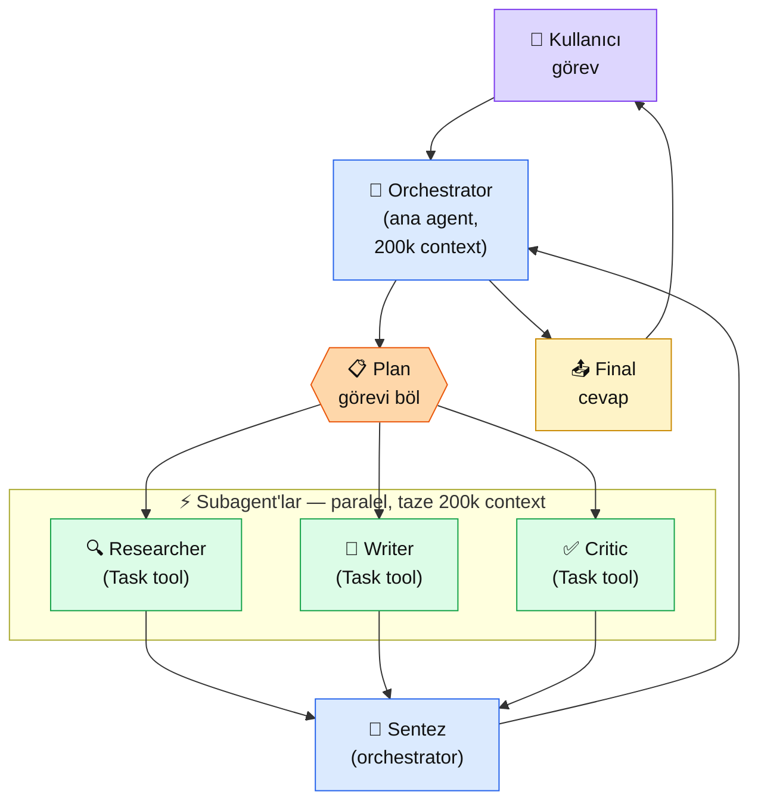
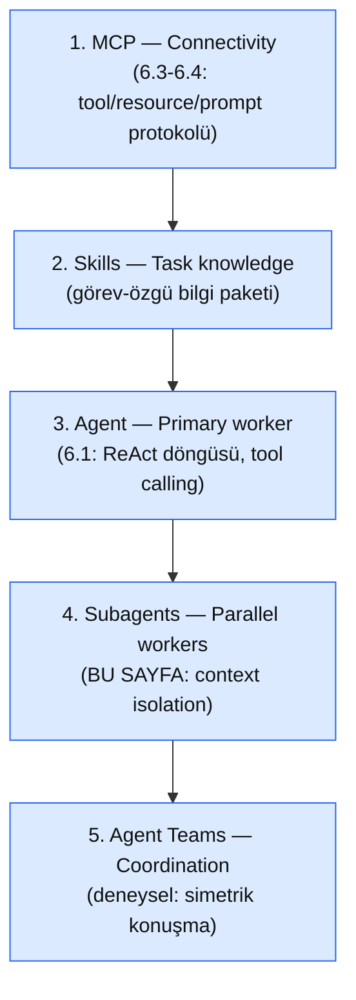

# 6.5 Multi-Agent Sistemler

<div class="ma-meta" markdown>
<div class="ma-meta-row" markdown>
<strong>Kim için:</strong>
<span class="ma-persona ma-persona-baslangic">🟢 başlangıç</span>
<span class="ma-persona ma-persona-is">🔵 iş</span>
<span class="ma-persona ma-persona-kisisel">🟣 kişisel</span>
</div>
<div class="ma-meta-row"><strong>📋 Önkoşul:</strong> 6.1 (Agent + ReAct) + 6.2 (tool calling) + 6.4 (MCP server) bitmiş — tek agent + tool kullanma refleksin var; Python `anthropic` SDK veya Claude Code kurulu</div>
<div class="ma-meta-row"><strong>🎯 Çıktı:</strong> Bir görevin **tek agent'la** mı **multi-agent'la** mı çözüleceğini 5-sinyal karar matrisiyle tespit ediyorsun; Python'da **orchestrator-workers pattern**'inde 3 paralel subagent çalıştırıp sonucu birleştiriyorsun; Claude Code'da `.claude/agents/` ile kendi özel subagent'ını tanımlayıp tetikliyorsun.</div>
</div>

!!! tip "Yabancı kelime mi gördün?"
    Bu sayfadaki **italik-altı çizili** ifadelerin (orchestrator, subagent, context isolation gibi) üstüne mouse'unu getir — kısa tanım çıkar. Mobilde dokun.

## Neden bu sayfa?

6.1'de "workflow != agent" dedik — **basit görev için tek agent bile fazla.** Şimdi ters uçtayız: **tek agent'ın da yetmediği** görevler var. Bir araştırma raporu düşün — 10 konuda web araması, her birinin özeti, bir tez kurma, kaynakça kontrolü, üslup birleştirme. Tek agent 100k+ token bağlamda kaybolur; aynı anda "araştır", "özetle", "kritik et" rollerinin arasında kimlik savruluyor; tool seçimi bozuluyor. **Bağlam şişmesi = kalite düşüşü.**

İkincisi: 2026 Mart itibarıyla Anthropic resmi **5-katman mimari** çizdi — MCP (connectivity) → Skills (görev bilgisi) → Agent (ana işçi) → **Subagents (paralel bağımsız işçi)** → Agent Teams (koordinasyon). Multi-agent artık "deneysel süs" değil; Anthropic'in kendi **Claude Code'u bu katmanların üstünde çalışıyor** ve Anthropic kamuoyu verilerine göre Claude Code kodbase'inin önemli bir kısmı yine Claude Code tarafından üretiliyor. Yani: Anthropic'in **kendi ürününün arkasındaki mimari örüntü** bu sayfada.

Üçüncüsü: Multi-agent literatürü 2024-25'te gürültülüydü — LangGraph, CrewAI, AutoGen, MetaGPT her biri farklı soyutlama. 2026'da dumanın altında **Anthropic'in kendi yaklaşımı netleşti:** "Single-threaded master loop" + **Task tool** ile dispatch + **context isolation**. Karmaşık framework'ler yerine **sadelik**. Bu sayfa bu sadeleşmiş yaklaşımı alıyor; LangGraph karşılaştırması 6.7'de.

## Multi-agent kısaca — üç paragraf, matematiksiz

**5 temel pattern, bir karar ağacı.** Anthropic "Building Effective Agents" makalesi + Claude Code docs birlikte okununca sınıflandırma net: **(1) Sequential** — lineer pipeline (A → B → C), her adım tek Claude çağrısı. **(2) Operator / orchestrator-workers** — hiyerarşik; bir ana agent planı kurar, subagent'lar paralel çalışır, orchestrator sentezler. **(3) Split-and-merge** — n tane bağımsız worker paralel koşar, sonuçlar birleşir; rol farkı yok. **(4) Agent teams** — simetrik; researcher ↔ writer ↔ reviewer kendi aralarında konuşur (Claude Code'da `CLAUDE_CODE_EXPERIMENTAL_AGENT_TEAMS=1` ile deneysel). **(5) Headless** — tam otonom, insan onaysız. Seçim **işçilerin birbiriyle konuşması gerekip gerekmediğine** bağlı — konuşmuyorlarsa subagents/split-merge; konuşuyorlarsa agent teams.

**Orchestrator-workers pattern (en yaygın üretim kullanımı).** Ana agent — tek **orchestrator** — 200k context'inin tamamını görevin ana planına, bağlamına, kullanıcı ihtiyacına ayırır. Alt görevleri **Task tool** (Claude Code'da) veya benzeri dispatch mekanizmasıyla **subagent'lara** yollar. Her subagent **taze 200k context** alır — ana orchestrator'ın gürültüsü olmadan. Subagent işini bitirir, **tek sonuç** döner. Orchestrator sonuçları alıp birleştirir. Bu mimari sırlı: **context isolation kalite koruma mekanizması**. Orchestrator'a "plus iş yaptırmak" (birkaç fonksiyonu kendisi çağır) her zaman planı bozuyor — Anthropic mühendislik blogu bu tuzağa açıkça değiniyor.

**Ne zaman multi-agent, ne zaman tek agent — 5 sinyal.** Aşağıdakilerden **2 ya da fazlası** varsa multi-agent düşün: (a) Görev doğası **paralelleştirilebilir** (10 ayrı konu, 10 ayrı dosya); (b) Tek agent'ın context'i **şişiyor** (>80k token veya >50 tool çağrısı); (c) Rol ayrımı **mimari olarak anlamlı** (planner/executor farklı uzmanlık); (d) Kalite kritik, **ikinci bir göz** gerekli (evaluator-optimizer); (e) Alt görevlerin **farklı maliyet profili** var (bazıları Sonnet, bazıları Haiku). Hiçbiri yoksa **tek agent daha hızlı, daha ucuz, daha debug edilebilir** — refleksi 6.1'de kazandın.

## Bu sayfanın ekosistemi — orchestrator-workers

<div class="ma-ekosistem" markdown>
<div class="ma-ekosistem-header">🗺️ Ekosistem — tek görevden paralel subagent'lara</div>



<table class="ma-aktorler" markdown>

| Düğüm | Rol | Ne iş yapıyor |
|---|---|---|
| 👤 **Kullanıcı** | İstek kaynağı | Yüksek seviyeli görev — "X hakkında rapor yaz" |
| 🧠 **Orchestrator** | Ana agent | Planı kurar, subagent dispatch eder, sonuçları sentezler; **kendisi asli iş yapmaz** |
| 📋 **Plan** | Soyut aşama | Görevi alt görevlere bölme — 3-7 parça tipik |
| 🔍 **Researcher subagent** | Arama + bilgi toplama | Taze 200k context ile kaynak tara |
| 📝 **Writer subagent** | Metin üretimi | Researcher çıktısından taslak yaz |
| ✅ **Critic subagent** | Değerlendirme | Taslağı kritik et, puanla, düzeltme önerisi ver |
| 🧩 **Sentez** | Orchestrator'un birleştirmesi | 3 çıktıyı tek tutarlı metne çevir |
| 📤 **Final cevap** | Kullanıcıya dönen | Son metin + kaynaklar + kalite notu |

</table>
</div>

**Kritik:** Orchestrator subagent çıktılarını **doğrulamadan** ana cevaba geçmez. Her subagent hata yapabilir, halüsinasyon üretebilir, sıkışabilir. Orchestrator'un rolü yalnızca "dispatcher" değil — **kalite kontrol kapısı.**

## Uygulama — iki yol

### Yol A — Python orchestrator-workers (Anthropic SDK)

Senaryo: Kullanıcı 3 farklı konu hakkında araştırma rapor istiyor. Orchestrator planı kurar, 3 subagent paralel koşar, orchestrator birleştirir.

```python
"""Orchestrator-workers pattern with Anthropic SDK."""

import asyncio
import anthropic

client = anthropic.AsyncAnthropic()
MODEL = "claude-sonnet-4-5"


async def subagent_arastir(konu: str) -> dict:
    """Tek bir konuda araştırma yapan subagent — taze context."""
    resp = await client.messages.create(
        model=MODEL,
        max_tokens=1024,
        system=(
            "Sen odaklı bir araştırmacısın. TEK bir konu hakkında özlü, "
            "gerçeklere dayalı 150 kelimelik özet yaz. Kaynakları maddeleyerek belirt. "
            "Konu dışına çıkma."
        ),
        messages=[{"role": "user", "content": f"Konu: {konu}"}],
    )
    return {
        "konu": konu,
        "ozet": resp.content[0].text,
        "input_tokens": resp.usage.input_tokens,
        "output_tokens": resp.usage.output_tokens,
    }


async def orchestrator(kullanici_istegi: str, konular: list[str]) -> str:
    """Orchestrator: subagent'ları paralel dispatch et, sonucu sentezle."""
    # 1. PARALEL DISPATCH — asyncio.gather ile 3 subagent aynı anda
    alt_sonuclar = await asyncio.gather(*[subagent_arastir(k) for k in konular])

    # 2. SENTEZ — orchestrator kendi context'inde birleştiriyor
    sentez_input = "\n\n".join(
        f"### {s['konu']}\n{s['ozet']}" for s in alt_sonuclar
    )
    resp = await client.messages.create(
        model=MODEL,
        max_tokens=2048,
        system=(
            "Sen bir editörsün. Aşağıdaki 3 araştırma özetini TEK tutarlı "
            "yazıya dönüştür: ortak tema, farklar, çıkarım. 300 kelime, akıcı Türkçe."
        ),
        messages=[{"role": "user", "content": (
            f"Kullanıcı isteği: {kullanici_istegi}\n\n"
            f"Subagent çıktıları:\n{sentez_input}"
        )}],
    )
    total_in = sum(s["input_tokens"] for s in alt_sonuclar) + resp.usage.input_tokens
    total_out = sum(s["output_tokens"] for s in alt_sonuclar) + resp.usage.output_tokens
    print(f"[maliyet] in={total_in} out={total_out} tokens, {len(konular)} subagent")
    return resp.content[0].text


# ── Çalıştır
if __name__ == "__main__":
    istek = "RAG, fine-tuning ve prompt engineering üstüne karşılaştırmalı not"
    konular = ["RAG (Retrieval-Augmented Generation)",
               "Fine-tuning (model özelleştirme)",
               "Prompt engineering"]
    sonuc = asyncio.run(orchestrator(istek, konular))
    print("\n", sonuc)
```

**Beklenen çıktı (kısaltılmış):**

```
[maliyet] in=387 out=612 tokens, 3 subagent

RAG, fine-tuning ve prompt engineering üç ayrı kaldıraç:
- RAG dış bilgiyi inference anında getirir; veri sık değişiyorsa tercih edilir.
- Fine-tuning modelin davranışını kalıcı değiştirir; maliyetlidir, dar alan için...
- Prompt engineering en ucuz, en hızlı müdahale; anlık kontrolü korur.
Ortak çıkarım: sırayla dene (prompt → RAG → fine-tuning), çünkü her adım...
```

**Neden bu mimari `asyncio.gather` kullanıyor:** 3 subagent **paralel** koşar — total süre ≈ en yavaş subagent'ın süresi, **3x toplamın değil**. Network-bound LLM çağrılarında bu kritik.

**Neden subagent'lar ayrı `system` prompt alıyor:** Her subagent **kendi kimliğini** biliyor — "araştırmacı", "editör". Orchestrator'un plan metnini subagent'a yollamak yerine **rol tanımlı sistem prompt** + **odaklı kullanıcı mesajı**. Bu context isolation'ın temeli.

### Yol B — Claude Code subagents (`.claude/agents/`)

Claude Code subagent'lara kendi terminalinde doğrudan erişim verir. Resmi built-in subagent'lar: `general-purpose`, `Explore` (read-only codebase search), `Plan` (research-driven planning). **Özel subagent** tanımlamak için proje dizininde:

```bash
mkdir -p .claude/agents
```

`.claude/agents/kdv-uzman.md` dosyası oluştur:

```markdown
---
name: kdv-uzman
description: Türkiye KDV mevzuatı ve fatura hesapları konusunda uzman subagent. Kullanıcı "kdv", "fatura", "vergi hesap" gibi ifadeler kullandığında dispatch edilir.
tools: Read, Bash
---

Sen bir Türkiye KDV mevzuatı uzmanısın. Görevin:

1. Kullanıcının sorusunu analiz et (KDV oranı, istisna, indirim, vs.)
2. Gerekirse dosyayı oku ya da basit hesap yap
3. 3 maddeli cevap dön: (a) kısa sonuç (b) formül/dayanak (c) uyarı/tuzak

Kaynak olmadan tahmin yürütme. Emin değilsen "emin değilim" de.
```

**Kullanım:** Claude Code terminalinde doğrudan çağır:

```
> Bana kdv-uzman ile 15000 TL'lik hizmet faturasının KDV'sini hesaplat
```

Claude Code ana agent'ı, `Task` tool'u ile **`kdv-uzman` subagent'ını fresh 200k context ile dispatch eder.** Subagent kendi system prompt'u ile cevaplar, sonucu ana agent'a döner, ana agent kullanıcıya sunar. Custom subagent'ların güzelliği: **proje-özgü uzmanlık katmanı** — her proje kendi subagent kümesini repo'da taşır.

**Kısıt:** Subagent'lar **recursive spawn edemez** (kendi alt-subagent açamaz — depth limit). Bu tasarım kararı Anthropic'in "single-threaded master loop" felsefesinin parçası; karmaşıklığı engelliyor.

### Karar matrisi — pattern seçimi

| Senaryo | Pattern | Neden |
|---|---|---|
| "Tek bir SQL sorgusu yaz" | **Sequential** (tek Claude çağrısı) | Alt görev yok, tek adım |
| "10 dosyada toplu arama" | **Split-and-merge** | Eşit ve bağımsız işler |
| "Rapor yaz: araştır + taslak + kritik" | **Orchestrator-workers** | Rol ayrımı anlamlı |
| "Tasarım belgesi hazırla, 3 uzman tartışsın" | **Agent teams** (deneysel) | İşçilerin birbiriyle konuşması şart |
| "Cron job olarak her saat çalışsın" | **Headless** | İnsan yok, otonom |
| "Kod review + test yazımı + dokümantasyon" | **Orchestrator-workers** + Claude Code subagents | Her rol farklı uzmanlık |

## Anthropic'in 5-katman mimarisi (Mart 2026)

Anthropic'in kendi ürünü Claude Code, alt alta beş katman üstünde çalışıyor:



**Neden bu sıralama önemli:** Alt katman üstünü mümkün kılıyor. MCP olmadan subagent'lar ortak tool ekosistemi paylaşamaz; Skills olmadan subagent her çağrıda sıfırdan bağlam kurar; Agent olmadan subagent'a dispatch eden bir şey yok; Subagents olmadan Agent Teams'in temeli yok. **Sen öğrenirken aynı sıraya uyuyorsun** — Bölüm 6 bu sıralamayı takip ediyor (6.3/6.4 MCP → 6.5 Subagents → 6.8 production).

## Multi-agent tuzakları — CTO uyarıları

| Tuzak | Sonucu | Çözüm |
|---|---|---|
| **Tek agent yeterken multi-agent zorlamak** | 3x maliyet, 3x latency, sıfır kalite farkı | 5-sinyal kontrol listesi — 2+ sinyal yoksa **tek agent** |
| **Orchestrator'a "plus iş" yaptırmak** | Plan kalitesi düşer, kimlik kayması | Orchestrator **yalnızca koordinatör** — kod yazma/analiz etme subagent işi |
| **Subagent'lar arası context paylaşımı varsaymak** | Subagent yarı-bilgiyle iş yapar | Her subagent'a **kendine yeten** görev + bağlam yolla; dosya sistemi üstünden dolaylı paylaşım OK |
| **Recursive subagent spawn beklentisi** | "Subagent kendi alt-subagent'ı açsın" — çalışmaz | Depth limit var. Hiyerarşi en fazla 2: orchestrator → subagent |
| **Subagent çıktısını doğrulamadan geçmek** | Halüsinasyon birleşik cevaba sızar | Orchestrator kalite kontrol kapısı — evaluator subagent ekle veya regex/şema validasyonu |
| **Heterojen model karması yanlış** | Haiku subagent'a karmaşık görev = kırılma | Maliyet-görev eşleştirmesi: basit özet Haiku, analiz Sonnet, derin akıl yürütme Opus |
| **Paralel dispatch'i unutmak** | Sıralı çağrı = 3x gecikme | `asyncio.gather` / `Promise.all` / `Task tool paralel` |
| **Token maliyeti görünmez** | Ay sonu faturası sürprizi | Her subagent çağrısında `usage.input_tokens` + `output_tokens` logla |
| **Deterministik workflow yerine agent seçmek** | Debugging cehennemi | HBV chatbot vakası (4.8): state machine 5/5 workflow sinyali — multi-agent **değil** |
| **Framework tapıncı** (LangGraph/CrewAI) | Soyutlama karmaşası | Anthropic refleksi: **sadelik** — ham SDK + asyncio yeterse onu seç; framework ihtiyaç doğarsa 6.7 |

<div class="ma-anthropic-oz" markdown>
<div class="ma-anthropic-oz-header">📖 Anthropic bu konuyu nasıl anlatıyor — öz</div>

Anthropic multi-agent konusunu üç kaynakla canonical hale getirdi: [Building Effective Agents](https://www.anthropic.com/research/building-effective-agents) (Aralık 2024 mühendislik blogu), [Anthropic Academy — Introduction to Subagents](https://anthropic.skilljar.com/) (~30 dk, sertifikalı), [code.claude.com docs — Agent Teams](https://code.claude.com/docs/en/agent-teams).

**1. Single-threaded master loop mantığı.** Anthropic Claude Code'un iç mimarisinde **karmaşık multi-agent framework kullanmadığını** açıkça söylüyor. Bir ana döngü (while loop), tool call'ları sırayla işler, gerektiğinde **Task tool** ile subagent dispatch eder. Gerekçe: **debug edilebilirlik + şeffaflık.** Karmaşık actor-based mimariler "ne çalıştığını anlamak" aşamasında dayanılmaz oluyor.

**2. Context isolation kalite mekanizması.** Anthropic mühendislik bloğundan doğrudan teması: ürün ekibindeki `product-manager` subagent kendi 200k context'ini yalnızca kullanıcı ihtiyacı + iş mantığına ayırabildi. `senior-software-engineer` subagent son ticket'ı alıp **kendi taze 200k context'i** ile sadece implementasyona odaklandı — ilk tartışmanın gürültüsünü taşımak zorunda kalmadı. **Kalite degradation bu şekilde önleniyor.**

**3. Agent Teams deneysel — default kapalı.** `CLAUDE_CODE_EXPERIMENTAL_AGENT_TEAMS=1` env var'ı ile açılıyor. Karar kriteri net: **işçiler birbiriyle konuşacak mı?** Konuşmayacaksa subagents yeterli; tasarım tartışması, peer review, counter-argument gerekiyorsa Teams. Üretim kullanımı için Anthropic önerisi: **önce subagent'larla dene; Teams'e sadece gerçek ihtiyaç varsa geç.**

??? info "Teknik detay — isteyene (Task tool, h2A queue, hooks, güvenlik)"

    **Task tool mekaniği.** Claude Code'un dahili tool'u. Parametre: `description` + `prompt` + subagent tipi (`general-purpose`, `Explore`, `Plan`, custom). Dispatch sonrası: yeni subprocess veya izole LLM session + taze context. Subagent tek bir final result döner; intermediate streaming ana agent'a görünmez (tasarım).

    **h2A async dual-buffer queue.** Claude Code'un real-time steering'i destekleyen iç kuyruk (kod adı). Kullanıcı agent çalışırken mesaj yazdığında bu queue'ya düşer; agent sonraki turda görür. Araç: uzun süren agent çalışmalarına müdahale.

    **Compressor wU2.** Context ~%92 doluluğunda otomatik tetikleniyor — geçmiş mesajları özetleyip yerini boşaltıyor. Subagent'lar bu kompresyondan **muaf** (kısa yaşamlı, taze context). Ana orchestrator uzun oturumlarda compressor'a bel bağlıyor.

    **Hooks — guardrail enjeksiyonu.** Tool call öncesi/sonrası custom shell script çalıştırma. `PreToolUse`, `PostToolUse`, `Notification` hook'ları. Subagent dispatch öncesi izin kontrolü, çıktı sonrası doğrulama — güvenlik katmanı.

    **Güvenlik 3 ilkesi.** Anthropic resmi tavsiye: (1) **minimum necessary permissions** — `--allowedTools` flag ile kısıtla; (2) **reversible > destructive** — `rm` yerine trash, `DROP TABLE` yerine soft delete; (3) **human approval checkpoints** — yüksek riskli adımda otomatik durma.

    **Maliyet optimizasyonu.** Heterojen model: `claude-haiku-4-5` cheap/hızlı subagent'lar (sınıflandırma, kısa özet), `claude-sonnet-4-5` ana orchestrator + analiz, `claude-opus-4-5` yalnız deep reasoning gerektiren tekil subagent. Üçü karıştırılırsa maliyet %60-80 düşer — Anthropic SDK bloglarında örnek ölçümler.

    **Observability — gerekliliği artıyor.** Multi-agent debug için LangFuse / Helicone / Arize tracer'ları yaygınlaştı. Her subagent çağrısı + token + süre ayrı span. Prod multi-agent observability'siz kırılıyor.

<div class="ma-anthropic-oz-kaynak" markdown>
**Kaynak:** [Anthropic — Building Effective Agents](https://www.anthropic.com/research/building-effective-agents) (EN, ~25 dk, multi-agent pattern taksonomisi — **referans metin**). Pekiştirme: [Anthropic Academy — Introduction to Subagents](https://anthropic.skilljar.com/) (~30 dk, ücretsiz, sertifikalı) ve [code.claude.com/docs — Subagents & Agent Teams](https://code.claude.com/docs/en/agent-teams). Üretim örneği: [Anthropic Webinar — Claude Code Advanced Patterns (Mart 2026)](https://www.anthropic.com/webinars/claude-code-advanced-patterns) — Anthropic mühendisliğinin subagent'ları üretimde nasıl koyduğunu anlatıyor.
</div>
</div>

<div class="ma-cikti-kaniti" markdown>
### 📦 Bu sayfayı bitirdiğini nasıl kanıtlarsın

#### 1. 📝 Refleksiyon yazısı — 5 dakika

> "Seçtiğim görev: [...]. 5-sinyal kontrolüne göre tek agent / multi-agent kararı: [...], çünkü [aktive olan sinyal]. Seçtiğim pattern: [sequential/orchestrator-workers/split-merge/agent-teams] ve nedeni: [...]. 3 subagent rolü ve her birinin system prompt tek cümlelik kimliği: [...] / [...] / [...]. Beklenmedik sorun: [...], nasıl çözdüm: [...]."

Kaydet: `muhendisal-notlarim/bolum-6/05-multi-agent/refleksiyon.txt`

#### 2. 📸 Konsol çıktısı — 5 dakika

**Neyin görüntüsü:** Yol A'daki `asyncio.gather` ile 3 subagent paralel çalışıyor. Her subagent'ın `usage.input_tokens` + `usage.output_tokens` + final sentez log satırı. Süre ölçümü de eklenmişse (`time.perf_counter`) paralel süre < 3x ardışık süre somut olarak görünür.

Kaydet: `muhendisal-notlarim/bolum-6/05-multi-agent/paralel-log.png`

#### 3. 💻 Kendi alan projen — 30 dakika

Kendi ilgi alanında bir orchestrator-workers örneği: örneğin **blog yazısı pipeline** (araştırmacı + yazar + editör subagent'ları) veya **kod review aracı** (mimari + güvenlik + test subagent'ları). Python Yol A iskeletini **kendi sistem prompt'larınla** uyarla. Bonus: aynı görevi **tek agent'la** da yap, iki çıktıyı karşılaştır ("multi-agent gerçekten değer kattı mı?"). Repo + 1 paragraf **CTO notu** (hangi pattern, neden, ne öğrendim).

Repo linkini kaydet: `muhendisal-notlarim/bolum-6/05-multi-agent/proje-repo.txt`

</div>

<div class="ma-neden-sonuc" markdown>
<div class="ma-neden-sonuc-header">🔗 Birlikte okuma — neden ne oldu</div>

- **A → B:** Tek agent büyük görevlerde **bağlam şişmesi + kalite düşüşü** yaşıyor — multi-agent'ın ihtiyacı buradan doğar.
- **B → C:** Anthropic 2026 Mart'ta **5-katman mimari** yayınladı (MCP → Skills → Agent → Subagents → Agent Teams) — Claude Code'un kendisi bu mimari üstünde çalışıyor.
- **C → D:** 5 pattern (sequential/operator/split-merge/agent-teams/headless) + karar matrisi — "işçiler konuşacak mı" ana soru.
- **D → E:** Orchestrator-workers en yaygın üretim deseni — orchestrator 200k context plana ayırıyor, subagent taze 200k alıyor = **context isolation**.
- **E → F:** Anthropic "single-threaded master loop" felsefesi — karmaşık framework yerine sadelik, **debug edilebilirlik** birinci önem.
- **F → G:** 5-sinyal karar kuralı ile "yanlışlıkla multi-agent'a kaymak" tuzağından kaçıyorsun; Python SDK + asyncio.gather ile ham pattern kurabiliyorsun; Claude Code `.claude/agents/` ile proje-özgü subagent tanımlıyorsun.

<div class="ma-neden-sonuc-sonuc" markdown>
**Sonuç:** Multi-agent bir araç, ama **ilk refleks değil.** Doğru seçim matrisini bilmek + pattern'i ham SDK ile kurabilmek + Claude Code subagent'larını proje-özgü tanımlayabilmek — bu üçü birlikte AI Engineer'ı multi-agent hype'ından ayırıyor. 6.6'da Claude Agent SDK, 6.7'de LangChain Agents karşılaştırması ile bu mimari kararı framework boyutunda sınayacağız. 6.8 KarıncaAI vakası gerçek üretim multi-agent (KarıncaAI'nın 5 agent'lı içerik orkestrasyonu) olacak — Bölüm 6'nın kapanış savunması.
</div>
</div>

<div class="ma-sonraki" markdown>
<div class="ma-sonraki-header">➡️ Sonraki adım</div>

**[6.6 Claude Agent SDK →](06-claude-sdk.md)** — Anthropic'in 2025 SDK hamlesi. "50 satırda agent" vaadi ile gerçeklik. Ham `anthropic` SDK'dan hangi noktada yüksek seviyeli SDK'ya geçmeli.

← [6.4 MCP Server Yazma](04-mcp-server.md) &nbsp;|&nbsp; [Bölüm 6 girişi](index.md) &nbsp;|&nbsp; [Ana sayfa](../index.md)

**Pekiştirme:** [Building Effective Agents](https://www.anthropic.com/research/building-effective-agents) makalesini oku (~25 dk, EN). Bu sayfadaki 5 pattern + orchestrator-workers + 5-sinyal kararı makaleden geri dönüp pekişir — Anthropic'in kendi kaleminden temel referans metin. Ardından [Academy — Introduction to Subagents](https://anthropic.skilljar.com/) (~30 dk, sertifikalı).
</div>
