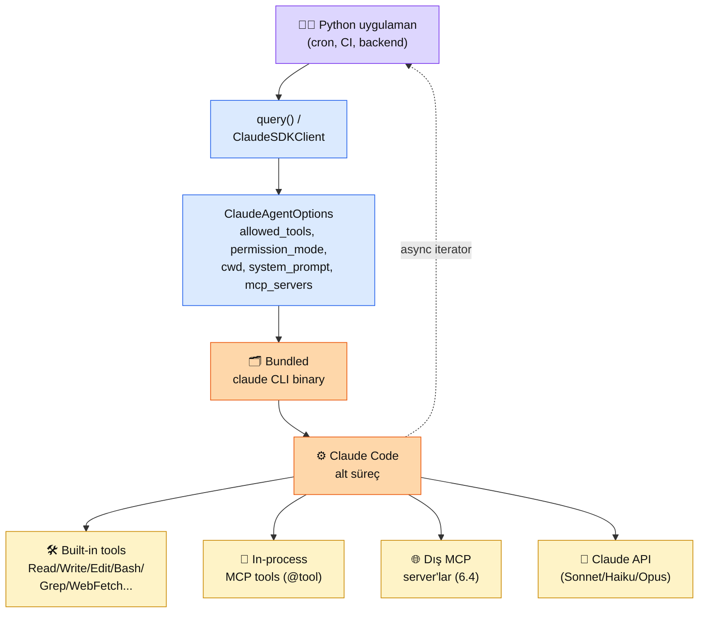

# 6.6 Claude Agent SDK — Anthropic'in Üst-düzey Ajan Çerçevesi

<div class="ma-meta" markdown>
<div class="ma-meta-row" markdown>
<strong>Kim için:</strong>
<span class="ma-persona ma-persona-baslangic">🟢 başlangıç</span>
<span class="ma-persona ma-persona-is">🔵 iş</span>
<span class="ma-persona ma-persona-kisisel">🟣 kişisel</span>
</div>
<div class="ma-meta-row"><strong>⏱️ Süre:</strong> ~30 dakika</div>
<div class="ma-meta-row"><strong>📋 Önkoşul:</strong> 6.2 (ham `anthropic` SDK + araç çağırma) + 6.4 (MCP sunucusu) bitmiş; Python 3.10+; `ANTHROPIC_API_KEY` ortam değişkeni aktif</div>
<div class="ma-meta-row"><strong>🎯 Çıktı:</strong> `claude-agent-sdk`'nın **ham `anthropic` SDK'dan nasıl farklı olduğunu** karar matrisi ile ayırıyorsun; `query()` ile tek seferlik ajan görevi koşturuyorsun; `ClaudeSDKClient` + `@tool` ile **kendi süreç içi (in-process) MCP araçlarını** Claude Code ajanına eklemiş oluyorsun. Ne zaman bu SDK ne zaman ham SDK — karar pekişiyor.</div>
</div>

!!! tip "Yabancı kelime mi gördün?"
    Bu sayfadaki **kalın** teknik terimler (ajan döngüsü / agent loop, süreç içi / in-process, izin kipi / permission mode gibi) ilk geçişte hemen yanında veya altında Türkçe açıklanır.

## Neden bu sayfa?

6.2'de ham `anthropic` SDK ile araç çağırma yazdın — `messages.create()` çağrısı, `tool_use` bloğunu ayrıştır, `tool_result` geri yolla, `while` döngüsünü elle yaz. Güçlü ama **şablon kodu (boilerplate)** yüksek; dosya sistemi, bash, web gibi "ajanın dış dünyayla etkileşim" araçlarını **sen kodluyorsun**. `claude-agent-sdk` farklı bir soru cevaplıyor: "Claude Code zaten bir ajan — dosya/bash/web/MCP/alt ajan hepsi hazır. Bunu kendi Python kodumdan **başlatabilir miyim?**" Cevap: evet, bu SDK o başlatıcı.

İkincisi: Adı "Claude Agent SDK" yanıltıcı. **Bu yeni bir ajan çatısı değil** — Anthropic'in `anthropic` SDK'sının üstüne bir "agent framework" çıkmadı. `claude-agent-sdk` **Claude Code ikilisini (binary) gömüyor** (`pip install` sırasında otomatik geliyor), `query()` veya `ClaudeSDKClient` ile Claude Code'u alt süreç olarak başlatıyor, mesajları asenkron iteratör olarak döndürüyor. Zihinsel model: "Claude Desktop'ı kod içinden kullanmak" — Claude Code sürümü.

Üçüncüsü: 2026 itibarıyla AI Engineer iş ilanlarında üç kullanım alanı öne çıkıyor — **(a)** CI/CD hattında otomatik kod düzeltme, **(b)** zamanlanmış (cron) veri analizi ajanı, **(c)** IDE eklentisi/arka uç otomasyonu. Üçünün de ortak iskeleti `claude-agent-sdk`. Ham SDK ile kurmak 500+ satır; bu SDK ile 50 satır. **Nerede hangisi** kararının teknik temeli bu sayfada.

## claude-agent-sdk kısaca — üç paragraf, matematiksiz

**İki ana giriş noktası: `query()` ve `ClaudeSDKClient`.** `query()` **asenkron iteratör** döner — tek sorgu, Claude Code alt süreç başlar, mesajlar akış olarak gelir, süreç biter. **Durumsuz (stateless)**. `ClaudeSDKClient` ise **kalıcı etkileşimli oturum** — çift yönlü; aynı oturumda çoklu tur, kullanıcı araya mesaj atabilir, özel araçlar + hook'lar tanımlanabilir. Basit görev = `query()`, karmaşık etkileşim = `ClaudeSDKClient`.

**Yerleşik (built-in) araç seti hazır geliyor.** `Read`, `Write`, `Edit`, `Bash`, `Grep`, `Glob`, `WebFetch`, `WebSearch` — Claude Code'un tüm araçları varsayılan aktif. `allowed_tools` ile beyaz liste (otomatik onay); `disallowed_tools` ile kara liste; `permission_mode` ile onay davranışı: `'default'` (her araç çağrısında sor), `'acceptEdits'` (dosya değişikliklerini otomatik onayla), `'bypassPermissions'` (hepsi otomatik — tehlikeli, sandbox'ta kullan). İzin katmanı Anthropic'in "ajan güvenlik 3 ilkesi"nin (6.5) programatik karşılığı.

**Özel araç = süreç içi MCP sunucusu.** `@tool` dekoratörü + `create_sdk_mcp_server()` ile **aynı Python süreci içinde** MCP sunucusu açarsın — 6.4'teki alt süreç MCP sunucusunun süreç içi sürümü. Avantaj: ağ yok, JSON serileştirme yükü düşük, paylaşılan bellek (araç fonksiyonları ana kodun durumuna erişir). Dezavantaj: alt süreç yalıtımı yok (çöküş = tüm ajan çöker). Özellikle `ClaudeSDKClient` + özel araç ikilisi Python öncelikli ajan geliştirme için güçlü.

## Bu sayfanın ekosistemi — SDK'dan Claude Code'a

<div class="ma-ekosistem" markdown>
<div class="ma-ekosistem-header">🗺️ Ekosistem — Python koddan alt süreç Claude Code'a</div>



<table class="ma-aktorler" markdown>

| Düğüm | Nerede | Ne iş yapıyor |
|---|---|---|
| 👩‍💻 **Python uygulaman** | CI script, cron job, backend | Agent görevini tetikler; `query()` ya da `ClaudeSDKClient` çağırır |
| `query()` / `ClaudeSDKClient` | `claude_agent_sdk` paketi | Agent API — iterator veya interactive oturum |
| **ClaudeAgentOptions** | Dataclass | Davranış ayarları — allowed_tools, permission_mode, cwd, system_prompt, mcp_servers |
| 🗂 **Bundled CLI** | `pip install` ile gelir | Harici Claude Code kurulumu gerekmez (opsiyonel override) |
| ⚙️ **Claude Code alt süreç** | subprocess | Gerçek agent loop burada; stdin/stdout JSON-RPC |
| 🛠 **Built-in tools** | Claude Code içinde | Read, Write, Edit, Bash, Grep, Glob, WebFetch, WebSearch, Task (subagent), … |
| 🔌 **In-process MCP** | Aynı Python süreci | `@tool` + `create_sdk_mcp_server()` — subprocess yok |
| 🌐 **Dış MCP server'lar** | Ayrı süreçler / HTTP | 6.4'teki yazdıkların — `options.mcp_servers` ile enjekte |
| 🤖 **Claude API** | Anthropic cloud | LLM cevabı — Sonnet/Haiku/Opus seçimi |

</table>
</div>

## Uygulama — iki yol

### Yol A — `query()` ile tek seferlik görev (15 dk)

Senaryo: Repo'daki tüm `TODO:` yorumlarını listele ve özetini döndür.

```bash
pip install "claude-agent-sdk>=0.1.65" anyio
```

```python
"""TODO tarama agent'ı — claude-agent-sdk ile 25 satır."""

import anyio
from claude_agent_sdk import query, ClaudeAgentOptions, AssistantMessage, TextBlock


async def main():
    options = ClaudeAgentOptions(
        system_prompt=(
            "Sen kod review asistanısın. Verilen dizinde tüm TODO: ve FIXME: "
            "yorumlarını bul, dosya + satır numarası + tek cümlelik özetle raporla. "
            "Türkçe markdown tablo formatında sun."
        ),
        allowed_tools=["Grep", "Read", "Glob"],  # yazma/edit YASAK
        permission_mode="default",
        cwd="/root/muhendisal-platform",
        max_turns=5,
    )

    prompt = "Bu repo'da tüm TODO ve FIXME yorumlarını tara ve tablo halinde raporla."

    async for msg in query(prompt=prompt, options=options):
        if isinstance(msg, AssistantMessage):
            for block in msg.content:
                if isinstance(block, TextBlock):
                    print(block.text)


if __name__ == "__main__":
    anyio.run(main)
```

**Kritik tasarım kararları (CTO notu):**

- **`allowed_tools` readonly liste.** Tarama görevi yazma/silme gerektirmez — `Grep`, `Read`, `Glob` yeter. Minimum permission ilkesi (6.5).
- **`permission_mode="default"`.** `bypassPermissions` değil — `Read`/`Grep` bile olsa Claude Code izin sorar; CI/CD için `acceptEdits` uygun değil (dosya değişikliği yok), `default` sandbox testinde doğru.
- **`max_turns=5`.** Sonsuz döngü koruması. Agent 5 turda bitmezse durur — maliyet + zaman kontrolü.
- **`cwd` mutlak yol.** Agent çalışacağı dizin; repo dışına çıkmaması için.

### Yol B — `ClaudeSDKClient` + in-process custom tool (30 dk)

Senaryo: Agent TCMB kurunu çekip bir bütçe dosyasına TL karşılığı yazsın. TCMB API'si için **custom tool** tanımlıyorsun (Claude Code'da default yok).

```python
"""Bütçe agent'ı — in-process MCP tool + interactive oturum."""

import anyio
import httpx
import xml.etree.ElementTree as ET
from claude_agent_sdk import (
    ClaudeSDKClient, ClaudeAgentOptions,
    tool, create_sdk_mcp_server,
    AssistantMessage, TextBlock, ResultMessage,
)


# ── Custom tool: TCMB güncel kur ───────────────────────────────
@tool(
    name="tcmb_kuru",
    description=(
        "Türkiye Merkez Bankası güncel kuru döndürür. "
        "Kullanıcı 'dolar', 'euro', 'kur', 'TCMB' dediğinde çağrılır."
    ),
    input_schema={
        "type": "object",
        "properties": {
            "para": {
                "type": "string",
                "enum": ["USD", "EUR", "GBP", "CHF", "SAR"],
                "description": "Hedef para birimi",
            }
        },
        "required": ["para"],
    },
)
async def tcmb_kuru(args: dict) -> dict:
    url = "https://www.tcmb.gov.tr/kurlar/today.xml"
    async with httpx.AsyncClient(timeout=10) as c:
        r = await c.get(url)
        r.raise_for_status()
    root = ET.fromstring(r.text)
    for curr in root.findall("Currency"):
        if curr.get("CurrencyCode") == args["para"]:
            return {
                "content": [{
                    "type": "text",
                    "text": (
                        f"{args['para']}/TRY  "
                        f"Alış: {curr.findtext('ForexBuying')}  "
                        f"Satış: {curr.findtext('ForexSelling')}  "
                        f"Tarih: {root.get('Tarih','')}"
                    ),
                }]
            }
    return {"content": [{"type": "text", "text": f"{args['para']} bulunamadı"}]}


# ── In-process MCP server oluştur ──────────────────────────────
kur_server = create_sdk_mcp_server(
    name="kur-tools", version="1.0.0", tools=[tcmb_kuru],
)


async def main():
    options = ClaudeAgentOptions(
        system_prompt=(
            "Sen finans asistanısın. TCMB kurunu al, kullanıcının istediği "
            "tutarı TL'ye çevir, sonucu bütçe dosyasına ekle."
        ),
        mcp_servers={"kur": kur_server},
        allowed_tools=[
            "mcp__kur__tcmb_kuru",  # custom tool namespace: mcp__<server>__<tool>
            "Read", "Write", "Edit",
        ],
        permission_mode="acceptEdits",
        cwd="/tmp/butce-demo",
        max_turns=8,
    )

    async with ClaudeSDKClient(options=options) as client:
        # 1. tur — kuru al + bütçe yaz
        await client.query(
            "1000 USD'nin güncel TL karşılığını TCMB'den al ve "
            "butce.md dosyasına '## Dolar bakiyesi' başlığı altına işle."
        )
        async for msg in client.receive_response():
            if isinstance(msg, AssistantMessage):
                for b in msg.content:
                    if isinstance(b, TextBlock):
                        print("[Claude]", b.text[:200])
            elif isinstance(msg, ResultMessage):
                print(f"[bitti] turn_count={msg.num_turns} cost=${msg.total_cost_usd:.4f}")

        # 2. tur — aynı oturumda takip sorusu
        await client.query("EUR için de aynısını yap.")
        async for msg in client.receive_response():
            if isinstance(msg, ResultMessage):
                print(f"[bitti-2] cost=${msg.total_cost_usd:.4f}")


if __name__ == "__main__":
    anyio.run(main)
```

**Üç önemli nokta:**

- **In-process MCP tool namespace:** `mcp__<server_adı>__<tool_adı>` — `allowed_tools` bu isimle filtreler. Claude Code'un built-in tool'larından ayırt etmek için.
- **`ClaudeSDKClient` async context manager.** `async with` bloğu içinde agent alt süreci ayakta; çıkınca kapanır. Kaynak sızıntısı yok.
- **`ResultMessage.total_cost_usd`** — her turda Claude Code maliyet bildirir. Production agent için **birinci metrik**; budget cap alarmı buradan kurulur.

## Ham `anthropic` SDK vs `claude-agent-sdk` — karar matrisi

Bu sayfanın özeti: **aynı göreve iki farklı yaklaşım**. Seçim senaryoya bağlı.

| Boyut | Ham `anthropic` SDK (6.2) | `claude-agent-sdk` (bu sayfa) |
|---|---|---|
| **Ne yapar** | Claude API'ye doğrudan HTTP çağrısı | Claude Code alt süreci başlatıp iteratör döner |
| **Kontrol düzeyi** | Her mesaj + araç çağrısı senin elinde | Claude Code ajan döngüsünü yönetir |
| **Yerleşik araç** | Yok — hepsini sen yazarsın | Read/Write/Edit/Bash/Grep/Glob/WebFetch/WebSearch/Task |
| **Özel araç** | `tools=[...]` JSON Şeması elle | `@tool` dekoratörü + süreç içi MCP sunucusu |
| **MCP entegrasyonu** | Yok (elle MCP istemcisi yazman gerek) | Yerleşik — `mcp_servers=` ile doğrudan |
| **Alt ajan** | Yok (elle `asyncio.gather` 6.5) | `Task` aracı yerleşik — Claude Code alt ajan devretme |
| **İzin katmanı** | Sen kurarsın | Yerleşik (`allowed_tools`, `permission_mode`) |
| **Dayanıklı yürütme (durable)** | Yok | Kısmen (alt süreç çökünce yeni başlat) |
| **Maliyet görünürlüğü** | `response.usage` elle topla | `ResultMessage.total_cost_usd` otomatik |
| **Şablon kodu** | Yüksek (~500 satır ajan) | Düşük (25-50 satır) |
| **Çıkış biçimi** | Tam metin kontrolü | Claude Code davranış kalıbı |
| **Ne zaman seç** | Kendi uygulamanda **sohbet/içerik** (müşteri destek, içerik üretim, RAG) — her token'da kontrol gerekli | **Otonom iş**: CI/CD, cron ajan, IDE eklenti, veri analizi — dosya + bash + web zaten gerekli |

**Pratik kural (CTO):** Ajan dosya sistemi + bash + web **kullanacaksa** → `claude-agent-sdk`. Kullanmayacaksa → ham SDK; ayrıca maliyet kontrolün ~%30 daha iyi olacak. HBV chatbot (4.8) → ham SDK; CI'da kod düzelten ajan → `claude-agent-sdk`.

## CTO tuzakları

| Tuzak | Sonucu | Çözüm |
|---|---|---|
| **`bypassPermissions`'i üretimde kullanmak** | Ajan `rm -rf` yapabilir veya veri sızdırabilir | Asla — `default` veya `acceptEdits`; yüksek risk için özel `can_use_tool` geri çağırma |
| **`allowed_tools` atlamak** | Ajan beklenmedik araç kullanır (WebFetch, Bash) | Her zaman **beyaz liste** yaz; sadece ihtiyaç duyulanlar |
| **`max_turns` unutmak** | Sonsuz döngü, token patlar | Her görev için üst sınır belirle (5–20 tipik) |
| **`cwd` göreli ya da geniş** | Ajan repo dışına çıkar, sistem dosyalarına dokunur | Her zaman mutlak yol + proje sınırlı dizin |
| **Süreç içi araçta `raise`** | Ajan süreci çöker (alt süreç yalıtımı yok) | `try/except` + `{"content": [{"type":"text","text":"hata: ..."}]}` dön |
| **`total_cost_usd`'yi yok saymak** | Ay sonu sürprizi | Her `ResultMessage`'da günlüğe yaz + bütçe üst sınırı kontrolü |
| **Adını "Anthropic Agent Çerçevesi" sanmak** | Ham SDK yerine buna dayandırmak | Yanlış zihinsel model — bu Claude Code başlatıcısı; ham SDK farklı araç |
| **Yerleşik araca özel mantık eklemek** | Claude Code davranışını ezmeye çalışmak | `PreToolUse` hook ile önle / `disallowed_tools` ile kapat — ezme yok |
| **MCP sunucusunu dış süreç zorlamak** | Performans düşer (JSON serileştirme, alt süreç) | Sadece Python ile konuşan araçlar için `create_sdk_mcp_server` (süreç içi); dış servisler için 6.4 |

??? warning "Tipik claude-agent-sdk hataları — şu durum şu çözüm"

    | Hata | Sebep | Çözüm |
    |---|---|---|
    | `FileNotFoundError: claude` | Bundled CLI kurulmamış / yol yanlış | `pip install -U claude-agent-sdk`; veya `cli_path="/usr/local/bin/claude"` |
    | "Permission denied: Read" | `allowed_tools` listesinde Read yok | Listeyi güncelle veya `permission_mode="acceptEdits"` |
    | Custom tool çağrılmıyor | `allowed_tools`'a `mcp__<server>__<tool>` adı eklenmedi | Namespace formatına dikkat: `mcp__kur__tcmb_kuru` |
    | Sonsuz tur (turn) | `max_turns` set edilmemiş | `ClaudeAgentOptions(max_turns=10)` |
    | `total_cost_usd` çok yüksek | Sonnet+Opus yerine sadece Opus kullanılıyor | `model="claude-sonnet-4-6"` set et; ya da Haiku 4.5 |
    | Async iterator boşa dönüyor | `await client.query()`'i çağırdın ama `receive_response()`'i tüketmedin | `async for msg in client.receive_response():` ile döngü kur |

<div class="ma-anthropic-oz" markdown>
<div class="ma-anthropic-oz-header">📖 Anthropic bu konuyu nasıl anlatıyor — öz</div>

Anthropic `claude-agent-sdk`'yı [platform.claude.com/docs/agent-sdk/python](https://platform.claude.com/docs/en/agent-sdk/python) altında canonical olarak dokümante ediyor. Python SDK son stabil **v0.1.65** (22 Nisan 2026 PyPI — hızlı sürüm hatlı); TypeScript eşi `@anthropic-ai/claude-agent-sdk` aynı API prensibi.

**1. SDK'nın ekosistemdeki yeri Claude Code ailesi içinde.** Anthropic'in "5-katman mimarisi"nde (6.5) Claude Code **Agent** katmanında oturuyor; `claude-agent-sdk` bu katmana programatik arayüz veriyor. Skills (`.claude/skills/`) ve Subagents (`.claude/agents/`) Claude Code dosya konvansiyonları — SDK da aynı dosyaları okuyor. Yani SDK Claude Code'a alternatif değil, Claude Code'un kendisi.

**2. In-process MCP server desen değişimi.** 6.4'te subprocess MCP server yazdın (stdio ya da HTTP). SDK'daki `create_sdk_mcp_server` aynı konsepti **süreç içinde** çalıştırıyor — MCP spec'ine uyumlu ama transport yok. Tool'ların ana uygulamanın state'ine erişimi olduğu için **session-scoped** iş yükleri (kullanıcıya özgü DB connection, auth context) için ideal.

**3. Permission + Hook sistemi güvenlik katmanı.** `permission_mode` 3 değer (default/acceptEdits/bypassPermissions) + tool-bazlı `can_use_tool` callback + hook'lar (`PreToolUse`, `PostToolUse`, `Notification`) → Anthropic'in güvenlik 3 ilkesini (min permission, reversible, human-in-the-loop) programatik karşılar. Prod agent için bu üç katman olmadan deploy etmek = fault injection.

??? info "Teknik detay — isteyene (middleware, streaming, subagents, deploy)"

    **Streaming davranışı.** `query()` async iterator mesaj-bazlı yield eder — `AssistantMessage` (ara düşünce), `ToolUseBlock` (tool çağrısı), `ToolResultBlock` (sonuç), `ResultMessage` (final özet + cost). CLI UI'sında görünen her şey mesaj olarak gelir; filtreleyerek kullan.

    **`ResultMessage` alanları.** `total_cost_usd`, `num_turns`, `session_id`, `duration_ms`, `usage` (input/output tokens). Prod observability için LangFuse/Helicone'a bu mesajı göndermek standart.

    **Subagent kullanımı.** `options.system_prompt`'ta "use the Task tool to delegate X" deyince Claude Code `Task` built-in tool'unu çağırıp alt-süreç açar; context isolation otomatik. Custom subagent için `.claude/agents/<ad>.md` dosyası (6.5 Yol B) — SDK bu klasörü okur.

    **`cli_path` override.** Bundled CLI yerine system-wide kurulumu kullanmak için `ClaudeAgentOptions(cli_path="/usr/local/bin/claude")`. Production'da sürüm pinleme için önerilir.

    **Hook'lar.** `ClaudeAgentOptions(hooks={"PreToolUse": [...], "PostToolUse": [...]})` — tool çağrısı öncesi/sonrası callback. Kullanım: izin denetimi, audit log, input sanitizasyonu, çıktı validasyonu.

    **Model seçimi.** `ClaudeAgentOptions(model="claude-sonnet-4-6")` — varsayılan `claude-sonnet-4-6`; ucuz görev için `claude-haiku-4-5`; ağır analiz için `claude-opus-4-7`. Heterojen maliyet optimizasyonu (6.5 CTO Kararı) burada da geçerli.

    **OpenTelemetry.** `pip install claude-agent-sdk[otel]` → traces otomatik export. Prod multi-agent observability için altyapı hazır geliyor.

    **Deployment.** Typical: Docker image + `uv` + scheduled cron (GitHub Actions, Kubernetes CronJob, Airflow) + Slack/email notification hook'u + budget alert.

<div class="ma-anthropic-oz-kaynak" markdown>
**Kaynak:** [platform.claude.com/docs/agent-sdk/python](https://platform.claude.com/docs/en/agent-sdk/python) (EN, canonical dokümantasyon — `query()`, `ClaudeSDKClient`, options + examples). Kod: [GitHub — anthropics/claude-agent-sdk-python](https://github.com/anthropics/claude-agent-sdk-python) (`examples/` klasörü — MCP calculator, custom tools, hooks demo). Pekiştirme: [Anthropic Academy — Introduction to Agent Skills](https://www.anthropic.com/learn) (~45 dk, ücretsiz, sertifikalı) — SDK'nın Skills katmanıyla (`.claude/skills/`) nasıl kesişir. TypeScript eşi: [@anthropic-ai/claude-agent-sdk](https://www.npmjs.com/package/@anthropic-ai/claude-agent-sdk) — Node ekosisteminde aynı API.
</div>
</div>

<div class="ma-cikti-kaniti" markdown>
### 📦 Bu sayfayı bitirdiğini nasıl kanıtlarsın

#### 1. 📝 Refleksiyon yazısı — 5 dakika

> "Seçtiğim görev: [...]. Ham SDK mi agent SDK mi — karar matrisinde [hangi sinyal] ağır bastı. Kullandığım `ClaudeAgentOptions` alanları: [allowed_tools/permission_mode/cwd/max_turns]. In-process tool yazdım mı: [evet/hayır]; yazdımsa adı + input_schema: [...]. `ResultMessage.total_cost_usd` sonuç: \$[...]. Aynı görevi ham SDK'yla yapsaydım ek satır sayısı tahminim: [...]."

Kaydet: `muhendisal-notlarim/bolum-6/06-claude-sdk/refleksiyon.txt`

#### 2. 📸 Konsol kaydı — 5 dakika

**Neyin görüntüsü:** Yol A veya Yol B çıktısı — `[Claude] ...` + tool çağrıları + `[bitti] turn_count=X cost=$Y` satırı görünür olsun. Maliyet satırı kritik: "agent SDK prod'da bütçe görünür" kanıtı.

Kaydet: `muhendisal-notlarim/bolum-6/06-claude-sdk/konsol-cikti.png`

#### 3. 💻 Kendi alan projen + GitHub — 30 dakika

Kendi iş/proje bağlamında `claude-agent-sdk` kullanan **tek görev scripti**: repository health check, dependency audit, doc freshness scanner, test coverage reporter — seçim senin. Readonly allowlist + `max_turns=10` + maliyet log. README'de: (a) görev tanımı, (b) kullanılan tool seti + nedeni, (c) 3 örnek çalıştırma sonucu tablosu, (d) ham SDK alternatifi ile karşılaştırma notu (kaç satır, hangi yol daha iyi, neden).

Repo linkini kaydet: `muhendisal-notlarim/bolum-6/06-claude-sdk/proje-repo.txt`

</div>

<div class="ma-neden-sonuc" markdown>
<div class="ma-neden-sonuc-header">🔗 Birlikte okuma — neden ne oldu</div>

<ol class="ma-neden-sonuc-zincir" markdown>
<li>**A → B:** Ham SDK (6.2) agent için **boilerplate yüksek** — file/bash/web/MCP/subagent elle yazılıyor. `claude-agent-sdk` Claude Code'u alt süreç olarak başlatır; bu kapasiteler **hazır gelir.** Bu yüzden **SDK seçimi iş yüküne göre.**</li>
<li>**B → C:** SDK adı 'Agent SDK' **yanıltıcı değil ama spesifik** — yeni bir agent framework değil, Claude Code'un programatik arayüzü. Bu yüzden **ne olduğunu net anlamak şart.**</li>
<li>**C → D:** İki giriş noktası: `query()` tek seferlik iterator + `ClaudeSDKClient` interactive oturum + custom tools. Bu yüzden **kullanım senaryosu giriş noktasını belirler.**</li>
<li>**D → E:** `@tool` + `create_sdk_mcp_server` = **in-process MCP server** — 6.4'teki subprocess MCP'nin aynı süreç içi versiyonu. Bu yüzden **MCP bilgisi burada da işe yarar.**</li>
<li>**E → F:** Karar matrisi: **chat/content** = ham SDK; **otonom iş** (CI/CD, cron, IDE) = `claude-agent-sdk`. Bu yüzden **doğru SDK yanlış araç seçimini önler.**</li>
<li>**F → G:** `ResultMessage.total_cost_usd` + `permission_mode` + `allowed_tools` → prod agent'ın üç temel güvenlik/maliyet direkt. Bu yüzden **üretimde bu üçü zorunlu.**</li>
</ol>

<div class="ma-neden-sonuc-sonuc" markdown>
**Sonuç:** Anthropic'in Claude Code tarafındaki gücü (subagent + MCP + built-in tools) artık Python/TypeScript kodundan 50 satırda sürülebilir. Hangi SDK ne zaman: kendi uygulamanda chat → ham; dosya+bash+web otonom iş → agent SDK. 6.7'de LangChain/LangGraph'a geçip **üçüncü seçeneği** — provider-agnostic, durable execution, HITL ihtiyaçları olan framework dünyasını — eksiksiz karşılaştıracağız. Üç SDK karar matrisi 6.7 sonunda tamamlanmış olacak.
</div>
</div>

<div class="ma-sonraki" markdown>
<div class="ma-sonraki-header">➡️ Sonraki adım</div>

**[6.7 LangChain Agents →](07-langchain.md)** — LangChain 1.x + LangGraph 1.x modern dönem: `create_agent` high-level + `StateGraph` low-level. Ne zaman framework + ne zaman ham/agent SDK.

← [6.5 Multi-Agent Sistemler](05-multi-agent.md) &nbsp;|&nbsp; [Bölüm 6 girişi](index.md) &nbsp;|&nbsp; [Ana sayfa](../index.md)

**Pekiştirme:** Anthropic Academy [Introduction to Agent Skills](https://www.anthropic.com/learn) kursunu aç (~45 dk, ücretsiz, sertifikalı). Skills Claude Code'un **görev-özgü bilgi paketi** katmanı (`.claude/skills/`); SDK bu dosyaları otomatik okur. Agent SDK + Skills birlikte okunduğunda "prod otomasyon agent'ı nasıl paketlenir" sorusu netleşir.
</div>
